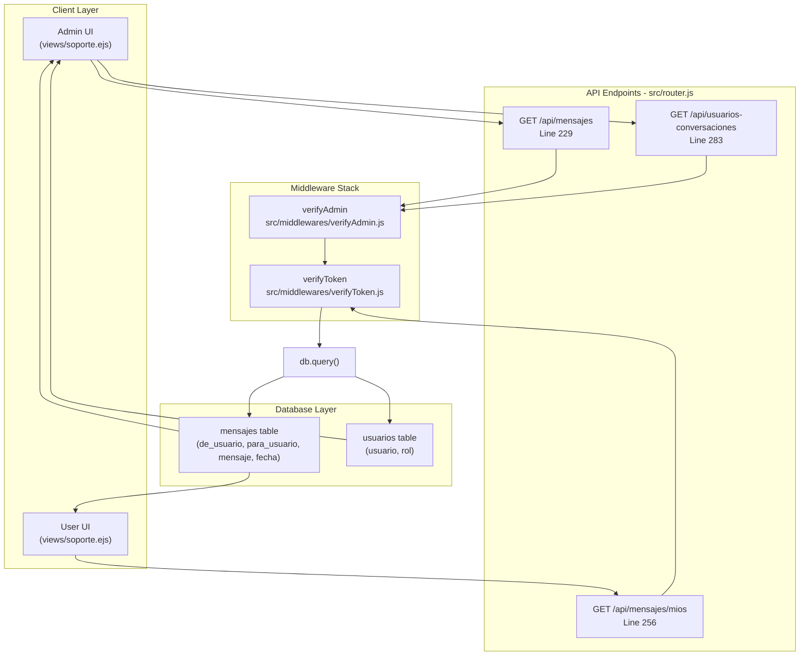
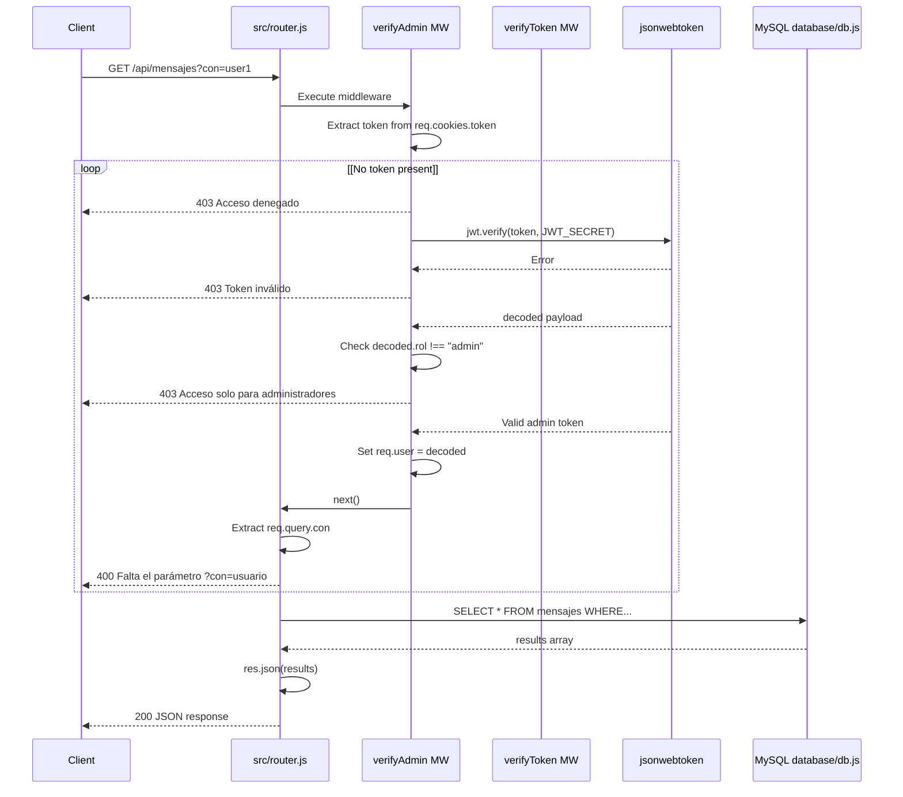
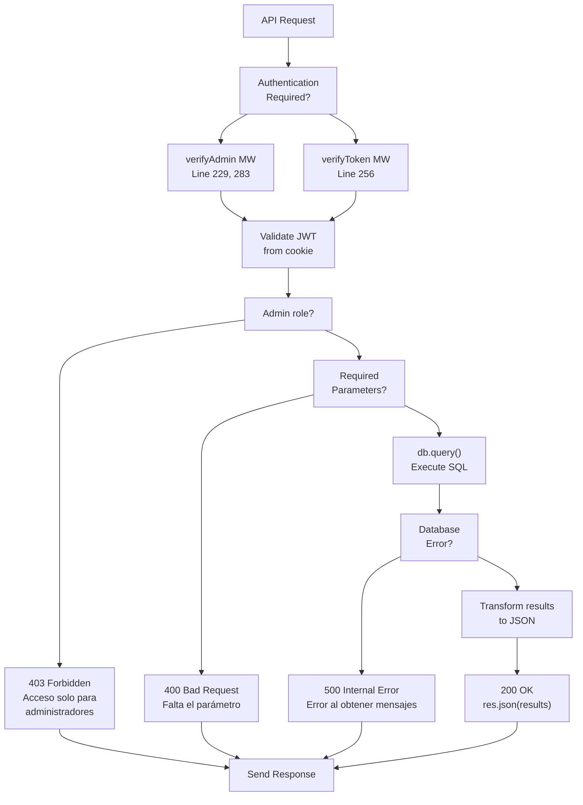
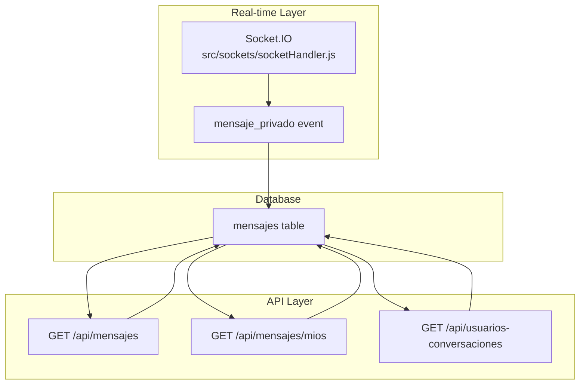

# API Endpoints

> **Relevant source files**
> * [src/middlewares/verifyAdmin.js](https://github.com/moichuelo/registro/blob/544abbcc/src/middlewares/verifyAdmin.js)
> * [src/router.js](https://github.com/moichuelo/registro/blob/544abbcc/src/router.js)

## Purpose and Scope

This document describes the RESTful API endpoints in the registro-sesiones application that return JSON data for programmatic consumption. These endpoints primarily support the real-time chat system by providing message history and conversation management functionality.

For HTTP routes that render HTML views, see [Public Routes](/moichuelo/registro/5.1-public-routes) and [Protected Routes](/moichuelo/registro/5.2-protected-routes). For WebSocket-based real-time messaging events, see [WebSocket Events](/moichuelo/registro/15.2-websocket-events).

## Overview

The application exposes three JSON API endpoints, all located in [src/router.js](https://github.com/moichuelo/registro/blob/544abbcc/src/router.js)

 and protected by authentication middleware:

| Endpoint | Method | Authentication | Purpose |
| --- | --- | --- | --- |
| `/api/mensajes` | GET | Admin only (`verifyAdmin`) | Retrieve message history for a specific user |
| `/api/mensajes/mios` | GET | Authenticated user (`verifyToken`) | Retrieve all messages for the current user |
| `/api/usuarios-conversaciones` | GET | Admin only (`verifyAdmin`) | List all users with active conversations |

All endpoints return JSON responses and query the `mensajes` table in the MySQL database.

**Sources:** [src/router.js L229-L315](https://github.com/moichuelo/registro/blob/544abbcc/src/router.js#L229-L315)

## API Architecture



**Sources:** [src/router.js L229-L315](https://github.com/moichuelo/registro/blob/544abbcc/src/router.js#L229-L315)

 [src/middlewares/verifyAdmin.js L1-L45](https://github.com/moichuelo/registro/blob/544abbcc/src/middlewares/verifyAdmin.js#L1-L45)

## Message Retrieval Endpoints

### GET /api/mensajes (Admin)

Retrieves the complete message history for a conversation with a specific user. This endpoint is restricted to administrators and requires a query parameter to specify the target user.

**Authentication:** Requires `verifyAdmin` middleware [src/middlewares/verifyAdmin.js L24-L42](https://github.com/moichuelo/registro/blob/544abbcc/src/middlewares/verifyAdmin.js#L24-L42)

**Request Format:**

```
GET /api/mensajes?con=username
```

**Query Parameters:**

| Parameter | Type | Required | Description |
| --- | --- | --- | --- |
| `con` | string | Yes | Username of the conversation participant |

**Implementation Details:**

The endpoint executes a SQL query that retrieves all messages where the specified user is either the sender or recipient, ordered chronologically:

[src/router.js L236-L242](https://github.com/moichuelo/registro/blob/544abbcc/src/router.js#L236-L242)

```sql
SELECT de_usuario, para_usuario, mensaje, fecha
FROM mensajes
WHERE (de_usuario = ? OR para_usuario = ?)
ORDER BY fecha ASC
```

**Response Format:**

```json
[
  {
    "de_usuario": "user1",
    "para_usuario": "admin1",
    "mensaje": "Hello, I need help",
    "fecha": "2024-01-15T10:30:00.000Z"
  },
  {
    "de_usuario": "admin1",
    "para_usuario": "user1",
    "mensaje": "How can I help you?",
    "fecha": "2024-01-15T10:31:00.000Z"
  }
]
```

**Error Responses:**

| Status Code | Condition | Response Body |
| --- | --- | --- |
| 400 | Missing `con` parameter | `{"error": "Falta el parámetro ?con=usuario"}` |
| 403 | Not an admin | `{"error": "Acceso solo para administradores"}` |
| 500 | Database error | `{"error": "Error al obtener mensajes"}` |

**Sources:** [src/router.js L229-L253](https://github.com/moichuelo/registro/blob/544abbcc/src/router.js#L229-L253)

### GET /api/mensajes/mios (User)

Retrieves all messages for the currently authenticated user. This endpoint is accessible to any authenticated user and automatically uses the username from the JWT token.

**Authentication:** Requires `verifyToken` middleware [src/middlewares/verifyToken.js](https://github.com/moichuelo/registro/blob/544abbcc/src/middlewares/verifyToken.js)

**Request Format:**

```
GET /api/mensajes/mios
```

**Query Parameters:** None (user identity extracted from JWT)

**Implementation Details:**

The endpoint extracts the username from `req.user.user` (populated by `verifyToken`) and queries for all messages involving that user:

[src/router.js L256-L269](https://github.com/moichuelo/registro/blob/544abbcc/src/router.js#L256-L269)

The SQL query is identical in structure to the admin endpoint but uses the authenticated user's identity:

```sql
SELECT de_usuario, para_usuario, mensaje, fecha
FROM mensajes
WHERE (de_usuario = ? OR para_usuario = ?)
ORDER BY fecha ASC
```

**Response Format:**

```json
[
  {
    "de_usuario": "currentUser",
    "para_usuario": "admin1",
    "mensaje": "I have a question",
    "fecha": "2024-01-15T14:20:00.000Z"
  },
  {
    "de_usuario": "admin1",
    "para_usuario": "currentUser",
    "mensaje": "Sure, ask away",
    "fecha": "2024-01-15T14:21:00.000Z"
  }
]
```

**Error Responses:**

| Status Code | Condition | Response Body |
| --- | --- | --- |
| 403 | No valid token or user not found | `{"error": "No autorizado"}` |
| 500 | Database error | `{"error": "Error interno"}` |

**Sources:** [src/router.js L256-L280](https://github.com/moichuelo/registro/blob/544abbcc/src/router.js#L256-L280)

## Conversation Management Endpoint

### GET /api/usuarios-conversaciones (Admin)

Returns a list of all non-admin users who have active conversations with administrators. This endpoint supports the admin UI's conversation list feature.

**Authentication:** Requires `verifyAdmin` middleware [src/middlewares/verifyAdmin.js L24-L42](https://github.com/moichuelo/registro/blob/544abbcc/src/middlewares/verifyAdmin.js#L24-L42)

**Request Format:**

```
GET /api/usuarios-conversaciones
```

**Query Parameters:** None

**Implementation Details:**

The endpoint uses a complex SQL query with `UNION` to find all distinct users who have either sent messages to admins or received messages from admins:

[src/router.js L292-L304](https://github.com/moichuelo/registro/blob/544abbcc/src/router.js#L292-L304)

```sql
SELECT DISTINCT usuario
FROM (
  SELECT de_usuario AS usuario FROM mensajes
  WHERE para_usuario IN (SELECT usuario FROM usuarios WHERE rol = 'admin')
  
  UNION
  
  SELECT para_usuario AS usuario FROM mensajes
  WHERE de_usuario IN (SELECT usuario FROM usuarios WHERE rol = 'admin')
) AS conversaciones
WHERE usuario NOT IN (SELECT usuario FROM usuarios WHERE rol = 'admin')
```

The query:

1. Finds users who sent messages to admins (`de_usuario`)
2. Finds users who received messages from admins (`para_usuario`)
3. Combines both sets with `UNION` (eliminating duplicates)
4. Filters out admin users themselves
5. Returns distinct usernames

The results are then transformed into a simple array of usernames:

[src/router.js L312-L313](https://github.com/moichuelo/registro/blob/544abbcc/src/router.js#L312-L313)

**Response Format:**

```json
[
  "user1",
  "user2",
  "user3"
]
```

**Error Responses:**

| Status Code | Condition | Response Body |
| --- | --- | --- |
| 403 | Not an admin | `{"error": "Acceso solo para administradores"}` |
| 500 | Database error | `{"error": "Error interno"}` |

**Sources:** [src/router.js L283-L315](https://github.com/moichuelo/registro/blob/544abbcc/src/router.js#L283-L315)

## Authentication Flow Diagram



**Sources:** [src/router.js L229-L253](https://github.com/moichuelo/registro/blob/544abbcc/src/router.js#L229-L253)

 [src/middlewares/verifyAdmin.js L24-L42](https://github.com/moichuelo/registro/blob/544abbcc/src/middlewares/verifyAdmin.js#L24-L42)

## API Request-Response Flow



**Sources:** [src/router.js L229-L315](https://github.com/moichuelo/registro/blob/544abbcc/src/router.js#L229-L315)

## Database Queries

### Message Query Pattern

Both `/api/mensajes` and `/api/mensajes/mios` use the same SQL query structure:

| Field | Purpose |
| --- | --- |
| `de_usuario` | Message sender username (FK to `usuarios.usuario`) |
| `para_usuario` | Message recipient username (FK to `usuarios.usuario`) |
| `mensaje` | Message content (TEXT) |
| `fecha` | Message timestamp (DATETIME) |

The query retrieves messages bidirectionally:

* Where the user is the sender (`de_usuario = ?`)
* OR where the user is the recipient (`para_usuario = ?`)

Results are ordered by `fecha ASC` to maintain chronological order.

**Sources:** [src/router.js L236-L242](https://github.com/moichuelo/registro/blob/544abbcc/src/router.js#L236-L242)

 [src/router.js L263-L269](https://github.com/moichuelo/registro/blob/544abbcc/src/router.js#L263-L269)

### Conversation List Query

The `/api/usuarios-conversaciones` endpoint uses a more complex query strategy:

1. **Subquery 1:** Find users who sent messages to any admin ```sql SELECT de_usuario AS usuario FROM mensajes WHERE para_usuario IN (SELECT usuario FROM usuarios WHERE rol = 'admin') ```
2. **Subquery 2:** Find users who received messages from any admin ```sql SELECT para_usuario AS usuario FROM mensajes WHERE de_usuario IN (SELECT usuario FROM usuarios WHERE rol = 'admin') ```
3. **Union:** Combine both result sets and eliminate duplicates
4. **Filter:** Exclude admin users from the final list ```sql WHERE usuario NOT IN (SELECT usuario FROM usuarios WHERE rol = 'admin') ```

This ensures the endpoint returns only regular users who have had any interaction with the admin team.

**Sources:** [src/router.js L292-L304](https://github.com/moichuelo/registro/blob/544abbcc/src/router.js#L292-L304)

## Error Handling

All API endpoints implement consistent error handling patterns:

### Error Response Structure

```json
{
  "error": "Error message in Spanish"
}
```

### Common Error Scenarios

| Error Type | Status Code | Handling Location |
| --- | --- | --- |
| Missing JWT token | 403 | `verifyToken` / `verifyAdmin` middleware |
| Invalid JWT token | 403 | `verifyToken` / `verifyAdmin` middleware |
| Insufficient permissions | 403 | `verifyAdmin` middleware |
| Missing query parameter | 400 | Route handler validation |
| Database query failure | 500 | Route handler catch block |

### Database Error Handling

All endpoints use the same pattern for database error handling:

[src/router.js L244-L248](https://github.com/moichuelo/registro/blob/544abbcc/src/router.js#L244-L248)

```javascript
db.query(sql, [params], (err, results) => {
    if (err) {
        console.error("❌ Error al consultar mensajes:", err);
        return res.status(500).json({ error: "Error al obtener mensajes" });
    }
    res.json(results);
});
```

The pattern:

1. Logs the error to console with emoji prefix for visibility
2. Returns a 500 status code
3. Sends a generic error message (does not leak internal details)
4. Prevents further execution with `return`

**Sources:** [src/router.js L244-L252](https://github.com/moichuelo/registro/blob/544abbcc/src/router.js#L244-L252)

 [src/router.js L271-L279](https://github.com/moichuelo/registro/blob/544abbcc/src/router.js#L271-L279)

 [src/router.js L306-L314](https://github.com/moichuelo/registro/blob/544abbcc/src/router.js#L306-L314)

## Integration with Socket.IO

These API endpoints complement the real-time WebSocket messaging system by providing historical message data:



**Workflow:**

1. New messages are sent via WebSocket `mensaje_privado` event
2. Socket handler persists messages to `mensajes` table
3. When user loads chat UI, API endpoints retrieve message history
4. Subsequent messages arrive in real-time via WebSocket
5. Admin can switch conversations using `/api/usuarios-conversaciones` list

**Sources:** [src/router.js L229-L315](https://github.com/moichuelo/registro/blob/544abbcc/src/router.js#L229-L315)

 [src/sockets/socketHandler.js](https://github.com/moichuelo/registro/blob/544abbcc/src/sockets/socketHandler.js)

## Usage Examples

### Admin Loading Conversation List

```javascript
// Called when admin opens support chat interface
fetch('/api/usuarios-conversaciones', {
    credentials: 'include'  // Include JWT cookie
})
.then(res => res.json())
.then(users => {
    // users = ["user1", "user2", "user3"]
    // Populate conversation list in UI
});
```

### Admin Loading Specific Conversation

```javascript
// Called when admin clicks on a user in the conversation list
function loadConversation(username) {
    fetch(`/api/mensajes?con=${username}`, {
        credentials: 'include'
    })
    .then(res => res.json())
    .then(messages => {
        // messages = [{de_usuario, para_usuario, mensaje, fecha}, ...]
        // Display message history in chat window
    });
}
```

### User Loading Own Messages

```javascript
// Called when regular user opens support chat
fetch('/api/mensajes/mios', {
    credentials: 'include'
})
.then(res => res.json())
.then(messages => {
    // Display all messages with admin(s)
});
```

**Sources:** [src/router.js L229-L315](https://github.com/moichuelo/registro/blob/544abbcc/src/router.js#L229-L315)