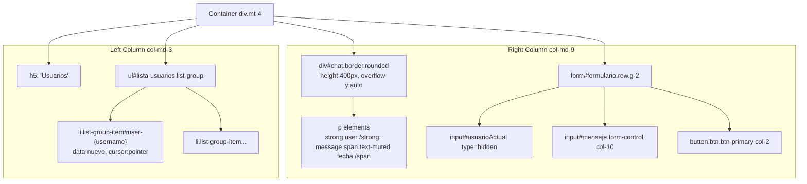
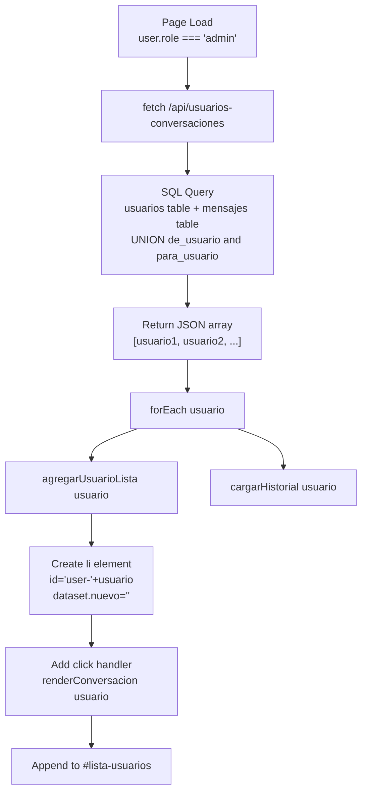
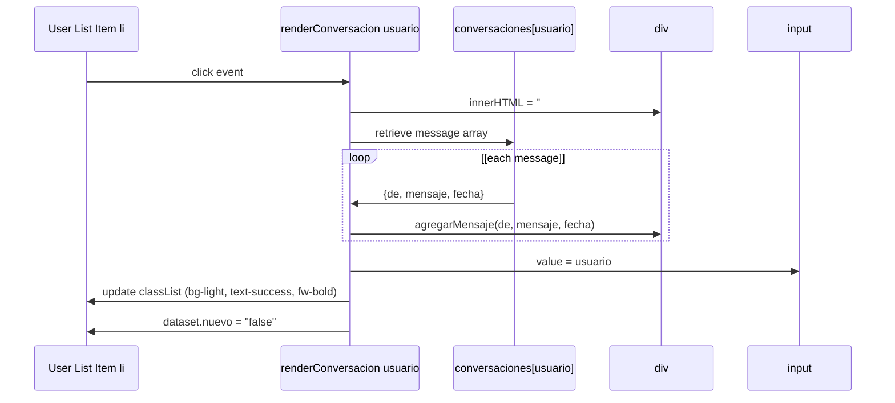

# Admin Chat Interface

> **Relevant source files**
> * [src/router.js](https://github.com/moichuelo/registro/blob/544abbcc/src/router.js)
> * [views/soporte.ejs](https://github.com/moichuelo/registro/blob/544abbcc/views/soporte.ejs)

## Purpose and Scope

This document describes the administrator chat interface for the support system. This interface allows administrators to view and manage multiple user conversations simultaneously through a multi-conversation UI with user selection, message history, and real-time notifications.

For the regular user chat interface, see [User Chat Interface](/moichuelo/registro/9.1-user-chat-interface). For the underlying real-time communication infrastructure and WebSocket event handling, see [Real-time Communication System](/moichuelo/registro/7-real-time-communication-system). For the HTTP API endpoints that support the chat functionality, see [API Endpoints](/moichuelo/registro/5.3-api-endpoints).

**Sources:** [views/soporte.ejs L8-L24](https://github.com/moichuelo/registro/blob/544abbcc/views/soporte.ejs#L8-L24)

 [views/soporte.ejs L62-L163](https://github.com/moichuelo/registro/blob/544abbcc/views/soporte.ejs#L62-L163)

## Interface Layout

The admin chat interface is rendered when `user.role === 'admin'` in the `/soporte` route. The layout consists of a two-column structure implemented using Bootstrap's grid system:

| Column | Width | Purpose |
| --- | --- | --- |
| User List | `col-md-3` | Displays list of users with active conversations |
| Chat Area | `col-md-9` | Shows message history and input form for selected conversation |

The interface includes the following DOM elements:

* `#lista-usuarios` - Unordered list (`<ul>`) containing user entries
* `#chat` - Scrollable container displaying messages for the selected user
* `#formulario` - Form for sending messages
* `#usuarioActual` - Hidden input storing the currently selected username
* `#mensaje` - Text input for composing messages

**Diagram: Admin Interface DOM Structure**



**Sources:** [views/soporte.ejs L8-L24](https://github.com/moichuelo/registro/blob/544abbcc/views/soporte.ejs#L8-L24)

 [views/soporte.ejs L54-L60](https://github.com/moichuelo/registro/blob/544abbcc/views/soporte.ejs#L54-L60)

## User List Management

The admin interface maintains a dynamically updated list of users who have active conversations. This list is populated on page load and updated when new messages arrive.

### Initial User List Loading

On page load, the interface fetches the list of users via the `/api/usuarios-conversaciones` endpoint:

```javascript
fetch("/api/usuarios-conversaciones")
    .then(res => res.json())
    .then(usuarios => {
        usuarios.forEach(usuario => {
            agregarUsuarioLista(usuario);
            cargarHistorial(usuario);
        });
    });
```

The `/api/usuarios-conversaciones` endpoint [src/router.js L283-L315](https://github.com/moichuelo/registro/blob/544abbcc/src/router.js#L283-L315)

 executes a SQL query that:

1. Finds all messages where the recipient is an admin (`para_usuario IN (SELECT usuario FROM usuarios WHERE rol = 'admin')`)
2. Finds all messages where the sender is an admin (`de_usuario IN (SELECT usuario FROM usuarios WHERE rol = 'admin')`)
3. Combines both result sets with `UNION`
4. Filters out admin usernames from the final list
5. Returns a distinct array of non-admin usernames

### Adding Users to the List

The `agregarUsuarioLista(usuario)` function [views/soporte.ejs L89-L102](https://github.com/moichuelo/registro/blob/544abbcc/views/soporte.ejs#L89-L102)

 creates list items with the following attributes:

* `id`: `"user-" + usuario` for unique identification
* `className`: `"list-group-item"`
* `dataset.nuevo`: Tracks whether the conversation has unread messages
* `style.cursor`: `"pointer"` for visual feedback
* Click event handler: Calls `renderConversacion(usuario)` to display the conversation

**Diagram: User List Population Flow**



**Sources:** [views/soporte.ejs L105-L112](https://github.com/moichuelo/registro/blob/544abbcc/views/soporte.ejs#L105-L112)

 [views/soporte.ejs L89-L102](https://github.com/moichuelo/registro/blob/544abbcc/views/soporte.ejs#L89-L102)

 [src/router.js L283-L315](https://github.com/moichuelo/registro/blob/544abbcc/src/router.js#L283-L315)

## Conversation Switching and History Loading

When an administrator clicks on a user in the list, the interface switches to that conversation by calling `renderConversacion(usuario)`.

### Conversation Rendering

The `renderConversacion(usuario)` function [views/soporte.ejs L69-L86](https://github.com/moichuelo/registro/blob/544abbcc/views/soporte.ejs#L69-L86)

 performs the following operations:

1. **Clear chat area**: `chat.innerHTML = ''`
2. **Retrieve messages**: Access `conversaciones[usuario]` array
3. **Render messages**: Call `agregarMensaje(de, mensaje, fecha)` for each message
4. **Update hidden input**: Set `usuarioActual.value = usuario`
5. **Update visual state**: * Remove all styling from list items * Mark selected user with `"bg-light"`, `"text-success"`, `"fw-bold"` classes * Set `dataset.nuevo = "false"` to mark as viewed

### Message History Loading

The `cargarHistorial(usuario)` function [views/soporte.ejs L115-L125](https://github.com/moichuelo/registro/blob/544abbcc/views/soporte.ejs#L115-L125)

 retrieves historical messages for a specific user:

```javascript
async function cargarHistorial(usuario) {
    const res = await fetch(`/api/mensajes?con=${usuario}`);
    const data = await res.json();
    conversaciones[usuario] = data.map(m => ({
        de: m.de_usuario,
        mensaje: m.mensaje,
        fecha: m.fecha
    }));
    renderConversacion(usuario);
    agregarUsuarioLista(usuario);
}
```

The `/api/mensajes` endpoint [src/router.js L229-L253](https://github.com/moichuelo/registro/blob/544abbcc/src/router.js#L229-L253)

 requires the `?con=usuario` query parameter and executes a SQL query:

```sql
SELECT de_usuario, para_usuario, mensaje, fecha
FROM mensajes
WHERE (de_usuario = ? OR para_usuario = ?)
ORDER BY fecha ASC
```

This retrieves all messages where the specified user is either sender or recipient, ordered chronologically.

### Conversation Data Structure

The `conversaciones` object [views/soporte.ejs L65](https://github.com/moichuelo/registro/blob/544abbcc/views/soporte.ejs#L65-L65)

 stores all loaded conversations in memory:

```
conversaciones = {
    "usuario1": [
        { de: "usuario1", mensaje: "Hello", fecha: "2024-01-01T10:00:00Z" },
        { de: "admin1", mensaje: "Hi there", fecha: "2024-01-01T10:01:00Z" }
    ],
    "usuario2": [ ... ]
}
```

**Diagram: Conversation Switching Data Flow**



**Sources:** [views/soporte.ejs L69-L86](https://github.com/moichuelo/registro/blob/544abbcc/views/soporte.ejs#L69-L86)

 [views/soporte.ejs L115-L125](https://github.com/moichuelo/registro/blob/544abbcc/views/soporte.ejs#L115-L125)

 [src/router.js L229-L253](https://github.com/moichuelo/registro/blob/544abbcc/src/router.js#L229-L253)

## Notification System

The admin interface implements a visual notification system to alert administrators of new messages in conversations they are not currently viewing.

### Notification States

Each user list item (`<li>`) can be in one of three visual states:

| State | CSS Classes | Meaning | `dataset.nuevo` |
| --- | --- | --- | --- |
| Unread | `fw-bold text-danger` | New message received, not viewed | `"true"` |
| Active | `bg-light text-success fw-bold` | Currently viewing this conversation | `"false"` |
| Read | (none) | Previously viewed, no new messages | `"false"` or `""` |

### Notification Logic

When a `mensaje_recibido` event is received [views/soporte.ejs L128-L147](https://github.com/moichuelo/registro/blob/544abbcc/views/soporte.ejs#L128-L147)

 the interface:

1. Adds the message to `conversaciones[de]` array
2. Ensures the user appears in the list via `agregarUsuarioLista(de)`
3. Checks if the message is for the currently active conversation: * **If active** (`usuarioActual.value === de`): Calls `renderConversacion(de)` to display immediately and mark as viewed * **If not active** (`usuarioActual.value !== de`): Updates visual state: * Removes `"text-success"` class if present * Adds `"fw-bold"` and `"text-danger"` classes * Sets `dataset.nuevo = "true"`

**Diagram: Notification State Machine**

```

```

**Sources:** [views/soporte.ejs L128-L147](https://github.com/moichuelo/registro/blob/544abbcc/views/soporte.ejs#L128-L147)

 [views/soporte.ejs L77-L85](https://github.com/moichuelo/registro/blob/544abbcc/views/soporte.ejs#L77-L85)

## Message Sending and Receiving

### Sending Messages

The admin form submission handler [views/soporte.ejs L150-L162](https://github.com/moichuelo/registro/blob/544abbcc/views/soporte.ejs#L150-L162)

 processes outgoing messages:

1. **Prevent default**: `e.preventDefault()` cancels form submission
2. **Validate**: Checks that `para` (from `usuarioActual.value`) and `mensaje` are not empty
3. **Emit WebSocket event**: `socket.emit("mensaje_privado", { para, mensaje })`
4. **Update local state**: * Adds message to `conversaciones[para]` with current timestamp * Uses admin's username from EJS template: `"<%= user.username %>"`
5. **Re-render**: Calls `renderConversacion(para)` to display the new message
6. **Clear input**: `inputMensaje.value = ''`

The `mensaje_privado` event is handled by the Socket.IO server in [src/sockets/socketHandler.js](https://github.com/moichuelo/registro/blob/544abbcc/src/sockets/socketHandler.js)

 (see [Message Handling](/moichuelo/registro/7.4-message-handling)).

### Receiving Messages

The `mensaje_recibido` event listener [views/soporte.ejs L128-L147](https://github.com/moichuelo/registro/blob/544abbcc/views/soporte.ejs#L128-L147)

 handles incoming messages:

```javascript
socket.on("mensaje_recibido", ({ de, mensaje }) => {
    const fecha = new Date();
    conversaciones[de] = conversaciones[de] || [];
    conversaciones[de].push({ de, mensaje, fecha });
    
    agregarUsuarioLista(de);
    
    if (usuarioActual.value !== de) {
        // Visual notification logic
    } else {
        renderConversacion(de);
    }
});
```

The server emits `mensaje_recibido` events to the `admins` room when non-admin users send messages, and to specific user rooms for direct admin-to-user messages.

**Diagram: Admin Message Send/Receive Flow**

```mermaid
sequenceDiagram
  participant form
  participant socket.emit/on
  participant socketHandler.js
  participant conversaciones object
  participant UI (chat, lista-usuarios)

  form->>form: submit event
  form->>socket.emit/on: emit mensaje_privado
  socket.emit/on->>socketHandler.js: {para: usuario, mensaje: text}
  socketHandler.js->>socketHandler.js: Event received in setupSocket
  socketHandler.js->>socket.emit/on: Save to mensajes table
  form->>conversaciones object: emit mensaje_recibido to recipient room
  form->>UI (chat, lista-usuarios): conversaciones[para].push(...)
  socket.emit/on->>conversaciones object: renderConversacion(para)
  conversaciones object->>conversaciones object: on mensaje_recibido
  conversaciones object->>UI (chat, lista-usuarios): {de: sender, mensaje: text}
  loop [usuarioActual.value ===
    conversaciones object->>UI (chat, lista-usuarios): conversaciones[de].push(...)
    conversaciones object->>UI (chat, lista-usuarios): agregarUsuarioLista(de)
  end
```

**Sources:** [views/soporte.ejs L150-L162](https://github.com/moichuelo/registro/blob/544abbcc/views/soporte.ejs#L150-L162)

 [views/soporte.ejs L128-L147](https://github.com/moichuelo/registro/blob/544abbcc/views/soporte.ejs#L128-L147)

## API Endpoints

The admin chat interface relies on two protected HTTP API endpoints, both requiring the `verifyAdmin` middleware.

### GET /api/usuarios-conversaciones

**Purpose**: Retrieve a list of all non-admin users who have active conversations with administrators.

**Authorization**: Requires `verifyAdmin` middleware [src/router.js L283](https://github.com/moichuelo/registro/blob/544abbcc/src/router.js#L283-L283)

**SQL Query** [src/router.js L292-L304](https://github.com/moichuelo/registro/blob/544abbcc/src/router.js#L292-L304)

:

```sql
SELECT DISTINCT usuario
FROM (
    SELECT de_usuario AS usuario FROM mensajes
    WHERE para_usuario IN (SELECT usuario FROM usuarios WHERE rol = 'admin')
    
    UNION
    
    SELECT para_usuario AS usuario FROM mensajes
    WHERE de_usuario IN (SELECT usuario FROM usuarios WHERE rol = 'admin')
) AS conversaciones
WHERE usuario NOT IN (SELECT usuario FROM usuarios WHERE rol = 'admin')
```

**Response Format**:

```json
["usuario1", "usuario2", "usuario3"]
```

**Usage**: Called once on page load [views/soporte.ejs L105](https://github.com/moichuelo/registro/blob/544abbcc/views/soporte.ejs#L105-L105)

 to populate the user list.

### GET /api/mensajes?con={usuario}

**Purpose**: Retrieve all messages between the specified user and any administrator.

**Authorization**: Requires `verifyAdmin` middleware [src/router.js L229](https://github.com/moichuelo/registro/blob/544abbcc/src/router.js#L229-L229)

**Query Parameter**: `con` - Username of the user whose conversation to retrieve

**SQL Query** [src/router.js L236-L242](https://github.com/moichuelo/registro/blob/544abbcc/src/router.js#L236-L242)

:

```sql
SELECT de_usuario, para_usuario, mensaje, fecha
FROM mensajes
WHERE (de_usuario = ? OR para_usuario = ?)
ORDER BY fecha ASC
```

**Response Format**:

```json
[
    {
        "de_usuario": "usuario1",
        "para_usuario": "admin1",
        "mensaje": "Hello",
        "fecha": "2024-01-01T10:00:00.000Z"
    },
    {
        "de_usuario": "admin1",
        "para_usuario": "usuario1",
        "mensaje": "Hi there",
        "fecha": "2024-01-01T10:01:00.000Z"
    }
]
```

**Usage**: Called by `cargarHistorial(usuario)` [views/soporte.ejs L116](https://github.com/moichuelo/registro/blob/544abbcc/views/soporte.ejs#L116-L116)

 when loading a user's conversation history.

**Error Handling**:

* Returns 400 if `?con=` parameter is missing [src/router.js L232-L234](https://github.com/moichuelo/registro/blob/544abbcc/src/router.js#L232-L234)
* Returns 500 on database errors [src/router.js L245-L248](https://github.com/moichuelo/registro/blob/544abbcc/src/router.js#L245-L248)

**Sources:** [src/router.js L229-L253](https://github.com/moichuelo/registro/blob/544abbcc/src/router.js#L229-L253)

 [src/router.js L283-L315](https://github.com/moichuelo/registro/blob/544abbcc/src/router.js#L283-L315)

## Implementation Details

### Client-Side State Management

The admin interface maintains several JavaScript variables in the page scope [views/soporte.ejs L63-L66](https://github.com/moichuelo/registro/blob/544abbcc/views/soporte.ejs#L63-L66)

:

| Variable | Type | Purpose |
| --- | --- | --- |
| `socket` | Socket.IO client | WebSocket connection to server |
| `chat` | HTMLElement | Reference to `#chat` div |
| `inputMensaje` | HTMLElement | Reference to `#mensaje` input |
| `formulario` | HTMLElement | Reference to `#formulario` form |
| `listaUsuarios` | HTMLElement | Reference to `#lista-usuarios` ul |
| `usuarioActual` | HTMLElement | Reference to `#usuarioActual` hidden input |
| `conversaciones` | Object | Map of username → message array |
| `notificaciones` | Object | (Declared but unused in current implementation) |

### Message Formatting

The `formatearFecha(isoString)` function [views/soporte.ejs L44-L52](https://github.com/moichuelo/registro/blob/544abbcc/views/soporte.ejs#L44-L52)

 converts ISO 8601 timestamps to a human-readable format:

* Input: `"2024-01-01T10:00:00.000Z"`
* Output: `"01/01/2024 10:00"`
* Format: `DD/MM/YYYY HH:MM`

The `agregarMensaje(de, mensaje, fecha)` function [views/soporte.ejs L54-L60](https://github.com/moichuelo/registro/blob/544abbcc/views/soporte.ejs#L54-L60)

 creates message elements:

```html
<p>
    <strong>username:</strong> message text 
    <span class="text-muted" style="font-size: 0.8em;"> (01/01/2024 10:00)</span>
</p>
```

### Conditional Rendering

The interface is conditionally rendered based on `user.role` in the EJS template [views/soporte.ejs L8](https://github.com/moichuelo/registro/blob/544abbcc/views/soporte.ejs#L8-L8)

:

```
<% if (user.role === 'admin') { %>
    <!-- Admin interface with user list -->
<% } else { %>
    <!-- User interface without user list -->
<% } %>
```

The JavaScript logic is also conditionally included [views/soporte.ejs L62](https://github.com/moichuelo/registro/blob/544abbcc/views/soporte.ejs#L62-L62)

 and [views/soporte.ejs L164](https://github.com/moichuelo/registro/blob/544abbcc/views/soporte.ejs#L164-L164)

:

```
<% if (user.role === 'admin') { %>
    // Admin-specific JavaScript
<% } else { %>
    // User-specific JavaScript
<% } %>
```

This ensures that admin-specific code (user list management, conversation switching) is only sent to authenticated administrators.

### Authorization Flow

The `/soporte` route [src/router.js L220-L227](https://github.com/moichuelo/registro/blob/544abbcc/src/router.js#L220-L227)

 applies the `verifyToken` middleware, which:

1. Validates the JWT token in the `token` cookie
2. Decodes the user information
3. Attaches `req.user` with `user`, `name`, `rol`, and `imagen` fields
4. Passes `user.username` and `user.role` to the EJS template

The API endpoints further restrict access with `verifyAdmin` [src/middlewares/verifyAdmin.js](https://github.com/moichuelo/registro/blob/544abbcc/src/middlewares/verifyAdmin.js)

 (see [verifyAdmin Middleware](/moichuelo/registro/6.4-verifyadmin-middleware)).

**Sources:** [views/soporte.ejs L44-L60](https://github.com/moichuelo/registro/blob/544abbcc/views/soporte.ejs#L44-L60)

 [views/soporte.ejs L63-L66](https://github.com/moichuelo/registro/blob/544abbcc/views/soporte.ejs#L63-L66)

 [src/router.js L220-L227](https://github.com/moichuelo/registro/blob/544abbcc/src/router.js#L220-L227)

 [views/soporte.ejs L8](https://github.com/moichuelo/registro/blob/544abbcc/views/soporte.ejs#L8-L8)

 [views/soporte.ejs L62](https://github.com/moichuelo/registro/blob/544abbcc/views/soporte.ejs#L62-L62)

 [views/soporte.ejs L164](https://github.com/moichuelo/registro/blob/544abbcc/views/soporte.ejs#L164-L164)