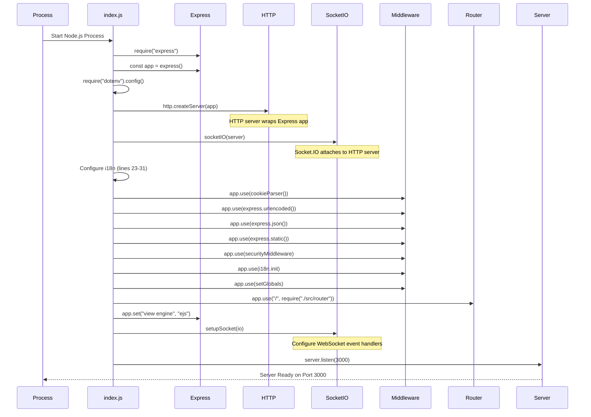
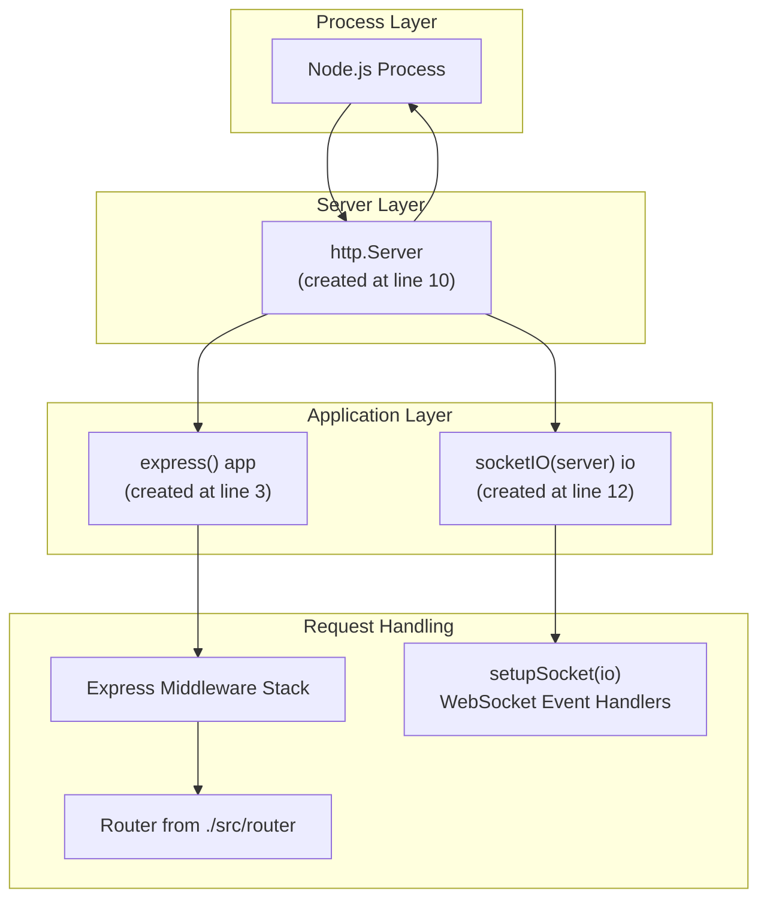
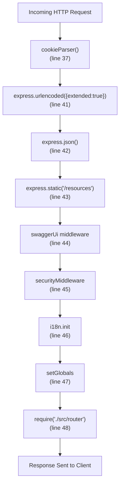
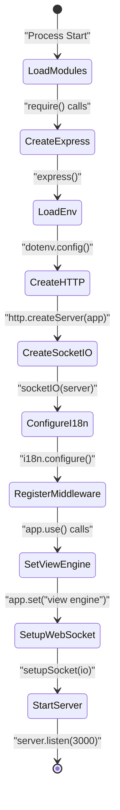

# Application Bootstrap

> **Relevant source files**
> * [index.js](https://github.com/moichuelo/registro/blob/544abbcc/index.js)
> * [package.json](https://github.com/moichuelo/registro/blob/544abbcc/package.json)

## Purpose and Scope

This document details the application's entry point and initialization sequence as defined in [index.js](https://github.com/moichuelo/registro/blob/544abbcc/index.js)

 It covers the server creation process, middleware stack configuration, view engine setup, and the complete bootstrap sequence from process start to listening for connections.

For information about specific middleware behaviors and request processing flow, see [Request Processing Pipeline](/moichuelo/registro/3.3-request-processing-pipeline). For routing configuration, see [Routing System](/moichuelo/registro/5-routing-system). For WebSocket setup details, see [Real-time Communication System](/moichuelo/registro/7-real-time-communication-system).

---

## Bootstrap Sequence Overview

The application follows a strict initialization order to ensure all dependencies are configured before the server begins accepting requests. The bootstrap process occurs synchronously from top to bottom in [index.js L1-L65](https://github.com/moichuelo/registro/blob/544abbcc/index.js#L1-L65)

**Diagram: Application Bootstrap Sequence**



**Sources:** [index.js L1-L65](https://github.com/moichuelo/registro/blob/544abbcc/index.js#L1-L65)

---

## Dependency Loading and Environment Configuration

The bootstrap process begins with loading required Node.js modules and environment configuration.

### Core Dependencies

The application loads dependencies in the following order [index.js L2-L19](https://github.com/moichuelo/registro/blob/544abbcc/index.js#L2-L19)

:

| Module | Variable | Purpose |
| --- | --- | --- |
| `express` | `app` | HTTP framework for routing and middleware |
| `dotenv` | - | Load environment variables from `./env/.env` |
| `jsonwebtoken` | `jwt` | JWT token operations (imported but used elsewhere) |
| `cookie-parser` | `cookieParser` | Parse cookies from request headers |
| `http` | `server` | Create HTTP server that wraps Express |
| `socket.io` | `io` | Real-time bidirectional communication |
| `./database/db` | `db` | Database connection pool |
| `./src/sockets/socketHandler` | `setupSocket` | WebSocket event handler configuration |
| `./src/middlewares/security` | `securityMiddleware` | Security headers and protections |
| `i18n` | `i18n` | Internationalization support |
| `path` | `path` | File path utilities |
| `./src/middlewares/setGlobals` | `setGlobals` | Global template variables |
| `./swagger` | `{ swaggerUi, swaggerSpec }` | API documentation |

### Environment Variable Loading

Environment configuration is loaded immediately after Express initialization [index.js L4](https://github.com/moichuelo/registro/blob/544abbcc/index.js#L4-L4)

:

```javascript
require("dotenv").config({ path: "./env/.env" });
```

This loads variables such as database credentials, JWT secrets, and port configuration. The `.env` file must exist before server startup or the application will fail to connect to MySQL.

**Sources:** [index.js L2-L19](https://github.com/moichuelo/registro/blob/544abbcc/index.js#L2-L19)

---

## Server Architecture

The application uses a three-layer server architecture where a single HTTP server hosts both Express and Socket.IO.

**Diagram: Server Layer Architecture**



### HTTP Server Creation

The HTTP server is created by wrapping the Express application [index.js L10](https://github.com/moichuelo/registro/blob/544abbcc/index.js#L10-L10)

:

```javascript
const server = http.createServer(app);
```

This pattern is necessary because Socket.IO requires a raw HTTP server instance to attach its WebSocket upgrade handlers. Using `app.listen()` directly would not provide access to the underlying HTTP server needed for Socket.IO.

### Socket.IO Server Attachment

Socket.IO is attached to the HTTP server after creation [index.js L12](https://github.com/moichuelo/registro/blob/544abbcc/index.js#L12-L12)

:

```javascript
const io = socketIO(server);
```

This allows Socket.IO to intercept WebSocket upgrade requests on the same port as HTTP requests. When a client attempts a WebSocket connection, the HTTP server delegates to Socket.IO's upgrade handler.

**Sources:** [index.js L8-L12](https://github.com/moichuelo/registro/blob/544abbcc/index.js#L8-L12)

---

## i18n Configuration

The internationalization system is configured before middleware setup [index.js L23-L31](https://github.com/moichuelo/registro/blob/544abbcc/index.js#L23-L31)

**Configuration Parameters:**

| Parameter | Value | Description |
| --- | --- | --- |
| `locales` | `['en', 'es']` | Supported languages: English and Spanish |
| `directory` | `path.join(__dirname, 'locales')` | Translation file location |
| `defaultLocale` | `'es'` | Default language is Spanish |
| `cookie` | `'lang'` | Read language preference from `lang` cookie |
| `queryParameter` | `'lang'` | Allow language switch via `?lang=en` query param |
| `autoReload` | `true` | Reload translation files when changed (development) |
| `syncFiles` | `true` | Synchronize missing keys across locale files |

The `i18n.init` middleware is registered later in the middleware stack [index.js L46](https://github.com/moichuelo/registro/blob/544abbcc/index.js#L46-L46)

 to attach translation functions to each request.

**Sources:** [index.js L22-L31](https://github.com/moichuelo/registro/blob/544abbcc/index.js#L22-L31)

 [index.js L46](https://github.com/moichuelo/registro/blob/544abbcc/index.js#L46-L46)

---

## Middleware Stack Configuration

The middleware stack is configured in a specific order that determines request processing flow. Each middleware is registered using `app.use()`.

**Diagram: Middleware Registration Order**



### Middleware Registration Details

**1. Cookie Parser** [index.js L37](https://github.com/moichuelo/registro/blob/544abbcc/index.js#L37-L37)

```
app.use(cookieParser());
```

Parses cookies from `Cookie` header and populates `req.cookies` object. Required for JWT authentication which stores tokens in HTTP-only cookies.

**2. URL-Encoded Body Parser** [index.js L41](https://github.com/moichuelo/registro/blob/544abbcc/index.js#L41-L41)

```
app.use(express.urlencoded({ extended: true }));
```

Parses `application/x-www-form-urlencoded` request bodies (HTML form submissions). The `extended: true` option enables rich objects and arrays to be encoded.

**3. JSON Body Parser** [index.js L42](https://github.com/moichuelo/registro/blob/544abbcc/index.js#L42-L42)

```
app.use(express.json());
```

Parses `application/json` request bodies for API endpoints.

**4. Static File Server** [index.js L43](https://github.com/moichuelo/registro/blob/544abbcc/index.js#L43-L43)

```
app.use("/resources", express.static(__dirname + "/public"));
```

Serves static files from `public/` directory under the `/resources` URL path. Files like CSS, images, and fonts are accessible at `/resources/css/style.css`, etc.

**5. Swagger API Documentation** [index.js L44](https://github.com/moichuelo/registro/blob/544abbcc/index.js#L44-L44)

```
app.use('/api-docs', swaggerUi.serve, swaggerUi.setup(swaggerSpec));
```

Mounts Swagger UI at `/api-docs` for interactive API documentation.

**6. Security Middleware** [index.js L45](https://github.com/moichuelo/registro/blob/544abbcc/index.js#L45-L45)

```
app.use(securityMiddleware);
```

Applies security headers and protections. See [Security Measures](/moichuelo/registro/6.5-security-measures) for details on what protections are included.

**7. i18n Middleware** [index.js L46](https://github.com/moichuelo/registro/blob/544abbcc/index.js#L46-L46)

```
app.use(i18n.init);
```

Attaches internationalization functions to request and response objects. Detects user language from cookie or query parameter.

**8. Global Variables Middleware** [index.js L47](https://github.com/moichuelo/registro/blob/544abbcc/index.js#L47-L47)

```
app.use(setGlobals);
```

Sets global variables available in all EJS templates, such as user information from JWT tokens.

**9. Application Router** [index.js L48](https://github.com/moichuelo/registro/blob/544abbcc/index.js#L48-L48)

```javascript
app.use("/", require("./src/router"));
```

Mounts the main application router which handles all route definitions. See [Routing System](/moichuelo/registro/5-routing-system) for complete route documentation.

**Sources:** [index.js L37-L48](https://github.com/moichuelo/registro/blob/544abbcc/index.js#L37-L48)

---

## View Engine Setup

The EJS templating engine is configured for server-side rendering [index.js L52](https://github.com/moichuelo/registro/blob/544abbcc/index.js#L52-L52)

:

```
app.set("view engine", "ejs");
```

This configuration:

* Sets EJS as the default template engine
* Allows `res.render("viewName")` calls without specifying file extensions
* Defaults to looking for templates in the `views/` directory

The application does not use `express-ejs-layouts` (it is commented out [index.js L34](https://github.com/moichuelo/registro/blob/544abbcc/index.js#L34-L34)

 [index.js L53](https://github.com/moichuelo/registro/blob/544abbcc/index.js#L53-L53)

), so layouts are handled manually through EJS includes.

**Sources:** [index.js L51-L54](https://github.com/moichuelo/registro/blob/544abbcc/index.js#L51-L54)

---

## WebSocket Handler Setup

After all HTTP middleware is configured, the WebSocket event handlers are initialized [index.js L57](https://github.com/moichuelo/registro/blob/544abbcc/index.js#L57-L57)

:

```
setupSocket(io);
```

This function, imported from [src/sockets/socketHandler.js](https://github.com/moichuelo/registro/blob/544abbcc/src/sockets/socketHandler.js)

 configures:

* Socket.IO authentication middleware
* Event handlers for `mensaje_privado` and `disconnect`
* Room management for user-specific and admin rooms

The Socket.IO server operates independently of the Express middleware stack but shares authentication mechanisms through JWT tokens. See [Real-time Communication System](/moichuelo/registro/7-real-time-communication-system) for complete WebSocket documentation.

**Sources:** [index.js L57](https://github.com/moichuelo/registro/blob/544abbcc/index.js#L57-L57)

 [index.js L14](https://github.com/moichuelo/registro/blob/544abbcc/index.js#L14-L14)

---

## Server Startup and Listening

The final bootstrap step starts the HTTP server listening for connections [index.js L62-L65](https://github.com/moichuelo/registro/blob/544abbcc/index.js#L62-L65)

:

```javascript
server.listen(3000, () => {
    console.log("Servidor corriendo en http://localhost:3000");
    console.log('Swagger disponible en http://localhost:3000/api-docs');
});
```

### Port Configuration

The server is hardcoded to listen on port 3000. For production deployments, this should be changed to read from an environment variable:

```javascript
const PORT = process.env.PORT || 3000;
server.listen(PORT, () => { ... });
```

### Server Ready State

When the callback executes, the server is ready to:

* Accept HTTP requests on all configured routes
* Upgrade HTTP connections to WebSocket for Socket.IO clients
* Serve static files from the `public/` directory
* Render EJS templates with i18n support

**Sources:** [index.js L62-L65](https://github.com/moichuelo/registro/blob/544abbcc/index.js#L62-L65)

---

## Bootstrap Sequence Summary

**Diagram: Complete Bootstrap Flow**



The bootstrap sequence ensures:

1. Dependencies are available before they are used
2. HTTP server exists before Socket.IO attachment
3. Middleware executes in the correct order
4. All configurations are complete before accepting connections

**Sources:** [index.js L1-L65](https://github.com/moichuelo/registro/blob/544abbcc/index.js#L1-L65)