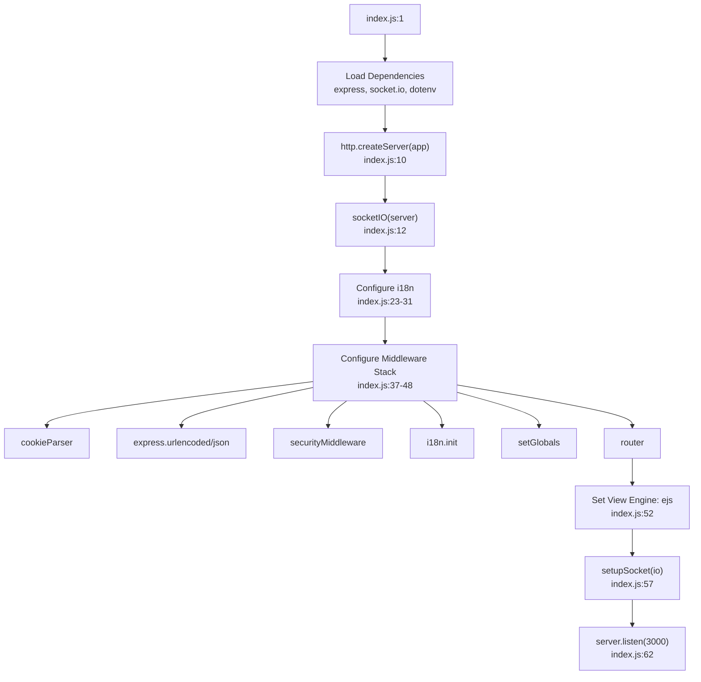
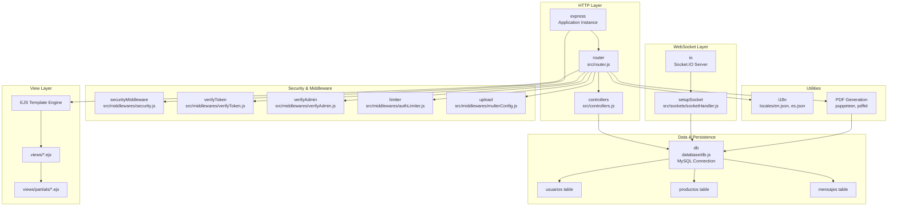
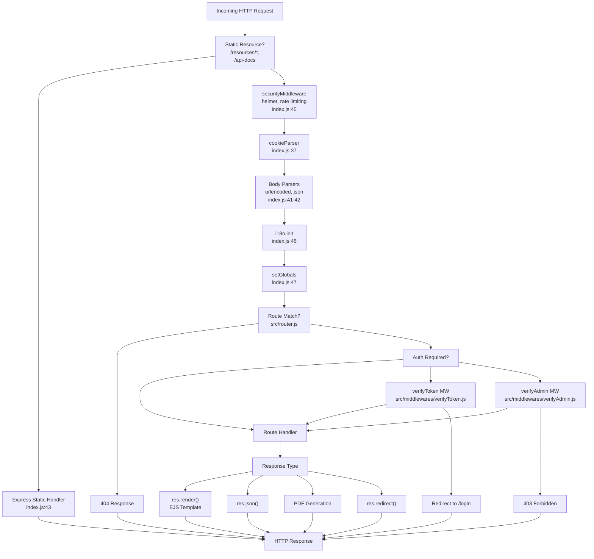
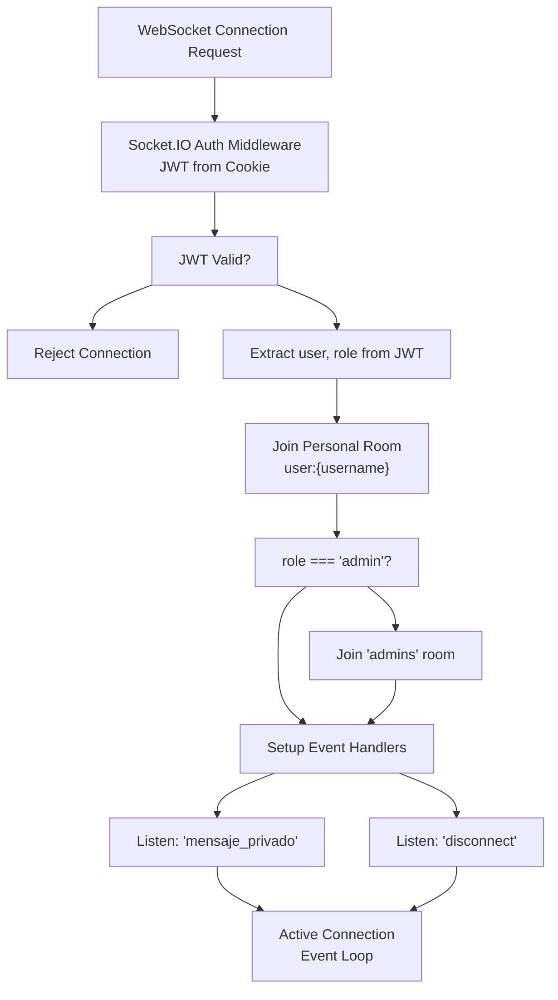
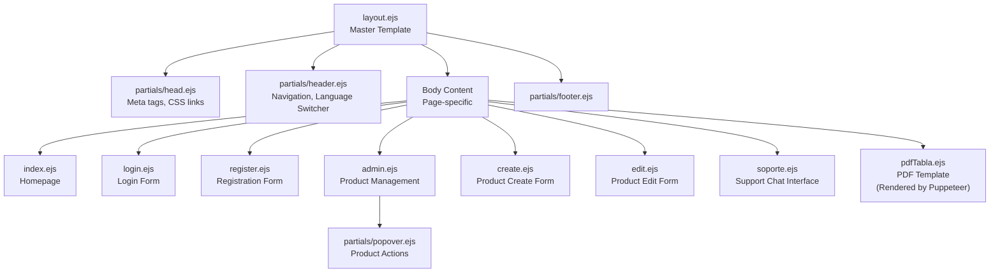
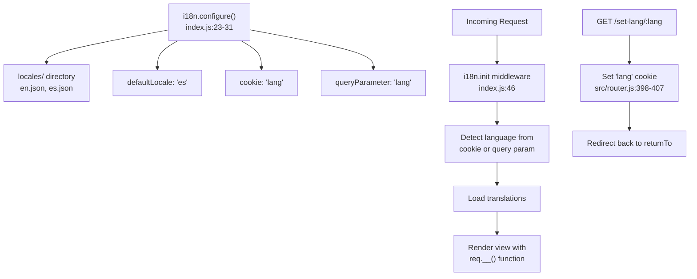
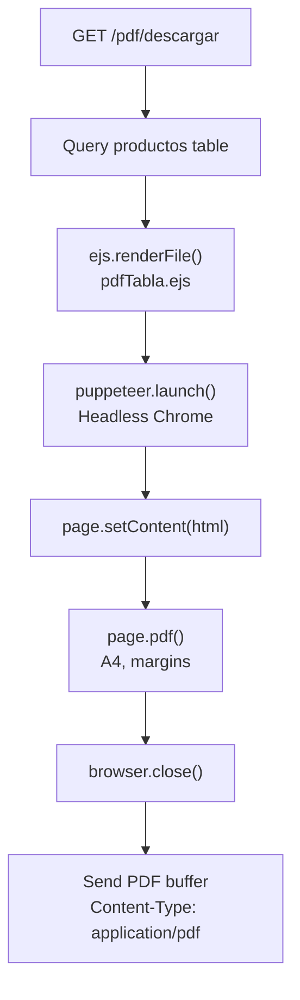
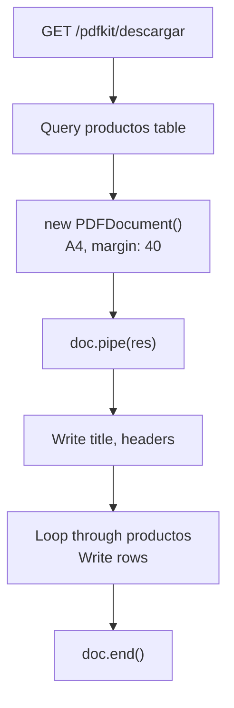

# Architecture Overview

> **Relevant source files**
> * [index.js](https://github.com/moichuelo/registro/blob/544abbcc/index.js)
> * [package-lock.json](https://github.com/moichuelo/registro/blob/544abbcc/package-lock.json)
> * [proyecto.zip](https://github.com/moichuelo/registro/blob/544abbcc/proyecto.zip)
> * [src/router.js](https://github.com/moichuelo/registro/blob/544abbcc/src/router.js)

This document provides a high-level overview of the `registro-sesiones` system architecture, including its major components, technology stack, and how data and requests flow through the system. This page focuses on the structural organization and component interactions at a conceptual level.

For detailed information about specific subsystems, see:

* Routing and endpoints: [Routing System](/moichuelo/registro/5-routing-system)
* Authentication mechanisms: [Authentication & Authorization](/moichuelo/registro/6-authentication-and-authorization)
* Real-time messaging: [Real-time Communication System](/moichuelo/registro/7-real-time-communication-system)
* View rendering: [View Layer & Templates](/moichuelo/registro/12-view-layer-and-templates)

---

## System Overview

The `registro-sesiones` application is a dual-protocol server application that combines traditional HTTP request-response patterns with real-time WebSocket communication. The system is built on Node.js using Express for HTTP routing and Socket.IO for bidirectional real-time messaging.

**Primary Capabilities:**

* User authentication and role-based authorization (admin/user)
* Product management (CRUD operations)
* Real-time support chat system
* PDF report generation
* Multi-language support (English/Spanish)
* Session management with JWT tokens

---

## Application Entry Point and Server Initialization

### Server Bootstrap Flow



**Sources:** [index.js L1-L65](https://github.com/moichuelo/registro/blob/544abbcc/index.js#L1-L65)

The application initializes a single HTTP server that hosts both Express and Socket.IO, ensuring they share the same port and can coordinate on authentication and session management.

---

## Core Architectural Components

### Component Hierarchy



**Sources:** [index.js L1-L65](https://github.com/moichuelo/registro/blob/544abbcc/index.js#L1-L65)

 [src/router.js L1-L607](https://github.com/moichuelo/registro/blob/544abbcc/src/router.js#L1-L607)

 [src/controllers.js L1-L80](https://github.com/moichuelo/registro/blob/544abbcc/src/controllers.js#L1-L80)

---

## Technology Stack

The following table lists the core technologies and their roles in the system:

| Technology | Purpose | Configuration Location |
| --- | --- | --- |
| **Express 5.1.0** | HTTP server and routing framework | [index.js L2-L3](https://github.com/moichuelo/registro/blob/544abbcc/index.js#L2-L3) |
| **Socket.IO 4.8.1** | Real-time bidirectional communication | [index.js L9-L12](https://github.com/moichuelo/registro/blob/544abbcc/index.js#L9-L12) |
| **MySQL2 3.14.1** | Relational database | [database/db.js](https://github.com/moichuelo/registro/blob/544abbcc/database/db.js) |
| **EJS 3.1.10** | Server-side template engine | [index.js L52](https://github.com/moichuelo/registro/blob/544abbcc/index.js#L52-L52) |
| **JWT (jsonwebtoken 9.0.2)** | Token-based authentication | [src/router.js L15](https://github.com/moichuelo/registro/blob/544abbcc/src/router.js#L15-L15) |
| **bcryptjs 3.0.2** | Password hashing | [src/router.js L4](https://github.com/moichuelo/registro/blob/544abbcc/src/router.js#L4-L4) |
| **Helmet 8.1.0** | Security headers middleware | [src/middlewares/security.js](https://github.com/moichuelo/registro/blob/544abbcc/src/middlewares/security.js) |
| **express-rate-limit 6.7.0** | Brute-force protection | [src/middlewares/authLimiter.js](https://github.com/moichuelo/registro/blob/544abbcc/src/middlewares/authLimiter.js) |
| **cookie-parser 1.4.7** | Cookie parsing | [index.js L7](https://github.com/moichuelo/registro/blob/544abbcc/index.js#L7-L7) |
| **express-session 1.18.2** | Session management | [package-lock.json L1383-L1421](https://github.com/moichuelo/registro/blob/544abbcc/package-lock.json#L1383-L1421) |
| **express-validator 7.2.1** | Input validation | [src/router.js L3](https://github.com/moichuelo/registro/blob/544abbcc/src/router.js#L3-L3) |
| **i18n 0.15.1** | Internationalization | [index.js L16-L31](https://github.com/moichuelo/registro/blob/544abbcc/index.js#L16-L31) |
| **Puppeteer 24.14.0** | HTML-to-PDF conversion | [src/router.js L6](https://github.com/moichuelo/registro/blob/544abbcc/src/router.js#L6-L6) |
| **PDFKit 0.17.1** | Programmatic PDF generation | [src/router.js L9](https://github.com/moichuelo/registro/blob/544abbcc/src/router.js#L9-L9) |
| **Multer 2.0.2** | File upload handling | [src/middlewares/multerConfig.js](https://github.com/moichuelo/registro/blob/544abbcc/src/middlewares/multerConfig.js) |
| **dotenv 16.5.0** | Environment variable management | [index.js L4](https://github.com/moichuelo/registro/blob/544abbcc/index.js#L4-L4) |
| **Swagger** | API documentation | [index.js L19-L44](https://github.com/moichuelo/registro/blob/544abbcc/index.js#L19-L44) |

**Sources:** [package-lock.json L1-L13687](https://github.com/moichuelo/registro/blob/544abbcc/package-lock.json#L1-L13687)

 [index.js L1-L65](https://github.com/moichuelo/registro/blob/544abbcc/index.js#L1-L65)

---

## Request Processing Architecture

### HTTP Request Pipeline



**Sources:** [index.js L37-L48](https://github.com/moichuelo/registro/blob/544abbcc/index.js#L37-L48)

 [src/router.js L1-L607](https://github.com/moichuelo/registro/blob/544abbcc/src/router.js#L1-L607)

 [src/middlewares/verifyToken.js](https://github.com/moichuelo/registro/blob/544abbcc/src/middlewares/verifyToken.js)

 [src/middlewares/verifyAdmin.js](https://github.com/moichuelo/registro/blob/544abbcc/src/middlewares/verifyAdmin.js)

### WebSocket Connection Flow



**Sources:** [src/sockets/socketHandler.js](https://github.com/moichuelo/registro/blob/544abbcc/src/sockets/socketHandler.js)

 [index.js L57](https://github.com/moichuelo/registro/blob/544abbcc/index.js#L57-L57)

---

## Data Flow Architecture

### Database Schema and Access Patterns

```css
#mermaid-505ldbjim9f{font-family:ui-sans-serif,-apple-system,system-ui,Segoe UI,Helvetica;font-size:16px;fill:#333;}@keyframes edge-animation-frame{from{stroke-dashoffset:0;}}@keyframes dash{to{stroke-dashoffset:0;}}#mermaid-505ldbjim9f .edge-animation-slow{stroke-dasharray:9,5!important;stroke-dashoffset:900;animation:dash 50s linear infinite;stroke-linecap:round;}#mermaid-505ldbjim9f .edge-animation-fast{stroke-dasharray:9,5!important;stroke-dashoffset:900;animation:dash 20s linear infinite;stroke-linecap:round;}#mermaid-505ldbjim9f .error-icon{fill:#dddddd;}#mermaid-505ldbjim9f .error-text{fill:#222222;stroke:#222222;}#mermaid-505ldbjim9f .edge-thickness-normal{stroke-width:1px;}#mermaid-505ldbjim9f .edge-thickness-thick{stroke-width:3.5px;}#mermaid-505ldbjim9f .edge-pattern-solid{stroke-dasharray:0;}#mermaid-505ldbjim9f .edge-thickness-invisible{stroke-width:0;fill:none;}#mermaid-505ldbjim9f .edge-pattern-dashed{stroke-dasharray:3;}#mermaid-505ldbjim9f .edge-pattern-dotted{stroke-dasharray:2;}#mermaid-505ldbjim9f .marker{fill:#999;stroke:#999;}#mermaid-505ldbjim9f .marker.cross{stroke:#999;}#mermaid-505ldbjim9f svg{font-family:ui-sans-serif,-apple-system,system-ui,Segoe UI,Helvetica;font-size:16px;}#mermaid-505ldbjim9f p{margin:0;}#mermaid-505ldbjim9f .entityBox{fill:#ffffff;stroke:#dddddd;}#mermaid-505ldbjim9f .relationshipLabelBox{fill:#dddddd;opacity:0.7;background-color:#dddddd;}#mermaid-505ldbjim9f .relationshipLabelBox rect{opacity:0.5;}#mermaid-505ldbjim9f .labelBkg{background-color:rgba(221, 221, 221, 0.5);}#mermaid-505ldbjim9f .edgeLabel .label{fill:#dddddd;font-size:14px;}#mermaid-505ldbjim9f .label{font-family:ui-sans-serif,-apple-system,system-ui,Segoe UI,Helvetica;color:#333;}#mermaid-505ldbjim9f .edge-pattern-dashed{stroke-dasharray:8,8;}#mermaid-505ldbjim9f .node rect,#mermaid-505ldbjim9f .node circle,#mermaid-505ldbjim9f .node ellipse,#mermaid-505ldbjim9f .node polygon{fill:#ffffff;stroke:#dddddd;stroke-width:1px;}#mermaid-505ldbjim9f .relationshipLine{stroke:#999;stroke-width:1;fill:none;}#mermaid-505ldbjim9f .marker{fill:none!important;stroke:#999!important;stroke-width:1;}#mermaid-505ldbjim9f :root{--mermaid-font-family:"trebuchet ms",verdana,arial,sans-serif;}de_usuariopara_usuariousuariosvarcharusuarioPKvarcharnombrevarcharrolvarcharpassvarcharimagenmensajesvarcharde_usuarioFKvarcharpara_usuarioFKtextmensajedatetimefechaproductosintrefPKvarcharnombredecimalpreciointstock
```

### Data Access Layer Mapping

| Database Table | Access Points | Primary Operations |
| --- | --- | --- |
| **usuarios** | `POST /register``POST /auth``GET /api/usuarios-conversaciones` | User registration with bcrypt hashingLogin authenticationRetrieve users with conversations |
| **productos** | `GET /admin``POST /save``POST /update``GET /edit/:id``GET /delete/:id``GET /pdf/descargar``GET /pdfkit/descargar` | List all productsCreate productUpdate productGet single productDelete productGenerate PDF reports |
| **mensajes** | `mensaje_privado` event`GET /api/mensajes``GET /api/mensajes/mios` | Store real-time messagesRetrieve messages for adminRetrieve user's own messages |

**Sources:** [src/router.js L119-L407](https://github.com/moichuelo/registro/blob/544abbcc/src/router.js#L119-L407)

 [src/controllers.js](https://github.com/moichuelo/registro/blob/544abbcc/src/controllers.js)

 [src/sockets/socketHandler.js](https://github.com/moichuelo/registro/blob/544abbcc/src/sockets/socketHandler.js)

---

## Authentication and Authorization Flow

### JWT Token Lifecycle

```

```

**Sources:** [src/router.js L532-L601](https://github.com/moichuelo/registro/blob/544abbcc/src/router.js#L532-L601)

 [src/middlewares/verifyToken.js](https://github.com/moichuelo/registro/blob/544abbcc/src/middlewares/verifyToken.js)

 [src/middlewares/verifyAdmin.js](https://github.com/moichuelo/registro/blob/544abbcc/src/middlewares/verifyAdmin.js)

---

## View Rendering Architecture

### Template Hierarchy



**Sources:** [views/layout.ejs](https://github.com/moichuelo/registro/blob/544abbcc/views/layout.ejs)

 [views/partials/head.ejs](https://github.com/moichuelo/registro/blob/544abbcc/views/partials/head.ejs)

 [views/partials/header.ejs](https://github.com/moichuelo/registro/blob/544abbcc/views/partials/header.ejs)

 [views/partials/footer.ejs](https://github.com/moichuelo/registro/blob/544abbcc/views/partials/footer.ejs)

 [views/admin.ejs](https://github.com/moichuelo/registro/blob/544abbcc/views/admin.ejs)

 [views/soporte.ejs](https://github.com/moichuelo/registro/blob/544abbcc/views/soporte.ejs)

### Data Passed to Views

| Route | View Template | Data Passed | Source |
| --- | --- | --- | --- |
| `GET /` | `index.ejs` | `user`, `login` | [src/router.js L59-L74](https://github.com/moichuelo/registro/blob/544abbcc/src/router.js#L59-L74) |
| `GET /admin` | `admin.ejs` | `productos`, `user`, `login`, `rol` | [src/router.js L119-L134](https://github.com/moichuelo/registro/blob/544abbcc/src/router.js#L119-L134) |
| `GET /soporte` | `soporte.ejs` | `user: {username, role}` | [src/router.js L220-L227](https://github.com/moichuelo/registro/blob/544abbcc/src/router.js#L220-L227) |
| `GET /edit/:id` | `edit.ejs` | `producto` | [src/router.js L186-L196](https://github.com/moichuelo/registro/blob/544abbcc/src/router.js#L186-L196) |
| `GET /login` | `login.ejs` | Alert data (on auth error) | [src/router.js L532-L601](https://github.com/moichuelo/registro/blob/544abbcc/src/router.js#L532-L601) |
| `GET /registro` | `register.ejs` | Validation errors, form values | [src/router.js L414-L484](https://github.com/moichuelo/registro/blob/544abbcc/src/router.js#L414-L484) |

**Sources:** [src/router.js L59-L227](https://github.com/moichuelo/registro/blob/544abbcc/src/router.js#L59-L227)

---

## Middleware Stack Details

The middleware stack is applied in the following order, as configured in [index.js L37-L48](https://github.com/moichuelo/registro/blob/544abbcc/index.js#L37-L48)

:

| Order | Middleware | Purpose | Source |
| --- | --- | --- | --- |
| 1 | `cookieParser()` | Parse cookies for JWT token extraction | [index.js L37](https://github.com/moichuelo/registro/blob/544abbcc/index.js#L37-L37) |
| 2 | `express.urlencoded({extended: true})` | Parse URL-encoded form data | [index.js L41](https://github.com/moichuelo/registro/blob/544abbcc/index.js#L41-L41) |
| 3 | `express.json()` | Parse JSON request bodies | [index.js L42](https://github.com/moichuelo/registro/blob/544abbcc/index.js#L42-L42) |
| 4 | `express.static('/resources', public/)` | Serve static assets | [index.js L43](https://github.com/moichuelo/registro/blob/544abbcc/index.js#L43-L43) |
| 5 | `swaggerUi.serve`, `swaggerUi.setup()` | API documentation UI | [index.js L44](https://github.com/moichuelo/registro/blob/544abbcc/index.js#L44-L44) |
| 6 | `securityMiddleware` | Helmet security headers, rate limiting | [index.js L45](https://github.com/moichuelo/registro/blob/544abbcc/index.js#L45-L45) |
| 7 | `i18n.init` | Initialize internationalization | [index.js L46](https://github.com/moichuelo/registro/blob/544abbcc/index.js#L46-L46) |
| 8 | `setGlobals` | Set global template variables | [index.js L47](https://github.com/moichuelo/registro/blob/544abbcc/index.js#L47-L47) |
| 9 | `router` | Application routes | [index.js L48](https://github.com/moichuelo/registro/blob/544abbcc/index.js#L48-L48) |

### Route-Specific Middleware

Certain routes apply additional middleware:

* **`POST /auth`**: `limiter` (rate limiting to prevent brute force) - [src/router.js L532](https://github.com/moichuelo/registro/blob/544abbcc/src/router.js#L532-L532)
* **`POST /register`**: `upload.single('profileImage')` (file upload), validation chain - [src/router.js L414-L428](https://github.com/moichuelo/registro/blob/544abbcc/src/router.js#L414-L428)
* **`GET /admin`**: `verifyToken` - [src/router.js L119](https://github.com/moichuelo/registro/blob/544abbcc/src/router.js#L119-L119)
* **`GET /soporte`**: `verifyToken` - [src/router.js L220](https://github.com/moichuelo/registro/blob/544abbcc/src/router.js#L220-L220)
* **`GET /api/mensajes`**: `verifyAdmin` - [src/router.js L229](https://github.com/moichuelo/registro/blob/544abbcc/src/router.js#L229-L229)
* **`GET /api/mensajes/mios`**: `verifyToken` - [src/router.js L256](https://github.com/moichuelo/registro/blob/544abbcc/src/router.js#L256-L256)
* **`GET /api/usuarios-conversaciones`**: `verifyAdmin` - [src/router.js L283](https://github.com/moichuelo/registro/blob/544abbcc/src/router.js#L283-L283)
* **`GET /pdf/descargar`**: `verifyToken` - [src/router.js L317](https://github.com/moichuelo/registro/blob/544abbcc/src/router.js#L317-L317)
* **`GET /pdfkit/descargar`**: `verifyToken` - [src/router.js L355](https://github.com/moichuelo/registro/blob/544abbcc/src/router.js#L355-L355)

**Sources:** [src/router.js L119-L407](https://github.com/moichuelo/registro/blob/544abbcc/src/router.js#L119-L407)

 [src/middlewares/verifyToken.js](https://github.com/moichuelo/registro/blob/544abbcc/src/middlewares/verifyToken.js)

 [src/middlewares/verifyAdmin.js](https://github.com/moichuelo/registro/blob/544abbcc/src/middlewares/verifyAdmin.js)

 [src/middlewares/authLimiter.js](https://github.com/moichuelo/registro/blob/544abbcc/src/middlewares/authLimiter.js)

 [src/middlewares/multerConfig.js](https://github.com/moichuelo/registro/blob/544abbcc/src/middlewares/multerConfig.js)

---

## Internationalization Architecture

The i18n system supports English (`en`) and Spanish (`es`) locales.

### Configuration



**Sources:** [index.js L23-L46](https://github.com/moichuelo/registro/blob/544abbcc/index.js#L23-L46)

 [src/router.js L398-L407](https://github.com/moichuelo/registro/blob/544abbcc/src/router.js#L398-L407)

 [views/partials/header.ejs](https://github.com/moichuelo/registro/blob/544abbcc/views/partials/header.ejs)

---

## PDF Generation Architecture

The system supports two PDF generation approaches:

### Approach 1: Puppeteer (HTML-to-PDF)



**Sources:** [src/router.js L317-L353](https://github.com/moichuelo/registro/blob/544abbcc/src/router.js#L317-L353)

### Approach 2: PDFKit (Programmatic)



**Sources:** [src/router.js L355-L396](https://github.com/moichuelo/registro/blob/544abbcc/src/router.js#L355-L396)

Both approaches query the same `productos` table but differ in rendering strategy. Puppeteer renders a full HTML template and converts it to PDF, while PDFKit programmatically builds the PDF structure.

---

## Security Architecture Summary

| Security Layer | Implementation | Location |
| --- | --- | --- |
| **HTTPS Headers** | Helmet middleware | [src/middlewares/security.js](https://github.com/moichuelo/registro/blob/544abbcc/src/middlewares/security.js) |
| **Rate Limiting** | express-rate-limit on `/auth` | [src/middlewares/authLimiter.js](https://github.com/moichuelo/registro/blob/544abbcc/src/middlewares/authLimiter.js) <br>  [src/router.js L532](https://github.com/moichuelo/registro/blob/544abbcc/src/router.js#L532-L532) |
| **Password Hashing** | bcrypt with salt rounds = 8 | [src/router.js L453](https://github.com/moichuelo/registro/blob/544abbcc/src/router.js#L453-L453) |
| **JWT Tokens** | Signed with `JWT_SECRET`, HttpOnly cookies, 1-hour expiration | [src/router.js L567-L574](https://github.com/moichuelo/registro/blob/544abbcc/src/router.js#L567-L574) |
| **Input Validation** | express-validator on registration | [src/router.js L415-L428](https://github.com/moichuelo/registro/blob/544abbcc/src/router.js#L415-L428) |
| **SQL Injection Prevention** | Parameterized queries via mysql2 | [database/db.js](https://github.com/moichuelo/registro/blob/544abbcc/database/db.js) <br>  [src/router.js](https://github.com/moichuelo/registro/blob/544abbcc/src/router.js#LNaN-LNaN) |
| **Role-Based Access Control** | verifyAdmin middleware checks `req.user.rol` | [src/middlewares/verifyAdmin.js](https://github.com/moichuelo/registro/blob/544abbcc/src/middlewares/verifyAdmin.js) |
| **File Upload Validation** | Multer configuration limits file types/sizes | [src/middlewares/multerConfig.js](https://github.com/moichuelo/registro/blob/544abbcc/src/middlewares/multerConfig.js) |

**Sources:** [src/router.js L414-L601](https://github.com/moichuelo/registro/blob/544abbcc/src/router.js#L414-L601)

 [src/middlewares/security.js](https://github.com/moichuelo/registro/blob/544abbcc/src/middlewares/security.js)

 [src/middlewares/verifyToken.js](https://github.com/moichuelo/registro/blob/544abbcc/src/middlewares/verifyToken.js)

 [src/middlewares/verifyAdmin.js](https://github.com/moichuelo/registro/blob/544abbcc/src/middlewares/verifyAdmin.js)

 [src/middlewares/authLimiter.js](https://github.com/moichuelo/registro/blob/544abbcc/src/middlewares/authLimiter.js)

---

This architecture supports a secure, scalable application with clear separation of concerns between HTTP and WebSocket layers, robust authentication, and flexible content generation capabilities.