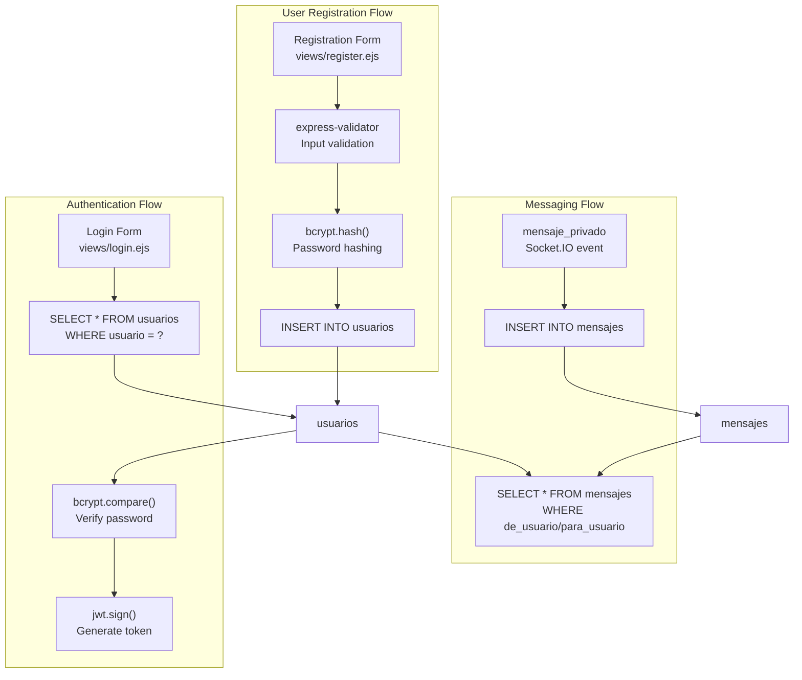

# Database Schema

> **Relevant source files**
> * [proyecto.zip](https://github.com/moichuelo/registro/blob/544abbcc/proyecto.zip)
> * [src/router.js](https://github.com/moichuelo/registro/blob/544abbcc/src/router.js)
> * [src/sockets/socketHandler.js](https://github.com/moichuelo/registro/blob/544abbcc/src/sockets/socketHandler.js)

## Purpose and Scope

This document provides comprehensive documentation of the MySQL database schema used by the registro-sesiones application. It covers the structure of all database tables, their columns, data types, relationships, and constraints. The schema consists of three main tables: `usuarios` (user authentication and profiles), `productos` (product management), and `mensajes` (real-time chat messages).

For detailed information about specific tables, see:

* [usuarios Table](/moichuelo/registro/14.1-usuarios-table) - User authentication and profile data
* [productos Table](/moichuelo/registro/14.2-productos-table) - Product inventory management
* [mensajes Table](/moichuelo/registro/14.3-mensajes-table) - Chat messaging system

For information about how these tables are accessed by the application, see [API Reference](/moichuelo/registro/15-api-reference).

---

## Database Overview

The application uses a MySQL database with three core tables that support distinct functional domains. The database connection is managed through [database/db.js](https://github.com/moichuelo/registro/blob/544abbcc/database/db.js)

 which provides a connection pool for query execution throughout the application.

### Entity Relationship Diagram

```css
#mermaid-lpobs8m2ztk{font-family:ui-sans-serif,-apple-system,system-ui,Segoe UI,Helvetica;font-size:16px;fill:#333;}@keyframes edge-animation-frame{from{stroke-dashoffset:0;}}@keyframes dash{to{stroke-dashoffset:0;}}#mermaid-lpobs8m2ztk .edge-animation-slow{stroke-dasharray:9,5!important;stroke-dashoffset:900;animation:dash 50s linear infinite;stroke-linecap:round;}#mermaid-lpobs8m2ztk .edge-animation-fast{stroke-dasharray:9,5!important;stroke-dashoffset:900;animation:dash 20s linear infinite;stroke-linecap:round;}#mermaid-lpobs8m2ztk .error-icon{fill:#dddddd;}#mermaid-lpobs8m2ztk .error-text{fill:#222222;stroke:#222222;}#mermaid-lpobs8m2ztk .edge-thickness-normal{stroke-width:1px;}#mermaid-lpobs8m2ztk .edge-thickness-thick{stroke-width:3.5px;}#mermaid-lpobs8m2ztk .edge-pattern-solid{stroke-dasharray:0;}#mermaid-lpobs8m2ztk .edge-thickness-invisible{stroke-width:0;fill:none;}#mermaid-lpobs8m2ztk .edge-pattern-dashed{stroke-dasharray:3;}#mermaid-lpobs8m2ztk .edge-pattern-dotted{stroke-dasharray:2;}#mermaid-lpobs8m2ztk .marker{fill:#999;stroke:#999;}#mermaid-lpobs8m2ztk .marker.cross{stroke:#999;}#mermaid-lpobs8m2ztk svg{font-family:ui-sans-serif,-apple-system,system-ui,Segoe UI,Helvetica;font-size:16px;}#mermaid-lpobs8m2ztk p{margin:0;}#mermaid-lpobs8m2ztk .entityBox{fill:#ffffff;stroke:#dddddd;}#mermaid-lpobs8m2ztk .relationshipLabelBox{fill:#dddddd;opacity:0.7;background-color:#dddddd;}#mermaid-lpobs8m2ztk .relationshipLabelBox rect{opacity:0.5;}#mermaid-lpobs8m2ztk .labelBkg{background-color:rgba(221, 221, 221, 0.5);}#mermaid-lpobs8m2ztk .edgeLabel .label{fill:#dddddd;font-size:14px;}#mermaid-lpobs8m2ztk .label{font-family:ui-sans-serif,-apple-system,system-ui,Segoe UI,Helvetica;color:#333;}#mermaid-lpobs8m2ztk .edge-pattern-dashed{stroke-dasharray:8,8;}#mermaid-lpobs8m2ztk .node rect,#mermaid-lpobs8m2ztk .node circle,#mermaid-lpobs8m2ztk .node ellipse,#mermaid-lpobs8m2ztk .node polygon{fill:#ffffff;stroke:#dddddd;stroke-width:1px;}#mermaid-lpobs8m2ztk .relationshipLine{stroke:#999;stroke-width:1;fill:none;}#mermaid-lpobs8m2ztk .marker{fill:none!important;stroke:#999!important;stroke-width:1;}#mermaid-lpobs8m2ztk :root{--mermaid-font-family:"trebuchet ms",verdana,arial,sans-serif;}sends (de_usuario)receives (para_usuario)usuariosvarcharusuarioPKUsername, primary keyvarcharnombreFull namevarcharrolRole: admin or uservarcharpassbcrypt hashed passwordvarcharimagenProfile image filenamemensajesvarcharde_usuarioFKSender usernamevarcharpara_usuarioFKRecipient usernametextmensajeMessage contentdatetimefechaTimestampproductosintrefPKAuto-increment referencevarcharnombreProduct namedecimalprecioProduct priceintstockStock quantity
```

**Sources:** [src/router.js L121-L133](https://github.com/moichuelo/registro/blob/544abbcc/src/router.js#L121-L133)

 [src/router.js L236-L252](https://github.com/moichuelo/registro/blob/544abbcc/src/router.js#L236-L252)

 [src/router.js L456-L464](https://github.com/moichuelo/registro/blob/544abbcc/src/router.js#L456-L464)

 [src/sockets/socketHandler.js L55-L62](https://github.com/moichuelo/registro/blob/544abbcc/src/sockets/socketHandler.js#L55-L62)

---

## Database Connection

The database connection is established in [database/db.js](https://github.com/moichuelo/registro/blob/544abbcc/database/db.js)

 using the `mysql` package. The connection parameters are loaded from environment variables:

| Environment Variable | Purpose |
| --- | --- |
| `DB_HOST` | MySQL server hostname |
| `DB_USER` | Database username |
| `DB_PASSWORD` | Database password |
| `DB_DATABASE` | Database name |
| `DB_PORT` | MySQL port (default: 3306) |

The connection pool is exported as `db` and used throughout the application for executing queries via `db.query()`.

**Sources:** [database/db.js L1-L20](https://github.com/moichuelo/registro/blob/544abbcc/database/db.js#L1-L20)

 (as referenced in proyecto.zip)

---

## Table Relationships and Access Patterns

### Data Access by Component

```mermaid
flowchart TD

Login["POST /auth<br>[router.js:532-601]"]
Register["POST /register<br>[router.js:414-484]"]
AdminView["GET /admin<br>[router.js:119-134]"]
CreateProduct["POST /save<br>[controllers.js]"]
EditProduct["POST /update<br>[controllers.js]"]
DeleteProduct["GET /delete/:id<br>[router.js:198-208]"]
PDFExport["GET /pdf/descargar<br>[router.js:317-353]"]
SocketHandler["setupSocket()<br>[socketHandler.js:4-69]"]
GetMessages["GET /api/mensajes<br>[router.js:229-253]"]
GetMyMessages["GET /api/mensajes/mios<br>[router.js:256-280]"]
GetConversations["GET /api/usuarios-conversaciones<br>[router.js:283-315]"]
usuarios["usuarios table"]
productos["productos table"]
mensajes["mensajes table"]

Login --> usuarios
Register --> usuarios
AdminView --> productos
CreateProduct --> productos
EditProduct --> productos
DeleteProduct --> productos
PDFExport --> productos
SocketHandler --> mensajes
SocketHandler --> usuarios
GetMessages --> mensajes
GetMyMessages --> mensajes
GetConversations --> mensajes
GetConversations --> usuarios

subgraph subGraph2 ["Messaging System"]
    SocketHandler
    GetMessages
    GetMyMessages
    GetConversations
end

subgraph subGraph1 ["Product Management"]
    AdminView
    CreateProduct
    EditProduct
    DeleteProduct
    PDFExport
end

subgraph subGraph0 ["Authentication Layer"]
    Login
    Register
end
```



**Sources:** [src/router.js L1-L607](https://github.com/moichuelo/registro/blob/544abbcc/src/router.js#L1-L607)

 [src/controllers.js L1-L80](https://github.com/moichuelo/registro/blob/544abbcc/src/controllers.js#L1-L80)

 [src/sockets/socketHandler.js L1-L71](https://github.com/moichuelo/registro/blob/544abbcc/src/sockets/socketHandler.js#L1-L71)

---

## Table Summary

| Table | Primary Key | Foreign Keys | Purpose | Record Count Expectation |
| --- | --- | --- | --- | --- |
| `usuarios` | `usuario` | None | User authentication, authorization, and profile storage | Low (tens to hundreds) |
| `productos` | `ref` (auto-increment) | None | Product inventory management | Medium (hundreds to thousands) |
| `mensajes` | None (no explicit PK) | `de_usuario`, `para_usuario` → `usuarios.usuario` | Support chat message history | High (thousands to millions) |

---

## Query Patterns

### Authentication Queries

The `usuarios` table is queried during authentication to verify credentials:

```sql
-- Login verification
SELECT * FROM usuarios WHERE usuario = ?
```

Password comparison is performed in application code using `bcrypt.compare()` against the stored hash in the `pass` column [src/router.js L541-L544](https://github.com/moichuelo/registro/blob/544abbcc/src/router.js#L541-L544)

**Sources:** [src/router.js L537-L544](https://github.com/moichuelo/registro/blob/544abbcc/src/router.js#L537-L544)

### Product CRUD Operations

```sql
-- List all products
SELECT * FROM productos

-- Get single product for editing
SELECT * FROM productos WHERE ref = ?

-- Delete product
DELETE FROM productos WHERE ref = ?
```

Product creation and updates use parameterized INSERT and UPDATE statements executed by the controllers [src/controllers.js](https://github.com/moichuelo/registro/blob/544abbcc/src/controllers.js)

**Sources:** [src/router.js L121](https://github.com/moichuelo/registro/blob/544abbcc/src/router.js#L121-L121)

 [src/router.js L188](https://github.com/moichuelo/registro/blob/544abbcc/src/router.js#L188-L188)

 [src/router.js L200](https://github.com/moichuelo/registro/blob/544abbcc/src/router.js#L200-L200)

### Messaging Queries

The messaging system uses complex queries to retrieve conversation history:

```sql
-- Get messages for a specific user (bidirectional)
SELECT de_usuario, para_usuario, mensaje, fecha
FROM mensajes
WHERE (de_usuario = ? OR para_usuario = ?)
ORDER BY fecha ASC
```

```sql
-- Get list of users with active conversations (admin view)
SELECT DISTINCT usuario
FROM (
  SELECT de_usuario AS usuario FROM mensajes
  WHERE para_usuario IN (SELECT usuario FROM usuarios WHERE rol = 'admin')
  UNION
  SELECT para_usuario AS usuario FROM mensajes
  WHERE de_usuario IN (SELECT usuario FROM usuarios WHERE rol = 'admin')
) AS conversaciones
WHERE usuario NOT IN (SELECT usuario FROM usuarios WHERE rol = 'admin')
```

This query identifies all non-admin users who have sent or received messages from administrators [src/router.js L292-L304](https://github.com/moichuelo/registro/blob/544abbcc/src/router.js#L292-L304)

**Sources:** [src/router.js L236-L252](https://github.com/moichuelo/registro/blob/544abbcc/src/router.js#L236-L252)

 [src/router.js L292-L304](https://github.com/moichuelo/registro/blob/544abbcc/src/router.js#L292-L304)

 [src/sockets/socketHandler.js L55-L62](https://github.com/moichuelo/registro/blob/544abbcc/src/sockets/socketHandler.js#L55-L62)

---

## Data Flow Diagram



**Sources:** [src/router.js L414-L484](https://github.com/moichuelo/registro/blob/544abbcc/src/router.js#L414-L484)

 [src/router.js L532-L601](https://github.com/moichuelo/registro/blob/544abbcc/src/router.js#L532-L601)

 [src/sockets/socketHandler.js L45-L63](https://github.com/moichuelo/registro/blob/544abbcc/src/sockets/socketHandler.js#L45-L63)

---

## Field Naming Conventions

The schema uses Spanish naming conventions for table and column names:

| Spanish | English | Examples |
| --- | --- | --- |
| `usuario` | user | `de_usuario`, `para_usuario` |
| `nombre` | name | `nombre` (user full name, product name) |
| `rol` | role | `rol` (admin/user) |
| `pass` | password | `pass` (hashed password) |
| `precio` | price | `precio` (product price) |
| `fecha` | date | `fecha` (message timestamp) |
| `mensaje` | message | `mensaje` (message content) |

**Sources:** [src/router.js L456-L464](https://github.com/moichuelo/registro/blob/544abbcc/src/router.js#L456-L464)

 [src/router.js L237-L242](https://github.com/moichuelo/registro/blob/544abbcc/src/router.js#L237-L242)

---

## Indexes and Performance Considerations

### Recommended Indexes

Based on the query patterns observed in the codebase:

1. **usuarios table:** * Primary key on `usuario` (username lookup for authentication) * Index on `rol` (filtering admin users in message queries)
2. **productos table:** * Primary key on `ref` (lookup by reference number)
3. **mensajes table:** * Composite index on `(de_usuario, para_usuario)` (bidirectional message queries) * Index on `fecha` (chronological ordering) * Index on `de_usuario` (sender-based queries) * Index on `para_usuario` (recipient-based queries)

The `mensajes` table is likely to grow significantly over time and would benefit from proper indexing to support the complex UNION queries used in [src/router.js L292-L304](https://github.com/moichuelo/registro/blob/544abbcc/src/router.js#L292-L304)

**Sources:** [src/router.js L229-L315](https://github.com/moichuelo/registro/blob/544abbcc/src/router.js#L229-L315)

 [src/sockets/socketHandler.js L55-L62](https://github.com/moichuelo/registro/blob/544abbcc/src/sockets/socketHandler.js#L55-L62)

---

## Data Integrity and Constraints

### Foreign Key Relationships

The `mensajes` table has implicit foreign key relationships to the `usuarios` table:

* `mensajes.de_usuario` → `usuarios.usuario`
* `mensajes.para_usuario` → `usuarios.usuario`

These relationships ensure that messages cannot be created with non-existent sender or recipient usernames.

### Data Validation

Application-level validation is performed before database insertion:

* **User registration:** [src/router.js L415-L428](https://github.com/moichuelo/registro/blob/544abbcc/src/router.js#L415-L428)  uses `express-validator` to validate: * `user`: minimum 4 characters * `name`: minimum 4 characters * `pass`: minimum 4 characters * `email`: valid email format * `edad`: numeric value
* **Password security:** All passwords are hashed using bcrypt with salt rounds = 8 [src/router.js L453](https://github.com/moichuelo/registro/blob/544abbcc/src/router.js#L453-L453)

**Sources:** [src/router.js L415-L428](https://github.com/moichuelo/registro/blob/544abbcc/src/router.js#L415-L428)

 [src/router.js L453](https://github.com/moichuelo/registro/blob/544abbcc/src/router.js#L453-L453)

---

## Database Schema Code Mapping

```mermaid
flowchart TD

dbjs["database/db.js<br>MySQL connection pool"]
authRoute["router.js:532-601<br>POST /auth"]
registerRoute["router.js:414-484<br>POST /register"]
verifyToken["middlewares/verifyToken.js<br>JWT validation"]
adminRoute["router.js:119-134<br>GET /admin"]
editRoute["router.js:186-196<br>GET /edit/:id"]
deleteRoute["router.js:198-208<br>GET /delete/:id"]
controllers["controllers.js<br>save, update"]
socketHandler["socketHandler.js:45-63<br>mensaje_privado"]
apiMessages["router.js:229-253<br>GET /api/mensajes"]
apiMyMessages["router.js:256-280<br>GET /api/mensajes/mios"]
apiConversations["router.js:283-315<br>GET /api/usuarios-conversaciones"]

dbjs --> authRoute
dbjs --> registerRoute
dbjs --> adminRoute
dbjs --> editRoute
dbjs --> deleteRoute
dbjs --> controllers
dbjs --> socketHandler
dbjs --> apiMessages
dbjs --> apiMyMessages
dbjs --> apiConversations

subgraph subGraph3 ["mensajes Table Access"]
    socketHandler
    apiMessages
    apiMyMessages
    apiConversations
end

subgraph subGraph2 ["productos Table Access"]
    adminRoute
    editRoute
    deleteRoute
    controllers
end

subgraph subGraph1 ["usuarios Table Access"]
    authRoute
    registerRoute
    verifyToken
end

subgraph subGraph0 ["Database Layer"]
    dbjs
end
```



**Sources:** [src/router.js L1-L607](https://github.com/moichuelo/registro/blob/544abbcc/src/router.js#L1-L607)

 [src/controllers.js L1-L80](https://github.com/moichuelo/registro/blob/544abbcc/src/controllers.js#L1-L80)

 [src/sockets/socketHandler.js L1-L71](https://github.com/moichuelo/registro/blob/544abbcc/src/sockets/socketHandler.js#L1-L71)

 [database/db.js](https://github.com/moichuelo/registro/blob/544abbcc/database/db.js)

---

For detailed column specifications and constraints for each table, refer to the following subsections:

* [#14.1 usuarios Table](/moichuelo/registro/14.1-usuarios-table)
* [#14.2 productos Table](/moichuelo/registro/14.2-productos-table)
* [#14.3 mensajes Table](/moichuelo/registro/14.3-mensajes-table)