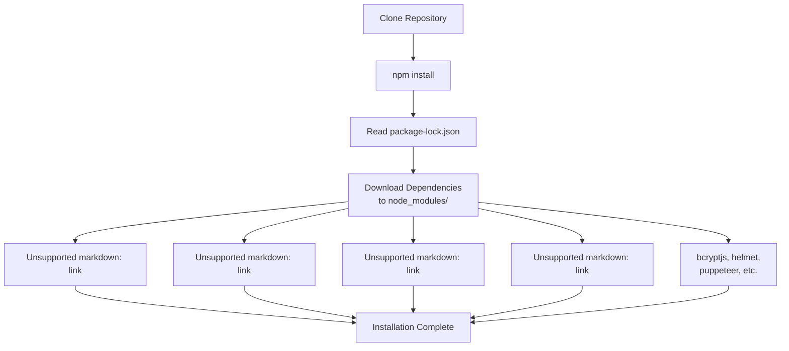
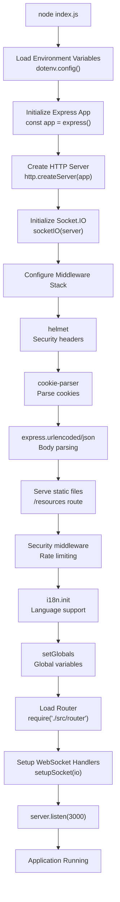
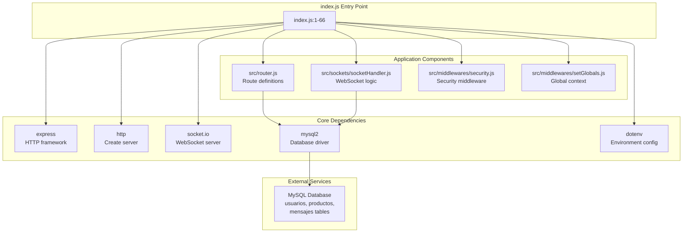

# Getting Started

> **Relevant source files**
> * [index.js](https://github.com/moichuelo/registro/blob/544abbcc/index.js)
> * [package-lock.json](https://github.com/moichuelo/registro/blob/544abbcc/package-lock.json)
> * [package.json](https://github.com/moichuelo/registro/blob/544abbcc/package.json)

This document provides step-by-step instructions for installing, configuring, and running the registro-sesiones application for the first time. It covers prerequisite software requirements, dependency installation, environment variable configuration, database initialization, and application startup procedures.

For detailed information about the system's architecture and components, see [Architecture Overview](/moichuelo/registro/3-architecture-overview). For deployment to production environments, see [Deployment & Configuration](/moichuelo/registro/16-deployment-and-configuration).

## Purpose and Scope

This guide is intended for developers who need to set up a local development environment for the registro-sesiones application. By following these steps, you will have a fully functional instance of the application running on your local machine, ready for development or testing.

---

## Prerequisites

Before installing the application, ensure your development environment meets the following requirements:

| Requirement | Version | Purpose |
| --- | --- | --- |
| **Node.js** | >= 18.0.0 | Runtime environment (required by Express 5) |
| **npm** | >= 6.0.0 | Package manager |
| **MySQL** | >= 5.7 or 8.0+ | Database server |
| **Git** | Any recent version | Source code management |

### Verifying Prerequisites

```markdown
# Check Node.js version
node --version

# Check npm version
npm --version

# Check MySQL installation
mysql --version
```

**Sources:** [package-lock.json L1357-L1364](https://github.com/moichuelo/registro/blob/544abbcc/package-lock.json#L1357-L1364)

 [index.js L1-L14](https://github.com/moichuelo/registro/blob/544abbcc/index.js#L1-L14)

---

## Installation Steps

### Step 1: Clone the Repository

```
git clone https://github.com/moichuelo/registro
cd registro
```

### Step 2: Install Dependencies

The application uses npm as its package manager. Install all required dependencies by running:

```
npm install
```

This command will install all packages listed in [package.json L22-L42](https://github.com/moichuelo/registro/blob/544abbcc/package.json#L22-L42)

 including:

* **express** (5.1.0) - Web application framework
* **socket.io** (4.8.1) - Real-time bidirectional communication
* **mysql2** (3.14.1) - MySQL database driver
* **ejs** (3.1.10) - Template engine
* **bcryptjs** (3.0.2) - Password hashing
* **jsonwebtoken** (9.0.2) - JWT authentication
* **helmet** (8.1.0) - Security middleware
* **express-rate-limit** (6.7.0) - Rate limiting
* **puppeteer** (24.14.0) - PDF generation
* **i18n** (0.15.1) - Internationalization

**Installation Flow Diagram:**



**Sources:** [package.json L1-L48](https://github.com/moichuelo/registro/blob/544abbcc/package.json#L1-L48)

 [package-lock.json L1-L37](https://github.com/moichuelo/registro/blob/544abbcc/package-lock.json#L1-L37)

---

## Environment Configuration

The application uses the `dotenv` package to manage environment variables. Configuration is loaded from a file at `./env/.env` as specified in [index.js L4](https://github.com/moichuelo/registro/blob/544abbcc/index.js#L4-L4)

### Step 3: Create Environment File

Create the directory and file structure:

```
mkdir -p env
touch env/.env
```

### Step 4: Configure Environment Variables

Open `env/.env` in a text editor and add the following configuration:

```markdown
# Database Configuration
DB_HOST=localhost
DB_USER=your_mysql_username
DB_PASSWORD=your_mysql_password
DB_DATABASE=registro_db
DB_PORT=3306

# JWT Secret (generate a secure random string)
JWT_SECRET=your_secure_random_secret_key_here

# Application Configuration
NODE_ENV=development
PORT=3000

# Session Secret (generate a secure random string)
SESSION_SECRET=your_session_secret_here
```

### Environment Variable Reference

| Variable | Description | Example |
| --- | --- | --- |
| `DB_HOST` | MySQL server hostname | `localhost` |
| `DB_USER` | Database username | `root` |
| `DB_PASSWORD` | Database password | `mypassword` |
| `DB_DATABASE` | Database name | `registro_db` |
| `DB_PORT` | MySQL port | `3306` |
| `JWT_SECRET` | Secret key for JWT signing | 32+ character random string |
| `SESSION_SECRET` | Secret for session management | 32+ character random string |
| `NODE_ENV` | Environment mode | `development` or `production` |
| `PORT` | Application port | `3000` |

**Security Note:** Never commit the `.env` file to version control. Generate cryptographically secure random strings for `JWT_SECRET` and `SESSION_SECRET`.

**Sources:** [index.js L4](https://github.com/moichuelo/registro/blob/544abbcc/index.js#L4-L4)

 [package.json L26](https://github.com/moichuelo/registro/blob/544abbcc/package.json#L26-L26)

---

## Database Setup

### Step 5: Create MySQL Database

Connect to your MySQL server and create the application database:

```
mysql -u root -p
```

Then execute:

```sql
CREATE DATABASE registro_db CHARACTER SET utf8mb4 COLLATE utf8mb4_unicode_ci;
```

### Step 6: Initialize Database Schema

The application requires three main tables: `usuarios`, `productos`, and `mensajes`. Execute the following SQL schema:

```sql
USE registro_db;

-- Users table for authentication and authorization
CREATE TABLE usuarios (
    usuario VARCHAR(50) PRIMARY KEY,
    nombre VARCHAR(100) NOT NULL,
    rol ENUM('admin', 'user') DEFAULT 'user',
    pass VARCHAR(255) NOT NULL,
    imagen VARCHAR(255)
);

-- Products table for inventory management
CREATE TABLE productos (
    ref INT AUTO_INCREMENT PRIMARY KEY,
    nombre VARCHAR(100) NOT NULL,
    precio DECIMAL(10, 2) NOT NULL,
    stock INT NOT NULL DEFAULT 0
);

-- Messages table for support chat system
CREATE TABLE mensajes (
    id INT AUTO_INCREMENT PRIMARY KEY,
    de_usuario VARCHAR(50) NOT NULL,
    para_usuario VARCHAR(50) NOT NULL,
    mensaje TEXT NOT NULL,
    fecha DATETIME DEFAULT CURRENT_TIMESTAMP,
    FOREIGN KEY (de_usuario) REFERENCES usuarios(usuario),
    FOREIGN KEY (para_usuario) REFERENCES usuarios(usuario)
);
```

### Step 7: Create Initial Admin User

Create at least one administrator account to access admin features:

```sql
-- Note: Password must be bcrypt hashed
-- This example uses a pre-hashed version of "admin123"
INSERT INTO usuarios (usuario, nombre, rol, pass) 
VALUES ('admin', 'Administrator', 'admin', '$2a$10$...');
```

**Important:** You must hash passwords using bcrypt before inserting them. Do not store plain text passwords.

**Database Entity Diagram:**

```css
#mermaid-fwym9e51kuu{font-family:ui-sans-serif,-apple-system,system-ui,Segoe UI,Helvetica;font-size:16px;fill:#333;}@keyframes edge-animation-frame{from{stroke-dashoffset:0;}}@keyframes dash{to{stroke-dashoffset:0;}}#mermaid-fwym9e51kuu .edge-animation-slow{stroke-dasharray:9,5!important;stroke-dashoffset:900;animation:dash 50s linear infinite;stroke-linecap:round;}#mermaid-fwym9e51kuu .edge-animation-fast{stroke-dasharray:9,5!important;stroke-dashoffset:900;animation:dash 20s linear infinite;stroke-linecap:round;}#mermaid-fwym9e51kuu .error-icon{fill:#dddddd;}#mermaid-fwym9e51kuu .error-text{fill:#222222;stroke:#222222;}#mermaid-fwym9e51kuu .edge-thickness-normal{stroke-width:1px;}#mermaid-fwym9e51kuu .edge-thickness-thick{stroke-width:3.5px;}#mermaid-fwym9e51kuu .edge-pattern-solid{stroke-dasharray:0;}#mermaid-fwym9e51kuu .edge-thickness-invisible{stroke-width:0;fill:none;}#mermaid-fwym9e51kuu .edge-pattern-dashed{stroke-dasharray:3;}#mermaid-fwym9e51kuu .edge-pattern-dotted{stroke-dasharray:2;}#mermaid-fwym9e51kuu .marker{fill:#999;stroke:#999;}#mermaid-fwym9e51kuu .marker.cross{stroke:#999;}#mermaid-fwym9e51kuu svg{font-family:ui-sans-serif,-apple-system,system-ui,Segoe UI,Helvetica;font-size:16px;}#mermaid-fwym9e51kuu p{margin:0;}#mermaid-fwym9e51kuu .entityBox{fill:#ffffff;stroke:#dddddd;}#mermaid-fwym9e51kuu .relationshipLabelBox{fill:#dddddd;opacity:0.7;background-color:#dddddd;}#mermaid-fwym9e51kuu .relationshipLabelBox rect{opacity:0.5;}#mermaid-fwym9e51kuu .labelBkg{background-color:rgba(221, 221, 221, 0.5);}#mermaid-fwym9e51kuu .edgeLabel .label{fill:#dddddd;font-size:14px;}#mermaid-fwym9e51kuu .label{font-family:ui-sans-serif,-apple-system,system-ui,Segoe UI,Helvetica;color:#333;}#mermaid-fwym9e51kuu .edge-pattern-dashed{stroke-dasharray:8,8;}#mermaid-fwym9e51kuu .node rect,#mermaid-fwym9e51kuu .node circle,#mermaid-fwym9e51kuu .node ellipse,#mermaid-fwym9e51kuu .node polygon{fill:#ffffff;stroke:#dddddd;stroke-width:1px;}#mermaid-fwym9e51kuu .relationshipLine{stroke:#999;stroke-width:1;fill:none;}#mermaid-fwym9e51kuu .marker{fill:none!important;stroke:#999!important;stroke-width:1;}#mermaid-fwym9e51kuu :root{--mermaid-font-family:"trebuchet ms",verdana,arial,sans-serif;}sends/receivesusuariosvarcharusuarioPKvarcharnombreenumrolvarcharpassvarcharimagenmensajesintidPKvarcharde_usuarioFKvarcharpara_usuarioFKtextmensajedatetimefechaproductosintrefPKvarcharnombredecimalpreciointstock
```

**Sources:** Diagram 5 in architecture overview, [package.json L37](https://github.com/moichuelo/registro/blob/544abbcc/package.json#L37-L37)

---

## Running the Application

### Step 8: Start the Server

With environment variables configured and database initialized, start the application:

```
node index.js
```

You should see output similar to:

```
Servidor corriendo en http://localhost:3000
Swagger disponible en http://localhost:3000/api-docs
```

This output originates from [index.js L62-L64](https://github.com/moichuelo/registro/blob/544abbcc/index.js#L62-L64)

### Application Startup Sequence



**Sources:** [index.js L1-L66](https://github.com/moichuelo/registro/blob/544abbcc/index.js#L1-L66)

---

## Verification

### Step 9: Verify Installation

After starting the server, verify the application is running correctly:

#### 1. Access Web Interface

Open your browser and navigate to:

```yaml
http://localhost:3000
```

You should see the application's homepage.

#### 2. Check API Documentation

Access the Swagger API documentation at:

```yaml
http://localhost:3000/api-docs
```

This endpoint is configured in [index.js L44](https://github.com/moichuelo/registro/blob/544abbcc/index.js#L44-L44)

 and provides interactive API documentation.

#### 3. Test Authentication

Navigate to the login page:

```yaml
http://localhost:3000/login
```

Attempt to log in with the admin credentials you created in Step 7.

#### 4. Verify Static Assets

Check that CSS and images load correctly. Static files are served from the `/resources` route, mapping to the `public/` directory as configured in [index.js L43](https://github.com/moichuelo/registro/blob/544abbcc/index.js#L43-L43)

#### 5. Verify Real-time Communication

The Socket.IO server should be initialized and ready for WebSocket connections. Check browser console for Socket.IO connection messages.

### Verification Checklist

| Component | Verification Method | Expected Result |
| --- | --- | --- |
| HTTP Server | `curl http://localhost:3000` | HTML response |
| Database Connection | Login attempt | Successful authentication |
| Static Files | Access `/resources/css/style.css` | CSS file served |
| Socket.IO | Browser DevTools Console | Socket.IO connected |
| API Documentation | Access `/api-docs` | Swagger UI displayed |
| i18n | Click language switcher | Language changes |

**Sources:** [index.js L43-L64](https://github.com/moichuelo/registro/blob/544abbcc/index.js#L43-L64)

---

## Application Architecture at Startup



**Sources:** [index.js L1-L66](https://github.com/moichuelo/registro/blob/544abbcc/index.js#L1-L66)

 [package.json L22-L42](https://github.com/moichuelo/registro/blob/544abbcc/package.json#L22-L42)

---

## Next Steps

Once the application is running successfully, you can:

1. **Explore the Codebase** - See [Architecture Overview](/moichuelo/registro/3-architecture-overview) for a comprehensive understanding of system components
2. **Configure Routes** - Review [Routing System](/moichuelo/registro/5-routing-system) to understand endpoint structure
3. **Set Up Authentication** - Learn about [Authentication & Authorization](/moichuelo/registro/6-authentication-and-authorization) mechanisms
4. **Explore Real-time Features** - Understand the [Real-time Communication System](/moichuelo/registro/7-real-time-communication-system)
5. **Review Security** - Study [Security Measures](/moichuelo/registro/6.5-security-measures) implemented in the application
6. **Work with Templates** - Examine [View Layer & Templates](/moichuelo/registro/12-view-layer-and-templates) for frontend development
7. **Generate PDFs** - Explore [PDF Generation](/moichuelo/registro/10-pdf-generation) capabilities

### Development vs Production

This guide configures a development environment. For production deployment:

* Set `NODE_ENV=production` in environment variables
* Use a process manager (PM2, systemd) instead of running `node index.js` directly
* Configure proper SSL/TLS certificates
* Review security settings in [Security Measures](/moichuelo/registro/6.5-security-measures)
* See [Deployment & Configuration](/moichuelo/registro/16-deployment-and-configuration) for complete production setup

### Troubleshooting Common Issues

| Issue | Possible Cause | Solution |
| --- | --- | --- |
| "Cannot find module" error | Dependencies not installed | Run `npm install` |
| "ECONNREFUSED" database error | MySQL not running or wrong credentials | Check MySQL service and `.env` configuration |
| Port 3000 already in use | Another process using port | Change `PORT` in `.env` or stop conflicting process |
| JWT errors | Missing or invalid JWT_SECRET | Set valid `JWT_SECRET` in `.env` |
| Static files not loading | Incorrect path configuration | Verify `public/` directory exists |

**Sources:** [index.js L1-L66](https://github.com/moichuelo/registro/blob/544abbcc/index.js#L1-L66)

 [package.json L1-L48](https://github.com/moichuelo/registro/blob/544abbcc/package.json#L1-L48)

---

## Summary

You have successfully:

* ✓ Installed Node.js dependencies
* ✓ Configured environment variables in `env/.env`
* ✓ Created and initialized the MySQL database
* ✓ Started the application server on port 3000
* ✓ Verified core functionality

The application is now running with:

* Express HTTP server listening on `http://localhost:3000`
* Socket.IO WebSocket server for real-time communication
* MySQL database connection for data persistence
* EJS template engine for server-side rendering
* JWT-based authentication system
* Swagger API documentation at `/api-docs`

**Sources:** [index.js L1-L66](https://github.com/moichuelo/registro/blob/544abbcc/index.js#L1-L66)

 [package.json L1-L48](https://github.com/moichuelo/registro/blob/544abbcc/package.json#L1-L48)