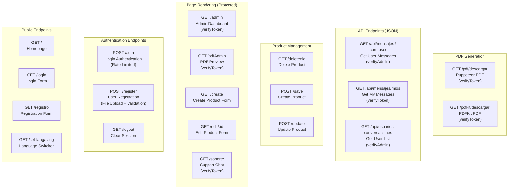
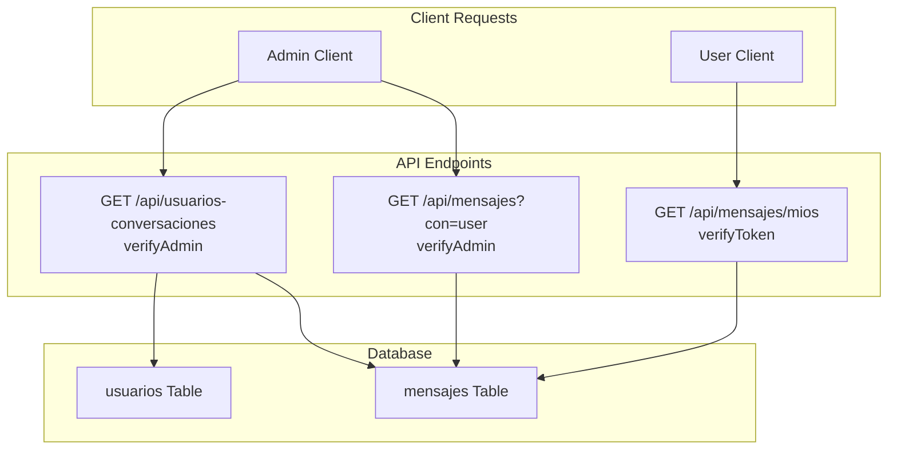
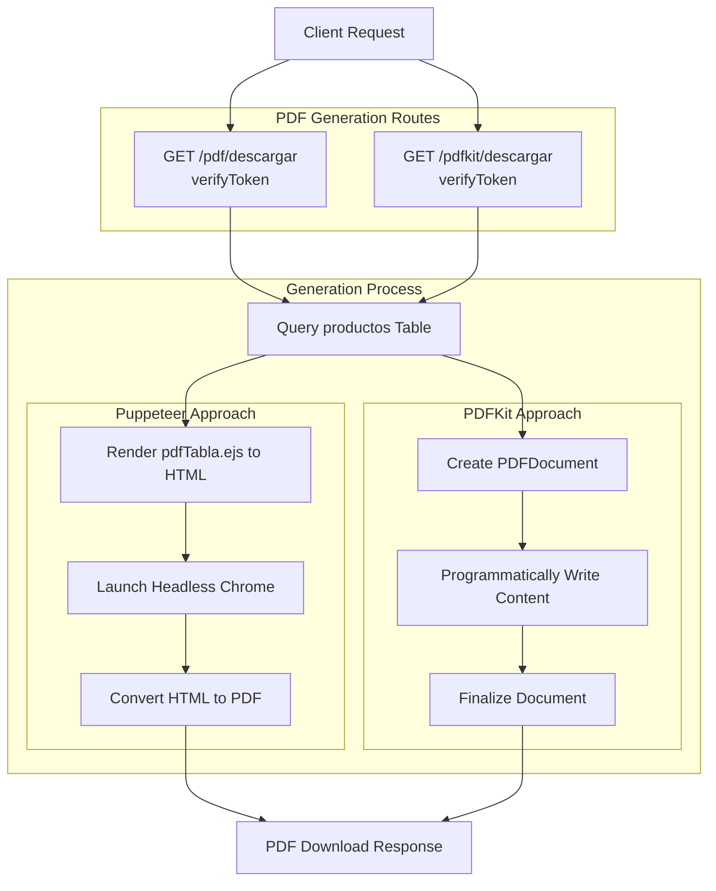
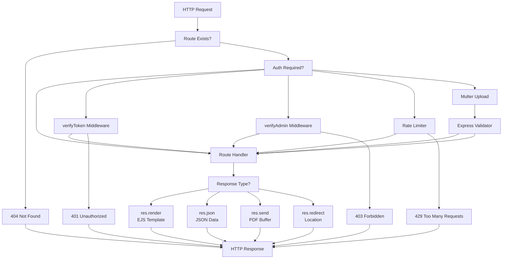

# HTTP Endpoints

> **Relevant source files**
> * [src/router.js](https://github.com/moichuelo/registro/blob/544abbcc/src/router.js)

This document provides a comprehensive reference for all HTTP endpoints exposed by the Express application. All routes are defined in [src/router.js](https://github.com/moichuelo/registro/blob/544abbcc/src/router.js)

 and handle various functionalities including authentication, page rendering, product management, real-time chat support, PDF generation, and internationalization.

For information about WebSocket events and real-time communication, see [15.2](/moichuelo/registro/15.2-websocket-events). For details about authentication mechanisms and middleware, see [6](/moichuelo/registro/6-authentication-and-authorization).

---

## Endpoint Categories

The application exposes 20 distinct HTTP endpoints organized into the following functional categories:



**Sources:** [src/router.js L1-L607](https://github.com/moichuelo/registro/blob/544abbcc/src/router.js#L1-L607)

---

## Authentication and Authorization Middleware

The following middleware functions are applied to protected endpoints:

| Middleware | Purpose | Effect | Applied To |
| --- | --- | --- | --- |
| `verifyToken` | JWT validation | Extracts and verifies JWT from cookie, attaches `req.user` | User-protected routes |
| `verifyAdmin` | Admin role check | Requires `req.user.rol === 'admin'` (stacked on `verifyToken`) | Admin-only routes |
| `limiter` | Rate limiting | Prevents brute-force attacks on login | `/auth` endpoint |
| `upload.single()` | File upload | Handles multipart/form-data for profile images | `/register` endpoint |

**Sources:** [src/router.js L16-L21](https://github.com/moichuelo/registro/blob/544abbcc/src/router.js#L16-L21)

---

## Public Endpoints

### GET /

**Purpose:** Render the application homepage.

**Authentication:** None (public access).

**Behavior:**

* If a valid JWT cookie exists, displays personalized greeting with username
* If no JWT exists, prompts user to log in

**Response:** Renders `index.ejs` template.

**Request Example:**

```yaml
GET / HTTP/1.1
Cookie: token=eyJhbGciOiJIUzI1NiIsInR5cCI6IkpXVCJ9...
```

**Template Variables:**

```

```

**Sources:** [src/router.js L59-L74](https://github.com/moichuelo/registro/blob/544abbcc/src/router.js#L59-L74)

---

### GET /login

**Purpose:** Render the login form page.

**Authentication:** None (public access).

**Response:** Renders `login.ejs` template.

**Sources:** [src/router.js L75-L77](https://github.com/moichuelo/registro/blob/544abbcc/src/router.js#L75-L77)

---

### GET /registro

**Purpose:** Render the user registration form page.

**Authentication:** None (public access).

**Response:** Renders `register.ejs` template.

**Sources:** [src/router.js L78-L80](https://github.com/moichuelo/registro/blob/544abbcc/src/router.js#L78-L80)

---

### GET /set-lang/:lang

**Purpose:** Set the user's language preference and redirect back.

**Authentication:** None (public access).

**URL Parameters:**

| Parameter | Type | Required | Valid Values | Description |
| --- | --- | --- | --- | --- |
| `lang` | string | Yes | `'es'`, `'en'` | Language code |

**Query Parameters:**

| Parameter | Type | Required | Default | Description |
| --- | --- | --- | --- | --- |
| `returnTo` | string | No | `/` | URL to redirect after setting language |

**Behavior:**

* Sets a `lang` cookie with the specified language
* Cookie expires in 15 minutes (900000 ms)
* Redirects to `returnTo` parameter or `/` by default

**Request Example:**

```
GET /set-lang/es?returnTo=/admin HTTP/1.1
```

**Response:**

```yaml
HTTP/1.1 302 Found
Location: /admin
Set-Cookie: lang=es; Path=/; HttpOnly; Max-Age=900000
```

**Sources:** [src/router.js L398-L407](https://github.com/moichuelo/registro/blob/544abbcc/src/router.js#L398-L407)

---

## Authentication Endpoints

### POST /auth

**Purpose:** Authenticate user credentials and issue JWT token.

**Authentication:** None (but rate limited).

**Middleware:** `limiter` - Prevents brute-force attacks.

**Request Body (application/x-www-form-urlencoded):**

| Field | Type | Required | Description |
| --- | --- | --- | --- |
| `user` | string | Yes | Username |
| `pass` | string | Yes | Password (plaintext) |

**Request Example:**

```
POST /auth HTTP/1.1
Content-Type: application/x-www-form-urlencoded

user=john&pass=secret123
```

**Response on Success:**

```
HTTP/1.1 200 OK
Set-Cookie: token=eyJhbGciOiJIUzI1NiIsInR5cCI6IkpXVCJ9...; Path=/; HttpOnly; Max-Age=3600000
Content-Type: text/html

(Renders login.ejs with success alert)
```

**JWT Payload Structure:**

```

```

**Error Responses:**

| Status | Condition | Rendered Alert |
| --- | --- | --- |
| 401 | Invalid credentials | "El usuario o la contraseña son incorrectos" |
| 400 | Missing user/pass | "Introduzca su usuario y contraseña" |

**Password Verification:**

* Password is hashed using bcrypt with salt rounds = 8
* Comparison performed via `bcrypt.compare()`

**Sources:** [src/router.js L532-L601](https://github.com/moichuelo/registro/blob/544abbcc/src/router.js#L532-L601)

---

### POST /register

**Purpose:** Register a new user account with optional profile image.

**Authentication:** None (public access).

**Middleware:**

* `upload.single("profileImage")` - Handles file upload
* `express-validator` - Validates input fields

**Request Body (multipart/form-data):**

| Field | Type | Required | Validation | Description |
| --- | --- | --- | --- | --- |
| `user` | string | Yes | min 4 chars | Username |
| `name` | string | Yes | min 4 chars | Full name |
| `pass` | string | Yes | min 4 chars | Password |
| `email` | string | Yes | valid email | Email address |
| `edad` | number | Yes | numeric | Age |
| `rol` | string | Yes | - | User role |
| `profileImage` | file | No | - | Profile image file |

**Validation Rules:**

```

```

**Request Example:**

```
POST /register HTTP/1.1
Content-Type: multipart/form-data; boundary=----WebKitFormBoundary...

------WebKitFormBoundary...
Content-Disposition: form-data; name="user"

john
------WebKitFormBoundary...
Content-Disposition: form-data; name="pass"

secret123
------WebKitFormBoundary...
Content-Disposition: form-data; name="profileImage"; filename="avatar.jpg"
Content-Type: image/jpeg

(binary data)
------WebKitFormBoundary...--
```

**Behavior:**

1. Validates all input fields
2. Hashes password using bcrypt (8 rounds)
3. Saves uploaded image to `public/uploads/` (if provided)
4. Inserts user record into `usuarios` table
5. Renders success/failure alert

**Response on Success:**

```
HTTP/1.1 200 OK
Content-Type: text/html

(Renders register.ejs with success alert)
```

**Response on Validation Failure:**

```
HTTP/1.1 200 OK
Content-Type: text/html

(Renders register.ejs with validation errors and previous values)
```

**Database Insert:**

```

```

```

```

**Sources:** [src/router.js L414-L484](https://github.com/moichuelo/registro/blob/544abbcc/src/router.js#L414-L484)

---

### GET /logout

**Purpose:** Clear authentication session and log out user.

**Authentication:** None (but typically called by authenticated users).

**Behavior:**

* Clears the `token` cookie
* Redirects to homepage

**Request Example:**

```yaml
GET /logout HTTP/1.1
Cookie: token=eyJhbGciOiJIUzI1NiIsInR5cCI6IkpXVCJ9...
```

**Response:**

```yaml
HTTP/1.1 302 Found
Location: /
Set-Cookie: token=; Path=/; Expires=Thu, 01 Jan 1970 00:00:00 GMT
```

**Sources:** [src/router.js L215-L218](https://github.com/moichuelo/registro/blob/544abbcc/src/router.js#L215-L218)

---

## Page Rendering Endpoints (Protected)

### GET /admin

**Purpose:** Render the admin dashboard with product listing.

**Authentication:** `verifyToken` middleware required.

**Authorization:** Any authenticated user (not admin-only).

**Database Query:**

```

```

**Response:** Renders `admin.ejs` template.

**Template Variables:**

```

```

**Request Example:**

```yaml
GET /admin HTTP/1.1
Cookie: token=eyJhbGciOiJIUzI1NiIsInR5cCI6IkpXVCJ9...
```

**Error Response:**

| Status | Condition |
| --- | --- |
| 401 | Invalid or missing JWT token |
| 500 | Database query error |

**Sources:** [src/router.js L119-L134](https://github.com/moichuelo/registro/blob/544abbcc/src/router.js#L119-L134)

---

### GET /pdfAdmin

**Purpose:** Render PDF preview page with product data (used by Puppeteer).

**Authentication:** `verifyToken` middleware required.

**Database Query:**

```

```

**Response:** Renders `pdfTabla.ejs` template (designed for PDF conversion).

**Template Variables:** Same as `/admin` endpoint.

**Sources:** [src/router.js L136-L151](https://github.com/moichuelo/registro/blob/544abbcc/src/router.js#L136-L151)

---

### GET /create

**Purpose:** Render the product creation form.

**Authentication:** None explicitly (but typically accessed by admins).

**Response:** Renders `create.ejs` template.

**Sources:** [src/router.js L153-L155](https://github.com/moichuelo/registro/blob/544abbcc/src/router.js#L153-L155)

---

### GET /edit/:id

**Purpose:** Render the product editing form with existing product data.

**Authentication:** None explicitly (but typically accessed by admins).

**URL Parameters:**

| Parameter | Type | Required | Description |
| --- | --- | --- | --- |
| `id` | integer | Yes | Product reference (`ref`) |

**Database Query:**

```

```

**Response:** Renders `edit.ejs` template.

**Template Variables:**

```

```

**Request Example:**

```
GET /edit/1 HTTP/1.1
```

**Error Response:**

| Status | Condition |
| --- | --- |
| 500 | Database query error or product not found |

**Sources:** [src/router.js L186-L196](https://github.com/moichuelo/registro/blob/544abbcc/src/router.js#L186-L196)

---

### GET /delete/:id

**Purpose:** Delete a product and redirect to admin page.

**Authentication:** None explicitly (but should be admin-only).

**URL Parameters:**

| Parameter | Type | Required | Description |
| --- | --- | --- | --- |
| `id` | integer | Yes | Product reference (`ref`) |

**Database Query:**

```

```

**Behavior:**

* Deletes product from database
* Redirects to `/admin`

**Request Example:**

```sql
GET /delete/1 HTTP/1.1
```

**Response:**

```yaml
HTTP/1.1 302 Found
Location: /admin
```

**Sources:** [src/router.js L198-L208](https://github.com/moichuelo/registro/blob/544abbcc/src/router.js#L198-L208)

---

### GET /soporte

**Purpose:** Render the support chat interface.

**Authentication:** `verifyToken` middleware required.

**Response:** Renders `soporte.ejs` template.

**Template Variables:**

```

```

**Request Example:**

```yaml
GET /soporte HTTP/1.1
Cookie: token=eyJhbGciOiJIUzI1NiIsInR5cCI6IkpXVCJ9...
```

**Notes:**

* Admin users see a multi-conversation interface with user list
* Regular users see a single-conversation interface
* Real-time messaging handled via Socket.IO (see [15.2](/moichuelo/registro/15.2-websocket-events))

**Sources:** [src/router.js L220-L227](https://github.com/moichuelo/registro/blob/544abbcc/src/router.js#L220-L227)

---

## Product Management Endpoints

### POST /save

**Purpose:** Create a new product.

**Authentication:** None explicitly (but should be admin-only).

**Handler:** Delegated to `crud.save` controller function.

**Request Body:** Expected to contain product details (defined in controllers module).

**Sources:** [src/router.js L603](https://github.com/moichuelo/registro/blob/544abbcc/src/router.js#L603-L603)

---

### POST /update

**Purpose:** Update an existing product.

**Authentication:** None explicitly (but should be admin-only).

**Handler:** Delegated to `crud.update` controller function.

**Request Body:** Expected to contain product ID and updated details (defined in controllers module).

**Sources:** [src/router.js L604](https://github.com/moichuelo/registro/blob/544abbcc/src/router.js#L604-L604)

---

## API Endpoints (JSON Responses)



**Sources:** [src/router.js L229-L315](https://github.com/moichuelo/registro/blob/544abbcc/src/router.js#L229-L315)

---

### GET /api/mensajes

**Purpose:** Retrieve all messages for a specific user (admin-only).

**Authentication:** `verifyAdmin` middleware required.

**Query Parameters:**

| Parameter | Type | Required | Description |
| --- | --- | --- | --- |
| `con` | string | Yes | Username to retrieve messages for |

**Database Query:**

```

```

**Request Example:**

```yaml
GET /api/mensajes?con=john HTTP/1.1
Cookie: token=eyJhbGciOiJIUzI1NiIsInR5cCI6IkpXVCJ9...
```

**Response on Success:**

```

```

**Error Responses:**

| Status | Condition | Response Body |
| --- | --- | --- |
| 400 | Missing `con` parameter | `{ "error": "Falta el parámetro ?con=usuario" }` |
| 401 | Not authenticated | - |
| 403 | Not admin | - |
| 500 | Database error | `{ "error": "Error al obtener mensajes" }` |

**Sources:** [src/router.js L229-L253](https://github.com/moichuelo/registro/blob/544abbcc/src/router.js#L229-L253)

---

### GET /api/mensajes/mios

**Purpose:** Retrieve all messages for the authenticated user.

**Authentication:** `verifyToken` middleware required.

**Query Parameters:** None (uses `req.user.user` from JWT).

**Database Query:**

```

```

**Request Example:**

```yaml
GET /api/mensajes/mios HTTP/1.1
Cookie: token=eyJhbGciOiJIUzI1NiIsInR5cCI6IkpXVCJ9...
```

**Response on Success:**

```

```

**Error Responses:**

| Status | Condition | Response Body |
| --- | --- | --- |
| 401 | Not authenticated | - |
| 403 | User not found in token | `{ "error": "No autorizado" }` |
| 500 | Database error | `{ "error": "Error interno" }` |

**Sources:** [src/router.js L256-L280](https://github.com/moichuelo/registro/blob/544abbcc/src/router.js#L256-L280)

---

### GET /api/usuarios-conversaciones

**Purpose:** Retrieve list of non-admin users who have conversations with admins.

**Authentication:** `verifyAdmin` middleware required.

**Query Parameters:** None.

**Database Query:**

```

```

**Query Explanation:**

1. Finds messages sent TO admins (extracts sender as `de_usuario`)
2. Finds messages sent FROM admins (extracts recipient as `para_usuario`)
3. Unions both result sets (eliminates duplicates)
4. Filters out admin usernames
5. Returns distinct user list

**Request Example:**

```yaml
GET /api/usuarios-conversaciones HTTP/1.1
Cookie: token=eyJhbGciOiJIUzI1NiIsInR5cCI6IkpXVCJ9...
```

**Response on Success:**

```

```

**Error Responses:**

| Status | Condition | Response Body |
| --- | --- | --- |
| 401 | Not authenticated | - |
| 403 | Not admin | - |
| 500 | Database error | `{ "error": "Error interno" }` |

**Sources:** [src/router.js L283-L315](https://github.com/moichuelo/registro/blob/544abbcc/src/router.js#L283-L315)

---

## PDF Generation Endpoints

Both endpoints require authentication and generate downloadable PDF files containing product listings.



**Sources:** [src/router.js L317-L396](https://github.com/moichuelo/registro/blob/544abbcc/src/router.js#L317-L396)

---

### GET /pdf/descargar

**Purpose:** Generate and download a PDF of product listings using Puppeteer.

**Authentication:** `verifyToken` middleware required.

**Generation Method:** HTML-to-PDF via headless Chrome.

**Process Flow:**

1. Queries `productos` table
2. Renders `pdfTabla.ejs` template to HTML string
3. Launches headless Puppeteer browser
4. Loads HTML into new page
5. Generates PDF with A4 format
6. Sends PDF buffer to client

**Request Example:**

```yaml
GET /pdf/descargar HTTP/1.1
Cookie: token=eyJhbGciOiJIUzI1NiIsInR5cCI6IkpXVCJ9...
```

**Response on Success:**

```
HTTP/1.1 200 OK
Content-Type: application/pdf
Content-Disposition: attachment; filename="productos.pdf"

(PDF binary data)
```

**Puppeteer Configuration:**

```

```

**PDF Options:**

```

```

**Error Responses:**

| Status | Condition |
| --- | --- |
| 401 | Not authenticated |
| 500 | Database error or PDF generation error |

**Sources:** [src/router.js L317-L353](https://github.com/moichuelo/registro/blob/544abbcc/src/router.js#L317-L353)

---

### GET /pdfkit/descargar

**Purpose:** Generate and download a PDF of product listings using PDFKit.

**Authentication:** `verifyToken` middleware required.

**Generation Method:** Programmatic PDF creation (no HTML rendering).

**Process Flow:**

1. Queries `productos` table
2. Creates `PDFDocument` instance (A4, 40px margin)
3. Pipes document to HTTP response
4. Writes title: "Listado de Productos"
5. Writes table headers (Helvetica-Bold, 12pt)
6. Iterates products and writes rows (Helvetica, 11pt)
7. Finalizes document

**Request Example:**

```yaml
GET /pdfkit/descargar HTTP/1.1
Cookie: token=eyJhbGciOiJIUzI1NiIsInR5cCI6IkpXVCJ9...
```

**Response on Success:**

```
HTTP/1.1 200 OK
Content-Type: application/pdf
Content-Disposition: attachment; filename="productos_desde_cero.pdf"

(PDF binary data)
```

**Document Structure:**

```yaml
Title: "Listado de Productos" (18pt, centered)
|
Table Headers (Bold, 12pt):
  Referencia (x=50) | Nombre (x=150) | Precio (x=300) | Stock (x=380)
|
Product Rows (11pt, 20px spacing):
  ref | nombre | precio | stock
  ...
```

**Positioning Coordinates:**

| Column | X Position | Content |
| --- | --- | --- |
| Referencia | 50 | `p.ref.toString()` |
| Nombre | 150 | `p.nombre` |
| Precio | 300 | `Number(p.precio).toFixed(2)` |
| Stock | 380 | `p.stock.toString()` |

**Error Responses:**

| Status | Condition |
| --- | --- |
| 401 | Not authenticated |
| 500 | Database error |

**Sources:** [src/router.js L355-L396](https://github.com/moichuelo/registro/blob/544abbcc/src/router.js#L355-L396)

---

## Endpoint Summary Table

| Method | Path | Auth | Purpose | Response Type |
| --- | --- | --- | --- | --- |
| GET | `/` | None | Homepage | HTML |
| GET | `/login` | None | Login form | HTML |
| GET | `/registro` | None | Registration form | HTML |
| GET | `/set-lang/:lang` | None | Set language | Redirect |
| POST | `/auth` | Rate limited | Authenticate user | HTML |
| POST | `/register` | File upload | Register user | HTML |
| GET | `/logout` | None | Clear session | Redirect |
| GET | `/admin` | `verifyToken` | Admin dashboard | HTML |
| GET | `/pdfAdmin` | `verifyToken` | PDF preview page | HTML |
| GET | `/create` | None | Create product form | HTML |
| GET | `/edit/:id` | None | Edit product form | HTML |
| GET | `/delete/:id` | None | Delete product | Redirect |
| GET | `/soporte` | `verifyToken` | Support chat UI | HTML |
| GET | `/api/mensajes` | `verifyAdmin` | Get user messages | JSON |
| GET | `/api/mensajes/mios` | `verifyToken` | Get my messages | JSON |
| GET | `/api/usuarios-conversaciones` | `verifyAdmin` | Get user list | JSON |
| GET | `/pdf/descargar` | `verifyToken` | Download PDF (Puppeteer) | PDF |
| GET | `/pdfkit/descargar` | `verifyToken` | Download PDF (PDFKit) | PDF |
| POST | `/save` | None | Create product | (via controller) |
| POST | `/update` | None | Update product | (via controller) |

**Sources:** [src/router.js L1-L607](https://github.com/moichuelo/registro/blob/544abbcc/src/router.js#L1-L607)

---

## Request/Response Flow Diagram



**Sources:** [src/router.js L1-L607](https://github.com/moichuelo/registro/blob/544abbcc/src/router.js#L1-L607)