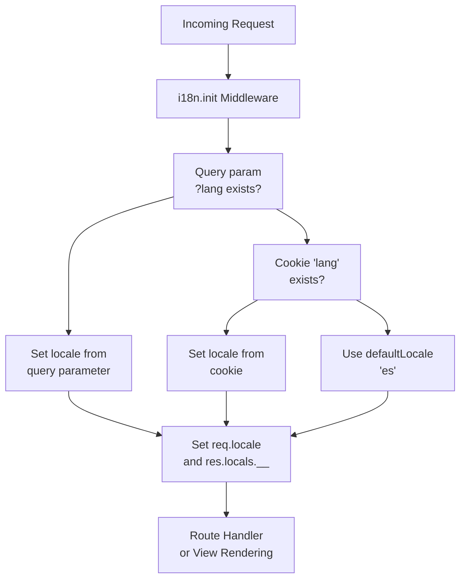
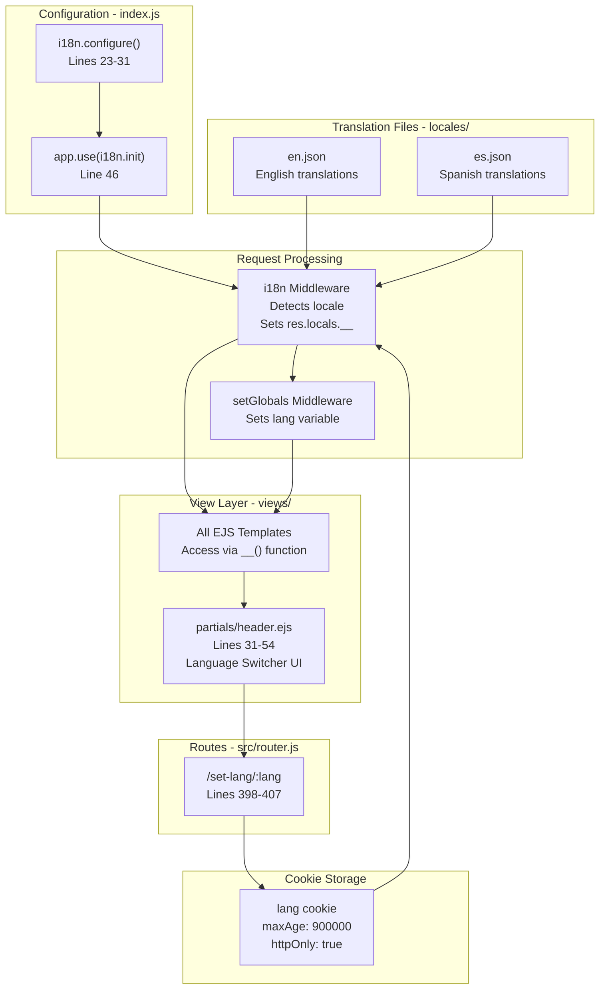
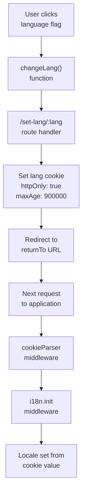

# Internationalization (i18n)

> **Relevant source files**
> * [index.js](https://github.com/moichuelo/registro/blob/544abbcc/index.js)
> * [src/router.js](https://github.com/moichuelo/registro/blob/544abbcc/src/router.js)
> * [views/partials/header.ejs](https://github.com/moichuelo/registro/blob/544abbcc/views/partials/header.ejs)

This page documents the internationalization (i18n) system that provides multi-language support for the application. The system currently supports English (en) and Spanish (es) locales, with Spanish as the default. Language preference is persisted via cookies and can be switched dynamically by users through the UI.

For information about the view layer where translations are rendered, see [View Layer & Templates](/moichuelo/registro/12-view-layer-and-templates). For details on middleware configuration, see [Application Bootstrap](/moichuelo/registro/4-application-bootstrap).

## System Overview

The i18n implementation uses the `i18n` npm package integrated into the Express middleware stack. The system provides language detection from multiple sources (cookie, query parameter), automatic translation file synchronization, and a user-facing language switcher component.

**Key Components:**

* **i18n Library Configuration**: Core setup in `index.js`
* **Language Cookie**: Stores user preference (`lang` cookie)
* **Language Switcher Route**: `/set-lang/:lang` endpoint
* **Translation Files**: JSON files in `locales/` directory
* **Header Component**: UI for language selection

## Configuration

The i18n system is configured during application bootstrap in [index.js L16-L31](https://github.com/moichuelo/registro/blob/544abbcc/index.js#L16-L31)

### i18n Configuration Object

| Property | Value | Purpose |
| --- | --- | --- |
| `locales` | `['en', 'es']` | Available language codes |
| `directory` | `path.join(__dirname, 'locales')` | Translation files location |
| `defaultLocale` | `'es'` | Fallback language (Spanish) |
| `cookie` | `'lang'` | Cookie name for language preference |
| `queryParameter` | `'lang'` | URL parameter for language override |
| `autoReload` | `true` | Reload translation files on change |
| `syncFiles` | `true` | Synchronize translation keys across files |

The configuration allows language detection from both cookies and URL query parameters (e.g., `?lang=en`), with automatic file reloading during development.

### Middleware Registration

The i18n middleware is registered in the Express middleware stack at [index.js L46](https://github.com/moichuelo/registro/blob/544abbcc/index.js#L46-L46)

:

```
app.use(i18n.init);
```

This middleware runs before route handlers, making translation functions available to all requests via `req.__()` and `res.__()` methods, and exposing the current locale to templates.

**Sources:** [index.js L16-L31](https://github.com/moichuelo/registro/blob/544abbcc/index.js#L16-L31)

 [index.js L46](https://github.com/moichuelo/registro/blob/544abbcc/index.js#L46-L46)

## Language Detection Flow



The i18n middleware processes each request following this priority:

1. **Query parameter**: `?lang=en` overrides all other settings
2. **Cookie value**: Previously set `lang` cookie
3. **Default locale**: Falls back to Spanish (`es`)

**Sources:** [index.js L22-L31](https://github.com/moichuelo/registro/blob/544abbcc/index.js#L22-L31)

## Language Switching

### Language Switcher Route

The `/set-lang/:lang` route at [src/router.js L398-L407](https://github.com/moichuelo/registro/blob/544abbcc/src/router.js#L398-L407)

 handles language preference changes:

```javascript
router.get('/set-lang/:lang', (req, res) => {
    const lang = req.params.lang;
    const returnTo = req.query.returnTo || '/';
    
    if (['es', 'en'].includes(lang)) {
        res.cookie('lang', lang, { maxAge: 900000, httpOnly: true });
    }
    
    res.redirect(returnTo);
});
```

**Process:**

1. Extracts language code from URL parameter (`:lang`)
2. Validates language is either `'es'` or `'en'`
3. Sets `lang` cookie with 900-second (15 minute) expiration
4. Redirects to `returnTo` query parameter or root path

The `httpOnly` flag prevents JavaScript access to the cookie, enhancing security.

### UI Language Switcher Component

The language switcher is implemented in the header partial at [views/partials/header.ejs L31-L54](https://github.com/moichuelo/registro/blob/544abbcc/views/partials/header.ejs#L31-L54)

:

```xml
<ul class="navbar-nav ms-auto">
    <li class="nav-item">
        <a class="nav-link idioma" href="#" onclick="changeLang('es')">
            
            🇪🇸
        </a>
    </li>
    <li class="nav-item">
        <a class="nav-link idioma" href="#" onclick="changeLang('en')">
            
            🇬🇧
        </a>
    </li>
</ul>
```

The `changeLang` JavaScript function at [views/partials/header.ejs L49-L53](https://github.com/moichuelo/registro/blob/544abbcc/views/partials/header.ejs#L49-L53)

 constructs the redirection URL:

```javascript
function changeLang(lang) {
    const currentPath = window.location.pathname + window.location.search;
    window.location.href = `/set-lang/${lang}?returnTo=${encodeURIComponent(currentPath)}`;
}
```

This preserves the current page context, allowing users to switch languages without losing their position in the application.

**Visual Indicators:**

* Active language displays with `active` CSS class at [views/partials/header.ejs L33-L40](https://github.com/moichuelo/registro/blob/544abbcc/views/partials/header.ejs#L33-L40)
* Determined by comparing `lang` variable with each locale: `<%= lang === 'es' ? 'active' : '' %>`

**Sources:** [src/router.js L398-L407](https://github.com/moichuelo/registro/blob/544abbcc/src/router.js#L398-L407)

 [views/partials/header.ejs L31-L54](https://github.com/moichuelo/registro/blob/544abbcc/views/partials/header.ejs#L31-L54)

## Language Switching Architecture

```mermaid
sequenceDiagram
  participant User
  participant Browser
  participant header.ejs
  participant Language Switcher
  participant /set-lang/:lang
  participant Route Handler
  participant lang Cookie
  participant i18n Middleware
  participant View Rendering

  User->>header.ejs: Click language flag
  header.ejs->>Browser: changeLang('en')
  Browser->>/set-lang/:lang: GET /set-lang/en?returnTo=/admin
  /set-lang/:lang->>/set-lang/:lang: Validate lang in ['es','en']
  /set-lang/:lang->>lang Cookie: Set cookie('lang', 'en')
  /set-lang/:lang->>Browser: Redirect to /admin
  Browser->>i18n Middleware: GET /admin
  i18n Middleware->>lang Cookie: Read lang cookie
  lang Cookie-->>i18n Middleware: 'en'
  i18n Middleware->>i18n Middleware: Set req.locale = 'en'
  i18n Middleware->>View Rendering: res.locals.__ available
  View Rendering-->>Browser: Rendered page in English
```

**Sources:** [src/router.js L398-L407](https://github.com/moichuelo/registro/blob/544abbcc/src/router.js#L398-L407)

 [views/partials/header.ejs L31-L54](https://github.com/moichuelo/registro/blob/544abbcc/views/partials/header.ejs#L31-L54)

 [index.js L22-L31](https://github.com/moichuelo/registro/blob/544abbcc/index.js#L22-L31)

## Using Translations in Code

### In Route Handlers

The i18n middleware exposes translation functions to request and response objects:

* `req.__('key')`: Translate a key for the current request locale
* `res.__('key')`: Translate a key and make available to views
* `req.getLocale()`: Get current locale code
* `res.locals.__`: Translation function automatically available in templates

### In EJS Templates

Templates can use the `__()` function directly, which is exposed via `res.locals`:

```html
<h1><%= __('welcome.title') %></h1>
<p><%= __('welcome.message') %></p>
```

The function accepts translation keys that map to entries in the locale JSON files.

### Locale Variable in Templates

The current locale code is available in templates via the `lang` variable, set by middleware (likely in `setGlobals` middleware referenced at [index.js L18](https://github.com/moichuelo/registro/blob/544abbcc/index.js#L18-L18)

). This is used for conditional rendering, such as highlighting the active language in the header at [views/partials/header.ejs L33-L40](https://github.com/moichuelo/registro/blob/544abbcc/views/partials/header.ejs#L33-L40)

:

```
<a class="nav-link <%= lang === 'es' ? 'active' : '' %>">
```

**Sources:** [index.js L46](https://github.com/moichuelo/registro/blob/544abbcc/index.js#L46-L46)

 [views/partials/header.ejs L33-L40](https://github.com/moichuelo/registro/blob/544abbcc/views/partials/header.ejs#L33-L40)

## Translation Files Structure

Translation files are stored in the `locales/` directory as specified in the i18n configuration at [index.js L25](https://github.com/moichuelo/registro/blob/544abbcc/index.js#L25-L25)

 The system expects two files:

* `locales/en.json`: English translations
* `locales/es.json`: Spanish translations

### File Format

Translation files follow a nested JSON structure:

```json
{
    "welcome": {
        "title": "Welcome",
        "message": "Welcome to the application"
    },
    "navigation": {
        "home": "Home",
        "login": "Login",
        "register": "Register"
    },
    "errors": {
        "notFound": "Page not found",
        "unauthorized": "Access denied"
    }
}
```

### Key Synchronization

The `syncFiles: true` option at [index.js L30](https://github.com/moichuelo/registro/blob/544abbcc/index.js#L30-L30)

 ensures that when a new translation key is added to one locale file, it automatically appears in all other locale files with a placeholder value. This helps maintain consistency across translations and identify missing translations.

### Auto-Reload

The `autoReload: true` option at [index.js L29](https://github.com/moichuelo/registro/blob/544abbcc/index.js#L29-L29)

 enables hot-reloading of translation files during development. Changes to JSON files are detected and reloaded without restarting the server.

**Sources:** [index.js L22-L31](https://github.com/moichuelo/registro/blob/544abbcc/index.js#L22-L31)

## i18n System Component Map



This diagram maps the relationships between configuration, storage, routing, and rendering components of the i18n system.

**Sources:** [index.js L16-L31](https://github.com/moichuelo/registro/blob/544abbcc/index.js#L16-L31)

 [index.js L46](https://github.com/moichuelo/registro/blob/544abbcc/index.js#L46-L46)

 [src/router.js L398-L407](https://github.com/moichuelo/registro/blob/544abbcc/src/router.js#L398-L407)

 [views/partials/header.ejs L31-L54](https://github.com/moichuelo/registro/blob/544abbcc/views/partials/header.ejs#L31-L54)

## Locale Detection Priority

The following table describes the precedence order for locale detection:

| Priority | Source | Description | Override Behavior |
| --- | --- | --- | --- |
| 1 | Query Parameter | `?lang=en` in URL | Overrides cookie and default |
| 2 | Cookie | `lang` cookie value | Overrides default only |
| 3 | Default Locale | `defaultLocale: 'es'` | Used if no other source exists |

The query parameter method is useful for:

* Testing translations
* Sharing URLs in specific languages
* One-time language switches without changing preferences

The cookie method provides:

* Persistent language preference across sessions
* Automatic language restoration on return visits
* No URL pollution with language parameters

**Sources:** [index.js L22-L31](https://github.com/moichuelo/registro/blob/544abbcc/index.js#L22-L31)

 [src/router.js L398-L407](https://github.com/moichuelo/registro/blob/544abbcc/src/router.js#L398-L407)

## Integration with Global Middleware

The i18n middleware is positioned strategically in the middleware stack at [index.js L46](https://github.com/moichuelo/registro/blob/544abbcc/index.js#L46-L46)

 after core parsing middleware but before the `setGlobals` middleware at [index.js L47](https://github.com/moichuelo/registro/blob/544abbcc/index.js#L47-L47)

 This ensures:

1. **Cookie Parsing**: The `cookieParser` middleware at [index.js L37](https://github.com/moichuelo/registro/blob/544abbcc/index.js#L37-L37)  runs first, making the `lang` cookie available
2. **Locale Detection**: i18n middleware reads the cookie and sets locale
3. **Global Variables**: `setGlobals` middleware can access locale information and expose it to templates
4. **Route Handlers**: All routes have access to translation functions

The middleware stack order for i18n-related components:

```
cookieParser → i18n.init → setGlobals → router
```

**Sources:** [index.js L37](https://github.com/moichuelo/registro/blob/544abbcc/index.js#L37-L37)

 [index.js L46-L48](https://github.com/moichuelo/registro/blob/544abbcc/index.js#L46-L48)

## Language Persistence Flow



The language preference persists for 15 minutes (900,000 milliseconds) as configured in the cookie `maxAge` at [src/router.js L403](https://github.com/moichuelo/registro/blob/544abbcc/src/router.js#L403-L403)

 After expiration, the system falls back to the default Spanish locale.

**Sources:** [src/router.js L398-L407](https://github.com/moichuelo/registro/blob/544abbcc/src/router.js#L398-L407)

 [views/partials/header.ejs L49-L53](https://github.com/moichuelo/registro/blob/544abbcc/views/partials/header.ejs#L49-L53)

 [index.js L37](https://github.com/moichuelo/registro/blob/544abbcc/index.js#L37-L37)

 [index.js L46](https://github.com/moichuelo/registro/blob/544abbcc/index.js#L46-L46)

## Supported Locales

| Locale Code | Language | Default | Flag Icon | Image File |
| --- | --- | --- | --- | --- |
| `es` | Spanish (Español) | ✓ | 🇪🇸 | `/resources/img/es.png` |
| `en` | English |  | 🇬🇧 | `/resources/img/en.png` |

The supported locales are defined in the `locales` array at [index.js L24](https://github.com/moichuelo/registro/blob/544abbcc/index.js#L24-L24)

 and validated in the language switcher route at [src/router.js L402](https://github.com/moichuelo/registro/blob/544abbcc/src/router.js#L402-L402)

To add a new language, you would need to:

1. Add the locale code to the `locales` array in `i18n.configure()`
2. Create a corresponding JSON file in `locales/` directory (e.g., `locales/fr.json`)
3. Add a language switcher button in `views/partials/header.ejs`
4. Update the validation in the `/set-lang/:lang` route handler

**Sources:** [index.js L24](https://github.com/moichuelo/registro/blob/544abbcc/index.js#L24-L24)

 [src/router.js L402](https://github.com/moichuelo/registro/blob/544abbcc/src/router.js#L402-L402)

 [views/partials/header.ejs L31-L46](https://github.com/moichuelo/registro/blob/544abbcc/views/partials/header.ejs#L31-L46)