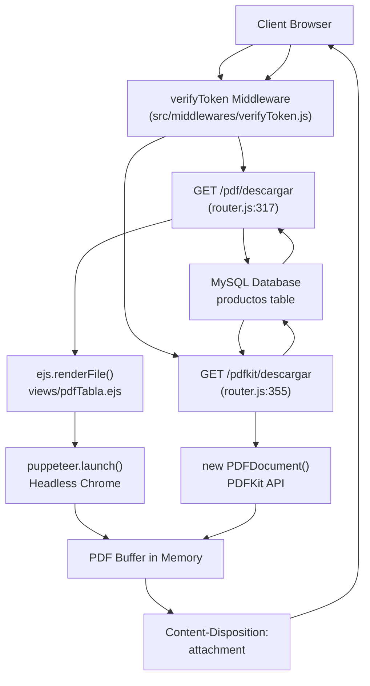
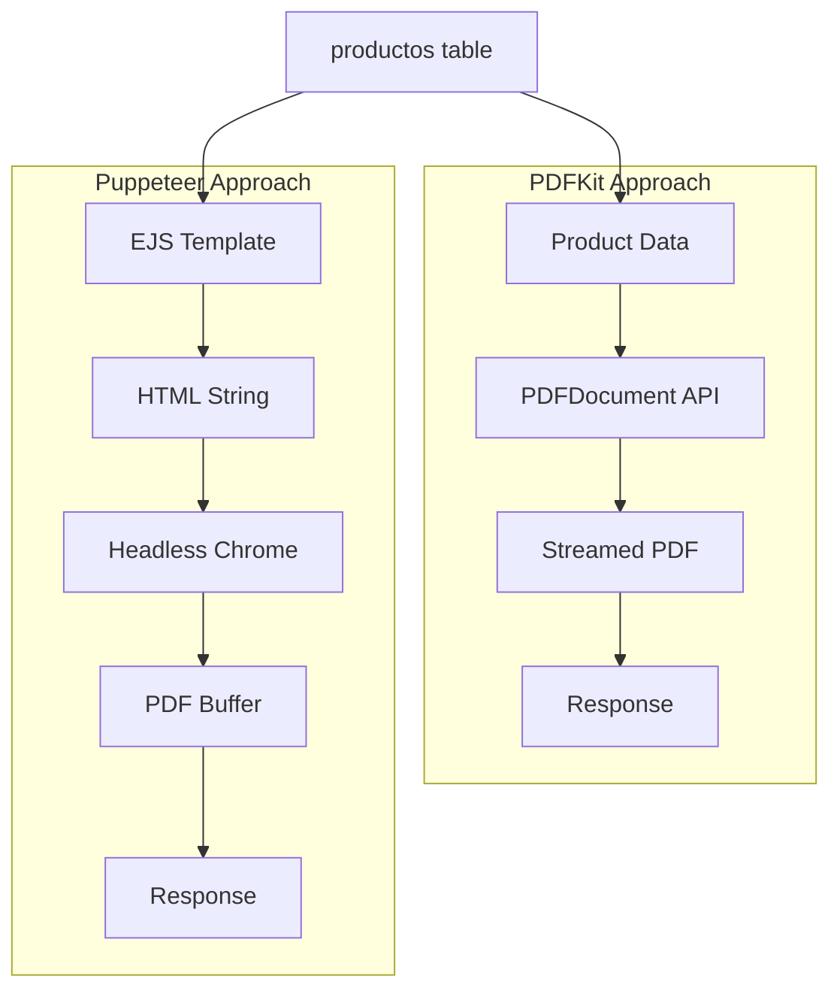
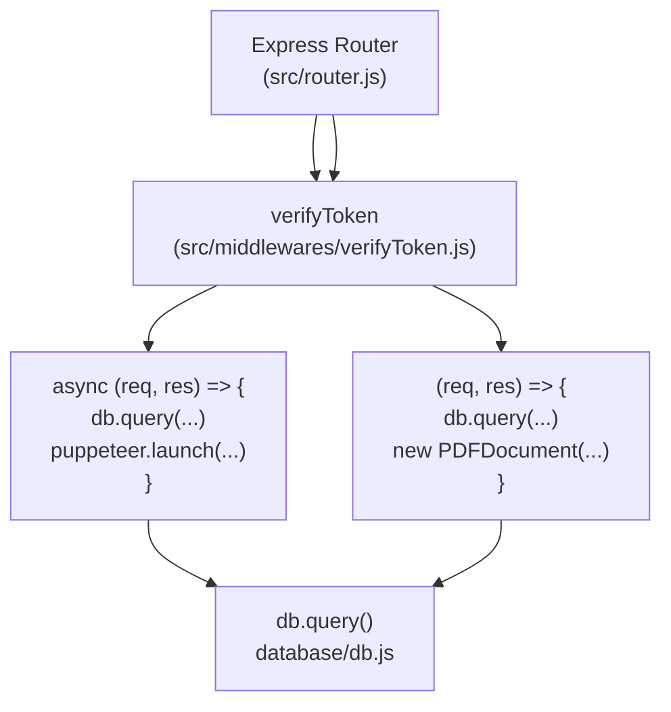

# PDF Generation

> **Relevant source files**
> * [package-lock.json](https://github.com/moichuelo/registro/blob/544abbcc/package-lock.json)
> * [src/router.js](https://github.com/moichuelo/registro/blob/544abbcc/src/router.js)

This document describes the two PDF generation systems implemented in the application: **Puppeteer-based HTML-to-PDF conversion** and **PDFKit-based programmatic PDF creation**. Both approaches generate downloadable product reports from the `productos` database table.

For information about routing and authentication middleware that protect these endpoints, see [Routing System](/moichuelo/registro/5-routing-system) and [Authentication & Authorization](/moichuelo/registro/6-authentication-and-authorization).

**Sources:** [src/router.js L317-L396](https://github.com/moichuelo/registro/blob/544abbcc/src/router.js#L317-L396)

---

## Overview

The application provides two distinct methods for generating PDF documents containing product data:

| Approach | Route | Library | Method |
| --- | --- | --- | --- |
| HTML-to-PDF | `/pdf/descargar` | Puppeteer v24.14.0 | Renders EJS template, converts HTML to PDF via headless Chrome |
| Programmatic | `/pdfkit/descargar` | PDFKit v0.17.1 | Direct PDF construction using drawing commands |

Both routes are protected by the `verifyToken` middleware and query the `productos` table from the MySQL database before generating output.

**Sources:** [src/router.js L317-L396](https://github.com/moichuelo/registro/blob/544abbcc/src/router.js#L317-L396)

 [package-lock.json L27-L28](https://github.com/moichuelo/registro/blob/544abbcc/package-lock.json#L27-L28)

---

## PDF Generation Architecture



**Diagram: PDF Generation Request Flow**

This diagram shows how both PDF generation routes start with authentication via `verifyToken`, query the database, then diverge into their respective generation strategies before sending the PDF to the client.

**Sources:** [src/router.js L317-L396](https://github.com/moichuelo/registro/blob/544abbcc/src/router.js#L317-L396)

 [src/middlewares/verifyToken.js](https://github.com/moichuelo/registro/blob/544abbcc/src/middlewares/verifyToken.js)

---

## Puppeteer-Based PDF Generation

### Route Definition

The Puppeteer approach is implemented at the `/pdf/descargar` endpoint [src/router.js L317-L353](https://github.com/moichuelo/registro/blob/544abbcc/src/router.js#L317-L353)

 It follows this sequence:

1. **Database Query**: Executes `SELECT * FROM productos` via `db.query()` [src/router.js L318](https://github.com/moichuelo/registro/blob/544abbcc/src/router.js#L318-L318)
2. **EJS Rendering**: Calls `ejs.renderFile()` with `views/pdfTabla.ejs` and product data [src/router.js L324-L326](https://github.com/moichuelo/registro/blob/544abbcc/src/router.js#L324-L326)
3. **Browser Launch**: Starts headless Chrome with `puppeteer.launch()` [src/router.js L328-L331](https://github.com/moichuelo/registro/blob/544abbcc/src/router.js#L328-L331)
4. **HTML Loading**: Creates new page and loads HTML with `page.setContent()` [src/router.js L333-L334](https://github.com/moichuelo/registro/blob/544abbcc/src/router.js#L333-L334)
5. **PDF Conversion**: Generates PDF buffer with `page.pdf()` [src/router.js L336-L340](https://github.com/moichuelo/registro/blob/544abbcc/src/router.js#L336-L340)
6. **Cleanup**: Closes browser with `browser.close()` [src/router.js L342](https://github.com/moichuelo/registro/blob/544abbcc/src/router.js#L342-L342)
7. **Response**: Sets headers and sends buffer [src/router.js L344-L346](https://github.com/moichuelo/registro/blob/544abbcc/src/router.js#L344-L346)

### Puppeteer Launch Configuration

```javascript
const browser = await puppeteer.launch({
    headless: true,
    args: ["--no-sandbox", "--disable-setuid-sandbox"],
});
```

The launch arguments `--no-sandbox` and `--disable-setuid-sandbox` are necessary for running Chrome in containerized or restricted environments [src/router.js L328-L331](https://github.com/moichuelo/registro/blob/544abbcc/src/router.js#L328-L331)

### PDF Generation Options

```javascript
const pdfBuffer = await page.pdf({
    format: "A4",
    printBackground: true,
    margin: { top: "20px", bottom: "20px" },
});
```

The `page.pdf()` method converts the rendered HTML to a PDF with A4 format, background graphics enabled, and 20px top/bottom margins [src/router.js L336-L340](https://github.com/moichuelo/registro/blob/544abbcc/src/router.js#L336-L340)

### EJS Template

The template rendered is `views/pdfTabla.ejs`, which receives a `productos` array containing database query results [src/router.js L324-L326](https://github.com/moichuelo/registro/blob/544abbcc/src/router.js#L324-L326)

 This template is also used for the `/pdfAdmin` route preview [src/router.js L136-L151](https://github.com/moichuelo/registro/blob/544abbcc/src/router.js#L136-L151)

### Error Handling

The route wraps the entire generation process in a try-catch block. If any step fails, it logs the error and returns a 500 status with message "Error interno al generar el PDF" [src/router.js L348-L351](https://github.com/moichuelo/registro/blob/544abbcc/src/router.js#L348-L351)

**Sources:** [src/router.js L317-L353](https://github.com/moichuelo/registro/blob/544abbcc/src/router.js#L317-L353)

---

## PDFKit-Based PDF Generation

### Route Definition

The PDFKit approach is implemented at the `/pdfkit/descargar` endpoint [src/router.js L355-L396](https://github.com/moichuelo/registro/blob/544abbcc/src/router.js#L355-L396)

 It constructs the PDF programmatically without any HTML intermediate step.

```mermaid
sequenceDiagram
  participant Client
  participant /pdfkit/descargar
  participant MySQL productos
  participant PDFDocument
  participant HTTP Response Stream

  Client->>/pdfkit/descargar: GET /pdfkit/descargar
  /pdfkit/descargar->>MySQL productos: SELECT * FROM productos
  MySQL productos-->>/pdfkit/descargar: results array
  /pdfkit/descargar->>PDFDocument: new PDFDocument()
  /pdfkit/descargar->>HTTP Response Stream: doc.pipe(res)
  PDFDocument->>HTTP Response Stream: Title (fontSize 18, centered)
  PDFDocument->>HTTP Response Stream: Table Headers (Helvetica-Bold, 12pt)
  loop [Each Product]
    PDFDocument->>HTTP Response Stream: Row Data (Helvetica, 11pt)
  end
  PDFDocument->>HTTP Response Stream: doc.end()
  HTTP Response Stream-->>Client: productos_desde_cero.pdf
```

**Diagram: PDFKit Generation Sequence**

The diagram shows how PDFKit streams the PDF directly to the HTTP response as it's being constructed, rather than building in memory first.

**Sources:** [src/router.js L355-L396](https://github.com/moichuelo/registro/blob/544abbcc/src/router.js#L355-L396)

### Document Initialization

```javascript
const doc = new PDFDocument({ margin: 40, size: 'A4' });
```

The `PDFDocument` constructor sets a 40-point margin on all sides and A4 page size [src/router.js L361](https://github.com/moichuelo/registro/blob/544abbcc/src/router.js#L361-L361)

### Response Headers

```
res.setHeader("Content-Disposition", 'attachment; filename="productos_desde_cero.pdf"');
res.setHeader("Content-Type", "application/pdf");
doc.pipe(res);
```

The document is piped directly to the response stream, allowing immediate transmission without buffering the entire PDF in memory [src/router.js L364-L367](https://github.com/moichuelo/registro/blob/544abbcc/src/router.js#L364-L367)

### Content Rendering

The document constructs a table layout through manual positioning:

| Operation | Method | Position | Purpose |
| --- | --- | --- | --- |
| Title | `doc.fontSize(18).text()` | Centered | "Listado de Productos" heading |
| Headers | `doc.font("Helvetica-Bold").fontSize(12)` | Fixed X coordinates | Column labels |
| Data Rows | `doc.font("Helvetica").fontSize(11)` | Incremental Y | Product records |

**Column X Coordinates:**

* Referencia: 50
* Nombre: 150
* Precio: 300
* Stock: 380

The Y coordinate starts at `doc.y` after the title and increments by 20 points per row [src/router.js L369-L392](https://github.com/moichuelo/registro/blob/544abbcc/src/router.js#L369-L392)

### Font Switching

The implementation alternates between `Helvetica-Bold` for headers and `Helvetica` for data using `doc.font()` [src/router.js L374-L384](https://github.com/moichuelo/registro/blob/544abbcc/src/router.js#L374-L384)

### Data Type Formatting

```
doc.text(p.ref.toString(), 50, y);
doc.text(p.nombre, 150, y);
doc.text(Number(p.precio).toFixed(2), 300, y);
doc.text(p.stock.toString(), 380, y);
```

* `ref` and `stock`: Converted to string
* `precio`: Converted to Number and formatted to 2 decimal places
* `nombre`: Used directly as string

[src/router.js L387-L390](https://github.com/moichuelo/registro/blob/544abbcc/src/router.js#L387-L390)

**Sources:** [src/router.js L355-L396](https://github.com/moichuelo/registro/blob/544abbcc/src/router.js#L355-L396)

---

## Comparison and Trade-offs



**Diagram: Architectural Comparison**

### Performance Characteristics

| Aspect | Puppeteer | PDFKit |
| --- | --- | --- |
| **Memory** | High (browser process + HTML + buffer) | Low (streaming output) |
| **CPU** | High (Chrome rendering engine) | Low (direct PDF writing) |
| **Startup Time** | ~1-2s (browser launch) | <50ms (library init) |
| **Template Reuse** | Yes (`pdfTabla.ejs`) | No (hardcoded layout) |
| **CSS Support** | Full CSS/HTML | None (manual positioning) |

### Use Case Suitability

**Puppeteer** [src/router.js L317-L353](https://github.com/moichuelo/registro/blob/544abbcc/src/router.js#L317-L353)

 is appropriate when:

* Complex layouts require CSS flexbox/grid
* Design consistency with web views matters (`/pdfAdmin` route uses same template)
* PDF design is managed by frontend developers familiar with HTML/CSS
* Server has adequate resources for headless browser instances

**PDFKit** [src/router.js L355-L396](https://github.com/moichuelo/registro/blob/544abbcc/src/router.js#L355-L396)

 is appropriate when:

* Performance and resource efficiency are critical
* Layout is simple and tabular
* Fine control over PDF metadata/structure is needed
* Deployment environment restricts browser execution

### File Size

Both routes produce similar file sizes for the same data because both:

* Use standard fonts (Helvetica)
* Avoid embedded images
* Contain identical textual content

The primary difference is metadata and internal structure, not compressed size.

**Sources:** [src/router.js L317-L396](https://github.com/moichuelo/registro/blob/544abbcc/src/router.js#L317-L396)

---

## Dependencies and Installation

Both libraries are declared in `package.json` dependencies:

```json
{
  "pdfkit": "^0.17.1",
  "puppeteer": "^24.14.0"
}
```

**Puppeteer Installation:** Downloads Chromium binary (~170-300 MB depending on platform) during `npm install`. The download can be skipped by setting `PUPPETEER_SKIP_DOWNLOAD=true` and providing a custom executable path [package-lock.json L208-L228](https://github.com/moichuelo/registro/blob/544abbcc/package-lock.json#L208-L228)

**PDFKit Installation:** Pure JavaScript library with no binary dependencies. Includes font support for OpenType/TrueType fonts [package-lock.json L1533-L1549](https://github.com/moichuelo/registro/blob/544abbcc/package-lock.json#L1533-L1549)

### Puppeteer Browser Management

Puppeteer's browser is managed via `@puppeteer/browsers` package which handles:

* Browser download and extraction
* Version management
* Executable location resolution

The browser cache is stored in `node_modules/puppeteer/.local-chromium/` by default [package-lock.json L208-L228](https://github.com/moichuelo/registro/blob/544abbcc/package-lock.json#L208-L228)

**Sources:** [package-lock.json L27-L28](https://github.com/moichuelo/registro/blob/544abbcc/package-lock.json#L27-L28)

 [package-lock.json L208-L228](https://github.com/moichuelo/registro/blob/544abbcc/package-lock.json#L208-L228)

 [package-lock.json L1533-L1549](https://github.com/moichuelo/registro/blob/544abbcc/package-lock.json#L1533-L1549)

---

## Integration with Application Flow

Both PDF routes integrate with the authentication and routing layers:



**Diagram: PDF Routes in Routing System**

### Authentication Dependency

Both routes use `verifyToken` middleware, which:

1. Extracts JWT from `req.cookies.token`
2. Verifies signature with `process.env.JWT_SECRET`
3. Attaches decoded payload to `req.user`
4. Returns 401 if token is invalid or missing

This ensures only authenticated users can generate PDFs [src/router.js L16-L355](https://github.com/moichuelo/registro/blob/544abbcc/src/router.js#L16-L355)

### Database Connection

Both routes access the MySQL database via the shared `db` connection pool imported from `database/db.js` [src/router.js L5](https://github.com/moichuelo/registro/blob/544abbcc/src/router.js#L5-L5)

 The connection is configured during application startup [index.js](https://github.com/moichuelo/registro/blob/544abbcc/index.js)

**Sources:** [src/router.js L5-L355](https://github.com/moichuelo/registro/blob/544abbcc/src/router.js#L5-L355)

 [src/middlewares/verifyToken.js](https://github.com/moichuelo/registro/blob/544abbcc/src/middlewares/verifyToken.js)

---

## Response Headers

Both implementations set identical HTTP headers for file download:

```
res.setHeader("Content-Type", "application/pdf");
res.setHeader("Content-Disposition", 'attachment; filename="..."');
```

The `Content-Disposition: attachment` header triggers browser download dialog rather than inline display [src/router.js L344-L365](https://github.com/moichuelo/registro/blob/544abbcc/src/router.js#L344-L365)

### Filename Differentiation

* Puppeteer route: `productos.pdf` [src/router.js L345](https://github.com/moichuelo/registro/blob/544abbcc/src/router.js#L345-L345)
* PDFKit route: `productos_desde_cero.pdf` [src/router.js L364](https://github.com/moichuelo/registro/blob/544abbcc/src/router.js#L364-L364)

This allows distinguishing which generation method was used when testing both endpoints.

**Sources:** [src/router.js L344-L365](https://github.com/moichuelo/registro/blob/544abbcc/src/router.js#L344-L365)

---

## Error Handling Comparison

### Puppeteer Route

Uses async/await with try-catch wrapper:

```javascript
try {
    const html = await ejs.renderFile(...);
    const browser = await puppeteer.launch(...);
    // ... generation logic
    await browser.close();
    res.send(pdfBuffer);
} catch (err) {
    console.error("❌ Error al generar el PDF:", err);
    res.status(500).send("Error interno al generar el PDF");
}
```

Handles both EJS rendering failures and Puppeteer errors uniformly [src/router.js L323-L351](https://github.com/moichuelo/registro/blob/544abbcc/src/router.js#L323-L351)

### PDFKit Route

Uses traditional callback error handling from `db.query()`:

```javascript
db.query("SELECT * FROM productos", (error, results) => {
    if (error) {
        return res.status(500).send("Error al obtener productos");
    }
    // ... generation logic (no try-catch)
});
```

PDFKit operations lack error handling because document stream errors would typically close the connection automatically [src/router.js L356-L395](https://github.com/moichuelo/registro/blob/544abbcc/src/router.js#L356-L395)

**Sources:** [src/router.js L318-L395](https://github.com/moichuelo/registro/blob/544abbcc/src/router.js#L318-L395)