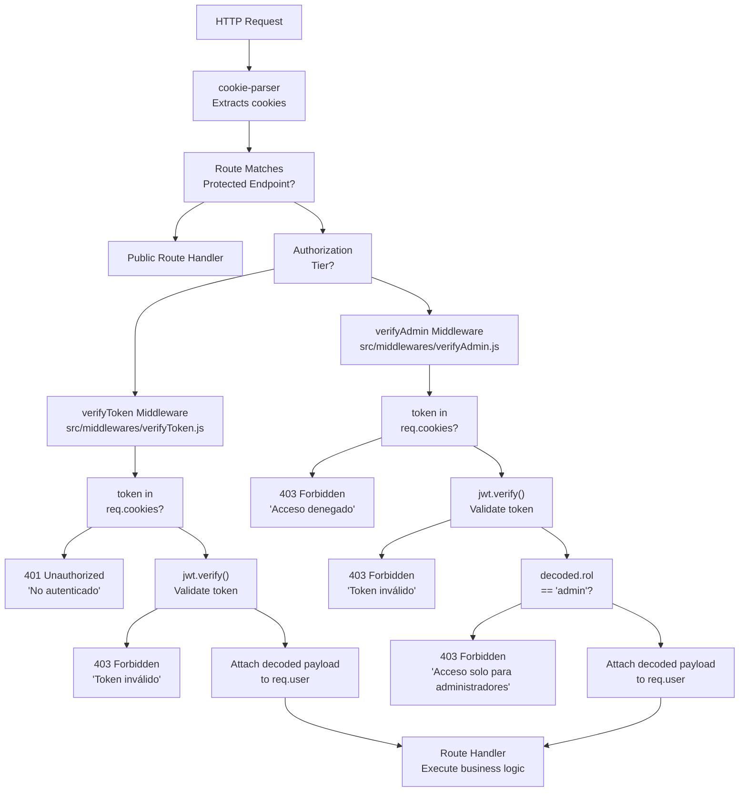
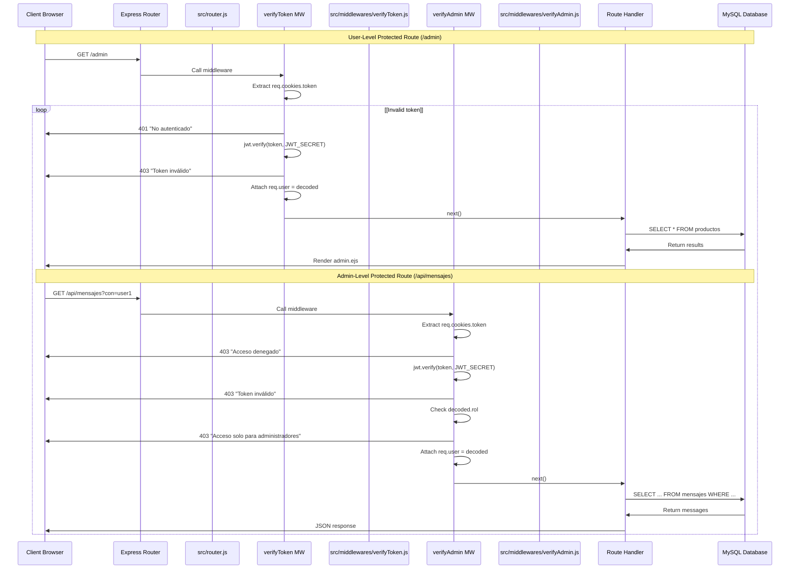

# Protected Routes

> **Relevant source files**
> * [src/middlewares/verifyAdmin.js](https://github.com/moichuelo/registro/blob/544abbcc/src/middlewares/verifyAdmin.js)
> * [src/middlewares/verifyToken.js](https://github.com/moichuelo/registro/blob/544abbcc/src/middlewares/verifyToken.js)
> * [src/router.js](https://github.com/moichuelo/registro/blob/544abbcc/src/router.js)

## Purpose and Scope

This document details all HTTP routes in the application that require authentication or authorization to access. Protected routes implement access control using JWT-based middleware to verify user identity and role permissions before allowing access to sensitive resources.

For information about public routes that do not require authentication, see [Public Routes](/moichuelo/registro/5.1-public-routes). For details on the authentication mechanisms themselves, see [Authentication & Authorization](/moichuelo/registro/6-authentication-and-authorization). For API-specific endpoints, see [API Endpoints](/moichuelo/registro/5.3-api-endpoints).

---

## Overview

Protected routes in this application fall into two authorization tiers:

1. **User-level protection** - Requires valid JWT authentication via `verifyToken` middleware
2. **Admin-level protection** - Requires valid JWT authentication and `rol='admin'` via `verifyAdmin` middleware

All protected routes extract JWT tokens from HTTP-only cookies (cookie name: `token`) and validate them before processing the request. Invalid or missing tokens result in 401 (Unauthorized) or 403 (Forbidden) responses.

**Sources:** [src/router.js L16-L17](https://github.com/moichuelo/registro/blob/544abbcc/src/router.js#L16-L17)

 [src/middlewares/verifyToken.js L1-L18](https://github.com/moichuelo/registro/blob/544abbcc/src/middlewares/verifyToken.js#L1-L18)

 [src/middlewares/verifyAdmin.js L1-L45](https://github.com/moichuelo/registro/blob/544abbcc/src/middlewares/verifyAdmin.js#L1-L45)

---

## Authentication Middleware Chain

The following diagram shows how authentication middleware is applied to protected routes:



**Sources:** [src/middlewares/verifyToken.js L3-L15](https://github.com/moichuelo/registro/blob/544abbcc/src/middlewares/verifyToken.js#L3-L15)

 [src/middlewares/verifyAdmin.js L24-L42](https://github.com/moichuelo/registro/blob/544abbcc/src/middlewares/verifyAdmin.js#L24-L42)

---

## Protected Routes by Authorization Level

### User-Level Protected Routes

These routes require a valid JWT token but do not enforce role restrictions. Any authenticated user (admin or regular user) can access them.

| Route | Method | Handler Location | Purpose | Response Type |
| --- | --- | --- | --- | --- |
| `/admin` | GET | [src/router.js L119-L134](https://github.com/moichuelo/registro/blob/544abbcc/src/router.js#L119-L134) | Product management dashboard | HTML (admin.ejs) |
| `/pdfAdmin` | GET | [src/router.js L136-L151](https://github.com/moichuelo/registro/blob/544abbcc/src/router.js#L136-L151) | PDF preview of products table | HTML (pdfTabla.ejs) |
| `/soporte` | GET | [src/router.js L220-L227](https://github.com/moichuelo/registro/blob/544abbcc/src/router.js#L220-L227) | Support chat interface | HTML (soporte.ejs) |
| `/api/mensajes/mios` | GET | [src/router.js L256-L280](https://github.com/moichuelo/registro/blob/544abbcc/src/router.js#L256-L280) | Retrieve current user's messages | JSON |
| `/pdf/descargar` | GET | [src/router.js L317-L353](https://github.com/moichuelo/registro/blob/544abbcc/src/router.js#L317-L353) | Download products PDF (Puppeteer) | PDF file |
| `/pdfkit/descargar` | GET | [src/router.js L355-L396](https://github.com/moichuelo/registro/blob/544abbcc/src/router.js#L355-L396) | Download products PDF (PDFKit) | PDF file |

**Sources:** [src/router.js L119-L396](https://github.com/moichuelo/registro/blob/544abbcc/src/router.js#L119-L396)

 [src/middlewares/verifyToken.js L3-L15](https://github.com/moichuelo/registro/blob/544abbcc/src/middlewares/verifyToken.js#L3-L15)

---

### Admin-Level Protected Routes

These routes require both a valid JWT token and the `rol='admin'` claim. Regular users receive a 403 Forbidden response.

| Route | Method | Handler Location | Purpose | Response Type |
| --- | --- | --- | --- | --- |
| `/api/mensajes` | GET | [src/router.js L229-L253](https://github.com/moichuelo/registro/blob/544abbcc/src/router.js#L229-L253) | Retrieve messages for specific user (query param: `?con=username`) | JSON |
| `/api/usuarios-conversaciones` | GET | [src/router.js L283-L315](https://github.com/moichuelo/registro/blob/544abbcc/src/router.js#L283-L315) | List all users with admin conversations | JSON array |

**Sources:** [src/router.js L229-L315](https://github.com/moichuelo/registro/blob/544abbcc/src/router.js#L229-L315)

 [src/middlewares/verifyAdmin.js L24-L42](https://github.com/moichuelo/registro/blob/544abbcc/src/middlewares/verifyAdmin.js#L24-L42)

---

## Detailed Route Documentation

### GET /admin

**Middleware:** `verifyToken`

**Purpose:** Renders the product management dashboard for authenticated users.

**Request Flow:**

1. Validates JWT token via `verifyToken`
2. Queries all products from `productos` table
3. Renders `admin.ejs` with products and user information

**Response Data:**

```python
{
  productos: Array,    // All rows from productos table
  user: Object,        // Decoded JWT payload (req.user)
  login: true,
  rol: String          // User's role from JWT
}
```

**Database Query:**

```sql
SELECT * FROM productos
```

**Sources:** [src/router.js L119-L134](https://github.com/moichuelo/registro/blob/544abbcc/src/router.js#L119-L134)

---

### GET /pdfAdmin

**Middleware:** `verifyToken`

**Purpose:** Renders a PDF-optimized HTML view of the products table (used by Puppeteer for PDF generation).

**Request Flow:**

1. Validates JWT token via `verifyToken`
2. Queries all products from `productos` table
3. Renders `pdfTabla.ejs` template

**Response:** HTML document formatted for print media

**Sources:** [src/router.js L136-L151](https://github.com/moichuelo/registro/blob/544abbcc/src/router.js#L136-L151)

---

### GET /soporte

**Middleware:** `verifyToken`

**Purpose:** Renders the support chat interface for both users and administrators.

**Request Flow:**

1. Validates JWT token via `verifyToken`
2. Extracts username and role from `req.user`
3. Renders `soporte.ejs` with user context

**Response Data:**

```yaml
{
  user: {
    username: String,  // From req.user.user
    role: String       // From req.user.rol
  }
}
```

**Note:** The view adapts its UI based on the `role` field. Admins see a multi-conversation interface; regular users see a single chat window.

**Sources:** [src/router.js L220-L227](https://github.com/moichuelo/registro/blob/544abbcc/src/router.js#L220-L227)

---

### GET /api/mensajes

**Middleware:** `verifyAdmin`

**Purpose:** Retrieves all messages involving a specific user (for admin conversation view).

**Query Parameters:**

* `con` (required) - The username to retrieve messages for

**Request Flow:**

1. Validates JWT and admin role via `verifyAdmin`
2. Extracts `con` parameter from query string
3. Returns 400 if `con` is missing
4. Queries messages where user is sender or recipient
5. Returns messages ordered by date ascending

**Database Query:**

```sql
SELECT de_usuario, para_usuario, mensaje, fecha
FROM mensajes
WHERE (de_usuario = ? OR para_usuario = ?)
ORDER BY fecha ASC
```

**Response:** JSON array of message objects

**Error Responses:**

* `400` - Missing `?con=usuario` parameter
* `403` - User is not an admin
* `500` - Database query error

**Sources:** [src/router.js L229-L253](https://github.com/moichuelo/registro/blob/544abbcc/src/router.js#L229-L253)

---

### GET /api/mensajes/mios

**Middleware:** `verifyToken`

**Purpose:** Retrieves all messages for the currently authenticated user.

**Request Flow:**

1. Validates JWT via `verifyToken`
2. Extracts username from `req.user.user`
3. Queries messages where authenticated user is sender or recipient
4. Returns messages ordered by date ascending

**Database Query:**

```sql
SELECT de_usuario, para_usuario, mensaje, fecha
FROM mensajes
WHERE (de_usuario = ? OR para_usuario = ?)
ORDER BY fecha ASC
```

**Response:** JSON array of message objects

**Error Responses:**

* `401` - No valid token
* `403` - Token invalid
* `500` - Database query error

**Sources:** [src/router.js L256-L280](https://github.com/moichuelo/registro/blob/544abbcc/src/router.js#L256-L280)

---

### GET /api/usuarios-conversaciones

**Middleware:** `verifyAdmin`

**Purpose:** Returns a list of all non-admin users who have conversations with administrators.

**Request Flow:**

1. Validates JWT and admin role via `verifyAdmin`
2. Executes complex query to find users in admin conversations
3. Returns array of usernames

**Database Query:**

```sql
SELECT DISTINCT usuario
FROM (
  SELECT de_usuario AS usuario FROM mensajes
  WHERE para_usuario IN (SELECT usuario FROM usuarios WHERE rol = 'admin')
  
  UNION
  
  SELECT para_usuario AS usuario FROM mensajes
  WHERE de_usuario IN (SELECT usuario FROM usuarios WHERE rol = 'admin')
) AS conversaciones
WHERE usuario NOT IN (SELECT usuario FROM usuarios WHERE rol = 'admin')
```

**Response:** JSON array of usernames (strings)

**Query Logic:**

1. Finds messages sent TO admins (extracts sender)
2. Finds messages sent FROM admins (extracts recipient)
3. Combines with UNION to eliminate duplicates
4. Filters out admin usernames from results

**Error Responses:**

* `403` - User is not an admin
* `500` - Database query error

**Sources:** [src/router.js L283-L315](https://github.com/moichuelo/registro/blob/544abbcc/src/router.js#L283-L315)

---

## PDF Generation Routes

### GET /pdf/descargar

**Middleware:** `verifyToken`

**Purpose:** Generates and downloads a PDF of the products table using Puppeteer (headless Chrome).

**Request Flow:**

1. Validates JWT via `verifyToken`
2. Queries all products from database
3. Renders `pdfTabla.ejs` template to HTML string
4. Launches headless Chrome browser
5. Loads HTML content into browser page
6. Generates PDF from rendered page
7. Closes browser
8. Sends PDF as downloadable file

**PDF Generation Configuration:**

```css
{
  format: "A4",
  printBackground: true,
  margin: { top: "20px", bottom: "20px" }
}
```

**Response Headers:**

```
Content-Type: application/pdf
Content-Disposition: attachment; filename="productos.pdf"
```

**Note:** Uses Puppeteer for high-fidelity HTML-to-PDF conversion with full CSS support.

**Sources:** [src/router.js L317-L353](https://github.com/moichuelo/registro/blob/544abbcc/src/router.js#L317-L353)

---

### GET /pdfkit/descargar

**Middleware:** `verifyToken`

**Purpose:** Generates and downloads a PDF of the products table using PDFKit (programmatic generation).

**Request Flow:**

1. Validates JWT via `verifyToken`
2. Queries all products from database
3. Creates PDFDocument instance
4. Writes title and table headers
5. Iterates through products, writing each row
6. Streams PDF directly to response

**PDF Layout:**

* Document size: A4
* Margin: 40 points
* Title: 18pt font, centered
* Table headers: Helvetica-Bold, 12pt
* Table data: Helvetica, 11pt
* Column positions: Ref (50), Nombre (150), Precio (300), Stock (380)
* Row spacing: 20 points

**Response Headers:**

```
Content-Type: application/pdf
Content-Disposition: attachment; filename="productos_desde_cero.pdf"
```

**Note:** Uses PDFKit for direct PDF generation without HTML rendering. More performant but less flexible than Puppeteer approach.

**Sources:** [src/router.js L355-L396](https://github.com/moichuelo/registro/blob/544abbcc/src/router.js#L355-L396)

---

## Authorization Flow Diagram



**Sources:** [src/router.js L119-L396](https://github.com/moichuelo/registro/blob/544abbcc/src/router.js#L119-L396)

 [src/middlewares/verifyToken.js L3-L15](https://github.com/moichuelo/registro/blob/544abbcc/src/middlewares/verifyToken.js#L3-L15)

 [src/middlewares/verifyAdmin.js L24-L42](https://github.com/moichuelo/registro/blob/544abbcc/src/middlewares/verifyAdmin.js#L24-L42)

---

## JWT Payload Structure

When authentication succeeds, the decoded JWT payload is attached to `req.user` and contains:

| Field | Type | Description | Source |
| --- | --- | --- | --- |
| `user` | String | Username (primary key) | `usuarios.usuario` |
| `name` | String | Display name | `usuarios.nombre` |
| `rol` | String | User role ('admin' or 'user') | `usuarios.rol` |
| `imagen` | String | Profile image filename | `usuarios.imagen` |

This payload is available to all route handlers after successful authentication.

**Sources:** [src/router.js L559-L564](https://github.com/moichuelo/registro/blob/544abbcc/src/router.js#L559-L564)

---

## Error Response Summary

| Status Code | Middleware | Error Message | Condition |
| --- | --- | --- | --- |
| 401 | verifyToken | "No autenticado" | Token missing from cookies |
| 403 | verifyToken | "Token inválido" | JWT verification failed |
| 403 | verifyAdmin | "Acceso denegado" | Token missing from cookies |
| 403 | verifyAdmin | "Token inválido" | JWT verification failed |
| 403 | verifyAdmin | "Acceso solo para administradores" | Valid token but `rol !== 'admin'` |

**Sources:** [src/middlewares/verifyToken.js L6-L14](https://github.com/moichuelo/registro/blob/544abbcc/src/middlewares/verifyToken.js#L6-L14)

 [src/middlewares/verifyAdmin.js L28-L40](https://github.com/moichuelo/registro/blob/544abbcc/src/middlewares/verifyAdmin.js#L28-L40)

---

## Security Considerations

1. **HTTP-only Cookies:** JWT tokens are stored in HTTP-only cookies, preventing JavaScript access and XSS attacks
2. **Token Expiration:** Tokens expire after 1 hour (configured in authentication flow)
3. **Secret Key:** Token verification uses `process.env.JWT_SECRET` environment variable
4. **Role-based Access:** Admin routes enforce role checking after token validation
5. **No Token in Response:** Tokens are never included in JSON responses, only in Set-Cookie headers

**Sources:** [src/middlewares/verifyToken.js L1-L18](https://github.com/moichuelo/registro/blob/544abbcc/src/middlewares/verifyToken.js#L1-L18)

 [src/middlewares/verifyAdmin.js L1-L45](https://github.com/moichuelo/registro/blob/544abbcc/src/middlewares/verifyAdmin.js#L1-L45)