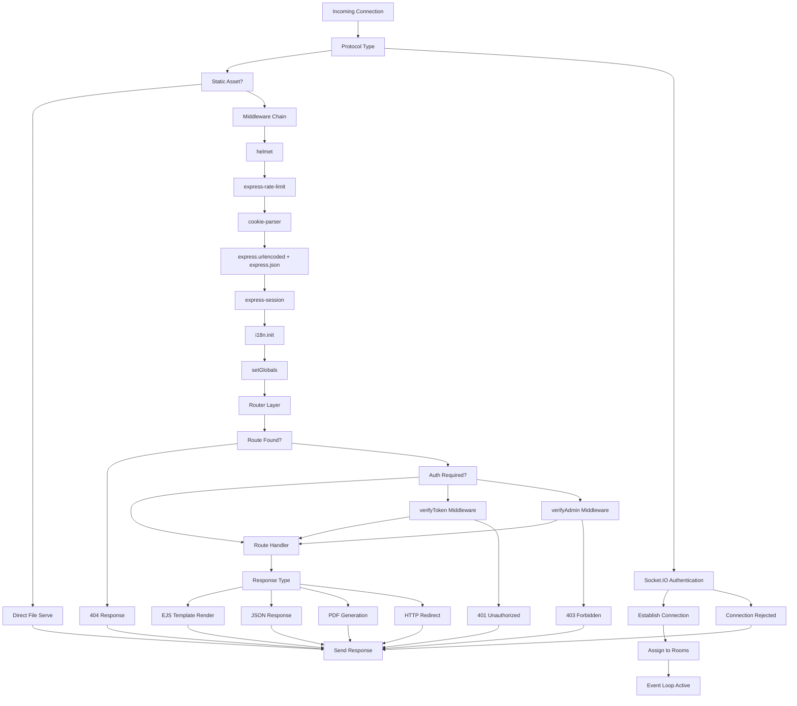
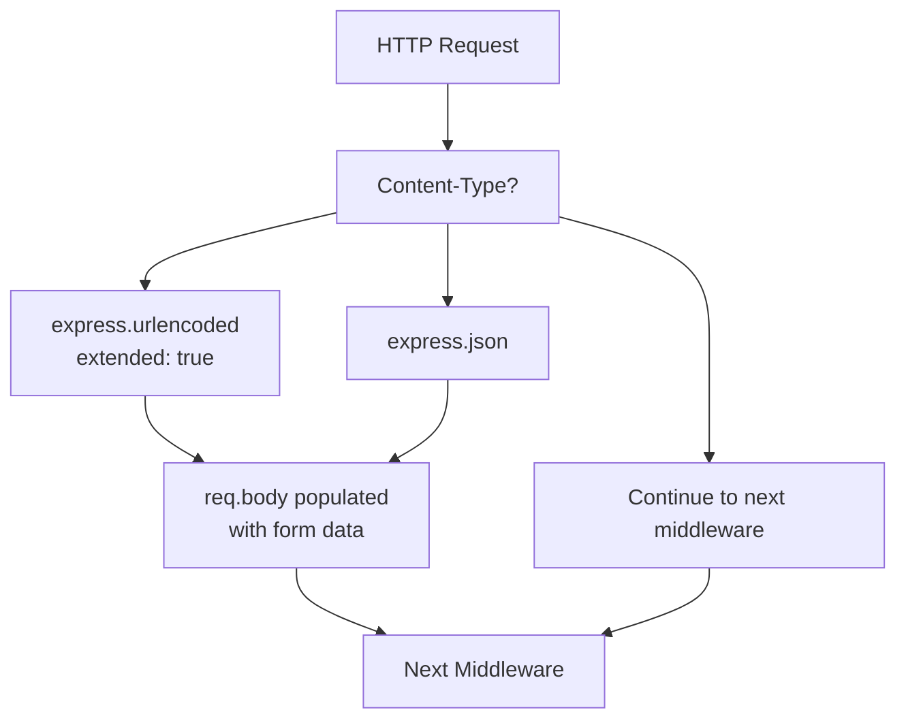
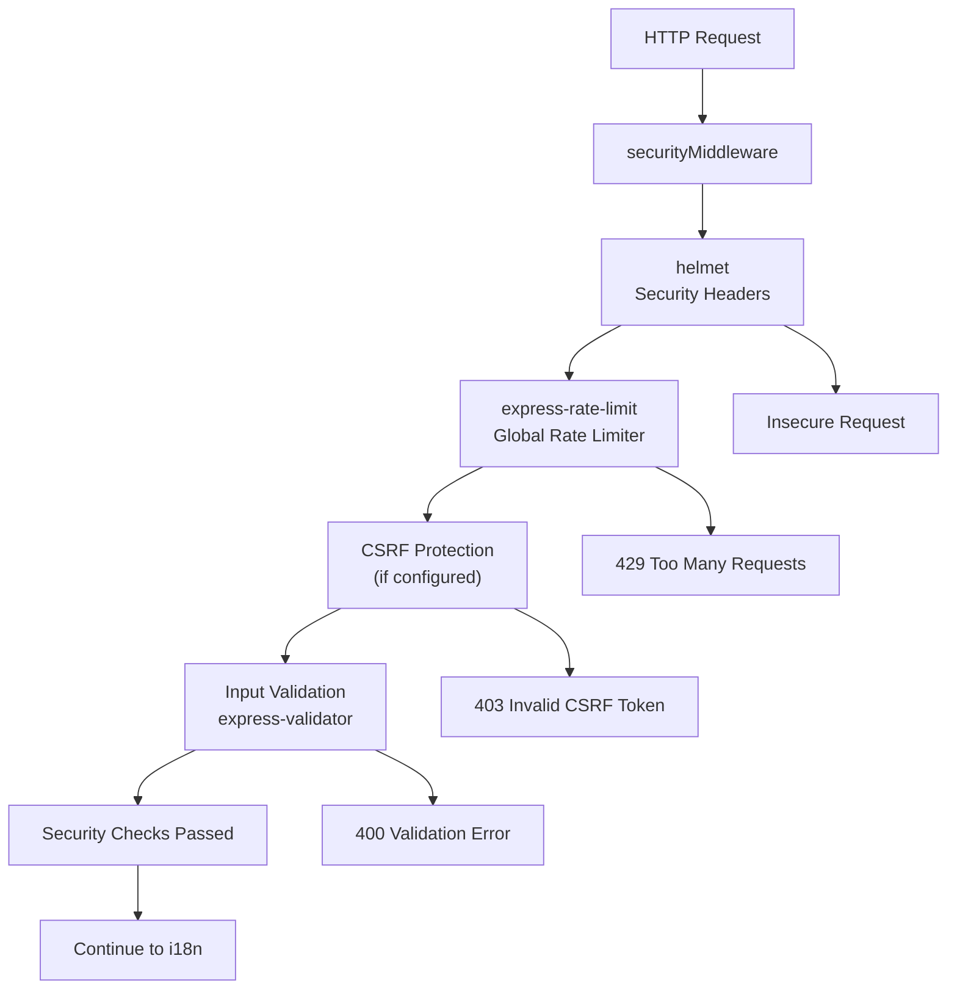
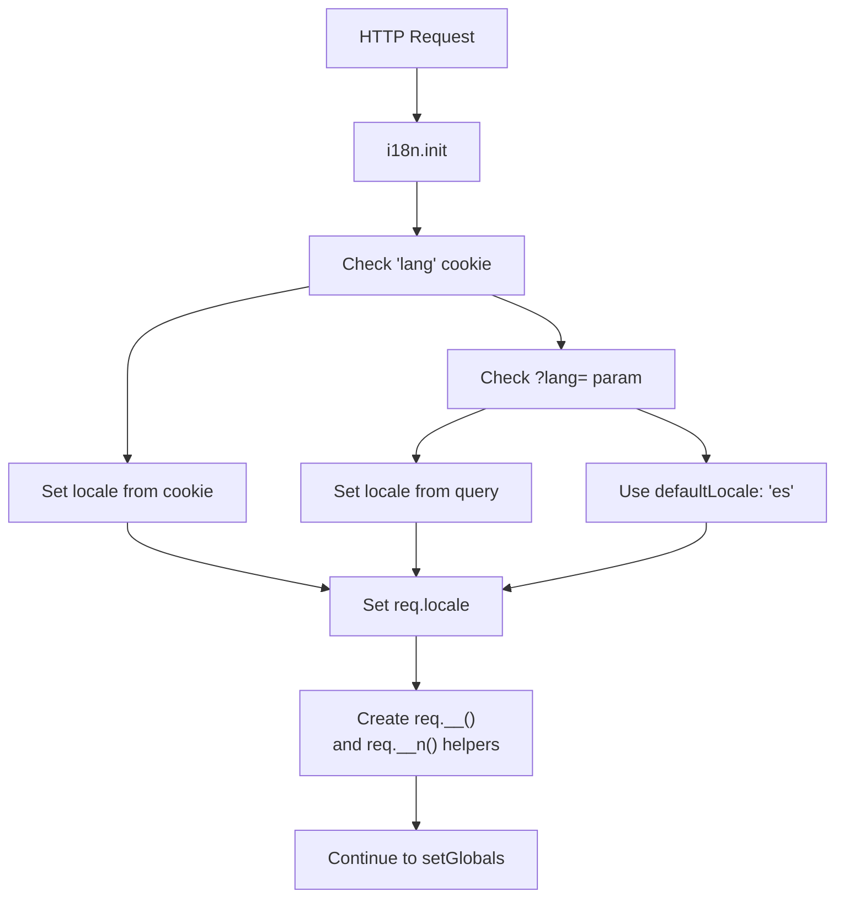
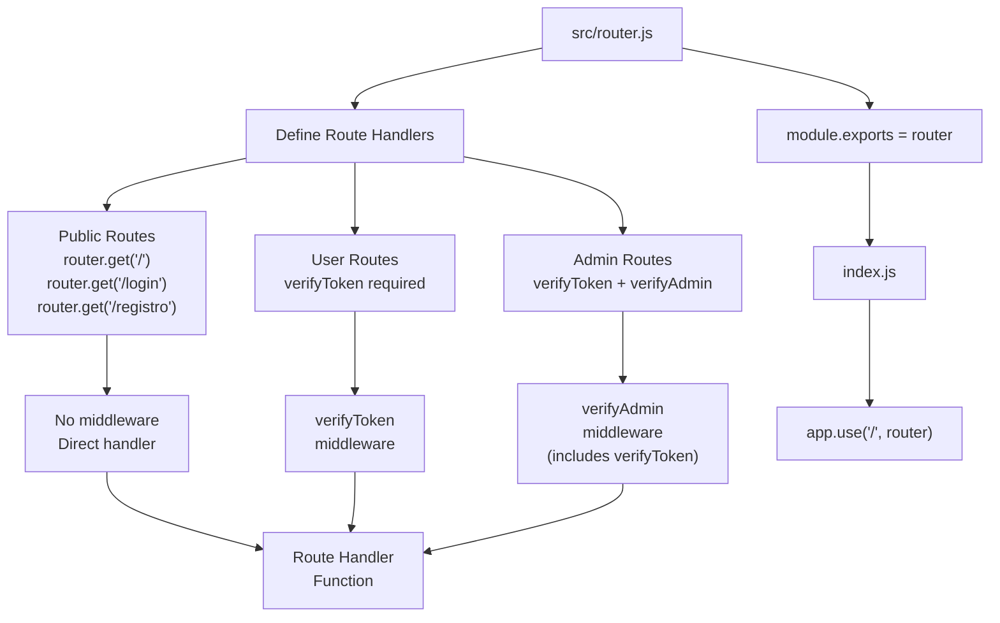
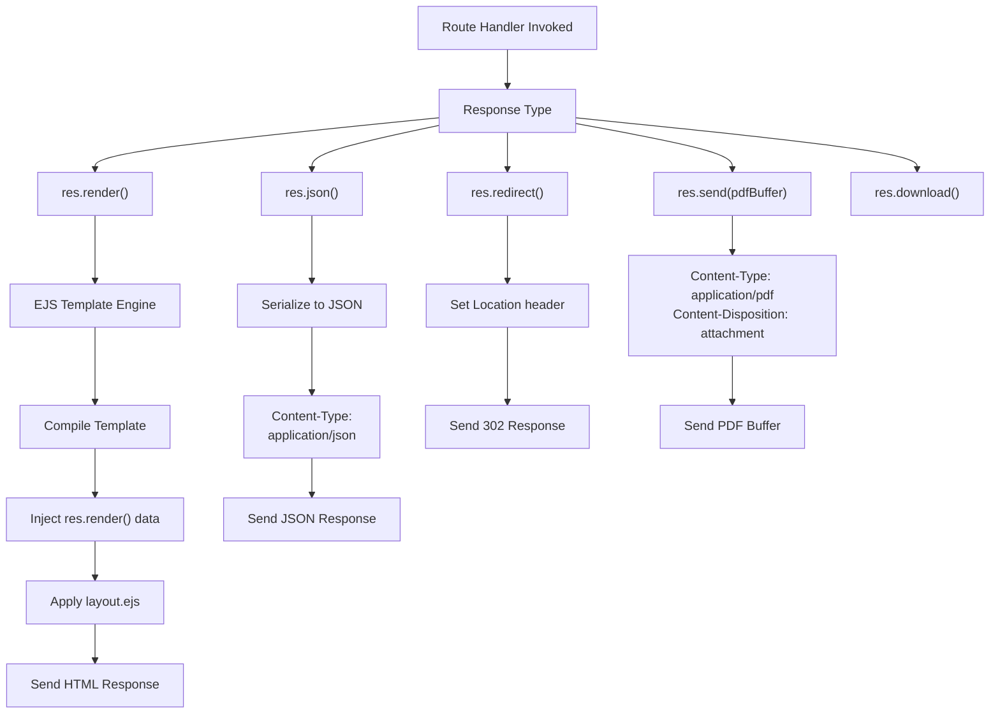
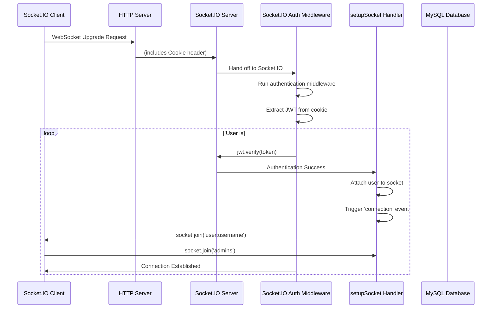
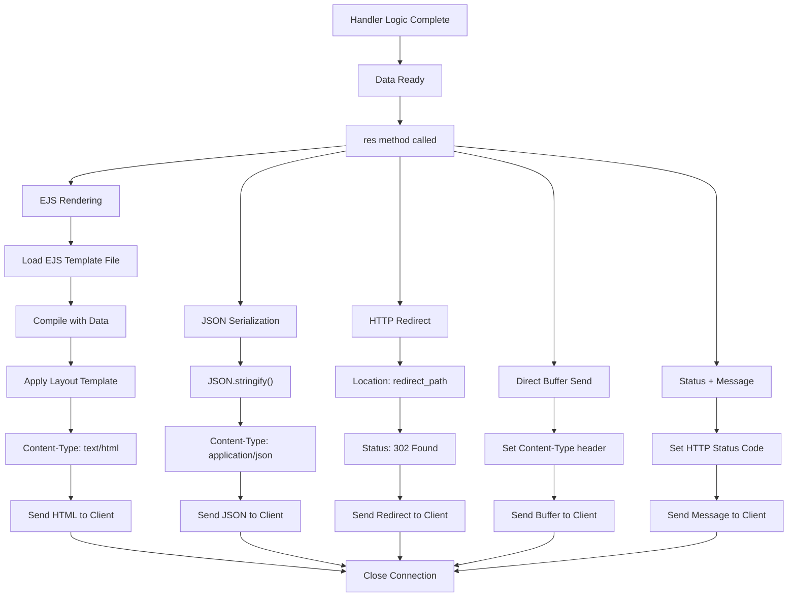

# Request Processing Pipeline

> **Relevant source files**
> * [index.js](https://github.com/moichuelo/registro/blob/544abbcc/index.js)
> * [src/middlewares/verifyToken.js](https://github.com/moichuelo/registro/blob/544abbcc/src/middlewares/verifyToken.js)
> * [src/router.js](https://github.com/moichuelo/registro/blob/544abbcc/src/router.js)

## Purpose and Scope

This document describes how incoming requests flow through the application's processing pipeline, from initial receipt to final response. It covers the complete middleware stack for HTTP requests, WebSocket connection establishment, authentication/authorization layers, and response generation mechanisms.

For information about specific route definitions and handlers, see [Routing System](/moichuelo/registro/5-routing-system). For authentication implementation details, see [Authentication & Authorization](/moichuelo/registro/6-authentication-and-authorization). For WebSocket event handling after connection is established, see [Real-time Communication System](/moichuelo/registro/7-real-time-communication-system).

---

## Overview of Request Flow

The application handles two distinct types of incoming connections: HTTP/HTTPS requests and WebSocket connections. Both share some common processing steps but diverge in their pipeline structure.



**Sources:** [index.js L1-L86](https://github.com/moichuelo/registro/blob/544abbcc/index.js#L1-L86)

 [src/router.js L1-L608](https://github.com/moichuelo/registro/blob/544abbcc/src/router.js#L1-L608)

---

## HTTP Middleware Stack

The HTTP request pipeline processes requests through a series of middleware functions before reaching route handlers. Each middleware layer is registered in the application bootstrap file and executes in a specific order.

### Middleware Execution Order

| Order | Middleware | Purpose | Configuration Location |
| --- | --- | --- | --- |
| 1 | `express.urlencoded` | Parse URL-encoded request bodies | [index.js L41](https://github.com/moichuelo/registro/blob/544abbcc/index.js#L41-L41) |
| 2 | `express.json` | Parse JSON request bodies | [index.js L42](https://github.com/moichuelo/registro/blob/544abbcc/index.js#L42-L42) |
| 3 | Static file server | Serve files from `/public` directory | [index.js L43](https://github.com/moichuelo/registro/blob/544abbcc/index.js#L43-L43) |
| 4 | `swaggerUi.serve` | Serve Swagger documentation UI | [index.js L44](https://github.com/moichuelo/registro/blob/544abbcc/index.js#L44-L44) |
| 5 | `securityMiddleware` | Helmet + rate limiting + security headers | [index.js L45](https://github.com/moichuelo/registro/blob/544abbcc/index.js#L45-L45) |
| 6 | `i18n.init` | Initialize internationalization | [index.js L46](https://github.com/moichuelo/registro/blob/544abbcc/index.js#L46-L46) |
| 7 | `setGlobals` | Set global template variables | [index.js L47](https://github.com/moichuelo/registro/blob/544abbcc/index.js#L47-L47) |
| 8 | Router | Match routes and dispatch to handlers | [index.js L48](https://github.com/moichuelo/registro/blob/544abbcc/index.js#L48-L48) |

**Sources:** [index.js L36-L48](https://github.com/moichuelo/registro/blob/544abbcc/index.js#L36-L48)

### Body Parsing Layer

The first processing stage handles request body parsing. Two parsers are configured:



The `extended: true` option in `express.urlencoded` allows parsing of rich objects and arrays encoded in URL format. This is used by form submissions throughout the application, including the login form at [src/router.js L532-L601](https://github.com/moichuelo/registro/blob/544abbcc/src/router.js#L532-L601)

 and registration form at [src/router.js L414-L484](https://github.com/moichuelo/registro/blob/544abbcc/src/router.js#L414-L484)

**Sources:** [index.js L41-L42](https://github.com/moichuelo/registro/blob/544abbcc/index.js#L41-L42)

### Cookie Parsing Layer

Cookie parsing is initialized before the middleware chain to make cookies available to all subsequent middleware:

* **Middleware:** `cookie-parser` registered at [index.js L37](https://github.com/moichuelo/registro/blob/544abbcc/index.js#L37-L37)
* **Purpose:** Parses the `Cookie` header and populates `req.cookies` object
* **Critical for:** JWT token retrieval (`req.cookies.token`), language preference (`req.cookies.lang`)
* **Used by:** `verifyToken` middleware at [src/middlewares/verifyToken.js L4](https://github.com/moichuelo/registro/blob/544abbcc/src/middlewares/verifyToken.js#L4-L4)  homepage route at [src/router.js L61](https://github.com/moichuelo/registro/blob/544abbcc/src/router.js#L61-L61)  language system

**Sources:** [index.js L37](https://github.com/moichuelo/registro/blob/544abbcc/index.js#L37-L37)

 [src/middlewares/verifyToken.js L1-L18](https://github.com/moichuelo/registro/blob/544abbcc/src/middlewares/verifyToken.js#L1-L18)

### Security Middleware Layer

The security middleware is implemented in a separate module and includes multiple protection mechanisms:



The module is loaded at [index.js L15](https://github.com/moichuelo/registro/blob/544abbcc/index.js#L15-L15)

 and registered at [index.js L45](https://github.com/moichuelo/registro/blob/544abbcc/index.js#L45-L45)

 Additional route-specific rate limiting is applied to the authentication endpoint using the `limiter` middleware at [src/router.js L21](https://github.com/moichuelo/registro/blob/544abbcc/src/router.js#L21-L21)

 and applied at [src/router.js L532](https://github.com/moichuelo/registro/blob/544abbcc/src/router.js#L532-L532)

**Sources:** [index.js L15](https://github.com/moichuelo/registro/blob/544abbcc/index.js#L15-L15)

 [index.js L45](https://github.com/moichuelo/registro/blob/544abbcc/index.js#L45-L45)

 [src/router.js L21](https://github.com/moichuelo/registro/blob/544abbcc/src/router.js#L21-L21)

 [src/router.js L532](https://github.com/moichuelo/registro/blob/544abbcc/src/router.js#L532-L532)

### Internationalization Layer

The i18n middleware handles language detection and translation:



Configuration is at [index.js L23-L31](https://github.com/moichuelo/registro/blob/544abbcc/index.js#L23-L31)

 with these settings:

* **Locales:** `en`, `es`
* **Directory:** `locales/` (JSON files)
* **Default:** Spanish (`es`)
* **Cookie name:** `lang`
* **Query parameter:** `lang`

Language switching is handled by the `/set-lang/:lang` route at [src/router.js L398-L407](https://github.com/moichuelo/registro/blob/544abbcc/src/router.js#L398-L407)

 which sets the language cookie and redirects back.

**Sources:** [index.js L23-L31](https://github.com/moichuelo/registro/blob/544abbcc/index.js#L23-L31)

 [index.js L46](https://github.com/moichuelo/registro/blob/544abbcc/index.js#L46-L46)

 [src/router.js L398-L407](https://github.com/moichuelo/registro/blob/544abbcc/src/router.js#L398-L407)

### Global Variables Middleware

The `setGlobals` middleware injects global variables into all view templates:

* **Location:** [index.js L18](https://github.com/moichuelo/registro/blob/544abbcc/index.js#L18-L18)  (import), [index.js L47](https://github.com/moichuelo/registro/blob/544abbcc/index.js#L47-L47)  (registration)
* **Purpose:** Make common data available to all EJS templates without passing explicitly
* **Typical variables:** Current user, application settings, i18n helpers, environment flags

**Sources:** [index.js L18](https://github.com/moichuelo/registro/blob/544abbcc/index.js#L18-L18)

 [index.js L47](https://github.com/moichuelo/registro/blob/544abbcc/index.js#L47-L47)

---

## Route Matching and Authentication

After passing through the middleware chain, requests reach the router layer where routes are matched and authentication is enforced.

### Route Registration Pattern

Routes are defined in the router module and exported for use by the application:



**Sources:** [src/router.js L1-L608](https://github.com/moichuelo/registro/blob/544abbcc/src/router.js#L1-L608)

 [index.js L48](https://github.com/moichuelo/registro/blob/544abbcc/index.js#L48-L48)

### Authentication Middleware Hierarchy

The application implements a two-tier authentication system:

#### Tier 1: verifyToken

Located at [src/middlewares/verifyToken.js L1-L18](https://github.com/moichuelo/registro/blob/544abbcc/src/middlewares/verifyToken.js#L1-L18)

 this middleware:

1. Extracts JWT from `req.cookies.token` at [src/middlewares/verifyToken.js L4](https://github.com/moichuelo/registro/blob/544abbcc/src/middlewares/verifyToken.js#L4-L4)
2. Returns `401 No autenticado` if token is missing at [src/middlewares/verifyToken.js L6](https://github.com/moichuelo/registro/blob/544abbcc/src/middlewares/verifyToken.js#L6-L6)
3. Verifies token signature using `jwt.verify()` at [src/middlewares/verifyToken.js L9](https://github.com/moichuelo/registro/blob/544abbcc/src/middlewares/verifyToken.js#L9-L9)
4. Decodes payload and attaches to `req.user` at [src/middlewares/verifyToken.js L10](https://github.com/moichuelo/registro/blob/544abbcc/src/middlewares/verifyToken.js#L10-L10)
5. Returns `403 Token inválido` if verification fails at [src/middlewares/verifyToken.js L13](https://github.com/moichuelo/registro/blob/544abbcc/src/middlewares/verifyToken.js#L13-L13)
6. Calls `next()` to continue to route handler at [src/middlewares/verifyToken.js L11](https://github.com/moichuelo/registro/blob/544abbcc/src/middlewares/verifyToken.js#L11-L11)

**Payload structure in req.user:**

```python
{
  user: string,    // Username (from usuarios.usuario)
  name: string,    // Display name (from usuarios.nombre)
  rol: string,     // Role: 'admin' or 'user'
  imagen: string   // Profile image filename
}
```

#### Tier 2: verifyAdmin

Located at [src/middlewares/verifyAdmin.js](https://github.com/moichuelo/registro/blob/544abbcc/src/middlewares/verifyAdmin.js)

 this middleware:

1. Assumes `verifyToken` has already run and populated `req.user`
2. Checks if `req.user.rol === 'admin'`
3. Returns `403 Acceso denegado` if user is not an admin
4. Calls `next()` if user is admin

**Sources:** [src/middlewares/verifyToken.js L1-L18](https://github.com/moichuelo/registro/blob/544abbcc/src/middlewares/verifyToken.js#L1-L18)

 [src/router.js L16-L17](https://github.com/moichuelo/registro/blob/544abbcc/src/router.js#L16-L17)

### Route Authentication Examples

| Route | Path | Middleware | File Location |
| --- | --- | --- | --- |
| Homepage | `GET /` | None | [src/router.js L59-L74](https://github.com/moichuelo/registro/blob/544abbcc/src/router.js#L59-L74) |
| Login page | `GET /login` | None | [src/router.js L75-L77](https://github.com/moichuelo/registro/blob/544abbcc/src/router.js#L75-L77) |
| Admin panel | `GET /admin` | `verifyToken` | [src/router.js L119-L134](https://github.com/moichuelo/registro/blob/544abbcc/src/router.js#L119-L134) |
| Support chat | `GET /soporte` | `verifyToken` | [src/router.js L220-L227](https://github.com/moichuelo/registro/blob/544abbcc/src/router.js#L220-L227) |
| Get messages (admin) | `GET /api/mensajes` | `verifyAdmin` | [src/router.js L229-L253](https://github.com/moichuelo/registro/blob/544abbcc/src/router.js#L229-L253) |
| Get user list | `GET /api/usuarios-conversaciones` | `verifyAdmin` | [src/router.js L283-L315](https://github.com/moichuelo/registro/blob/544abbcc/src/router.js#L283-L315) |
| PDF download | `GET /pdf/descargar` | `verifyToken` | [src/router.js L317-L353](https://github.com/moichuelo/registro/blob/544abbcc/src/router.js#L317-L353) |
| Login POST | `POST /auth` | `limiter` (rate limit) | [src/router.js L532-L601](https://github.com/moichuelo/registro/blob/544abbcc/src/router.js#L532-L601) |

**Sources:** [src/router.js L59-L601](https://github.com/moichuelo/registro/blob/544abbcc/src/router.js#L59-L601)

---

## Request Handler Dispatch

Once a route is matched and authentication passes, the request is dispatched to the appropriate handler. Handlers can be inline functions or imported controllers.

### Handler Types by Response Format



#### View Rendering Handlers

Example at [src/router.js L119-L134](https://github.com/moichuelo/registro/blob/544abbcc/src/router.js#L119-L134)

 for the `/admin` route:

```javascript
router.get("/admin", verifyToken, (req, res) => {
    db.query("SELECT * FROM productos", (error, results) => {
        if (error) {
            throw error;
        } else {
            res.render("admin", {
                productos: results,
                user: req.user,
                login: true,
                rol: req.user.rol,
            });
        }
    });
});
```

The `res.render()` call:

1. Loads the `views/admin.ejs` template
2. Passes data object as template variables
3. Compiles EJS with data
4. Sends HTML response

#### JSON API Handlers

Example at [src/router.js L256-L280](https://github.com/moichuelo/registro/blob/544abbcc/src/router.js#L256-L280)

 for `/api/mensajes/mios`:

```javascript
router.get("/api/mensajes/mios", verifyToken, (req, res) => {
    const usuario = req.user.user;
    // ... SQL query ...
    db.query(sql, [usuario, usuario], (err, results) => {
        if (err) {
            return res.status(500).json({ error: "Error interno" });
        }
        res.json(results);
    });
});
```

The `res.json()` method automatically:

1. Serializes JavaScript object/array to JSON string
2. Sets `Content-Type: application/json` header
3. Sends response

#### Redirect Handlers

Example at [src/router.js L215-L218](https://github.com/moichuelo/registro/blob/544abbcc/src/router.js#L215-L218)

 for `/logout`:

```javascript
router.get("/logout", (req, res) => {
    res.clearCookie("token");
    res.redirect('/');
});
```

#### PDF Generation Handlers

Two approaches are used:

1. **Puppeteer (HTML-to-PDF)** at [src/router.js L317-L353](https://github.com/moichuelo/registro/blob/544abbcc/src/router.js#L317-L353) : * Renders EJS template to HTML string * Launches headless Chrome browser * Converts HTML to PDF buffer * Sends buffer with appropriate headers
2. **PDFKit (Programmatic)** at [src/router.js L355-L396](https://github.com/moichuelo/registro/blob/544abbcc/src/router.js#L355-L396) : * Creates `PDFDocument` instance * Programmatically writes text and graphics * Pipes directly to response stream * More control, less convenient

**Sources:** [src/router.js L119-L396](https://github.com/moichuelo/registro/blob/544abbcc/src/router.js#L119-L396)

### Controller Module Integration

Some routes delegate to controller functions imported from `./controllers`:

```javascript
const crud = require("./controllers");
// ...
router.post("/save", crud.save);
router.post("/update", crud.update);
```

This pattern separates route definition from business logic. Located at [src/router.js L13](https://github.com/moichuelo/registro/blob/544abbcc/src/router.js#L13-L13)

 (import) and [src/router.js L603-L604](https://github.com/moichuelo/registro/blob/544abbcc/src/router.js#L603-L604)

 (usage).

**Sources:** [src/router.js L13](https://github.com/moichuelo/registro/blob/544abbcc/src/router.js#L13-L13)

 [src/router.js L603-L604](https://github.com/moichuelo/registro/blob/544abbcc/src/router.js#L603-L604)

---

## WebSocket Connection Pipeline

WebSocket connections follow a different pipeline than HTTP requests, but share the authentication mechanism.

### Connection Establishment Flow



### Socket.IO Server Initialization

The Socket.IO server is created and attached to the HTTP server in [index.js L8-L12](https://github.com/moichuelo/registro/blob/544abbcc/index.js#L8-L12)

:

```javascript
const http = require("http");
const socketIO = require("socket.io");
const server = http.createServer(app);
const io = socketIO(server);
```

The socket handler is configured at [index.js L14](https://github.com/moichuelo/registro/blob/544abbcc/index.js#L14-L14)

 (import) and [index.js L57](https://github.com/moichuelo/registro/blob/544abbcc/index.js#L57-L57)

 (setup):

```javascript
const setupSocket = require("./src/sockets/socketHandler");
// ...
setupSocket(io);
```

**Sources:** [index.js L8-L14](https://github.com/moichuelo/registro/blob/544abbcc/index.js#L8-L14)

 [index.js L57](https://github.com/moichuelo/registro/blob/544abbcc/index.js#L57-L57)

### WebSocket Authentication Middleware

The WebSocket authentication middleware is part of the `setupSocket` function in `src/sockets/socketHandler.js`. It:

1. Runs before the `connection` event fires
2. Extracts JWT from the socket handshake cookies
3. Verifies the token using the same `JWT_SECRET`
4. Attaches user information to `socket.user`
5. Rejects connection if token is invalid

This ensures that only authenticated users can establish WebSocket connections and that `socket.user` is available in all event handlers.

**Sources:** [index.js L14](https://github.com/moichuelo/registro/blob/544abbcc/index.js#L14-L14)

 [index.js L57](https://github.com/moichuelo/registro/blob/544abbcc/index.js#L57-L57)

---

## Response Generation Pipeline

The final stage of request processing is generating and sending the response.

### Response Type Decision Tree



### EJS Template Rendering Pipeline

The EJS view engine is configured at [index.js L52](https://github.com/moichuelo/registro/blob/544abbcc/index.js#L52-L52)

:

```
app.set("view engine", "ejs");
```

When a handler calls `res.render("admin", { data })`:

1. Express resolves `"admin"` to `views/admin.ejs`
2. EJS compiles the template with the provided data object
3. Template can access data as local variables
4. Template typically extends `layout.ejs` for consistent structure
5. Partials are included using `<%- include('partials/header') %>`
6. Final HTML is sent with `Content-Type: text/html; charset=utf-8`

Example usage at [src/router.js L126-L131](https://github.com/moichuelo/registro/blob/544abbcc/src/router.js#L126-L131)

:

```yaml
res.render("admin", {
    productos: results,
    user: req.user,
    login: true,
    rol: req.user.rol,
});
```

**Sources:** [index.js L52](https://github.com/moichuelo/registro/blob/544abbcc/index.js#L52-L52)

 [src/router.js L126-L131](https://github.com/moichuelo/registro/blob/544abbcc/src/router.js#L126-L131)

### Error Response Handling

Error responses are handled at various levels:

| Error Type | HTTP Status | Response Method | Example Location |
| --- | --- | --- | --- |
| Not authenticated | 401 | `res.status(401).send()` | [src/middlewares/verifyToken.js L6](https://github.com/moichuelo/registro/blob/544abbcc/src/middlewares/verifyToken.js#L6-L6) |
| Invalid token | 403 | `res.status(403).send()` | [src/middlewares/verifyToken.js L13](https://github.com/moichuelo/registro/blob/544abbcc/src/middlewares/verifyToken.js#L13-L13) |
| Access denied (not admin) | 403 | `res.status(403).json()` | Admin middleware |
| Missing parameters | 400 | `res.status(400).json()` | [src/router.js L233](https://github.com/moichuelo/registro/blob/544abbcc/src/router.js#L233-L233) |
| Database error | 500 | `res.status(500).json()` | [src/router.js L247](https://github.com/moichuelo/registro/blob/544abbcc/src/router.js#L247-L247) |
| Route not found | 404 | Express default handler | Built-in |

**Sources:** [src/middlewares/verifyToken.js L6-L13](https://github.com/moichuelo/registro/blob/544abbcc/src/middlewares/verifyToken.js#L6-L13)

 [src/router.js L233-L247](https://github.com/moichuelo/registro/blob/544abbcc/src/router.js#L233-L247)

---

## Special Case: Rate-Limited Authentication

The authentication POST route includes an additional rate limiter middleware specific to login attempts:

```javascript
const limiter = require("./middlewares/authLimiter");
// ...
router.post("/auth", limiter, async (req, res) => {
    // ... authentication logic ...
});
```

Located at [src/router.js L21](https://github.com/moichuelo/registro/blob/544abbcc/src/router.js#L21-L21)

 (import) and [src/router.js L532](https://github.com/moichuelo/registro/blob/544abbcc/src/router.js#L532-L532)

 (application).

This provides brute-force protection by limiting the number of authentication attempts from a single IP address. The limiter runs before the authentication logic, so invalid attempts consume the rate limit budget.

**Sources:** [src/router.js L21](https://github.com/moichuelo/registro/blob/544abbcc/src/router.js#L21-L21)

 [src/router.js L532](https://github.com/moichuelo/registro/blob/544abbcc/src/router.js#L532-L532)

---

## Request Pipeline Summary

### Complete HTTP Request Lifecycle

1. **Connection received** by Node.js HTTP server
2. **Static asset check** - served directly if matched
3. **Body parsing** - URL-encoded and JSON parsers
4. **Cookie parsing** - extract cookies into `req.cookies`
5. **Security layer** - helmet, rate limiting, CSRF protection
6. **Internationalization** - detect and set language
7. **Global variables** - inject common template data
8. **Route matching** - find handler for request path
9. **Authentication** (if required) - verify JWT token
10. **Authorization** (if required) - check user role
11. **Handler execution** - business logic runs
12. **Response generation** - render view, serialize JSON, or generate PDF
13. **Send response** - transmit to client and close connection

### Complete WebSocket Connection Lifecycle

1. **Upgrade request** received with cookies
2. **Socket.IO handshake** - negotiate connection parameters
3. **Authentication middleware** - verify JWT from cookie
4. **Connection established** - `connection` event fires
5. **Room assignment** - join personal room and admin room (if applicable)
6. **Event loop active** - listen for `mensaje_privado` and other events
7. **Disconnect handling** - cleanup on connection close

**Sources:** [index.js L1-L86](https://github.com/moichuelo/registro/blob/544abbcc/index.js#L1-L86)

 [src/router.js L1-L608](https://github.com/moichuelo/registro/blob/544abbcc/src/router.js#L1-L608)

 [src/middlewares/verifyToken.js L1-L18](https://github.com/moichuelo/registro/blob/544abbcc/src/middlewares/verifyToken.js#L1-L18)