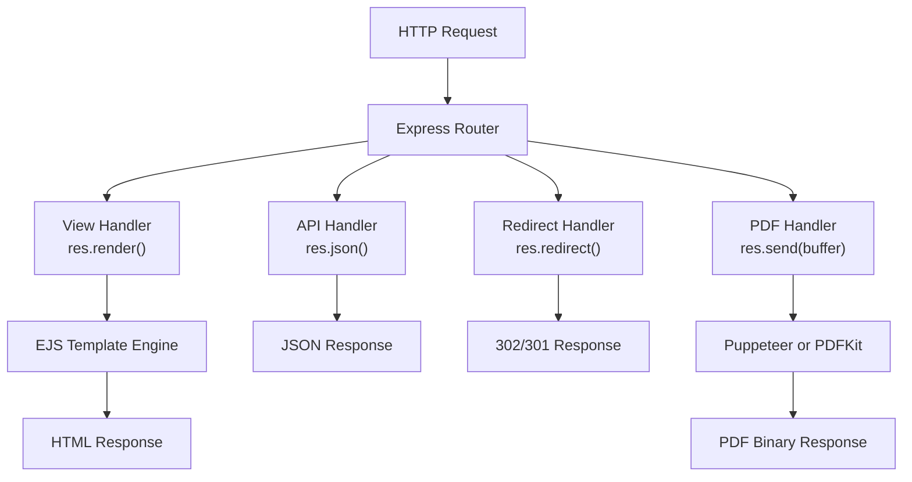
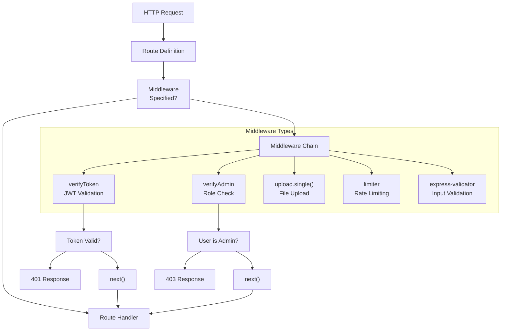
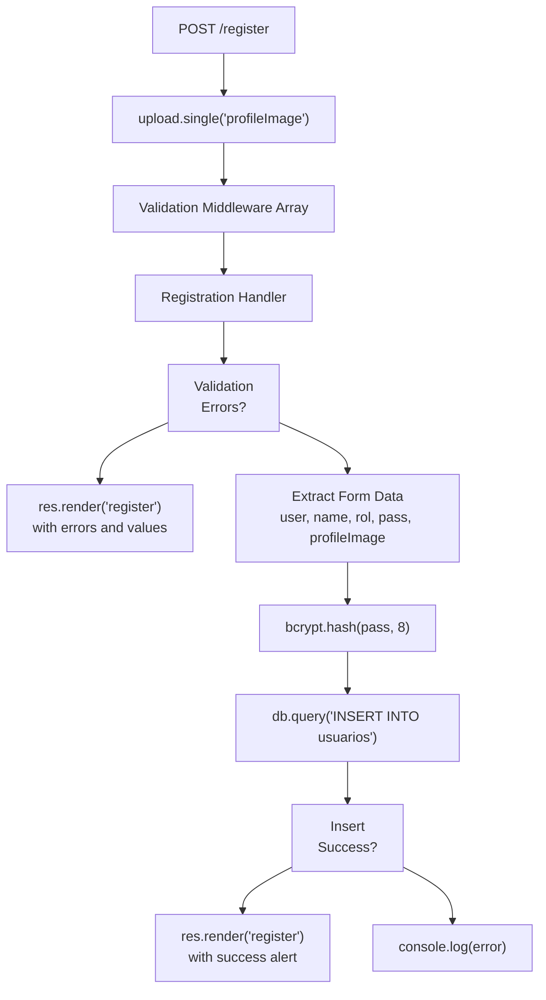
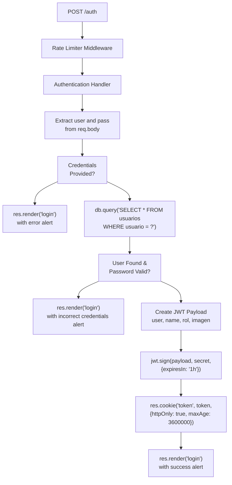
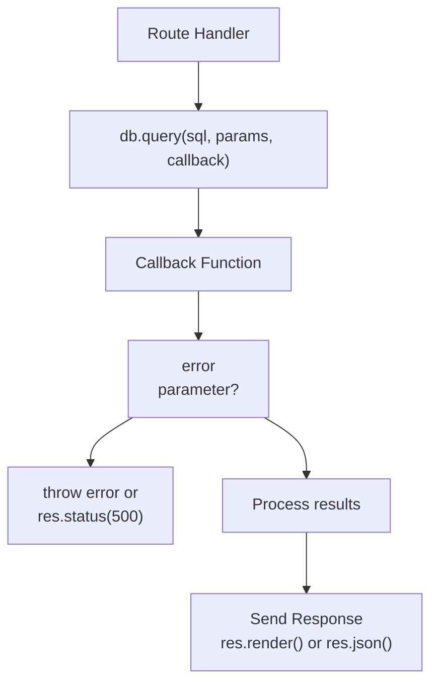
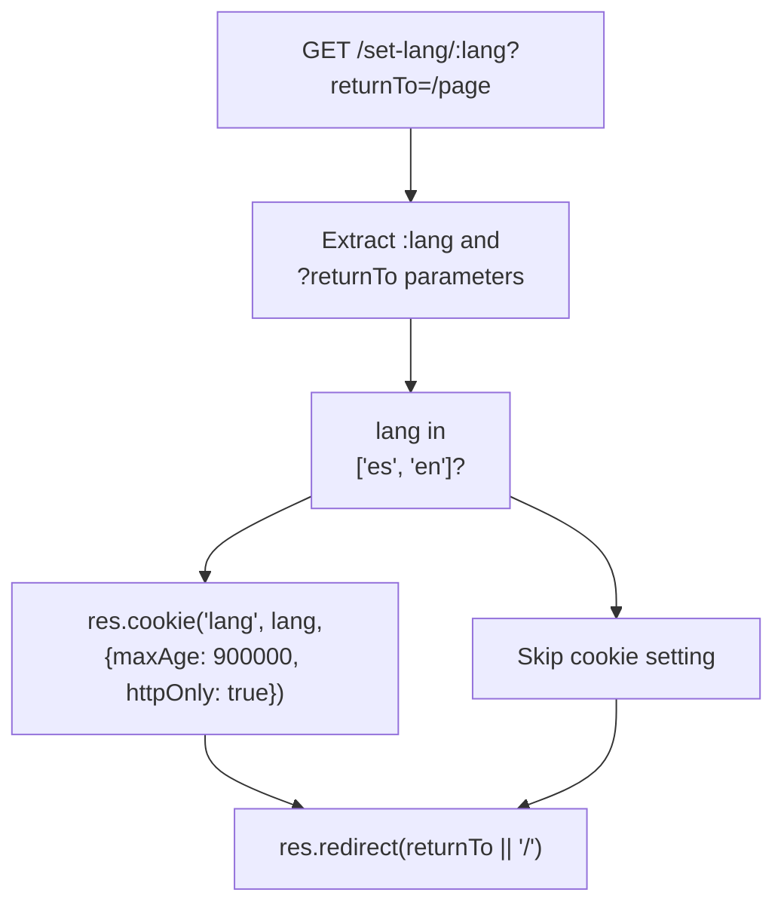

# Routing System

> **Relevant source files**
> * [proyecto.zip](https://github.com/moichuelo/registro/blob/544abbcc/proyecto.zip)
> * [src/router.js](https://github.com/moichuelo/registro/blob/544abbcc/src/router.js)

## Purpose and Scope

The Routing System is the central request routing mechanism for the registro-sesiones application. It defines all HTTP endpoints, maps URL paths to handler functions, applies middleware for authentication and validation, and coordinates between the presentation layer (views) and business logic (controllers). This document covers the router architecture, route organization, middleware integration, and handler patterns.

For details on specific route categories, see:

* [Public Routes](/moichuelo/registro/5.1-public-routes) - unauthenticated endpoints
* [Protected Routes](/moichuelo/registro/5.2-protected-routes) - authenticated user and admin endpoints
* [API Endpoints](/moichuelo/registro/5.3-api-endpoints) - RESTful data endpoints

For authentication middleware specifics, see [Authentication & Authorization](/moichuelo/registro/6-authentication-and-authorization).

**Sources:** [src/router.js L1-L607](https://github.com/moichuelo/registro/blob/544abbcc/src/router.js#L1-L607)

---

## Router Architecture

### Express Router Setup

The routing system is implemented using Express.js Router and exported as a module that is mounted in the main application. The router is configured with dependencies for authentication, validation, file uploads, and database access.

```mermaid
flowchart TD

RouterInstance["express.Router()<br>Line 2"]
ExpressValidator["express-validator<br>body, validationResult"]
BCrypt["bcryptjs<br>Password Hashing"]
DB["database/db<br>MySQL Connection"]
JWT["jsonwebtoken<br>Token Management"]
Puppeteer["puppeteer<br>PDF Generation"]
PDFKit["pdfkit<br>PDF Creation"]
EJS["ejs<br>Template Rendering"]
VerifyToken["verifyToken<br>src/middlewares/verifyToken"]
VerifyAdmin["verifyAdmin<br>src/middlewares/verifyAdmin"]
Upload["upload<br>src/middlewares/multerConfig"]
Limiter["limiter<br>src/middlewares/authLimiter"]
CRUD["crud<br>src/controllers"]
ExternalApp["index.js<br>app.use('/', router)"]

RouterInstance --> ExternalApp

subgraph subGraph3 ["Router Module - src/router.js"]
    RouterInstance
    RouterInstance --> ExpressValidator
    RouterInstance --> BCrypt
    RouterInstance --> DB
    RouterInstance --> JWT
    RouterInstance --> Puppeteer
    RouterInstance --> PDFKit
    RouterInstance --> EJS
    RouterInstance --> VerifyToken
    RouterInstance --> VerifyAdmin
    RouterInstance --> Upload
    RouterInstance --> Limiter
    RouterInstance --> CRUD

subgraph Controllers ["Controllers"]
    CRUD
end

subgraph subGraph1 ["Middleware Imports"]
    VerifyToken
    VerifyAdmin
    Upload
    Limiter
end

subgraph Dependencies ["Dependencies"]
    ExpressValidator
    BCrypt
    DB
    JWT
    Puppeteer
    PDFKit
    EJS
end
end
```



**Sources:** [src/router.js L1-L22](https://github.com/moichuelo/registro/blob/544abbcc/src/router.js#L1-L22)

 [src/router.js L607](https://github.com/moichuelo/registro/blob/544abbcc/src/router.js#L607-L607)

---

## Route Categories and Organization

The router defines 21 routes organized into three main categories: public routes, protected routes, and API endpoints. Routes are registered using HTTP verb methods (`router.get()`, `router.post()`) with optional middleware chains.

### Route Registration Pattern

Routes follow a consistent registration pattern:

```html
router.<method>("<path>", [middleware1, middleware2, ...], handlerFunction)
```

### Complete Route Map

| HTTP Method | Path | Middleware | Handler Type | Purpose |
| --- | --- | --- | --- | --- |
| GET | `/` | None | View | Home page with optional user info |
| GET | `/login` | None | View | Login form |
| GET | `/registro` | None | View | Registration form |
| GET | `/admin` | `verifyToken` | View | Product management dashboard |
| GET | `/pdfAdmin` | `verifyToken` | View | PDF preview page |
| GET | `/create` | None | View | Create product form |
| GET | `/edit/:id` | None | View | Edit product form |
| GET | `/delete/:id` | None | Redirect | Delete product and redirect |
| GET | `/logout` | None | Redirect | Clear JWT cookie and redirect |
| GET | `/soporte` | `verifyToken` | View | Support chat interface |
| GET | `/api/mensajes` | `verifyAdmin` | JSON | Get messages for specific user |
| GET | `/api/mensajes/mios` | `verifyToken` | JSON | Get current user's messages |
| GET | `/api/usuarios-conversaciones` | `verifyAdmin` | JSON | Get list of users with conversations |
| GET | `/pdf/descargar` | `verifyToken` | PDF | Download PDF (Puppeteer) |
| GET | `/pdfkit/descargar` | `verifyToken` | PDF | Download PDF (PDFKit) |
| GET | `/set-lang/:lang` | None | Redirect | Set language preference |
| POST | `/register` | `upload.single()`, validation | View | User registration |
| POST | `/auth` | `limiter` | View | User authentication |
| POST | `/save` | None | Redirect | Create product (via controller) |
| POST | `/update` | None | Redirect | Update product (via controller) |

**Sources:** [src/router.js L59-L604](https://github.com/moichuelo/registro/blob/544abbcc/src/router.js#L59-L604)

---

## Route Handler Types

The routing system implements four distinct handler patterns based on the type of response generated.



**Sources:** [src/router.js L59-L604](https://github.com/moichuelo/registro/blob/544abbcc/src/router.js#L59-L604)

### View Handlers

View handlers render EJS templates and return HTML responses. They query the database when needed and pass data to templates via the `res.render()` method.

**Example: Home Page Handler**

```javascript
// Lines 59-74
router.get("/", (req, res) => {
    if (req.cookies.token) {
        const payload = jwt.verify(req.cookies.token, process.env.JWT_SECRET);
        req.user = payload;
        res.render("index", {
            user: req.user?.name || "Usuario",
            login: true,
        });
    } else {
        res.render("index", {
            user: "Debe iniciar sesión",
            login: false,
        });
    }
});
```

**View Handler Routes:**

* `/` - Renders `index.ejs`
* `/login` - Renders `login.ejs`
* `/registro` - Renders `register.ejs`
* `/admin` - Renders `admin.ejs` with product data
* `/pdfAdmin` - Renders `pdfTabla.ejs` for PDF preview
* `/create` - Renders `create.ejs`
* `/edit/:id` - Renders `edit.ejs` with product data
* `/soporte` - Renders `soporte.ejs` with user data

**Sources:** [src/router.js L59-L80](https://github.com/moichuelo/registro/blob/544abbcc/src/router.js#L59-L80)

 [src/router.js L119-L155](https://github.com/moichuelo/registro/blob/544abbcc/src/router.js#L119-L155)

 [src/router.js L186-L196](https://github.com/moichuelo/registro/blob/544abbcc/src/router.js#L186-L196)

 [src/router.js L220-L227](https://github.com/moichuelo/registro/blob/544abbcc/src/router.js#L220-L227)

### API Handlers

API handlers return JSON responses for data retrieval. These endpoints are consumed by client-side JavaScript for dynamic functionality.

**Example: Get User Messages Handler**

```javascript
// Lines 256-280
router.get("/api/mensajes/mios", verifyToken, (req, res) => {
    const usuario = req.user.user;

    if (!usuario) {
        return res.status(403).json({ error: "No autorizado" });
    }

    const sql = `
    SELECT de_usuario, para_usuario, mensaje, fecha
    FROM mensajes
    WHERE 
      (de_usuario = ? OR para_usuario = ?)
    ORDER BY fecha ASC
    `;

    db.query(sql, [usuario, usuario], (err, results) => {
        if (err) {
            console.error("❌ Error al obtener mensajes:", err);
            return res.status(500).json({ error: "Error interno" });
        }
        res.json(results);
    });
});
```

**API Handler Routes:**

* `/api/mensajes?con=<username>` - Returns messages for specific user (admin only)
* `/api/mensajes/mios` - Returns current user's messages
* `/api/usuarios-conversaciones` - Returns list of users with conversations (admin only)

**Sources:** [src/router.js L229-L253](https://github.com/moichuelo/registro/blob/544abbcc/src/router.js#L229-L253)

 [src/router.js L256-L280](https://github.com/moichuelo/registro/blob/544abbcc/src/router.js#L256-L280)

 [src/router.js L283-L315](https://github.com/moichuelo/registro/blob/544abbcc/src/router.js#L283-L315)

### Redirect Handlers

Redirect handlers perform an action and redirect the user to another page using `res.redirect()`.

**Example: Logout Handler**

```javascript
// Lines 215-218
router.get("/logout", (req, res) => {
    res.clearCookie("token");
    res.redirect('/');
});
```

**Redirect Handler Routes:**

* `/delete/:id` - Deletes product and redirects to `/admin`
* `/logout` - Clears JWT cookie and redirects to `/`
* `/set-lang/:lang` - Sets language cookie and redirects to `returnTo` parameter

**Sources:** [src/router.js L198-L208](https://github.com/moichuelo/registro/blob/544abbcc/src/router.js#L198-L208)

 [src/router.js L215-L218](https://github.com/moichuelo/registro/blob/544abbcc/src/router.js#L215-L218)

 [src/router.js L398-L407](https://github.com/moichuelo/registro/blob/544abbcc/src/router.js#L398-L407)

### PDF Generation Handlers

PDF handlers generate PDF documents and return them as binary responses with appropriate headers. The system implements two PDF generation approaches.

**Puppeteer-based Handler (HTML to PDF):**

```javascript
// Lines 317-353
router.get("/pdf/descargar", verifyToken, async (req, res) => {
    db.query("SELECT * FROM productos", async (error, results) => {
        if (error) {
            return res.status(500).send("Error al obtener productos");
        }

        try {
            const html = await ejs.renderFile(path.join(__dirname, "../views/pdfTabla.ejs"), {
                productos: results
            });

            const browser = await puppeteer.launch({
                headless: true,
                args: ["--no-sandbox", "--disable-setuid-sandbox"],
            });

            const page = await browser.newPage();
            await page.setContent(html, { waitUntil: "networkidle0" });

            const pdfBuffer = await page.pdf({
                format: "A4",
                printBackground: true,
                margin: { top: "20px", bottom: "20px" },
            });

            await browser.close();

            res.setHeader("Content-Type", "application/pdf");
            res.setHeader("Content-Disposition", 'attachment; filename="productos.pdf"');
            res.send(pdfBuffer);
        } catch (err) {
            console.error("❌ Error al generar el PDF:", err);
            res.status(500).send("Error interno al generar el PDF");
        }
    });
});
```

**PDFKit-based Handler (Programmatic PDF):**

```javascript
// Lines 355-396
router.get("/pdfkit/descargar", verifyToken, (req, res) => {
    db.query("SELECT * FROM productos", (error, results) => {
        if (error) {
            return res.status(500).send("Error al obtener productos");
        }

        const doc = new PDFDocument({ margin: 40, size: 'A4' });

        res.setHeader("Content-Disposition", 'attachment; filename="productos_desde_cero.pdf"');
        res.setHeader("Content-Type", "application/pdf");

        doc.pipe(res);

        // Title
        doc.fontSize(18).text("Listado de Productos", { align: "center" }).moveDown();

        // Table headers
        doc.font("Helvetica-Bold").fontSize(12);
        let y = doc.y;
        doc.text("Referencia", 50, y);
        doc.text("Nombre", 150, y);
        doc.text("Precio", 300, y);
        doc.text("Stock", 380, y);

        y += 20;
        doc.font("Helvetica").fontSize(11);

        results.forEach((p) => {
            doc.text(p.ref.toString(), 50, y);
            doc.text(p.nombre, 150, y);
            doc.text(Number(p.precio).toFixed(2), 300, y);
            doc.text(p.stock.toString(), 380, y);
            y += 20;
        });

        doc.end();
    });
});
```

**Sources:** [src/router.js L317-L353](https://github.com/moichuelo/registro/blob/544abbcc/src/router.js#L317-L353)

 [src/router.js L355-L396](https://github.com/moichuelo/registro/blob/544abbcc/src/router.js#L355-L396)

---

## Middleware Integration

The routing system integrates five types of middleware to handle authentication, authorization, file uploads, rate limiting, and input validation.



**Sources:** [src/router.js L16-L21](https://github.com/moichuelo/registro/blob/544abbcc/src/router.js#L16-L21)

### Authentication Middleware (verifyToken)

The `verifyToken` middleware validates JWT tokens from cookies and attaches user information to `req.user`. Applied to routes requiring any authenticated user.

**Routes using `verifyToken`:**

* `/admin` - Product management (line 119)
* `/pdfAdmin` - PDF preview (line 136)
* `/soporte` - Support chat (line 220)
* `/api/mensajes/mios` - User's messages (line 256)
* `/pdf/descargar` - PDF download (line 317)
* `/pdfkit/descargar` - PDFKit download (line 355)

**Sources:** [src/router.js L16](https://github.com/moichuelo/registro/blob/544abbcc/src/router.js#L16-L16)

 [src/router.js L119](https://github.com/moichuelo/registro/blob/544abbcc/src/router.js#L119-L119)

 [src/router.js L220](https://github.com/moichuelo/registro/blob/544abbcc/src/router.js#L220-L220)

 [src/router.js L256](https://github.com/moichuelo/registro/blob/544abbcc/src/router.js#L256-L256)

 [src/router.js L317](https://github.com/moichuelo/registro/blob/544abbcc/src/router.js#L317-L317)

 [src/router.js L355](https://github.com/moichuelo/registro/blob/544abbcc/src/router.js#L355-L355)

### Authorization Middleware (verifyAdmin)

The `verifyAdmin` middleware checks if the authenticated user has the `admin` role. Applied after `verifyToken` to restrict access to administrative functions.

**Routes using `verifyAdmin`:**

* `/api/mensajes?con=<user>` - Get any user's messages (line 229)
* `/api/usuarios-conversaciones` - Get conversation list (line 283)

**Sources:** [src/router.js L17](https://github.com/moichuelo/registro/blob/544abbcc/src/router.js#L17-L17)

 [src/router.js L229](https://github.com/moichuelo/registro/blob/544abbcc/src/router.js#L229-L229)

 [src/router.js L283](https://github.com/moichuelo/registro/blob/544abbcc/src/router.js#L283-L283)

### File Upload Middleware (upload)

The `upload` middleware from multer handles multipart form data for file uploads. Configured to accept a single file with the field name `profileImage`.

**Routes using `upload`:**

* POST `/register` - Profile image upload (line 414)

**Sources:** [src/router.js L19](https://github.com/moichuelo/registro/blob/544abbcc/src/router.js#L19-L19)

 [src/router.js L414](https://github.com/moichuelo/registro/blob/544abbcc/src/router.js#L414-L414)

### Rate Limiting Middleware (limiter)

The `limiter` middleware implements rate limiting to prevent brute force attacks on authentication endpoints.

**Routes using `limiter`:**

* POST `/auth` - Login rate limiting (line 532)

**Sources:** [src/router.js L21](https://github.com/moichuelo/registro/blob/544abbcc/src/router.js#L21-L21)

 [src/router.js L532](https://github.com/moichuelo/registro/blob/544abbcc/src/router.js#L532-L532)

### Input Validation Middleware

The `express-validator` library provides validation middleware through the `body()` function. Validation rules are defined inline and checked using `validationResult()`.

**Routes using validation:**

* POST `/register` - Validates user, name, pass, email, edad fields (lines 415-428)

**Validation Rules:**

```
// Lines 415-428
[
    body("user")
        .exists()
        .isLength({ min: 4 })
        .withMessage("El usuario debe tener al menos 4 caracteres"),
    body("name")
        .isLength({ min: 4 })
        .withMessage("El nombre debe tener al menos 4 caracteres"),
    body("pass")
        .isLength({ min: 4 })
        .withMessage("La contraseña debe tener al menos 4 caracteres"),
    body("email").isEmail().withMessage("El email no es valido"),
    body("edad").isNumeric().withMessage("La edad debe ser un número"),
]
```

**Sources:** [src/router.js L3](https://github.com/moichuelo/registro/blob/544abbcc/src/router.js#L3-L3)

 [src/router.js L414-L428](https://github.com/moichuelo/registro/blob/544abbcc/src/router.js#L414-L428)

 [src/router.js L430-L442](https://github.com/moichuelo/registro/blob/544abbcc/src/router.js#L430-L442)

---

## POST Route Handlers

POST routes handle form submissions and data modifications. They implement authentication, file uploads, validation, and business logic before responding with views or redirects.

### User Registration Handler

The registration handler is the most complex POST route, combining file upload, input validation, password hashing, and database insertion.



**Sources:** [src/router.js L414-L484](https://github.com/moichuelo/registro/blob/544abbcc/src/router.js#L414-L484)

**Handler Details:**

1. **File Upload** (line 414): `upload.single("profileImage")` processes multipart form data
2. **Validation** (lines 415-428): 5 validation rules for user, name, pass, email, edad
3. **Error Handling** (lines 430-442): If validation fails, re-render form with errors and previous values
4. **Password Hashing** (line 453): `bcrypt.hash(pass, 8)` with 8 salt rounds
5. **Database Insert** (lines 456-480): Insert new user record with hashed password and profile image filename
6. **Success Response** (lines 469-478): Render registration page with SweetAlert success message

**Sources:** [src/router.js L414-L484](https://github.com/moichuelo/registro/blob/544abbcc/src/router.js#L414-L484)

### Authentication Handler

The authentication handler validates credentials, generates JWT tokens, and sets secure HTTP-only cookies.



**Sources:** [src/router.js L532-L601](https://github.com/moichuelo/registro/blob/544abbcc/src/router.js#L532-L601)

**Handler Details:**

1. **Rate Limiting** (line 532): Prevent brute force attacks
2. **Credential Extraction** (lines 533-534): Get username and password from form
3. **Database Query** (lines 537-540): Fetch user record by username
4. **Password Verification** (line 543): `bcrypt.compare(pass, results[0].pass)` validates password
5. **JWT Creation** (lines 559-567): Create payload and sign with `JWT_SECRET`
6. **Cookie Setup** (lines 570-574): Store token in HTTP-only cookie with 1-hour expiration
7. **Response** (lines 577-586): Render login page with success alert and auto-redirect

**Sources:** [src/router.js L532-L601](https://github.com/moichuelo/registro/blob/544abbcc/src/router.js#L532-L601)

### Controller Delegation

Two POST routes delegate to the `controllers.js` module for product CRUD operations.

**Controller Routes:**

* POST `/save` - Delegates to `crud.save` for product creation (line 603)
* POST `/update` - Delegates to `crud.update` for product editing (line 604)

**Sources:** [src/router.js L13](https://github.com/moichuelo/registro/blob/544abbcc/src/router.js#L13-L13)

 [src/router.js L603-L604](https://github.com/moichuelo/registro/blob/544abbcc/src/router.js#L603-L604)

---

## Dynamic Route Parameters

Several routes use Express route parameters (`:param`) to capture dynamic values from URLs.

### Parameter Extraction Pattern

| Route | Parameter | Extraction | Usage |
| --- | --- | --- | --- |
| `/edit/:id` | `:id` | `req.params.id` | Product reference for editing |
| `/delete/:id` | `:id` | `req.params.id` | Product reference for deletion |
| `/set-lang/:lang` | `:lang` | `req.params.lang` | Language code (es/en) |

**Example: Edit Product Route**

```javascript
// Lines 186-196
router.get("/edit/:id", (req, res) => {
    const ref = req.params.id; // Capture parameter
    db.query("SELECT * FROM productos WHERE ref = ?", [ref], (error, results) => {
        if (error) {
            throw error;
        } else {
            res.render("edit", { producto: results[0] });
        }
    });
});
```

**Sources:** [src/router.js L186-L196](https://github.com/moichuelo/registro/blob/544abbcc/src/router.js#L186-L196)

 [src/router.js L198-L208](https://github.com/moichuelo/registro/blob/544abbcc/src/router.js#L198-L208)

 [src/router.js L398-L407](https://github.com/moichuelo/registro/blob/544abbcc/src/router.js#L398-L407)

### Query Parameters

API routes use query parameters for filtering and data retrieval.

**Query Parameter Usage:**

* `/api/mensajes?con=<username>` - Query parameter `con` specifies user for message retrieval (line 230)
* `/set-lang/:lang?returnTo=<path>` - Query parameter `returnTo` specifies redirect destination (line 400)

**Example: Messages Query**

```javascript
// Line 230
const usuario = req.query.con; // Extract query parameter
```

**Sources:** [src/router.js L230](https://github.com/moichuelo/registro/blob/544abbcc/src/router.js#L230-L230)

 [src/router.js L400](https://github.com/moichuelo/registro/blob/544abbcc/src/router.js#L400-L400)

---

## Database Integration

The router directly executes MySQL queries for most operations using the `db` connection object imported from `database/db.js`.

### Database Query Pattern



**Sources:** [src/router.js L5](https://github.com/moichuelo/registro/blob/544abbcc/src/router.js#L5-L5)

 [src/router.js L121-L133](https://github.com/moichuelo/registro/blob/544abbcc/src/router.js#L121-L133)

### Query Examples by Route Type

**View Rendering Queries:**

```javascript
// Lines 121-133 - Admin page
db.query("SELECT * FROM productos", (error, results) => {
    if (error) {
        throw error;
    } else {
        res.render("admin", {
            productos: results,
            user: req.user,
            login: true,
            rol: req.user.rol,
        });
    }
});
```

**API Endpoint Queries:**

```javascript
// Lines 236-252 - Get messages for user
const sql = `
SELECT de_usuario, para_usuario, mensaje, fecha
FROM mensajes
WHERE 
  (de_usuario = ? OR para_usuario = ?)
ORDER BY fecha ASC
`;

db.query(sql, [usuario, usuario], (err, results) => {
    if (err) {
        console.error("❌ Error al consultar mensajes:", err);
        return res.status(500).json({ error: "Error al obtener mensajes" });
    }
    res.json(results);
});
```

**Sources:** [src/router.js L121-L133](https://github.com/moichuelo/registro/blob/544abbcc/src/router.js#L121-L133)

 [src/router.js L236-L252](https://github.com/moichuelo/registro/blob/544abbcc/src/router.js#L236-L252)

### Complex SQL Queries

The `/api/usuarios-conversaciones` endpoint uses a complex SQL query with UNION and subqueries to find all non-admin users who have conversations with admins.

```javascript
// Lines 292-304
const sql = `
SELECT DISTINCT usuario
FROM (
  SELECT de_usuario AS usuario FROM mensajes
  WHERE para_usuario IN (SELECT usuario FROM usuarios WHERE rol = 'admin')
  
  UNION
  
  SELECT para_usuario AS usuario FROM mensajes
  WHERE de_usuario IN (SELECT usuario FROM usuarios WHERE rol = 'admin')
) AS conversaciones
WHERE usuario NOT IN (SELECT usuario FROM usuarios WHERE rol = 'admin')
`;
```

**Query Logic:**

1. First subquery: Users who sent messages TO admins
2. Second subquery: Users who received messages FROM admins
3. UNION: Combine both sets
4. WHERE: Exclude admin users from results
5. DISTINCT: Remove duplicates

**Sources:** [src/router.js L292-L314](https://github.com/moichuelo/registro/blob/544abbcc/src/router.js#L292-L314)

---

## Language Switching System

The `/set-lang/:lang` route implements internationalization by storing language preferences in cookies and redirecting back to the originating page.



**Sources:** [src/router.js L398-L407](https://github.com/moichuelo/registro/blob/544abbcc/src/router.js#L398-L407)

**Implementation:**

```javascript
// Lines 398-407
router.get('/set-lang/:lang', (req, res) => {
    const lang = req.params.lang;
    const returnTo = req.query.returnTo || '/';

    if (['es', 'en'].includes(lang)) {
        res.cookie('lang', lang, { maxAge: 900000, httpOnly: true });
    }

    res.redirect(returnTo);
});
```

**Cookie Settings:**

* `maxAge: 900000` - 15 minutes (900,000 milliseconds)
* `httpOnly: true` - Not accessible via JavaScript for security

**Sources:** [src/router.js L398-L407](https://github.com/moichuelo/registro/blob/544abbcc/src/router.js#L398-L407)

---

## Swagger/OpenAPI Documentation

Several routes include JSDoc-style Swagger annotations for API documentation. These annotations describe request/response schemas, authentication requirements, and response codes.

**Documented Routes:**

* GET `/` - Home page (lines 40-58)
* GET `/admin` - Admin page (lines 83-118)
* GET `/edit/:id` - Edit product (lines 157-184)
* POST `/auth` - Authentication (lines 486-530)

**Example Swagger Annotation:**

```go
// Lines 486-530
/**
 * @swagger
 * /auth:
 *   post:
 *     summary: Autentica al usuario y establece una cookie JWT
 *     description: Valida las credenciales del usuario. Si son correctas, genera un token JWT y lo guarda en una cookie HTTP (`token`). Luego renderiza la vista `/`.
 *     tags:
 *       - Autenticación
 *     requestBody:
 *       required: true
 *       content:
 *         application/x-www-form-urlencoded:
 *           schema:
 *             type: object
 *             required:
 *               - user
 *               - pass
 *             properties:
 *               user:
 *                 type: string
 *                 description: Nombre de usuario
 *               pass:
 *                 type: string
 *                 description: Contraseña del usuario
 *     responses:
 *       200:
 *         description: Autenticación exitosa. Se establece una cookie JWT y se renderiza la vista `/`.
 *         headers:
 *           Set-Cookie:
 *             description: Cookie HTTP que contiene el JWT (token válido por 1 hora)
 *             schema:
 *               type: string
 *               example: token=eyJhbGciOiJIUzI1NiIsInR5cCI6IkpXVCJ9...; Path=/; HttpOnly; Max-Age=3600
 *         content:
 *           text/html:
 *             schema:
 *               type: string
 *               example: "<html>...</html>"
 *       400:
 *         description: Usuario o contraseña faltantes
 *       401:
 *         description: Credenciales incorrectas
 *       500:
 *         description: Error interno del servidor o de base de datos
 */
```

**Sources:** [src/router.js L40-L58](https://github.com/moichuelo/registro/blob/544abbcc/src/router.js#L40-L58)

 [src/router.js L83-L118](https://github.com/moichuelo/registro/blob/544abbcc/src/router.js#L83-L118)

 [src/router.js L157-L184](https://github.com/moichuelo/registro/blob/544abbcc/src/router.js#L157-L184)

 [src/router.js L486-L530](https://github.com/moichuelo/registro/blob/544abbcc/src/router.js#L486-L530)

---

## Error Handling Patterns

The router implements multiple error handling patterns depending on the route type and error scenario.

### Error Handling by Route Type

| Route Type | Error Pattern | Response |
| --- | --- | --- |
| View Routes | `throw error` or conditional render | 500 error or error alert in view |
| API Routes | `res.status(500).json({ error: "..." })` | JSON error object with status code |
| PDF Routes | `res.status(500).send("Error message")` | Plain text error with status code |
| Database Errors | `throw error` or console.error + status | Varies by route type |

**View Route Error Example:**

```javascript
// Lines 188-195 - Edit product
db.query("SELECT * FROM productos WHERE ref = ?", [ref], (error, results) => {
    if (error) {
        throw error;  // Handled by Express error handler
    } else {
        res.render("edit", { producto: results[0] });
    }
});
```

**API Route Error Example:**

```javascript
// Lines 244-248 - Get messages API
db.query(sql, [usuario, usuario], (err, results) => {
    if (err) {
        console.error("❌ Error al consultar mensajes:", err);
        return res.status(500).json({ error: "Error al obtener mensajes" });
    }
    res.json(results);
});
```

**Sources:** [src/router.js L188-L195](https://github.com/moichuelo/registro/blob/544abbcc/src/router.js#L188-L195)

 [src/router.js L244-L252](https://github.com/moichuelo/registro/blob/544abbcc/src/router.js#L244-L252)

 [src/router.js L318-L320](https://github.com/moichuelo/registro/blob/544abbcc/src/router.js#L318-L320)

 [src/router.js L348-L351](https://github.com/moichuelo/registro/blob/544abbcc/src/router.js#L348-L351)

### Validation Error Handling

The registration route has special handling for validation errors, re-rendering the form with error messages and preserving user input.

```javascript
// Lines 430-442
const errors = validationResult(req);
if (!errors.isEmpty()) {
    const valores = req.body;  // Preserve form values
    const validacionErrores = errors.array();  // Extract errors
    res.render("register", {
        validaciones: validacionErrores,  // Pass errors to template
        valores: valores,  // Pass values to template
    });
}
```

**Sources:** [src/router.js L430-L442](https://github.com/moichuelo/registro/blob/544abbcc/src/router.js#L430-L442)

---

## Module Export

The router is exported as a CommonJS module and imported by `index.js` where it is mounted at the root path.

```
// Line 607
module.exports = router;
```

**Usage in index.js:**

```javascript
const router = require('./src/router');
app.use('/', router);
```

**Sources:** [src/router.js L607](https://github.com/moichuelo/registro/blob/544abbcc/src/router.js#L607-L607)

 [index.js](https://github.com/moichuelo/registro/blob/544abbcc/index.js)