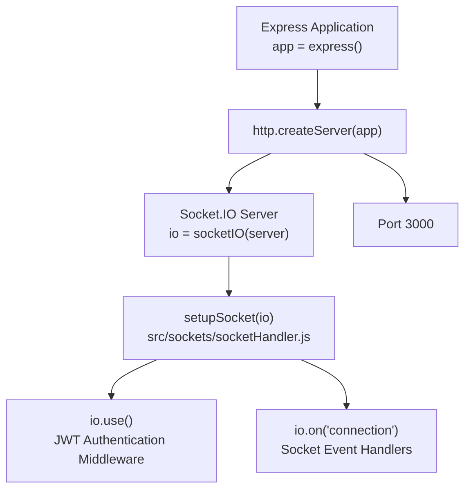
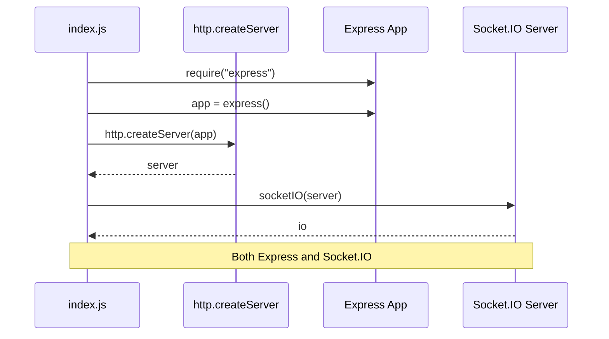
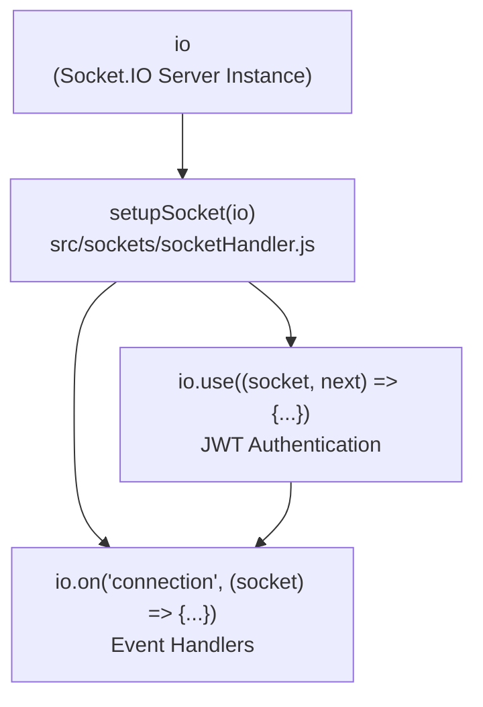
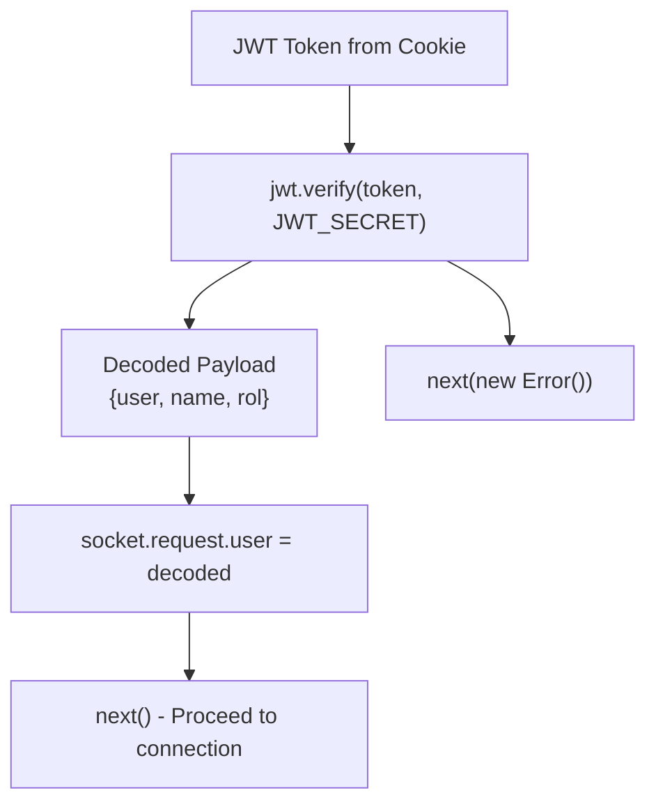
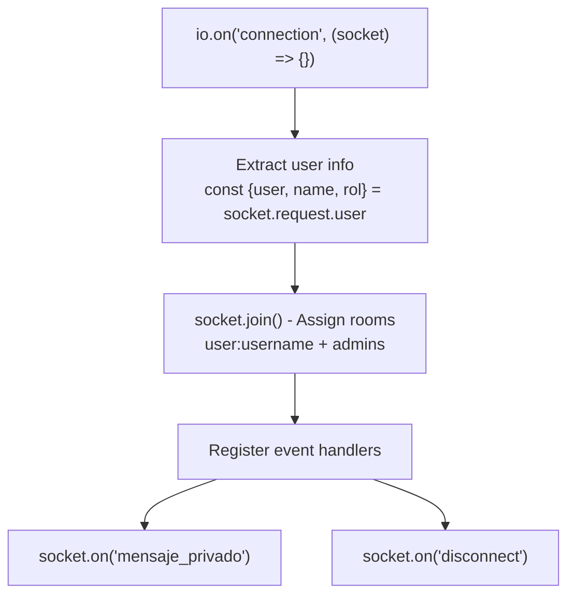
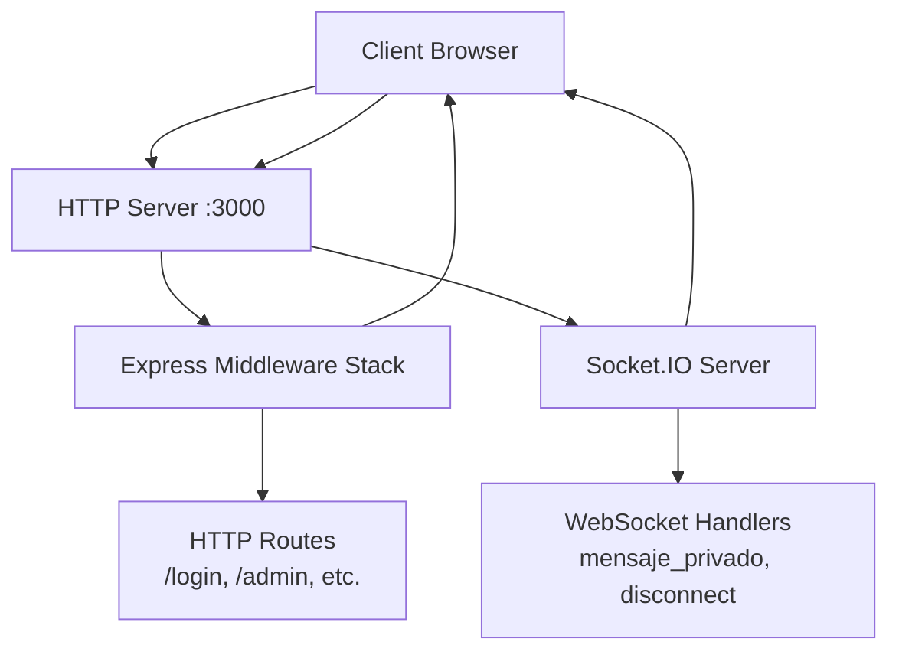
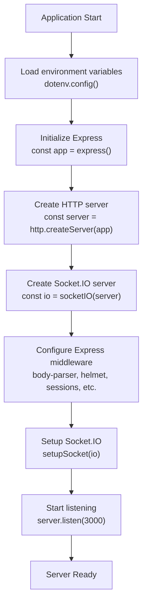
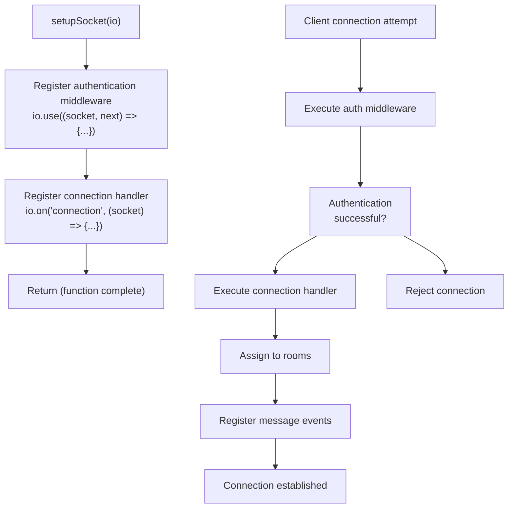

# Socket.IO Server Setup

> **Relevant source files**
> * [index.js](https://github.com/moichuelo/registro/blob/544abbcc/index.js)
> * [package-lock.json](https://github.com/moichuelo/registro/blob/544abbcc/package-lock.json)
> * [src/sockets/socketHandler.js](https://github.com/moichuelo/registro/blob/544abbcc/src/sockets/socketHandler.js)

## Purpose and Scope

This document covers the initialization and configuration of the Socket.IO server, including server creation, Socket.IO attachment to the HTTP server, authentication middleware registration, and connection handler setup. For information about WebSocket authentication mechanisms and JWT validation, see [WebSocket Authentication](/moichuelo/registro/7.2-websocket-authentication). For room-based routing and user organization, see [Room Management](/moichuelo/registro/7.3-room-management). For event handling and message processing, see [Message Handling](/moichuelo/registro/7.4-message-handling).

---

## Server Architecture Overview

The Socket.IO server shares the same HTTP server instance as the Express application, enabling both traditional HTTP request-response patterns and WebSocket bidirectional communication on a single port.



**Sources:** [index.js L8-L14](https://github.com/moichuelo/registro/blob/544abbcc/index.js#L8-L14)

 [index.js L56-L65](https://github.com/moichuelo/registro/blob/544abbcc/index.js#L56-L65)

---

## HTTP Server and Socket.IO Initialization

### Creating the HTTP Server

The HTTP server is created using Node.js's built-in `http` module, wrapping the Express application instance. This approach allows Socket.IO to attach to the same server that handles HTTP requests.

| Step | Code Entity | Location |
| --- | --- | --- |
| 1. Require HTTP module | `const http = require("http")` | [index.js L8](https://github.com/moichuelo/registro/blob/544abbcc/index.js#L8-L8) |
| 2. Require Socket.IO | `const socketIO = require("socket.io")` | [index.js L9](https://github.com/moichuelo/registro/blob/544abbcc/index.js#L9-L9) |
| 3. Create HTTP server | `const server = http.createServer(app)` | [index.js L10](https://github.com/moichuelo/registro/blob/544abbcc/index.js#L10-L10) |
| 4. Initialize Socket.IO | `const io = socketIO(server)` | [index.js L12](https://github.com/moichuelo/registro/blob/544abbcc/index.js#L12-L12) |

The `server` constant holds the HTTP server instance that both Express and Socket.IO use. The Express app is passed to `http.createServer()`, which wraps it as an HTTP request listener.

**Sources:** [index.js L8-L12](https://github.com/moichuelo/registro/blob/544abbcc/index.js#L8-L12)

### Socket.IO Server Instantiation

The Socket.IO server is instantiated by calling `socketIO(server)`, where `server` is the HTTP server instance. This creates the `io` object, which represents the Socket.IO server and provides methods for middleware registration and event handling.



**Sources:** [index.js L2-L12](https://github.com/moichuelo/registro/blob/544abbcc/index.js#L2-L12)

---

## Socket Handler Setup Integration

### setupSocket Function Registration

The `setupSocket` function from [src/sockets/socketHandler.js](https://github.com/moichuelo/registro/blob/544abbcc/src/sockets/socketHandler.js)

 is invoked to configure authentication middleware and connection handlers. This function encapsulates all Socket.IO configuration logic.



The function is called immediately after the `io` instance is created and before the HTTP server starts listening:

| Line | Action | Purpose |
| --- | --- | --- |
| [index.js L14](https://github.com/moichuelo/registro/blob/544abbcc/index.js#L14-L14) | `const setupSocket = require("./src/sockets/socketHandler")` | Import handler setup function |
| [index.js L57](https://github.com/moichuelo/registro/blob/544abbcc/index.js#L57-L57) | `setupSocket(io)` | Configure Socket.IO with authentication and event handlers |
| [index.js L62](https://github.com/moichuelo/registro/blob/544abbcc/index.js#L62-L62) | `server.listen(3000, ...)` | Start HTTP server with both Express and Socket.IO |

**Sources:** [index.js L14](https://github.com/moichuelo/registro/blob/544abbcc/index.js#L14-L14)

 [index.js L56-L65](https://github.com/moichuelo/registro/blob/544abbcc/index.js#L56-L65)

### setupSocket Function Structure

The `setupSocket` function accepts the `io` instance and configures it in two stages:

1. **Authentication Middleware Registration** ([src/sockets/socketHandler.js L6-L32](https://github.com/moichuelo/registro/blob/544abbcc/src/sockets/socketHandler.js#L6-L32) )
2. **Connection Event Handler Registration** ([src/sockets/socketHandler.js L36-L68](https://github.com/moichuelo/registro/blob/544abbcc/src/sockets/socketHandler.js#L36-L68) )

```javascript
function setupSocket(io) {
    // Stage 1: Authentication middleware
    io.use((socket, next) => {
        // JWT validation from cookies
    });
    
    // Stage 2: Connection handler
    io.on("connection", (socket) => {
        // Event listeners for messages, disconnect, etc.
    });
}
```

**Sources:** [src/sockets/socketHandler.js L4-L69](https://github.com/moichuelo/registro/blob/544abbcc/src/sockets/socketHandler.js#L4-L69)

---

## Authentication Middleware Registration

### Middleware Execution Flow

Socket.IO middleware functions execute before connection handlers, enabling authentication and authorization checks before a client can establish a WebSocket connection.

```mermaid
sequenceDiagram
  participant WebSocket Client
  participant io.use() Middleware
  participant io.on("connection")
  participant MySQL Database

  WebSocket Client->>io.use() Middleware: WebSocket Upgrade Request
  io.use() Middleware->>io.use() Middleware: Extract cookies from socket.request
  io.use() Middleware->>io.use() Middleware: Find token cookie
  loop [Valid token]
    io.use() Middleware->>io.use() Middleware: jwt.verify(token, JWT_SECRET)
    io.use() Middleware->>io.use() Middleware: socket.request.user = decoded
    io.use() Middleware->>io.on("connection"): next() - Allow connection
    io.on("connection")->>io.on("connection"): socket.join() rooms
    io.on("connection")-->>WebSocket Client: Connection established
    io.use() Middleware-->>WebSocket Client: Error("Token inválido")
    io.use() Middleware-->>WebSocket Client: Error("Token no proporcionado")
  end
```

**Sources:** [src/sockets/socketHandler.js L6-L32](https://github.com/moichuelo/registro/blob/544abbcc/src/sockets/socketHandler.js#L6-L32)

### Cookie and Token Extraction

The middleware extracts the JWT token from HTTP cookies attached to the WebSocket upgrade request:

| Step | Code | Location |
| --- | --- | --- |
| Access request | `const req = socket.request` | [src/sockets/socketHandler.js L7](https://github.com/moichuelo/registro/blob/544abbcc/src/sockets/socketHandler.js#L7-L7) |
| Extract cookies | `const cookies = req.headers.cookie` | [src/sockets/socketHandler.js L8](https://github.com/moichuelo/registro/blob/544abbcc/src/sockets/socketHandler.js#L8-L8) |
| Parse token | `const tokenMatch = cookies.match(/token=([^;]+)/)` | [src/sockets/socketHandler.js L16](https://github.com/moichuelo/registro/blob/544abbcc/src/sockets/socketHandler.js#L16-L16) |
| Extract value | `const token = tokenMatch && tokenMatch[1]` | [src/sockets/socketHandler.js L17](https://github.com/moichuelo/registro/blob/544abbcc/src/sockets/socketHandler.js#L17-L17) |

The token is expected to be stored in a cookie named `token`, which is set during login via HTTP routes (see [User Registration & Login](/moichuelo/registro/6.1-user-registration-and-login)).

**Sources:** [src/sockets/socketHandler.js L7-L17](https://github.com/moichuelo/registro/blob/544abbcc/src/sockets/socketHandler.js#L7-L17)

### JWT Verification and User Attachment

The extracted token is verified using the `jsonwebtoken` library with the secret key from environment variables:



The decoded JWT payload contains:

* `user`: Username (primary key from `usuarios` table)
* `name`: Full name
* `rol`: Role (`"admin"` or `"user"`)

These fields are attached to `socket.request.user` for access in the connection handler.

**Sources:** [src/sockets/socketHandler.js L24-L31](https://github.com/moichuelo/registro/blob/544abbcc/src/sockets/socketHandler.js#L24-L31)

 [index.js L6](https://github.com/moichuelo/registro/blob/544abbcc/index.js#L6-L6)

---

## Connection Handler Registration

### io.on("connection") Setup

After passing authentication middleware, the connection event fires with an authenticated socket instance. The handler extracts user information and sets up event listeners.



**Sources:** [src/sockets/socketHandler.js L36-L68](https://github.com/moichuelo/registro/blob/544abbcc/src/sockets/socketHandler.js#L36-L68)

### User Information Extraction

The connection handler immediately destructures the authenticated user data from `socket.request.user`, which was populated by the authentication middleware:

| Variable | Source | Purpose |
| --- | --- | --- |
| `user` | `socket.request.user.user` | Username for room assignment and message routing |
| `name` | `socket.request.user.name` | Display name (not actively used in handler) |
| `rol` | `socket.request.user.rol` | Role for admin room assignment and message routing |

**Sources:** [src/sockets/socketHandler.js L37](https://github.com/moichuelo/registro/blob/544abbcc/src/sockets/socketHandler.js#L37-L37)

### Room Assignment

Each connected socket is assigned to rooms based on the authenticated user's identity and role:

```
socket.join(`user:${user}`);           // Personal room for direct messages
if (rol === "admin") socket.join("admins");  // Admin broadcast room
```

See [Room Management](/moichuelo/registro/7.3-room-management) for detailed information on room-based routing strategy.

**Sources:** [src/sockets/socketHandler.js L42-L43](https://github.com/moichuelo/registro/blob/544abbcc/src/sockets/socketHandler.js#L42-L43)

---

## Server Startup Sequence

### Complete Initialization Flow

The following diagram shows the complete startup sequence from application bootstrap to ready state:

```mermaid
sequenceDiagram
  participant Application Bootstrap
  participant Express App
  participant HTTP Server
  participant Socket.IO Server
  participant setupSocket()
  participant Port 3000

  Application Bootstrap->>Express App: Initialize Express
  Application Bootstrap->>Express App: Configure middleware
  Application Bootstrap->>HTTP Server: (helmet, body-parser, etc.)
  Application Bootstrap->>Socket.IO Server: http.createServer(app)
  Application Bootstrap->>setupSocket(): socketIO(server)
  setupSocket()->>Socket.IO Server: setupSocket(io)
  setupSocket()->>Socket.IO Server: io.use() - Auth middleware
  Application Bootstrap->>Port 3000: io.on("connection") - Handler
  note over Application Bootstrap,Port 3000: Server ready for both
```

**Sources:** [index.js L1-L65](https://github.com/moichuelo/registro/blob/544abbcc/index.js#L1-L65)

### Listening on Port 3000

The HTTP server (with both Express and Socket.IO attached) starts listening on port 3000:

```javascript
server.listen(3000, () => {
    console.log("Servidor corriendo en http://localhost:3000");
    console.log('Swagger disponible en http://localhost:3000/api-docs');
});
```

This single `server.listen()` call makes both HTTP routes (via Express) and WebSocket connections (via Socket.IO) available on the same port.

**Sources:** [index.js L62-L65](https://github.com/moichuelo/registro/blob/544abbcc/index.js#L62-L65)

---

## Configuration Summary

### Key Configuration Points

| Configuration Aspect | Location | Value/Behavior |
| --- | --- | --- |
| Socket.IO Version | [package-lock.json](https://github.com/moichuelo/registro/blob/544abbcc/package-lock.json) | 4.8.1 |
| HTTP Server Module | [index.js L8](https://github.com/moichuelo/registro/blob/544abbcc/index.js#L8-L8) | Node.js built-in `http` |
| Server Port | [index.js L62](https://github.com/moichuelo/registro/blob/544abbcc/index.js#L62-L62) | 3000 |
| Authentication Method | [src/sockets/socketHandler.js L6](https://github.com/moichuelo/registro/blob/544abbcc/src/sockets/socketHandler.js#L6-L6) | JWT from HTTP-only cookie |
| JWT Secret Source | [index.js L4](https://github.com/moichuelo/registro/blob/544abbcc/index.js#L4-L4) | `process.env.JWT_SECRET` |
| Socket Handler Module | [index.js L14](https://github.com/moichuelo/registro/blob/544abbcc/index.js#L14-L14) | `./src/sockets/socketHandler` |
| Middleware Type | [src/sockets/socketHandler.js L6](https://github.com/moichuelo/registro/blob/544abbcc/src/sockets/socketHandler.js#L6-L6) | `io.use()` authentication middleware |
| Connection Event | [src/sockets/socketHandler.js L36](https://github.com/moichuelo/registro/blob/544abbcc/src/sockets/socketHandler.js#L36-L36) | `io.on("connection")` |

**Sources:** [index.js L1-L65](https://github.com/moichuelo/registro/blob/544abbcc/index.js#L1-L65)

 [src/sockets/socketHandler.js L1-L71](https://github.com/moichuelo/registro/blob/544abbcc/src/sockets/socketHandler.js#L1-L71)

 [package-lock.json L29](https://github.com/moichuelo/registro/blob/544abbcc/package-lock.json#L29-L29)

---

## Integration with Express Application

### Shared HTTP Server Pattern

Both Express and Socket.IO operate on the same HTTP server instance, allowing them to coexist on a single port. This pattern is essential for several reasons:

1. **Single Port Deployment**: Only one port needs to be exposed and configured in firewalls
2. **Shared Session Context**: Both systems can access the same cookies and headers
3. **Unified Authentication**: JWT tokens in cookies work for both HTTP and WebSocket requests
4. **Simplified Load Balancing**: A single endpoint for all application traffic



**Sources:** [index.js L2-L12](https://github.com/moichuelo/registro/blob/544abbcc/index.js#L2-L12)

 Diagram 1 from high-level architecture

---

## Dependencies and Modules

### Required npm Packages

| Package | Version | Purpose in Socket.IO Setup |
| --- | --- | --- |
| `socket.io` | 4.8.1 | WebSocket server implementation |
| `http` | Built-in | HTTP server for Socket.IO attachment |
| `jsonwebtoken` | 9.0.2 | JWT verification in middleware |
| `dotenv` | 16.5.0 | Environment variable loading (JWT_SECRET) |

### Module Imports

The Socket.IO setup requires the following imports across two files:

**index.js:**

* `http` - HTTP server creation
* `socket.io` - Socket.IO server instantiation
* `./src/sockets/socketHandler` - Configuration function

**src/sockets/socketHandler.js:**

* `jsonwebtoken` - Token verification
* `../../database/db` - Database connection for message persistence

**Sources:** [index.js L8-L14](https://github.com/moichuelo/registro/blob/544abbcc/index.js#L8-L14)

 [src/sockets/socketHandler.js L1-L3](https://github.com/moichuelo/registro/blob/544abbcc/src/sockets/socketHandler.js#L1-L3)

 [package-lock.json L29](https://github.com/moichuelo/registro/blob/544abbcc/package-lock.json#L29-L29)

---

## Error Handling

### Authentication Errors

The authentication middleware handles three error conditions:

| Condition | Detection | Error Response | Code Location |
| --- | --- | --- | --- |
| No cookies present | `!cookies` | `Error("No autenticado")` | [src/sockets/socketHandler.js L10-L13](https://github.com/moichuelo/registro/blob/544abbcc/src/sockets/socketHandler.js#L10-L13) |
| Token not found in cookies | `!token` | `Error("Token no proporcionado")` | [src/sockets/socketHandler.js L19-L22](https://github.com/moichuelo/registro/blob/544abbcc/src/sockets/socketHandler.js#L19-L22) |
| Invalid/expired JWT | `jwt.verify()` throws | `Error("Token inválido")` | [src/sockets/socketHandler.js L28-L31](https://github.com/moichuelo/registro/blob/544abbcc/src/sockets/socketHandler.js#L28-L31) |

When any of these errors occur, the WebSocket connection is rejected, and the client receives an error event.

**Sources:** [src/sockets/socketHandler.js L10-L31](https://github.com/moichuelo/registro/blob/544abbcc/src/sockets/socketHandler.js#L10-L31)

### Console Logging

The socket handler logs key events for debugging and monitoring:

```javascript
console.log("❌ No hay cookies en la conexión de socket");
console.log("❌ No se encontró el token en las cookies");
console.log("❌ Token inválido:", err.message);
console.log(`🟢 Usuario conectado: ${user} (${rol})`);
console.log(`🔴 Usuario desconectado: ${user}`);
```

**Sources:** [src/sockets/socketHandler.js L11](https://github.com/moichuelo/registro/blob/544abbcc/src/sockets/socketHandler.js#L11-L11)

 [src/sockets/socketHandler.js L20](https://github.com/moichuelo/registro/blob/544abbcc/src/sockets/socketHandler.js#L20-L20)

 [src/sockets/socketHandler.js L29](https://github.com/moichuelo/registro/blob/544abbcc/src/sockets/socketHandler.js#L29-L29)

 [src/sockets/socketHandler.js L39](https://github.com/moichuelo/registro/blob/544abbcc/src/sockets/socketHandler.js#L39-L39)

 [src/sockets/socketHandler.js L66](https://github.com/moichuelo/registro/blob/544abbcc/src/sockets/socketHandler.js#L66-L66)

---

## Complete Setup Code Flow

### index.js Initialization Sequence



**Sources:** [index.js L1-L65](https://github.com/moichuelo/registro/blob/544abbcc/index.js#L1-L65)

### socketHandler.js Configuration Sequence



**Sources:** [src/sockets/socketHandler.js L4-L69](https://github.com/moichuelo/registro/blob/544abbcc/src/sockets/socketHandler.js#L4-L69)