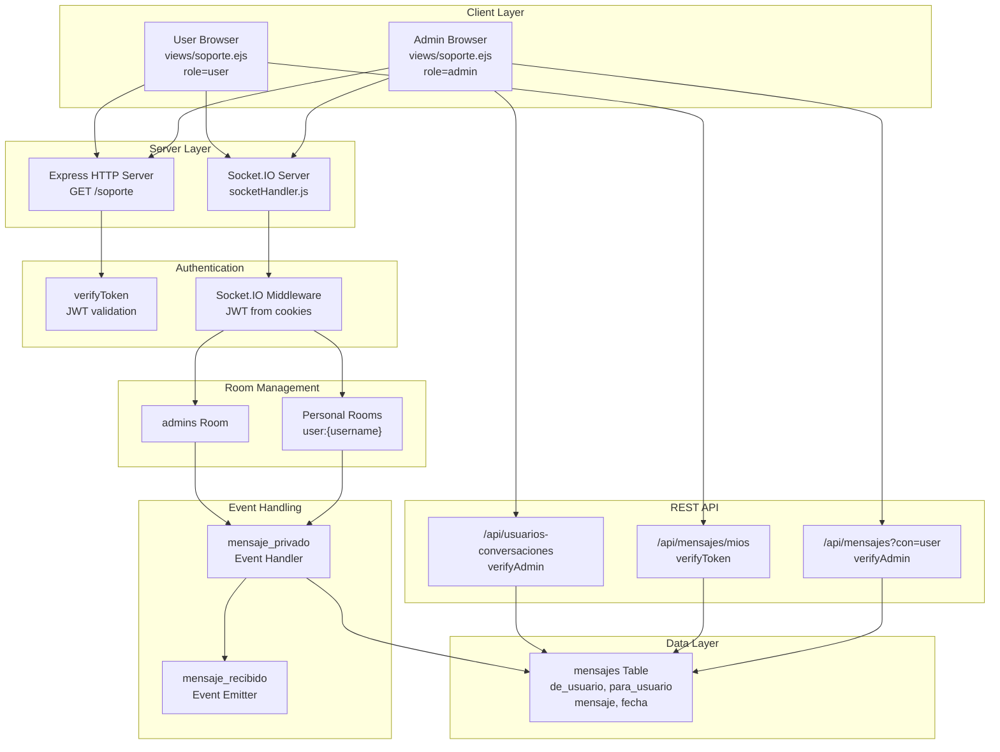
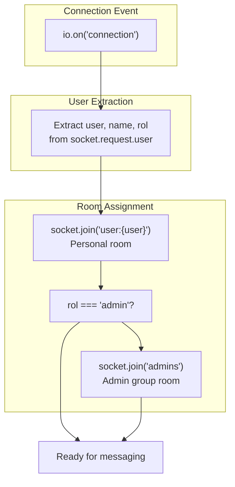
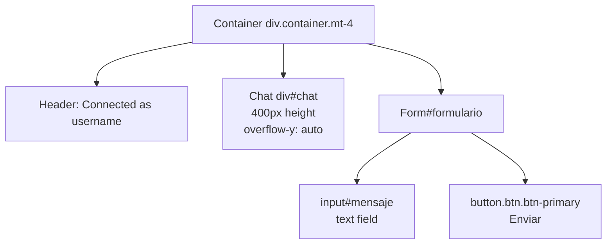
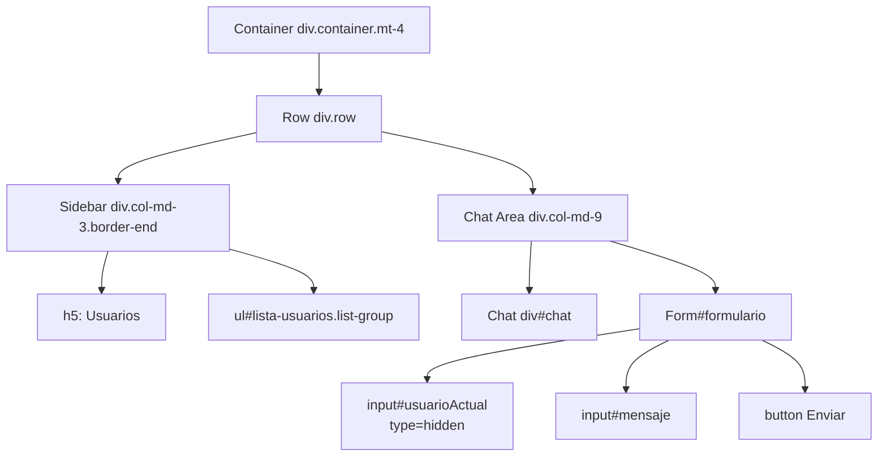

# Support Chat System

> **Relevant source files**
> * [src/router.js](https://github.com/moichuelo/registro/blob/544abbcc/src/router.js)
> * [src/sockets/socketHandler.js](https://github.com/moichuelo/registro/blob/544abbcc/src/sockets/socketHandler.js)
> * [views/soporte.ejs](https://github.com/moichuelo/registro/blob/544abbcc/views/soporte.ejs)

The Support Chat System provides real-time bidirectional messaging between users and administrators. The system uses Socket.IO for WebSocket-based communication, implements JWT authentication for secure connections, and persists all messages to the MySQL database. Users see a simple chat interface to communicate with administrators, while administrators see a multi-conversation interface with a user list and notification system.

For information about the Socket.IO server setup and initialization, see [Real-time Communication System](/moichuelo/registro/7-real-time-communication-system). For details on WebSocket authentication mechanics, see [WebSocket Authentication](/moichuelo/registro/7.2-websocket-authentication). For the underlying data model, see [mensajes Table](/moichuelo/registro/14.3-mensajes-table).

## System Architecture

The Support Chat System operates through a dual-channel architecture: WebSocket connections for real-time messaging and HTTP REST endpoints for historical message retrieval. The system distinguishes between two user roles (admin and regular users) and provides role-specific functionality.



**Sources:** [src/router.js L220-L315](https://github.com/moichuelo/registro/blob/544abbcc/src/router.js#L220-L315)

 [src/sockets/socketHandler.js L4-L69](https://github.com/moichuelo/registro/blob/544abbcc/src/sockets/socketHandler.js#L4-L69)

 [views/soporte.ejs L1-L191](https://github.com/moichuelo/registro/blob/544abbcc/views/soporte.ejs#L1-L191)

## Route and Entry Point

The support chat interface is accessed via the `/soporte` route, which requires authentication through the `verifyToken` middleware.

| Route | Method | Middleware | Purpose |
| --- | --- | --- | --- |
| `/soporte` | GET | `verifyToken` | Renders the support chat interface |

The route handler extracts the username and role from the JWT payload and passes them to the `soporte.ejs` template:

[src/router.js L220-L227](https://github.com/moichuelo/registro/blob/544abbcc/src/router.js#L220-L227)

```javascript
router.get("/soporte", verifyToken, (req, res) => {
    res.render("soporte", {
        user: {
            username: req.user.user,
            role: req.user.rol
        }
    });
});
```

The template receives a `user` object containing `username` and `role` properties, which determine the UI variant to display.

**Sources:** [src/router.js L220-L227](https://github.com/moichuelo/registro/blob/544abbcc/src/router.js#L220-L227)

## WebSocket Connection and Authentication

Socket.IO connections are authenticated using JWT tokens extracted from HTTP cookies. The authentication occurs in a Socket.IO middleware defined in `setupSocket` function.

```

```

The authentication middleware implementation is located at [src/sockets/socketHandler.js L6-L32](https://github.com/moichuelo/registro/blob/544abbcc/src/sockets/socketHandler.js#L6-L32)

:

* Extracts cookies from `socket.request.headers.cookie`
* Uses regex `/token=([^;]+)/` to parse the JWT token
* Verifies the token with `jwt.verify(token, process.env.JWT_SECRET)`
* Stores decoded payload in `socket.request.user`
* Calls `next()` to allow connection or `next(Error)` to reject

**Sources:** [src/sockets/socketHandler.js L6-L32](https://github.com/moichuelo/registro/blob/544abbcc/src/sockets/socketHandler.js#L6-L32)

## Room Management

The system uses Socket.IO rooms for message routing. Each user is assigned to rooms based on their identity and role upon connection.



Room assignment logic at [src/sockets/socketHandler.js L36-L43](https://github.com/moichuelo/registro/blob/544abbcc/src/sockets/socketHandler.js#L36-L43)

:

1. **Personal Room**: Every user joins `user:{username}` - their own private room
2. **Admin Room**: Users with `rol === "admin"` additionally join the `admins` room

| Room Type | Pattern | Purpose |
| --- | --- | --- |
| Personal | `user:{username}` | Direct messages to specific user |
| Admin Group | `admins` | Broadcast to all administrators |

**Sources:** [src/sockets/socketHandler.js L36-L43](https://github.com/moichuelo/registro/blob/544abbcc/src/sockets/socketHandler.js#L36-L43)

## Message Flow

Messages are sent via the `mensaje_privado` event and received via the `mensaje_recibido` event. The routing logic varies based on sender role.

```mermaid
sequenceDiagram
  participant Sender
  participant Socket Handler
  participant mensaje_privado
  participant user:{para} Room
  participant admins Room
  participant MySQL
  participant mensajes Table
  participant Recipient
  participant Admins

  Sender->>Socket Handler: "emit('mensaje_privado',
  Socket Handler->>Socket Handler: {para, mensaje})"
  Socket Handler->>user:{para} Room: "de = socket.request.user.user"
  user:{para} Room->>Recipient: "io.to('user:{para}')
  loop [Sender is not admin]
    Socket Handler->>admins Room: .emit('mensaje_recibido')"
    admins Room->>Admins: "mensaje_recibido event"
  end
  Socket Handler->>MySQL: "io.to('admins')
  MySQL->>Socket Handler: .emit('mensaje_recibido')"
```

### Event Handler: mensaje_privado

The `mensaje_privado` event handler is located at [src/sockets/socketHandler.js L45-L63](https://github.com/moichuelo/registro/blob/544abbcc/src/sockets/socketHandler.js#L45-L63)

 It performs the following operations:

1. **Extract sender**: `const de = user;` (from `socket.request.user`)
2. **Emit to recipient**: `io.to(\`user:${para}`).emit("mensaje_recibido", { de, mensaje })`
3. **Notify admins**: If `rol !== "admin"`, emit to `admins` room
4. **Persist to database**: Execute INSERT query to `mensajes` table

### Message Routing Rules

| Sender Role | Recipient Room | Admins Room | Logic |
| --- | --- | --- | --- |
| Regular User | ✓ Notified | ✓ Notified | All admins see user messages |
| Admin | ✓ Notified | ✗ Not notified | Only recipient sees message |

**Sources:** [src/sockets/socketHandler.js L45-L63](https://github.com/moichuelo/registro/blob/544abbcc/src/sockets/socketHandler.js#L45-L63)

## Database Integration

All messages are persisted to the `mensajes` table immediately upon receipt. The insertion occurs within the `mensaje_privado` event handler.

**SQL Query** [src/sockets/socketHandler.js L55-L62](https://github.com/moichuelo/registro/blob/544abbcc/src/sockets/socketHandler.js#L55-L62)

:

```sql
INSERT INTO mensajes (de_usuario, para_usuario, mensaje) 
VALUES (?, ?, ?)
```

**Table Structure:**

| Column | Type | Description |
| --- | --- | --- |
| `de_usuario` | VARCHAR | Sender username (FK to usuarios) |
| `para_usuario` | VARCHAR | Recipient username (FK to usuarios) |
| `mensaje` | TEXT | Message content |
| `fecha` | DATETIME | Timestamp (auto-generated) |

The `fecha` column is automatically populated by the database with the current timestamp upon insertion.

**Sources:** [src/sockets/socketHandler.js L55-L62](https://github.com/moichuelo/registro/blob/544abbcc/src/sockets/socketHandler.js#L55-L62)

## HTTP API Endpoints

The system provides three REST API endpoints for retrieving message history. These endpoints complement the real-time WebSocket functionality.

### GET /api/mensajes

**Authorization:** `verifyAdmin` middleware required
**Query Parameter:** `con` (username)
**Location:** [src/router.js L229-L253](https://github.com/moichuelo/registro/blob/544abbcc/src/router.js#L229-L253)

Returns all messages exchanged with a specific user (bidirectional conversation).

**SQL Query:**

```sql
SELECT de_usuario, para_usuario, mensaje, fecha
FROM mensajes
WHERE (de_usuario = ? OR para_usuario = ?)
ORDER BY fecha ASC
```

**Response Format:**

```json
[
  {
    "de_usuario": "john",
    "para_usuario": "admin",
    "mensaje": "Need help",
    "fecha": "2024-01-15T10:30:00.000Z"
  }
]
```

### GET /api/mensajes/mios

**Authorization:** `verifyToken` middleware required
**Location:** [src/router.js L256-L280](https://github.com/moichuelo/registro/blob/544abbcc/src/router.js#L256-L280)

Returns all messages involving the authenticated user (extracted from `req.user.user`).

**SQL Query:** Same as `/api/mensajes` but using authenticated user's username.

### GET /api/usuarios-conversaciones

**Authorization:** `verifyAdmin` middleware required
**Location:** [src/router.js L283-L315](https://github.com/moichuelo/registro/blob/544abbcc/src/router.js#L283-L315)

Returns a list of non-admin users who have conversations with administrators.

**SQL Query:**

```sql
SELECT DISTINCT usuario
FROM (
  SELECT de_usuario AS usuario FROM mensajes
  WHERE para_usuario IN (SELECT usuario FROM usuarios WHERE rol = 'admin')
  
  UNION
  
  SELECT para_usuario AS usuario FROM mensajes
  WHERE de_usuario IN (SELECT usuario FROM usuarios WHERE rol = 'admin')
) AS conversaciones
WHERE usuario NOT IN (SELECT usuario FROM usuarios WHERE rol = 'admin')
```

**Response Format:**

```json
["john", "alice", "bob"]
```

| Endpoint | Method | Auth | Purpose |
| --- | --- | --- | --- |
| `/api/mensajes` | GET | Admin | Get specific user conversation |
| `/api/mensajes/mios` | GET | User | Get own conversation history |
| `/api/usuarios-conversaciones` | GET | Admin | List users with conversations |

**Sources:** [src/router.js L229-L315](https://github.com/moichuelo/registro/blob/544abbcc/src/router.js#L229-L315)

## User Interface: Regular Users

Regular users (non-admins) see a simplified single-conversation interface. The UI is defined at [views/soporte.ejs L26-L33](https://github.com/moichuelo/registro/blob/544abbcc/views/soporte.ejs#L26-L33)

 and client-side logic at [views/soporte.ejs L164-L188](https://github.com/moichuelo/registro/blob/544abbcc/views/soporte.ejs#L164-L188)

### UI Components



### Client-Side Initialization

1. **Load Message History** [views/soporte.ejs L166-L171](https://github.com/moichuelo/registro/blob/544abbcc/views/soporte.ejs#L166-L171) : * Fetch from `/api/mensajes/mios` * Parse JSON response * Call `agregarMensaje()` for each message with timestamp
2. **WebSocket Listener** [views/soporte.ejs L174-L177](https://github.com/moichuelo/registro/blob/544abbcc/views/soporte.ejs#L174-L177) : * Listen for `mensaje_recibido` event * Display incoming messages with sender username
3. **Form Submit Handler** [views/soporte.ejs L180-L187](https://github.com/moichuelo/registro/blob/544abbcc/views/soporte.ejs#L180-L187) : * Prevent default form submission * Emit `mensaje_privado` event with `{ para: "admin", mensaje }` * Display own message locally as "Tú"

**Message Destination:** All user messages are hardcoded to send to `"admin"` as the recipient.

**Sources:** [views/soporte.ejs L26-L33](https://github.com/moichuelo/registro/blob/544abbcc/views/soporte.ejs#L26-L33)

 [views/soporte.ejs L164-L188](https://github.com/moichuelo/registro/blob/544abbcc/views/soporte.ejs#L164-L188)

## User Interface: Administrators

Administrators see a more complex interface with a user list sidebar, conversation switching, and visual notifications for new messages. The UI is defined at [views/soporte.ejs L8-L24](https://github.com/moichuelo/registro/blob/544abbcc/views/soporte.ejs#L8-L24)

 and client-side logic at [views/soporte.ejs L62-L163](https://github.com/moichuelo/registro/blob/544abbcc/views/soporte.ejs#L62-L163)

### UI Layout



### Client-Side State Management

**Key Variables** [views/soporte.ejs L65-L66](https://github.com/moichuelo/registro/blob/544abbcc/views/soporte.ejs#L65-L66)

:

| Variable | Type | Purpose |
| --- | --- | --- |
| `conversaciones` | Object | Maps username to array of message objects |
| `notificaciones` | Object | (Declared but unused in current implementation) |
| `usuarioActual` | HTMLInputElement | Hidden field storing currently selected user |

### Initialization Sequence

1. **Fetch User List** [views/soporte.ejs L105-L112](https://github.com/moichuelo/registro/blob/544abbcc/views/soporte.ejs#L105-L112) : * GET `/api/usuarios-conversaciones` * For each user: call `agregarUsuarioLista()` and `cargarHistorial()`
2. **Load Conversation History** [views/soporte.ejs L115-L125](https://github.com/moichuelo/registro/blob/544abbcc/views/soporte.ejs#L115-L125) : * GET `/api/mensajes?con={usuario}` * Store in `conversaciones[usuario]` array * Call `renderConversacion()` to display

### Function: agregarUsuarioLista

Located at [views/soporte.ejs L89-L102](https://github.com/moichuelo/registro/blob/544abbcc/views/soporte.ejs#L89-L102)

Creates a list item (`<li>`) element with the following properties:

* `id`: `"user-{username}"`
* `className`: `"list-group-item"`
* `dataset.nuevo`: Tracks if user has new messages
* Click handler: calls `renderConversacion(usuario)`

### Function: renderConversacion

Located at [views/soporte.ejs L69-L86](https://github.com/moichuelo/registro/blob/544abbcc/views/soporte.ejs#L69-L86)

Displays messages for a specific user:

1. Clear chat div: `chat.innerHTML = ''`
2. Retrieve messages: `conversaciones[usuario]`
3. Render each message with `agregarMensaje(de, mensaje, fecha)`
4. Update `usuarioActual.value`
5. Update list item styles: * Active conversation: `bg-light`, `text-success`, `fw-bold` * Mark as viewed: `dataset.nuevo = "false"`

### Notification System

The system provides visual feedback for new messages using Bootstrap color classes:

| State | Classes Applied | Meaning |
| --- | --- | --- |
| Active Conversation | `bg-light`, `text-success`, `fw-bold` | Currently viewing |
| New Message | `fw-bold`, `text-danger` | Unread message |
| Previously Viewed | `text-success` | No special styling after first view |

**Logic** [views/soporte.ejs L136-L145](https://github.com/moichuelo/registro/blob/544abbcc/views/soporte.ejs#L136-L145)

:

When `mensaje_recibido` event fires:

* If message is from non-active user → apply red styling (`text-danger`, `fw-bold`)
* If message is from active user → call `renderConversacion()` to mark as read

### Message Sending

Form submit handler at [views/soporte.ejs L150-L162](https://github.com/moichuelo/registro/blob/544abbcc/views/soporte.ejs#L150-L162)

:

1. Get recipient from `usuarioActual.value`
2. Emit `mensaje_privado` with `{ para, mensaje }`
3. Store message locally in `conversaciones[para]`
4. Re-render conversation to display own message immediately

**Sources:** [views/soporte.ejs L8-L24](https://github.com/moichuelo/registro/blob/544abbcc/views/soporte.ejs#L8-L24)

 [views/soporte.ejs L62-L163](https://github.com/moichuelo/registro/blob/544abbcc/views/soporte.ejs#L62-L163)

## Utility Functions

### formatearFecha

Located at [views/soporte.ejs L44-L52](https://github.com/moichuelo/registro/blob/544abbcc/views/soporte.ejs#L44-L52)

Converts ISO 8601 timestamp to Spanish date format: `DD/MM/YYYY HH:MM`

**Implementation:**

* Parses ISO string with `new Date(isoString)`
* Extracts day, month, year, hour, minute
* Applies `padStart(2, '0')` for zero-padding

### agregarMensaje

Located at [views/soporte.ejs L54-L60](https://github.com/moichuelo/registro/blob/544abbcc/views/soporte.ejs#L54-L60)

Appends a message to the chat div with formatted HTML:

```html
<p>
  <strong>username:</strong> message text
  <span class="text-muted" style="font-size: 0.8em;"> (DD/MM/YYYY HH:MM)</span>
</p>
```

The timestamp span is only included if `fecha` parameter is provided. After appending, the function auto-scrolls to bottom: `chat.scrollTop = chat.scrollHeight`.

**Sources:** [views/soporte.ejs L44-L60](https://github.com/moichuelo/registro/blob/544abbcc/views/soporte.ejs#L44-L60)

## Disconnect Handling

The Socket.IO server handles disconnection events at [src/sockets/socketHandler.js L65-L67](https://github.com/moichuelo/registro/blob/544abbcc/src/sockets/socketHandler.js#L65-L67)

:

```javascript
socket.on("disconnect", () => {
    console.log(`🔴 Usuario desconectado: ${user}`);
});
```

Currently, the disconnect handler only logs the event. The system does not:

* Remove users from rooms (Socket.IO handles this automatically)
* Notify other users of disconnection
* Update online/offline status indicators

When a user disconnects, Socket.IO automatically removes them from all rooms they joined during connection.

**Sources:** [src/sockets/socketHandler.js L65-L67](https://github.com/moichuelo/registro/blob/544abbcc/src/sockets/socketHandler.js#L65-L67)

## Error Handling

### Authentication Errors

WebSocket authentication failures are handled in the Socket.IO middleware [src/sockets/socketHandler.js L10-L31](https://github.com/moichuelo/registro/blob/544abbcc/src/sockets/socketHandler.js#L10-L31)

:

| Error Condition | Error Message | Action |
| --- | --- | --- |
| No cookies present | "No autenticado" | Reject connection with `next(Error)` |
| Token not found in cookies | "Token no proporcionado" | Reject connection |
| Token verification fails | "Token inválido" | Reject connection |

### Database Errors

Message insertion errors are logged but do not prevent message delivery [src/sockets/socketHandler.js L57-L61](https://github.com/moichuelo/registro/blob/544abbcc/src/sockets/socketHandler.js#L57-L61)

:

```javascript
if (err) {
    console.error("❌ Error al guardar mensaje:", err);
} else {
    console.log("💾 Mensaje guardado:", `${de} ➡️ ${para}`);
}
```

The system delivers messages to recipients via WebSocket even if database insertion fails.

### API Endpoint Errors

HTTP API endpoints return appropriate status codes and JSON error messages:

* `400`: Missing required query parameter [src/router.js L232-L234](https://github.com/moichuelo/registro/blob/544abbcc/src/router.js#L232-L234)
* `403`: User not authorized [src/router.js L260](https://github.com/moichuelo/registro/blob/544abbcc/src/router.js#L260-L260)
* `500`: Database query error [src/router.js L246-L248](https://github.com/moichuelo/registro/blob/544abbcc/src/router.js#L246-L248)  [src/router.js L273-L275](https://github.com/moichuelo/registro/blob/544abbcc/src/router.js#L273-L275)

**Sources:** [src/sockets/socketHandler.js L10-L31](https://github.com/moichuelo/registro/blob/544abbcc/src/sockets/socketHandler.js#L10-L31)

 [src/sockets/socketHandler.js L57-L61](https://github.com/moichuelo/registro/blob/544abbcc/src/sockets/socketHandler.js#L57-L61)

 [src/router.js L229-L280](https://github.com/moichuelo/registro/blob/544abbcc/src/router.js#L229-L280)