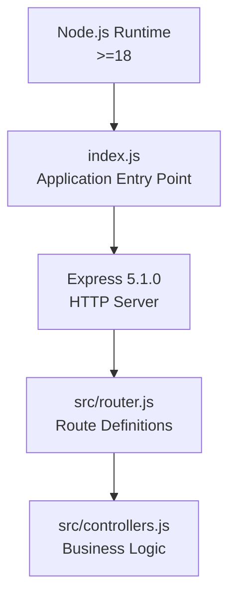
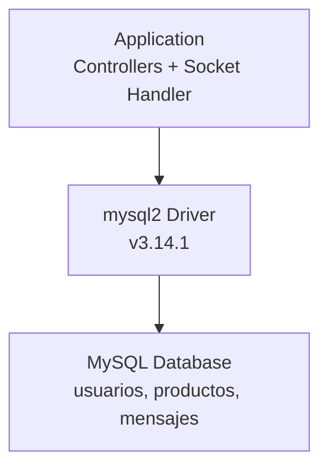
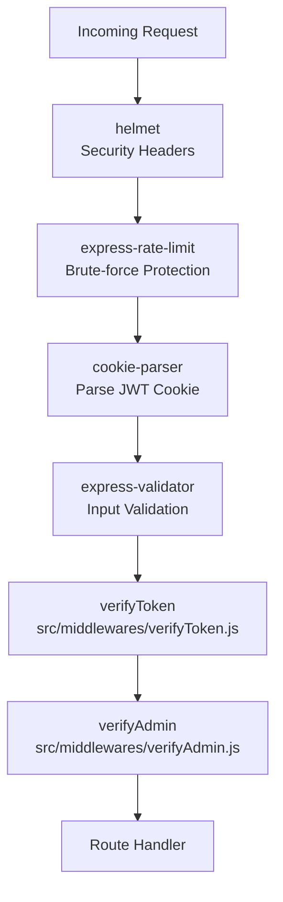
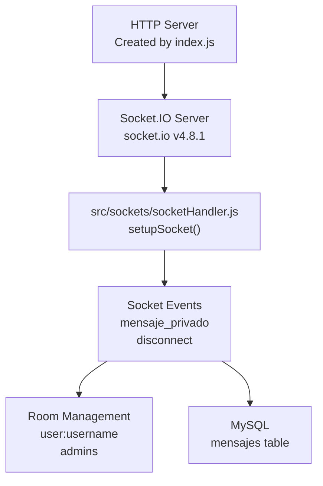
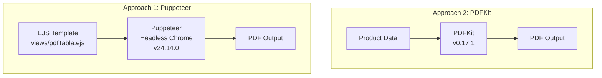
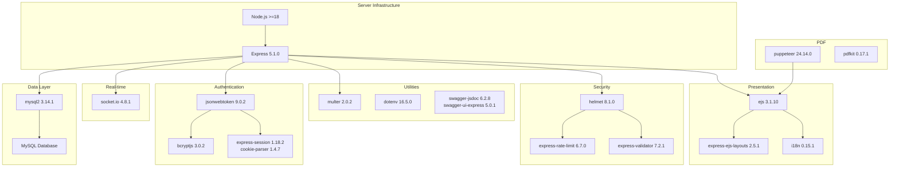

# Technology Stack

> **Relevant source files**
> * [package-lock.json](https://github.com/moichuelo/registro/blob/544abbcc/package-lock.json)
> * [package.json](https://github.com/moichuelo/registro/blob/544abbcc/package.json)

This document catalogs the technologies, frameworks, and libraries used in the registro-sesiones application. It provides an overview of the core dependencies, their versions, and their roles within the system architecture. For information about how these technologies are configured and initialized during application startup, see [Application Bootstrap](/moichuelo/registro/4-application-bootstrap).

## Core Framework and Runtime

The application is built on **Node.js** and uses **Express 5.1.0** as the primary web application framework. Express handles HTTP routing, middleware management, and serves both traditional request-response patterns and static assets.

| Technology | Version | Purpose |
| --- | --- | --- |
| Node.js | >=18 | JavaScript runtime environment |
| Express | 5.1.0 | Web application framework and HTTP server |
| express-ejs-layouts | 2.5.1 | Layout support for EJS templates |

The server is initialized in [index.js](https://github.com/moichuelo/registro/blob/544abbcc/index.js)

 where Express is configured with middleware and routing. The application uses CommonJS module system as specified in [package.json L17](https://github.com/moichuelo/registro/blob/544abbcc/package.json#L17-L17)

**Sources:** [package.json L22-L42](https://github.com/moichuelo/registro/blob/544abbcc/package.json#L22-L42)

 [package-lock.json L1324-L1365](https://github.com/moichuelo/registro/blob/544abbcc/package-lock.json#L1324-L1365)

## Database Layer

The application uses **MySQL** as its relational database management system, accessed through the **mysql2** driver which provides Promise-based APIs and prepared statement support.

| Component | Version | Purpose |
| --- | --- | --- |
| mysql2 | 3.14.1 | MySQL database driver with Promise support |

Database connection configuration is managed in [database/db.js](https://github.com/moichuelo/registro/blob/544abbcc/database/db.js)

 The driver provides connection pooling capabilities for efficient database resource management.

**Sources:** [package.json L37](https://github.com/moichuelo/registro/blob/544abbcc/package.json#L37-L37)

 [package-lock.json L956-L964](https://github.com/moichuelo/registro/blob/544abbcc/package-lock.json#L956-L964)

## Authentication and Security

The authentication system combines multiple security technologies to provide JWT-based stateless authentication with session management fallback.

### Authentication Libraries

| Library | Version | Purpose |
| --- | --- | --- |
| jsonwebtoken | 9.0.2 | JWT creation, signing, and verification |
| bcryptjs | 3.0.2 | Password hashing with bcrypt algorithm |
| cookie-parser | 1.4.7 | Parse and sign HTTP cookies |
| express-session | 1.18.2 | Session middleware for Express |
| cookie-session | 2.1.1 | Cookie-based session storage |

**JWT** tokens are generated using the `jsonwebtoken` library and stored in HTTP-only cookies. The `bcryptjs` library provides one-way password hashing with configurable salt rounds. Authentication flows are implemented in [src/controllers.js](https://github.com/moichuelo/registro/blob/544abbcc/src/controllers.js)

 and protected by middleware in [src/middlewares/verifyToken.js](https://github.com/moichuelo/registro/blob/544abbcc/src/middlewares/verifyToken.js)

 and [src/middlewares/verifyAdmin.js](https://github.com/moichuelo/registro/blob/544abbcc/src/middlewares/verifyAdmin.js)

### Security Middleware

| Library | Version | Purpose |
| --- | --- | --- |
| helmet | 8.1.0 | Security headers (CSP, HSTS, X-Frame-Options) |
| express-rate-limit | 6.7.0 | Rate limiting to prevent brute-force attacks |
| express-validator | 7.2.1 | Input validation and sanitization |

**Sources:** [package.json L23-L33](https://github.com/moichuelo/registro/blob/544abbcc/package.json#L23-L33)

 [package-lock.json L523-L1748](https://github.com/moichuelo/registro/blob/544abbcc/package-lock.json#L523-L1748)

**Sources:** [package.json L22-L33](https://github.com/moichuelo/registro/blob/544abbcc/package.json#L22-L33)

 [src/middlewares/verifyToken.js](https://github.com/moichuelo/registro/blob/544abbcc/src/middlewares/verifyToken.js)

 [src/middlewares/verifyAdmin.js](https://github.com/moichuelo/registro/blob/544abbcc/src/middlewares/verifyAdmin.js)

## Real-time Communication

The application uses **Socket.IO 4.8.1** for bidirectional real-time communication between clients and server, enabling the support chat system.

| Library | Version | Purpose |
| --- | --- | --- |
| socket.io | 4.8.1 | WebSocket library for real-time communication |

Socket.IO is attached to the HTTP server in [index.js](https://github.com/moichuelo/registro/blob/544abbcc/index.js)

 and configured with authentication middleware. The socket event handlers are implemented in [src/sockets/socketHandler.js](https://github.com/moichuelo/registro/blob/544abbcc/src/sockets/socketHandler.js)

 which manages room-based message routing and persistence.

**Sources:** [package.json L40](https://github.com/moichuelo/registro/blob/544abbcc/package.json#L40-L40)

 [package-lock.json L2312-L2330](https://github.com/moichuelo/registro/blob/544abbcc/package-lock.json#L2312-L2330)

 [src/sockets/socketHandler.js](https://github.com/moichuelo/registro/blob/544abbcc/src/sockets/socketHandler.js)

## View Layer and Templating

The presentation layer uses **EJS** as the templating engine with layout support for consistent page structure.

| Library | Version | Purpose |
| --- | --- | --- |
| ejs | 3.1.10 | Embedded JavaScript templating engine |
| express-ejs-layouts | 2.5.1 | Layout and partial support for EJS |

EJS templates are located in [views/](https://github.com/moichuelo/registro/blob/544abbcc/views/)

 directory with a master layout in [views/layout.ejs](https://github.com/moichuelo/registro/blob/544abbcc/views/layout.ejs)

 and reusable partials in [views/partials/](https://github.com/moichuelo/registro/blob/544abbcc/views/partials/)

 The view engine is configured in [index.js](https://github.com/moichuelo/registro/blob/544abbcc/index.js)

**Sources:** [package.json L27-L29](https://github.com/moichuelo/registro/blob/544abbcc/package.json#L27-L29)

 [package-lock.json L1049-L1370](https://github.com/moichuelo/registro/blob/544abbcc/package-lock.json#L1049-L1370)

## PDF Generation

The application implements two approaches for PDF generation, providing flexibility based on use case requirements.

| Library | Version | Purpose |
| --- | --- | --- |
| puppeteer | 24.14.0 | Headless Chrome for HTML-to-PDF conversion |
| pdfkit | 0.17.1 | Programmatic PDF document creation |

### PDF Generation Approaches

**Puppeteer** renders EJS templates to HTML and converts them to PDF using Chrome's printing capabilities. **PDFKit** provides a programmatic API for creating PDFs with precise control over layout, fonts, and formatting. Both approaches are used in [src/controllers.js](https://github.com/moichuelo/registro/blob/544abbcc/src/controllers.js)

 for product report generation.

**Sources:** [package.json L38-L39](https://github.com/moichuelo/registro/blob/544abbcc/package.json#L38-L39)

 [package-lock.json L208-L1549](https://github.com/moichuelo/registro/blob/544abbcc/package-lock.json#L208-L1549)

## Internationalization

The application supports multiple languages through the **i18n** library, enabling English and Spanish translations.

| Library | Version | Purpose |
| --- | --- | --- |
| i18n | 0.15.1 | Internationalization and localization framework |

Translation files are stored in [locales/en.json](https://github.com/moichuelo/registro/blob/544abbcc/locales/en.json)

 and [locales/es.json](https://github.com/moichuelo/registro/blob/544abbcc/locales/es.json)

 The i18n middleware is configured in [index.js](https://github.com/moichuelo/registro/blob/544abbcc/index.js)

 and language selection is handled via the `/set-lang/:lang` route defined in [src/router.js](https://github.com/moichuelo/registro/blob/544abbcc/src/router.js)

 Current language preference is stored in cookies.

**Sources:** [package.json L34](https://github.com/moichuelo/registro/blob/544abbcc/package.json#L34-L34)

 [package-lock.json L1791-L1810](https://github.com/moichuelo/registro/blob/544abbcc/package-lock.json#L1791-L1810)

## File Upload Handling

User profile images and other file uploads are processed using **multer**.

| Library | Version | Purpose |
| --- | --- | --- |
| multer | 2.0.2 | Multipart/form-data file upload middleware |

Multer is configured in [src/router.js](https://github.com/moichuelo/registro/blob/544abbcc/src/router.js)

 for the registration route to handle profile image uploads. Files are stored in [public/uploads/](https://github.com/moichuelo/registro/blob/544abbcc/public/uploads/)

 directory with references saved in the database.

**Sources:** [package.json L36](https://github.com/moichuelo/registro/blob/544abbcc/package.json#L36-L36)

 [package-lock.json L2239-L2313](https://github.com/moichuelo/registro/blob/544abbcc/package-lock.json#L2239-L2313)

## API Documentation

The application includes interactive API documentation powered by Swagger.

| Library | Version | Purpose |
| --- | --- | --- |
| swagger-jsdoc | 6.2.8 | JSDoc annotations to OpenAPI specification |
| swagger-ui-express | 5.0.1 | Swagger UI middleware for Express |

Swagger documentation is served at the `/api-docs` endpoint. The configuration extracts API documentation from JSDoc comments in route files.

**Sources:** [package.json L41-L42](https://github.com/moichuelo/registro/blob/544abbcc/package.json#L41-L42)

 [package-lock.json L2389-L2553](https://github.com/moichuelo/registro/blob/544abbcc/package-lock.json#L2389-L2553)

## Environment Configuration

Application configuration is managed through environment variables using **dotenv**.

| Library | Version | Purpose |
| --- | --- | --- |
| dotenv | 16.5.0 | Load environment variables from .env file |

Configuration variables include database credentials, JWT secrets, port numbers, and other environment-specific settings. The dotenv module is loaded in [index.js](https://github.com/moichuelo/registro/blob/544abbcc/index.js)

 at application startup.

**Sources:** [package.json L26](https://github.com/moichuelo/registro/blob/544abbcc/package.json#L26-L26)

 [package-lock.json L1008-L1019](https://github.com/moichuelo/registro/blob/544abbcc/package-lock.json#L1008-L1019)

## Complete Dependency Map

The following diagram shows the relationships between major technology categories and their implementations:

**Sources:** [package.json L22-L42](https://github.com/moichuelo/registro/blob/544abbcc/package.json#L22-L42)

 [package-lock.json L1-L49](https://github.com/moichuelo/registro/blob/544abbcc/package-lock.json#L1-L49)

## Development Dependencies

Development tools support documentation generation and code quality.

| Library | Version | Purpose |
| --- | --- | --- |
| jsdoc | 4.0.4 | JavaScript documentation generator |
| docdash | 2.0.2 | JSDoc theme for documentation |

JSDoc is configured via [jsdoc.json](https://github.com/moichuelo/registro/blob/544abbcc/jsdoc.json)

 and can be run using `npm run docs` as defined in [package.json L8](https://github.com/moichuelo/registro/blob/544abbcc/package.json#L8-L8)

**Sources:** [package.json L44-L47](https://github.com/moichuelo/registro/blob/544abbcc/package.json#L44-L47)

 [package-lock.json L1963-L2005](https://github.com/moichuelo/registro/blob/544abbcc/package-lock.json#L1963-L2005)

## Version Requirements

The application requires specific Node.js and npm versions to ensure compatibility with its dependencies:

* **Node.js**: >=18.0.0 (required by Express 5.x, Helmet 8.x, and Puppeteer)
* **npm**: >=6 (required by jsonwebtoken)

These requirements are enforced by the dependencies' engines specifications in [package-lock.json](https://github.com/moichuelo/registro/blob/544abbcc/package-lock.json)

**Sources:** [package-lock.json L225-L2032](https://github.com/moichuelo/registro/blob/544abbcc/package-lock.json#L225-L2032)