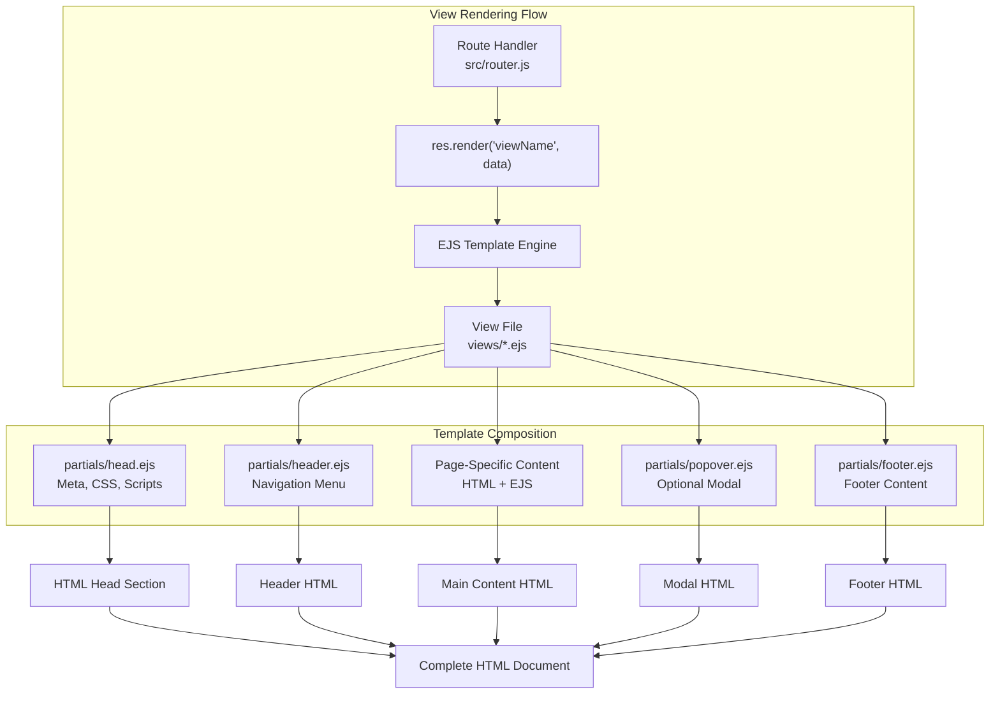
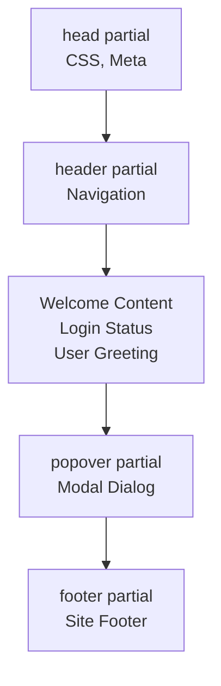
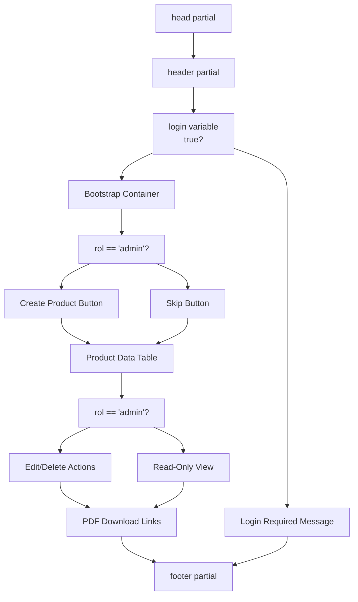
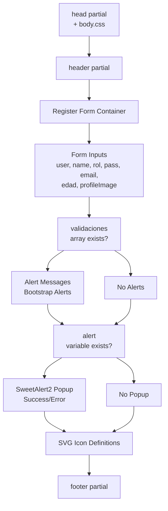
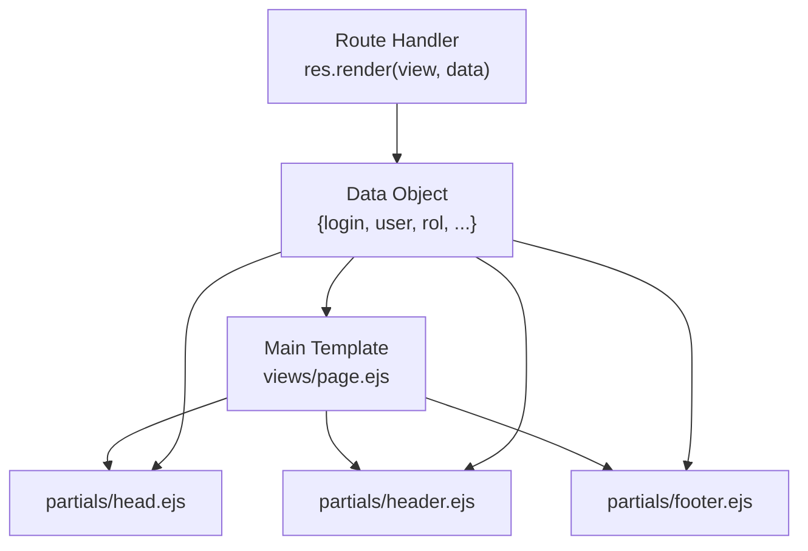
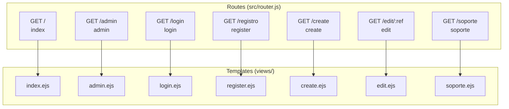

# Template Structure

> **Relevant source files**
> * [proyecto.zip](https://github.com/moichuelo/registro/blob/544abbcc/proyecto.zip)
> * [public/css/style.css](https://github.com/moichuelo/registro/blob/544abbcc/public/css/style.css)
> * [views/admin.ejs](https://github.com/moichuelo/registro/blob/544abbcc/views/admin.ejs)
> * [views/index.ejs](https://github.com/moichuelo/registro/blob/544abbcc/views/index.ejs)
> * [views/register.ejs](https://github.com/moichuelo/registro/blob/544abbcc/views/register.ejs)

## Purpose and Scope

This document describes the EJS template architecture used in the registro-sesiones system, focusing on how templates are organized, structured, and composed. It covers the master template pattern, partial components, and how individual page views are constructed from reusable pieces.

For information about individual partial components (head, header, footer), see [Partial Components](/moichuelo/registro/12.2-partial-components). For documentation of specific page templates and their functionality, see [Page Views](/moichuelo/registro/12.3-page-views).

---

## Overview

The template system uses **EJS (Embedded JavaScript)** as the view engine with a component-based architecture. Templates are composed using two primary patterns:

1. **Partial Includes**: Reusable components included in multiple views
2. **Layout Composition**: Common structural elements shared across pages

The system prioritizes code reuse through partials while maintaining flexibility for page-specific layouts.

---

## Template Architecture Pattern

The application uses a **manual composition pattern** where individual page templates explicitly include partial components rather than inheriting from a base layout through middleware. This provides explicit control over which components appear on each page and in what order.



**Sources:** [views/index.ejs L1-L35](https://github.com/moichuelo/registro/blob/544abbcc/views/index.ejs#L1-L35)

 [views/admin.ejs L1-L71](https://github.com/moichuelo/registro/blob/544abbcc/views/admin.ejs#L1-L71)

 [views/register.ejs L1-L85](https://github.com/moichuelo/registro/blob/544abbcc/views/register.ejs#L1-L85)

---

## Standard Template Structure

Every page template follows a consistent structure with includes at the beginning and end, wrapping page-specific content:

### Basic Template Pattern

```

```

### Template Structure Breakdown

| Component | Purpose | Required | Position |
| --- | --- | --- | --- |
| `partials/head` | HTML `<head>` element with meta tags, CSS links, scripts | Yes | First |
| `partials/header` | Site navigation, logo, language selector | Yes | After head |
| Page Content | Page-specific HTML and EJS logic | Yes | Middle |
| `partials/popover` | Optional modal/popover component | No | Before footer |
| `partials/footer` | Site footer with links and copyright | Yes | Last |

---

## Template Include Mechanism

### EJS Include Syntax

The `<%- include() %>` directive is used to insert partial templates:

```

```

The `<%-` syntax (with dash) outputs unescaped content, allowing HTML from the partial to be rendered directly. This differs from `<%= %>` which would escape HTML entities.

### Include Resolution

Partial paths are relative to the configured views directory:

* Include path: `'partials/head'`
* Resolves to: `views/partials/head.ejs`
* Configured in: [index.js](https://github.com/moichuelo/registro/blob/544abbcc/index.js)  via `app.set('views', './views')`

---

## Page-Specific Template Examples

### Homepage Template Structure

[views/index.ejs L1-L35](https://github.com/moichuelo/registro/blob/544abbcc/views/index.ejs#L1-L35)

 demonstrates a minimal page structure:



**Key Features:**

* Conditional content based on `login` variable [views/index.ejs L15-L31](https://github.com/moichuelo/registro/blob/544abbcc/views/index.ejs#L15-L31)
* Internationalization using `__()` function [views/index.ejs L14](https://github.com/moichuelo/registro/blob/544abbcc/views/index.ejs#L14-L14)
* Dynamic user name display [views/index.ejs L18](https://github.com/moichuelo/registro/blob/544abbcc/views/index.ejs#L18-L18)
* Includes popover component [views/index.ejs L34](https://github.com/moichuelo/registro/blob/544abbcc/views/index.ejs#L34-L34)

### Admin Dashboard Template Structure

[views/admin.ejs L1-L71](https://github.com/moichuelo/registro/blob/544abbcc/views/admin.ejs#L1-L71)

 shows a more complex page with tables and role-based rendering:



**Key Features:**

* Two-level conditional rendering (login status and role) [views/admin.ejs L8-L67](https://github.com/moichuelo/registro/blob/544abbcc/views/admin.ejs#L8-L67)
* Profile image display [views/admin.ejs L4-L7](https://github.com/moichuelo/registro/blob/544abbcc/views/admin.ejs#L4-L7)
* Dynamic table generation with `forEach` [views/admin.ejs L27-L52](https://github.com/moichuelo/registro/blob/544abbcc/views/admin.ejs#L27-L52)
* Role-based action buttons [views/admin.ejs L21-L23](https://github.com/moichuelo/registro/blob/544abbcc/views/admin.ejs#L21-L23)  [views/admin.ejs L41-L50](https://github.com/moichuelo/registro/blob/544abbcc/views/admin.ejs#L41-L50)

### Form Template Structure

[views/register.ejs L1-L85](https://github.com/moichuelo/registro/blob/544abbcc/views/register.ejs#L1-L85)

 demonstrates form handling with validation:



**Key Features:**

* Custom CSS override [views/register.ejs L2](https://github.com/moichuelo/registro/blob/544abbcc/views/register.ejs#L2-L2)
* File upload input for profile images [views/register.ejs L36](https://github.com/moichuelo/registro/blob/544abbcc/views/register.ejs#L36-L36)
* Value preservation on validation errors [views/register.ejs L10](https://github.com/moichuelo/registro/blob/544abbcc/views/register.ejs#L10-L10)
* Conditional validation messages [views/register.ejs L44-L56](https://github.com/moichuelo/registro/blob/544abbcc/views/register.ejs#L44-L56)
* SweetAlert2 integration [views/register.ejs L62-L74](https://github.com/moichuelo/registro/blob/544abbcc/views/register.ejs#L62-L74)

**Sources:** [views/index.ejs L1-L35](https://github.com/moichuelo/registro/blob/544abbcc/views/index.ejs#L1-L35)

 [views/admin.ejs L1-L71](https://github.com/moichuelo/registro/blob/544abbcc/views/admin.ejs#L1-L71)

 [views/register.ejs L1-L85](https://github.com/moichuelo/registro/blob/544abbcc/views/register.ejs#L1-L85)

---

## Data Flow to Templates

### Rendering Process

When a route handler renders a view, it passes a data object that becomes available as variables in the template:

```

```

### Global Variables

The following variables are commonly available across templates:

| Variable | Type | Purpose | Set By |
| --- | --- | --- | --- |
| `login` | Boolean | User authentication status | Auth middleware |
| `user` | String/Object | Username or user data | Auth middleware |
| `rol` | String | User role ("admin" or "user") | Auth middleware |
| `__` | Function | i18n translation function | i18n middleware |
| `validaciones` | Array | Form validation errors | Validation middleware |
| `alert` | Boolean | Show SweetAlert popup | Route handler |

### Variable Scope in Includes

When a partial is included, it has access to all variables in the parent template's scope. This allows partials like `header.ejs` to access `login` and `user` variables without explicit passing.



**Sources:** [views/index.ejs L15-L31](https://github.com/moichuelo/registro/blob/544abbcc/views/index.ejs#L15-L31)

 [views/admin.ejs L8-L67](https://github.com/moichuelo/registro/blob/544abbcc/views/admin.ejs#L8-L67)

 [views/register.ejs L10](https://github.com/moichuelo/registro/blob/544abbcc/views/register.ejs#L10-L10)

---

## Template Organization

### Directory Structure

```sql
views/
├── index.ejs           # Homepage
├── login.ejs           # Login form
├── register.ejs        # Registration form
├── admin.ejs           # Admin dashboard
├── create.ejs          # Product creation
├── edit.ejs            # Product editing
├── soporte.ejs         # Support chat
├── layout.ejs          # Layout reference (legacy/unused)
└── partials/
    ├── head.ejs        # HTML head section
    ├── header.ejs      # Site header/navigation
    ├── footer.ejs      # Site footer
    └── popover.ejs     # Modal component
```

### File Naming Conventions

| Pattern | Purpose | Example |
| --- | --- | --- |
| `noun.ejs` | Page representing an entity/concept | `admin.ejs`, `soporte.ejs` |
| `verb.ejs` | Page for performing an action | `create.ejs`, `edit.ejs` |
| `partials/*.ejs` | Reusable component | `partials/header.ejs` |

---

## CSS and Static Asset Inclusion

### CSS Link Pattern

The `head.ejs` partial includes CSS files that apply globally:

```

```

Individual pages can override or add CSS:

```

```

[views/register.ejs L2](https://github.com/moichuelo/registro/blob/544abbcc/views/register.ejs#L2-L2)

 demonstrates this pattern.

### Static Asset Routes

Static files are served from the `public/` directory and accessed via `/resources/` URL path:

| File Path | URL Path | Usage |
| --- | --- | --- |
| `public/css/style.css` | `/resources/css/style.css` | Main stylesheet |
| `public/css/body.css` | `/resources/css/body.css` | Body-specific styles |
| `public/resources/uploads/` | `/resources/uploads/` | User profile images |

**Sources:** [views/register.ejs L2](https://github.com/moichuelo/registro/blob/544abbcc/views/register.ejs#L2-L2)

 [views/admin.ejs L5](https://github.com/moichuelo/registro/blob/544abbcc/views/admin.ejs#L5-L5)

 [public/css/style.css L1-L353](https://github.com/moichuelo/registro/blob/544abbcc/public/css/style.css#L1-L353)

---

## Conditional Rendering Patterns

### Authentication-Based Rendering

Most templates check the `login` variable to determine what content to display:

```

```

[views/index.ejs L15-L31](https://github.com/moichuelo/registro/blob/544abbcc/views/index.ejs#L15-L31)

### Role-Based Rendering

Admin pages check both authentication and role:

```

```

[views/admin.ejs L10-L23](https://github.com/moichuelo/registro/blob/544abbcc/views/admin.ejs#L10-L23)

 [views/admin.ejs L41-L50](https://github.com/moichuelo/registro/blob/544abbcc/views/admin.ejs#L41-L50)

### Validation Error Rendering

Forms conditionally display validation errors:

```

```

[views/register.ejs L44-L56](https://github.com/moichuelo/registro/blob/544abbcc/views/register.ejs#L44-L56)

---

## Template-to-Route Mapping



Each route corresponds to a specific template file with matching functionality.

**Sources:** [src/router.js](https://github.com/moichuelo/registro/blob/544abbcc/src/router.js)

 [views/index.ejs](https://github.com/moichuelo/registro/blob/544abbcc/views/index.ejs)

 [views/admin.ejs](https://github.com/moichuelo/registro/blob/544abbcc/views/admin.ejs)

 [views/login.ejs](https://github.com/moichuelo/registro/blob/544abbcc/views/login.ejs)

 [views/register.ejs](https://github.com/moichuelo/registro/blob/544abbcc/views/register.ejs)

 [views/create.ejs](https://github.com/moichuelo/registro/blob/544abbcc/views/create.ejs)

 [views/edit.ejs](https://github.com/moichuelo/registro/blob/544abbcc/views/edit.ejs)

 [views/soporte.ejs](https://github.com/moichuelo/registro/blob/544abbcc/views/soporte.ejs)

---

## Best Practices Observed

1. **Consistent Include Order**: All templates include `head`, then `header`, then content, then `footer`
2. **Defensive Checks**: Use `typeof variable !== 'undefined'` before accessing optional variables
3. **Separation of Concerns**: Presentation logic in templates, business logic in controllers
4. **Reusable Components**: Common UI elements extracted to partials
5. **Conditional Asset Loading**: Page-specific CSS loaded after common styles
6. **Bootstrap Integration**: Heavy use of Bootstrap classes in [public/css/style.css L1-L353](https://github.com/moichuelo/registro/blob/544abbcc/public/css/style.css#L1-L353)

**Sources:** [views/index.ejs L1-L35](https://github.com/moichuelo/registro/blob/544abbcc/views/index.ejs#L1-L35)

 [views/admin.ejs L1-L71](https://github.com/moichuelo/registro/blob/544abbcc/views/admin.ejs#L1-L71)

 [views/register.ejs L1-L85](https://github.com/moichuelo/registro/blob/544abbcc/views/register.ejs#L1-L85)

 [public/css/style.css L1-L353](https://github.com/moichuelo/registro/blob/544abbcc/public/css/style.css#L1-L353)