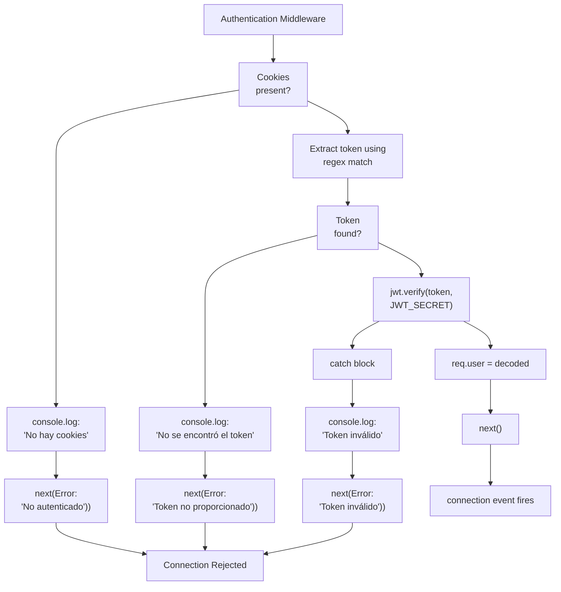

# WebSocket Authentication

> **Relevant source files**
> * [src/middlewares/verifyToken.js](https://github.com/moichuelo/registro/blob/544abbcc/src/middlewares/verifyToken.js)
> * [src/sockets/socketHandler.js](https://github.com/moichuelo/registro/blob/544abbcc/src/sockets/socketHandler.js)

## Purpose and Scope

This document explains how JWT-based authentication is applied to WebSocket connections in the real-time communication system. The authentication mechanism validates clients before establishing Socket.IO connections, ensuring only authenticated users can access the chat functionality.

For information about HTTP authentication middleware, see [verifyToken Middleware](/moichuelo/registro/6.3-verifytoken-middleware). For details on Socket.IO server initialization, see [Socket.IO Server Setup](/moichuelo/registro/7.1-socket.io-server-setup). For room assignment after successful authentication, see [Room Management](/moichuelo/registro/7.3-room-management).

---

## Authentication Flow Overview

WebSocket authentication occurs at connection time using a Socket.IO middleware function. Unlike HTTP requests where authentication happens per-request, WebSocket authentication validates the connection once during the initial handshake.

### Authentication Sequence

```mermaid
sequenceDiagram
  participant Client Browser
  participant Socket.IO Server
  participant Auth Middleware
  participant (io.use)
  participant jwt.verify()
  participant Connection Handler

  Client Browser->>Socket.IO Server: "WebSocket Connection
  Socket.IO Server->>Auth Middleware: + HTTP Headers
  Auth Middleware->>Auth Middleware: + Cookies"
  Auth Middleware->>Auth Middleware: "socket, next"
  loop [Token invalid]
    Auth Middleware-->>Socket.IO Server: "Extract socket.request"
    Socket.IO Server-->>Client Browser: "Parse cookies from
    Auth Middleware->>Auth Middleware: req.headers.cookie"
    Auth Middleware-->>Socket.IO Server: "next(Error('No autenticado'))"
    Socket.IO Server-->>Client Browser: "Connection Rejected"
    Auth Middleware->>jwt.verify(): "Extract token from cookie
    jwt.verify()-->>Auth Middleware: using regex match"
    Auth Middleware-->>Socket.IO Server: "next(Error('Token no proporcionado'))"
    Socket.IO Server-->>Client Browser: "Connection Rejected"
    jwt.verify()-->>Auth Middleware: "jwt.verify(token, JWT_SECRET)"
    Auth Middleware->>Auth Middleware: "throw error"
    Auth Middleware->>Socket.IO Server: "next(Error('Token inválido'))"
    Socket.IO Server->>Connection Handler: "Connection Rejected"
    Connection Handler->>Client Browser: "decoded payload"
  end
```

**Sources:** [src/sockets/socketHandler.js L6-L32](https://github.com/moichuelo/registro/blob/544abbcc/src/sockets/socketHandler.js#L6-L32)

---

## Socket.IO Middleware Registration

The authentication middleware is registered using `io.use()` before any connection handlers. This ensures all incoming WebSocket connections are validated before the `connection` event fires.

```javascript
// Registration in setupSocket function
io.use((socket, next) => {
    // Authentication logic
});
```

The middleware receives two parameters:

* `socket`: The Socket.IO socket instance for the incoming connection
* `next`: Callback function to either accept the connection `next()` or reject it `next(new Error(...))`

**Sources:** [src/sockets/socketHandler.js L6](https://github.com/moichuelo/registro/blob/544abbcc/src/sockets/socketHandler.js#L6-L6)

---

## Cookie Extraction Process

### Accessing the HTTP Request

Socket.IO connections begin as HTTP requests that are upgraded to WebSocket connections. The initial HTTP request, including headers and cookies, is accessible via `socket.request`:

```javascript
const req = socket.request;
const cookies = req.headers.cookie;
```

**Sources:** [src/sockets/socketHandler.js L7-L8](https://github.com/moichuelo/registro/blob/544abbcc/src/sockets/socketHandler.js#L7-L8)

### Parsing the Token Cookie

The `token` cookie is extracted using a regular expression pattern that matches `token=<value>` in the cookie header string:

```javascript
const tokenMatch = cookies.match(/token=([^;]+)/);
const token = tokenMatch && tokenMatch[1];
```

The regex pattern `/token=([^;]+)/` captures all characters after `token=` until the next semicolon, effectively isolating the JWT value from other cookies.

**Sources:** [src/sockets/socketHandler.js L16-L17](https://github.com/moichuelo/registro/blob/544abbcc/src/sockets/socketHandler.js#L16-L17)

### Cookie Format Example

| Cookie Header String | Extracted Token |
| --- | --- |
| `token=eyJhbGc...; lang=en` | `eyJhbGc...` |
| `lang=es; token=eyJhbGc...` | `eyJhbGc...` |
| `sessionId=abc; other=xyz` | `null` |

---

## Token Verification

### JWT Verification Call

Once extracted, the token is verified using the `jsonwebtoken` library with the secret key stored in environment variables:

```javascript
const decoded = jwt.verify(token, process.env.JWT_SECRET);
req.user = decoded;
```

If verification succeeds, the decoded payload is attached to `socket.request.user`, making it available to all subsequent event handlers for that socket connection.

**Sources:** [src/sockets/socketHandler.js L25-L26](https://github.com/moichuelo/registro/blob/544abbcc/src/sockets/socketHandler.js#L25-L26)

### Decoded Payload Structure

The decoded JWT payload contains the user's identity and role information:

| Field | Type | Description |
| --- | --- | --- |
| `user` | string | Username (primary identifier) |
| `name` | string | Display name |
| `rol` | string | User role (`"admin"` or `"user"`) |

This payload structure is later accessed in the connection handler at [src/sockets/socketHandler.js L37](https://github.com/moichuelo/registro/blob/544abbcc/src/sockets/socketHandler.js#L37-L37)

**Sources:** [src/sockets/socketHandler.js L25-L26](https://github.com/moichuelo/registro/blob/544abbcc/src/sockets/socketHandler.js#L25-L26)

 [src/sockets/socketHandler.js L37](https://github.com/moichuelo/registro/blob/544abbcc/src/sockets/socketHandler.js#L37-L37)

---

## Error Handling and Connection Rejection

The authentication middleware handles three distinct error scenarios:

### No Cookies Present

```javascript
if (!cookies) {
    console.log("❌ No hay cookies en la conexión de socket");
    return next(new Error("No autenticado"));
}
```

**Sources:** [src/sockets/socketHandler.js L10-L13](https://github.com/moichuelo/registro/blob/544abbcc/src/sockets/socketHandler.js#L10-L13)

### Token Not Found in Cookies

```javascript
if (!token) {
    console.log("❌ No se encontró el token en las cookies");
    return next(new Error("Token no proporcionado"));
}
```

**Sources:** [src/sockets/socketHandler.js L19-L22](https://github.com/moichuelo/registro/blob/544abbcc/src/sockets/socketHandler.js#L19-L22)

### Invalid or Expired Token

```javascript
try {
    const decoded = jwt.verify(token, process.env.JWT_SECRET);
    req.user = decoded;
    next();
} catch (err) {
    console.log("❌ Token inválido:", err.message);
    return next(new Error("Token inválido"));
}
```

**Sources:** [src/sockets/socketHandler.js L24-L31](https://github.com/moichuelo/registro/blob/544abbcc/src/sockets/socketHandler.js#L24-L31)

### Error Handling Flow



**Sources:** [src/sockets/socketHandler.js L6-L32](https://github.com/moichuelo/registro/blob/544abbcc/src/sockets/socketHandler.js#L6-L32)

---

## Comparison: HTTP vs WebSocket Authentication

Both authentication mechanisms use the same JWT token stored in cookies, but they differ in implementation and timing.

| Aspect | HTTP Authentication`verifyToken.js` | WebSocket Authentication`socketHandler.js` |
| --- | --- | --- |
| **Middleware Type** | Express middleware | Socket.IO middleware |
| **Registration** | `router.get('/path', verifyToken, handler)` | `io.use((socket, next) => {...})` |
| **Trigger Point** | Per HTTP request | Once at connection time |
| **Cookie Access** | `req.cookies.token` (parsed by `cookie-parser`) | Manual extraction from `req.headers.cookie` |
| **Token Extraction** | Direct property access | Regex pattern matching |
| **User Attachment** | `req.user = payload` | `socket.request.user = decoded` |
| **Success Callback** | `next()` | `next()` |
| **Failure Response** | `res.status(401/403).send(...)` | `next(new Error(...))` |
| **Scope** | Single request | Entire socket connection lifetime |

**Sources:** [src/middlewares/verifyToken.js L3-L15](https://github.com/moichuelo/registro/blob/544abbcc/src/middlewares/verifyToken.js#L3-L15)

 [src/sockets/socketHandler.js L6-L32](https://github.com/moichuelo/registro/blob/544abbcc/src/sockets/socketHandler.js#L6-L32)

### Why Manual Cookie Parsing?

Socket.IO connections bypass Express middleware like `cookie-parser`, so cookies must be manually extracted from the raw `cookie` header string. The HTTP authentication middleware benefits from `cookie-parser` preprocessing, which converts the cookie header into a `req.cookies` object.

---

## Integration with Connection Handler

Once authentication succeeds, the connection handler accesses the authenticated user information:

```javascript
io.on("connection", (socket) => {
    const { user, name, rol } = socket.request.user;
    console.log(`🟢 Usuario conectado: ${user} (${rol})`);
    
    socket.join(`user:${user}`);
    if (rol === "admin") socket.join("admins");
    // ... event handlers
});
```

The `socket.request.user` object contains the decoded JWT payload, enabling role-based room assignment and personalized message routing.

**Sources:** [src/sockets/socketHandler.js L36-L43](https://github.com/moichuelo/registro/blob/544abbcc/src/sockets/socketHandler.js#L36-L43)

---

## Authentication Code Map

```mermaid
flowchart TD

ConnectionEvent["io.on('connection')"]
IoUse["io.use((socket, next))"]
GetRequest["socket.request"]
GetCookies["req.headers.cookie"]
CheckCookies["cookies?"]
ErrorNoCookies["next(Error:<br>'No autenticado'))"]
ExtractToken["cookies.match(/<br>token=([^;]+)/)"]
CheckToken["token?"]
ErrorNoToken["next(Error:<br>'Token no proporcionado'))"]
JwtVerify["jwt.verify(token,<br>JWT_SECRET)"]
TryCatch["try/catch"]
ErrorInvalid["next(Error:<br>'Token inválido'))"]
AttachUser["req.user = decoded"]
NextSuccess["next()"]
Destructure["{ user, name, rol } =<br>socket.request.user"]
JoinRooms["socket.join() calls"]

subgraph subGraph2 ["setupSocket Function"]
    IoUse
    IoUse --> GetRequest
    NextSuccess --> ConnectionEvent

subgraph subGraph1 ["Connection Handler"]
    ConnectionEvent
    Destructure
    JoinRooms
    ConnectionEvent --> Destructure
    Destructure --> JoinRooms
end

subgraph subGraph0 ["Authentication Middleware"]
    GetRequest
    GetCookies
    CheckCookies
    ErrorNoCookies
    ExtractToken
    CheckToken
    ErrorNoToken
    JwtVerify
    TryCatch
    ErrorInvalid
    AttachUser
    NextSuccess
    GetRequest --> GetCookies
    GetCookies --> CheckCookies
    CheckCookies --> ErrorNoCookies
    CheckCookies --> ExtractToken
    ExtractToken --> CheckToken
    CheckToken --> ErrorNoToken
    CheckToken --> JwtVerify
    JwtVerify --> TryCatch
    TryCatch --> ErrorInvalid
    TryCatch --> AttachUser
    AttachUser --> NextSuccess
end
end
```



**Sources:** [src/sockets/socketHandler.js L4-L69](https://github.com/moichuelo/registro/blob/544abbcc/src/sockets/socketHandler.js#L4-L69)

---

## Security Considerations

### Token Validation Timing

Authentication occurs only at connection establishment. If a token expires during an active connection, the user remains connected until they disconnect and attempt to reconnect. This design choice prioritizes connection stability over immediate token expiration enforcement.

### Environment Variable Dependency

The JWT secret key (`process.env.JWT_SECRET`) must be identical for both HTTP and WebSocket authentication. Mismatched secrets will cause WebSocket authentication failures even with valid HTTP session tokens.

### No Automatic Retry

Socket.IO does not automatically retry authentication on failure. Clients must handle authentication errors and potentially redirect to login pages or display error messages.

**Sources:** [src/sockets/socketHandler.js L25](https://github.com/moichuelo/registro/blob/544abbcc/src/sockets/socketHandler.js#L25-L25)

 [src/middlewares/verifyToken.js L9](https://github.com/moichuelo/registro/blob/544abbcc/src/middlewares/verifyToken.js#L9-L9)