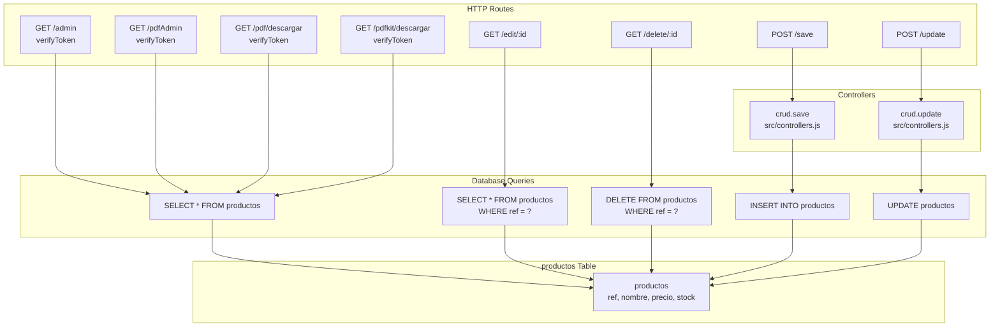
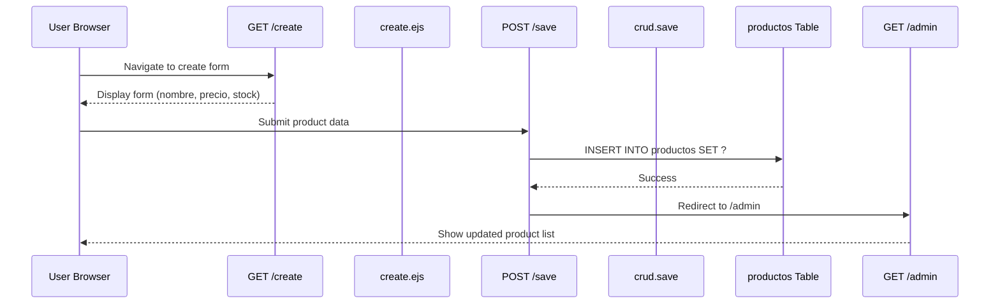

# productos Table

> **Relevant source files**
> * [proyecto.zip](https://github.com/moichuelo/registro/blob/544abbcc/proyecto.zip)
> * [src/router.js](https://github.com/moichuelo/registro/blob/544abbcc/src/router.js)

## Purpose and Scope

This page documents the `productos` table in the MySQL database, which stores product information for the inventory management system. This page covers the table schema, column definitions, database operations, and how the table integrates with the application's CRUD functionality and PDF generation features.

For information about user authentication and roles that control access to product data, see [Authentication & Authorization](/moichuelo/registro/6-authentication-and-authorization). For details on the admin interface that displays product data, see [Product Management](/moichuelo/registro/8-product-management). For information on other database tables, see [usuarios Table](/moichuelo/registro/14.1-usuarios-table) and [mensajes Table](/moichuelo/registro/14.3-mensajes-table).

---

## Table Schema

The `productos` table is the core data structure for product inventory management. It stores product references, names, pricing, and stock quantities.

```css
#mermaid-w3zvld4dov{font-family:ui-sans-serif,-apple-system,system-ui,Segoe UI,Helvetica;font-size:16px;fill:#333;}@keyframes edge-animation-frame{from{stroke-dashoffset:0;}}@keyframes dash{to{stroke-dashoffset:0;}}#mermaid-w3zvld4dov .edge-animation-slow{stroke-dasharray:9,5!important;stroke-dashoffset:900;animation:dash 50s linear infinite;stroke-linecap:round;}#mermaid-w3zvld4dov .edge-animation-fast{stroke-dasharray:9,5!important;stroke-dashoffset:900;animation:dash 20s linear infinite;stroke-linecap:round;}#mermaid-w3zvld4dov .error-icon{fill:#dddddd;}#mermaid-w3zvld4dov .error-text{fill:#222222;stroke:#222222;}#mermaid-w3zvld4dov .edge-thickness-normal{stroke-width:1px;}#mermaid-w3zvld4dov .edge-thickness-thick{stroke-width:3.5px;}#mermaid-w3zvld4dov .edge-pattern-solid{stroke-dasharray:0;}#mermaid-w3zvld4dov .edge-thickness-invisible{stroke-width:0;fill:none;}#mermaid-w3zvld4dov .edge-pattern-dashed{stroke-dasharray:3;}#mermaid-w3zvld4dov .edge-pattern-dotted{stroke-dasharray:2;}#mermaid-w3zvld4dov .marker{fill:#999;stroke:#999;}#mermaid-w3zvld4dov .marker.cross{stroke:#999;}#mermaid-w3zvld4dov svg{font-family:ui-sans-serif,-apple-system,system-ui,Segoe UI,Helvetica;font-size:16px;}#mermaid-w3zvld4dov p{margin:0;}#mermaid-w3zvld4dov .entityBox{fill:#ffffff;stroke:#dddddd;}#mermaid-w3zvld4dov .relationshipLabelBox{fill:#dddddd;opacity:0.7;background-color:#dddddd;}#mermaid-w3zvld4dov .relationshipLabelBox rect{opacity:0.5;}#mermaid-w3zvld4dov .labelBkg{background-color:rgba(221, 221, 221, 0.5);}#mermaid-w3zvld4dov .edgeLabel .label{fill:#dddddd;font-size:14px;}#mermaid-w3zvld4dov .label{font-family:ui-sans-serif,-apple-system,system-ui,Segoe UI,Helvetica;color:#333;}#mermaid-w3zvld4dov .edge-pattern-dashed{stroke-dasharray:8,8;}#mermaid-w3zvld4dov .node rect,#mermaid-w3zvld4dov .node circle,#mermaid-w3zvld4dov .node ellipse,#mermaid-w3zvld4dov .node polygon{fill:#ffffff;stroke:#dddddd;stroke-width:1px;}#mermaid-w3zvld4dov .relationshipLine{stroke:#999;stroke-width:1;fill:none;}#mermaid-w3zvld4dov .marker{fill:none!important;stroke:#999!important;stroke-width:1;}#mermaid-w3zvld4dov :root{--mermaid-font-family:"trebuchet ms",verdana,arial,sans-serif;}productosintrefPKAUTO_INCREMENT, Primary KeyvarcharnombreNOT NULL, max 30 charsdecimalprecioNOT NULL, (10,2)intstockNULL
```

**Sources:**

* [src/router.js L105-L109](https://github.com/moichuelo/registro/blob/544abbcc/src/router.js#L105-L109)

---

## Column Definitions

| Column Name | Data Type | Constraints | Description |
| --- | --- | --- | --- |
| `ref` | `int(11)` | `NOT NULL AUTO_INCREMENT PRIMARY KEY` | Unique product reference number, automatically generated |
| `nombre` | `varchar(30)` | `NOT NULL` | Product name, maximum 30 characters |
| `precio` | `decimal(10,2)` | `NOT NULL` | Product price with 2 decimal places for currency precision |
| `stock` | `int(11)` | `NULL` | Available stock quantity, nullable to allow products without inventory tracking |

### Column Details

**`ref` (Reference)**

* Primary key that uniquely identifies each product
* Auto-incremented by MySQL on insertion
* Used in URLs for product operations (e.g., `/edit/:id`, `/delete/:id`)
* Immutable once created

**`nombre` (Name)**

* Product display name shown in admin interface and PDF reports
* Limited to 30 characters to ensure consistent UI display
* Required field enforced at database level

**`precio` (Price)**

* Stored as `DECIMAL(10,2)` for exact currency representation
* Supports up to 8 digits before decimal point and 2 after
* Required field; products must have a price

**`stock` (Stock Quantity)**

* Nullable integer allowing products to exist without inventory tracking
* Can be negative (e.g., for backorders) since no constraint enforces positivity
* Displayed and editable through admin interface

**Sources:**

* [src/router.js L105-L109](https://github.com/moichuelo/registro/blob/544abbcc/src/router.js#L105-L109)

---

## Database Operations Map

The following diagram shows how different routes and controllers interact with the `productos` table:



**Sources:**

* [src/router.js L119-L134](https://github.com/moichuelo/registro/blob/544abbcc/src/router.js#L119-L134)
* [src/router.js L136-L151](https://github.com/moichuelo/registro/blob/544abbcc/src/router.js#L136-L151)
* [src/router.js L186-L196](https://github.com/moichuelo/registro/blob/544abbcc/src/router.js#L186-L196)
* [src/router.js L198-L208](https://github.com/moichuelo/registro/blob/544abbcc/src/router.js#L198-L208)
* [src/router.js L317-L353](https://github.com/moichuelo/registro/blob/544abbcc/src/router.js#L317-L353)
* [src/router.js L355-L396](https://github.com/moichuelo/registro/blob/544abbcc/src/router.js#L355-L396)
* [src/router.js L603-L604](https://github.com/moichuelo/registro/blob/544abbcc/src/router.js#L603-L604)

---

## CRUD Operations

### Create (INSERT)

**Route:** `POST /save`
**Handler:** [src/controllers.js](https://github.com/moichuelo/registro/blob/544abbcc/src/controllers.js)

 - `crud.save` function
**Authentication:** Public (no middleware specified)

The creation operation is handled by the `crud.save` controller function, invoked when submitting the create form.



**Sources:**

* [src/router.js L153-L155](https://github.com/moichuelo/registro/blob/544abbcc/src/router.js#L153-L155)
* [src/router.js L603](https://github.com/moichuelo/registro/blob/544abbcc/src/router.js#L603-L603)
* [src/controllers.js](https://github.com/moichuelo/registro/blob/544abbcc/src/controllers.js)

---

### Read (SELECT)

#### Read All Products

**Route:** `GET /admin`
**Query:** `SELECT * FROM productos`
**Authentication:** `verifyToken` middleware required

```javascript
// src/router.js:121
db.query("SELECT * FROM productos", (error, results) => {
    if (error) {
        throw error;
    } else {
        res.render("admin", {
            productos: results,
            user: req.user,
            login: true,
            rol: req.user.rol,
        });
    }
});
```

This query retrieves all products and passes them to the `admin.ejs` view for display in a table format.

**Sources:**

* [src/router.js L119-L134](https://github.com/moichuelo/registro/blob/544abbcc/src/router.js#L119-L134)

---

#### Read Single Product by ID

**Route:** `GET /edit/:id`
**Query:** `SELECT * FROM productos WHERE ref = ?`
**Authentication:** None specified (publicly accessible)

```javascript
// src/router.js:188
const ref = req.params.id;
db.query("SELECT * FROM productos WHERE ref = ?", [ref], (error, results) => {
    if (error) {
        throw error;
    } else {
        res.render("edit", { producto: results[0] });
    }
});
```

The `:id` parameter is the product's `ref` value. The query returns a single product (accessed as `results[0]`) for editing.

**Sources:**

* [src/router.js L186-L196](https://github.com/moichuelo/registro/blob/544abbcc/src/router.js#L186-L196)

---

### Update (UPDATE)

**Route:** `POST /update`
**Handler:** [src/controllers.js](https://github.com/moichuelo/registro/blob/544abbcc/src/controllers.js)

 - `crud.update` function
**Authentication:** None specified

The update operation is handled by the `crud.update` controller function, invoked when submitting the edit form.

```mermaid
sequenceDiagram
  participant User Browser
  participant GET /edit/:id
  participant edit.ejs
  participant POST /update
  participant crud.update
  participant productos Table
  participant GET /admin

  User Browser->>GET /edit/:id: Navigate with product ref
  GET /edit/:id->>productos Table: SELECT WHERE ref = ?
  productos Table-->>GET /edit/:id: Return product data
  GET /edit/:id-->>User Browser: Display pre-filled form
  User Browser->>POST /update: Submit updated data
  POST /update->>productos Table: UPDATE productos
  productos Table-->>POST /update: SET ... WHERE ref = ?
  POST /update->>GET /admin: Success
  GET /admin-->>User Browser: Redirect to /admin
```

**Sources:**

* [src/router.js L186-L196](https://github.com/moichuelo/registro/blob/544abbcc/src/router.js#L186-L196)
* [src/router.js L604](https://github.com/moichuelo/registro/blob/544abbcc/src/router.js#L604-L604)
* [src/controllers.js](https://github.com/moichuelo/registro/blob/544abbcc/src/controllers.js)

---

### Delete (DELETE)

**Route:** `GET /delete/:id`
**Query:** `DELETE FROM productos WHERE ref = ?`
**Authentication:** None specified (publicly accessible)

```javascript
// src/router.js:200
const ref = req.params.id;
db.query("DELETE FROM productos WHERE ref = ?", [ref], (error, results) => {
    if (error) {
        throw error;
    } else {
        res.redirect("/admin");
    }
});
```

This route performs a hard delete, permanently removing the product from the database. After successful deletion, the user is redirected to the admin page.

**Sources:**

* [src/router.js L198-L208](https://github.com/moichuelo/registro/blob/544abbcc/src/router.js#L198-L208)

---

## PDF Generation Usage

The `productos` table is queried for PDF report generation through two different approaches:

### Puppeteer-based PDF

**Route:** `GET /pdf/descargar`
**Authentication:** `verifyToken` middleware required

```javascript
// src/router.js:318-326
db.query("SELECT * FROM productos", async (error, results) => {
    if (error) {
        return res.status(500).send("Error al obtener productos");
    }
    
    const html = await ejs.renderFile(
        path.join(__dirname, "../views/pdfTabla.ejs"), 
        { productos: results }
    );
    // ... Puppeteer renders HTML to PDF
});
```

This approach:

1. Fetches all products from the database
2. Renders the `pdfTabla.ejs` template with product data
3. Uses Puppeteer to convert the HTML to PDF format
4. Sends the PDF as a downloadable file named "productos.pdf"

**Sources:**

* [src/router.js L317-L353](https://github.com/moichuelo/registro/blob/544abbcc/src/router.js#L317-L353)

---

### PDFKit-based PDF

**Route:** `GET /pdfkit/descargar`
**Authentication:** `verifyToken` middleware required

```javascript
// src/router.js:356-395
db.query("SELECT * FROM productos", (error, results) => {
    if (error) {
        return res.status(500).send("Error al obtener productos");
    }
    
    const doc = new PDFDocument({ margin: 40, size: 'A4' });
    // ... Programmatically build PDF with product data
    
    results.forEach((p) => {
        doc.text(p.ref.toString(), 50, y);
        doc.text(p.nombre, 150, y);
        doc.text(Number(p.precio).toFixed(2), 300, y);
        doc.text(p.stock.toString(), 380, y);
        y += 20;
    });
});
```

This approach:

1. Fetches all products from the database
2. Programmatically generates a PDF using PDFKit library
3. Formats product data (ref, nombre, precio, stock) in a table layout
4. Sends the PDF as "productos_desde_cero.pdf"

**Sources:**

* [src/router.js L355-L396](https://github.com/moichuelo/registro/blob/544abbcc/src/router.js#L355-L396)

---

## Data Flow Architecture

```

```

**Sources:**

* [src/router.js L119-L134](https://github.com/moichuelo/registro/blob/544abbcc/src/router.js#L119-L134)
* [src/router.js L153-L155](https://github.com/moichuelo/registro/blob/544abbcc/src/router.js#L153-L155)
* [src/router.js L186-L196](https://github.com/moichuelo/registro/blob/544abbcc/src/router.js#L186-L196)
* [src/router.js L198-L208](https://github.com/moichuelo/registro/blob/544abbcc/src/router.js#L198-L208)
* [src/router.js L317-L353](https://github.com/moichuelo/registro/blob/544abbcc/src/router.js#L317-L353)
* [src/router.js L355-L396](https://github.com/moichuelo/registro/blob/544abbcc/src/router.js#L355-L396)
* [src/router.js L603-L604](https://github.com/moichuelo/registro/blob/544abbcc/src/router.js#L603-L604)

---

## Security Considerations

### Authentication Requirements

| Route | Middleware | Access Level |
| --- | --- | --- |
| `GET /admin` | `verifyToken` | Authenticated users only |
| `GET /pdfAdmin` | `verifyToken` | Authenticated users only |
| `GET /create` | None | Public |
| `GET /edit/:id` | None | Public |
| `GET /delete/:id` | None | Public |
| `POST /save` | None | Public |
| `POST /update` | None | Public |
| `GET /pdf/descargar` | `verifyToken` | Authenticated users only |
| `GET /pdfkit/descargar` | `verifyToken` | Authenticated users only |

**Security Note:** Several product management routes lack authentication middleware, making them publicly accessible. This represents a potential security vulnerability where unauthenticated users can:

* View the create product form
* View the edit form for any product
* Create new products
* Update existing products
* Delete products

In a production environment, routes for product creation, editing, and deletion should be protected with `verifyToken` and `verifyAdmin` middleware to restrict access to authenticated administrators only.

**Sources:**

* [src/router.js L119-L134](https://github.com/moichuelo/registro/blob/544abbcc/src/router.js#L119-L134)
* [src/router.js L153-L155](https://github.com/moichuelo/registro/blob/544abbcc/src/router.js#L153-L155)
* [src/router.js L186-L196](https://github.com/moichuelo/registro/blob/544abbcc/src/router.js#L186-L196)
* [src/router.js L198-L208](https://github.com/moichuelo/registro/blob/544abbcc/src/router.js#L198-L208)
* [src/router.js L603-L604](https://github.com/moichuelo/registro/blob/544abbcc/src/router.js#L603-L604)

---

## SQL Query Reference

### Complete Query List

| Query Type | SQL Statement | Location |
| --- | --- | --- |
| Select All | `SELECT * FROM productos` | [src/router.js L121](https://github.com/moichuelo/registro/blob/544abbcc/src/router.js#L121-L121) |
| Select All (PDF) | `SELECT * FROM productos` | [src/router.js L138](https://github.com/moichuelo/registro/blob/544abbcc/src/router.js#L138-L138) |
| Select All (PDF Download) | `SELECT * FROM productos` | [src/router.js L318](https://github.com/moichuelo/registro/blob/544abbcc/src/router.js#L318-L318) |
| Select All (PDFKit) | `SELECT * FROM productos` | [src/router.js L356](https://github.com/moichuelo/registro/blob/544abbcc/src/router.js#L356-L356) |
| Select By ID | `SELECT * FROM productos WHERE ref = ?` | [src/router.js L188](https://github.com/moichuelo/registro/blob/544abbcc/src/router.js#L188-L188) |
| Delete By ID | `DELETE FROM productos WHERE ref = ?` | [src/router.js L200](https://github.com/moichuelo/registro/blob/544abbcc/src/router.js#L200-L200) |
| Insert | Handled by `crud.save` controller | [src/controllers.js](https://github.com/moichuelo/registro/blob/544abbcc/src/controllers.js) |
| Update | Handled by `crud.update` controller | [src/controllers.js](https://github.com/moichuelo/registro/blob/544abbcc/src/controllers.js) |

**Sources:**

* [src/router.js L121](https://github.com/moichuelo/registro/blob/544abbcc/src/router.js#L121-L121)
* [src/router.js L138](https://github.com/moichuelo/registro/blob/544abbcc/src/router.js#L138-L138)
* [src/router.js L188](https://github.com/moichuelo/registro/blob/544abbcc/src/router.js#L188-L188)
* [src/router.js L200](https://github.com/moichuelo/registro/blob/544abbcc/src/router.js#L200-L200)
* [src/router.js L318](https://github.com/moichuelo/registro/blob/544abbcc/src/router.js#L318-L318)
* [src/router.js L356](https://github.com/moichuelo/registro/blob/544abbcc/src/router.js#L356-L356)
* [src/controllers.js](https://github.com/moichuelo/registro/blob/544abbcc/src/controllers.js)

---

## Related Database Components

The `productos` table operates independently without foreign key relationships to other tables in the system. It is part of a three-table schema:

* **usuarios** - Stores user authentication and profile data (see [usuarios Table](/moichuelo/registro/14.1-usuarios-table))
* **productos** - Stores product inventory data (this page)
* **mensajes** - Stores chat messages with foreign keys to usuarios (see [mensajes Table](/moichuelo/registro/14.3-mensajes-table))

The separation of products from users reflects the application's dual purpose: user session management and product inventory management.

**Sources:**

* [src/router.js L121-L134](https://github.com/moichuelo/registro/blob/544abbcc/src/router.js#L121-L134)
* [proyecto.zip](https://github.com/moichuelo/registro/blob/544abbcc/proyecto.zip)