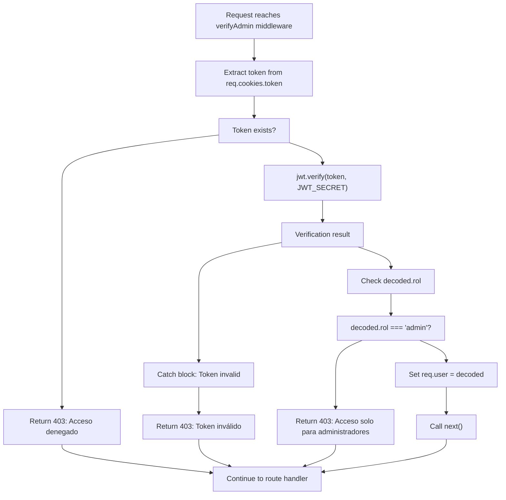
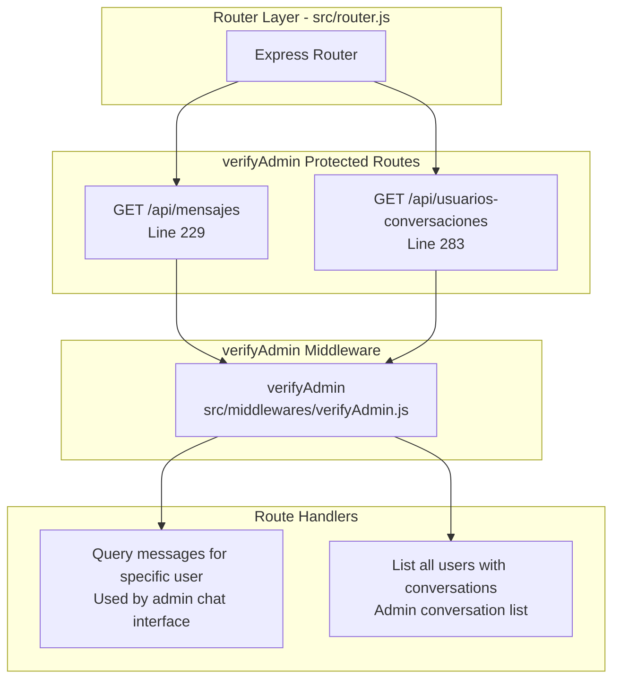
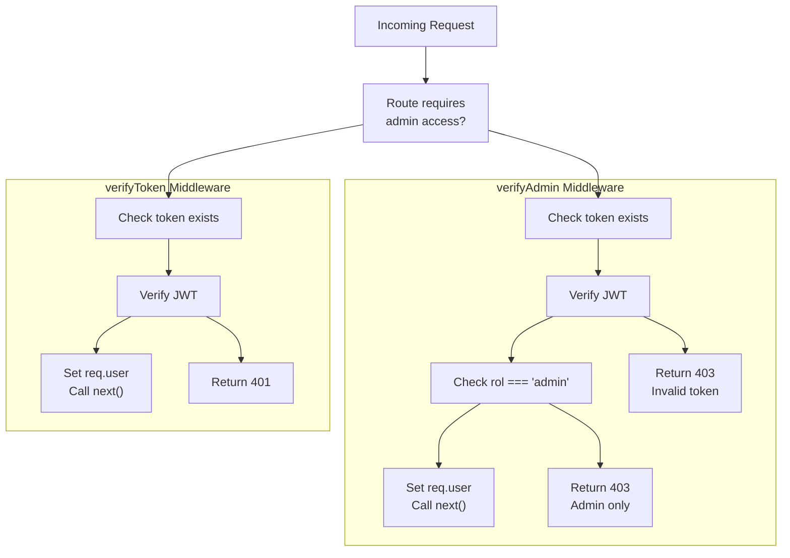
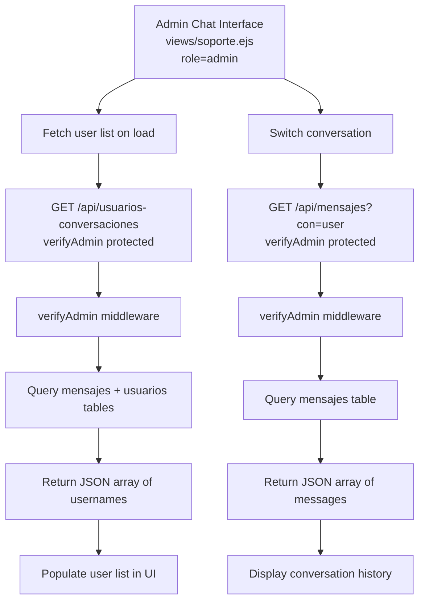

# verifyAdmin Middleware

> **Relevant source files**
> * [src/middlewares/verifyAdmin.js](https://github.com/moichuelo/registro/blob/544abbcc/src/middlewares/verifyAdmin.js)
> * [src/router.js](https://github.com/moichuelo/registro/blob/544abbcc/src/router.js)

## Purpose and Scope

The `verifyAdmin` middleware provides role-based authorization for administrative routes and API endpoints. It ensures that only authenticated users with the `admin` role can access protected resources. This middleware builds upon JWT token validation to enforce administrative access control.

For general authentication without role requirements, see [verifyToken Middleware](/moichuelo/registro/6.3-verifytoken-middleware). For the complete authentication system architecture, see [Authentication & Authorization](/moichuelo/registro/6-authentication-and-authorization).

**Sources:** [src/middlewares/verifyAdmin.js L1-L45](https://github.com/moichuelo/registro/blob/544abbcc/src/middlewares/verifyAdmin.js#L1-L45)

---

## Middleware Function Overview

The `verifyAdmin` middleware is implemented in [src/middlewares/verifyAdmin.js L24-L42](https://github.com/moichuelo/registro/blob/544abbcc/src/middlewares/verifyAdmin.js#L24-L42)

 as a single exported function. It performs two critical checks:

1. **Authentication Check**: Validates the JWT token from the request cookies
2. **Authorization Check**: Verifies that the authenticated user has the `admin` role

The middleware follows the standard Express middleware signature `(req, res, next)` and either passes control to the next handler or returns an HTTP 403 error response.

**Sources:** [src/middlewares/verifyAdmin.js L1-L45](https://github.com/moichuelo/registro/blob/544abbcc/src/middlewares/verifyAdmin.js#L1-L45)

---

## Middleware Execution Flow



**Diagram: verifyAdmin Middleware Execution Flow**

This diagram shows the complete decision tree executed by the `verifyAdmin` function, with three distinct failure paths and one success path.

**Sources:** [src/middlewares/verifyAdmin.js L24-L42](https://github.com/moichuelo/registro/blob/544abbcc/src/middlewares/verifyAdmin.js#L24-L42)

---

## Token Extraction and Verification

The middleware accesses the JWT token from the HTTP-only cookie named `token`:

```javascript
const token = req.cookies.token;
```

**Token Source**: The token is extracted from [src/middlewares/verifyAdmin.js L25](https://github.com/moichuelo/registro/blob/544abbcc/src/middlewares/verifyAdmin.js#L25-L25)

 relying on the `cookie-parser` middleware to populate `req.cookies`.

**Verification Process**: The token is verified using [src/middlewares/verifyAdmin.js L32](https://github.com/moichuelo/registro/blob/544abbcc/src/middlewares/verifyAdmin.js#L32-L32)

:

* Uses `jwt.verify()` from the `jsonwebtoken` library
* Validates against `process.env.JWT_SECRET` from environment configuration
* Decodes the payload containing user information (`user`, `name`, `rol`, `imagen`)
* Throws an exception if the token is expired, malformed, or has an invalid signature

**Sources:** [src/middlewares/verifyAdmin.js L24-L42](https://github.com/moichuelo/registro/blob/544abbcc/src/middlewares/verifyAdmin.js#L24-L42)

---

## Role-Based Authorization Check

After successful token verification, the middleware performs role validation:

| Step | Code Location | Logic | Outcome |
| --- | --- | --- | --- |
| Extract role | [src/middlewares/verifyAdmin.js L33](https://github.com/moichuelo/registro/blob/544abbcc/src/middlewares/verifyAdmin.js#L33-L33) | `decoded.rol` | String value: `"admin"` or `"user"` |
| Compare role | [src/middlewares/verifyAdmin.js L33](https://github.com/moichuelo/registro/blob/544abbcc/src/middlewares/verifyAdmin.js#L33-L33) | `decoded.rol !== "admin"` | Boolean check |
| Authorize | [src/middlewares/verifyAdmin.js L34](https://github.com/moichuelo/registro/blob/544abbcc/src/middlewares/verifyAdmin.js#L34-L34) | If true, return 403 error | Access denied |
| Grant access | [src/middlewares/verifyAdmin.js L36-L37](https://github.com/moichuelo/registro/blob/544abbcc/src/middlewares/verifyAdmin.js#L36-L37) | If false, attach user and continue | Handler executes |

The `rol` field in the decoded JWT payload must exactly match the string `"admin"`. Any other value, including `"user"`, results in authorization failure.

**Sources:** [src/middlewares/verifyAdmin.js L33-L37](https://github.com/moichuelo/registro/blob/544abbcc/src/middlewares/verifyAdmin.js#L33-L37)

---

## Application Routes Protected by verifyAdmin



**Diagram: Routes Protected by verifyAdmin Middleware**

### Protected Endpoints

**1. GET /api/mensajes** [src/router.js L229](https://github.com/moichuelo/registro/blob/544abbcc/src/router.js#L229-L229)

* **Purpose**: Retrieve message history for a specific user conversation
* **Query Parameter**: `?con=username` - specifies which user's conversation to retrieve
* **Usage**: Called by the admin chat interface to load conversation history when switching between users
* **Middleware Chain**: `verifyAdmin` → handler

**2. GET /api/usuarios-conversaciones** [src/router.js L283](https://github.com/moichuelo/registro/blob/544abbcc/src/router.js#L283-L283)

* **Purpose**: List all non-admin users who have active conversations with administrators
* **Returns**: JSON array of usernames
* **Usage**: Populates the user list in the admin chat interface
* **Middleware Chain**: `verifyAdmin` → handler

Both endpoints are essential for the administrative support chat functionality documented in [Admin Chat Interface](/moichuelo/registro/9.2-admin-chat-interface).

**Sources:** [src/router.js L17](https://github.com/moichuelo/registro/blob/544abbcc/src/router.js#L17-L17)

 [src/router.js L229-L253](https://github.com/moichuelo/registro/blob/544abbcc/src/router.js#L229-L253)

 [src/router.js L283-L315](https://github.com/moichuelo/registro/blob/544abbcc/src/router.js#L283-L315)

---

## Error Response Specifications

The middleware returns HTTP 403 (Forbidden) responses with JSON error messages in three scenarios:

### Error Response Matrix

| Condition | HTTP Status | Response Body | Code Location |
| --- | --- | --- | --- |
| No token in cookies | 403 | `{ error: "Acceso denegado" }` | [src/middlewares/verifyAdmin.js L28](https://github.com/moichuelo/registro/blob/544abbcc/src/middlewares/verifyAdmin.js#L28-L28) |
| Invalid/expired token | 403 | `{ error: "Token inválido" }` | [src/middlewares/verifyAdmin.js L40](https://github.com/moichuelo/registro/blob/544abbcc/src/middlewares/verifyAdmin.js#L40-L40) |
| Valid token, non-admin role | 403 | `{ error: "Acceso solo para administradores" }` | [src/middlewares/verifyAdmin.js L34](https://github.com/moichuelo/registro/blob/544abbcc/src/middlewares/verifyAdmin.js#L34-L34) |

**Console Logging**: When token verification fails due to an exception, the error message is logged to the console via [src/middlewares/verifyAdmin.js L39](https://github.com/moichuelo/registro/blob/544abbcc/src/middlewares/verifyAdmin.js#L39-L39)

 before the response is sent.

**HTTP Status Rationale**: All error conditions return 403 (Forbidden) rather than 401 (Unauthorized) because:

* Missing tokens indicate denied access to a protected resource
* Invalid tokens suggest authentication cannot be verified
* Non-admin roles represent insufficient permissions for the resource

**Sources:** [src/middlewares/verifyAdmin.js L28-L41](https://github.com/moichuelo/registro/blob/544abbcc/src/middlewares/verifyAdmin.js#L28-L41)

---

## Middleware Registration and Import

The middleware is imported into the router module:

```javascript
const verifyAdmin = require("./middlewares/verifyAdmin");
```

**Import Location**: [src/router.js L17](https://github.com/moichuelo/registro/blob/544abbcc/src/router.js#L17-L17)

**Module Export**: The middleware function is exported as the default module export at [src/middlewares/verifyAdmin.js L44](https://github.com/moichuelo/registro/blob/544abbcc/src/middlewares/verifyAdmin.js#L44-L44)

**Usage Pattern**: Applied directly to route definitions as a middleware parameter:

```javascript
router.get("/api/mensajes", verifyAdmin, (req, res) => { ... });
```

**Sources:** [src/router.js L17](https://github.com/moichuelo/registro/blob/544abbcc/src/router.js#L17-L17)

 [src/middlewares/verifyAdmin.js L44](https://github.com/moichuelo/registro/blob/544abbcc/src/middlewares/verifyAdmin.js#L44-L44)

---

## Comparison with verifyToken Middleware



**Diagram: Comparison of verifyToken and verifyAdmin Middleware**

### Key Differences

| Aspect | verifyToken | verifyAdmin |
| --- | --- | --- |
| **Purpose** | Authenticate any logged-in user | Authenticate and authorize admin users |
| **Role Check** | None | Required: `decoded.rol === "admin"` |
| **Error Status** | 401 Unauthorized | 403 Forbidden |
| **Usage Count** | Multiple routes ([/admin](/moichuelo/registro/5.2-protected-routes), [/soporte](/moichuelo/registro/9-support-chat-system)) | Two API endpoints only |
| **File Location** | `src/middlewares/verifyToken.js` | `src/middlewares/verifyAdmin.js` |
| **Standalone Use** | Yes | Yes (includes token verification) |

### Middleware Composition

`verifyAdmin` **does not** depend on `verifyToken`. It implements its own complete token verification logic. Both middlewares can be used independently:

* **verifyToken only**: Used for routes like `/admin` [src/router.js L119](https://github.com/moichuelo/registro/blob/544abbcc/src/router.js#L119-L119)  `/soporte` [src/router.js L220](https://github.com/moichuelo/registro/blob/544abbcc/src/router.js#L220-L220)  and PDF generation endpoints
* **verifyAdmin only**: Used for admin-specific API endpoints [src/router.js L229](https://github.com/moichuelo/registro/blob/544abbcc/src/router.js#L229-L229)  [src/router.js L283](https://github.com/moichuelo/registro/blob/544abbcc/src/router.js#L283-L283)

**Design Note**: The system does not chain these middlewares (e.g., `verifyToken, verifyAdmin`). The `verifyAdmin` middleware is self-contained with complete authentication and authorization logic.

**Sources:** [src/middlewares/verifyAdmin.js L1-L45](https://github.com/moichuelo/registro/blob/544abbcc/src/middlewares/verifyAdmin.js#L1-L45)

 [src/router.js L119](https://github.com/moichuelo/registro/blob/544abbcc/src/router.js#L119-L119)

 [src/router.js L220](https://github.com/moichuelo/registro/blob/544abbcc/src/router.js#L220-L220)

 [src/router.js L229](https://github.com/moichuelo/registro/blob/544abbcc/src/router.js#L229-L229)

 [src/router.js L283](https://github.com/moichuelo/registro/blob/544abbcc/src/router.js#L283-L283)

---

## Request User Object Attachment

Upon successful authorization, the middleware attaches the decoded JWT payload to the request object:

```
req.user = decoded;
```

**Code Location**: [src/middlewares/verifyAdmin.js L36](https://github.com/moichuelo/registro/blob/544abbcc/src/middlewares/verifyAdmin.js#L36-L36)

**Payload Structure**: The `req.user` object contains the following fields (set during token creation at [src/router.js L559-L564](https://github.com/moichuelo/registro/blob/544abbcc/src/router.js#L559-L564)

):

| Field | Type | Description | Example |
| --- | --- | --- | --- |
| `user` | String | Username from `usuarios.usuario` | `"admin1"` |
| `name` | String | Display name from `usuarios.nombre` | `"Administrator"` |
| `rol` | String | User role from `usuarios.rol` | `"admin"` |
| `imagen` | String | Profile image filename | `"profile123.jpg"` |

**Downstream Access**: Route handlers can access this user information via `req.user.user`, `req.user.rol`, etc., without additional database queries.

**Example Usage**: In the `/api/mensajes` endpoint [src/router.js L229-L253](https://github.com/moichuelo/registro/blob/544abbcc/src/router.js#L229-L253)

 the admin's identity is available through `req.user` if needed for logging or audit purposes.

**Sources:** [src/middlewares/verifyAdmin.js L36](https://github.com/moichuelo/registro/blob/544abbcc/src/middlewares/verifyAdmin.js#L36-L36)

 [src/router.js L559-L564](https://github.com/moichuelo/registro/blob/544abbcc/src/router.js#L559-L564)

---

## Security Considerations

### JWT Secret Protection

The middleware verifies tokens using `process.env.JWT_SECRET` [src/middlewares/verifyAdmin.js L32](https://github.com/moichuelo/registro/blob/544abbcc/src/middlewares/verifyAdmin.js#L32-L32)

 This secret must be:

* Stored securely in environment variables (never in code)
* Sufficiently long and random to prevent brute-force attacks
* Same secret used by token generation at [src/router.js L567](https://github.com/moichuelo/registro/blob/544abbcc/src/router.js#L567-L567)

### Cookie Security Attributes

The JWT token is stored in an HTTP-only cookie (set at [src/router.js L570-L574](https://github.com/moichuelo/registro/blob/544abbcc/src/router.js#L570-L574)

):

* `httpOnly: true` - Prevents client-side JavaScript access, mitigating XSS attacks
* `secure: false` - Should be set to `true` in production with HTTPS
* `maxAge: 3600000` - 1-hour expiration reduces exposure window

### Role Verification Timing

The role check occurs **after** token verification [src/middlewares/verifyAdmin.js L33](https://github.com/moichuelo/registro/blob/544abbcc/src/middlewares/verifyAdmin.js#L33-L33)

 This ensures:

1. Token signature is validated before processing payload
2. Expired tokens are rejected before role checks
3. Malicious clients cannot bypass verification by manipulating cookies

### Error Information Disclosure

The middleware provides specific error messages:

* `"Acceso denegado"` - Generic access denial
* `"Token inválido"` - Indicates verification failure
* `"Acceso solo para administradores"` - Reveals role requirement

These messages aid legitimate users but may inform attackers about the authentication scheme. For higher security, consider using a single generic error message.

**Sources:** [src/middlewares/verifyAdmin.js L24-L42](https://github.com/moichuelo/registro/blob/544abbcc/src/middlewares/verifyAdmin.js#L24-L42)

 [src/router.js L567](https://github.com/moichuelo/registro/blob/544abbcc/src/router.js#L567-L567)

 [src/router.js L570-L574](https://github.com/moichuelo/registro/blob/544abbcc/src/router.js#L570-L574)

---

## Integration with Admin Chat System

The `verifyAdmin` middleware is critical to the administrative support chat functionality:

### Admin-Only API Access



**Diagram: verifyAdmin Protection of Admin Chat APIs**

### Endpoint Purposes

1. **User List Endpoint** [src/router.js L283-L315](https://github.com/moichuelo/registro/blob/544abbcc/src/router.js#L283-L315) : * Returns all non-admin users with message history * Enables admin to see which users need support * SQL query uses role filtering to exclude other admins
2. **Conversation History Endpoint** [src/router.js L229-L253](https://github.com/moichuelo/registro/blob/544abbcc/src/router.js#L229-L253) : * Requires `?con=username` query parameter * Returns bidirectional messages between admin and specified user * Sorted chronologically by `fecha` field

### Why Admin-Only Access

These endpoints expose potentially sensitive information:

* List of all users engaging with support system
* Complete message history across all user conversations
* Patterns in support requests and response times

Regular users access their own messages via `/api/mensajes/mios` [src/router.js L256](https://github.com/moichuelo/registro/blob/544abbcc/src/router.js#L256-L256)

 which is protected by `verifyToken` instead, limiting visibility to their own conversation only.

**Sources:** [src/router.js L229-L253](https://github.com/moichuelo/registro/blob/544abbcc/src/router.js#L229-L253)

 [src/router.js L256-L280](https://github.com/moichuelo/registro/blob/544abbcc/src/router.js#L256-L280)

 [src/router.js L283-L315](https://github.com/moichuelo/registro/blob/544abbcc/src/router.js#L283-L315)

---

## Dependencies

The `verifyAdmin` middleware requires the following npm packages:

| Package | Import Statement | Usage | Version Requirement |
| --- | --- | --- | --- |
| `jsonwebtoken` | [src/middlewares/verifyAdmin.js L1](https://github.com/moichuelo/registro/blob/544abbcc/src/middlewares/verifyAdmin.js#L1-L1) | `jwt.verify()` for token validation | Compatible with JWT signing in router |
| `cookie-parser` (implicit) | Via `req.cookies` | Parses cookies from request headers | Must be registered before this middleware |

**Environment Variables**:

* `JWT_SECRET` - Required for token verification. Must match the secret used for token signing.

**Express Middleware Dependencies**:
The middleware assumes the following Express middleware are already registered (in [index.js](https://github.com/moichuelo/registro/blob/544abbcc/index.js)

):

1. `cookie-parser` - Populates `req.cookies`
2. JSON/urlencoded body parsers - Not directly used but part of request pipeline

**Sources:** [src/middlewares/verifyAdmin.js L1](https://github.com/moichuelo/registro/blob/544abbcc/src/middlewares/verifyAdmin.js#L1-L1)