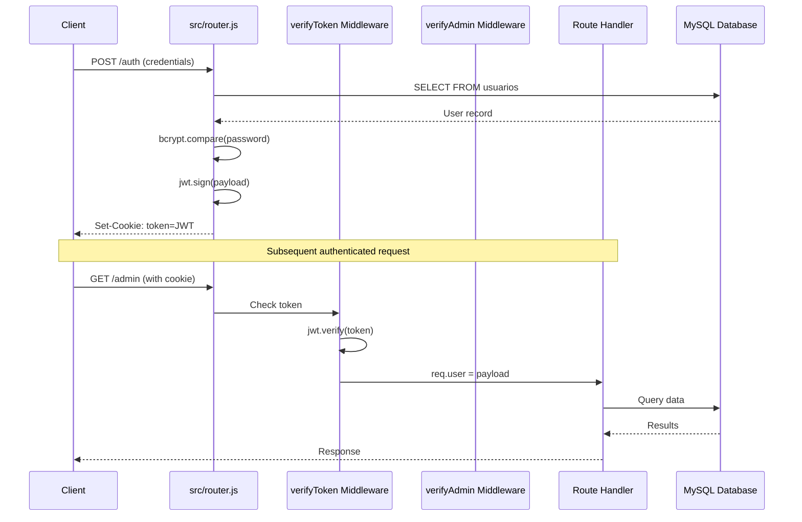
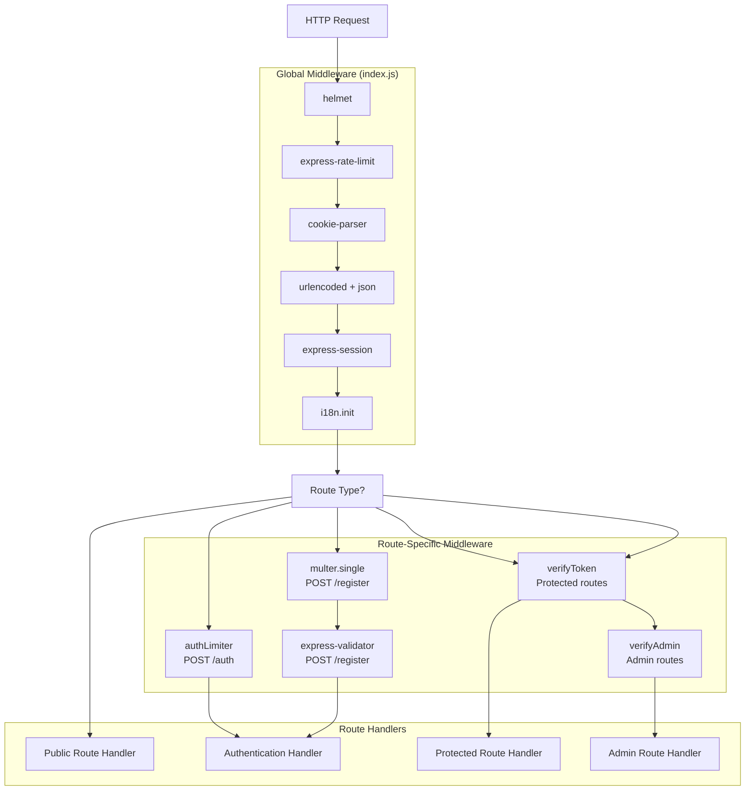
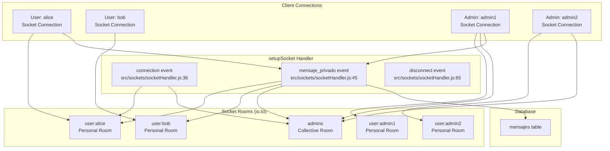

# API Reference

> **Relevant source files**
> * [src/router.js](https://github.com/moichuelo/registro/blob/544abbcc/src/router.js)
> * [src/sockets/socketHandler.js](https://github.com/moichuelo/registro/blob/544abbcc/src/sockets/socketHandler.js)

This document provides a comprehensive reference for all API endpoints and real-time communication events in the registro-sesiones system. The API consists of two primary communication channels: traditional HTTP REST endpoints for request-response operations and WebSocket events for real-time bidirectional messaging.

For detailed documentation of individual HTTP endpoints with request/response schemas, see [HTTP Endpoints](HTTP-Endpoints.md). For WebSocket event specifications, see [WebSocket Events](WebSocket-Events.md).

## Authentication

Both HTTP and WebSocket APIs use JWT (JSON Web Token) authentication. Tokens are stored in HTTP-only cookies named `token` and are validated on each request.

**Token Structure:**

* **Signing Algorithm**: HS256 (HMAC with SHA-256)
* **Secret**: `process.env.JWT_SECRET`
* **Expiration**: 1 hour (3600 seconds)
* **Storage**: HTTP-only cookie with `maxAge: 3600000` milliseconds
* **Cookie Name**: `token`

**Token Payload:**

```python
{
  user: "username",      // usuario field from database
  name: "display name",  // nombre field from database
  rol: "admin|user",     // rol field from database
  imagen: "filename.jpg" // imagen field from database
}
```

**HTTP Authentication Flow:**



**WebSocket Authentication Flow:**

```mermaid
sequenceDiagram
  participant Socket.IO Client
  participant io.use() Middleware
  participant setupSocket Handler
  participant Socket Rooms

  Socket.IO Client->>io.use() Middleware: Connect (HTTP handshake with cookie)
  io.use() Middleware->>io.use() Middleware: Extract token from cookie
  io.use() Middleware->>io.use() Middleware: jwt.verify(token, JWT_SECRET)
  loop [User is Admin]
    io.use() Middleware->>setupSocket Handler: socket.request.user = decoded
    setupSocket Handler->>Socket Rooms: socket.join("user:username")
    setupSocket Handler->>Socket Rooms: socket.join("admins")
    setupSocket Handler-->>Socket.IO Client: Connection established
    io.use() Middleware-->>Socket.IO Client: Error("Token inválido")
  end
```

Sources: [src/router.js L532-L601](https://github.com/moichuelo/registro/blob/544abbcc/src/router.js#L532-L601)

 [src/router.js L61-L63](https://github.com/moichuelo/registro/blob/544abbcc/src/router.js#L61-L63)

 [src/sockets/socketHandler.js L6-L32](https://github.com/moichuelo/registro/blob/544abbcc/src/sockets/socketHandler.js#L6-L32)

## HTTP API Overview

The HTTP API is organized into distinct functional areas. All routes are defined in [src/router.js](https://github.com/moichuelo/registro/blob/544abbcc/src/router.js)

 and use Express.js routing.

### Endpoint Categories

| Category | Routes | Authentication | Description |
| --- | --- | --- | --- |
| **Public Pages** | `GET /`, `GET /login`, `GET /registro` | None | Landing page and authentication forms |
| **Authentication** | `POST /auth`, `POST /register` | None (creates token) | User login and registration |
| **Product Management** | `GET /admin`, `GET /create`, `GET /edit/:id`, `GET /delete/:id`, `POST /save`, `POST /update` | `verifyToken` | CRUD operations for products |
| **Support Chat** | `GET /soporte` | `verifyToken` | Real-time chat interface |
| **Message APIs** | `GET /api/mensajes`, `GET /api/mensajes/mios`, `GET /api/usuarios-conversaciones` | `verifyToken` or `verifyAdmin` | Message history retrieval |
| **PDF Generation** | `GET /pdf/descargar`, `GET /pdfkit/descargar` | `verifyToken` | Product list export as PDF |
| **Localization** | `GET /set-lang/:lang` | None | Language switching |
| **Session** | `GET /logout` | None | Token removal |

### API Endpoint Structure

```mermaid
flowchart TD

Home["GET /<br>src/router.js:59-74"]
Login["GET /login<br>src/router.js:75-77"]
Register["GET /registro<br>src/router.js:78-80"]
SetLang["GET /set-lang/:lang<br>src/router.js:398-407"]
AuthPost["POST /auth<br>src/router.js:532-601<br>limiter middleware"]
RegisterPost["POST /register<br>src/router.js:414-484<br>upload.single + validators"]
Logout["GET /logout<br>src/router.js:215-218"]
Admin["GET /admin<br>src/router.js:119-134"]
Soporte["GET /soporte<br>src/router.js:220-227"]
Create["GET /create<br>src/router.js:153-155"]
Edit["GET /edit/:id<br>src/router.js:186-196"]
Delete["GET /delete/:id<br>src/router.js:198-208"]
PDFAdmin["GET /pdfAdmin<br>src/router.js:136-151"]
PDFPuppeteer["GET /pdf/descargar<br>src/router.js:317-353"]
PDFKit["GET /pdfkit/descargar<br>src/router.js:355-396"]
SavePost["POST /save<br>src/router.js:603<br>calls crud.save"]
UpdatePost["POST /update<br>src/router.js:604<br>calls crud.update"]
MensajesMios["GET /api/mensajes/mios<br>src/router.js:256-280"]
APIMensajes["GET /api/mensajes?con=user<br>src/router.js:229-253"]
APIConversaciones["GET /api/usuarios-conversaciones<br>src/router.js:283-315"]
ProductosDB["productos table"]
MensajesDB["mensajes table"]
UsuariosDB["usuarios table"]

AuthPost --> UsuariosDB
RegisterPost --> UsuariosDB
Admin --> ProductosDB
PDFAdmin --> ProductosDB
PDFPuppeteer --> ProductosDB
PDFKit --> ProductosDB
SavePost --> ProductosDB
UpdatePost --> ProductosDB
Edit --> ProductosDB
Delete --> ProductosDB
MensajesMios --> MensajesDB
APIMensajes --> MensajesDB
APIConversaciones --> MensajesDB
APIConversaciones --> UsuariosDB

subgraph subGraph4 ["Database Operations"]
    ProductosDB
    MensajesDB
    UsuariosDB
end

subgraph subGraph3 ["Admin-Only Routes (verifyAdmin)"]
    APIMensajes
    APIConversaciones
end

subgraph subGraph2 ["Protected Routes (verifyToken)"]
    Admin
    Soporte
    Create
    Edit
    Delete
    PDFAdmin
    PDFPuppeteer
    PDFKit
    SavePost
    UpdatePost
    MensajesMios
end

subgraph subGraph1 ["Authentication Routes"]
    AuthPost
    RegisterPost
    Logout
end

subgraph subGraph0 ["Public Routes (No Auth)"]
    Home
    Login
    Register
    SetLang
end
```



Sources: [src/router.js L1-L607](https://github.com/moichuelo/registro/blob/544abbcc/src/router.js#L1-L607)

### Middleware Stack by Route Type



Sources: [src/router.js L16-L21](https://github.com/moichuelo/registro/blob/544abbcc/src/router.js#L16-L21)

 [src/router.js L414-L428](https://github.com/moichuelo/registro/blob/544abbcc/src/router.js#L414-L428)

 [src/router.js L532](https://github.com/moichuelo/registro/blob/544abbcc/src/router.js#L532-L532)

 [src/router.js L119](https://github.com/moichuelo/registro/blob/544abbcc/src/router.js#L119-L119)

 [src/router.js L229](https://github.com/moichuelo/registro/blob/544abbcc/src/router.js#L229-L229)

## WebSocket API Overview

The WebSocket API provides real-time bidirectional communication for the support chat system. The implementation uses Socket.IO library and is configured in [src/sockets/socketHandler.js](https://github.com/moichuelo/registro/blob/544abbcc/src/sockets/socketHandler.js)

### WebSocket Event Types

| Event Name | Direction | Auth Required | Description |
| --- | --- | --- | --- |
| `connection` | Server → Handler | Yes (JWT via cookie) | Initial socket connection established |
| `mensaje_privado` | Client → Server | Yes | User sends a private message |
| `mensaje_recibido` | Server → Client | Yes | Server broadcasts received message to recipients |
| `disconnect` | Client → Server | Yes | Socket connection closed |

### Room-Based Routing Architecture



Sources: [src/sockets/socketHandler.js L4-L69](https://github.com/moichuelo/registro/blob/544abbcc/src/sockets/socketHandler.js#L4-L69)

### Event Flow: mensaje_privado

When a user sends a message via `socket.emit("mensaje_privado", {para, mensaje})`, the following sequence occurs:

1. **Server receives event** [src/sockets/socketHandler.js L45-L63](https://github.com/moichuelo/registro/blob/544abbcc/src/sockets/socketHandler.js#L45-L63)
2. **Extracts sender** from `socket.request.user.user` (JWT payload)
3. **Emits to recipient's room** via `io.to(`user:${para}`).emit("mensaje_recibido", ...)`
4. **Emits to admins room** if sender is not admin via `io.to("admins").emit(...)` [src/sockets/socketHandler.js L50-L52](https://github.com/moichuelo/registro/blob/544abbcc/src/sockets/socketHandler.js#L50-L52)
5. **Persists to database** via `INSERT INTO mensajes` [src/sockets/socketHandler.js L55-L62](https://github.com/moichuelo/registro/blob/544abbcc/src/sockets/socketHandler.js#L55-L62)

```mermaid
sequenceDiagram
  participant User Socket
  participant (username: bob)
  participant socketHandler.js
  participant mensaje_privado
  participant Socket.IO Rooms
  participant mensajes table
  participant Admin Socket
  participant (in 'admins' room)
  participant Recipient Socket
  participant (username: alice)

  User Socket->>socketHandler.js: emit("mensaje_privado", {para: "alice", mensaje: "Hello"})
  socketHandler.js->>socketHandler.js: Extract de = bob from JWT
  socketHandler.js->>Socket.IO Rooms: io.to("user:alice")
  Socket.IO Rooms->>Recipient Socket: emit("mensaje_recibido", {de: "bob", mensaje: "Hello"})
  socketHandler.js->>Socket.IO Rooms: io.to("admins")
  Socket.IO Rooms->>Admin Socket: emit("mensaje_recibido", {de: "bob", mensaje: "Hello"})
  socketHandler.js->>mensajes table: INSERT (bob, alice, Hello)
  mensajes table-->>socketHandler.js: Success
```

Sources: [src/sockets/socketHandler.js L45-L63](https://github.com/moichuelo/registro/blob/544abbcc/src/sockets/socketHandler.js#L45-L63)

## Response Formats

### HTTP JSON Responses

API endpoints under `/api/*` return JSON data:

**Success Response Structure:**

```json
[
  {
    "de_usuario": "username",
    "para_usuario": "recipient",
    "mensaje": "message text",
    "fecha": "2024-01-01 12:00:00"
  }
]
```

**Error Response Structure:**

```json
{
  "error": "Error description message"
}
```

Sources: [src/router.js L251](https://github.com/moichuelo/registro/blob/544abbcc/src/router.js#L251-L251)

 [src/router.js L233](https://github.com/moichuelo/registro/blob/544abbcc/src/router.js#L233-L233)

 [src/router.js L247](https://github.com/moichuelo/registro/blob/544abbcc/src/router.js#L247-L247)

### HTTP View Responses

Most GET routes render EJS templates and return HTML:

* Content-Type: `text/html`
* Variables passed via `res.render(view, data)`
* Common data includes: `user`, `login`, `rol`, `productos`, `mensajes`

Sources: [src/router.js L64-L73](https://github.com/moichuelo/registro/blob/544abbcc/src/router.js#L64-L73)

 [src/router.js L126-L132](https://github.com/moichuelo/registro/blob/544abbcc/src/router.js#L126-L132)

### PDF Responses

PDF generation endpoints return binary PDF data:

* Content-Type: `application/pdf`
* Content-Disposition: `attachment; filename="productos.pdf"`
* Response body: PDF binary buffer

Sources: [src/router.js L344-L346](https://github.com/moichuelo/registro/blob/544abbcc/src/router.js#L344-L346)

 [src/router.js L364-L365](https://github.com/moichuelo/registro/blob/544abbcc/src/router.js#L364-L365)

### WebSocket Event Payloads

**Client to Server (`mensaje_privado`):**

```yaml
{
  para: "recipient_username",
  mensaje: "message text"
}
```

**Server to Client (`mensaje_recibido`):**

```yaml
{
  de: "sender_username",
  mensaje: "message text"
}
```

Sources: [src/sockets/socketHandler.js L45](https://github.com/moichuelo/registro/blob/544abbcc/src/sockets/socketHandler.js#L45-L45)

 [src/sockets/socketHandler.js L48](https://github.com/moichuelo/registro/blob/544abbcc/src/sockets/socketHandler.js#L48-L48)

## Error Handling

### HTTP Error Responses

| Status Code | Condition | Example Endpoint |
| --- | --- | --- |
| 400 | Missing required parameters | `GET /api/mensajes` without `?con=` parameter |
| 401 | Invalid or missing JWT token | Any route with `verifyToken` middleware |
| 403 | Valid token but insufficient permissions | `GET /api/mensajes` without admin role |
| 404 | Route not found | Non-existent URL path |
| 500 | Database query error or server error | Any route if database connection fails |

Sources: [src/router.js L233](https://github.com/moichuelo/registro/blob/544abbcc/src/router.js#L233-L233)

 [src/router.js L247](https://github.com/moichuelo/registro/blob/544abbcc/src/router.js#L247-L247)

 [src/router.js L260](https://github.com/moichuelo/registro/blob/544abbcc/src/router.js#L260-L260)

 [src/router.js L274](https://github.com/moichuelo/registro/blob/544abbcc/src/router.js#L274-L274)

 [src/router.js L309](https://github.com/moichuelo/registro/blob/544abbcc/src/router.js#L309-L309)

### WebSocket Error Handling

**Connection Rejection:**

If JWT validation fails during WebSocket handshake, the connection is rejected with an error:

```yaml
Error: "No autenticado"      // No cookies present
Error: "Token no proporcionado"  // Cookie exists but no token
Error: "Token inválido"      // Token verification failed
```

**Event-Level Errors:**

Message persistence errors are logged but do not interrupt message delivery:

```
console.error("❌ Error al guardar mensaje:", err);
```

Sources: [src/sockets/socketHandler.js L12](https://github.com/moichuelo/registro/blob/544abbcc/src/sockets/socketHandler.js#L12-L12)

 [src/sockets/socketHandler.js L21](https://github.com/moichuelo/registro/blob/544abbcc/src/sockets/socketHandler.js#L21-L21)

 [src/sockets/socketHandler.js L30](https://github.com/moichuelo/registro/blob/544abbcc/src/sockets/socketHandler.js#L30-L30)

 [src/sockets/socketHandler.js L58](https://github.com/moichuelo/registro/blob/544abbcc/src/sockets/socketHandler.js#L58-L58)

## Rate Limiting

The `/auth` endpoint (POST login) implements rate limiting via the `authLimiter` middleware to prevent brute-force attacks:

* **Window**: 15 minutes
* **Max Requests**: 5 attempts per IP
* **Implementation**: `express-rate-limit` library
* **Applied at**: [src/router.js L532](https://github.com/moichuelo/registro/blob/544abbcc/src/router.js#L532-L532)

Sources: [src/router.js L21](https://github.com/moichuelo/registro/blob/544abbcc/src/router.js#L21-L21)

 [src/router.js L532](https://github.com/moichuelo/registro/blob/544abbcc/src/router.js#L532-L532)

## CORS and Security Headers

Security middleware is configured globally in [index.js](https://github.com/moichuelo/registro/blob/544abbcc/index.js)

:

* **helmet**: Sets various HTTP security headers
* **HttpOnly Cookies**: JWT token stored in HTTP-only cookies prevents XSS attacks
* **Secure Flag**: Can be enabled for HTTPS (currently set to `false` at [src/router.js L572](https://github.com/moichuelo/registro/blob/544abbcc/src/router.js#L572-L572) )

Sources: [src/router.js L570-L574](https://github.com/moichuelo/registro/blob/544abbcc/src/router.js#L570-L574)

## API Versioning

The current API has no explicit versioning. All endpoints are accessed directly without version prefixes (e.g., `/api/mensajes` not `/v1/api/mensajes`).

## Testing the API

For interactive API documentation and testing, the application includes Swagger UI (if configured). Access it at `/api-docs` when the server is running.

For detailed endpoint specifications including request parameters, response schemas, and example payloads, see:

* [HTTP Endpoints](HTTP-Endpoints.md) - Complete HTTP API reference
* [WebSocket Events](WebSocket-Events.md) - Complete WebSocket event reference