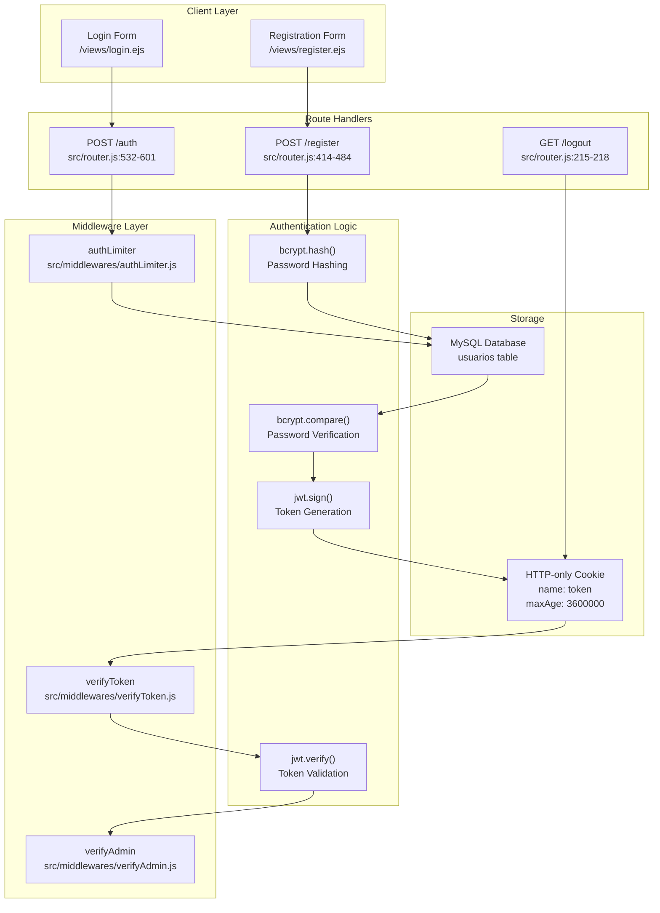
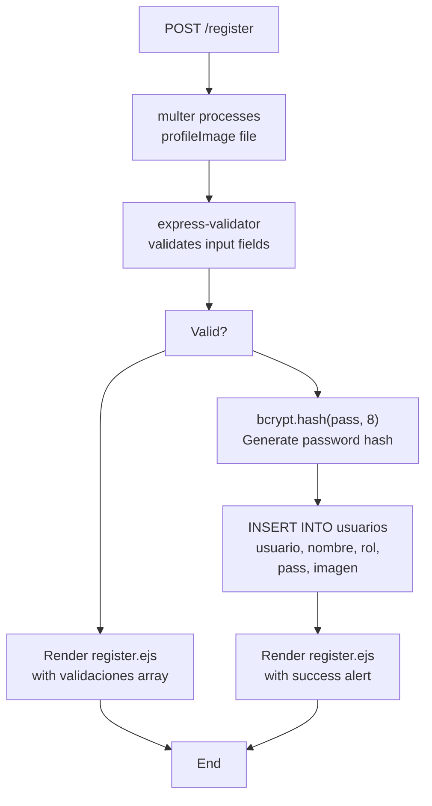
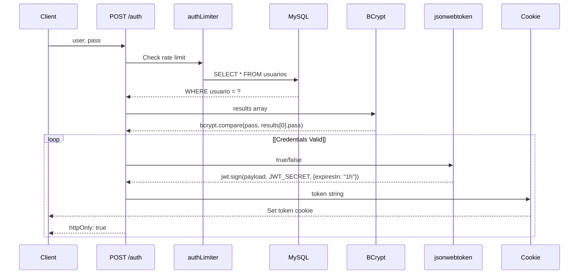
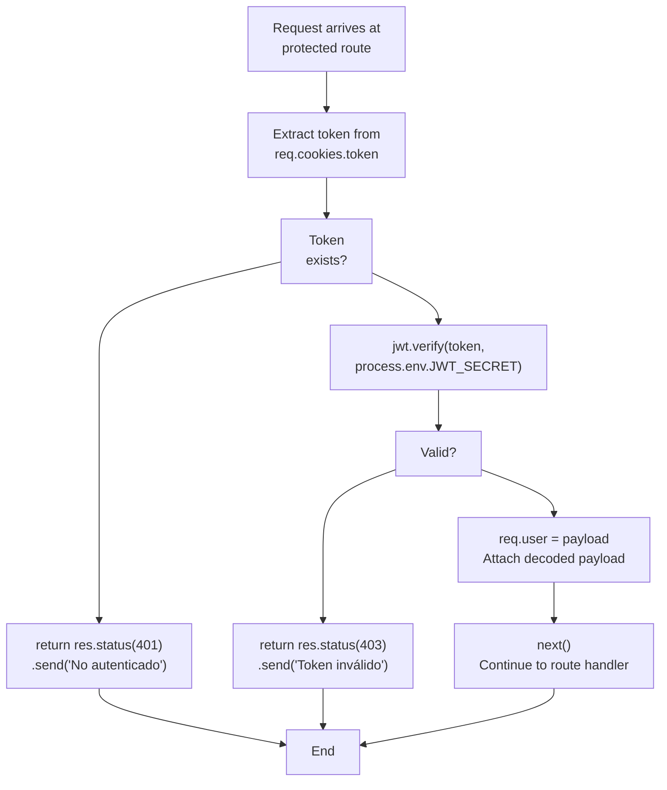
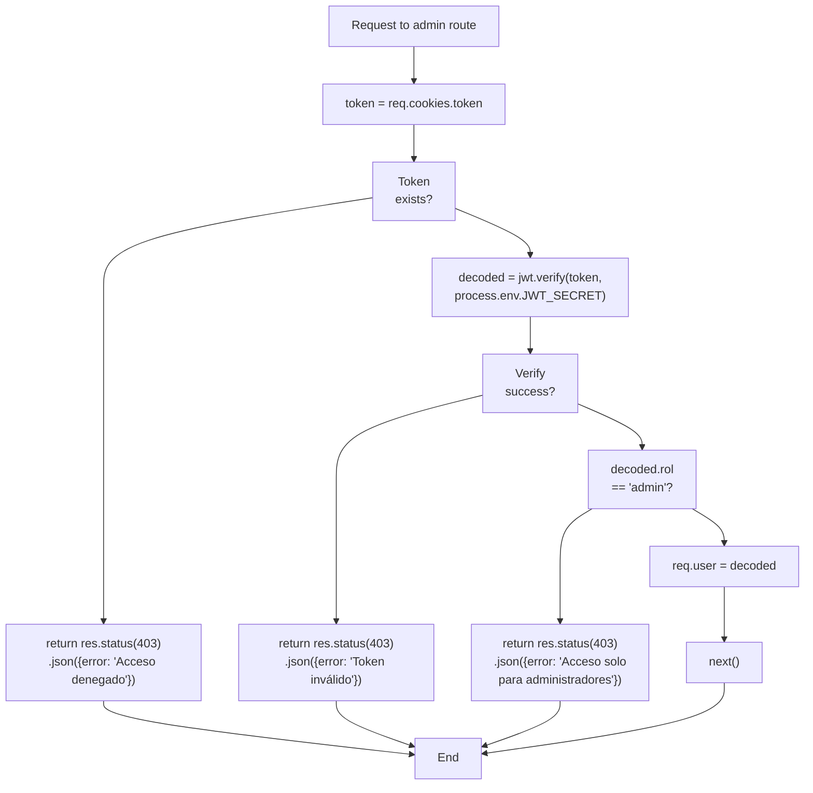
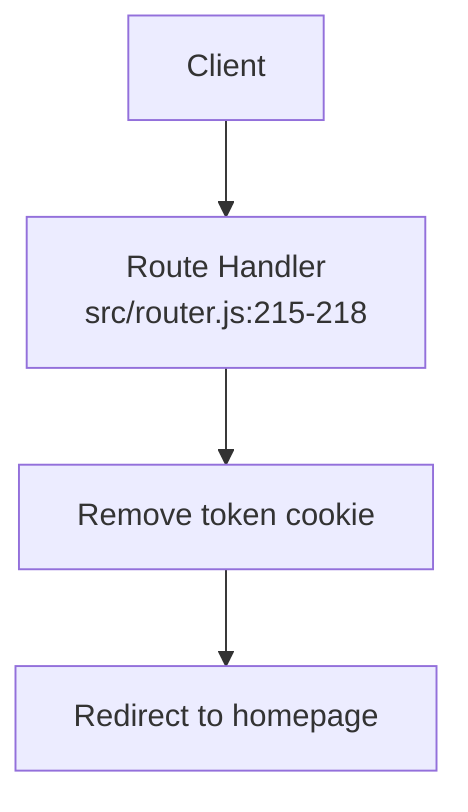
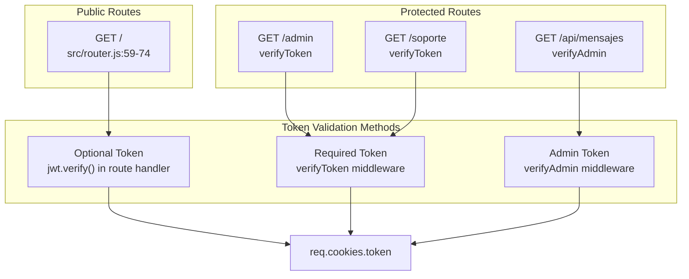
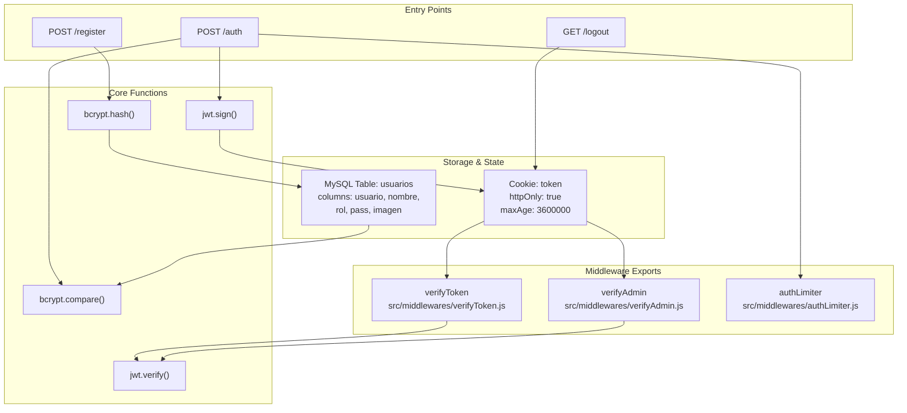

# Authentication & Authorization

> **Relevant source files**
> * [package-lock.json](https://github.com/moichuelo/registro/blob/544abbcc/package-lock.json)
> * [src/middlewares/verifyAdmin.js](https://github.com/moichuelo/registro/blob/544abbcc/src/middlewares/verifyAdmin.js)
> * [src/middlewares/verifyToken.js](https://github.com/moichuelo/registro/blob/544abbcc/src/middlewares/verifyToken.js)
> * [src/router.js](https://github.com/moichuelo/registro/blob/544abbcc/src/router.js)

## Purpose and Scope

This document describes the authentication and authorization mechanisms in the registro application. It covers user registration, login flows, JWT token management, password hashing with bcrypt, and role-based access control using middleware.

For information about the protected routes that use these mechanisms, see [Protected Routes](Protected-Routes.md). For details on WebSocket authentication, see [WebSocket Authentication](WebSocket-Authentication.md). For security measures like rate limiting and input validation, see [Security Measures](Security-Measures.md).

---

## Authentication System Overview

The application implements a stateless authentication system using JWT (JSON Web Tokens) stored in HTTP-only cookies. Passwords are hashed using bcrypt before storage, and access control is enforced through two middleware functions: `verifyToken` and `verifyAdmin`.

### Architecture Diagram



**Sources:** [src/router.js L1-L608](https://github.com/moichuelo/registro/blob/544abbcc/src/router.js#L1-L608)

 [src/middlewares/verifyToken.js L1-L18](https://github.com/moichuelo/registro/blob/544abbcc/src/middlewares/verifyToken.js#L1-L18)

 [src/middlewares/verifyAdmin.js L1-L45](https://github.com/moichuelo/registro/blob/544abbcc/src/middlewares/verifyAdmin.js#L1-L45)

 [package-lock.json L523-L530](https://github.com/moichuelo/registro/blob/544abbcc/package-lock.json#L523-L530)

---

## User Registration Flow

Registration is handled by the `POST /register` route with file upload support for profile images. The process includes validation, password hashing, and database insertion.

### Registration Request Processing



**Sources:** [src/router.js L414-L484](https://github.com/moichuelo/registro/blob/544abbcc/src/router.js#L414-L484)

### Registration Validation Rules

The registration route uses `express-validator` to enforce input constraints:

| Field | Validation Rule | Error Message |
| --- | --- | --- |
| `user` | min length: 4 | "El usuario debe tener al menos 4 caracteres" |
| `name` | min length: 4 | "El nombre debe tener al menos 4 caracteres" |
| `pass` | min length: 4 | "La contraseña debe tener al menos 4 caracteres" |
| `email` | isEmail() | "El email no es valido" |
| `edad` | isNumeric() | "La edad debe ser un número" |

**Sources:** [src/router.js L416-L428](https://github.com/moichuelo/registro/blob/544abbcc/src/router.js#L416-L428)

### Password Hashing

Passwords are hashed using bcrypt with a salt round of 8 before being stored in the database:

```javascript
const passwordHash = await bcrypt.hash(pass, 8);
```

This occurs at [src/router.js L453](https://github.com/moichuelo/registro/blob/544abbcc/src/router.js#L453-L453)

 within the registration handler.

**Sources:** [src/router.js L452-L453](https://github.com/moichuelo/registro/blob/544abbcc/src/router.js#L452-L453)

### Database Schema for usuarios

The registration process inserts records into the `usuarios` table with the following structure:

| Column | Type | Purpose |
| --- | --- | --- |
| `usuario` | VARCHAR | Unique username (primary key) |
| `nombre` | VARCHAR | Full name of the user |
| `rol` | VARCHAR | Role: "user" or "admin" |
| `pass` | VARCHAR | bcrypt hashed password |
| `imagen` | VARCHAR | Profile image filename (nullable) |

**Sources:** [src/router.js L456-L464](https://github.com/moichuelo/registro/blob/544abbcc/src/router.js#L456-L464)

---

## Login and JWT Generation

The login process validates credentials, generates a JWT token, and stores it in an HTTP-only cookie.

### Login Flow Diagram



**Sources:** [src/router.js L532-L601](https://github.com/moichuelo/registro/blob/544abbcc/src/router.js#L532-L601)

### JWT Payload Structure

When a user successfully authenticates, a JWT is created with the following payload structure:

```javascript
const payload = {
    user: results[0].usuario,    // username
    name: results[0].nombre,      // full name
    rol: results[0].rol,          // "user" or "admin"
    imagen: results[0].imagen     // profile image filename
};
```

This payload is defined at [src/router.js L559-L564](https://github.com/moichuelo/registro/blob/544abbcc/src/router.js#L559-L564)

**Sources:** [src/router.js L559-L564](https://github.com/moichuelo/registro/blob/544abbcc/src/router.js#L559-L564)

### JWT Token Creation and Cookie Storage

The JWT is signed with the `JWT_SECRET` environment variable and stored in an HTTP-only cookie:

```javascript
const token = jwt.sign(payload, process.env.JWT_SECRET, { expiresIn: "1h" });

res.cookie("token", token, {
    httpOnly: true,
    secure: false,      // set to true for HTTPS
    maxAge: 3600000     // 1 hour in milliseconds
});
```

This occurs at [src/router.js L567](https://github.com/moichuelo/registro/blob/544abbcc/src/router.js#L567-L567)

 and [src/router.js L570-L574](https://github.com/moichuelo/registro/blob/544abbcc/src/router.js#L570-L574)

**Sources:** [src/router.js L567-L574](https://github.com/moichuelo/registro/blob/544abbcc/src/router.js#L567-L574)

### Token Expiration

Both the JWT token and the HTTP cookie are configured to expire after 1 hour (3600000 milliseconds). After expiration, users must re-authenticate.

**Sources:** [src/router.js L567](https://github.com/moichuelo/registro/blob/544abbcc/src/router.js#L567-L567)

 [src/router.js L573](https://github.com/moichuelo/registro/blob/544abbcc/src/router.js#L573-L573)

---

## verifyToken Middleware

The `verifyToken` middleware authenticates users by validating the JWT token in the request cookie.

### Middleware Flow



**Sources:** [src/middlewares/verifyToken.js L1-L18](https://github.com/moichuelo/registro/blob/544abbcc/src/middlewares/verifyToken.js#L1-L18)

### Implementation Details

The `verifyToken` function is implemented at [src/middlewares/verifyToken.js L3-L15](https://github.com/moichuelo/registro/blob/544abbcc/src/middlewares/verifyToken.js#L3-L15)

:

| Line Range | Purpose |
| --- | --- |
| 4 | Extract token from `req.cookies.token` |
| 6 | Return 401 if no token present |
| 9 | Verify token using `jwt.verify()` with `JWT_SECRET` |
| 10 | Attach decoded payload to `req.user` |
| 11 | Call `next()` to continue middleware chain |
| 13 | Return 403 if verification fails |

**Sources:** [src/middlewares/verifyToken.js L3-L15](https://github.com/moichuelo/registro/blob/544abbcc/src/middlewares/verifyToken.js#L3-L15)

### Usage in Routes

The `verifyToken` middleware is applied to routes that require any authenticated user:

* `GET /admin` - [src/router.js L119](https://github.com/moichuelo/registro/blob/544abbcc/src/router.js#L119-L119)
* `GET /pdfAdmin` - [src/router.js L136](https://github.com/moichuelo/registro/blob/544abbcc/src/router.js#L136-L136)
* `GET /soporte` - [src/router.js L220](https://github.com/moichuelo/registro/blob/544abbcc/src/router.js#L220-L220)
* `GET /api/mensajes/mios` - [src/router.js L256](https://github.com/moichuelo/registro/blob/544abbcc/src/router.js#L256-L256)
* `GET /pdf/descargar` - [src/router.js L317](https://github.com/moichuelo/registro/blob/544abbcc/src/router.js#L317-L317)
* `GET /pdfkit/descargar` - [src/router.js L355](https://github.com/moichuelo/registro/blob/544abbcc/src/router.js#L355-L355)

**Sources:** [src/router.js L119](https://github.com/moichuelo/registro/blob/544abbcc/src/router.js#L119-L119)

 [src/router.js L136](https://github.com/moichuelo/registro/blob/544abbcc/src/router.js#L136-L136)

 [src/router.js L220](https://github.com/moichuelo/registro/blob/544abbcc/src/router.js#L220-L220)

 [src/router.js L256](https://github.com/moichuelo/registro/blob/544abbcc/src/router.js#L256-L256)

 [src/router.js L317](https://github.com/moichuelo/registro/blob/544abbcc/src/router.js#L317-L317)

 [src/router.js L355](https://github.com/moichuelo/registro/blob/544abbcc/src/router.js#L355-L355)

---

## verifyAdmin Middleware

The `verifyAdmin` middleware extends authentication by checking if the user has an "admin" role. It performs both token validation and role verification.

### Admin Authorization Flow



**Sources:** [src/middlewares/verifyAdmin.js L24-L42](https://github.com/moichuelo/registro/blob/544abbcc/src/middlewares/verifyAdmin.js#L24-L42)

### verifyAdmin vs verifyToken

The key difference between the two middleware functions:

| Middleware | Token Validation | Role Check | Returns |
| --- | --- | --- | --- |
| `verifyToken` | ✅ Yes | ❌ No | 401/403 on failure |
| `verifyAdmin` | ✅ Yes | ✅ Yes (must be "admin") | 403 on failure |

Both middleware functions attach the decoded JWT payload to `req.user` upon success.

**Sources:** [src/middlewares/verifyToken.js L1-L18](https://github.com/moichuelo/registro/blob/544abbcc/src/middlewares/verifyToken.js#L1-L18)

 [src/middlewares/verifyAdmin.js L1-L45](https://github.com/moichuelo/registro/blob/544abbcc/src/middlewares/verifyAdmin.js#L1-L45)

### Admin-Protected Routes

The `verifyAdmin` middleware is applied to administrative routes:

* `GET /api/mensajes` - [src/router.js L229](https://github.com/moichuelo/registro/blob/544abbcc/src/router.js#L229-L229)  - Get messages for specific user
* `GET /api/usuarios-conversaciones` - [src/router.js L283](https://github.com/moichuelo/registro/blob/544abbcc/src/router.js#L283-L283)  - List all user conversations

Note that `GET /admin` uses only `verifyToken`, not `verifyAdmin`, meaning any authenticated user can access it. This may be a design consideration.

**Sources:** [src/router.js L229](https://github.com/moichuelo/registro/blob/544abbcc/src/router.js#L229-L229)

 [src/router.js L283](https://github.com/moichuelo/registro/blob/544abbcc/src/router.js#L283-L283)

---

## Authentication Dependencies

The authentication system relies on the following npm packages:

### Core Authentication Libraries

| Package | Version | Purpose |
| --- | --- | --- |
| `bcryptjs` | ^3.0.2 | Password hashing and comparison |
| `jsonwebtoken` | ^9.0.2 | JWT token creation and verification |
| `cookie-parser` | ^1.4.7 | Parse cookies from request headers |
| `express-validator` | ^7.2.1 | Input validation for registration |
| `multer` | ^2.0.2 | File upload handling for profile images |

**Sources:** [package-lock.json L12](https://github.com/moichuelo/registro/blob/544abbcc/package-lock.json#L12-L12)

 [package-lock.json L24](https://github.com/moichuelo/registro/blob/544abbcc/package-lock.json#L24-L24)

 [package-lock.json L13](https://github.com/moichuelo/registro/blob/544abbcc/package-lock.json#L13-L13)

 [package-lock.json L21](https://github.com/moichuelo/registro/blob/544abbcc/package-lock.json#L21-L21)

 [package-lock.json L25](https://github.com/moichuelo/registro/blob/544abbcc/package-lock.json#L25-L25)

### Security-Related Dependencies

| Package | Version | Purpose |
| --- | --- | --- |
| `helmet` | ^8.1.0 | Security headers middleware |
| `express-rate-limit` | ^6.7.0 | Rate limiting for brute force protection |
| `express-session` | ^1.18.2 | Session management (compatibility) |
| `cookie-session` | ^2.1.1 | Alternative session storage |

**Sources:** [package-lock.json L22](https://github.com/moichuelo/registro/blob/544abbcc/package-lock.json#L22-L22)

 [package-lock.json L19](https://github.com/moichuelo/registro/blob/544abbcc/package-lock.json#L19-L19)

 [package-lock.json L20](https://github.com/moichuelo/registro/blob/544abbcc/package-lock.json#L20-L20)

 [package-lock.json L14](https://github.com/moichuelo/registro/blob/544abbcc/package-lock.json#L14-L14)

---

## Logout Process

Logout is handled by clearing the JWT token cookie, effectively invalidating the user's session.

### Logout Implementation



The logout route is implemented at [src/router.js L215-L218](https://github.com/moichuelo/registro/blob/544abbcc/src/router.js#L215-L218)

:

```javascript
router.get("/logout", (req, res) => {
    res.clearCookie("token");
    res.redirect('/');
});
```

This simply removes the `token` cookie from the client, forcing re-authentication on the next protected route access.

**Sources:** [src/router.js L215-L218](https://github.com/moichuelo/registro/blob/544abbcc/src/router.js#L215-L218)

---

## JWT Token Access Patterns

The application accesses and validates JWT tokens in multiple contexts throughout the codebase.

### Token Access in Routes



**Sources:** [src/router.js L59-L74](https://github.com/moichuelo/registro/blob/544abbcc/src/router.js#L59-L74)

 [src/router.js L119](https://github.com/moichuelo/registro/blob/544abbcc/src/router.js#L119-L119)

 [src/router.js L220](https://github.com/moichuelo/registro/blob/544abbcc/src/router.js#L220-L220)

 [src/router.js L229](https://github.com/moichuelo/registro/blob/544abbcc/src/router.js#L229-L229)

### Optional Token Validation on Homepage

The homepage route (`GET /`) performs optional token validation at [src/router.js L61-L73](https://github.com/moichuelo/registro/blob/544abbcc/src/router.js#L61-L73)

:

```javascript
if (req.cookies.token) {
    const payload = jwt.verify(req.cookies.token, process.env.JWT_SECRET);
    req.user = payload;
    res.render("index", {
        user: req.user?.name || "Usuario",
        login: true,
    });
} else {
    res.render("index", {
        user: "Debe iniciar sesión",
        login: false,
    });
}
```

This pattern allows the homepage to display personalized content for authenticated users without requiring authentication.

**Sources:** [src/router.js L61-L73](https://github.com/moichuelo/registro/blob/544abbcc/src/router.js#L61-L73)

---

## Request User Object Structure

After successful authentication via `verifyToken` or `verifyAdmin`, the decoded JWT payload is attached to `req.user` with the following structure:

### req.user Properties

| Property | Type | Source | Description |
| --- | --- | --- | --- |
| `user` | string | `usuarios.usuario` | Username (primary key) |
| `name` | string | `usuarios.nombre` | User's full name |
| `rol` | string | `usuarios.rol` | Role: "user" or "admin" |
| `imagen` | string | `usuarios.imagen` | Profile image filename |

This object is available in all route handlers that use `verifyToken` or `verifyAdmin` middleware, and can be accessed as `req.user`.

**Example usage in admin route** at [src/router.js L125-L131](https://github.com/moichuelo/registro/blob/544abbcc/src/router.js#L125-L131)

:

```yaml
res.render("admin", {
    productos: results,
    user: req.user,
    login: true,
    rol: req.user.rol,
});
```

**Sources:** [src/router.js L559-L564](https://github.com/moichuelo/registro/blob/544abbcc/src/router.js#L559-L564)

 [src/middlewares/verifyToken.js L10](https://github.com/moichuelo/registro/blob/544abbcc/src/middlewares/verifyToken.js#L10-L10)

 [src/middlewares/verifyAdmin.js L36](https://github.com/moichuelo/registro/blob/544abbcc/src/middlewares/verifyAdmin.js#L36-L36)

---

## Rate Limiting for Authentication

The login route uses rate limiting to prevent brute force attacks. The `authLimiter` middleware is applied at [src/router.js L532](https://github.com/moichuelo/registro/blob/544abbcc/src/router.js#L532-L532)

### Rate Limiter Configuration

The `limiter` is imported from `./middlewares/authLimiter` and applied specifically to the `POST /auth` route:

```javascript
router.post("/auth", limiter, async (req, res) => { ... });
```

This occurs at [src/router.js L532](https://github.com/moichuelo/registro/blob/544abbcc/src/router.js#L532-L532)

**Note:** The actual configuration of the rate limiter (max requests, time window) is defined in [src/middlewares/authLimiter.js](https://github.com/moichuelo/registro/blob/544abbcc/src/middlewares/authLimiter.js)

 which is imported at [src/router.js L21](https://github.com/moichuelo/registro/blob/544abbcc/src/router.js#L21-L21)

**Sources:** [src/router.js L21](https://github.com/moichuelo/registro/blob/544abbcc/src/router.js#L21-L21)

 [src/router.js L532](https://github.com/moichuelo/registro/blob/544abbcc/src/router.js#L532-L532)

---

## Security Considerations

The authentication system implements several security best practices:

### Security Measures Summary

| Measure | Implementation | Location |
| --- | --- | --- |
| Password Hashing | bcrypt with salt round 8 | [src/router.js L453](https://github.com/moichuelo/registro/blob/544abbcc/src/router.js#L453-L453) |
| HTTP-only Cookies | `httpOnly: true` flag | [src/router.js L571](https://github.com/moichuelo/registro/blob/544abbcc/src/router.js#L571-L571) |
| Token Expiration | 1 hour expiry | [src/router.js L567](https://github.com/moichuelo/registro/blob/544abbcc/src/router.js#L567-L567) <br>  [src/router.js L573](https://github.com/moichuelo/registro/blob/544abbcc/src/router.js#L573-L573) |
| Rate Limiting | Applied to login route | [src/router.js L532](https://github.com/moichuelo/registro/blob/544abbcc/src/router.js#L532-L532) |
| Input Validation | express-validator on registration | [src/router.js L415-L428](https://github.com/moichuelo/registro/blob/544abbcc/src/router.js#L415-L428) |
| Role-Based Access | verifyAdmin middleware | [src/middlewares/verifyAdmin.js L24-L42](https://github.com/moichuelo/registro/blob/544abbcc/src/middlewares/verifyAdmin.js#L24-L42) |

### HTTP-only Cookie Benefits

The `httpOnly: true` flag at [src/router.js L571](https://github.com/moichuelo/registro/blob/544abbcc/src/router.js#L571-L571)

 prevents JavaScript access to the token cookie, mitigating XSS attack vectors. The cookie is only transmitted with HTTP requests.

### Secure Flag Configuration

The `secure: false` flag at [src/router.js L572](https://github.com/moichuelo/registro/blob/544abbcc/src/router.js#L572-L572)

 should be set to `true` in production environments using HTTPS:

```yaml
res.cookie("token", token, {
    httpOnly: true,
    secure: false,  // ⚠️ Set to true for HTTPS in production
    maxAge: 3600000
});
```

**Sources:** [src/router.js L570-L574](https://github.com/moichuelo/registro/blob/544abbcc/src/router.js#L570-L574)

---

## Authentication Error Handling

The authentication system returns specific HTTP status codes and error messages for different failure scenarios.

### Error Response Table

| Status Code | Scenario | Middleware/Route | Message |
| --- | --- | --- | --- |
| 401 | No token present | `verifyToken` | "No autenticado" |
| 403 | Invalid token | `verifyToken` | "Token inválido" |
| 403 | No token present | `verifyAdmin` | `{error: "Acceso denegado"}` |
| 403 | Invalid token | `verifyAdmin` | `{error: "Token inválido"}` |
| 403 | Valid token but not admin | `verifyAdmin` | `{error: "Acceso solo para administradores"}` |

**Sources:** [src/middlewares/verifyToken.js L6](https://github.com/moichuelo/registro/blob/544abbcc/src/middlewares/verifyToken.js#L6-L6)

 [src/middlewares/verifyToken.js L13](https://github.com/moichuelo/registro/blob/544abbcc/src/middlewares/verifyToken.js#L13-L13)

 [src/middlewares/verifyAdmin.js L28](https://github.com/moichuelo/registro/blob/544abbcc/src/middlewares/verifyAdmin.js#L28-L28)

 [src/middlewares/verifyAdmin.js L40](https://github.com/moichuelo/registro/blob/544abbcc/src/middlewares/verifyAdmin.js#L40-L40)

 [src/middlewares/verifyAdmin.js L34](https://github.com/moichuelo/registro/blob/544abbcc/src/middlewares/verifyAdmin.js#L34-L34)

### Login Error Rendering

The login route handles authentication failures by re-rendering the login form with error alerts:

**Invalid credentials** at [src/router.js L545-L556](https://github.com/moichuelo/registro/blob/544abbcc/src/router.js#L545-L556)

:

```yaml
return res.render("login", {
    alert: true,
    alertTitle: "Error",
    alertMessage: "El usuario o la contraseña son incorrectos",
    alertIcon: "error",
    showConfirmButton: true,
    timer: false,
    ruta: "login",
    login: false,
});
```

**Missing credentials** at [src/router.js L590-L600](https://github.com/moichuelo/registro/blob/544abbcc/src/router.js#L590-L600)

:

```yaml
res.render("login", {
    alert: true,
    alertTitle: "Error",
    alertMessage: "Introduzca su usuario y contraseña",
    alertIcon: "error",
    showConfirmButton: true,
    timer: false,
    ruta: "login",
    login: false,
});
```

**Sources:** [src/router.js L545-L556](https://github.com/moichuelo/registro/blob/544abbcc/src/router.js#L545-L556)

 [src/router.js L590-L600](https://github.com/moichuelo/registro/blob/544abbcc/src/router.js#L590-L600)

---

## Summary: Authentication Component Map



**Sources:** [src/router.js L1-L608](https://github.com/moichuelo/registro/blob/544abbcc/src/router.js#L1-L608)

 [src/middlewares/verifyToken.js L1-L18](https://github.com/moichuelo/registro/blob/544abbcc/src/middlewares/verifyToken.js#L1-L18)

 [src/middlewares/verifyAdmin.js L1-L45](https://github.com/moichuelo/registro/blob/544abbcc/src/middlewares/verifyAdmin.js#L1-L45)