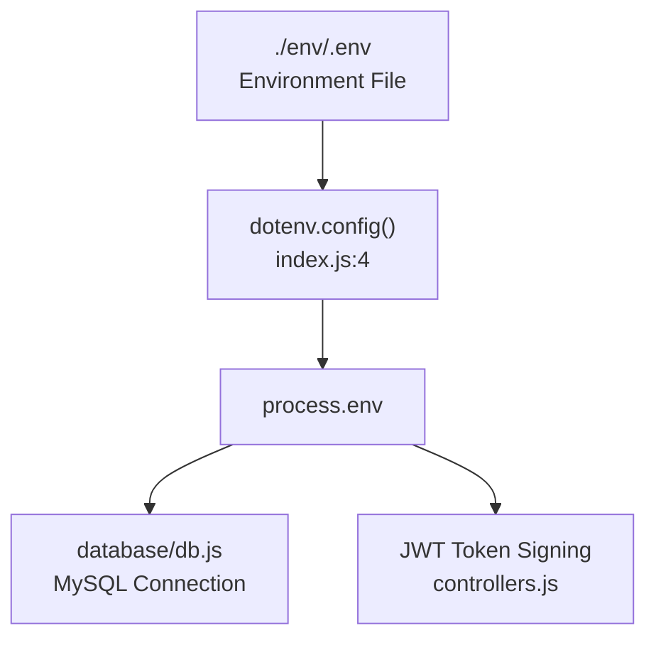
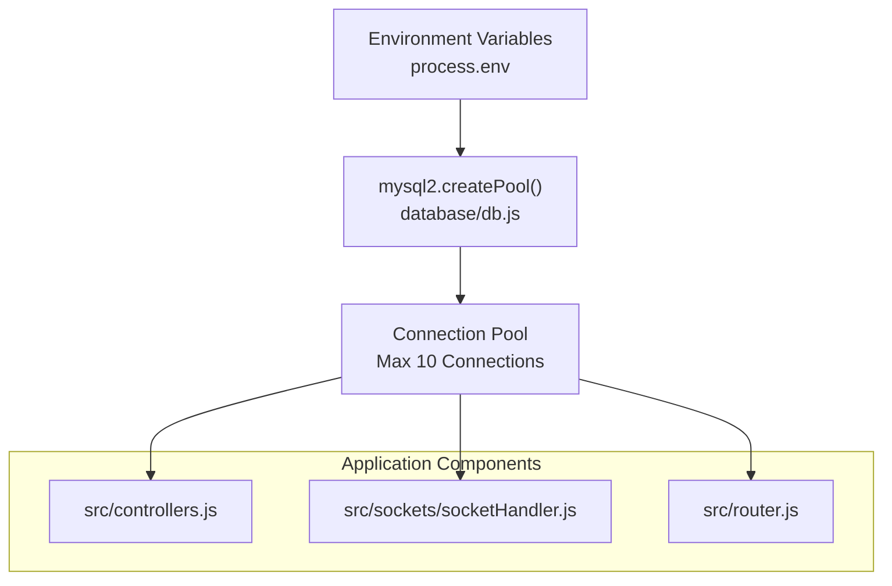
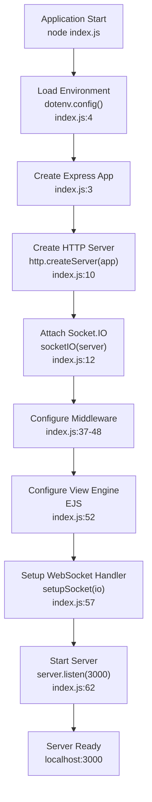
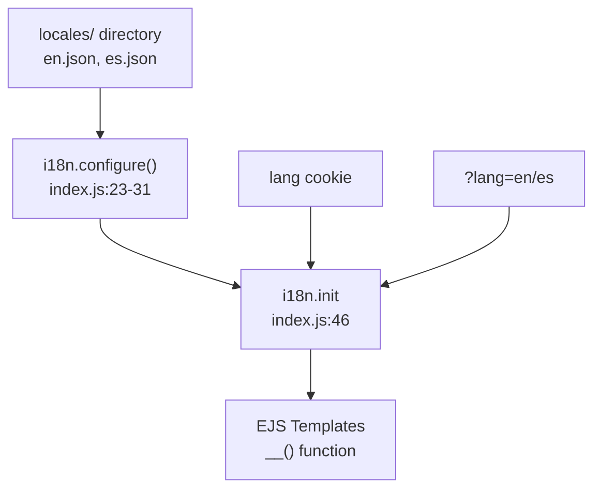
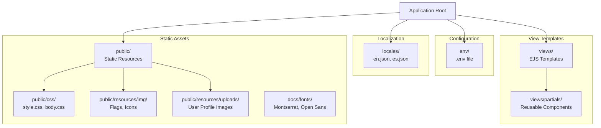
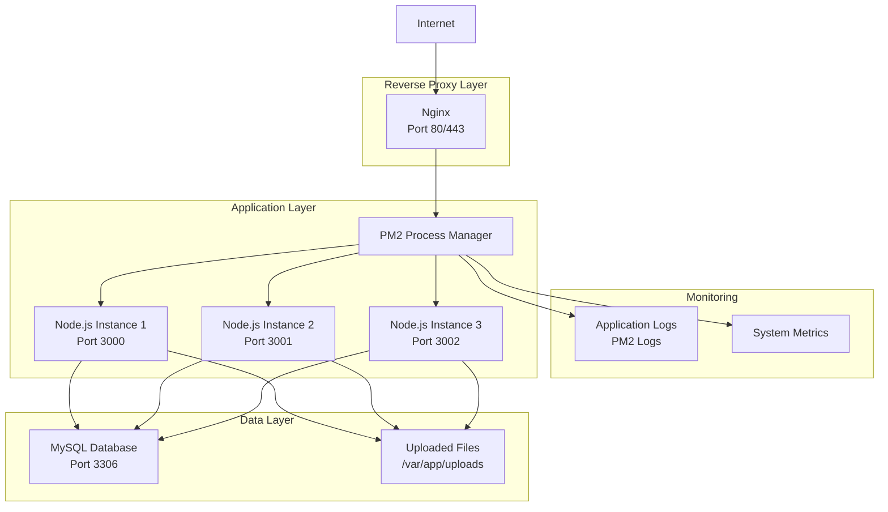
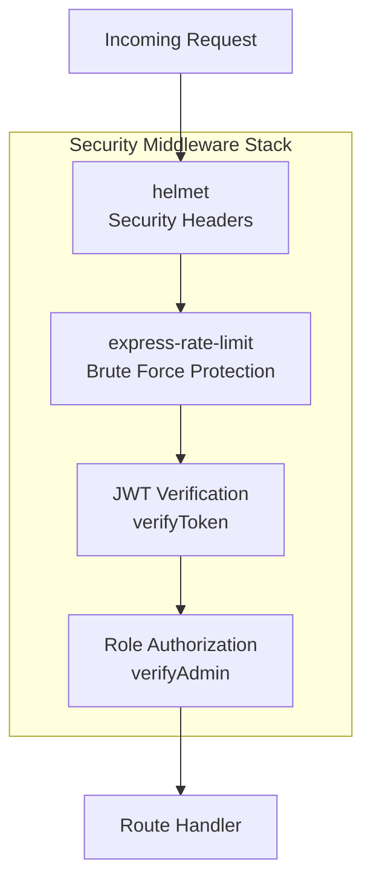

# Deployment & Configuration

> **Relevant source files**
> * [index.js](https://github.com/moichuelo/registro/blob/544abbcc/index.js)
> * [package.json](https://github.com/moichuelo/registro/blob/544abbcc/package.json)
> * [proyecto.zip](https://github.com/moichuelo/registro/blob/544abbcc/proyecto.zip)

This document provides comprehensive guidance for deploying and configuring the registro-sesiones application. It covers environment setup, database configuration, dependency installation, server initialization, and production deployment considerations. For information about the application's architecture and components, see [Architecture Overview](Architecture-Overview.md). For details about security configuration and middleware, see [Authentication & Authorization](Authentication-&-Authorization.md) and [Security Measures](Security-Measures.md).

---

## Prerequisites

Before deploying the application, ensure the following requirements are met:

| Requirement | Version/Details | Purpose |
| --- | --- | --- |
| **Node.js** | 14.x or higher | Runtime environment |
| **npm** | 6.x or higher | Package manager |
| **MySQL** | 5.7 or higher | Database server |
| **Operating System** | Linux, macOS, or Windows | Server platform |
| **Memory** | Minimum 512MB RAM | Application + Puppeteer |
| **Disk Space** | Minimum 1GB | Dependencies + uploads |

**Sources:** [package.json L1-L48](https://github.com/moichuelo/registro/blob/544abbcc/package.json#L1-L48)

 [index.js L1-L86](https://github.com/moichuelo/registro/blob/544abbcc/index.js#L1-L86)

---

## Environment Variables Configuration

The application uses `dotenv` to load environment variables from `./env/.env`. All sensitive configuration must be stored in this file and never committed to version control.

### Required Environment Variables

Create a file at `./env/.env` with the following structure:

```
DATABASE_HOST=localhost
DATABASE_USER=your_database_user
DATABASE_PASS=your_database_password
DATABASE_NAME=registro_sesiones
SECRET_KEY=your_jwt_secret_key_min_32_characters
```

### Environment Variable Reference

| Variable | Description | Example | Required |
| --- | --- | --- | --- |
| `DATABASE_HOST` | MySQL server hostname | `localhost`, `192.168.1.10` | Yes |
| `DATABASE_USER` | MySQL username | `app_user` | Yes |
| `DATABASE_PASS` | MySQL password | `secure_password` | Yes |
| `DATABASE_NAME` | Database name | `registro_sesiones` | Yes |
| `SECRET_KEY` | JWT signing secret | 32+ character string | Yes |

### Environment Loading Flow



**Sources:** [index.js L4](https://github.com/moichuelo/registro/blob/544abbcc/index.js#L4-L4)

 [env/.env L1-L5](https://github.com/moichuelo/registro/blob/544abbcc/env/.env#L1-L5)

---

## Database Setup

The application uses MySQL with the `mysql2` package and connection pooling for efficient database operations.

### Database Connection Configuration

The database connection is established through a connection pool configured in `database/db.js`:



### Database Schema Setup

Execute the following SQL to create the required database structure:

```

```

For detailed schema information, see [Database Schema](Database-Schema.md), [usuarios Table](usuarios-Table.md), [productos Table](productos-Table.md), and [mensajes Table](mensajes-Table.md).

**Sources:** [database/db.js L1-L20](https://github.com/moichuelo/registro/blob/544abbcc/database/db.js#L1-L20)

 [env/.env L1-L5](https://github.com/moichuelo/registro/blob/544abbcc/env/.env#L1-L5)

---

## Installation Steps

Follow these steps to install and configure the application:

### 1. Clone Repository and Install Dependencies

```

```

### 2. Configure Environment

```

```

### 3. Setup Database

```

```

### 4. Create Required Directories

```

```

### 5. Start the Application

```

```

**Sources:** [package.json L1-L48](https://github.com/moichuelo/registro/blob/544abbcc/package.json#L1-L48)

 [index.js L62-L65](https://github.com/moichuelo/registro/blob/544abbcc/index.js#L62-L65)

---

## Server Configuration

The application server is configured in `index.js` with multiple middleware layers and services.

### Server Initialization Sequence



### Middleware Configuration Order

The middleware stack is configured in the following order (critical for proper functionality):

| Order | Middleware | Purpose | File Reference |
| --- | --- | --- | --- |
| 1 | `cookieParser()` | Parse HTTP cookies | [index.js L37](https://github.com/moichuelo/registro/blob/544abbcc/index.js#L37-L37) |
| 2 | `express.urlencoded()` | Parse form data | [index.js L41](https://github.com/moichuelo/registro/blob/544abbcc/index.js#L41-L41) |
| 3 | `express.json()` | Parse JSON bodies | [index.js L42](https://github.com/moichuelo/registro/blob/544abbcc/index.js#L42-L42) |
| 4 | `express.static()` | Serve static files | [index.js L43](https://github.com/moichuelo/registro/blob/544abbcc/index.js#L43-L43) |
| 5 | Swagger UI | API documentation | [index.js L44](https://github.com/moichuelo/registro/blob/544abbcc/index.js#L44-L44) |
| 6 | `securityMiddleware` | Security headers, rate limiting | [index.js L45](https://github.com/moichuelo/registro/blob/544abbcc/index.js#L45-L45) |
| 7 | `i18n.init` | Internationalization | [index.js L46](https://github.com/moichuelo/registro/blob/544abbcc/index.js#L46-L46) |
| 8 | `setGlobals` | Global template variables | [index.js L47](https://github.com/moichuelo/registro/blob/544abbcc/index.js#L47-L47) |
| 9 | Application router | Route handlers | [index.js L48](https://github.com/moichuelo/registro/blob/544abbcc/index.js#L48-L48) |

### Port Configuration

The server listens on port `3000` by default. To change the port:

```

```

### Internationalization Configuration

The i18n system is configured to support English and Spanish:



**Configuration parameters:**

* **Locales:** `['en', 'es']`
* **Directory:** `./locales`
* **Default Locale:** `'es'`
* **Cookie Name:** `'lang'`
* **Query Parameter:** `'lang'`
* **Auto Reload:** `true`
* **Sync Files:** `true`

**Sources:** [index.js L1-L66](https://github.com/moichuelo/registro/blob/544abbcc/index.js#L1-L66)

 [src/middlewares/security.js](https://github.com/moichuelo/registro/blob/544abbcc/src/middlewares/security.js)

 [src/middlewares/setGlobals.js](https://github.com/moichuelo/registro/blob/544abbcc/src/middlewares/setGlobals.js)

---

## Static Assets and File Structure

The application serves static assets and handles file uploads with specific directory requirements.

### File System Structure for Deployment



### Static Asset Serving

Static files are served under the `/resources` route:

```

```

**URL Mapping:**

* `http://localhost:3000/resources/css/style.css` → `public/css/style.css`
* `http://localhost:3000/resources/img/flag_en.png` → `public/resources/img/flag_en.png`
* `http://localhost:3000/resources/uploads/user123.jpg` → `public/resources/uploads/user123.jpg`

### File Upload Configuration

User profile images are uploaded to `public/resources/uploads/` via the `multer` middleware. Ensure this directory exists and has write permissions:

```

```

**Sources:** [index.js L43](https://github.com/moichuelo/registro/blob/544abbcc/index.js#L43-L43)

 [public/css/style.css L1-L79](https://github.com/moichuelo/registro/blob/544abbcc/public/css/style.css#L1-L79)

 [views/partials/header.ejs L1-L33](https://github.com/moichuelo/registro/blob/544abbcc/views/partials/header.ejs#L1-L33)

---

## Production Deployment

Production deployment requires additional configuration for security, performance, and reliability.

### Production Environment Variables

Add production-specific variables to `env/.env`:

```
NODE_ENV=production
DATABASE_HOST=production-db-host.example.com
DATABASE_USER=prod_user
DATABASE_PASS=strong_production_password
DATABASE_NAME=registro_prod
SECRET_KEY=very_long_random_production_secret_key_minimum_32_chars
PORT=3000
```

### Production Deployment Architecture



### Using PM2 Process Manager

PM2 is recommended for production deployment to manage the Node.js process:

```

```

### PM2 Cluster Mode

For better performance, run multiple instances using cluster mode:

```

```

**PM2 Configuration File (`ecosystem.config.js`):**

```

```

**Sources:** [index.js L62-L65](https://github.com/moichuelo/registro/blob/544abbcc/index.js#L62-L65)

---

## Nginx Reverse Proxy Configuration

Configure Nginx as a reverse proxy for the Node.js application:

```

```

**Enable the configuration:**

```

```

**Sources:** [index.js L10-L12](https://github.com/moichuelo/registro/blob/544abbcc/index.js#L10-L12)

 [src/sockets/socketHandler.js](https://github.com/moichuelo/registro/blob/544abbcc/src/sockets/socketHandler.js)

---

## Docker Deployment

For containerized deployment, create the following Docker configuration:

### Dockerfile

```

```

### docker-compose.yml

```

```

### Docker Deployment Commands

```

```

**Sources:** [package.json L22-L43](https://github.com/moichuelo/registro/blob/544abbcc/package.json#L22-L43)

 [index.js L1-L66](https://github.com/moichuelo/registro/blob/544abbcc/index.js#L1-L66)

---

## Security Considerations

### Production Security Checklist

| Security Measure | Implementation | Status |
| --- | --- | --- |
| **HTTPS/TLS** | Configure SSL certificate in Nginx | Required |
| **Environment Variables** | Never commit `.env` to version control | Required |
| **JWT Secret** | Use strong random secret (32+ chars) | Required |
| **Database Credentials** | Use strong passwords, limit privileges | Required |
| **Rate Limiting** | Enabled via helmet middleware | ✓ Configured |
| **Security Headers** | Enabled via helmet middleware | ✓ Configured |
| **Input Validation** | Enabled via express-validator | ✓ Configured |
| **File Upload Validation** | Configure multer file type/size limits | Review |
| **CORS Configuration** | Configure allowed origins | Review |
| **Session Security** | HTTP-only cookies, secure flag | ✓ Configured |

### Security Configuration Flow



**Security middleware is configured in:** [src/middlewares/security.js](https://github.com/moichuelo/registro/blob/544abbcc/src/middlewares/security.js)

For detailed security configuration, see [Security Measures](Security-Measures.md).

**Sources:** [index.js L45](https://github.com/moichuelo/registro/blob/544abbcc/index.js#L45-L45)

 [src/middlewares/security.js](https://github.com/moichuelo/registro/blob/544abbcc/src/middlewares/security.js)

 [src/middlewares/verifyToken.js](https://github.com/moichuelo/registro/blob/544abbcc/src/middlewares/verifyToken.js)

 [src/middlewares/verifyAdmin.js](https://github.com/moichuelo/registro/blob/544abbcc/src/middlewares/verifyAdmin.js)

---

## Monitoring and Logging

### Application Logging

Configure logging for production monitoring:

```

```

### Health Check Endpoint

Add a health check endpoint for monitoring:

```

```

**Sources:** [index.js L62-L65](https://github.com/moichuelo/registro/blob/544abbcc/index.js#L62-L65)

---

## Troubleshooting

### Common Deployment Issues

| Issue | Symptom | Solution |
| --- | --- | --- |
| **Database Connection Failed** | `ECONNREFUSED` error | Verify `DATABASE_HOST`, `DATABASE_USER`, `DATABASE_PASS` in `.env` |
| **Port Already in Use** | `EADDRINUSE` error | Change port in `index.js:62` or kill process using port 3000 |
| **JWT Authentication Fails** | 401 errors on protected routes | Verify `SECRET_KEY` is set and consistent |
| **Static Assets Not Loading** | 404 on CSS/JS files | Verify `/resources` path and file permissions |
| **File Upload Fails** | Upload errors | Check `public/resources/uploads/` exists and has write permissions |
| **WebSocket Connection Fails** | Chat not working | Verify Socket.IO upgrade headers in Nginx proxy |
| **Puppeteer PDF Error** | PDF generation fails | Install Chromium dependencies (see Dockerfile) |
| **i18n Not Working** | Translations not loading | Verify `locales/` directory exists with `en.json` and `es.json` |

### Database Connection Test

Test database connectivity:

```

```

Run: `node test-db.js`

**Sources:** [database/db.js L1-L20](https://github.com/moichuelo/registro/blob/544abbcc/database/db.js#L1-L20)

 [index.js L4](https://github.com/moichuelo/registro/blob/544abbcc/index.js#L4-L4)

---

## Backup and Recovery

### Database Backup

```

```

### File System Backup

```

```

**Sources:** [database/db.js L1-L20](https://github.com/moichuelo/registro/blob/544abbcc/database/db.js#L1-L20)

---

## Performance Optimization

### Recommended Production Optimizations

1. **Enable Gzip Compression** (Nginx)
2. **Configure CDN** for static assets
3. **Database Connection Pooling** (already configured in `database/db.js`)
4. **Redis Session Store** (upgrade from default memory store)
5. **Asset Minification** for CSS/JS
6. **Image Optimization** for uploads
7. **Database Indexing** (already configured in schema)

### Connection Pool Configuration

The MySQL connection pool is configured with default settings. For high-traffic scenarios, adjust in `database/db.js`:

```

```

**Sources:** [database/db.js L1-L20](https://github.com/moichuelo/registro/blob/544abbcc/database/db.js#L1-L20)