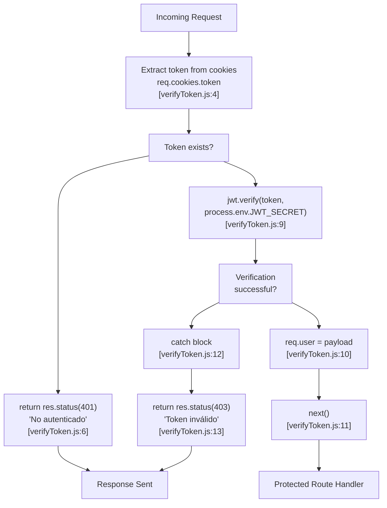
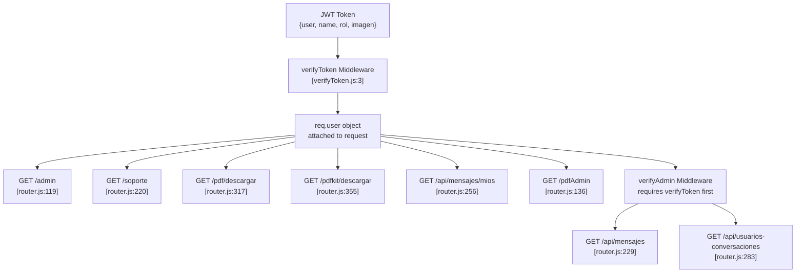

# JWT Token Management

> **Relevant source files**
> * [package-lock.json](https://github.com/moichuelo/registro/blob/544abbcc/package-lock.json)
> * [src/middlewares/verifyToken.js](https://github.com/moichuelo/registro/blob/544abbcc/src/middlewares/verifyToken.js)
> * [src/router.js](https://github.com/moichuelo/registro/blob/544abbcc/src/router.js)

## Purpose and Scope

This document describes the JWT (JSON Web Token) implementation used for stateless authentication in the registro-sesiones system. It covers token generation during login, storage in HTTP-only cookies, verification middleware, and token lifecycle management.

For information about the authentication flow and password validation, see [User Registration & Login](User-Registration-&-Login.md). For details on how tokens are used to protect routes, see [verifyToken Middleware](verifyToken-Middleware.md) and [verifyAdmin Middleware](verifyAdmin-Middleware.md). For WebSocket authentication, see [WebSocket Authentication](WebSocket-Authentication.md).

**Sources:** [src/router.js L1-L608](https://github.com/moichuelo/registro/blob/544abbcc/src/router.js#L1-L608)

 [src/middlewares/verifyToken.js L1-L18](https://github.com/moichuelo/registro/blob/544abbcc/src/middlewares/verifyToken.js#L1-L18)

---

## Token Generation Process

JWT tokens are generated upon successful authentication in the `/auth` route. The system validates user credentials against the database, and if correct, creates a signed JWT containing user identity and role information.

### Token Creation Flow

```mermaid
sequenceDiagram
  participant Client Browser
  participant POST /auth
  participant [src/router.js:532]
  participant MySQL Database
  participant usuarios table
  participant jsonwebtoken Library
  participant HTTP Cookie
  participant (token)

  Client Browser->>POST /auth: "POST credentials
  POST /auth->>MySQL Database: (user, pass)"
  MySQL Database-->>POST /auth: "SELECT * FROM usuarios
  POST /auth->>POST /auth: WHERE usuario = ?"
  loop ["Credentials Valid"]
    POST /auth->>POST /auth: "User record"
    POST /auth->>jsonwebtoken Library: "bcrypt.compare()
    jsonwebtoken Library-->>POST /auth: validate password"
    POST /auth->>HTTP Cookie: "Create payload object
    HTTP Cookie-->>Client Browser: {user, name, rol, imagen}"
    POST /auth-->>Client Browser: "jwt.sign(payload,
    POST /auth-->>Client Browser: JWT_SECRET,
  end
```

**Sources:** [src/router.js L532-L601](https://github.com/moichuelo/registro/blob/544abbcc/src/router.js#L532-L601)

### Payload Structure

The JWT payload contains the following user attributes extracted from the database query result:

| Field | Source | Description |
| --- | --- | --- |
| `user` | `results[0].usuario` | Username (primary identifier) |
| `name` | `results[0].nombre` | Display name |
| `rol` | `results[0].rol` | User role (`admin` or `user`) |
| `imagen` | `results[0].imagen` | Profile image filename |

The payload is defined at [src/router.js L559-L564](https://github.com/moichuelo/registro/blob/544abbcc/src/router.js#L559-L564)

:

```javascript
const payload = {
    user: results[0].usuario,
    name: results[0].nombre,
    rol: results[0].rol,
    imagen: results[0].imagen,
};
```

**Sources:** [src/router.js L559-L564](https://github.com/moichuelo/registro/blob/544abbcc/src/router.js#L559-L564)

### Signing and Expiration

The token is signed using the `JWT_SECRET` environment variable and configured to expire after 1 hour:

* **Signing Algorithm**: Default HS256 (HMAC with SHA-256)
* **Secret Key**: `process.env.JWT_SECRET` (must be defined in `.env` file)
* **Expiration**: 1 hour (`"1h"`)

The signing operation is performed at [src/router.js L567](https://github.com/moichuelo/registro/blob/544abbcc/src/router.js#L567-L567)

:

```javascript
const token = jwt.sign(payload, process.env.JWT_SECRET, { expiresIn: "1h" });
```

**Sources:** [src/router.js L567](https://github.com/moichuelo/registro/blob/544abbcc/src/router.js#L567-L567)

 [package-lock.json L24](https://github.com/moichuelo/registro/blob/544abbcc/package-lock.json#L24-L24)

---

## Token Storage in HTTP-Only Cookies

After generation, the JWT is stored in an HTTP-only cookie named `token`. This storage mechanism prevents client-side JavaScript from accessing the token, mitigating XSS attacks.

### Cookie Configuration

The cookie is set with the following options at [src/router.js L570-L574](https://github.com/moichuelo/registro/blob/544abbcc/src/router.js#L570-L574)

:

| Option | Value | Purpose |
| --- | --- | --- |
| `name` | `"token"` | Cookie identifier |
| `httpOnly` | `true` | Prevents JavaScript access |
| `secure` | `false` | Set to `true` for HTTPS in production |
| `maxAge` | `3600000` | 1 hour in milliseconds |

```yaml
res.cookie("token", token, {
    httpOnly: true,
    secure: false, // Set true for HTTPS
    maxAge: 3600000, // 1 hour
});
```

The `httpOnly` flag ensures the cookie is only transmitted via HTTP(S) and cannot be accessed by `document.cookie` in the browser.

**Sources:** [src/router.js L570-L574](https://github.com/moichuelo/registro/blob/544abbcc/src/router.js#L570-L574)

### Cookie Lifecycle Diagram

```

```

**Sources:** [src/router.js L215-L218](https://github.com/moichuelo/registro/blob/544abbcc/src/router.js#L215-L218)

 [src/router.js L570-L574](https://github.com/moichuelo/registro/blob/544abbcc/src/router.js#L570-L574)

 [src/middlewares/verifyToken.js L4](https://github.com/moichuelo/registro/blob/544abbcc/src/middlewares/verifyToken.js#L4-L4)

---

## Token Verification Middleware

The `verifyToken` middleware intercepts requests to protected routes and validates the JWT before allowing access. This middleware is defined in [src/middlewares/verifyToken.js L1-L18](https://github.com/moichuelo/registro/blob/544abbcc/src/middlewares/verifyToken.js#L1-L18)

### Verification Process



**Sources:** [src/middlewares/verifyToken.js L3-L15](https://github.com/moichuelo/registro/blob/544abbcc/src/middlewares/verifyToken.js#L3-L15)

### Middleware Implementation

The complete middleware function is defined at [src/middlewares/verifyToken.js L3-L15](https://github.com/moichuelo/registro/blob/544abbcc/src/middlewares/verifyToken.js#L3-L15)

:

```javascript
const verifyToken = (req, res, next) => {
    const token = req.cookies.token; // Extract token

    if (!token) return res.status(401).send("No autenticado");

    try {
        const payload = jwt.verify(token, process.env.JWT_SECRET);
        req.user = payload; // Attach user info to request
        next(); // Continue to route handler
    } catch (err) {
        return res.status(403).send("Token inválido");
    }
};
```

The middleware:

1. Extracts the token from `req.cookies.token` (requires `cookie-parser` middleware)
2. Returns 401 if no token is present
3. Verifies the token signature and expiration using `jwt.verify()`
4. Attaches the decoded payload to `req.user` for downstream handlers
5. Returns 403 if verification fails (invalid signature or expired)

**Sources:** [src/middlewares/verifyToken.js L3-L15](https://github.com/moichuelo/registro/blob/544abbcc/src/middlewares/verifyToken.js#L3-L15)

 [package-lock.json L13](https://github.com/moichuelo/registro/blob/544abbcc/package-lock.json#L13-L13)

---

## Token Usage in Protected Routes

Once verified, the token payload is available in route handlers as `req.user`. This object contains all fields from the original payload.

### Example: Admin Route

The `/admin` route uses `verifyToken` middleware at [src/router.js L119](https://github.com/moichuelo/registro/blob/544abbcc/src/router.js#L119-L119)

:

```javascript
router.get("/admin", verifyToken, (req, res) => {
    db.query("SELECT * FROM productos", (error, results) => {
        // ...
        res.render("admin", {
            productos: results,
            user: req.user,      // Token payload available here
            login: true,
            rol: req.user.rol,   // Role from token
        });
    });
});
```

**Sources:** [src/router.js L119-L134](https://github.com/moichuelo/registro/blob/544abbcc/src/router.js#L119-L134)

### Example: Support Chat Route

The `/soporte` route accesses token payload at [src/router.js L220-L227](https://github.com/moichuelo/registro/blob/544abbcc/src/router.js#L220-L227)

:

```javascript
router.get("/soporte", verifyToken, (req, res) => {
    res.render("soporte", {
        user: {
            username: req.user.user,  // From token payload
            role: req.user.rol        // From token payload
        }
    });
});
```

**Sources:** [src/router.js L220-L227](https://github.com/moichuelo/registro/blob/544abbcc/src/router.js#L220-L227)

### Token Usage Map



**Sources:** [src/router.js L119](https://github.com/moichuelo/registro/blob/544abbcc/src/router.js#L119-L119)

 [src/router.js L220](https://github.com/moichuelo/registro/blob/544abbcc/src/router.js#L220-L220)

 [src/router.js L229](https://github.com/moichuelo/registro/blob/544abbcc/src/router.js#L229-L229)

 [src/router.js L256](https://github.com/moichuelo/registro/blob/544abbcc/src/router.js#L256-L256)

 [src/router.js L283](https://github.com/moichuelo/registro/blob/544abbcc/src/router.js#L283-L283)

 [src/router.js L317](https://github.com/moichuelo/registro/blob/544abbcc/src/router.js#L317-L317)

 [src/router.js L355](https://github.com/moichuelo/registro/blob/544abbcc/src/router.js#L355-L355)

---

## Token Expiration and Logout

### Automatic Expiration

Tokens automatically expire 1 hour after creation due to the `expiresIn: "1h"` option. When an expired token is used, `jwt.verify()` throws an error, which is caught by the middleware and returns a 403 response.

### Explicit Logout

The `/logout` route explicitly removes the token cookie at [src/router.js L215-L218](https://github.com/moichuelo/registro/blob/544abbcc/src/router.js#L215-L218)

:

```javascript
router.get("/logout", (req, res) => {
    res.clearCookie("token");
    res.redirect('/');
});
```

The `clearCookie()` method instructs the browser to delete the `token` cookie, effectively logging out the user.

**Sources:** [src/router.js L215-L218](https://github.com/moichuelo/registro/blob/544abbcc/src/router.js#L215-L218)

### Optional Token Verification

In some routes, token verification is optional. For example, the root route (`/`) at [src/router.js L59-L74](https://github.com/moichuelo/registro/blob/544abbcc/src/router.js#L59-L74)

 checks for a token but doesn't require it:

```javascript
router.get("/", (req, res) => {
    if (req.cookies.token) {
        const payload = jwt.verify(req.cookies.token, process.env.JWT_SECRET);
        req.user = payload;
        res.render("index", {
            user: req.user?.name || "Usuario",
            login: true,
        });
    } else {
        res.render("index", {
            user: "Debe iniciar sesión",
            login: false,
        });
    }
});
```

This pattern allows the page to display personalized content if a token is present but doesn't block access if absent.

**Sources:** [src/router.js L59-L74](https://github.com/moichuelo/registro/blob/544abbcc/src/router.js#L59-L74)

---

## Environment Configuration

### JWT_SECRET Variable

The JWT signing and verification processes depend on the `JWT_SECRET` environment variable. This secret must be:

* **Defined in `.env` file**: Not committed to version control
* **Sufficiently random**: Use a cryptographically secure random string
* **Consistent across instances**: All server instances must use the same secret
* **Protected**: Never exposed to clients or logs

The secret is accessed via `process.env.JWT_SECRET` at:

* [src/router.js L567](https://github.com/moichuelo/registro/blob/544abbcc/src/router.js#L567-L567)  during token signing
* [src/middlewares/verifyToken.js L9](https://github.com/moichuelo/registro/blob/544abbcc/src/middlewares/verifyToken.js#L9-L9)  during token verification

**Sources:** [src/router.js L567](https://github.com/moichuelo/registro/blob/544abbcc/src/router.js#L567-L567)

 [src/middlewares/verifyToken.js L9](https://github.com/moichuelo/registro/blob/544abbcc/src/middlewares/verifyToken.js#L9-L9)

---

## Integration with Cookie Parser

The JWT implementation depends on the `cookie-parser` middleware to extract cookies from HTTP requests. The middleware must be configured before any routes that use token verification.

In [index.js](https://github.com/moichuelo/registro/blob/544abbcc/index.js)

 `cookie-parser` is initialized before the router:

```javascript
const cookieParser = require("cookie-parser");
app.use(cookieParser());
```

This allows `req.cookies.token` to be accessible in [src/middlewares/verifyToken.js L4](https://github.com/moichuelo/registro/blob/544abbcc/src/middlewares/verifyToken.js#L4-L4)

**Sources:** [src/middlewares/verifyToken.js L4](https://github.com/moichuelo/registro/blob/544abbcc/src/middlewares/verifyToken.js#L4-L4)

 [package-lock.json L13](https://github.com/moichuelo/registro/blob/544abbcc/package-lock.json#L13-L13)

---

## Security Considerations

### HTTP-Only Flag

The `httpOnly: true` option at [src/router.js L571](https://github.com/moichuelo/registro/blob/544abbcc/src/router.js#L571-L571)

 prevents client-side JavaScript from accessing the token, protecting against XSS attacks where an attacker might inject code to steal the token.

### HTTPS in Production

The `secure: false` setting at [src/router.js L572](https://github.com/moichuelo/registro/blob/544abbcc/src/router.js#L572-L572)

 should be changed to `true` in production environments using HTTPS. This ensures the cookie is only transmitted over encrypted connections.

### Token Expiration

The 1-hour expiration at [src/router.js L567](https://github.com/moichuelo/registro/blob/544abbcc/src/router.js#L567-L567)

 limits the window of opportunity if a token is compromised. After expiration, users must re-authenticate.

### Secret Key Protection

The `JWT_SECRET` is the cryptographic foundation of token security. If compromised, an attacker can forge valid tokens. It must be:

* Stored securely in environment variables
* Never committed to version control
* Rotated periodically in production

**Sources:** [src/router.js L567](https://github.com/moichuelo/registro/blob/544abbcc/src/router.js#L567-L567)

 [src/router.js L570-L574](https://github.com/moichuelo/registro/blob/544abbcc/src/router.js#L570-L574)

---

## Dependencies

The JWT token management system relies on the following npm packages:

| Package | Version | Purpose |
| --- | --- | --- |
| `jsonwebtoken` | 9.0.2 | JWT creation and verification |
| `cookie-parser` | 1.4.7 | Extract cookies from requests |
| `bcryptjs` | 3.0.2 | Password hashing during login |
| `dotenv` | 16.5.0 | Load JWT_SECRET from `.env` |

**Sources:** [package-lock.json L24](https://github.com/moichuelo/registro/blob/544abbcc/package-lock.json#L24-L24)

 [package-lock.json L13](https://github.com/moichuelo/registro/blob/544abbcc/package-lock.json#L13-L13)

 [package-lock.json L12](https://github.com/moichuelo/registro/blob/544abbcc/package-lock.json#L12-L12)

 [package-lock.json L15](https://github.com/moichuelo/registro/blob/544abbcc/package-lock.json#L15-L15)