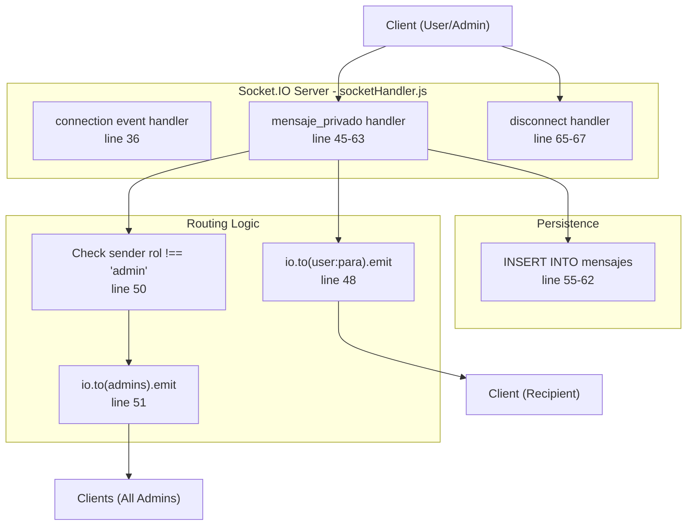
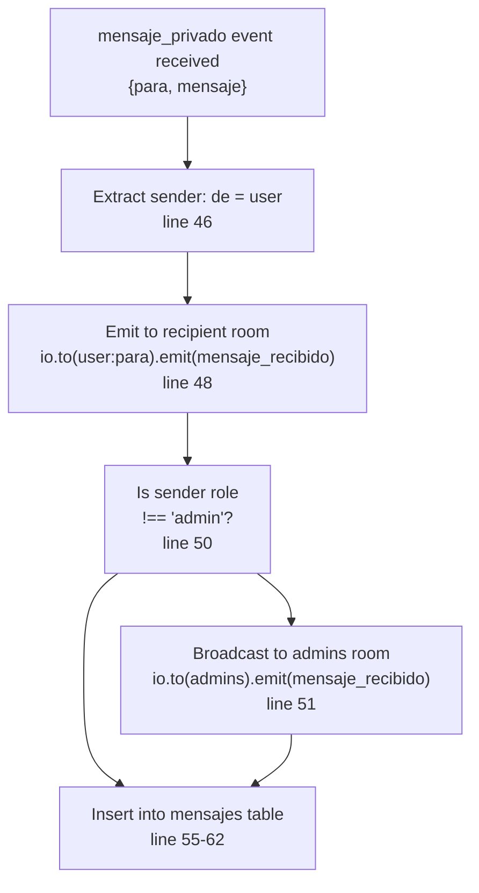
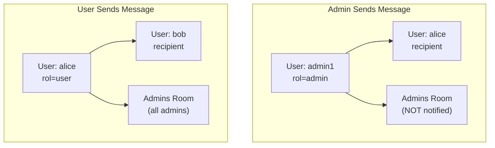

# Message Handling

> **Relevant source files**
> * [src/router.js](https://github.com/moichuelo/registro/blob/544abbcc/src/router.js)
> * [src/sockets/socketHandler.js](https://github.com/moichuelo/registro/blob/544abbcc/src/sockets/socketHandler.js)

## Purpose and Scope

This document describes the WebSocket event handlers and logic for sending, routing, and persisting real-time chat messages in the support system. The message handling system processes `mensaje_privado` events from clients, routes messages to appropriate recipients through Socket.IO rooms, and persists all messages to the MySQL database. It also handles disconnect events and provides HTTP APIs for retrieving message history.

For information about Socket.IO server initialization, see [Socket.IO Server Setup](/moichuelo/registro/7.1-socket.io-server-setup). For room assignment and management, see [Room Management](Room-Management.md). For WebSocket authentication, see [WebSocket Authentication](WebSocket-Authentication.md).

**Sources:** [src/sockets/socketHandler.js L1-L71](https://github.com/moichuelo/registro/blob/544abbcc/src/sockets/socketHandler.js#L1-L71)

---

## Event Handler Overview

The Socket.IO server in `setupSocket` function processes two primary WebSocket events after a client connection is established:

| Event Name | Direction | Purpose | Handler Location |
| --- | --- | --- | --- |
| `mensaje_privado` | Client → Server | User sends a private message | [src/sockets/socketHandler.js L45-L63](https://github.com/moichuelo/registro/blob/544abbcc/src/sockets/socketHandler.js#L45-L63) |
| `mensaje_recibido` | Server → Client | Server delivers message to recipient(s) | [src/sockets/socketHandler.js L48-L52](https://github.com/moichuelo/registro/blob/544abbcc/src/sockets/socketHandler.js#L48-L52) |
| `disconnect` | Client → Server | User disconnects from WebSocket | [src/sockets/socketHandler.js L65-L67](https://github.com/moichuelo/registro/blob/544abbcc/src/sockets/socketHandler.js#L65-L67) |

The `mensaje_privado` event is received from the client, while `mensaje_recibido` is emitted by the server to deliver messages to recipients.



**Sources:** [src/sockets/socketHandler.js L36-L68](https://github.com/moichuelo/registro/blob/544abbcc/src/sockets/socketHandler.js#L36-L68)

---

## mensaje_privado Event Handler

The `mensaje_privado` event handler processes incoming private messages from authenticated clients. The handler is attached within the connection event listener after the user has been authenticated via JWT middleware.

### Event Parameters

The event expects a payload object with two properties:

```
{ para, mensaje }
```

* `para` (string): The username of the message recipient
* `mensaje` (string): The text content of the message

The sender's username is extracted from the authenticated user context: `const de = user;` [src/sockets/socketHandler.js L46](https://github.com/moichuelo/registro/blob/544abbcc/src/sockets/socketHandler.js#L46-L46)

### Message Routing Logic

The handler implements a dual-routing strategy:

1. **Direct delivery to recipient**: Messages are always emitted to the recipient's personal room using `io.to(\`user:${para}`).emit("mensaje_recibido", { de, mensaje })` [src/sockets/socketHandler.js L48](https://github.com/moichuelo/registro/blob/544abbcc/src/sockets/socketHandler.js#L48-L48)
2. **Admin broadcast**: If the sender is NOT an admin (`rol !== "admin"`), the message is also broadcast to all admins in the `"admins"` room [src/sockets/socketHandler.js L50-L52](https://github.com/moichuelo/registro/blob/544abbcc/src/sockets/socketHandler.js#L50-L52)  This allows administrators to monitor all user conversations.



**Sources:** [src/sockets/socketHandler.js L45-L63](https://github.com/moichuelo/registro/blob/544abbcc/src/sockets/socketHandler.js#L45-L63)

---

## mensaje_recibido Event Emission

The `mensaje_recibido` event is emitted by the server to deliver messages to connected clients. This event is never sent by clients; it is strictly a server-to-client communication.

### Event Payload

The emitted event carries:

```
{ de, mensaje }
```

* `de` (string): The username of the message sender
* `mensaje` (string): The message text content

### Emission Targets

The event is emitted to Socket.IO rooms using `io.to(roomName).emit()`:

* **Recipient's personal room**: `io.to(\`user:${para}`)` - Delivers the message to the intended recipient [src/sockets/socketHandler.js L48](https://github.com/moichuelo/registro/blob/544abbcc/src/sockets/socketHandler.js#L48-L48)
* **Admins room** (conditional): `io.to("admins")` - Broadcasts user messages to all connected administrators [src/sockets/socketHandler.js L51](https://github.com/moichuelo/registro/blob/544abbcc/src/sockets/socketHandler.js#L51-L51)

The room-based emission ensures messages are only delivered to the intended recipients without iterating through all connected sockets.

**Sources:** [src/sockets/socketHandler.js L48-L52](https://github.com/moichuelo/registro/blob/544abbcc/src/sockets/socketHandler.js#L48-L52)

---

## Message Routing Scenarios

The routing behavior differs based on sender role:

### Scenario 1: Regular User Sends Message

When a user with `rol !== "admin"` sends a message:

1. Message is emitted to the recipient's personal room
2. Message is broadcast to all administrators in the `"admins"` room
3. Message is persisted to database

This allows administrators to see all user conversations in real-time for support monitoring.

### Scenario 2: Admin Sends Message

When an administrator sends a message:

1. Message is emitted ONLY to the recipient's personal room
2. Message is NOT broadcast to the `"admins"` room (preventing echo)
3. Message is persisted to database

The condition `if (rol !== "admin")` [src/sockets/socketHandler.js L50](https://github.com/moichuelo/registro/blob/544abbcc/src/sockets/socketHandler.js#L50-L50)

 prevents admin messages from being broadcast to the admin room, avoiding duplicate notifications.



**Sources:** [src/sockets/socketHandler.js L45-L52](https://github.com/moichuelo/registro/blob/544abbcc/src/sockets/socketHandler.js#L45-L52)

---

## Message Persistence

All messages, regardless of routing, are persisted to the MySQL `mensajes` table to maintain a complete conversation history.

### Database Insertion

The insertion uses a parameterized SQL query to prevent injection attacks:

```sql
INSERT INTO mensajes (de_usuario, para_usuario, mensaje) VALUES (?, ?, ?)
```

Parameters: `[de, para, mensaje]` [src/sockets/socketHandler.js L55-L56](https://github.com/moichuelo/registro/blob/544abbcc/src/sockets/socketHandler.js#L55-L56)

The database operation is asynchronous and logs success or failure:

* Success: `console.log("💾 Mensaje guardado:", \`${de} ➡️ ${para}`)`  [src/sockets/socketHandler.js L60](https://github.com/moichuelo/registro/blob/544abbcc/src/sockets/socketHandler.js#L60-L60)
* Error: `console.error("❌ Error al guardar mensaje:", err)` [src/sockets/socketHandler.js L58](https://github.com/moichuelo/registro/blob/544abbcc/src/sockets/socketHandler.js#L58-L58)

### Table Structure

The `mensajes` table contains:

* `de_usuario`: Foreign key to `usuarios.usuario` (sender)
* `para_usuario`: Foreign key to `usuarios.usuario` (recipient)
* `mensaje`: TEXT field for message content
* `fecha`: DATETIME field (auto-populated by database default)

For complete database schema details, see [mensajes Table](mensajes-Table.md).

**Sources:** [src/sockets/socketHandler.js L55-L62](https://github.com/moichuelo/registro/blob/544abbcc/src/sockets/socketHandler.js#L55-L62)

---

## disconnect Event Handler

The `disconnect` event is automatically fired by Socket.IO when a client WebSocket connection is closed (browser tab closed, network interruption, explicit disconnect).

The handler simply logs the disconnection event:

```javascript
socket.on("disconnect", () => {
    console.log(`🔴 Usuario desconectado: ${user}`);
});
```

[src/sockets/socketHandler.js L65-L67](https://github.com/moichuelo/registro/blob/544abbcc/src/sockets/socketHandler.js#L65-L67)

When a user disconnects:

1. Socket.IO automatically removes them from all rooms they joined
2. The socket instance is destroyed
3. No database operations are performed
4. No cleanup of messages is required (messages persist in database)

**Sources:** [src/sockets/socketHandler.js L65-L67](https://github.com/moichuelo/registro/blob/544abbcc/src/sockets/socketHandler.js#L65-L67)

---

## HTTP Message Retrieval APIs

While real-time messages are delivered via WebSocket events, the system provides HTTP REST endpoints for retrieving historical messages. These endpoints are used by clients when first loading the chat interface or when reconnecting after a disconnection.

### GET /api/mensajes (Admin Only)

Retrieves all messages for a specific user's conversation. Requires admin authentication via `verifyAdmin` middleware.

**Query Parameter:**

* `con` (required): Username to retrieve messages for

**SQL Query:**

```sql
SELECT de_usuario, para_usuario, mensaje, fecha
FROM mensajes
WHERE (de_usuario = ? OR para_usuario = ?)
ORDER BY fecha ASC
```

[src/router.js L236-L242](https://github.com/moichuelo/registro/blob/544abbcc/src/router.js#L236-L242)

The query retrieves messages where the specified user is either the sender OR recipient, ordered chronologically.

**Response:** JSON array of message objects
**Authorization:** Admin role required [src/router.js L229](https://github.com/moichuelo/registro/blob/544abbcc/src/router.js#L229-L229)

### GET /api/mensajes/mios (Authenticated Users)

Retrieves all messages for the currently authenticated user. Requires token authentication via `verifyToken` middleware.

The username is extracted from the JWT payload: `const usuario = req.user.user;` [src/router.js L257](https://github.com/moichuelo/registro/blob/544abbcc/src/router.js#L257-L257)

**SQL Query:**
Same as admin endpoint, but filters by the authenticated user's username [src/router.js L263-L269](https://github.com/moichuelo/registro/blob/544abbcc/src/router.js#L263-L269)

**Response:** JSON array of message objects
**Authorization:** Any authenticated user [src/router.js L256](https://github.com/moichuelo/registro/blob/544abbcc/src/router.js#L256-L256)

### GET /api/usuarios-conversaciones (Admin Only)

Retrieves a list of all users who have active conversations with administrators. Used by the admin interface to populate the user list sidebar.

**SQL Query:**

```sql
SELECT DISTINCT usuario
FROM (
  SELECT de_usuario AS usuario FROM mensajes
  WHERE para_usuario IN (SELECT usuario FROM usuarios WHERE rol = 'admin')
  
  UNION
  
  SELECT para_usuario AS usuario FROM mensajes
  WHERE de_usuario IN (SELECT usuario FROM usuarios WHERE rol = 'admin')
) AS conversaciones
WHERE usuario NOT IN (SELECT usuario FROM usuarios WHERE rol = 'admin')
```

[src/router.js L292-L304](https://github.com/moichuelo/registro/blob/544abbcc/src/router.js#L292-L304)

The query uses UNION to find users who either:

1. Sent messages TO admins, OR
2. Received messages FROM admins

It excludes admin usernames from the results.

**Response:** JSON array of usernames (strings) [src/router.js L312-L313](https://github.com/moichuelo/registro/blob/544abbcc/src/router.js#L312-L313)

**Authorization:** Admin role required [src/router.js L283](https://github.com/moichuelo/registro/blob/544abbcc/src/router.js#L283-L283)

**Sources:** [src/router.js L229-L315](https://github.com/moichuelo/registro/blob/544abbcc/src/router.js#L229-L315)

---

## Complete Message Flow

The following diagram illustrates the complete lifecycle of a message from client initiation through delivery and persistence:

```mermaid
sequenceDiagram
  participant Client (Sender)
  participant Socket.IO Server
  participant Room: user:recipient
  participant Room: admins
  participant MySQL mensajes table

  note over Client (Sender): User clicks send in chat UI
  Client (Sender)->>Socket.IO Server: emit("mensaje_privado", {para, mensaje})
  note over Socket.IO Server: Handler at line 45
  Socket.IO Server->>Socket.IO Server: Extract de = user (line 46)
  Socket.IO Server->>Room: user:recipient: emit("mensaje_recibido", {de, mensaje})
  note over Room: user:recipient: Recipient receives message
  loop [Sender is NOT admin]
    Socket.IO Server->>Room: admins: emit("mensaje_recibido", {de, mensaje})
    note over Room: admins: All admins receive notification
    Socket.IO Server->>MySQL mensajes table: INSERT INTO mensajes
    MySQL mensajes table-->>Socket.IO Server: (de_usuario, para_usuario, mensaje)
    note over Socket.IO Server: Log: 💾 Mensaje guardado
    note over Socket.IO Server: Log: ❌ Error al guardar mensaje
  end
```

**Sources:** [src/sockets/socketHandler.js L45-L63](https://github.com/moichuelo/registro/blob/544abbcc/src/sockets/socketHandler.js#L45-L63)

---

## Error Handling

The message handling system includes basic error handling:

1. **Database errors**: Caught in the callback of `db.query()` and logged to console [src/sockets/socketHandler.js L57-L61](https://github.com/moichuelo/registro/blob/544abbcc/src/sockets/socketHandler.js#L57-L61)  The message is still delivered to recipients even if persistence fails.
2. **Authentication errors**: Handled by the Socket.IO middleware before messages can be sent (see [WebSocket Authentication](WebSocket-Authentication.md))
3. **Missing parameters**: No explicit validation exists in the handler. If `para` or `mensaje` are undefined, the emission will still occur but may fail at the client level.
4. **Room not found**: Socket.IO silently ignores emissions to rooms with no members. Messages to offline users are persisted but not delivered until reconnection.

**Sources:** [src/sockets/socketHandler.js L45-L63](https://github.com/moichuelo/registro/blob/544abbcc/src/sockets/socketHandler.js#L45-L63)

---

## Integration Points

The message handling system integrates with:

| Component | Integration Point | Purpose |
| --- | --- | --- |
| JWT Authentication | `socket.request.user` [src/sockets/socketHandler.js L37](https://github.com/moichuelo/registro/blob/544abbcc/src/sockets/socketHandler.js#L37-L37) | Extracts sender identity |
| Room Management | `socket.join()` called in connection handler [src/sockets/socketHandler.js L42-L43](https://github.com/moichuelo/registro/blob/544abbcc/src/sockets/socketHandler.js#L42-L43) | Establishes room membership |
| MySQL Database | `db.query()` [src/sockets/socketHandler.js L56](https://github.com/moichuelo/registro/blob/544abbcc/src/sockets/socketHandler.js#L56-L56) | Persists message history |
| HTTP API | `/api/mensajes` endpoints [src/router.js L229-L280](https://github.com/moichuelo/registro/blob/544abbcc/src/router.js#L229-L280) | Retrieves historical messages |
| Client UI | `views/soporte.ejs` | Emits `mensaje_privado`, listens for `mensaje_recibido` |

For Socket.IO room assignments, see [Room Management](Room-Management.md). For database table structure, see [mensajes Table](mensajes-Table.md). For client-side implementation, see [Support Chat System](Support-Chat-System.md).

**Sources:** [src/sockets/socketHandler.js L1-L71](https://github.com/moichuelo/registro/blob/544abbcc/src/sockets/socketHandler.js#L1-L71)

 [src/router.js L229-L315](https://github.com/moichuelo/registro/blob/544abbcc/src/router.js#L229-L315)