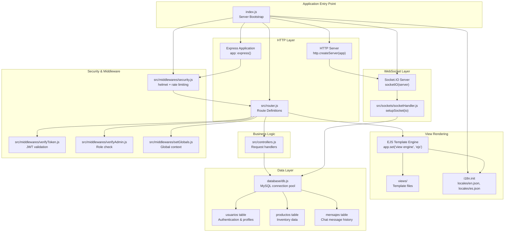
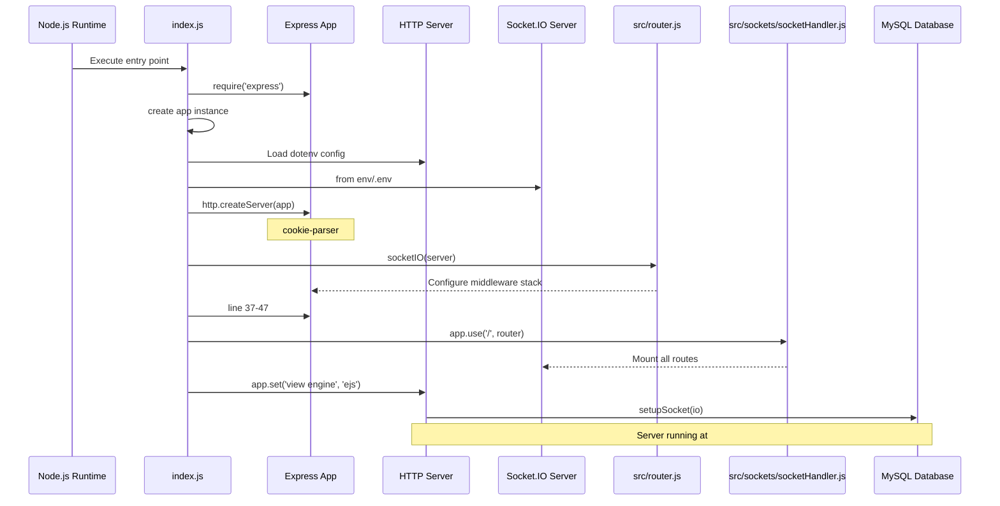

# Overview

> **Relevant source files**
> * [index.js](https://github.com/moichuelo/registro/blob/544abbcc/index.js)
> * [package-lock.json](https://github.com/moichuelo/registro/blob/544abbcc/package-lock.json)
> * [package.json](https://github.com/moichuelo/registro/blob/544abbcc/package.json)

## Purpose and Scope

The **registro-sesiones** system is a full-stack web application built on Node.js that provides session registration and management capabilities with real-time communication features. The system implements user authentication, role-based access control, product inventory management, and a live support chat system. It is designed as a dual-server application where a single HTTP server hosts both traditional request-response patterns via Express and bidirectional real-time communication via Socket.IO.

This document provides a high-level overview of the system architecture, core capabilities, and technology stack. For detailed information about specific subsystems:

* Application bootstrap and server initialization: see [Getting Started](Getting-Started.md)
* Authentication and authorization flows: see [Authentication & Authorization](Authentication-&-Authorization.md)
* Real-time messaging implementation: see [Real-time Communication System](Real-time-Communication-System.md)
* View rendering and templating: see [View Layer & Templates](Template-Structure.md)
* Database schema and tables: see [Database Schema](Database-Schema.md)

**Sources:** [index.js L1-L86](https://github.com/moichuelo/registro/blob/544abbcc/index.js#L1-L86)

 [package.json L1-L49](https://github.com/moichuelo/registro/blob/544abbcc/package.json#L1-L49)

---

## Core Capabilities

The system provides four primary functional areas:

| Capability | Description | Primary Users |
| --- | --- | --- |
| **User Authentication** | JWT-based authentication with bcrypt password hashing, session management, and HTTP-only cookie storage | All users |
| **Product Management** | Full CRUD operations for product inventory including reference numbers, names, prices, and stock levels | Admin users |
| **Support Chat** | Real-time bidirectional messaging between users and administrators using Socket.IO with message persistence | All authenticated users |
| **Report Generation** | PDF export of product data using both Puppeteer (HTML-to-PDF) and PDFKit (programmatic) approaches | Admin users |

Additional cross-cutting features include:

* **Internationalization**: English and Spanish language support via `i18n` library
* **Security**: Helmet security headers, rate limiting, input validation, and CSRF protection
* **API Documentation**: Swagger UI integration for REST API exploration

**Sources:** [package.json L22-L43](https://github.com/moichuelo/registro/blob/544abbcc/package.json#L22-L43)

 [index.js L1-L65](https://github.com/moichuelo/registro/blob/544abbcc/index.js#L1-L65)

---

## System Architecture Map

The following diagram maps the high-level system components to their corresponding code entities in the codebase:



**Diagram: System Architecture Component Map**

This diagram shows how the main functional areas map to specific files and code entities. The `index.js` file serves as the bootstrap that initializes all major subsystems. The HTTP layer is handled by Express with routing defined in `src/router.js`, while real-time communication is managed by Socket.IO with handlers in `src/sockets/socketHandler.js`. All data operations flow through `database/db.js` to the MySQL tables.

**Sources:** [index.js L1-L65](https://github.com/moichuelo/registro/blob/544abbcc/index.js#L1-L65)

 Diagram 1, Diagram 4

---

## Technology Stack

The system is built on the following core technologies and libraries:

| Layer | Technology | Version | Purpose |
| --- | --- | --- | --- |
| **Runtime** | Node.js | ≥18.0.0 | JavaScript runtime environment |
| **Web Framework** | Express | 5.1.0 | HTTP server and routing |
| **Real-time** | Socket.IO | 4.8.1 | WebSocket-based bidirectional communication |
| **Database** | MySQL | via mysql2 3.14.1 | Relational data storage |
| **Authentication** | jsonwebtoken | 9.0.2 | JWT token generation and validation |
| **Password Hashing** | bcryptjs | 3.0.2 | One-way password encryption |
| **View Engine** | EJS | 3.1.10 | Server-side HTML templating |
| **PDF Generation** | Puppeteer | 24.14.0 | HTML-to-PDF conversion |
| **PDF Generation** | PDFKit | 0.17.1 | Programmatic PDF creation |
| **Security** | Helmet | 8.1.0 | HTTP security headers |
| **Rate Limiting** | express-rate-limit | 6.7.0 | Brute-force protection |
| **Validation** | express-validator | 7.2.1 | Input sanitization and validation |
| **i18n** | i18n | 0.15.1 | Multi-language support |
| **File Upload** | Multer | 2.0.2 | Multipart form data handling |
| **API Docs** | swagger-ui-express | 5.0.1 | Interactive API documentation |

**Sources:** [package.json L22-L42](https://github.com/moichuelo/registro/blob/544abbcc/package.json#L22-L42)

---

## Application Bootstrap Flow

The following diagram illustrates the initialization sequence when the application starts:



**Diagram: Application Initialization Sequence**

The bootstrap process follows these steps:

1. **Environment Configuration** ([index.js L4](https://github.com/moichuelo/registro/blob/544abbcc/index.js#L4-L4) ): Load environment variables from `env/.env` using `dotenv`
2. **Express Setup** ([index.js L2-L3](https://github.com/moichuelo/registro/blob/544abbcc/index.js#L2-L3) ): Create Express application instance
3. **HTTP Server Creation** ([index.js L8-L10](https://github.com/moichuelo/registro/blob/544abbcc/index.js#L8-L10) ): Wrap Express app in HTTP server for Socket.IO compatibility
4. **Socket.IO Initialization** ([index.js L12](https://github.com/moichuelo/registro/blob/544abbcc/index.js#L12-L12) ): Attach Socket.IO to HTTP server
5. **Middleware Stack** ([index.js L37-L47](https://github.com/moichuelo/registro/blob/544abbcc/index.js#L37-L47) ): Configure security, parsing, sessions, and internationalization
6. **View Engine** ([index.js L52](https://github.com/moichuelo/registro/blob/544abbcc/index.js#L52-L52) ): Set EJS as template renderer
7. **Socket Configuration** ([index.js L57](https://github.com/moichuelo/registro/blob/544abbcc/index.js#L57-L57) ): Call `setupSocket(io)` to register WebSocket event handlers
8. **Server Start** ([index.js L62-L65](https://github.com/moichuelo/registro/blob/544abbcc/index.js#L62-L65) ): Begin listening on port 3000

**Sources:** [index.js L1-L65](https://github.com/moichuelo/registro/blob/544abbcc/index.js#L1-L65)

---

## Database Schema Overview

The system uses a MySQL database with three primary tables:

| Table | Primary Key | Purpose | Key Relationships |
| --- | --- | --- | --- |
| `usuarios` | `usuario` (VARCHAR) | Stores user credentials, roles (admin/user), and profile data including bcrypt-hashed passwords and profile image filenames | Referenced by `mensajes` table |
| `productos` | `ref` (INT AUTO_INCREMENT) | Manages product inventory with name, price (DECIMAL), and stock (INT) | None |
| `mensajes` | Composite | Persists chat messages with sender (`de_usuario`), recipient (`para_usuario`), message text, and timestamp | Foreign keys to `usuarios.usuario` |

The database connection is established via a connection pool in [database/db.js](https://github.com/moichuelo/registro/blob/544abbcc/database/db.js)

 which is imported by route controllers and the Socket.IO handler.

**Sources:** Diagram 5, [index.js L13](https://github.com/moichuelo/registro/blob/544abbcc/index.js#L13-L13)

---

## Request Processing Overview

All incoming HTTP requests flow through a seven-layer middleware stack before reaching route handlers:

1. **helmet** ([index.js L45](https://github.com/moichuelo/registro/blob/544abbcc/index.js#L45-L45) ): Security headers (CSP, XSS protection, etc.)
2. **express-rate-limit**: Configured in [src/middlewares/security.js](https://github.com/moichuelo/registro/blob/544abbcc/src/middlewares/security.js)  for brute-force prevention
3. **cookie-parser** ([index.js L37](https://github.com/moichuelo/registro/blob/544abbcc/index.js#L37-L37) ): Parse JWT cookies
4. **express.urlencoded** and **express.json** ([index.js L41-L42](https://github.com/moichuelo/registro/blob/544abbcc/index.js#L41-L42) ): Body parsing
5. **express-session**: Session management compatibility layer
6. **i18n.init** ([index.js L46](https://github.com/moichuelo/registro/blob/544abbcc/index.js#L46-L46) ): Language detection from `lang` cookie or query parameter
7. **setGlobals** ([index.js L47](https://github.com/moichuelo/registro/blob/544abbcc/index.js#L47-L47) ): Inject global template variables

After middleware processing, requests are routed by [src/router.js](https://github.com/moichuelo/registro/blob/544abbcc/src/router.js)

 to appropriate handlers. Routes requiring authentication pass through `verifyToken` middleware ([src/middlewares/verifyToken.js](https://github.com/moichuelo/registro/blob/544abbcc/src/middlewares/verifyToken.js)

), and admin-only routes additionally require `verifyAdmin` middleware ([src/middlewares/verifyAdmin.js](https://github.com/moichuelo/registro/blob/544abbcc/src/middlewares/verifyAdmin.js)

).

**Sources:** [index.js L37-L48](https://github.com/moichuelo/registro/blob/544abbcc/index.js#L37-L48)

 Diagram 4

---

## WebSocket Communication

Real-time features are implemented using Socket.IO with a room-based routing architecture:

* **Personal Rooms**: Each user is assigned to a room named `user:{username}` for direct message delivery
* **Admin Room**: All users with `rol=admin` join a collective `admins` room to receive all user messages
* **Event Handlers**: The `setupSocket` function in [src/sockets/socketHandler.js](https://github.com/moichuelo/registro/blob/544abbcc/src/sockets/socketHandler.js)  registers handlers for: * `mensaje_privado`: Send and persist messages * `mensaje_recibido`: Emit messages to appropriate rooms * `disconnect`: Cleanup on connection close

WebSocket connections are authenticated using the same JWT tokens from HTTP-only cookies, ensuring consistent security across both communication channels.

**Sources:** [index.js L57](https://github.com/moichuelo/registro/blob/544abbcc/index.js#L57-L57)

 [index.js L12](https://github.com/moichuelo/registro/blob/544abbcc/index.js#L12-L12)

 Diagram 3

---

## API Documentation

The system includes Swagger UI for interactive API documentation, accessible at `/api-docs` when the server is running ([index.js L44](https://github.com/moichuelo/registro/blob/544abbcc/index.js#L44-L44)

). The Swagger specification is generated from JSDoc annotations using `swagger-jsdoc` ([index.js L19](https://github.com/moichuelo/registro/blob/544abbcc/index.js#L19-L19)

).

**Sources:** [index.js L44](https://github.com/moichuelo/registro/blob/544abbcc/index.js#L44-L44)

 [index.js L64](https://github.com/moichuelo/registro/blob/544abbcc/index.js#L64-L64)

 [package.json L41-L42](https://github.com/moichuelo/registro/blob/544abbcc/package.json#L41-L42)

---

## Project Structure Summary

```markdown
registro/
├── index.js                    # Application entry point and bootstrap
├── package.json                # Dependencies and project metadata
├── env/.env                    # Environment variables (DB credentials, JWT secret)
├── database/
│   └── db.js                   # MySQL connection pool configuration
├── src/
│   ├── router.js               # HTTP route definitions
│   ├── controllers.js          # Business logic for route handlers
│   ├── middlewares/
│   │   ├── security.js         # Helmet and rate limiting configuration
│   │   ├── verifyToken.js      # JWT authentication middleware
│   │   ├── verifyAdmin.js      # Role-based authorization middleware
│   │   └── setGlobals.js       # Global template variable injection
│   └── sockets/
│       └── socketHandler.js    # Socket.IO event handler registration
├── views/                      # EJS templates
│   ├── layout.ejs              # Master template
│   ├── partials/               # Reusable components (header, footer)
│   ├── index.ejs               # Homepage
│   ├── login.ejs               # Login form
│   ├── register.ejs            # Registration form
│   ├── admin.ejs               # Product management UI
│   ├── soporte.ejs             # Support chat interface
│   └── pdfTabla.ejs            # PDF template for Puppeteer
├── public/                     # Static assets served at /resources
│   ├── css/                    # Stylesheets
│   ├── resources/
│   │   ├── img/                # UI images and flags
│   │   └── uploads/            # User-uploaded profile images
│   └── docs/fonts/             # Custom fonts (Montserrat, Open Sans)
└── locales/                    # Internationalization files
    ├── en.json                 # English translations
    └── es.json                 # Spanish translations
```

This structure follows a layered architecture pattern with clear separation of concerns: routing, business logic, data access, presentation, and real-time communication are each isolated into dedicated modules.

**Sources:** [index.js L1-L86](https://github.com/moichuelo/registro/blob/544abbcc/index.js#L1-L86)

 [package.json L1-L49](https://github.com/moichuelo/registro/blob/544abbcc/package.json#L1-L49)

 Diagram 6