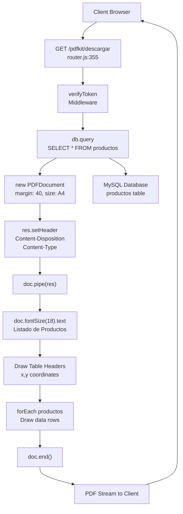
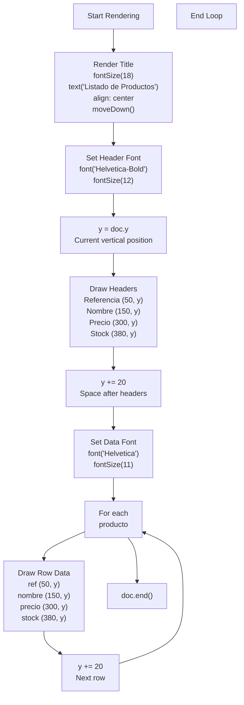
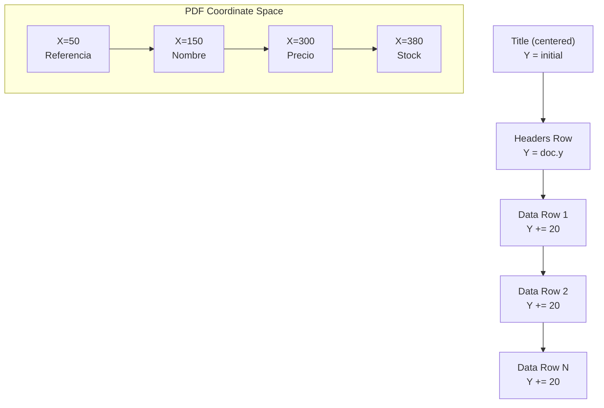
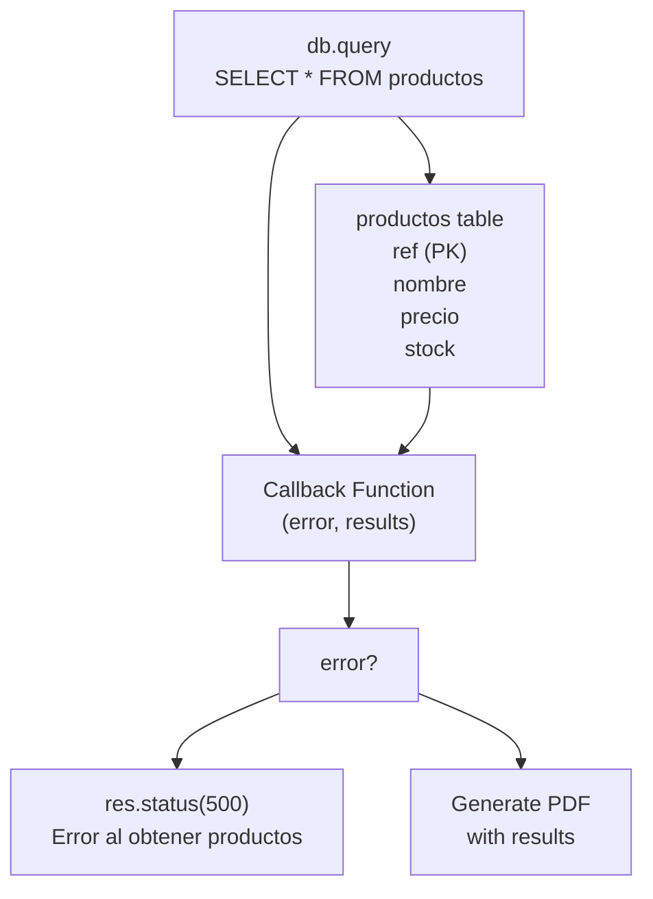
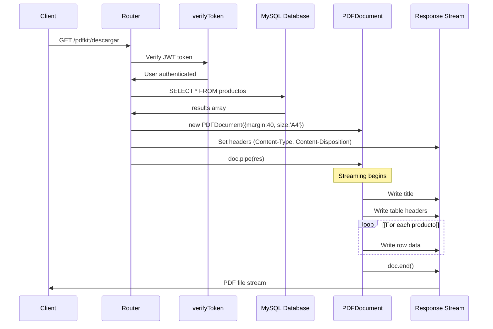

# PDFKit PDF Generation

> **Relevant source files**
> * [package-lock.json](https://github.com/moichuelo/registro/blob/544abbcc/package-lock.json)
> * [src/router.js](https://github.com/moichuelo/registro/blob/544abbcc/src/router.js)

## Purpose and Scope

This document covers the PDFKit-based programmatic PDF generation system that creates product reports with precise layout control. This approach directly generates PDF documents using drawing commands and coordinate positioning, contrasting with the HTML-to-PDF rendering approach. For the Puppeteer-based HTML rendering approach, see [Puppeteer PDF Generation](Puppeteer-PDF-Generation.md). For general PDF generation features, see [PDF Generation](PDF-Generation.md).

The PDFKit implementation provides:

* Programmatic PDF creation without HTML templates
* Direct control over layout positioning and styling
* Streaming response for efficient memory usage
* Product data export functionality for authenticated users

---

## Overview

The PDFKit PDF generation system creates product reports by programmatically drawing content onto a PDF document. Unlike the Puppeteer approach that renders HTML templates, PDFKit uses low-level drawing commands to place text at specific coordinates, providing precise control over layout but requiring manual positioning calculations.

**Key Characteristics:**

* **Route:** `GET /pdfkit/descargar`
* **Authentication:** Requires valid JWT via `verifyToken` middleware
* **Data Source:** `productos` table in MySQL database
* **Output Format:** PDF file with filename `productos_desde_cero.pdf`
* **Delivery Method:** Direct streaming via `doc.pipe(res)`

**Sources:** [src/router.js L355-L396](https://github.com/moichuelo/registro/blob/544abbcc/src/router.js#L355-L396)

 [package-lock.json L27](https://github.com/moichuelo/registro/blob/544abbcc/package-lock.json#L27-L27)

---

## Request Flow Architecture



**Sources:** [src/router.js L355-L396](https://github.com/moichuelo/registro/blob/544abbcc/src/router.js#L355-L396)

---

## Route Definition and Configuration

The PDFKit route is defined at [src/router.js L355-L396](https://github.com/moichuelo/registro/blob/544abbcc/src/router.js#L355-L396)

 with the following structure:

| Aspect | Configuration |
| --- | --- |
| HTTP Method | GET |
| Path | `/pdfkit/descargar` |
| Authentication | `verifyToken` middleware |
| Authorization | User-level access (any authenticated user) |
| Database Query | `SELECT * FROM productos` |
| Response Type | `application/pdf` |
| Content-Disposition | `attachment; filename="productos_desde_cero.pdf"` |

**Authentication Flow:**

1. Client must have valid JWT in `token` cookie
2. `verifyToken` middleware validates JWT signature and expiration
3. User information attached to `req.user` for potential logging
4. No role-based restriction (both users and admins can access)

**Sources:** [src/router.js L355-L396](https://github.com/moichuelo/registro/blob/544abbcc/src/router.js#L355-L396)

 [src/router.js L16](https://github.com/moichuelo/registro/blob/544abbcc/src/router.js#L16-L16)

---

## PDF Document Initialization

The PDF document is created with specific configuration parameters:

```javascript
const doc = new PDFDocument({ margin: 40, size: 'A4' });
```

**Configuration Parameters:**

| Parameter | Value | Purpose |
| --- | --- | --- |
| `margin` | `40` | Sets 40-point margin on all sides |
| `size` | `'A4'` | Standard paper size (210mm × 297mm) |

**Response Headers:**

* `Content-Disposition: attachment; filename="productos_desde_cero.pdf"` - Forces browser download
* `Content-Type: application/pdf` - Specifies MIME type

**Streaming Architecture:**
The document is piped directly to the response object at [src/router.js L367](https://github.com/moichuelo/registro/blob/544abbcc/src/router.js#L367-L367)

:

```
doc.pipe(res);
```

This approach streams the PDF content as it's generated rather than buffering the entire document in memory, providing efficient memory usage for large reports.

**Sources:** [src/router.js L361-L367](https://github.com/moichuelo/registro/blob/544abbcc/src/router.js#L361-L367)

---

## Content Rendering Process



**Sources:** [src/router.js L369-L395](https://github.com/moichuelo/registro/blob/544abbcc/src/router.js#L369-L395)

---

## Layout Positioning System

The PDFKit implementation uses absolute positioning with fixed X-coordinates for table columns:

### Column Layout

| Column | X Position | Content | Data Type |
| --- | --- | --- | --- |
| Referencia | 50 | `p.ref.toString()` | Integer (AUTO_INCREMENT) |
| Nombre | 150 | `p.nombre` | String (varchar(30)) |
| Precio | 300 | `Number(p.precio).toFixed(2)` | Decimal (10,2) |
| Stock | 380 | `p.stock.toString()` | Integer |

### Vertical Positioning

The Y-coordinate is managed dynamically:

1. **Initial Position:** Retrieved via `doc.y` after title at [src/router.js L375](https://github.com/moichuelo/registro/blob/544abbcc/src/router.js#L375-L375)
2. **Header Row:** Headers placed at current Y position
3. **Row Spacing:** Y incremented by 20 points between rows at [src/router.js L382](https://github.com/moichuelo/registro/blob/544abbcc/src/router.js#L382-L382)  and [src/router.js L391](https://github.com/moichuelo/registro/blob/544abbcc/src/router.js#L391-L391)

**Coordinate System Diagram:**



**Sources:** [src/router.js L373-L391](https://github.com/moichuelo/registro/blob/544abbcc/src/router.js#L373-L391)

---

## Font and Typography Configuration

### Font Specifications

The implementation uses two font weights from the Helvetica family:

| Context | Font | Size | Code Location |
| --- | --- | --- | --- |
| Title | (default) | 18 | [src/router.js L370](https://github.com/moichuelo/registro/blob/544abbcc/src/router.js#L370-L370) |
| Table Headers | Helvetica-Bold | 12 | [src/router.js L374](https://github.com/moichuelo/registro/blob/544abbcc/src/router.js#L374-L374) |
| Table Data | Helvetica | 11 | [src/router.js L384](https://github.com/moichuelo/registro/blob/544abbcc/src/router.js#L384-L384) |

### Text Rendering Methods

**Title Rendering:**

```
doc.fontSize(18).text("Listado de Productos", { align: "center" }).moveDown();
```

* Method chaining for font size, content, and alignment
* `moveDown()` adds vertical spacing after title

**Positioned Text:**

```
doc.text(content, x, y);
```

* Explicit X,Y coordinates for table cells
* No automatic line wrapping or overflow handling

**Sources:** [src/router.js L370-L390](https://github.com/moichuelo/registro/blob/544abbcc/src/router.js#L370-L390)

---

## Data Processing and Type Conversion

Products retrieved from the database undergo type conversion before rendering:

### Type Conversions

| Field | Database Type | Conversion | Reason |
| --- | --- | --- | --- |
| `ref` | INT(11) | `p.ref.toString()` | PDFKit requires strings |
| `nombre` | VARCHAR(30) | `p.nombre` | Already string |
| `precio` | DECIMAL(10,2) | `Number(p.precio).toFixed(2)` | Format to 2 decimals |
| `stock` | INT(11) | `p.stock.toString()` | PDFKit requires strings |

### Iteration Pattern

The data rendering loop at [src/router.js L386-L392](https://github.com/moichuelo/registro/blob/544abbcc/src/router.js#L386-L392)

 uses `forEach` to iterate through the `results` array:

```javascript
results.forEach((p) => {
    doc.text(p.ref.toString(), 50, y);
    doc.text(p.nombre, 150, y);
    doc.text(Number(p.precio).toFixed(2), 300, y);
    doc.text(p.stock.toString(), 380, y);
    y += 20;
});
```

**Sources:** [src/router.js L386-L392](https://github.com/moichuelo/registro/blob/544abbcc/src/router.js#L386-L392)

---

## Database Integration



**Query Details:**

* **SQL:** `SELECT * FROM productos`
* **Returns:** Array of product objects
* **Error Handling:** Returns HTTP 500 on query failure
* **Callback Pattern:** Traditional callback at [src/router.js L356-L396](https://github.com/moichuelo/registro/blob/544abbcc/src/router.js#L356-L396)

**Database Schema Reference:**
For complete `productos` table schema, see [productos Table](productos-Table.md).

**Sources:** [src/router.js L356-L359](https://github.com/moichuelo/registro/blob/544abbcc/src/router.js#L356-L359)

---

## PDFKit vs Puppeteer Comparison

| Aspect | PDFKit | Puppeteer |
| --- | --- | --- |
| **Route** | `/pdfkit/descargar` | `/pdf/descargar` |
| **Approach** | Programmatic drawing | HTML template rendering |
| **Template** | None (code-based) | `views/pdfTabla.ejs` |
| **Layout Method** | Absolute coordinates | CSS styling |
| **Memory Usage** | Low (streaming) | Higher (browser instance) |
| **Dependencies** | PDFKit only | Puppeteer + EJS + Chrome |
| **Flexibility** | Manual positioning | HTML/CSS flexibility |
| **Complexity** | Low-level control | Higher abstraction |
| **Performance** | Fast (direct PDF) | Slower (browser startup) |
| **Maintenance** | Position calculations | Template maintenance |

### When to Use Each Approach

**PDFKit (Current Page):**

* Simple tabular reports
* Known, fixed layouts
* Performance-critical scenarios
* Minimal external dependencies

**Puppeteer (Page 10.1):**

* Complex layouts with CSS
* Existing HTML templates
* Rich typography and graphics
* Need for print CSS features

**Sources:** [src/router.js L355-L396](https://github.com/moichuelo/registro/blob/544abbcc/src/router.js#L355-L396)

 [src/router.js L317-L353](https://github.com/moichuelo/registro/blob/544abbcc/src/router.js#L317-L353)

---

## Complete Generation Flow Diagram



**Sources:** [src/router.js L355-L396](https://github.com/moichuelo/registro/blob/544abbcc/src/router.js#L355-L396)

---

## Error Handling

### Database Query Errors

If the database query fails at [src/router.js L357](https://github.com/moichuelo/registro/blob/544abbcc/src/router.js#L357-L357)

:

```
if (error) {
    return res.status(500).send("Error al obtener productos");
}
```

**Error Response:**

* HTTP Status: 500
* Content-Type: text/html
* Body: "Error al obtener productos"

### Authentication Errors

Authentication failures are handled by the `verifyToken` middleware before reaching the route handler:

* Missing token → 401 response
* Invalid token → 401 response
* Expired token → 401 response

For authentication details, see [verifyToken Middleware](verifyToken-Middleware.md).

**Sources:** [src/router.js L355-L359](https://github.com/moichuelo/registro/blob/544abbcc/src/router.js#L355-L359)

---

## Document Finalization

The PDF document is finalized at [src/router.js L394](https://github.com/moichuelo/registro/blob/544abbcc/src/router.js#L394-L394)

:

```
doc.end();
```

**Finalization Process:**

1. `doc.end()` signals end of content writing
2. Remaining buffered content flushed to stream
3. PDF structure finalized (xref table, trailer)
4. Stream closed automatically
5. Client receives complete PDF file

**No Explicit Response Closure:**
The response is closed automatically when the piped stream ends. The route handler does not explicitly call `res.end()` because the stream handles this.

**Sources:** [src/router.js L394](https://github.com/moichuelo/registro/blob/544abbcc/src/router.js#L394-L394)

---

## Usage Example

**Client Request:**

```yaml
GET /pdfkit/descargar HTTP/1.1
Host: example.com
Cookie: token=eyJhbGciOiJIUzI1NiIsInR5cCI6IkpXVCJ9...
```

**Server Response:**

```
HTTP/1.1 200 OK
Content-Type: application/pdf
Content-Disposition: attachment; filename="productos_desde_cero.pdf"
Content-Length: [file size]

%PDF-1.3
[binary PDF content]
```

**Browser Behavior:**
The `attachment` disposition triggers a file download dialog with the suggested filename `productos_desde_cero.pdf`.

**Sources:** [src/router.js L364-L365](https://github.com/moichuelo/registro/blob/544abbcc/src/router.js#L364-L365)

---

## Implementation Dependencies

### NPM Packages

| Package | Version | Purpose |
| --- | --- | --- |
| `pdfkit` | 0.17.1 | PDF document generation |
| `express` | 5.1.0 | HTTP routing framework |
| `mysql2` | 3.14.1 | Database connectivity |
| `jsonwebtoken` | 9.0.2 | JWT authentication |

### Internal Dependencies

* `src/middlewares/verifyToken.js` - JWT validation
* `database/db.js` - MySQL connection pool
* `process.env.JWT_SECRET` - Token signing key

**Sources:** [package-lock.json L27-L28](https://github.com/moichuelo/registro/blob/544abbcc/package-lock.json#L27-L28)

 [src/router.js L1-L19](https://github.com/moichuelo/registro/blob/544abbcc/src/router.js#L1-L19)

---

## Performance Considerations

### Memory Efficiency

**Streaming Approach:**

* PDF content is piped directly to response stream
* No intermediate buffer for entire document
* Constant memory usage regardless of document size
* Suitable for large product catalogs

### Comparison Metrics

| Metric | PDFKit | Puppeteer |
| --- | --- | --- |
| Startup Time | ~0ms (library load) | ~500-1000ms (browser launch) |
| Memory Overhead | ~10-20MB | ~100-200MB |
| CPU Usage | Low | High (rendering engine) |
| Concurrency | High (lightweight) | Limited (browser instances) |

**Sources:** [src/router.js L355-L396](https://github.com/moichuelo/registro/blob/544abbcc/src/router.js#L355-L396)

---

## Limitations and Constraints

### Layout Limitations

1. **Fixed Positioning:** All coordinates are hardcoded
2. **No Overflow Handling:** Text exceeding column width is not wrapped
3. **No Pagination:** Large datasets may exceed single page
4. **Single Page Assumption:** No automatic page breaks

### Data Constraints

**Column Width Assumptions:**

* **Referencia:** Assumes short integer values
* **Nombre:** Maximum 30 characters (database constraint)
* **Precio:** Assumes standard currency format
* **Stock:** Assumes reasonable integer values

### Missing Features

* No page headers/footers
* No page numbering
* No automatic table continuation across pages
* No grid lines or borders
* No sorting or filtering options

**Sources:** [src/router.js L373-L391](https://github.com/moichuelo/registro/blob/544abbcc/src/router.js#L373-L391)

---

## Future Enhancement Possibilities

### Pagination Support

To handle large datasets, the implementation could:

1. Track vertical position (`y` coordinate)
2. Detect when approaching page bottom
3. Call `doc.addPage()` to create new page
4. Repeat headers on each page

### Dynamic Column Widths

Calculate column widths based on:

* Actual content length
* Available page width
* Font metrics

### Styling Enhancements

* Add table borders and grid lines
* Alternate row background colors
* Header background styling
* Footer with timestamp or page numbers

**Sources:** [src/router.js L355-L396](https://github.com/moichuelo/registro/blob/544abbcc/src/router.js#L355-L396)