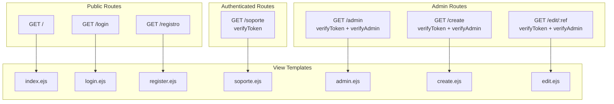
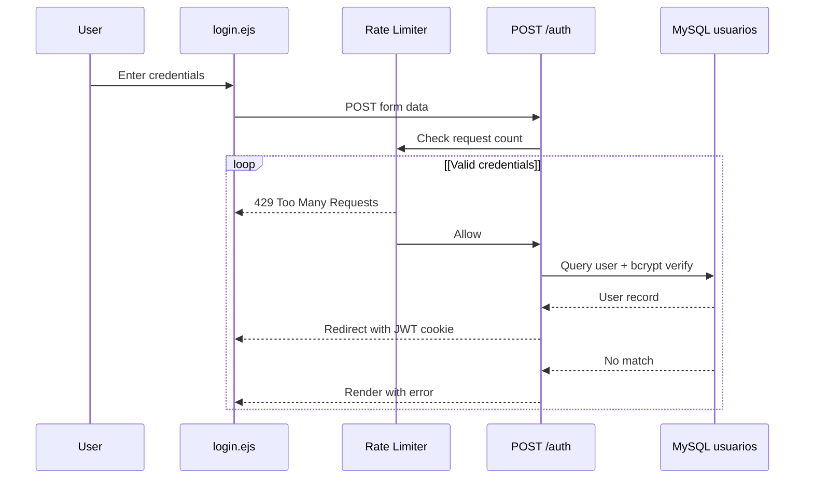
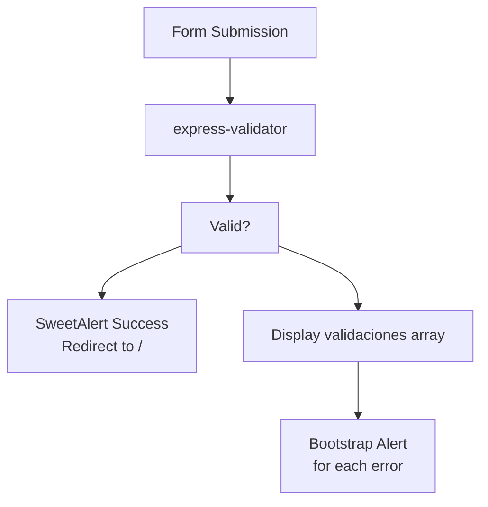
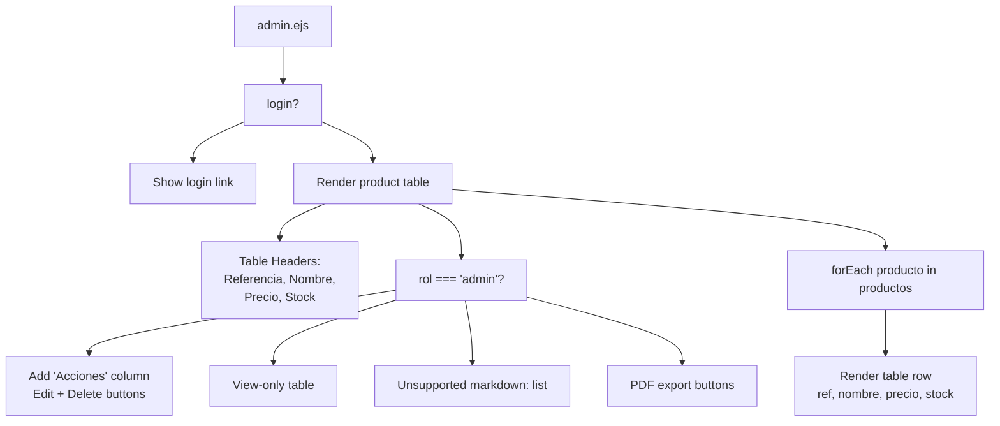
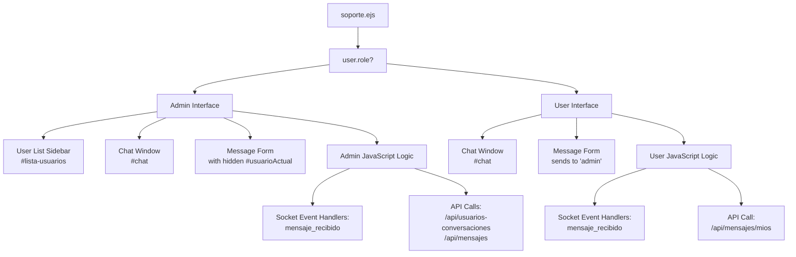
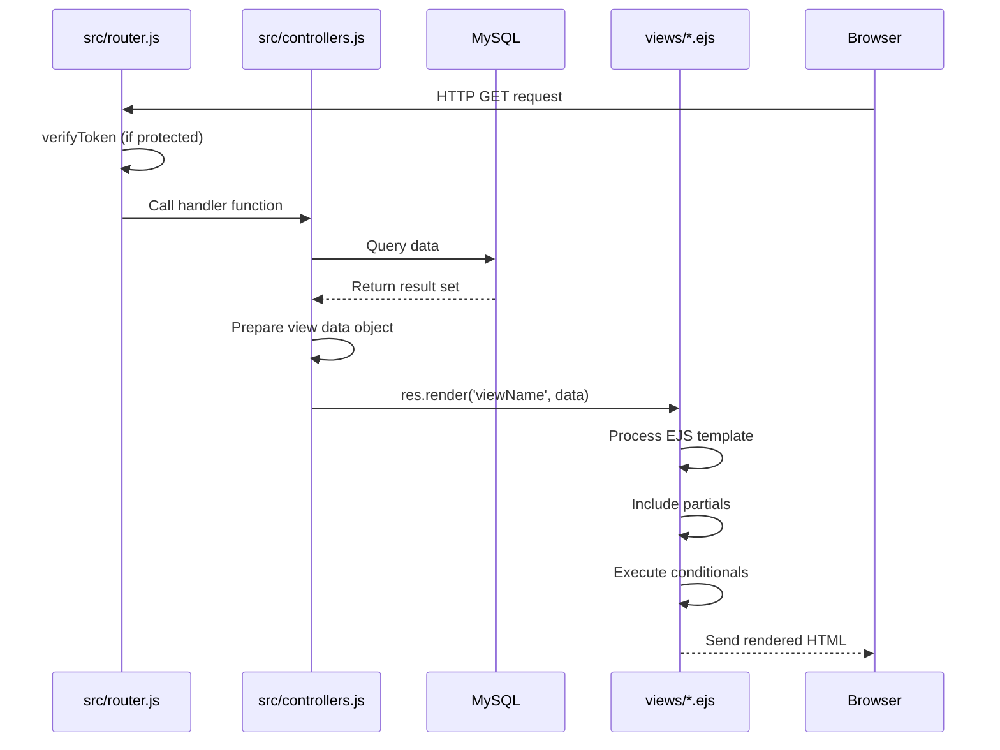

# Page Views

> **Relevant source files**
> * [proyecto.zip](https://github.com/moichuelo/registro/blob/544abbcc/proyecto.zip)
> * [public/css/style.css](https://github.com/moichuelo/registro/blob/544abbcc/public/css/style.css)
> * [views/admin.ejs](https://github.com/moichuelo/registro/blob/544abbcc/views/admin.ejs)
> * [views/index.ejs](https://github.com/moichuelo/registro/blob/544abbcc/views/index.ejs)
> * [views/register.ejs](https://github.com/moichuelo/registro/blob/544abbcc/views/register.ejs)
> * [views/soporte.ejs](https://github.com/moichuelo/registro/blob/544abbcc/views/soporte.ejs)

## Purpose and Scope

This document provides detailed documentation for all individual page templates (views) in the EJS-based presentation layer. Each page view is a template file that renders specific functionality such as user authentication, product management, or real-time chat.

For information about the master layout structure that these views extend, see [Template Structure](Template-Structure.md). For documentation on reusable components included in these views, see [Partial Components](Partial-Components.md).

---

## Overview of Page Views

The application contains the following page templates:

| View File | Route | Access Level | Purpose |
| --- | --- | --- | --- |
| `index.ejs` | `/` | Public | Homepage with welcome message |
| `login.ejs` | `/login` | Public | User authentication form |
| `register.ejs` | `/registro` | Public | New user registration form |
| `admin.ejs` | `/admin` | Admin only | Product management dashboard |
| `create.ejs` | `/create` | Admin only | Product creation form |
| `edit.ejs` | `/edit/:ref` | Admin only | Product edit form |
| `soporte.ejs` | `/soporte` | Authenticated | Real-time support chat interface |
| `administrador.ejs` | N/A | N/A | Placeholder/unused template |

**Sources:** [views/index.ejs](https://github.com/moichuelo/registro/blob/544abbcc/views/index.ejs)

 [views/login.ejs](https://github.com/moichuelo/registro/blob/544abbcc/views/login.ejs)

 [views/register.ejs](https://github.com/moichuelo/registro/blob/544abbcc/views/register.ejs)

 [views/admin.ejs](https://github.com/moichuelo/registro/blob/544abbcc/views/admin.ejs)

 [views/create.ejs](https://github.com/moichuelo/registro/blob/544abbcc/views/create.ejs)

 [views/edit.ejs](https://github.com/moichuelo/registro/blob/544abbcc/views/edit.ejs)

 [views/soporte.ejs](https://github.com/moichuelo/registro/blob/544abbcc/views/soporte.ejs)

 [views/administrador.ejs](https://github.com/moichuelo/registro/blob/544abbcc/views/administrador.ejs)

---

## Route-to-View Mapping



**Sources:** [src/router.js L1-L300](https://github.com/moichuelo/registro/blob/544abbcc/src/router.js#L1-L300)

 [views/index.ejs](https://github.com/moichuelo/registro/blob/544abbcc/views/index.ejs)

 [views/login.ejs](https://github.com/moichuelo/registro/blob/544abbcc/views/login.ejs)

 [views/register.ejs](https://github.com/moichuelo/registro/blob/544abbcc/views/register.ejs)

 [views/admin.ejs](https://github.com/moichuelo/registro/blob/544abbcc/views/admin.ejs)

 [views/create.ejs](https://github.com/moichuelo/registro/blob/544abbcc/views/create.ejs)

 [views/edit.ejs](https://github.com/moichuelo/registro/blob/544abbcc/views/edit.ejs)

 [views/soporte.ejs](https://github.com/moichuelo/registro/blob/544abbcc/views/soporte.ejs)

---

## index.ejs - Homepage

### Purpose

The homepage provides a welcome message and displays the current authentication status. It adapts its content based on whether the user is logged in.

### Template Structure

[views/index.ejs L1-L35](https://github.com/moichuelo/registro/blob/544abbcc/views/index.ejs#L1-L35)

### Data Requirements

| Variable | Type | Description |
| --- | --- | --- |
| `login` | Boolean | Whether user is authenticated |
| `user` | String/Object | Username or user object |
| `__` | Function | i18n translation function |

### Conditional Rendering

The view contains two primary branches:

* **Authenticated users**: Displays username and logout link with translation key `'cerrarSesion'`
* **Unauthenticated users**: Displays login link with translation key `'iniciarSesion'`

### Internationalization

The template uses i18n keys:

* `__('saludo')` - Welcome greeting
* `__('usuario')` - User label
* `__('cerrarSesion')` - Logout text
* `__('iniciarSesion')` - Login text

[views/index.ejs L13-L31](https://github.com/moichuelo/registro/blob/544abbcc/views/index.ejs#L13-L31)

### Included Components

* `partials/head` - HTML head metadata
* `partials/header` - Navigation header
* `partials/popover` - Popover component (if enabled)
* `partials/footer` - Page footer

**Sources:** [views/index.ejs L1-L35](https://github.com/moichuelo/registro/blob/544abbcc/views/index.ejs#L1-L35)

---

## login.ejs - Login Form

### Purpose

Provides the authentication form where users enter credentials to access the system. Handles JWT-based authentication with rate limiting.

### Template Structure

[views/login.ejs L1-L50](https://github.com/moichuelo/registro/blob/544abbcc/views/login.ejs#L1-L50)

### Form Configuration

| Field | Type | Attributes |
| --- | --- | --- |
| `user` | text input | `name="user"`, placeholder, retained on validation error |
| `pass` | password input | `name="pass"`, placeholder, cleared on submission |

### Authentication Flow



### Client-Side Features

The login view includes SweetAlert2 integration for displaying alerts [views/login.ejs L35-L50](https://github.com/moichuelo/registro/blob/544abbcc/views/login.ejs#L35-L50)

Alert configuration:

* `alertTitle` - Alert header text
* `alertMessage` - Alert body text
* `alertIcon` - Icon type (success, error, warning)
* `showConfirmButton` - Boolean to show/hide confirmation
* `timer` - Auto-dismiss timer in milliseconds
* `ruta` - Redirect path after alert

### Validation Display

When validation fails, the template can display error messages passed from the server [views/login.ejs L20-L28](https://github.com/moichuelo/registro/blob/544abbcc/views/login.ejs#L20-L28)

**Sources:** [views/login.ejs L1-L50](https://github.com/moichuelo/registro/blob/544abbcc/views/login.ejs#L1-L50)

---

## register.ejs - Registration Form

### Purpose

New user registration form with file upload support for profile images. Includes comprehensive validation and feedback.

### Template Structure

[views/register.ejs L1-L85](https://github.com/moichuelo/registro/blob/544abbcc/views/register.ejs#L1-L85)

### Form Configuration

| Field | Name | Type | Description |
| --- | --- | --- | --- |
| Username | `user` | text | Unique user identifier |
| Name | `name` | text | Full name |
| Role | `rol` | select | "admin" or "user" |
| Password | `pass` | password | Hashed with bcrypt |
| Email | `email` | text | Email address |
| Age | `edad` | text | User's age |
| Profile Image | `profileImage` | file | Image upload (optional) |

[views/register.ejs L7-L36](https://github.com/moichuelo/registro/blob/544abbcc/views/register.ejs#L7-L36)

### Form Encoding

The form uses `enctype="multipart/form-data"` to support file uploads for profile images [views/register.ejs L7](https://github.com/moichuelo/registro/blob/544abbcc/views/register.ejs#L7-L7)

### Value Retention on Error

When validation fails, the form retains previously entered values (except password) using conditional rendering:

```

```

[views/register.ejs L9-L33](https://github.com/moichuelo/registro/blob/544abbcc/views/register.ejs#L9-L33)

### Validation Feedback



The template displays validation errors using Bootstrap alert components [views/register.ejs L44-L56](https://github.com/moichuelo/registro/blob/544abbcc/views/register.ejs#L44-L56)

Each validation error contains:

* `msg` - Error message text
* Rendered as a dismissible alert with icon

### SweetAlert Integration

Success or error feedback is displayed via SweetAlert2 [views/register.ejs L60-L74](https://github.com/moichuelo/registro/blob/544abbcc/views/register.ejs#L60-L74)

Variables:

* `alert` - Boolean to trigger alert
* `alertTitle` - Title text
* `alertMessage` - Message text
* `alertIcon` - Icon type
* `showConfirmButton` - Show/hide confirm button
* `timer` - Auto-close timer
* `ruta` - Post-alert redirect path

### SVG Icon Definitions

The template includes inline SVG symbol definitions for validation icons [views/register.ejs L77-L83](https://github.com/moichuelo/registro/blob/544abbcc/views/register.ejs#L77-L83)

**Sources:** [views/register.ejs L1-L85](https://github.com/moichuelo/registro/blob/544abbcc/views/register.ejs#L1-L85)

---

## admin.ejs - Product Management Dashboard

### Purpose

Administrative dashboard displaying all products in a table with CRUD operations. Provides access to product creation, editing, deletion, and PDF export functionality.

### Template Structure

[views/admin.ejs L1-L71](https://github.com/moichuelo/registro/blob/544abbcc/views/admin.ejs#L1-L71)

### Data Requirements

| Variable | Type | Description |
| --- | --- | --- |
| `login` | Boolean | Authentication status |
| `user` | Object | User object with `imagen` property |
| `rol` | String | User role ("admin" or "user") |
| `productos` | Array | Array of product objects |
| `msg` | String | Error/info message (if not logged in) |

### User Profile Display

If the user has a profile image, it's displayed at the top [views/admin.ejs L4-L7](https://github.com/moichuelo/registro/blob/544abbcc/views/admin.ejs#L4-L7)

```

```

### Product Table Structure



### Admin-Only Features

**Create Button**: Displayed at the top for admins [views/admin.ejs L11-L13](https://github.com/moichuelo/registro/blob/544abbcc/views/admin.ejs#L11-L13)

```

```

**Action Buttons per Row**: Edit and Delete for each product [views/admin.ejs L41-L49](https://github.com/moichuelo/registro/blob/544abbcc/views/admin.ejs#L41-L49)

* Edit: Links to `/edit/<%= producto.ref %>`
* Delete: Links to `/delete/<%= producto.ref %>`

**PDF Export Options**: Two PDF generation approaches [views/admin.ejs L55-L59](https://github.com/moichuelo/registro/blob/544abbcc/views/admin.ejs#L55-L59)

1. Puppeteer: `/pdf/descargar` - HTML-to-PDF conversion
2. PDFKit: `/pdfkit/descargar` - Programmatic PDF generation

### Product Data Iteration

The template iterates over the `productos` array to render table rows [views/admin.ejs L27-L52](https://github.com/moichuelo/registro/blob/544abbcc/views/admin.ejs#L27-L52)

Each product object contains:

* `ref` - Product reference (primary key)
* `nombre` - Product name
* `precio` - Product price
* `stock` - Stock quantity

### Role-Based Rendering

Conditional rendering based on `rol` variable ensures admin-only features are hidden from regular users [views/admin.ejs L10-L13](https://github.com/moichuelo/registro/blob/544abbcc/views/admin.ejs#L10-L13)

 [views/admin.ejs L21-L23](https://github.com/moichuelo/registro/blob/544abbcc/views/admin.ejs#L21-L23)

 [views/admin.ejs L41-L50](https://github.com/moichuelo/registro/blob/544abbcc/views/admin.ejs#L41-L50)

**Sources:** [views/admin.ejs L1-L71](https://github.com/moichuelo/registro/blob/544abbcc/views/admin.ejs#L1-L71)

---

## create.ejs - Product Creation Form

### Purpose

Form for administrators to create new products. Provides input fields for all product attributes.

### Template Structure

[views/create.ejs L1-L50](https://github.com/moichuelo/registro/blob/544abbcc/views/create.ejs#L1-L50)

### Form Configuration

| Field | Name | Type | Validation |
| --- | --- | --- | --- |
| Reference | `ref` | text | Required, unique |
| Name | `nombre` | text | Required |
| Price | `precio` | text | Required, decimal |
| Stock | `stock` | text | Required, integer |

[views/create.ejs L15-L30](https://github.com/moichuelo/registro/blob/544abbcc/views/create.ejs#L15-L30)

### Form Actions

The form submits to `POST /create` and includes:

* **Save button**: Submits the form
* **Cancel link**: Returns to `/admin` without saving

[views/create.ejs L32-L34](https://github.com/moichuelo/registro/blob/544abbcc/views/create.ejs#L32-L34)

### Value Retention

Similar to the registration form, input values are retained on validation error using the `valores` object [views/create.ejs L16-L30](https://github.com/moichuelo/registro/blob/544abbcc/views/create.ejs#L16-L30)

### Validation Display

Validation errors are displayed using a dismissible alert [views/create.ejs L38-L46](https://github.com/moichuelo/registro/blob/544abbcc/views/create.ejs#L38-L46)

**Sources:** [views/create.ejs L1-L50](https://github.com/moichuelo/registro/blob/544abbcc/views/create.ejs#L1-L50)

---

## edit.ejs - Product Edit Form

### Purpose

Form for administrators to edit existing products. Pre-populates fields with current product data.

### Template Structure

[views/edit.ejs L1-L50](https://github.com/moichuelo/registro/blob/544abbcc/views/edit.ejs#L1-L50)

### Form Configuration

The form structure mirrors `create.ejs` but uses `POST /update` and includes pre-populated values from the `producto` object passed by the controller.

Key difference: The reference field is read-only since it's the primary key [views/edit.ejs L15-L20](https://github.com/moichuelo/registro/blob/544abbcc/views/edit.ejs#L15-L20)

### Data Requirements

| Variable | Type | Description |
| --- | --- | --- |
| `producto` | Object | Product to edit with ref, nombre, precio, stock |
| `validaciones` | Array | Validation errors (if any) |

### Pre-Population Pattern

```

```

[views/edit.ejs L22-L29](https://github.com/moichuelo/registro/blob/544abbcc/views/edit.ejs#L22-L29)

### Form Actions

* **Update button**: Submits changes to `/update`
* **Cancel link**: Returns to `/admin` without saving

**Sources:** [views/edit.ejs L1-L50](https://github.com/moichuelo/registro/blob/544abbcc/views/edit.ejs#L1-L50)

---

## soporte.ejs - Real-Time Support Chat

### Purpose

Bi-directional real-time messaging interface using Socket.IO. Provides two distinct views: admin view with multi-user conversation management, and user view with single admin conversation.

### Template Structure

[views/soporte.ejs L1-L191](https://github.com/moichuelo/registro/blob/544abbcc/views/soporte.ejs#L1-L191)

### Architecture Overview



### Data Requirements

| Variable | Type | Description |
| --- | --- | --- |
| `user` | Object | User object with `username` and `role` properties |

[views/soporte.ejs L6](https://github.com/moichuelo/registro/blob/544abbcc/views/soporte.ejs#L6-L6)

### Admin View Structure

**HTML Layout** [views/soporte.ejs L8-L24](https://github.com/moichuelo/registro/blob/544abbcc/views/soporte.ejs#L8-L24)

* Two-column layout using Bootstrap grid
* Left column (3 cols): User list `#lista-usuarios`
* Right column (9 cols): Chat window `#chat` and message form `#formulario`
* Hidden input `#usuarioActual` tracks selected conversation

**JavaScript State Management** [views/soporte.ejs L62-L66](https://github.com/moichuelo/registro/blob/544abbcc/views/soporte.ejs#L62-L66)

```

```

**User List Management** [views/soporte.ejs L88-L102](https://github.com/moichuelo/registro/blob/544abbcc/views/soporte.ejs#L88-L102)

* Function `agregarUsuarioLista(usuario)` dynamically adds users
* Each list item is clickable to switch conversations
* Visual indicators: green for viewed, red for new messages

**Conversation Rendering** [views/soporte.ejs L68-L86](https://github.com/moichuelo/registro/blob/544abbcc/views/soporte.ejs#L68-L86)

```

```

**API Integration**

1. **Fetch User List** [views/soporte.ejs L104-L112](https://github.com/moichuelo/registro/blob/544abbcc/views/soporte.ejs#L104-L112) ``` ```
2. **Load Message History** [views/soporte.ejs L114-L125](https://github.com/moichuelo/registro/blob/544abbcc/views/soporte.ejs#L114-L125) ``` ```

**Socket.IO Event Handling**

* **Receive Messages** [views/soporte.ejs L127-L147](https://github.com/moichuelo/registro/blob/544abbcc/views/soporte.ejs#L127-L147) * Listens for `mensaje_recibido` events * Updates `conversaciones` state * Adds visual notification if not active conversation * Auto-renders if conversation is currently open
* **Send Messages** [views/soporte.ejs L149-L162](https://github.com/moichuelo/registro/blob/544abbcc/views/soporte.ejs#L149-L162) * Form submission emits `mensaje_privado` event * Includes `para` (recipient) and `mensaje` (content) * Updates local state and UI immediately

### User View Structure

**HTML Layout** [views/soporte.ejs L25-L33](https://github.com/moichuelo/registro/blob/544abbcc/views/soporte.ejs#L25-L33)

* Simplified single-column layout
* Chat window `#chat`
* Message form `#formulario` (no hidden recipient field needed)

**JavaScript Initialization** [views/soporte.ejs L164-L171](https://github.com/moichuelo/registro/blob/544abbcc/views/soporte.ejs#L164-L171)

```

```

**Socket.IO Event Handling**

* **Receive Messages** [views/soporte.ejs L173-L177](https://github.com/moichuelo/registro/blob/544abbcc/views/soporte.ejs#L173-L177) * Simpler handler, just appends to chat * No conversation switching logic
* **Send Messages** [views/soporte.ejs L179-L187](https://github.com/moichuelo/registro/blob/544abbcc/views/soporte.ejs#L179-L187) * Always sends to `"admin"` as recipient * Displays as "Tú" (You) in the UI

### Shared Client-Side Functions

**Date Formatting** [views/soporte.ejs L44-L52](https://github.com/moichuelo/registro/blob/544abbcc/views/soporte.ejs#L44-L52)

```

```

**Message Rendering** [views/soporte.ejs L54-L60](https://github.com/moichuelo/registro/blob/544abbcc/views/soporte.ejs#L54-L60)

```

```

### Socket.IO Client Setup

[views/soporte.ejs L37-L42](https://github.com/moichuelo/registro/blob/544abbcc/views/soporte.ejs#L37-L42)

```

```

### Visual Notification System

The admin view implements a color-coded notification system:

| State | Color | Meaning |
| --- | --- | --- |
| Green + Bold | `text-success fw-bold` | Currently viewed conversation |
| Red + Bold | `text-danger fw-bold` | New unread message |
| Default | No special class | Viewed but not active |

[views/soporte.ejs L77-L85](https://github.com/moichuelo/registro/blob/544abbcc/views/soporte.ejs#L77-L85)

 [views/soporte.ejs L136-L142](https://github.com/moichuelo/registro/blob/544abbcc/views/soporte.ejs#L136-L142)

**Sources:** [views/soporte.ejs L1-L191](https://github.com/moichuelo/registro/blob/544abbcc/views/soporte.ejs#L1-L191)

---

## administrador.ejs - Placeholder Template

### Purpose

This appears to be an unused or placeholder template file.

### Content

[views/administrador.ejs L1-L2](https://github.com/moichuelo/registro/blob/544abbcc/views/administrador.ejs#L1-L2)

The file contains only include statements for partials with minimal content. It may have been intended for a specific admin view that was later replaced by `admin.ejs`.

**Sources:** [views/administrador.ejs L1-L2](https://github.com/moichuelo/registro/blob/544abbcc/views/administrador.ejs#L1-L2)

---

## Common View Patterns

### Layout Inheritance

All page views follow the same inclusion pattern:

```

```

### Conditional Rendering Based on Authentication

Most views use conditional logic to adapt content:

```

```

### Form Value Retention

Forms use a consistent pattern to retain values on validation errors:

```

```

### Bootstrap Integration

All views use Bootstrap classes for styling:

* Grid system (`container`, `row`, `col-md-*`)
* Form controls (`form-control`, `btn`)
* Tables (`table`, `table-bordered`, `table-striped`)
* Alerts (`alert`, `alert-danger`)

### Icon Libraries

Views use Boxicons for UI icons:

* `bx bxs-plus-circle` - Add/create
* `bx bxs-edit` - Edit
* `bx bxs-trash` - Delete

**Sources:** [views/index.ejs](https://github.com/moichuelo/registro/blob/544abbcc/views/index.ejs)

 [views/login.ejs](https://github.com/moichuelo/registro/blob/544abbcc/views/login.ejs)

 [views/register.ejs](https://github.com/moichuelo/registro/blob/544abbcc/views/register.ejs)

 [views/admin.ejs](https://github.com/moichuelo/registro/blob/544abbcc/views/admin.ejs)

 [views/create.ejs](https://github.com/moichuelo/registro/blob/544abbcc/views/create.ejs)

 [views/edit.ejs](https://github.com/moichuelo/registro/blob/544abbcc/views/edit.ejs)

 [views/soporte.ejs](https://github.com/moichuelo/registro/blob/544abbcc/views/soporte.ejs)

---

## Data Flow from Routes to Views



### Example: Admin View Data Flow

```

```

The view receives these variables in scope and uses them in EJS tags:

* `<%= user.username %>` - Output escaped
* `<%- include('partial') %>` - Unescaped include
* `<% if (login) { %>` - Control flow

**Sources:** [src/router.js L1-L300](https://github.com/moichuelo/registro/blob/544abbcc/src/router.js#L1-L300)

 [views/admin.ejs L1-L71](https://github.com/moichuelo/registro/blob/544abbcc/views/admin.ejs#L1-L71)

 [views/index.ejs L1-L35](https://github.com/moichuelo/registro/blob/544abbcc/views/index.ejs#L1-L35)