# Partial Components

> **Relevant source files**
> * [public/css/style.css](https://github.com/moichuelo/registro/blob/544abbcc/public/css/style.css)
> * [views/admin.ejs](https://github.com/moichuelo/registro/blob/544abbcc/views/admin.ejs)
> * [views/index.ejs](https://github.com/moichuelo/registro/blob/544abbcc/views/index.ejs)
> * [views/partials/header.ejs](https://github.com/moichuelo/registro/blob/544abbcc/views/partials/header.ejs)
> * [views/register.ejs](https://github.com/moichuelo/registro/blob/544abbcc/views/register.ejs)

## Purpose and Scope

This document describes the reusable partial components in the EJS template system. Partials are modular template fragments stored in the `views/partials/` directory that are included across multiple page views to ensure consistent UI elements and reduce code duplication.

For information about the overall template structure and layout inheritance, see [Template Structure](Template-Structure.md). For documentation of individual page templates that use these partials, see [Page Views](Page-Views.md).

## Overview

The application uses four primary partial components that are included across various page templates:

| Partial | File Path | Purpose |
| --- | --- | --- |
| `head` | `views/partials/head.ejs` | HTML head section with meta tags, CSS links, and fonts |
| `header` | `views/partials/header.ejs` | Navigation bar with menu items and language switcher |
| `footer` | `views/partials/footer.ejs` | Footer section with copyright and links |
| `popover` | `views/partials/popover.ejs` | Bootstrap popover/alert components |

**Sources:** [views/index.ejs L1-L35](https://github.com/moichuelo/registro/blob/544abbcc/views/index.ejs#L1-L35)

 [views/admin.ejs L1-L71](https://github.com/moichuelo/registro/blob/544abbcc/views/admin.ejs#L1-L71)

 [views/register.ejs L1-L85](https://github.com/moichuelo/registro/blob/544abbcc/views/register.ejs#L1-L85)

## Partial Inclusion Mechanism

Partials are included in page templates using the EJS `include` directive with the following syntax:

```
<%- include('partials/header') %>
```

The `<%-` tag renders the included content without HTML escaping, allowing the partial's HTML to be directly inserted into the parent template. The file extension `.ejs` is implied and omitted from the include path.

### Diagram: Partial Inclusion Flow


**Sources:** [views/index.ejs L1-L2](https://github.com/moichuelo/registro/blob/544abbcc/views/index.ejs#L1-L2)

 [views/admin.ejs L1](https://github.com/moichuelo/registro/blob/544abbcc/views/admin.ejs#L1-L1)

 [views/register.ejs L1-L3](https://github.com/moichuelo/registro/blob/544abbcc/views/register.ejs#L1-L3)

## head.ejs Partial

The `head` partial contains the HTML `<head>` section elements that are consistent across all pages. While the file is not directly provided in the source files, it is consistently included as the first partial in all page templates.

### Responsibilities

* HTML document metadata (`<meta>` tags)
* CSS stylesheet links (Bootstrap, custom stylesheets)
* Font declarations (Montserrat, Open Sans from `docs/fonts/`)
* Favicon and page title configuration
* Additional `<head>` elements required globally

### Typical Inclusion Pattern

```
<%- include('partials/head') %>
```

This partial is always included first, before the `header` partial, as it must complete before the `<body>` tag opens.

**Sources:** [views/index.ejs L1](https://github.com/moichuelo/registro/blob/544abbcc/views/index.ejs#L1-L1)

 [views/admin.ejs L1](https://github.com/moichuelo/registro/blob/544abbcc/views/admin.ejs#L1-L1)

 [views/register.ejs L1](https://github.com/moichuelo/registro/blob/544abbcc/views/register.ejs#L1-L1)

## header.ejs Partial

The `header` partial implements the primary navigation bar and language switching interface. It is located at [views/partials/header.ejs L1-L55](https://github.com/moichuelo/registro/blob/544abbcc/views/partials/header.ejs#L1-L55)

 and contains both the closing `</head>` tag and the opening `<body>` tag, making it a transitional partial between document metadata and body content.

### Structure


**Sources:** [views/partials/header.ejs L1-L55](https://github.com/moichuelo/registro/blob/544abbcc/views/partials/header.ejs#L1-L55)

### Navigation Links

The header provides four primary navigation links:

| Link Text | Route | Purpose |
| --- | --- | --- |
| Home | `/` | Navigate to homepage |
| Iniciar sesión | `/login` | Navigate to login page |
| Registro | `/registro` | Navigate to registration page |
| Admin | `/admin` | Navigate to admin dashboard |
| Soporte | `/soporte` | Navigate to support chat |

**Sources:** [views/partials/header.ejs L7-L24](https://github.com/moichuelo/registro/blob/544abbcc/views/partials/header.ejs#L7-L24)

### Language Switcher Implementation

The header includes a bilingual interface switcher in the right-aligned navigation section (`navbar-nav ms-auto`):

```mermaid
flowchart TD

LangUI["Language Switcher UI"]
EsOption["Spanish Option"]
EnOption["English Option"]
EsFlag["Flag image: /resources/img/es.png"]
EsEmoji["Emoji: 🇪🇸"]
EsActive["Active class if lang === 'es'"]
EnFlag["Flag image: /resources/img/en.png"]
EnEmoji["Emoji: 🇬🇧"]
EnActive["Active class if lang === 'en'"]
ChangeLang["changeLang('es')"]
ChangeLang2["changeLang('en')"]
RouteCall["/set-lang/:lang?returnTo=..."]

LangUI --> EsOption
LangUI --> EnOption
EsOption --> EsFlag
EsOption --> EsEmoji
EsOption --> EsActive
EnOption --> EnFlag
EnOption --> EnEmoji
EnOption --> EnActive
EsOption --> ChangeLang
EnOption --> ChangeLang2
ChangeLang --> RouteCall
ChangeLang2 --> RouteCall
```



**Sources:** [views/partials/header.ejs L31-L54](https://github.com/moichuelo/registro/blob/544abbcc/views/partials/header.ejs#L31-L54)

### changeLang Function

The header includes inline JavaScript that handles language switching:

```javascript
function changeLang(lang) {
    const currentPath = window.location.pathname + window.location.search;
    window.location.href = `/set-lang/${lang}?returnTo=${encodeURIComponent(currentPath)}`;
}
```

This function:

1. Captures the current page path and query string
2. Navigates to `/set-lang/:lang` route with the current page as `returnTo` parameter
3. Allows the server to set the language cookie and redirect back to the originating page

**Sources:** [views/partials/header.ejs L49-L54](https://github.com/moichuelo/registro/blob/544abbcc/views/partials/header.ejs#L49-L54)

### Active Language Indicator

The language links use conditional CSS classes to highlight the currently active language:

```
class="nav-link idioma d-flex align-items-center <%= lang === 'es' ? 'active' : '' %>"
```

The `idioma.active` class applies a blue background color (`#b5c1e2`) to visually indicate the current language selection.

**Sources:** [views/partials/header.ejs L33-L44](https://github.com/moichuelo/registro/blob/544abbcc/views/partials/header.ejs#L33-L44)

 [public/css/style.css L8-L12](https://github.com/moichuelo/registro/blob/544abbcc/public/css/style.css#L8-L12)

### Bootstrap Integration

The header uses Bootstrap 5 navbar components:

* `navbar navbar-expand-lg navbar-light bg-light` - Main navbar container
* `navbar-toggler` - Mobile responsive menu toggle button
* `collapse navbar-collapse` - Collapsible menu content
* `navbar-nav` - Navigation items container
* `nav-item` and `nav-link` - Individual navigation links

**Sources:** [views/partials/header.ejs L5-L29](https://github.com/moichuelo/registro/blob/544abbcc/views/partials/header.ejs#L5-L29)

## footer.ejs Partial

The `footer` partial provides consistent footer content across all pages. While the file contents are not directly visible in the provided sources, it is consistently included at the end of page templates.

### Responsibilities

* Copyright information
* Footer navigation links
* Contact information or social media links
* Additional footer content

### CSS Styling

The footer is styled with classes defined in the main stylesheet:

| CSS Class | Purpose |
| --- | --- |
| `footer` | Main footer container with dark green background (`#143d20`) |
| `footer-container` | Flex container for footer sections, max-width 1100px |
| `footer-section` | Individual footer columns with flexible layout |
| `footer-bottom` | Bottom footer text with smaller font size |

**Sources:** [public/css/style.css L278-L331](https://github.com/moichuelo/registro/blob/544abbcc/public/css/style.css#L278-L331)

### Inclusion Pattern

```
<%- include('partials/footer') %>
```

The footer partial is always included last, after all page content, and typically preceded by closing any open content containers.

**Sources:** [views/index.ejs L35](https://github.com/moichuelo/registro/blob/544abbcc/views/index.ejs#L35-L35)

 [views/admin.ejs L71](https://github.com/moichuelo/registro/blob/544abbcc/views/admin.ejs#L71-L71)

 [views/register.ejs L85](https://github.com/moichuelo/registro/blob/544abbcc/views/register.ejs#L85-L85)

## popover.ejs Partial

The `popover` partial provides Bootstrap alert and popover components that can be included on pages requiring notification or validation feedback displays.

### Usage

The popover partial is selectively included on pages that require alert functionality, such as the homepage:

```
<%- include('partials/popover') %>
```

Not all pages include this partial, as it is only needed where alerts or popovers are displayed to users.

**Sources:** [views/index.ejs L34](https://github.com/moichuelo/registro/blob/544abbcc/views/index.ejs#L34-L34)

## Common Usage Patterns

### Standard Page Structure

Most page templates follow this inclusion pattern:

```
<%- include('partials/head') %>
<%- include('partials/header') %>

<!-- Page-specific content -->

<%- include('partials/footer') %>
```

**Sources:** [views/index.ejs L1-L35](https://github.com/moichuelo/registro/blob/544abbcc/views/index.ejs#L1-L35)

 [views/admin.ejs L1-L71](https://github.com/moichuelo/registro/blob/544abbcc/views/admin.ejs#L1-L71)

### Pages with Alerts

Pages that display validation errors or success messages include the popover partial:

```
<%- include('partials/head') %>
<%- include('partials/header') %>

<!-- Page content -->

<%- include('partials/popover') %>
<%- include('partials/footer') %>
```

**Sources:** [views/index.ejs L1-L35](https://github.com/moichuelo/registro/blob/544abbcc/views/index.ejs#L1-L35)

### Registration Page Pattern

The registration page demonstrates a variant pattern with additional CSS:

```
<%- include('partials/head') %>
<link rel="stylesheet" href="/resources/css/body.css">
<%- include('partials/header') %>

<!-- Registration form -->

<%- include('partials/footer') %>
```

This shows that additional stylesheets can be injected between the head and header partials when page-specific styling is required.

**Sources:** [views/register.ejs L1-L3](https://github.com/moichuelo/registro/blob/544abbcc/views/register.ejs#L1-L3)

## Diagram: Partial Component Relationships


**Sources:** [views/partials/header.ejs L1-L55](https://github.com/moichuelo/registro/blob/544abbcc/views/partials/header.ejs#L1-L55)

 [public/css/style.css L1-L353](https://github.com/moichuelo/registro/blob/544abbcc/public/css/style.css#L1-L353)

## Data Passed to Partials

Partials have access to the same template variables as their parent page templates. The header partial specifically uses:

| Variable | Type | Purpose |
| --- | --- | --- |
| `lang` | String | Current language code ('es' or 'en') for active language highlighting |
| `login` | Boolean | (Used in parent pages) Indicates if user is authenticated |
| `user` | String/Object | (Used in parent pages) Current user information |

These variables are set by route handlers in [src/router.js](https://github.com/moichuelo/registro/blob/544abbcc/src/router.js)

 and passed through the `res.render()` call that renders the parent page template.

**Sources:** [views/partials/header.ejs L33-L44](https://github.com/moichuelo/registro/blob/544abbcc/views/partials/header.ejs#L33-L44)

 [views/index.ejs L15-L31](https://github.com/moichuelo/registro/blob/544abbcc/views/index.ejs#L15-L31)

## Integration with Internationalization

The header partial integrates closely with the i18n system (documented in [#11](https://github.com/moichuelo/registro/blob/544abbcc/#11)

). The language switcher in the header:

1. Displays current language using the `lang` template variable
2. Provides clickable links to switch languages
3. Calls the `/set-lang/:lang` route to change the language preference
4. Preserves the current page location via the `returnTo` query parameter

The `changeLang()` function enables seamless language switching without losing the user's current page context.

**Sources:** [views/partials/header.ejs L31-L54](https://github.com/moichuelo/registro/blob/544abbcc/views/partials/header.ejs#L31-L54)