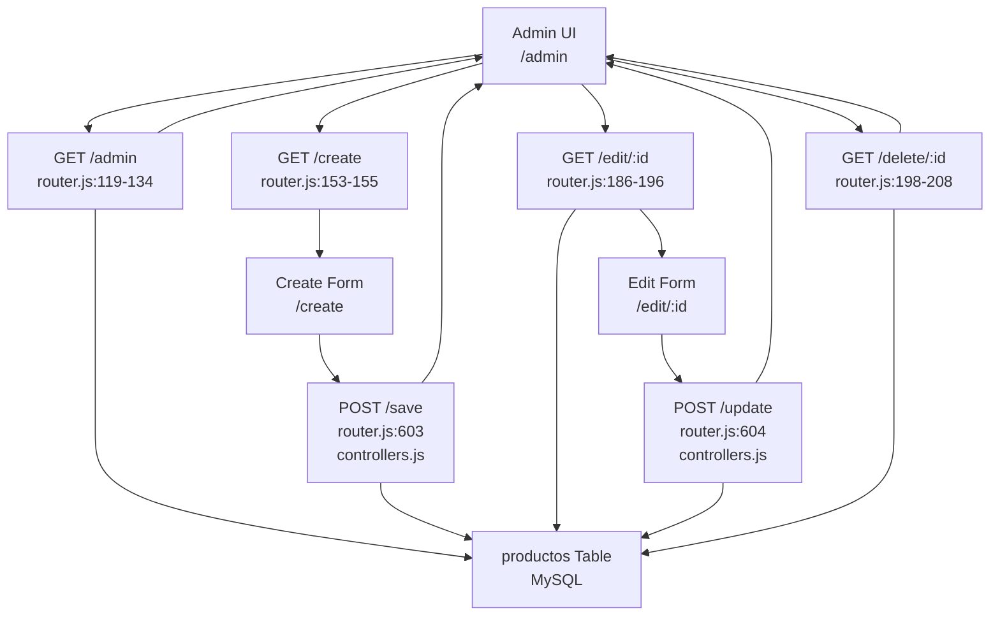
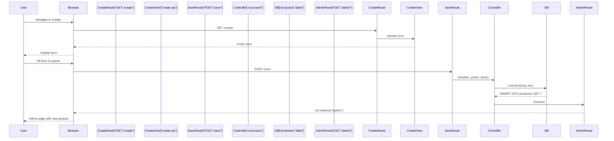
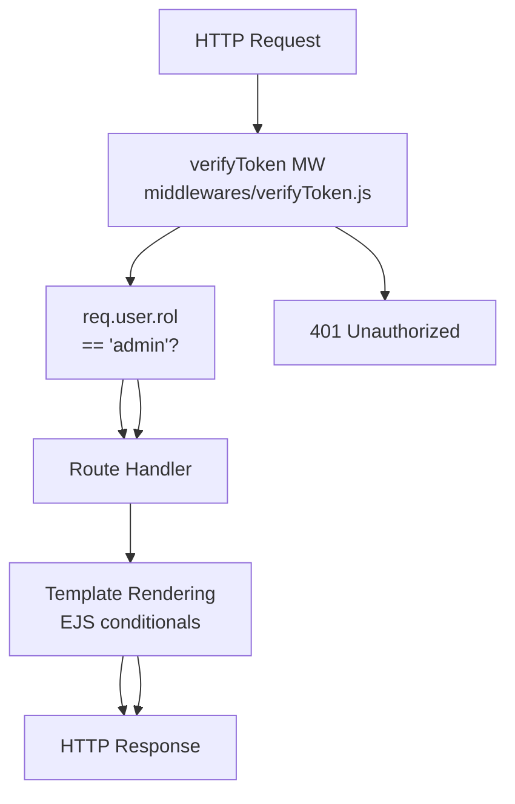

# Product Management

> **Relevant source files**
> * [proyecto.zip](https://github.com/moichuelo/registro/blob/544abbcc/proyecto.zip)
> * [public/css/style.css](https://github.com/moichuelo/registro/blob/544abbcc/public/css/style.css)
> * [src/router.js](https://github.com/moichuelo/registro/blob/544abbcc/src/router.js)
> * [views/admin.ejs](https://github.com/moichuelo/registro/blob/544abbcc/views/admin.ejs)
> * [views/index.ejs](https://github.com/moichuelo/registro/blob/544abbcc/views/index.ejs)
> * [views/register.ejs](https://github.com/moichuelo/registro/blob/544abbcc/views/register.ejs)

## Purpose and Scope

This page documents the product management subsystem, which provides complete CRUD (Create, Read, Update, Delete) operations for managing products in the application. Products are stored in the `productos` database table and can only be modified by users with the `admin` role. Regular users can view products but cannot create, edit, or delete them.

For authentication and authorization details, see [Authentication & Authorization](Authentication-&-Authorization.md). For information about the underlying routing system, see [Routing System](Routing-System.md). For PDF export functionality that operates on product data, see [PDF Generation](PDF-Generation.md).

---

## Product Data Model

The product management system operates on the `productos` table in the MySQL database. This table stores basic product information with the following structure:

| Column | Type | Constraints | Description |
| --- | --- | --- | --- |
| `ref` | `int(11)` | PRIMARY KEY, AUTO_INCREMENT | Unique product reference number |
| `nombre` | `varchar(30)` | NOT NULL | Product name |
| `precio` | `decimal(10,2)` | NOT NULL | Product price with two decimal places |
| `stock` | `int(11)` | NULL | Available stock quantity |

**Sources:** [proyecto.zip L1-L128](https://github.com/moichuelo/registro/blob/544abbcc/proyecto.zip#L1-L128)

---

## CRUD Operations Overview



**Sources:** [src/router.js L119-L208](https://github.com/moichuelo/registro/blob/544abbcc/src/router.js#L119-L208)

 [src/router.js L603-L604](https://github.com/moichuelo/registro/blob/544abbcc/src/router.js#L603-L604)

 [src/controllers.js L1-L80](https://github.com/moichuelo/registro/blob/544abbcc/src/controllers.js#L1-L80)

---

## Viewing Products

### GET /admin Route

The `/admin` route serves as the primary interface for viewing all products. This route requires authentication via the `verifyToken` middleware.

**Request Flow:**

1. User navigates to `/admin`
2. `verifyToken` middleware validates JWT from cookie
3. Query executed: `SELECT * FROM productos`
4. Results rendered in `admin.ejs` template

**Route Handler:** [src/router.js L119-L134](https://github.com/moichuelo/registro/blob/544abbcc/src/router.js#L119-L134)

```javascript
router.get("/admin", verifyToken, (req, res) => {
    db.query("SELECT * FROM productos", (error, results) => {
        if (error) {
            throw error;
        } else {
            res.render("admin", {
                productos: results,
                user: req.user,
                login: true,
                rol: req.user.rol,
            });
        }
    });
});
```

**Template Variables:**

* `productos`: Array of product objects from database
* `user`: User information from JWT payload
* `login`: Boolean flag (always `true` for authenticated users)
* `rol`: User role (`"admin"` or `"user"`)

**View Template:** [views/admin.ejs L1-L71](https://github.com/moichuelo/registro/blob/544abbcc/views/admin.ejs#L1-L71)

The admin view displays products in a Bootstrap table with conditional rendering based on user role. Admin users see action buttons (edit/delete), while regular users see a read-only view.

**Sources:** [src/router.js L119-L134](https://github.com/moichuelo/registro/blob/544abbcc/src/router.js#L119-L134)

 [views/admin.ejs L1-L71](https://github.com/moichuelo/registro/blob/544abbcc/views/admin.ejs#L1-L71)

---

## Creating Products

Product creation is a two-step process involving a form display and form submission.

### GET /create Route

Displays the product creation form. This route does not require authentication middleware, though in practice users must be logged in to access it from the navigation.

**Route Handler:** [src/router.js L153-L155](https://github.com/moichuelo/registro/blob/544abbcc/src/router.js#L153-L155)

```javascript
router.get("/create", (req, res) => {
    res.render("create");
});
```

**View Template:** [views/create.ejs L1-L50](https://github.com/moichuelo/registro/blob/544abbcc/views/create.ejs#L1-L50)

The create form includes fields for:

* Product name (`nombre`)
* Price (`precio`)
* Stock quantity (`stock`)

### POST /save Route

Processes the submitted product creation form. The controller function handles database insertion.

**Route Handler:** [src/router.js L603](https://github.com/moichuelo/registro/blob/544abbcc/src/router.js#L603-L603)

```
router.post("/save", crud.save);
```

**Controller Implementation:** [src/controllers.js L1-L80](https://github.com/moichuelo/registro/blob/544abbcc/src/controllers.js#L1-L80)

The `crud.save` function extracts form data from `req.body` and executes an `INSERT INTO productos` statement. Upon successful insertion, it redirects to `/admin`.

**Form Submission Flow:**



**Sources:** [src/router.js L153-L155](https://github.com/moichuelo/registro/blob/544abbcc/src/router.js#L153-L155)

 [src/router.js L603](https://github.com/moichuelo/registro/blob/544abbcc/src/router.js#L603-L603)

 [src/controllers.js L1-L80](https://github.com/moichuelo/registro/blob/544abbcc/src/controllers.js#L1-L80)

 [views/create.ejs L1-L50](https://github.com/moichuelo/registro/blob/544abbcc/views/create.ejs#L1-L50)

---

## Editing Products

Product editing follows a similar two-step process to creation.

### GET /edit/:id Route

Retrieves a specific product by its reference ID and displays the edit form.

**Route Handler:** [src/router.js L186-L196](https://github.com/moichuelo/registro/blob/544abbcc/src/router.js#L186-L196)

```javascript
router.get("/edit/:id", (req, res) => {
    const ref = req.params.id;
    db.query("SELECT * FROM productos WHERE ref = ?", [ref], (error, results) => {
        if (error) {
            throw error;
        } else {
            res.render("edit", { producto: results[0] });
        }
    });
});
```

**Query Parameters:**

* `:id` - Product reference number from URL path

**Database Query:**

```sql
SELECT * FROM productos WHERE ref = ?
```

**View Template:** [views/edit.ejs L1-L50](https://github.com/moichuelo/registro/blob/544abbcc/views/edit.ejs#L1-L50)

The edit form pre-populates fields with existing product data using the `producto` object passed to the template.

### POST /update Route

Processes the submitted product update form.

**Route Handler:** [src/router.js L604](https://github.com/moichuelo/registro/blob/544abbcc/src/router.js#L604-L604)

```sql
router.post("/update", crud.update);
```

**Controller Implementation:** [src/controllers.js L1-L80](https://github.com/moichuelo/registro/blob/544abbcc/src/controllers.js#L1-L80)

The `crud.update` function executes an `UPDATE` statement on the `productos` table and redirects to `/admin`.

**Sources:** [src/router.js L186-L196](https://github.com/moichuelo/registro/blob/544abbcc/src/router.js#L186-L196)

 [src/router.js L604](https://github.com/moichuelo/registro/blob/544abbcc/src/router.js#L604-L604)

 [src/controllers.js L1-L80](https://github.com/moichuelo/registro/blob/544abbcc/src/controllers.js#L1-L80)

 [views/edit.ejs L1-L50](https://github.com/moichuelo/registro/blob/544abbcc/views/edit.ejs#L1-L50)

---

## Deleting Products

### GET /delete/:id Route

Immediately deletes the specified product and redirects to the admin page. This is a destructive operation with no confirmation dialog.

**Route Handler:** [src/router.js L198-L208](https://github.com/moichuelo/registro/blob/544abbcc/src/router.js#L198-L208)

```javascript
router.get("/delete/:id", (req, res) => {
    const ref = req.params.id;
    db.query("DELETE FROM productos WHERE ref = ?", [ref], (error, results) => {
        if (error) {
            throw error;
        } else {
            res.redirect("/admin");
        }
    });
});
```

**Database Query:**

```sql
DELETE FROM productos WHERE ref = ?
```

**Note:** This route uses GET method for a destructive operation, which is not a REST best practice. A POST or DELETE HTTP method would be more appropriate for production systems.

**Sources:** [src/router.js L198-L208](https://github.com/moichuelo/registro/blob/544abbcc/src/router.js#L198-L208)

---

## Authorization and Access Control

### Role-Based UI Rendering

The admin view template implements role-based access control at the presentation layer. Admin-only features are conditionally rendered using EJS template logic.

**Admin-Only UI Elements:** [views/admin.ejs L10-L23](https://github.com/moichuelo/registro/blob/544abbcc/views/admin.ejs#L10-L23)

```sql
<% if (rol=="admin") {%>
    <a href="/create" class="btn btn-outline-primary mt-4">
        <i class="bx bxs-plus-circle bx-md"></i>
    </a>
<% } %>
```

**Action Buttons:** [views/admin.ejs L21-L23](https://github.com/moichuelo/registro/blob/544abbcc/views/admin.ejs#L21-L23)

 [views/admin.ejs L41-L50](https://github.com/moichuelo/registro/blob/544abbcc/views/admin.ejs#L41-L50)

Edit and delete buttons are only rendered for admin users:

```xml
<% if (rol=="admin") {%>
    <th scope="col">Acciones</th>
<% } %>
```

### Route-Level Authorization



**Current Implementation:** The `/admin` route uses `verifyToken` middleware [src/router.js L119](https://github.com/moichuelo/registro/blob/544abbcc/src/router.js#L119-L119)

 but does not use `verifyAdmin` middleware. This means regular users can view products but the UI conditionally hides modification controls.

**Unprotected Routes:** The `/create`, `/edit/:id`, `/delete/:id`, `/save`, and `/update` routes do not have explicit authentication middleware. Access control relies entirely on UI restrictions in the admin template.

**Security Note:** For production deployments, consider adding `verifyAdmin` middleware to all modification routes to prevent unauthorized access through direct URL manipulation:

```javascript
router.get("/create", verifyToken, verifyAdmin, (req, res) => { /* ... */ });
router.get("/delete/:id", verifyToken, verifyAdmin, (req, res) => { /* ... */ });
router.post("/save", verifyToken, verifyAdmin, crud.save);
router.post("/update", verifyToken, verifyAdmin, crud.update);
```

**Sources:** [src/router.js L119-L208](https://github.com/moichuelo/registro/blob/544abbcc/src/router.js#L119-L208)

 [views/admin.ejs L10-L50](https://github.com/moichuelo/registro/blob/544abbcc/views/admin.ejs#L10-L50)

 [src/middlewares/verifyToken.js L1-L50](https://github.com/moichuelo/registro/blob/544abbcc/src/middlewares/verifyToken.js#L1-L50)

 [src/middlewares/verifyAdmin.js L1-L50](https://github.com/moichuelo/registro/blob/544abbcc/src/middlewares/verifyAdmin.js#L1-L50)

---

## Integration with PDF Generation

The product management system integrates with the PDF generation subsystem. Two PDF export buttons are available on the admin page:

1. **Puppeteer PDF Export:** [views/admin.ejs L55-L56](https://github.com/moichuelo/registro/blob/544abbcc/views/admin.ejs#L55-L56) * Route: `GET /pdf/descargar` * Renders `pdfTabla.ejs` template as HTML, then converts to PDF
2. **PDFKit PDF Export:** [views/admin.ejs L58-L59](https://github.com/moichuelo/registro/blob/544abbcc/views/admin.ejs#L58-L59) * Route: `GET /pdfkit/descargar` * Generates PDF programmatically using PDFKit library

Both routes query the `productos` table and generate downloadable PDF reports. For detailed implementation, see [PDF Generation](PDF-Generation.md).

**Sources:** [views/admin.ejs L55-L59](https://github.com/moichuelo/registro/blob/544abbcc/views/admin.ejs#L55-L59)

 [src/router.js L317-L396](https://github.com/moichuelo/registro/blob/544abbcc/src/router.js#L317-L396)

---

## Complete Product Management Flow

```

```

**Sources:** [src/router.js L119-L208](https://github.com/moichuelo/registro/blob/544abbcc/src/router.js#L119-L208)

 [src/router.js L603-L604](https://github.com/moichuelo/registro/blob/544abbcc/src/router.js#L603-L604)

 [src/controllers.js L1-L80](https://github.com/moichuelo/registro/blob/544abbcc/src/controllers.js#L1-L80)

 [views/admin.ejs L1-L71](https://github.com/moichuelo/registro/blob/544abbcc/views/admin.ejs#L1-L71)

---

## Key Files and Components

### Route Definitions

* **View Products:** [src/router.js L119-L134](https://github.com/moichuelo/registro/blob/544abbcc/src/router.js#L119-L134)
* **Create Form:** [src/router.js L153-L155](https://github.com/moichuelo/registro/blob/544abbcc/src/router.js#L153-L155)
* **Edit Form:** [src/router.js L186-L196](https://github.com/moichuelo/registro/blob/544abbcc/src/router.js#L186-L196)
* **Delete Product:** [src/router.js L198-L208](https://github.com/moichuelo/registro/blob/544abbcc/src/router.js#L198-L208)
* **Save Handler:** [src/router.js L603](https://github.com/moichuelo/registro/blob/544abbcc/src/router.js#L603-L603)
* **Update Handler:** [src/router.js L604](https://github.com/moichuelo/registro/blob/544abbcc/src/router.js#L604-L604)

### Controllers

* **CRUD Controllers:** [src/controllers.js L1-L80](https://github.com/moichuelo/registro/blob/544abbcc/src/controllers.js#L1-L80) * `crud.save` - Handles product creation * `crud.update` - Handles product updates

### Views

* **Admin Dashboard:** [views/admin.ejs L1-L71](https://github.com/moichuelo/registro/blob/544abbcc/views/admin.ejs#L1-L71)
* **Create Form:** [views/create.ejs L1-L50](https://github.com/moichuelo/registro/blob/544abbcc/views/create.ejs#L1-L50)
* **Edit Form:** [views/edit.ejs L1-L50](https://github.com/moichuelo/registro/blob/544abbcc/views/edit.ejs#L1-L50)

### Database

* **Table Schema:** [proyecto.zip L1-L128](https://github.com/moichuelo/registro/blob/544abbcc/proyecto.zip#L1-L128)  (productos table definition)

### Middleware

* **Authentication:** [src/middlewares/verifyToken.js L1-L50](https://github.com/moichuelo/registro/blob/544abbcc/src/middlewares/verifyToken.js#L1-L50)
* **Admin Authorization:** [src/middlewares/verifyAdmin.js L1-L50](https://github.com/moichuelo/registro/blob/544abbcc/src/middlewares/verifyAdmin.js#L1-L50)  (not currently used on product routes)

**Sources:** [src/router.js L1-L608](https://github.com/moichuelo/registro/blob/544abbcc/src/router.js#L1-L608)

 [src/controllers.js L1-L80](https://github.com/moichuelo/registro/blob/544abbcc/src/controllers.js#L1-L80)

 [views/admin.ejs L1-L71](https://github.com/moichuelo/registro/blob/544abbcc/views/admin.ejs#L1-L71)

 [views/create.ejs L1-L50](https://github.com/moichuelo/registro/blob/544abbcc/views/create.ejs#L1-L50)

 [views/edit.ejs L1-L50](https://github.com/moichuelo/registro/blob/544abbcc/views/edit.ejs#L1-L50)