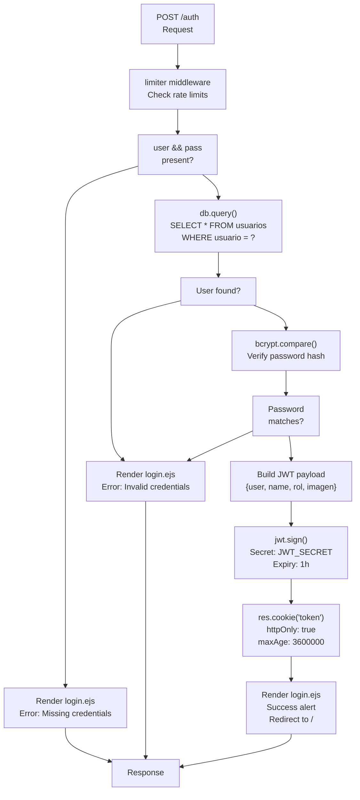
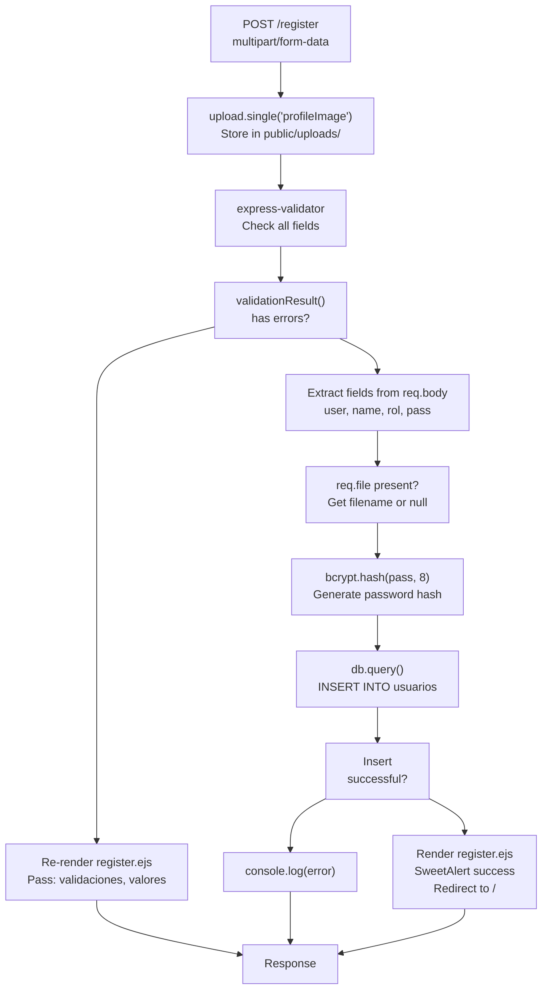
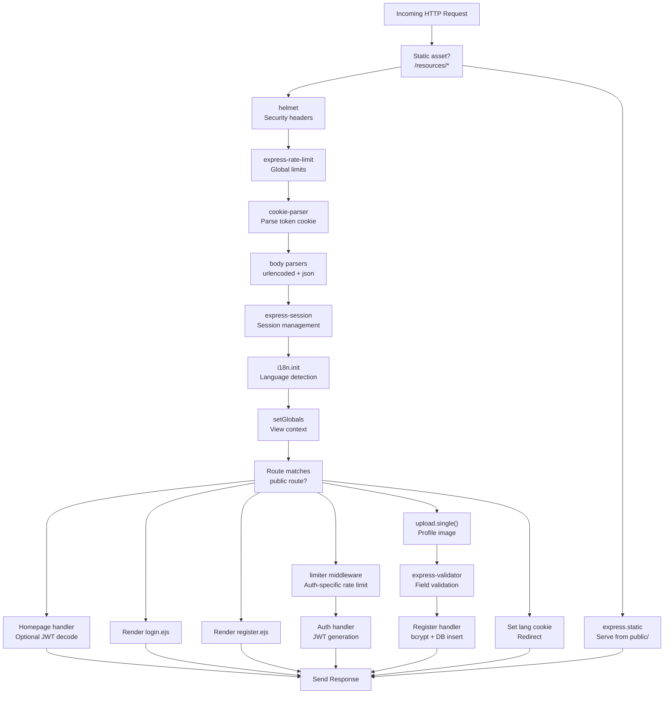

# Public Routes

> **Relevant source files**
> * [public/css/style.css](https://github.com/moichuelo/registro/blob/544abbcc/public/css/style.css)
> * [src/router.js](https://github.com/moichuelo/registro/blob/544abbcc/src/router.js)
> * [views/admin.ejs](https://github.com/moichuelo/registro/blob/544abbcc/views/admin.ejs)
> * [views/index.ejs](https://github.com/moichuelo/registro/blob/544abbcc/views/index.ejs)
> * [views/register.ejs](https://github.com/moichuelo/registro/blob/544abbcc/views/register.ejs)

This document describes all HTTP routes in the application that are accessible without authentication. These routes handle the public-facing functionality including the homepage, user authentication (login/register), and language preference management.

For routes requiring authentication, see [Protected Routes](Protected-Routes.md). For API endpoints used by the frontend, see [API Endpoints](API-Endpoints.md).

---

## Purpose and Scope

Public routes are defined in [src/router.js](https://github.com/moichuelo/registro/blob/544abbcc/src/router.js)

 and do not have the `verifyToken` or `verifyAdmin` middleware applied. They are accessible to any client making HTTP requests to the server, regardless of authentication state. These routes form the entry points to the application and handle the authentication lifecycle.

---

## Route Overview

The following table lists all public routes in the system:

| Method | Path | Handler Location | View Rendered | Purpose |
| --- | --- | --- | --- | --- |
| GET | `/` | [src/router.js L59-L74](https://github.com/moichuelo/registro/blob/544abbcc/src/router.js#L59-L74) | `index.ejs` | Homepage with optional user info |
| GET | `/login` | [src/router.js L75-L77](https://github.com/moichuelo/registro/blob/544abbcc/src/router.js#L75-L77) | `login.ejs` | Login form display |
| GET | `/registro` | [src/router.js L78-L80](https://github.com/moichuelo/registro/blob/544abbcc/src/router.js#L78-L80) | `register.ejs` | Registration form display |
| POST | `/auth` | [src/router.js L532-L601](https://github.com/moichuelo/registro/blob/544abbcc/src/router.js#L532-L601) | `login.ejs` | Login processing with JWT generation |
| POST | `/register` | [src/router.js L414-L484](https://github.com/moichuelo/registro/blob/544abbcc/src/router.js#L414-L484) | `register.ejs` | Registration processing with validation |
| GET | `/set-lang/:lang` | [src/router.js L398-L407](https://github.com/moichuelo/registro/blob/544abbcc/src/router.js#L398-L407) | N/A (redirect) | Language preference switching |

**Sources:** [src/router.js L1-L607](https://github.com/moichuelo/registro/blob/544abbcc/src/router.js#L1-L607)

---

## Homepage Route

### GET /

The root route serves as the application's homepage. It demonstrates conditional rendering based on authentication state by attempting to decode a JWT from cookies without enforcing authentication.

```xml
Route: GET /
Handler: <FileRef file-url="https://github.com/moichuelo/registro/blob/544abbcc/src/router.js#L59-L74" min=59 max=74 file-path="src/router.js">Hii</FileRef>
Middleware: None (public)
View: views/index.ejs
```

**Handler Logic:**

1. Checks for `token` cookie in the request [src/router.js L61](https://github.com/moichuelo/registro/blob/544abbcc/src/router.js#L61-L61)
2. If present, verifies the JWT using `jwt.verify()` with `process.env.JWT_SECRET` [src/router.js L62](https://github.com/moichuelo/registro/blob/544abbcc/src/router.js#L62-L62)
3. Extracts user payload and passes to view
4. If absent or invalid, displays generic message "Debe iniciar sesión"

**View Data:**

| Property | Type | Description |
| --- | --- | --- |
| `user` | string | Username from JWT or "Debe iniciar sesión" |
| `login` | boolean | `true` if authenticated, `false` otherwise |

**Example Implementation:**

```javascript
if (req.cookies.token) {
    const payload = jwt.verify(req.cookies.token, process.env.JWT_SECRET);
    req.user = payload;
    res.render("index", {
        user: req.user?.name || "Usuario",
        login: true,
    });
} else {
    res.render("index", {
        user: "Debe iniciar sesión",
        login: false,
    });
}
```

The rendered view [views/index.ejs L1-L35](https://github.com/moichuelo/registro/blob/544abbcc/views/index.ejs#L1-L35)

 conditionally displays either a logout link or login link based on the `login` flag.

**Sources:** [src/router.js L59-L74](https://github.com/moichuelo/registro/blob/544abbcc/src/router.js#L59-L74)

 [views/index.ejs L1-L35](https://github.com/moichuelo/registro/blob/544abbcc/views/index.ejs#L1-L35)

---

## Authentication Routes

### GET /login

Displays the login form for user authentication.

```xml
Route: GET /login
Handler: <FileRef file-url="https://github.com/moichuelo/registro/blob/544abbcc/src/router.js#L75-L77" min=75 max=77 file-path="src/router.js">Hii</FileRef>
Middleware: None (public)
View: views/login.ejs
```

Simple route handler that renders the login view without any data processing.

**Sources:** [src/router.js L75-L77](https://github.com/moichuelo/registro/blob/544abbcc/src/router.js#L75-L77)

---

### POST /auth

Processes login credentials, validates against the database, and issues JWT tokens.

```xml
Route: POST /auth
Handler: <FileRef file-url="https://github.com/moichuelo/registro/blob/544abbcc/src/router.js#L532-L601" min=532 max=601 file-path="src/router.js">Hii</FileRef>
Middleware: limiter (rate limiting)
View: views/login.ejs (rendered with alert)
```

**Rate Limiting:**

The route is protected by the `limiter` middleware [src/router.js L532](https://github.com/moichuelo/registro/blob/544abbcc/src/router.js#L532-L532)

 which prevents brute-force attacks. See [Security Measures](Security-Measures.md) for details on rate limiting configuration.

**Request Flow:**



**Sources:** [src/router.js L532-L601](https://github.com/moichuelo/registro/blob/544abbcc/src/router.js#L532-L601)

**Payload Structure:**

The JWT payload contains the following fields from the `usuarios` table:

```javascript
const payload = {
    user: results[0].usuario,    // Username (primary key)
    name: results[0].nombre,      // Display name
    rol: results[0].rol,          // Role: 'admin' or 'user'
    imagen: results[0].imagen,    // Profile image filename
};
```

[src/router.js L559-L564](https://github.com/moichuelo/registro/blob/544abbcc/src/router.js#L559-L564)

**Cookie Configuration:**

| Property | Value | Description |
| --- | --- | --- |
| `httpOnly` | `true` | Prevents client-side JavaScript access |
| `secure` | `false` | Set to `true` for HTTPS in production |
| `maxAge` | `3600000` | 1 hour in milliseconds |

[src/router.js L570-L574](https://github.com/moichuelo/registro/blob/544abbcc/src/router.js#L570-L574)

**Sources:** [src/router.js L532-L601](https://github.com/moichuelo/registro/blob/544abbcc/src/router.js#L532-L601)

---

## Registration Routes

### GET /registro

Displays the user registration form.

```xml
Route: GET /registro
Handler: <FileRef file-url="https://github.com/moichuelo/registro/blob/544abbcc/src/router.js#L78-L80" min=78 max=80 file-path="src/router.js">Hii</FileRef>
Middleware: None (public)
View: views/register.ejs
```

Simple route handler that renders the registration view.

**Sources:** [src/router.js L78-L80](https://github.com/moichuelo/registro/blob/544abbcc/src/router.js#L78-L80)

---

### POST /register

Processes new user registration with input validation and file upload support.

```xml
Route: POST /register
Handler: <FileRef file-url="https://github.com/moichuelo/registro/blob/544abbcc/src/router.js#L414-L484" min=414 max=484 file-path="src/router.js">Hii</FileRef>
Middleware: upload.single("profileImage")
View: views/register.ejs (re-rendered with validation errors or success)
```

**Middleware Stack:**

1. **Multer Upload:** `upload.single("profileImage")` - Handles multipart/form-data for profile image uploads [src/router.js L414](https://github.com/moichuelo/registro/blob/544abbcc/src/router.js#L414-L414)
2. **Express Validator:** Validates form fields inline [src/router.js L415-L428](https://github.com/moichuelo/registro/blob/544abbcc/src/router.js#L415-L428)

**Validation Rules:**

| Field | Validation | Error Message |
| --- | --- | --- |
| `user` | Must exist, min length 4 | "El usuario debe tener al menos 4 caracteres" |
| `name` | Min length 4 | "El nombre debe tener al menos 4 caracteres" |
| `pass` | Min length 4 | "La contraseña debe tener al menos 4 caracteres" |
| `email` | Valid email format | "El email no es valido" |
| `edad` | Numeric | "La edad debe ser un número" |

[src/router.js L416-L428](https://github.com/moichuelo/registro/blob/544abbcc/src/router.js#L416-L428)

**Registration Flow:**



**Sources:** [src/router.js L414-L484](https://github.com/moichuelo/registro/blob/544abbcc/src/router.js#L414-L484)

**Database Insert:**

The handler inserts a new record into the `usuarios` table with the following mapping:

```python
{
    usuario: user,              // Username (primary key)
    nombre: name,               // Display name
    rol: rol,                   // Selected role
    pass: passwordHash,         // bcrypt hash (salt rounds: 8)
    imagen: profileImage,       // Filename from Multer or null
}
```

[src/router.js L458-L464](https://github.com/moichuelo/registro/blob/544abbcc/src/router.js#L458-L464)

**Error Handling:**

On validation failure, the view is re-rendered with:

* `validaciones`: Array of error objects from express-validator
* `valores`: Original form values for field pre-population

This allows the user to see validation errors without losing entered data. [views/register.ejs L44-L56](https://github.com/moichuelo/registro/blob/544abbcc/views/register.ejs#L44-L56)

 displays these errors using Bootstrap alert components.

**Sources:** [src/router.js L414-L484](https://github.com/moichuelo/registro/blob/544abbcc/src/router.js#L414-L484)

 [views/register.ejs L1-L85](https://github.com/moichuelo/registro/blob/544abbcc/views/register.ejs#L1-L85)

---

## Language Switching Route

### GET /set-lang/:lang

Updates the user's language preference via cookie and redirects back to the referring page.

```xml
Route: GET /set-lang/:lang
Handler: <FileRef file-url="https://github.com/moichuelo/registro/blob/544abbcc/src/router.js#L398-L407" min=398 max=407 file-path="src/router.js">Hii</FileRef>
Middleware: None (public)
Response: HTTP 302 Redirect
```

**Parameters:**

| Name | Location | Type | Valid Values | Description |
| --- | --- | --- | --- | --- |
| `lang` | Path | string | `'es'`, `'en'` | Target language code |
| `returnTo` | Query | string | Any valid path | URL to redirect after setting language |

**Logic:**

1. Extract `lang` from route parameter [src/router.js L399](https://github.com/moichuelo/registro/blob/544abbcc/src/router.js#L399-L399)
2. Extract `returnTo` from query string, defaulting to `'/'` [src/router.js L400](https://github.com/moichuelo/registro/blob/544abbcc/src/router.js#L400-L400)
3. Validate `lang` is either `'es'` or `'en'` [src/router.js L402](https://github.com/moichuelo/registro/blob/544abbcc/src/router.js#L402-L402)
4. Set `lang` cookie with 900-second expiry [src/router.js L403](https://github.com/moichuelo/registro/blob/544abbcc/src/router.js#L403-L403)
5. Redirect to `returnTo` URL [src/router.js L406](https://github.com/moichuelo/registro/blob/544abbcc/src/router.js#L406-L406)

**Cookie Configuration:**

```
res.cookie('lang', lang, { maxAge: 900000, httpOnly: true });
```

[src/router.js L403](https://github.com/moichuelo/registro/blob/544abbcc/src/router.js#L403-L403)

**Integration with i18n:**

The `lang` cookie is read by the `i18n.init` middleware configured in [index.js](https://github.com/moichuelo/registro/blob/544abbcc/index.js)

 to determine which locale to use for rendering views. See [Internationalization (i18n)](Internationalization-(i18n).md)) for details on how language preferences are applied.

**Usage Example:**

To switch to Spanish and return to the admin page:

```
GET /set-lang/es?returnTo=/admin
```

The header partial [views/partials/header.ejs](https://github.com/moichuelo/registro/blob/544abbcc/views/partials/header.ejs)

 includes language switching links that use this route.

**Sources:** [src/router.js L398-L407](https://github.com/moichuelo/registro/blob/544abbcc/src/router.js#L398-L407)

---

## Request Processing Flow

The following diagram shows how public routes are processed through the Express middleware stack:



**Sources:** [src/router.js L1-L607](https://github.com/moichuelo/registro/blob/544abbcc/src/router.js#L1-L607)

 [index.js](https://github.com/moichuelo/registro/blob/544abbcc/index.js)

---

## Route-to-Code Entity Mapping

This diagram maps public routes to their corresponding code entities in the system:

```mermaid
flowchart TD

R1["GET /<br>[router.js:59-74]"]
R2["GET /login<br>[router.js:75-77]"]
R3["GET /registro<br>[router.js:78-80]"]
R4["POST /auth<br>[router.js:532-601]"]
R5["POST /register<br>[router.js:414-484]"]
R6["GET /set-lang/:lang<br>[router.js:398-407]"]
M1["limiter<br>authLimiter.js"]
M2["upload<br>multerConfig.js"]
M3["express-validator<br>body()"]
D1["jwt.verify()<br>jsonwebtoken"]
D2["jwt.sign()<br>jsonwebtoken"]
D3["bcrypt.hash()<br>bcryptjs"]
D4["bcrypt.compare()<br>bcryptjs"]
D5["db.query()<br>database/db.js"]
V1["views/index.ejs"]
V2["views/login.ejs"]
V3["views/register.ejs"]
T1["usuarios table<br>usuario, pass, rol, nombre, imagen"]

R1 --> D1
R1 --> V1
R2 --> V2
R3 --> V3
R4 --> M1
R4 --> D4
R4 --> D5
R4 --> D2
R4 --> V2
R4 --> T1
R5 --> M2
R5 --> M3
R5 --> D3
R5 --> D5
R5 --> V3
R5 --> T1
R6 --> V1
R6 --> V2
R6 --> V3

subgraph subGraph4 ["Database Tables"]
    T1
end

subgraph subGraph3 ["View Templates"]
    V1
    V2
    V3
end

subgraph subGraph2 ["External Dependencies"]
    D1
    D2
    D3
    D4
    D5
end

subgraph subGraph1 ["Middleware Dependencies"]
    M1
    M2
    M3
end

subgraph subGraph0 ["Public Routes"]
    R1
    R2
    R3
    R4
    R5
    R6
end
```



**Sources:** [src/router.js L1-L607](https://github.com/moichuelo/registro/blob/544abbcc/src/router.js#L1-L607)

---

## Cookie Management

All authentication-related routes interact with cookies for session management:

| Route | Cookie Action | Cookie Name | Properties |
| --- | --- | --- | --- |
| `GET /` | Read | `token` | JWT validation (optional) |
| `POST /auth` | Write | `token` | httpOnly, 1-hour expiry |
| `GET /set-lang/:lang` | Write | `lang` | httpOnly, 15-minute expiry |

The `token` cookie contains the JWT that encodes user identity and is used by protected routes. The `lang` cookie stores language preference for the i18n system.

**Sources:** [src/router.js L59-L74](https://github.com/moichuelo/registro/blob/544abbcc/src/router.js#L59-L74)

 [src/router.js L570-L574](https://github.com/moichuelo/registro/blob/544abbcc/src/router.js#L570-L574)

 [src/router.js L403](https://github.com/moichuelo/registro/blob/544abbcc/src/router.js#L403-L403)

---

## Security Considerations

Public routes implement several security measures:

1. **Rate Limiting:** The `POST /auth` route uses the `limiter` middleware to prevent brute-force attacks [src/router.js L532](https://github.com/moichuelo/registro/blob/544abbcc/src/router.js#L532-L532)
2. **Password Hashing:** All passwords are hashed with bcrypt using 8 salt rounds [src/router.js L453](https://github.com/moichuelo/registro/blob/544abbcc/src/router.js#L453-L453)
3. **HTTP-Only Cookies:** JWT tokens are stored in HTTP-only cookies, preventing XSS attacks [src/router.js L571](https://github.com/moichuelo/registro/blob/544abbcc/src/router.js#L571-L571)
4. **Input Validation:** Registration form validates all fields with express-validator [src/router.js L415-L428](https://github.com/moichuelo/registro/blob/544abbcc/src/router.js#L415-L428)
5. **JWT Expiration:** Tokens expire after 1 hour, limiting compromise window [src/router.js L567](https://github.com/moichuelo/registro/blob/544abbcc/src/router.js#L567-L567)

For comprehensive security documentation, see [Security Measures](Security-Measures.md).

**Sources:** [src/router.js L414-L601](https://github.com/moichuelo/registro/blob/544abbcc/src/router.js#L414-L601)