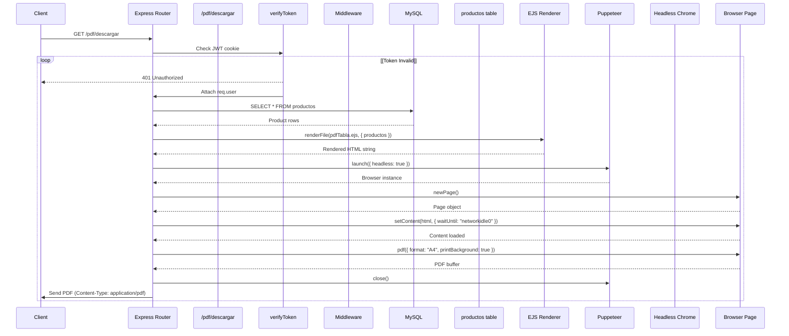
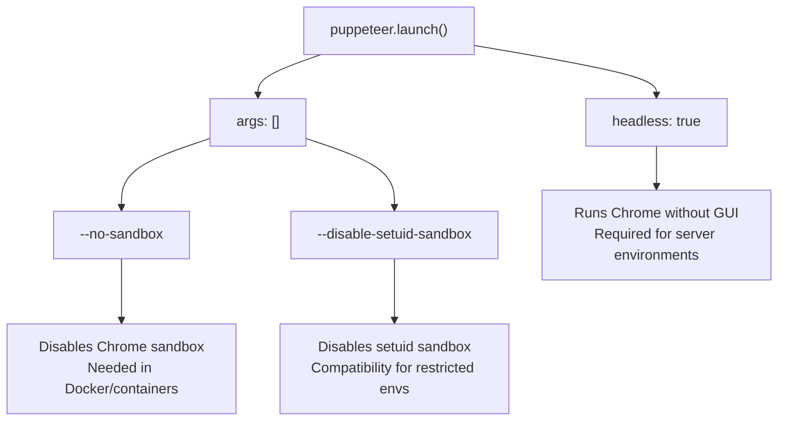
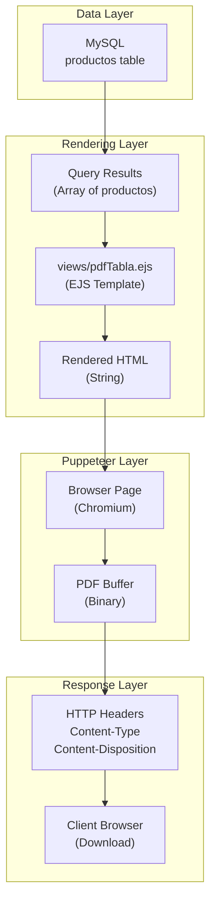
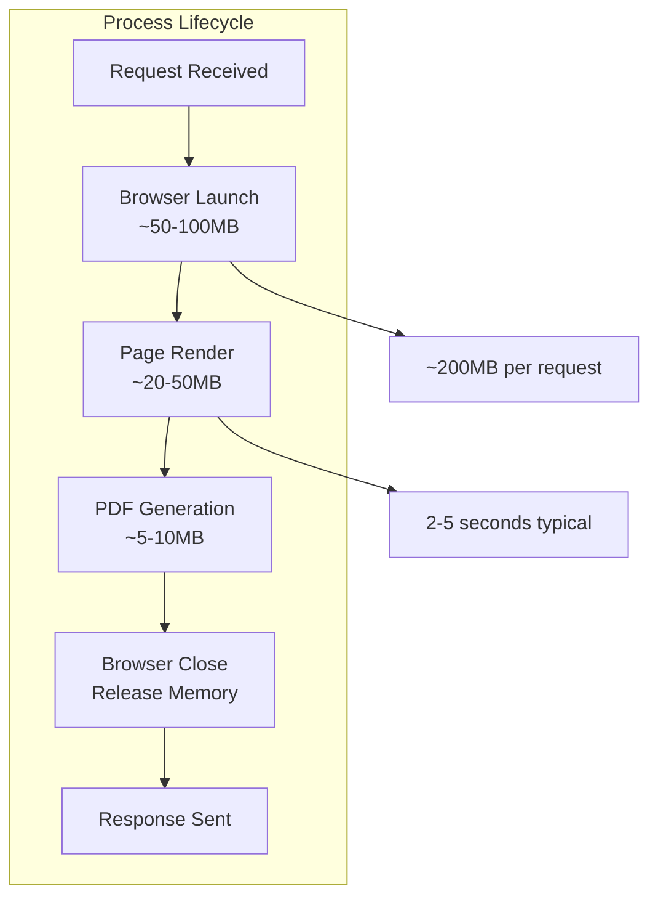
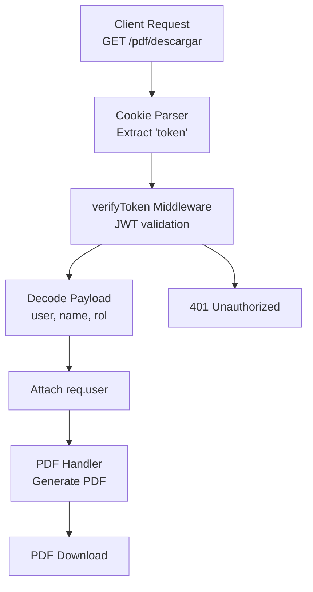

# Puppeteer PDF Generation

> **Relevant source files**
> * [package-lock.json](https://github.com/moichuelo/registro/blob/544abbcc/package-lock.json)
> * [src/router.js](https://github.com/moichuelo/registro/blob/544abbcc/src/router.js)

This document describes the Puppeteer-based PDF generation approach used in the registro-sesiones system. This method renders EJS templates to HTML in a headless browser, then converts the rendered page to PDF format.

For information about the alternative programmatic PDF generation approach, see [PDFKit PDF Generation](PDFKit-PDF-Generation.md). For a broader overview of both methods, see [PDF Generation](PDF-Generation.md).

---

## Overview

The Puppeteer PDF generation system provides a template-driven approach to creating PDF documents from product data. The system uses Puppeteer (Chromium-based headless browser) to render an EJS template with live data, then captures the rendered HTML as a PDF document. This approach enables complex layouts, CSS styling, and dynamic content rendering that would be difficult to achieve with programmatic PDF libraries.

**Key characteristics:**

* **Template-based**: Uses standard EJS views for PDF layout
* **Browser-powered**: Leverages Chromium's rendering engine
* **Authenticated**: Requires valid JWT token
* **Asynchronous**: Uses async/await pattern for browser automation
* **Memory-buffered**: Generates PDF in memory before streaming to client

**Sources:** [src/router.js L317-L353](https://github.com/moichuelo/registro/blob/544abbcc/src/router.js#L317-L353)

---

## Request Flow

The following diagram illustrates the complete request flow from client authentication through PDF delivery:



**Sources:** [src/router.js L317-L353](https://github.com/moichuelo/registro/blob/544abbcc/src/router.js#L317-L353)

 [src/middlewares/verifyToken.js](https://github.com/moichuelo/registro/blob/544abbcc/src/middlewares/verifyToken.js)

---

## Technical Implementation

### Route Definition

The Puppeteer PDF generation is exposed via the `/pdf/descargar` route with JWT authentication:

| Aspect | Value |
| --- | --- |
| Route | `GET /pdf/descargar` |
| Middleware | `verifyToken` |
| Handler Type | Async function |
| Database Query | `SELECT * FROM productos` |
| Template | `views/pdfTabla.ejs` |
| Response Type | Binary PDF stream |

**Sources:** [src/router.js L317-L353](https://github.com/moichuelo/registro/blob/544abbcc/src/router.js#L317-L353)

### Code Walkthrough

The implementation at [src/router.js L317-L353](https://github.com/moichuelo/registro/blob/544abbcc/src/router.js#L317-L353)

 follows this sequence:

**1. Database Query**

```javascript
db.query("SELECT * FROM productos", async (error, results) => { ... })
```

Retrieves all product records from the `productos` table.

**2. HTML Generation**

```javascript
const html = await ejs.renderFile(path.join(__dirname, "../views/pdfTabla.ejs"), {
    productos: results
});
```

Renders the EJS template with product data to produce an HTML string.

**3. Browser Launch**

```javascript
const browser = await puppeteer.launch({
    headless: true,
    args: ["--no-sandbox", "--disable-setuid-sandbox"],
});
```

Launches a headless Chromium instance with security flags for containerized environments.

**4. Page Creation and Content Loading**

```javascript
const page = await browser.newPage();
await page.setContent(html, { waitUntil: "networkidle0" });
```

Creates a new browser page and loads the HTML content. The `networkidle0` option waits until no network connections are active for 500ms.

**5. PDF Generation**

```javascript
const pdfBuffer = await page.pdf({
    format: "A4",
    printBackground: true,
    margin: { top: "20px", bottom: "20px" },
});
```

Generates the PDF from the rendered page with specified formatting options.

**6. Cleanup and Response**

```
await browser.close();
res.setHeader("Content-Type", "application/pdf");
res.setHeader("Content-Disposition", 'attachment; filename="productos.pdf"');
res.send(pdfBuffer);
```

Closes the browser instance and streams the PDF buffer to the client.

**Sources:** [src/router.js L317-L353](https://github.com/moichuelo/registro/blob/544abbcc/src/router.js#L317-L353)

---

## Puppeteer Configuration

### Launch Options

The following diagram shows the Puppeteer launch configuration and its purpose:



| Option | Value | Purpose |
| --- | --- | --- |
| `headless` | `true` | Run Chromium without GUI (required for server) |
| `--no-sandbox` | N/A | Disable Chrome sandbox (required for Docker/containers) |
| `--disable-setuid-sandbox` | N/A | Disable setuid sandbox (compatibility for restricted environments) |

**Sources:** [src/router.js L328-L331](https://github.com/moichuelo/registro/blob/544abbcc/src/router.js#L328-L331)

### PDF Options

The PDF generation is configured with the following options at [src/router.js L336-L340](https://github.com/moichuelo/registro/blob/544abbcc/src/router.js#L336-L340)

:

| Option | Value | Purpose |
| --- | --- | --- |
| `format` | `"A4"` | Standard paper size (210mm × 297mm) |
| `printBackground` | `true` | Include CSS background colors/images |
| `margin.top` | `"20px"` | Top page margin |
| `margin.bottom` | `"20px"` | Bottom page margin |

**Sources:** [src/router.js L336-L340](https://github.com/moichuelo/registro/blob/544abbcc/src/router.js#L336-L340)

---

## Template Rendering Pipeline

The following diagram illustrates how data flows through the EJS template rendering and Puppeteer conversion:



**Template path resolution:**

```
path.join(__dirname, "../views/pdfTabla.ejs")
```

Since `__dirname` is `src/`, this resolves to `src/../views/pdfTabla.ejs` which equals `views/pdfTabla.ejs` from the project root.

**Sources:** [src/router.js L324-L326](https://github.com/moichuelo/registro/blob/544abbcc/src/router.js#L324-L326)

 [src/router.js L333-L340](https://github.com/moichuelo/registro/blob/544abbcc/src/router.js#L333-L340)

---

## Error Handling

The implementation includes error handling at two levels:

### Database Query Errors

```
if (error) {
    return res.status(500).send("Error al obtener productos");
}
```

Handles database connection failures or query execution errors at [src/router.js L319-L321](https://github.com/moichuelo/registro/blob/544abbcc/src/router.js#L319-L321)

### PDF Generation Errors

```
catch (err) {
    console.error("❌ Error al generar el PDF:", err);
    res.status(500).send("Error interno al generar el PDF");
}
```

Catches errors during EJS rendering, browser launch, page creation, or PDF generation at [src/router.js L348-L351](https://github.com/moichuelo/registro/blob/544abbcc/src/router.js#L348-L351)

**Common failure scenarios:**

* EJS template syntax errors
* Puppeteer browser launch failure (insufficient memory, missing dependencies)
* Browser page timeout during content loading
* PDF generation buffer overflow

**Sources:** [src/router.js L319-L321](https://github.com/moichuelo/registro/blob/544abbcc/src/router.js#L319-L321)

 [src/router.js L348-L351](https://github.com/moichuelo/registro/blob/544abbcc/src/router.js#L348-L351)

---

## HTTP Response Headers

The route configures specific HTTP headers to trigger browser download behavior:

| Header | Value | Purpose |
| --- | --- | --- |
| `Content-Type` | `application/pdf` | Identifies the response body as PDF format |
| `Content-Disposition` | `attachment; filename="productos.pdf"` | Forces download with specified filename |

**Implementation:**

```
res.setHeader("Content-Type", "application/pdf");
res.setHeader("Content-Disposition", 'attachment; filename="productos.pdf"');
```

The `attachment` directive causes browsers to prompt for download rather than attempting inline display.

**Sources:** [src/router.js L344-L345](https://github.com/moichuelo/registro/blob/544abbcc/src/router.js#L344-L345)

---

## Memory and Performance Considerations

### Resource Usage

The Puppeteer approach has distinct resource characteristics:



**Characteristics:**

* **Memory intensive**: Each browser instance consumes 100-200MB
* **CPU bound**: Rendering complex HTML is computationally expensive
* **Slow cold start**: First request may take 5-10 seconds (browser initialization)
* **Concurrent limit**: Server memory limits concurrent PDF generations
* **Cleanup critical**: Browser instances must be closed to prevent memory leaks

**Sources:** [src/router.js L328-L342](https://github.com/moichuelo/registro/blob/544abbcc/src/router.js#L328-L342)

### Optimization Strategies

For production deployments, consider:

1. **Browser pooling**: Reuse browser instances across requests
2. **Request queuing**: Limit concurrent PDF generations
3. **Timeout configuration**: Set maximum render time
4. **Template caching**: Cache compiled EJS templates
5. **Monitoring**: Track browser instance lifecycle

---

## Dependencies

The Puppeteer PDF generation relies on the following packages:

| Package | Version | Purpose |
| --- | --- | --- |
| `puppeteer` | `^24.14.0` | Headless Chromium automation |
| `ejs` | `^3.1.10` | Template rendering engine |

**Sources:** [package-lock.json L28](https://github.com/moichuelo/registro/blob/544abbcc/package-lock.json#L28-L28)

 [package-lock.json L16](https://github.com/moichuelo/registro/blob/544abbcc/package-lock.json#L16-L16)

---

## Comparison with PDFKit Approach

While both routes generate product PDFs, they use fundamentally different approaches:

| Aspect | Puppeteer (`/pdf/descargar`) | PDFKit (`/pdfkit/descargar`) |
| --- | --- | --- |
| **Rendering** | HTML/CSS in browser | Programmatic drawing commands |
| **Template** | `views/pdfTabla.ejs` | None (code-based layout) |
| **Memory** | ~200MB per request | ~10MB per request |
| **Speed** | 2-5 seconds | <1 second |
| **Complexity** | Easy (HTML/CSS skills) | Hard (positioning calculations) |
| **Layout** | Automatic (browser engine) | Manual (coordinate system) |
| **Styling** | Full CSS support | Limited (fonts, colors, lines) |
| **Dependencies** | Requires Chromium binary | Pure Node.js |

**When to use Puppeteer:**

* Complex layouts with CSS grid/flexbox
* Need for HTML entities and rich text formatting
* Existing HTML templates to reuse
* Design flexibility is priority over performance

**When to use PDFKit:**

* High-volume PDF generation
* Resource-constrained environments
* Programmatic control over exact positioning
* Fast generation time is critical

**Sources:** [src/router.js L317-L353](https://github.com/moichuelo/registro/blob/544abbcc/src/router.js#L317-L353)

 [src/router.js L355-L396](https://github.com/moichuelo/registro/blob/544abbcc/src/router.js#L355-L396)

---

## Integration with Authentication System

The Puppeteer PDF route is protected by the `verifyToken` middleware:



**Authentication flow:**

1. Client must have valid JWT in `token` cookie
2. `verifyToken` middleware validates JWT signature and expiration
3. User information is attached to `req.user` object
4. Handler proceeds only if authentication succeeds

While `req.user` is available to the handler, the current implementation at [src/router.js L317-L353](https://github.com/moichuelo/registro/blob/544abbcc/src/router.js#L317-L353)

 does not use user information for filtering or personalization. All authenticated users receive the complete product catalog.

**Sources:** [src/router.js L317](https://github.com/moichuelo/registro/blob/544abbcc/src/router.js#L317-L317)

 [src/middlewares/verifyToken.js](https://github.com/moichuelo/registro/blob/544abbcc/src/middlewares/verifyToken.js)

---

## Template Reference

The Puppeteer route renders the `views/pdfTabla.ejs` template. This template:

* Receives a `productos` array containing all products from the database
* Renders an HTML table with product information
* Includes CSS styling for print optimization
* Is also accessible via the `/pdfAdmin` route for browser preview

**Template data structure:**

```yaml
{
    productos: [
        {
            ref: Number,      // Product reference ID
            nombre: String,   // Product name
            precio: Decimal,  // Product price
            stock: Number     // Stock quantity
        }
        // ... more products
    ]
}
```

The same template serves dual purposes:

1. **Browser preview**: Rendered directly at `/pdfAdmin` route
2. **PDF generation**: Rendered to string, then converted by Puppeteer

**Sources:** [src/router.js L324-L326](https://github.com/moichuelo/registro/blob/544abbcc/src/router.js#L324-L326)

 [src/router.js L136-L151](https://github.com/moichuelo/registro/blob/544abbcc/src/router.js#L136-L151)

---

## Code Entity Reference

### Key Functions and Methods

| Entity | Type | Location | Purpose |
| --- | --- | --- | --- |
| `GET /pdf/descargar` | Route | [src/router.js L317](https://github.com/moichuelo/registro/blob/544abbcc/src/router.js#L317-L317) | Main PDF generation endpoint |
| `verifyToken` | Middleware | [src/router.js L317](https://github.com/moichuelo/registro/blob/544abbcc/src/router.js#L317-L317) | JWT authentication guard |
| `db.query()` | Function | [src/router.js L318](https://github.com/moichuelo/registro/blob/544abbcc/src/router.js#L318-L318) | MySQL query executor |
| `ejs.renderFile()` | Function | [src/router.js L324](https://github.com/moichuelo/registro/blob/544abbcc/src/router.js#L324-L324) | Template renderer |
| `puppeteer.launch()` | Function | [src/router.js L328](https://github.com/moichuelo/registro/blob/544abbcc/src/router.js#L328-L328) | Browser launcher |
| `browser.newPage()` | Method | [src/router.js L333](https://github.com/moichuelo/registro/blob/544abbcc/src/router.js#L333-L333) | Page creator |
| `page.setContent()` | Method | [src/router.js L334](https://github.com/moichuelo/registro/blob/544abbcc/src/router.js#L334-L334) | HTML loader |
| `page.pdf()` | Method | [src/router.js L336](https://github.com/moichuelo/registro/blob/544abbcc/src/router.js#L336-L336) | PDF generator |
| `browser.close()` | Method | [src/router.js L342](https://github.com/moichuelo/registro/blob/544abbcc/src/router.js#L342-L342) | Cleanup method |

### Configuration Values

| Constant | Value | Location |
| --- | --- | --- |
| Template path | `"../views/pdfTabla.ejs"` | [src/router.js L324](https://github.com/moichuelo/registro/blob/544abbcc/src/router.js#L324-L324) |
| Headless mode | `true` | [src/router.js L329](https://github.com/moichuelo/registro/blob/544abbcc/src/router.js#L329-L329) |
| PDF format | `"A4"` | [src/router.js L337](https://github.com/moichuelo/registro/blob/544abbcc/src/router.js#L337-L337) |
| Filename | `"productos.pdf"` | [src/router.js L345](https://github.com/moichuelo/registro/blob/544abbcc/src/router.js#L345-L345) |
| Wait condition | `"networkidle0"` | [src/router.js L334](https://github.com/moichuelo/registro/blob/544abbcc/src/router.js#L334-L334) |

**Sources:** [src/router.js L317-L353](https://github.com/moichuelo/registro/blob/544abbcc/src/router.js#L317-L353)