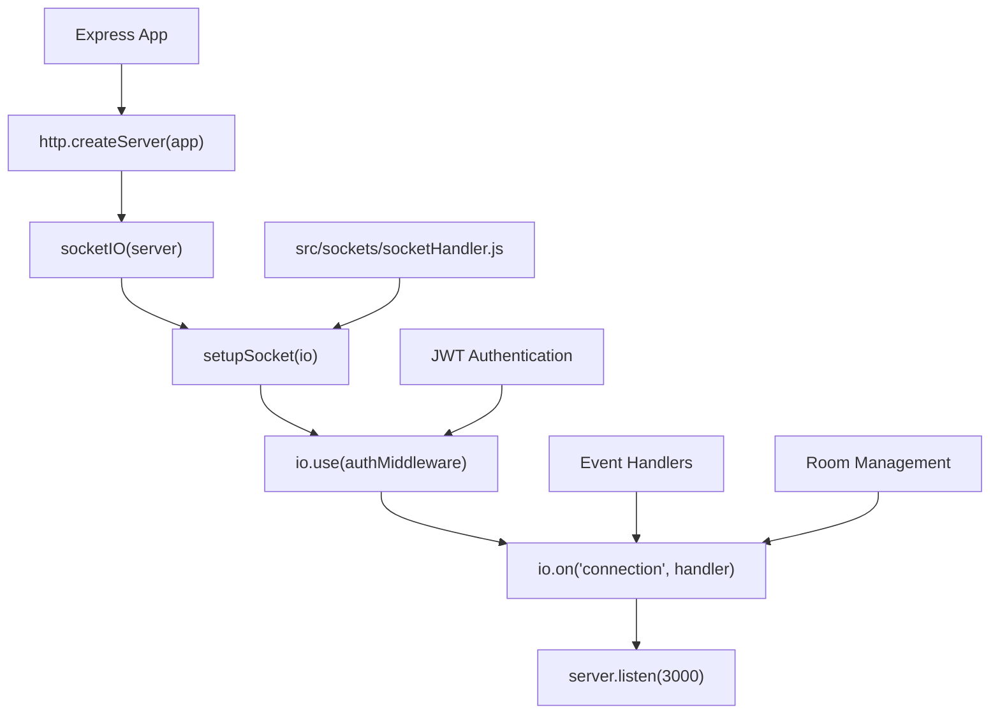
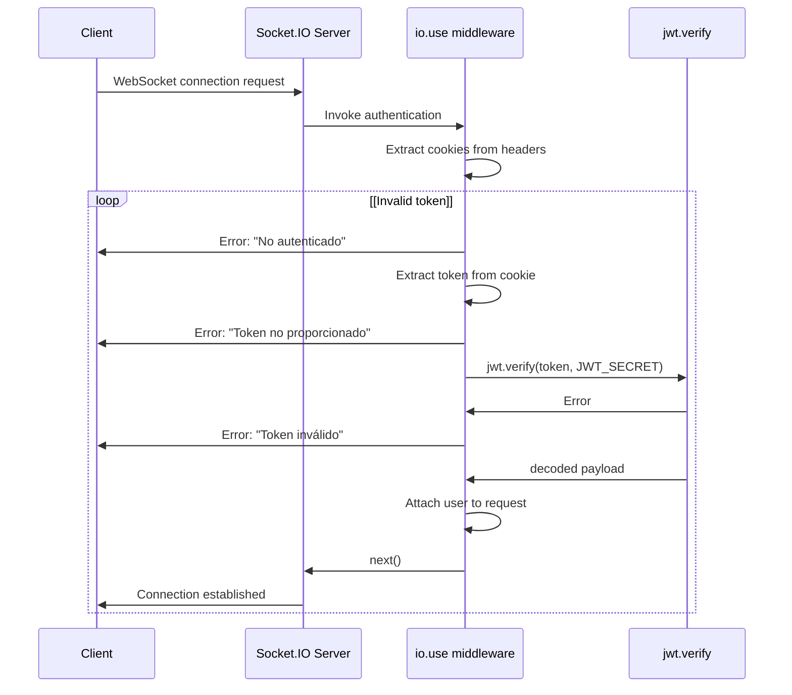
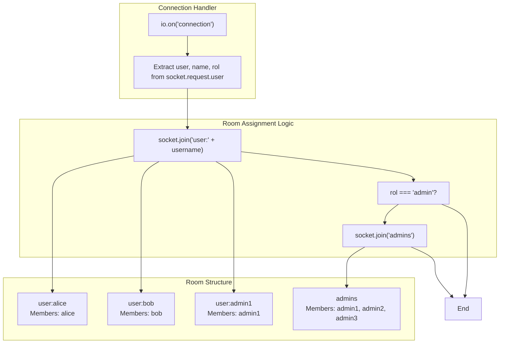
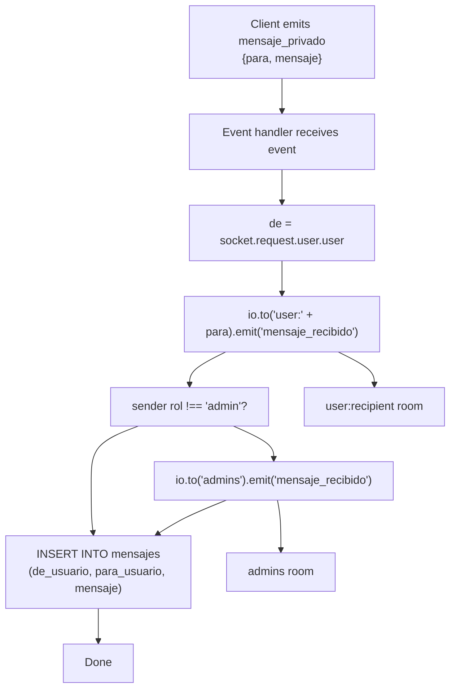
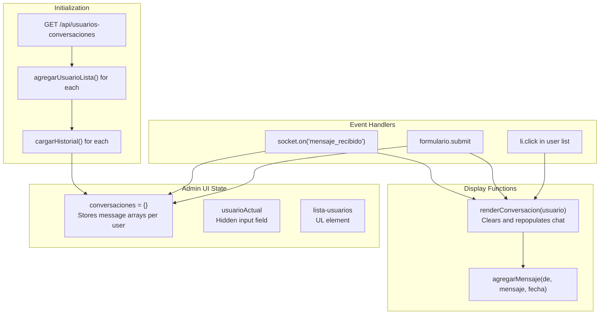
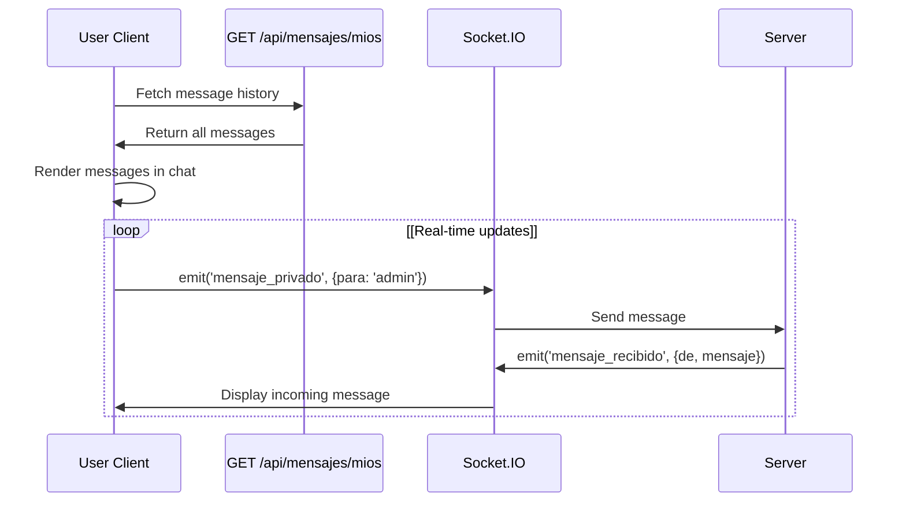
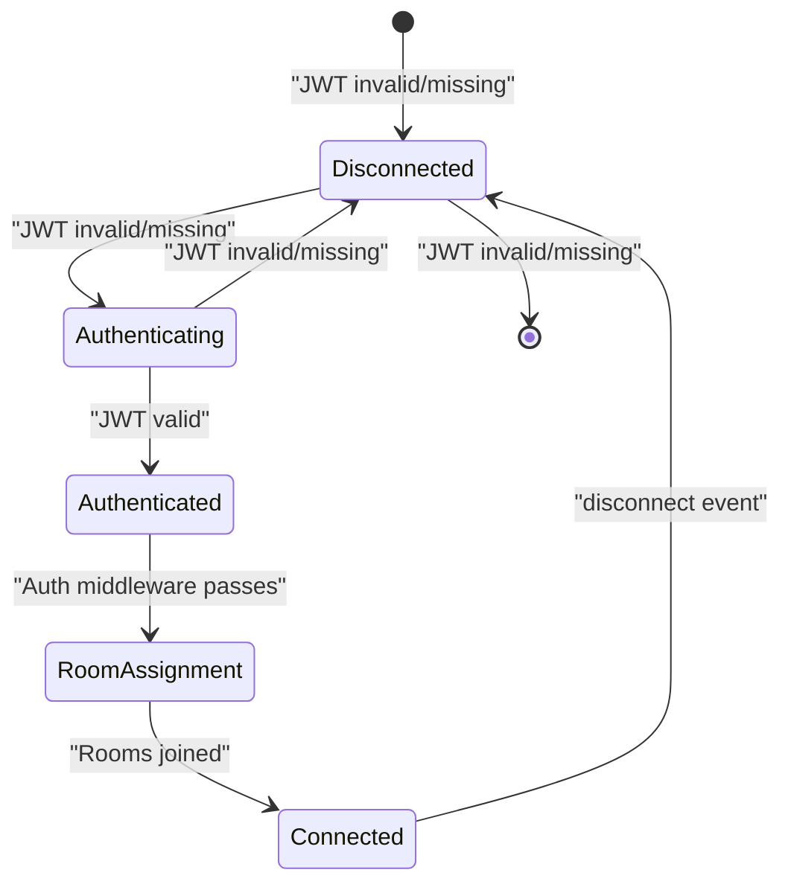

# Real-time Communication System

> **Relevant source files**
> * [index.js](https://github.com/moichuelo/registro/blob/544abbcc/index.js)
> * [src/sockets/socketHandler.js](https://github.com/moichuelo/registro/blob/544abbcc/src/sockets/socketHandler.js)
> * [views/soporte.ejs](https://github.com/moichuelo/registro/blob/544abbcc/views/soporte.ejs)

## Purpose and Scope

This document describes the Socket.IO-based real-time communication system that enables bidirectional messaging between users and administrators. The system implements a support chat feature with WebSocket connections, JWT-based authentication, room-based message routing, and database persistence.

For information about the HTTP API endpoints that complement this system, see [API Endpoints](API-Endpoints.md). For the user interface implementation, see [Support Chat System](Support-Chat-System.md).

**Sources:** index.js, src/sockets/socketHandler.js, views/soporte.ejs

## System Architecture

The real-time communication system consists of three primary components:

| Component | File | Responsibility |
| --- | --- | --- |
| Socket.IO Server | index.js:9-12 | HTTP server creation and Socket.IO attachment |
| Socket Handler | src/sockets/socketHandler.js | WebSocket authentication, connection management, event handling |
| Client Interface | views/soporte.ejs:37-189 | Browser-side Socket.IO client and UI logic |

The system uses a dual-channel architecture where WebSocket connections handle real-time message delivery while HTTP endpoints provide historical message retrieval.

**Sources:** index.js, src/sockets/socketHandler.js

### Socket.IO Server Initialization



**Diagram: Socket.IO Server Initialization Flow**

The Socket.IO server is initialized in [index.js L8-L12](https://github.com/moichuelo/registro/blob/544abbcc/index.js#L8-L12)

 by creating an HTTP server from the Express application and attaching Socket.IO to it. The `setupSocket` function from [src/sockets/socketHandler.js](https://github.com/moichuelo/registro/blob/544abbcc/src/sockets/socketHandler.js)

 is called at [index.js L57](https://github.com/moichuelo/registro/blob/544abbcc/index.js#L57-L57)

 to configure authentication middleware and event handlers before the server starts listening.

**Sources:** index.js:8-12, index.js:57

## WebSocket Authentication

### Authentication Middleware

The Socket.IO server implements authentication using JWT tokens stored in HTTP-only cookies. The authentication occurs at the connection level, not per-message.



**Diagram: WebSocket Authentication Sequence**

The authentication middleware is registered at [src/sockets/socketHandler.js L6-L32](https://github.com/moichuelo/registro/blob/544abbcc/src/sockets/socketHandler.js#L6-L32)

 It extracts the JWT token from the `cookie` header using regex matching at [src/sockets/socketHandler.js L16](https://github.com/moichuelo/registro/blob/544abbcc/src/sockets/socketHandler.js#L16-L16)

 verifies it using `jwt.verify` at [src/sockets/socketHandler.js L25](https://github.com/moichuelo/registro/blob/544abbcc/src/sockets/socketHandler.js#L25-L25)

 and attaches the decoded user information to `socket.request.user` at [src/sockets/socketHandler.js L26](https://github.com/moichuelo/registro/blob/544abbcc/src/sockets/socketHandler.js#L26-L26)

**Key Implementation Details:**

| Aspect | Implementation | Location |
| --- | --- | --- |
| Cookie Extraction | Regex pattern `/token=([^;]+)/` | [src/sockets/socketHandler.js L16](https://github.com/moichuelo/registro/blob/544abbcc/src/sockets/socketHandler.js#L16-L16) |
| Token Verification | `jwt.verify(token, process.env.JWT_SECRET)` | [src/sockets/socketHandler.js L25](https://github.com/moichuelo/registro/blob/544abbcc/src/sockets/socketHandler.js#L25-L25) |
| User Attachment | `req.user = decoded` | [src/sockets/socketHandler.js L26](https://github.com/moichuelo/registro/blob/544abbcc/src/sockets/socketHandler.js#L26-L26) |
| Error Handling | Returns `Error` object to reject connection | [src/sockets/socketHandler.js L12-L30](https://github.com/moichuelo/registro/blob/544abbcc/src/sockets/socketHandler.js#L12-L30) |

**Sources:** src/sockets/socketHandler.js:6-32

## Room Management Strategy

### Room Types and Assignment

The system implements a sophisticated room-based routing strategy using Socket.IO rooms for targeted message delivery.



**Diagram: Room Assignment Strategy**

Every authenticated user is assigned to a personal room named `user:{username}` at [src/sockets/socketHandler.js L42](https://github.com/moichuelo/registro/blob/544abbcc/src/sockets/socketHandler.js#L42-L42)

 If the user has the `admin` role, they additionally join the `admins` room at [src/sockets/socketHandler.js L43](https://github.com/moichuelo/registro/blob/544abbcc/src/sockets/socketHandler.js#L43-L43)

 This dual-room membership for admins enables the message broadcasting pattern described below.

**Room Naming Conventions:**

| Room Pattern | Example | Purpose |
| --- | --- | --- |
| `user:{username}` | `user:alice` | Direct messages to specific user |
| `admins` | `admins` | Broadcast to all online administrators |

**Sources:** src/sockets/socketHandler.js:36-43

## Message Event Handling

### Event: mensaje_privado

The `mensaje_privado` event handles sending messages between users. The routing logic differs based on sender role.



**Diagram: mensaje_privado Event Routing Logic**

The event handler at [src/sockets/socketHandler.js L45-L63](https://github.com/moichuelo/registro/blob/544abbcc/src/sockets/socketHandler.js#L45-L63)

 implements the following logic:

1. **Extract sender**: The sender username is extracted from `socket.request.user.user` at [src/sockets/socketHandler.js L46](https://github.com/moichuelo/registro/blob/544abbcc/src/sockets/socketHandler.js#L46-L46)
2. **Direct delivery**: Message is emitted to the recipient's personal room at [src/sockets/socketHandler.js L48](https://github.com/moichuelo/registro/blob/544abbcc/src/sockets/socketHandler.js#L48-L48)
3. **Admin notification**: If sender is not admin, message is also broadcast to all admins at [src/sockets/socketHandler.js L50-L52](https://github.com/moichuelo/registro/blob/544abbcc/src/sockets/socketHandler.js#L50-L52)
4. **Persistence**: Message is stored in the `mensajes` table at [src/sockets/socketHandler.js L55-L62](https://github.com/moichuelo/registro/blob/544abbcc/src/sockets/socketHandler.js#L55-L62)

**Event Payload Structures:**

| Event | Direction | Payload | Example |
| --- | --- | --- | --- |
| `mensaje_privado` | Client → Server | `{para: string, mensaje: string}` | `{para: "admin", mensaje: "Hello"}` |
| `mensaje_recibido` | Server → Client | `{de: string, mensaje: string}` | `{de: "alice", mensaje: "Hello"}` |

**Sources:** src/sockets/socketHandler.js:45-63

### Event: disconnect

The `disconnect` event is handled at [src/sockets/socketHandler.js L65-L67](https://github.com/moichuelo/registro/blob/544abbcc/src/sockets/socketHandler.js#L65-L67)

 and logs the disconnection. Socket.IO automatically removes the socket from all rooms upon disconnection.

**Sources:** src/sockets/socketHandler.js:65-67

## Database Persistence

### Message Storage Schema

All messages are persisted to the `mensajes` table for historical retrieval via HTTP endpoints.

```css
#mermaid-a19z30qjfth{font-family:ui-sans-serif,-apple-system,system-ui,Segoe UI,Helvetica;font-size:16px;fill:#333;}@keyframes edge-animation-frame{from{stroke-dashoffset:0;}}@keyframes dash{to{stroke-dashoffset:0;}}#mermaid-a19z30qjfth .edge-animation-slow{stroke-dasharray:9,5!important;stroke-dashoffset:900;animation:dash 50s linear infinite;stroke-linecap:round;}#mermaid-a19z30qjfth .edge-animation-fast{stroke-dasharray:9,5!important;stroke-dashoffset:900;animation:dash 20s linear infinite;stroke-linecap:round;}#mermaid-a19z30qjfth .error-icon{fill:#dddddd;}#mermaid-a19z30qjfth .error-text{fill:#222222;stroke:#222222;}#mermaid-a19z30qjfth .edge-thickness-normal{stroke-width:1px;}#mermaid-a19z30qjfth .edge-thickness-thick{stroke-width:3.5px;}#mermaid-a19z30qjfth .edge-pattern-solid{stroke-dasharray:0;}#mermaid-a19z30qjfth .edge-thickness-invisible{stroke-width:0;fill:none;}#mermaid-a19z30qjfth .edge-pattern-dashed{stroke-dasharray:3;}#mermaid-a19z30qjfth .edge-pattern-dotted{stroke-dasharray:2;}#mermaid-a19z30qjfth .marker{fill:#999;stroke:#999;}#mermaid-a19z30qjfth .marker.cross{stroke:#999;}#mermaid-a19z30qjfth svg{font-family:ui-sans-serif,-apple-system,system-ui,Segoe UI,Helvetica;font-size:16px;}#mermaid-a19z30qjfth p{margin:0;}#mermaid-a19z30qjfth .entityBox{fill:#ffffff;stroke:#dddddd;}#mermaid-a19z30qjfth .relationshipLabelBox{fill:#dddddd;opacity:0.7;background-color:#dddddd;}#mermaid-a19z30qjfth .relationshipLabelBox rect{opacity:0.5;}#mermaid-a19z30qjfth .labelBkg{background-color:rgba(221, 221, 221, 0.5);}#mermaid-a19z30qjfth .edgeLabel .label{fill:#dddddd;font-size:14px;}#mermaid-a19z30qjfth .label{font-family:ui-sans-serif,-apple-system,system-ui,Segoe UI,Helvetica;color:#333;}#mermaid-a19z30qjfth .edge-pattern-dashed{stroke-dasharray:8,8;}#mermaid-a19z30qjfth .node rect,#mermaid-a19z30qjfth .node circle,#mermaid-a19z30qjfth .node ellipse,#mermaid-a19z30qjfth .node polygon{fill:#ffffff;stroke:#dddddd;stroke-width:1px;}#mermaid-a19z30qjfth .relationshipLine{stroke:#999;stroke-width:1;fill:none;}#mermaid-a19z30qjfth .marker{fill:none!important;stroke:#999!important;stroke-width:1;}#mermaid-a19z30qjfth :root{--mermaid-font-family:"trebuchet ms",verdana,arial,sans-serif;}de_usuario referencespara_usuario referencesmensajesvarcharde_usuarioFKvarcharpara_usuarioFKtextmensajedatetimefechausuariosvarcharusuarioPKvarcharnombrevarcharrol
```

**Diagram: Message Persistence Data Model**

The SQL insertion occurs at [src/sockets/socketHandler.js L55-L62](https://github.com/moichuelo/registro/blob/544abbcc/src/sockets/socketHandler.js#L55-L62)

 with the query:

```sql
INSERT INTO mensajes (de_usuario, para_usuario, mensaje) VALUES (?, ?, ?)
```

The `fecha` column uses a database default timestamp. Error handling logs failures but does not reject the WebSocket event.

**Sources:** src/sockets/socketHandler.js:55-62

## Client-Side Implementation

### Socket.IO Client Initialization

The client-side Socket.IO library is loaded at [views/soporte.ejs L37](https://github.com/moichuelo/registro/blob/544abbcc/views/soporte.ejs#L37-L37)

 and initialized at [views/soporte.ejs L39](https://github.com/moichuelo/registro/blob/544abbcc/views/soporte.ejs#L39-L39)

:

```javascript
const socket = io();
```

This establishes a WebSocket connection to the server with automatic authentication via cookies.

**Sources:** views/soporte.ejs:37-39

### Admin Interface Logic

Administrators have access to a multi-conversation interface with user list and conversation switching.



**Diagram: Admin Chat Interface State Management**

**Key Functions:**

| Function | Location | Purpose |
| --- | --- | --- |
| `agregarUsuarioLista(usuario)` | [views/soporte.ejs L89-L102](https://github.com/moichuelo/registro/blob/544abbcc/views/soporte.ejs#L89-L102) | Adds user to sidebar list with click handler |
| `cargarHistorial(usuario)` | [views/soporte.ejs L115-L125](https://github.com/moichuelo/registro/blob/544abbcc/views/soporte.ejs#L115-L125) | Fetches message history from HTTP API |
| `renderConversacion(usuario)` | [views/soporte.ejs L69-L86](https://github.com/moichuelo/registro/blob/544abbcc/views/soporte.ejs#L69-L86) | Clears chat and displays selected conversation |
| `agregarMensaje(de, mensaje, fecha)` | [views/soporte.ejs L54-L60](https://github.com/moichuelo/registro/blob/544abbcc/views/soporte.ejs#L54-L60) | Appends message to chat DOM |

**Visual Notification System:**

The admin interface implements a visual notification system at [views/soporte.ejs L136-L145](https://github.com/moichuelo/registro/blob/544abbcc/views/soporte.ejs#L136-L145)

:

* **Red + Bold**: Indicates unread messages from user not currently selected
* **Green + Bold**: Indicates currently active conversation
* **Normal**: User with no new messages

**Sources:** views/soporte.ejs:62-163

### User Interface Logic

Regular users have a simplified single-conversation interface that communicates with administrators.



**Diagram: User Chat Interface Flow**

**Initialization:**

The user interface loads message history at [views/soporte.ejs L166-L171](https://github.com/moichuelo/registro/blob/544abbcc/views/soporte.ejs#L166-L171)

 via HTTP GET to `/api/mensajes/mios`.

**Message Sending:**

Users always send messages to `"admin"` (hardcoded) at [views/soporte.ejs L184](https://github.com/moichuelo/registro/blob/544abbcc/views/soporte.ejs#L184-L184)

 The server routes these messages to the recipient's personal room and broadcasts to all admins via the `admins` room.

**Event Listeners:**

| Event | Location | Behavior |
| --- | --- | --- |
| `socket.on("mensaje_recibido")` | [views/soporte.ejs L174-L177](https://github.com/moichuelo/registro/blob/544abbcc/views/soporte.ejs#L174-L177) | Appends incoming message to chat |
| `formulario.submit` | [views/soporte.ejs L180-L187](https://github.com/moichuelo/registro/blob/544abbcc/views/soporte.ejs#L180-L187) | Emits `mensaje_privado` event |

**Sources:** views/soporte.ejs:164-188

## Integration with HTTP API

The real-time system is complemented by HTTP endpoints for historical message retrieval:

| Endpoint | Auth | Purpose | Used By |
| --- | --- | --- | --- |
| `GET /api/mensajes/mios` | User | Retrieve own message history | User interface initialization |
| `GET /api/mensajes?con={username}` | Admin | Retrieve conversation with specific user | Admin conversation switching |
| `GET /api/usuarios-conversaciones` | Admin | List all users with messages | Admin user list population |

These endpoints query the same `mensajes` table that WebSocket events write to, ensuring consistency between real-time and historical data.

**Sources:** views/soporte.ejs:105-112, views/soporte.ejs:116, views/soporte.ejs:166

## Connection Lifecycle



**Diagram: WebSocket Connection State Machine**

The connection lifecycle follows these states:

1. **Disconnected**: Initial state before connection
2. **Authenticating**: JWT validation via middleware [src/sockets/socketHandler.js L6-L32](https://github.com/moichuelo/registro/blob/544abbcc/src/sockets/socketHandler.js#L6-L32)
3. **Room Assignment**: User assigned to rooms [src/sockets/socketHandler.js L42-L43](https://github.com/moichuelo/registro/blob/544abbcc/src/sockets/socketHandler.js#L42-L43)
4. **Connected**: Socket ready for event handling [src/sockets/socketHandler.js L45-L67](https://github.com/moichuelo/registro/blob/544abbcc/src/sockets/socketHandler.js#L45-L67)

Connections are automatically cleaned up by Socket.IO on disconnect, removing the socket from all rooms.

**Sources:** src/sockets/socketHandler.js:6-67

## Error Handling

The system implements error handling at multiple levels:

| Error Type | Location | Handling Strategy |
| --- | --- | --- |
| Missing cookies | [src/sockets/socketHandler.js L10-L13](https://github.com/moichuelo/registro/blob/544abbcc/src/sockets/socketHandler.js#L10-L13) | Reject connection with error |
| Missing token | [src/sockets/socketHandler.js L19-L22](https://github.com/moichuelo/registro/blob/544abbcc/src/sockets/socketHandler.js#L19-L22) | Reject connection with error |
| Invalid token | [src/sockets/socketHandler.js L28-L31](https://github.com/moichuelo/registro/blob/544abbcc/src/sockets/socketHandler.js#L28-L31) | Reject connection with error |
| Database insertion failure | [src/sockets/socketHandler.js L57-L61](https://github.com/moichuelo/registro/blob/544abbcc/src/sockets/socketHandler.js#L57-L61) | Log error, continue operation |

Database insertion errors are logged but do not disrupt the real-time message delivery, ensuring that communication continues even if persistence fails temporarily.

**Sources:** src/sockets/socketHandler.js:10-13, src/sockets/socketHandler.js:19-22, src/sockets/socketHandler.js:28-31, src/sockets/socketHandler.js:57-61