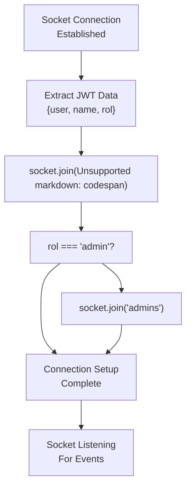
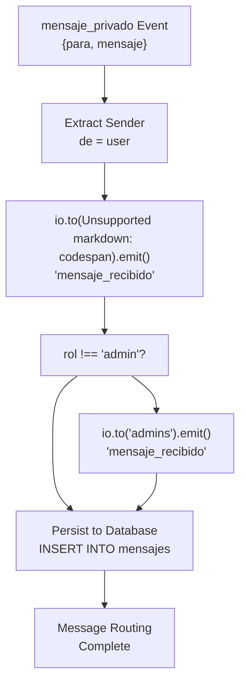
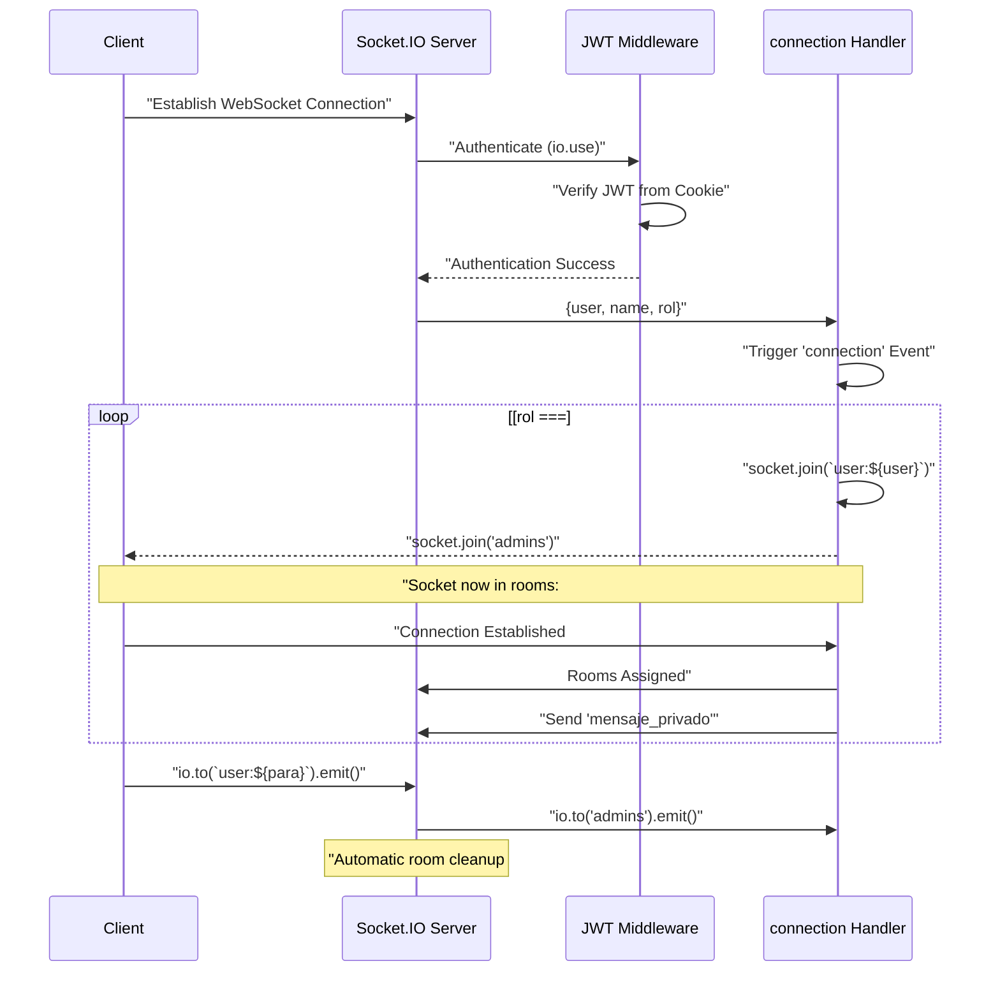

# Room Management

> **Relevant source files**
> * [src/sockets/socketHandler.js](https://github.com/moichuelo/registro/blob/544abbcc/src/sockets/socketHandler.js)

## Purpose and Scope

This document describes the Socket.IO room management system used to organize and route real-time messages in the support chat feature. Rooms serve as logical groupings of connected WebSocket clients, enabling targeted message delivery to specific users or user groups. The system implements two types of rooms: personal rooms for direct user-to-user communication and a collective admin room for supervision and coordination.

For information about Socket.IO server initialization, see [Socket.IO Server Setup](/moichuelo/registro/7.1-socket.io-server-setup). For details on message event handling, see [Message Handling](Message-Handling.md).

**Sources:** [src/sockets/socketHandler.js L1-L71](https://github.com/moichuelo/registro/blob/544abbcc/src/sockets/socketHandler.js#L1-L71)

---

## Room Types

The system implements two distinct room categories that serve different communication patterns:

| Room Type | Naming Pattern | Purpose | Membership |
| --- | --- | --- | --- |
| Personal Room | `user:{username}` | Direct message delivery to specific user | Single user (the username owner) |
| Admin Room | `admins` | Broadcast messages to all administrators | All users with `rol === "admin"` |

### Personal Rooms

Every connected user automatically joins a personal room named `user:{username}` where `{username}` is the value of the `user` field from their JWT token. These rooms enable one-to-one message delivery, ensuring messages reach only the intended recipient.

### Admin Room

Administrators join both their personal room and a shared `admins` room. This collective room enables:

* Broadcasting messages from non-admin users to all online administrators
* Admin-to-admin coordination and visibility
* Supervision of user support requests

**Sources:** [src/sockets/socketHandler.js L42-L43](https://github.com/moichuelo/registro/blob/544abbcc/src/sockets/socketHandler.js#L42-L43)

---

## Room Assignment Architecture

The following diagram illustrates how users are assigned to rooms upon WebSocket connection:



**Room Assignment Process**

Room assignment occurs in the `connection` event handler immediately after JWT authentication:

1. **Extract User Data**: The decoded JWT payload contains `user`, `name`, and `rol` fields [src/sockets/socketHandler.js L37](https://github.com/moichuelo/registro/blob/544abbcc/src/sockets/socketHandler.js#L37-L37)
2. **Join Personal Room**: Every user joins `user:${user}` unconditionally [src/sockets/socketHandler.js L42](https://github.com/moichuelo/registro/blob/544abbcc/src/sockets/socketHandler.js#L42-L42)
3. **Conditional Admin Room Join**: If `rol === "admin"`, user also joins the `admins` room [src/sockets/socketHandler.js L43](https://github.com/moichuelo/registro/blob/544abbcc/src/sockets/socketHandler.js#L43-L43)

**Sources:** [src/sockets/socketHandler.js L36-L43](https://github.com/moichuelo/registro/blob/544abbcc/src/sockets/socketHandler.js#L36-L43)

---

## Room-Based Message Routing

The room system enables sophisticated message routing logic that differs based on sender role and message destination:



**Routing Logic**

When a `mensaje_privado` event is received [src/sockets/socketHandler.js L45](https://github.com/moichuelo/registro/blob/544abbcc/src/sockets/socketHandler.js#L45-L45)

 the system executes the following routing:

1. **Direct Delivery**: The message is always emitted to the recipient's personal room `user:${para}` [src/sockets/socketHandler.js L48](https://github.com/moichuelo/registro/blob/544abbcc/src/sockets/socketHandler.js#L48-L48)
2. **Admin Broadcast** (conditional): If the sender is NOT an admin (`rol !== "admin"`), the message is also broadcast to the `admins` room [src/sockets/socketHandler.js L50-L52](https://github.com/moichuelo/registro/blob/544abbcc/src/sockets/socketHandler.js#L50-L52)
3. **Persistence**: The message is stored in the `mensajes` database table [src/sockets/socketHandler.js L55-L62](https://github.com/moichuelo/registro/blob/544abbcc/src/sockets/socketHandler.js#L55-L62)

This design ensures:

* Users can send messages directly to administrators
* All administrators see incoming user messages (supervision capability)
* Admin-to-user messages remain private (only visible to the specific user)
* Admin-to-admin messages are visible to all administrators

**Sources:** [src/sockets/socketHandler.js L45-L63](https://github.com/moichuelo/registro/blob/544abbcc/src/sockets/socketHandler.js#L45-L63)

---

## Room Membership Management

### Join Operation

The `socket.join()` method adds the current socket to specified room(s). This is a Socket.IO method that maintains room membership internally:

```
socket.join(`user:${user}`);  // Join personal room
if (rol === "admin") socket.join("admins");  // Conditionally join admin room
```

**Key Characteristics:**

* Membership is per-socket, not per-user (multiple tabs = multiple sockets)
* A socket can belong to multiple rooms simultaneously
* Room creation is implicit; calling `socket.join()` creates the room if it doesn't exist

**Sources:** [src/sockets/socketHandler.js L42-L43](https://github.com/moichuelo/registro/blob/544abbcc/src/sockets/socketHandler.js#L42-L43)

### Automatic Leave on Disconnect

Socket.IO automatically removes disconnected sockets from all rooms they had joined. The `disconnect` event handler [src/sockets/socketHandler.js L65-L67](https://github.com/moichuelo/registro/blob/544abbcc/src/sockets/socketHandler.js#L65-L67)

 logs disconnections but doesn't need to explicitly call `socket.leave()` for cleanup.

**Sources:** [src/sockets/socketHandler.js L65-L67](https://github.com/moichuelo/registro/blob/544abbcc/src/sockets/socketHandler.js#L65-L67)

---

## Message Emission to Rooms

### Targeting Specific Rooms

The `io.to()` method targets message emission to all sockets in a specified room:

```
io.to(`user:${para}`).emit("mensaje_recibido", { de, mensaje });
```

This emits the `mensaje_recibido` event only to sockets in room `user:${para}`, delivering the message to the intended recipient.

### Broadcasting to Multiple Rooms

When a non-admin sends a message, two `io.to()` calls execute sequentially:

```
io.to(`user:${para}`).emit("mensaje_recibido", { de, mensaje });  // To recipient
if (rol !== "admin") {
    io.to("admins").emit("mensaje_recibido", { de, mensaje });    // To all admins
}
```

This pattern creates a "broadcast to multiple rooms" behavior without explicit multi-room syntax, ensuring both the recipient and supervising administrators receive the message.

**Sources:** [src/sockets/socketHandler.js L48-L52](https://github.com/moichuelo/registro/blob/544abbcc/src/sockets/socketHandler.js#L48-L52)

---

## Room Naming Convention

| Room Name Pattern | Example | Generated By | Usage |
| --- | --- | --- | --- |
| `user:${username}` | `user:john_doe` | `socket.join(\`user:${user}`)` | Personal message delivery |
| `admins` | `admins` | `socket.join("admins")` | Admin broadcast channel |

The `user:` prefix distinguishes personal rooms from the admin room and provides a namespace-like organization. This prevents collisions if a user has the username `admins`, as their personal room would be `user:admins`, distinct from the `admins` admin room.

**Sources:** [src/sockets/socketHandler.js L42-L43](https://github.com/moichuelo/registro/blob/544abbcc/src/sockets/socketHandler.js#L42-L43)

---

## Connection Lifecycle and Room Membership



**Sources:** [src/sockets/socketHandler.js L4-L69](https://github.com/moichuelo/registro/blob/544abbcc/src/sockets/socketHandler.js#L4-L69)

---

## Technical Implementation Details

### Room Data Structure

Socket.IO maintains rooms as a Map-like data structure where:

* Keys are room names (strings)
* Values are Sets of socket IDs

This internal structure is managed entirely by Socket.IO; application code interacts with it only through `socket.join()`, `socket.leave()`, and `io.to()` methods.

### Performance Considerations

* **Room Lookup**: O(1) complexity for emitting to a room via `io.to(roomName)`
* **Multi-Room Membership**: No performance penalty; a socket can join unlimited rooms
* **Broadcast Efficiency**: `io.to("admins").emit()` iterates only over sockets in that room, not all connected sockets

**Sources:** [src/sockets/socketHandler.js L48-L52](https://github.com/moichuelo/registro/blob/544abbcc/src/sockets/socketHandler.js#L48-L52)

---

## Integration with Authentication

Room assignment depends on authenticated JWT data extracted by the Socket.IO authentication middleware [src/sockets/socketHandler.js L6-L32](https://github.com/moichuelo/registro/blob/544abbcc/src/sockets/socketHandler.js#L6-L32)

 The middleware populates `socket.request.user` with decoded token data, which the connection handler uses to determine room membership:

```javascript
const { user, name, rol } = socket.request.user;  // From JWT
socket.join(`user:${user}`);                      // Room name from JWT
if (rol === "admin") socket.join("admins");       // Conditional on JWT role
```

This tight coupling ensures room assignment is based on verified identity, preventing users from joining arbitrary rooms or impersonating others.

**Sources:** [src/sockets/socketHandler.js L6-L43](https://github.com/moichuelo/registro/blob/544abbcc/src/sockets/socketHandler.js#L6-L43)

---

## Summary

The room management system provides a clean abstraction for message routing in the support chat feature:

* **Personal rooms** (`user:{username}`) enable direct message delivery to specific users
* The **admin room** (`admins`) creates a supervision channel where non-admin messages are broadcast
* Room assignment is automatic on connection, based on authenticated JWT data
* Message routing logic leverages rooms to implement both direct messaging and admin broadcast patterns
* Socket.IO handles room membership lifecycle, including automatic cleanup on disconnect

This architecture separates message routing concerns from business logic, making the support chat system scalable and maintainable.

**Sources:** [src/sockets/socketHandler.js L1-L71](https://github.com/moichuelo/registro/blob/544abbcc/src/sockets/socketHandler.js#L1-L71)