# Security Measures

> **Relevant source files**
> * [index.js](https://github.com/moichuelo/registro/blob/544abbcc/index.js)
> * [package-lock.json](https://github.com/moichuelo/registro/blob/544abbcc/package-lock.json)
> * [src/router.js](https://github.com/moichuelo/registro/blob/544abbcc/src/router.js)

This page documents the comprehensive security measures implemented in the registro-sesiones application to protect against common web vulnerabilities and attacks. These security layers work together to provide defense-in-depth protection for user data, authentication flows, and application integrity.

For authentication and authorization mechanisms, see [Authentication & Authorization](Authentication-&-Authorization.md). For JWT token management specifically, see [JWT Token Management](JWT-Token-Management.md). For middleware authentication verification, see [verifyToken Middleware](verifyToken-Middleware.md) and [verifyAdmin Middleware](verifyAdmin-Middleware.md).

---

## Security Architecture Overview

The application implements a multi-layered security architecture where each incoming request passes through multiple security checkpoints before reaching business logic. This defense-in-depth approach ensures that even if one security measure fails, others remain in place to protect the system.

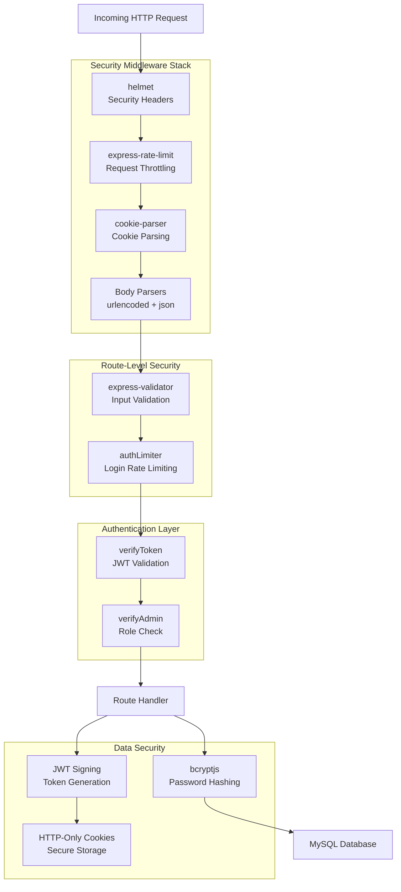

**Sources:** [index.js L15-L48](https://github.com/moichuelo/registro/blob/544abbcc/index.js#L15-L48)

 [src/router.js L1-L607](https://github.com/moichuelo/registro/blob/544abbcc/src/router.js#L1-L607)

---

## Security Middleware Module

The application uses a centralized security middleware module that is applied globally to all routes. This middleware is loaded early in the application bootstrap sequence to ensure all requests are protected.

### Implementation

The security middleware is imported and registered in the main application entry point:

| Configuration Point | Code Reference | Purpose |
| --- | --- | --- |
| Middleware import | [index.js L15](https://github.com/moichuelo/registro/blob/544abbcc/index.js#L15-L15) | Loads security middleware module |
| Middleware registration | [index.js L45](https://github.com/moichuelo/registro/blob/544abbcc/index.js#L45-L45) | Applies to all routes before routing |
| Position in stack | After static files, before routing | Protects dynamic routes only |

The middleware is registered with `app.use(securityMiddleware)`, which means it applies to every request that isn't serving static assets from `/resources`. This positioning is intentional—static assets don't need the same security processing as dynamic routes.

**Sources:** [index.js L15](https://github.com/moichuelo/registro/blob/544abbcc/index.js#L15-L15)

 [index.js L45](https://github.com/moichuelo/registro/blob/544abbcc/index.js#L45-L45)

---

## HTTP Security Headers (Helmet)

The application uses the `helmet` package to set secure HTTP headers that protect against common web vulnerabilities including cross-site scripting (XSS), clickjacking, and content sniffing attacks.

### Helmet Configuration

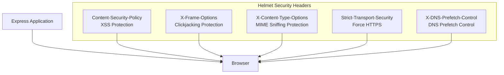

### Package Details

| Package | Version | Purpose |
| --- | --- | --- |
| `helmet` | ^8.1.0 | Secure HTTP headers middleware |

The `helmet` middleware is configured as part of the `securityMiddleware` module and automatically sets multiple security headers with sensible defaults.

**Sources:** [package-lock.json L1740-L1748](https://github.com/moichuelo/registro/blob/544abbcc/package-lock.json#L1740-L1748)

 [index.js L45](https://github.com/moichuelo/registro/blob/544abbcc/index.js#L45-L45)

---

## Rate Limiting

The application implements two levels of rate limiting to protect against brute-force attacks and resource exhaustion: global rate limiting and authentication-specific rate limiting.

### Global Rate Limiting

Global rate limiting is applied through the `express-rate-limit` middleware, which is part of the security middleware stack.

### Authentication Rate Limiting

A specialized rate limiter protects the authentication endpoint to prevent brute-force password attacks.

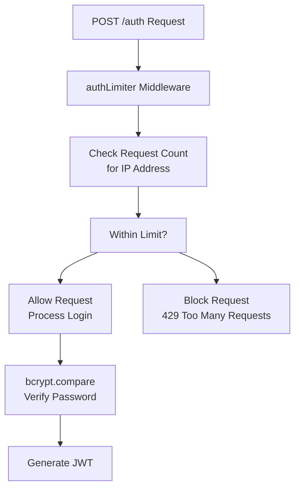

### Implementation Details

The authentication limiter is imported and applied to the login route:

| Implementation Point | Code Reference | Details |
| --- | --- | --- |
| Limiter import | [src/router.js L21](https://github.com/moichuelo/registro/blob/544abbcc/src/router.js#L21-L21) | `const limiter = require("./middlewares/authLimiter")` |
| Limiter application | [src/router.js L532](https://github.com/moichuelo/registro/blob/544abbcc/src/router.js#L532-L532) | `router.post("/auth", limiter, async (req, res)` |

The limiter is placed before the route handler, ensuring that rate limiting occurs before any authentication logic executes.

**Sources:** [package-lock.json L1371-L1382](https://github.com/moichuelo/registro/blob/544abbcc/package-lock.json#L1371-L1382)

 [src/router.js L21](https://github.com/moichuelo/registro/blob/544abbcc/src/router.js#L21-L21)

 [src/router.js L532](https://github.com/moichuelo/registro/blob/544abbcc/src/router.js#L532-L532)

---

## Input Validation

The application uses `express-validator` to sanitize and validate user inputs, preventing injection attacks and ensuring data integrity.

### Validation Implementation

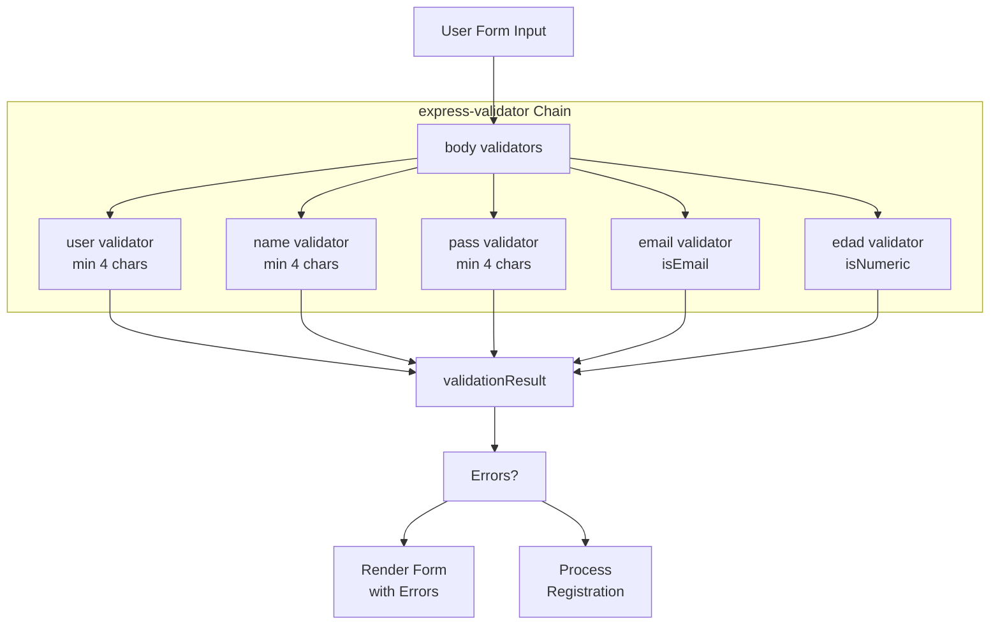

### Registration Validation Rules

The registration endpoint implements comprehensive validation:

| Field | Validation Rules | Code Reference |
| --- | --- | --- |
| `user` | Exists, min 4 characters | [src/router.js L416-L419](https://github.com/moichuelo/registro/blob/544abbcc/src/router.js#L416-L419) |
| `name` | Min 4 characters | [src/router.js L420-L422](https://github.com/moichuelo/registro/blob/544abbcc/src/router.js#L420-L422) |
| `pass` | Min 4 characters | [src/router.js L423-L425](https://github.com/moichuelo/registro/blob/544abbcc/src/router.js#L423-L425) |
| `email` | Valid email format | [src/router.js L426](https://github.com/moichuelo/registro/blob/544abbcc/src/router.js#L426-L426) |
| `edad` | Numeric value | [src/router.js L427](https://github.com/moichuelo/registro/blob/544abbcc/src/router.js#L427-L427) |

### Validation Flow

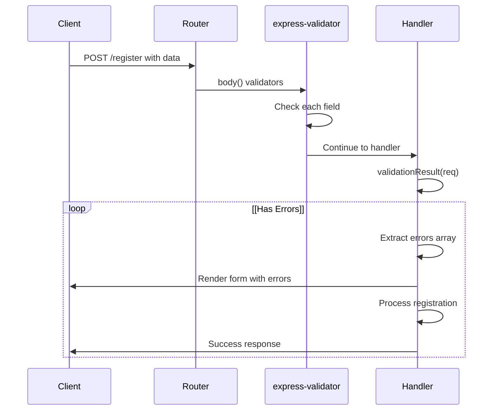

The validation error handling preserves user input to improve user experience:

* [src/router.js L430-L441](https://github.com/moichuelo/registro/blob/544abbcc/src/router.js#L430-L441) : Error handling that preserves form values
* [src/router.js L435-L440](https://github.com/moichuelo/registro/blob/544abbcc/src/router.js#L435-L440) : Rendering with validation errors and original values

**Sources:** [package-lock.json L1423-L1435](https://github.com/moichuelo/registro/blob/544abbcc/package-lock.json#L1423-L1435)

 [src/router.js L3](https://github.com/moichuelo/registro/blob/544abbcc/src/router.js#L3-L3)

 [src/router.js L414-L428](https://github.com/moichuelo/registro/blob/544abbcc/src/router.js#L414-L428)

 [src/router.js L430-L441](https://github.com/moichuelo/registro/blob/544abbcc/src/router.js#L430-L441)

---

## Password Hashing with bcrypt

All user passwords are hashed using `bcryptjs` before storage, ensuring that even if the database is compromised, plaintext passwords remain protected.

### Hashing Implementation

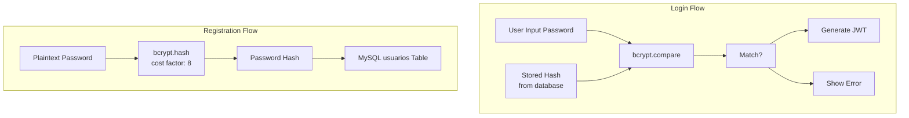

### Code Implementation

| Operation | Code Reference | Details |
| --- | --- | --- |
| Import bcrypt | [src/router.js L4](https://github.com/moichuelo/registro/blob/544abbcc/src/router.js#L4-L4) | `const bcrypt = require("bcryptjs")` |
| Hash password | [src/router.js L453](https://github.com/moichuelo/registro/blob/544abbcc/src/router.js#L453-L453) | `await bcrypt.hash(pass, 8)` - cost factor 8 |
| Store hash | [src/router.js L456-L464](https://github.com/moichuelo/registro/blob/544abbcc/src/router.js#L456-L464) | Insert hashed password into database |
| Compare password | [src/router.js L541-L543](https://github.com/moichuelo/registro/blob/544abbcc/src/router.js#L541-L543) | `await bcrypt.compare(pass, results[0].pass)` |

### Hashing Parameters

The application uses a cost factor of 8 for bcrypt hashing [src/router.js L453](https://github.com/moichuelo/registro/blob/544abbcc/src/router.js#L453-L453)

 which provides a balance between security and performance. The cost factor determines the computational cost of hashing—higher values increase security but also increase processing time.

### Security Considerations

The authentication flow ensures timing-attack resistance by:

1. Checking if user exists in database
2. Comparing password hashes using bcrypt's constant-time comparison
3. Returning the same error message for both invalid username and invalid password

This prevents attackers from enumerating valid usernames through timing analysis.

**Sources:** [package-lock.json L523-L531](https://github.com/moichuelo/registro/blob/544abbcc/package-lock.json#L523-L531)

 [src/router.js L4](https://github.com/moichuelo/registro/blob/544abbcc/src/router.js#L4-L4)

 [src/router.js L453](https://github.com/moichuelo/registro/blob/544abbcc/src/router.js#L453-L453)

 [src/router.js L537-L556](https://github.com/moichuelo/registro/blob/544abbcc/src/router.js#L537-L556)

---

## JWT Security Implementation

JSON Web Tokens (JWT) are used for stateless authentication, with several security measures in place to protect token integrity and prevent unauthorized access.

### JWT Generation and Signing

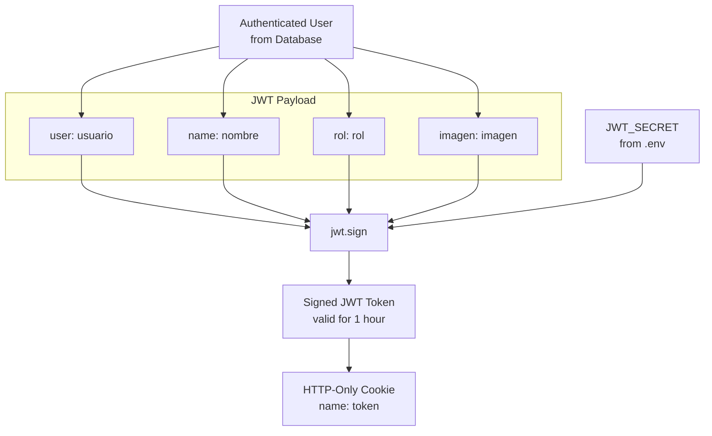

### JWT Configuration

| Security Feature | Implementation | Code Reference |
| --- | --- | --- |
| Secret key source | Environment variable `JWT_SECRET` | [src/router.js L567](https://github.com/moichuelo/registro/blob/544abbcc/src/router.js#L567-L567) |
| Token expiration | 1 hour | [src/router.js L567](https://github.com/moichuelo/registro/blob/544abbcc/src/router.js#L567-L567) |
| Cookie storage | HTTP-only cookie | [src/router.js L570-L574](https://github.com/moichuelo/registro/blob/544abbcc/src/router.js#L570-L574) |
| Cookie security | `httpOnly: true` | [src/router.js L571](https://github.com/moichuelo/registro/blob/544abbcc/src/router.js#L571-L571) |
| Cookie lifetime | 3600000ms (1 hour) | [src/router.js L573](https://github.com/moichuelo/registro/blob/544abbcc/src/router.js#L573-L573) |

### Payload Structure

The JWT payload contains minimal user information required for authorization:

```yaml
// Payload structure at src/router.js:559-564
{
  user: results[0].usuario,    // Username for identification
  name: results[0].nombre,      // Display name
  rol: results[0].rol,          // Role for authorization
  imagen: results[0].imagen     // Profile image filename
}
```

The payload excludes sensitive information like password hashes, ensuring that even if a token is intercepted, minimal information is exposed.

### Token Verification Flow

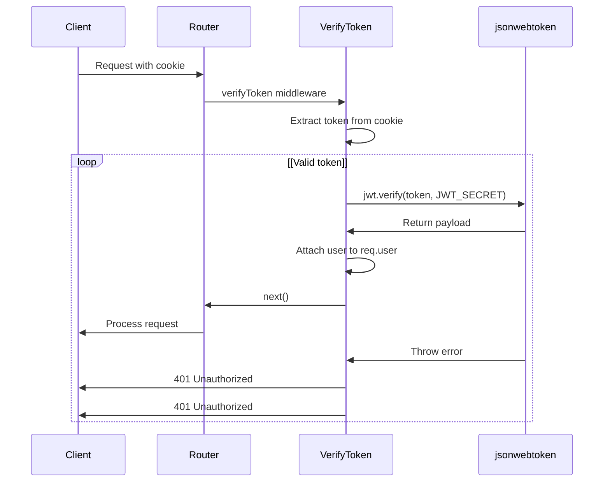

**Sources:** [src/router.js L15](https://github.com/moichuelo/registro/blob/544abbcc/src/router.js#L15-L15)

 [src/router.js L559-L574](https://github.com/moichuelo/registro/blob/544abbcc/src/router.js#L559-L574)

 [src/router.js L62](https://github.com/moichuelo/registro/blob/544abbcc/src/router.js#L62-L62)

---

## HTTP-Only Cookie Security

Tokens are stored in HTTP-only cookies rather than localStorage or sessionStorage, providing enhanced security against cross-site scripting (XSS) attacks.

### Cookie Configuration

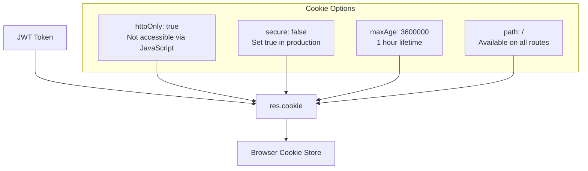

### Cookie Options

| Option | Value | Purpose | Code Reference |
| --- | --- | --- | --- |
| `httpOnly` | `true` | Prevents JavaScript access to cookie | [src/router.js L571](https://github.com/moichuelo/registro/blob/544abbcc/src/router.js#L571-L571) |
| `secure` | `false` (dev) | Should be `true` in production for HTTPS | [src/router.js L572](https://github.com/moichuelo/registro/blob/544abbcc/src/router.js#L572-L572) |
| `maxAge` | `3600000` | Cookie expires after 1 hour | [src/router.js L573](https://github.com/moichuelo/registro/blob/544abbcc/src/router.js#L573-L573) |
| Cookie name | `"token"` | Cookie identifier | [src/router.js L570](https://github.com/moichuelo/registro/blob/544abbcc/src/router.js#L570-L570) |

### XSS Protection

The `httpOnly` flag prevents malicious JavaScript from accessing the authentication token:

* Even if an XSS vulnerability exists, attackers cannot steal the token via `document.cookie`
* The browser automatically includes the cookie in requests to the same origin
* Token theft requires server-side vulnerabilities, not just client-side XSS

### Cookie Lifecycle

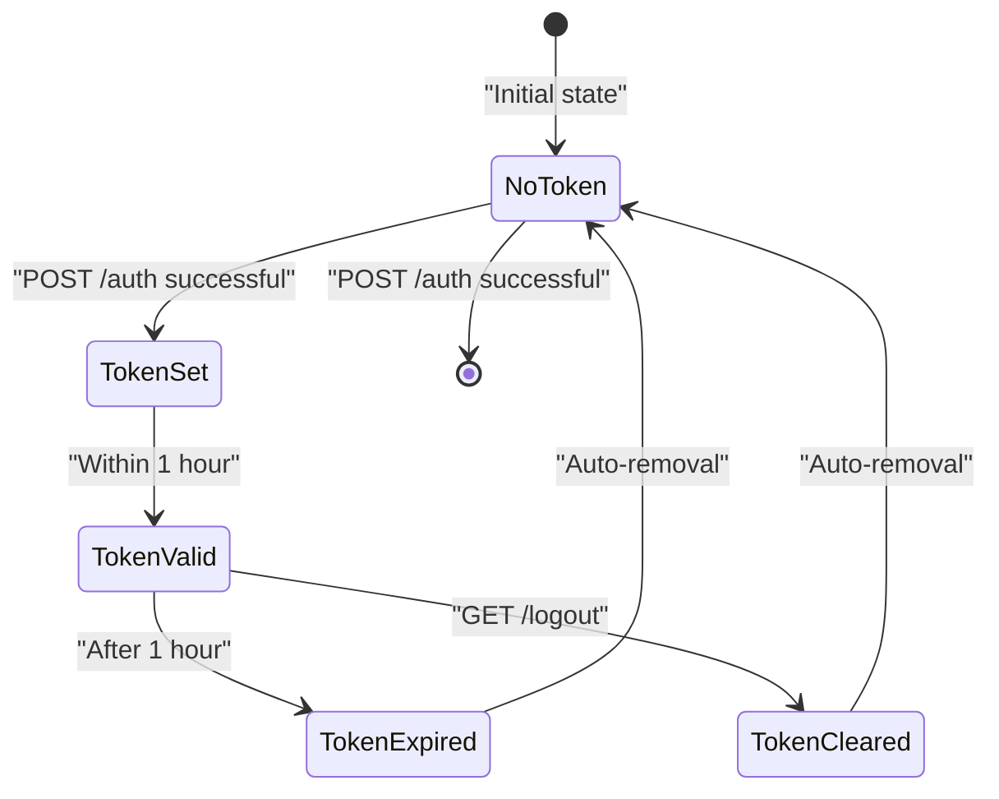

### Token Removal

The logout route clears the authentication cookie:

* [src/router.js L215-L218](https://github.com/moichuelo/registro/blob/544abbcc/src/router.js#L215-L218) : `res.clearCookie("token")` removes the token cookie
* Browser immediately stops sending the token with subsequent requests
* User is effectively logged out without server-side session management

**Sources:** [src/router.js L570-L574](https://github.com/moichuelo/registro/blob/544abbcc/src/router.js#L570-L574)

 [src/router.js L215-L218](https://github.com/moichuelo/registro/blob/544abbcc/src/router.js#L215-L218)

 [src/router.js L61](https://github.com/moichuelo/registro/blob/544abbcc/src/router.js#L61-L61)

---

## Security Best Practices Summary

The application implements multiple layers of security measures that work together to provide comprehensive protection:

### Security Checklist

| Security Measure | Status | Implementation |
| --- | --- | --- |
| Secure HTTP headers | ✓ Implemented | `helmet` middleware |
| Rate limiting (global) | ✓ Implemented | `express-rate-limit` |
| Rate limiting (authentication) | ✓ Implemented | `authLimiter` on `/auth` |
| Input validation | ✓ Implemented | `express-validator` on forms |
| Password hashing | ✓ Implemented | `bcryptjs` with cost factor 8 |
| Secure token generation | ✓ Implemented | `jsonwebtoken` with secret |
| HTTP-only cookies | ✓ Implemented | `httpOnly: true` flag |
| Token expiration | ✓ Implemented | 1-hour token lifetime |
| HTTPS enforcement | ⚠ Partial | `secure: false` in development |

### Security Middleware Execution Order

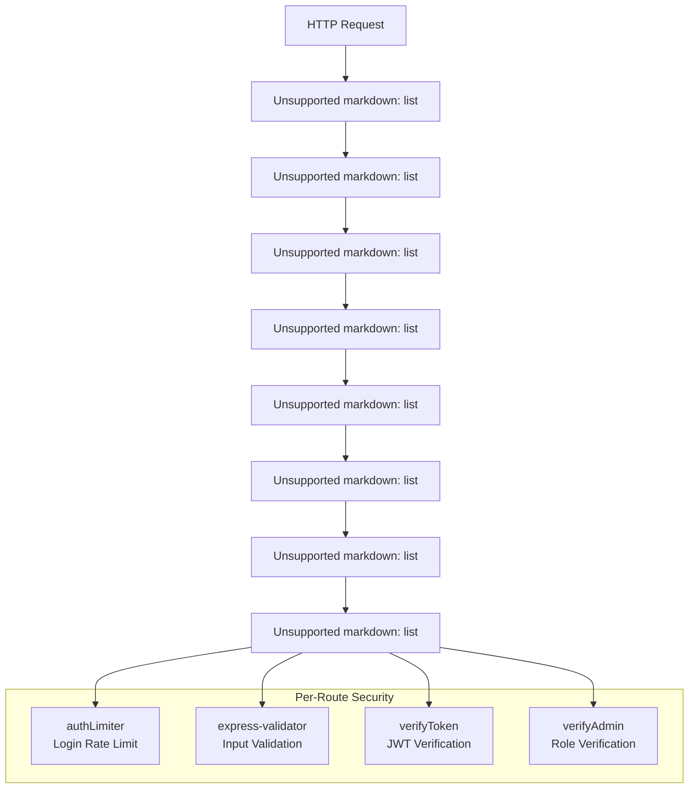

### File-Level Security Overview

| File | Security Responsibility | Key Components |
| --- | --- | --- |
| [index.js L15-L48](https://github.com/moichuelo/registro/blob/544abbcc/index.js#L15-L48) | Global security middleware registration | `securityMiddleware`, `helmet` |
| [src/router.js L21](https://github.com/moichuelo/registro/blob/544abbcc/src/router.js#L21-L21) | Authentication rate limiting | `authLimiter` |
| [src/router.js L3](https://github.com/moichuelo/registro/blob/544abbcc/src/router.js#L3-L3) | Input validation | `express-validator` |
| [src/router.js L4](https://github.com/moichuelo/registro/blob/544abbcc/src/router.js#L4-L4) | Password hashing | `bcryptjs` |
| [src/router.js L15](https://github.com/moichuelo/registro/blob/544abbcc/src/router.js#L15-L15) | Token signing/verification | `jsonwebtoken` |
| [src/middlewares/verifyToken.js](https://github.com/moichuelo/registro/blob/544abbcc/src/middlewares/verifyToken.js) | JWT validation middleware | Token verification logic |
| [src/middlewares/verifyAdmin.js](https://github.com/moichuelo/registro/blob/544abbcc/src/middlewares/verifyAdmin.js) | Role-based access control | Admin role verification |

**Sources:** [index.js L15-L48](https://github.com/moichuelo/registro/blob/544abbcc/index.js#L15-L48)

 [src/router.js L1-L607](https://github.com/moichuelo/registro/blob/544abbcc/src/router.js#L1-L607)

 [package-lock.json L1-L2896](https://github.com/moichuelo/registro/blob/544abbcc/package-lock.json#L1-L2896)