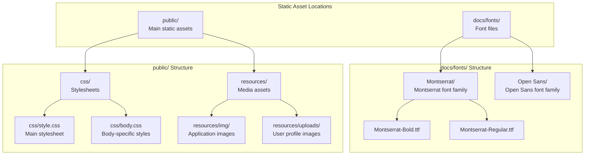
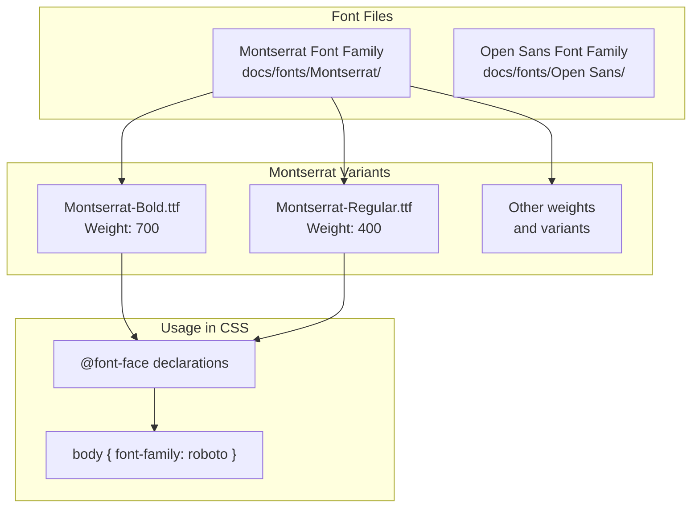
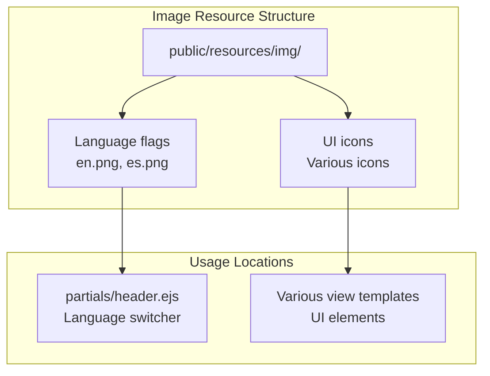
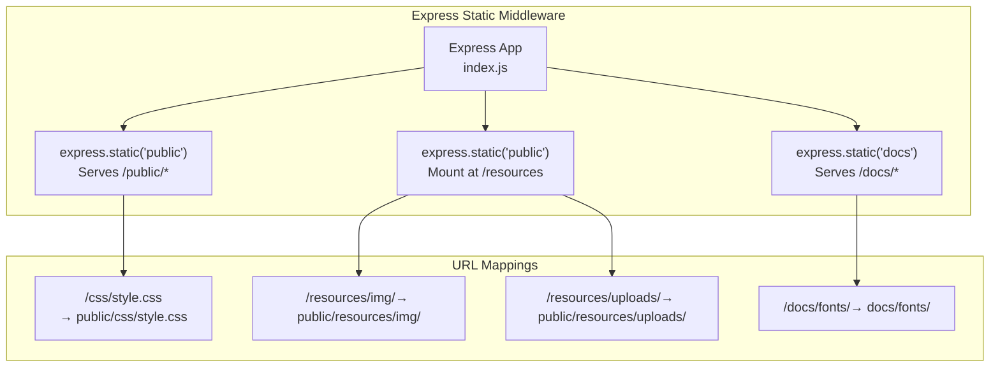
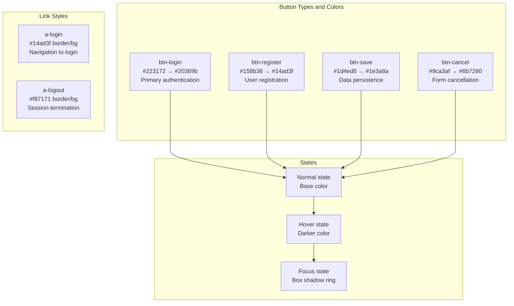

# Static Assets & Styling

> **Relevant source files**
> * [docs/fonts/Montserrat/Montserrat-Bold.ttf](https://github.com/moichuelo/registro/blob/544abbcc/docs/fonts/Montserrat/Montserrat-Bold.ttf)
> * [public/css/style.css](https://github.com/moichuelo/registro/blob/544abbcc/public/css/style.css)
> * [views/admin.ejs](https://github.com/moichuelo/registro/blob/544abbcc/views/admin.ejs)
> * [views/index.ejs](https://github.com/moichuelo/registro/blob/544abbcc/views/index.ejs)
> * [views/register.ejs](https://github.com/moichuelo/registro/blob/544abbcc/views/register.ejs)

## Purpose and Scope

This document covers the organization, configuration, and usage of static assets in the registro-sesiones application, including CSS stylesheets, font files, images, and user-uploaded content. For information about the EJS view templates that reference these assets, see [View Layer & Templates](Template-Structure.md). For details on how static files are served via Express middleware, see [Application Bootstrap](Application-Bootstrap.md).

---

## Static Asset Directory Structure

The application organizes static assets across multiple directories that are served by Express. The primary locations are `public/` for application assets and `docs/fonts/` for typography.



**Sources:** [views/index.ejs L1-L35](https://github.com/moichuelo/registro/blob/544abbcc/views/index.ejs#L1-L35)

 [views/register.ejs L1-L85](https://github.com/moichuelo/registro/blob/544abbcc/views/register.ejs#L1-L85)

 [views/admin.ejs L1-L71](https://github.com/moichuelo/registro/blob/544abbcc/views/admin.ejs#L1-L71)

 [docs/fonts/Montserrat/Montserrat-Bold.ttf L1-L10](https://github.com/moichuelo/registro/blob/544abbcc/docs/fonts/Montserrat/Montserrat-Bold.ttf#L1-L10)

---

## CSS Stylesheets

The application uses two primary CSS files to style the user interface. Both are located in the `public/css/` directory and served as static assets.

### Main Stylesheet (style.css)

The primary stylesheet [public/css/style.css L1-L353](https://github.com/moichuelo/registro/blob/544abbcc/public/css/style.css#L1-L353)

 contains the majority of application styles organized into logical sections:

| Style Category | Lines | Purpose |
| --- | --- | --- |
| Global body styles | 1-6 | Sets background, font, margins, text alignment |
| Language switcher | 8-12 | Active state styling for language selection |
| Form containers | 14-22 | Login and content container widths |
| Login form | 24-60 | Input fields, login button styling |
| Register button | 63-88 | Registration button with hover effects |
| Logout link | 95-110 | Styled anchor for logout action |
| Cancel/Save buttons | 113-167 | Form action buttons |
| Registration form | 170-193 | User registration form container |
| Select dropdowns | 196-223 | Styled select elements |
| Login link | 226-241 | Styled anchor for login action |
| Navigation menu | 249-276 | Menu bar and navigation items |
| Footer | 279-331 | Footer layout and styling |
| Image effects | 335-352 | Hover effects for images |

**Key Style Patterns:**

The stylesheet follows a consistent button styling pattern with hover and focus states:

```css
.btn-{type} {
    width: [percentage]%;
    padding: 15px;
    background-color: [color];
    border: 0;
    cursor: pointer;
    font-weight: bold;
}
.btn-{type}:hover {
    background-color: [darker-color];
}
.btn-{type}:focus {
    box-shadow: 0 0 0 3px [darker-color];
}
```

**Color Palette:**

| Element Type | Primary Color | Hover Color | Purpose |
| --- | --- | --- | --- |
| Login button | `#223172` | `#20369b` | Primary authentication action |
| Register button | `#158b36` | `#14ad3f` | User registration action |
| Cancel button | `#9ca3af` | `#6b7280` | Form cancellation |
| Save button | `#1d4ed8` | `#1e3a8a` | Data persistence |
| Logout link | Border `#f87171` | `#f87171` | Session termination |
| Navigation | `#20369b` | `#158b36` | Menu navigation |
| Footer | `#143d20` | N/A | Footer background |

**Sources:** [public/css/style.css L1-L353](https://github.com/moichuelo/registro/blob/544abbcc/public/css/style.css#L1-L353)

### Body Stylesheet (body.css)

A secondary stylesheet is referenced in the registration page [views/register.ejs L2](https://github.com/moichuelo/registro/blob/544abbcc/views/register.ejs#L2-L2)

 but the file itself is not included in the provided codebase. This likely contains body-specific styling overrides for the registration view.

**Sources:** [views/register.ejs L2](https://github.com/moichuelo/registro/blob/544abbcc/views/register.ejs#L2-L2)

---

## Font Assets

The application uses custom web fonts stored in the `docs/fonts/` directory, which is served as a static directory by the Express application.



**Font Configuration:**

The Montserrat font family includes multiple weight and style variants:

* **Montserrat-Bold.ttf** - Bold weight (700) for headings and emphasis [docs/fonts/Montserrat/Montserrat-Bold.ttf L1-L10](https://github.com/moichuelo/registro/blob/544abbcc/docs/fonts/Montserrat/Montserrat-Bold.ttf#L1-L10)
* Additional variants for Regular, Light, Italic, etc. (referenced in Diagram 6 of architecture)

The body text uses the Roboto font family as specified in [public/css/style.css L3](https://github.com/moichuelo/registro/blob/544abbcc/public/css/style.css#L3-L3)

:

```

```

**Sources:** [docs/fonts/Montserrat/Montserrat-Bold.ttf L1-L10](https://github.com/moichuelo/registro/blob/544abbcc/docs/fonts/Montserrat/Montserrat-Bold.ttf#L1-L10)

 [public/css/style.css L3](https://github.com/moichuelo/registro/blob/544abbcc/public/css/style.css#L3-L3)

---

## Image Resources

### Application Images

Application images such as flags for language selection and UI icons are stored in `public/resources/img/`. These are referenced in the header partial for the language switcher functionality.



### User-Uploaded Profile Images

User profile images are uploaded during registration and stored in `public/resources/uploads/`. The admin view displays these images [views/admin.ejs L4-L7](https://github.com/moichuelo/registro/blob/544abbcc/views/admin.ejs#L4-L7)

:

```

```

**Upload Directory:** `public/resources/uploads/`
**Reference Pattern:** `/resources/uploads/<filename>`
**Display Styling:** Circular (50% border-radius), 100px width

**Sources:** [views/admin.ejs L4-L7](https://github.com/moichuelo/registro/blob/544abbcc/views/admin.ejs#L4-L7)

---

## Static File Serving Configuration

Express serves static files from multiple directories configured in the application bootstrap. The configuration maps URL paths to filesystem directories.



**Static Middleware Configuration:**

The Express application configures static file serving in `index.js`:

1. **Public directory** - Serves all files from `public/` directly
2. **Resources mounting** - Mounts `public/` at `/resources` path
3. **Docs directory** - Serves font files from `docs/`

The specific middleware calls would be structured as:

```

```

**Sources:** Architecture Diagram 6 from context, inferred from [views/admin.ejs L5](https://github.com/moichuelo/registro/blob/544abbcc/views/admin.ejs#L5-L5)

 [views/register.ejs L2](https://github.com/moichuelo/registro/blob/544abbcc/views/register.ejs#L2-L2)

---

## Asset References in Templates

EJS templates reference static assets using absolute paths from the web root. The application uses a consistent pattern for linking CSS, images, and fonts.

### CSS Linking Pattern

The `partials/head.ejs` template contains standard CSS links:

```

```

Some views include additional stylesheets [views/register.ejs L2](https://github.com/moichuelo/registro/blob/544abbcc/views/register.ejs#L2-L2)

:

```

```

### Image Reference Pattern

Profile images use the `/resources/uploads/` path [views/admin.ejs L5](https://github.com/moichuelo/registro/blob/544abbcc/views/admin.ejs#L5-L5)

:

```

```

### Font Loading

Font files are loaded via CSS `@font-face` declarations (not shown in provided files but referenced in architecture) from `/docs/fonts/` paths.

**Reference Path Table:**

| Asset Type | Template Path | Filesystem Path |
| --- | --- | --- |
| Main CSS | `/css/style.css` | `public/css/style.css` |
| Body CSS | `/resources/css/body.css` | `public/resources/css/body.css` |
| Profile images | `/resources/uploads/<filename>` | `public/resources/uploads/<filename>` |
| Application images | `/resources/img/<filename>` | `public/resources/img/<filename>` |
| Font files | `/docs/fonts/<family>/<file>` | `docs/fonts/<family>/<file>` |

**Sources:** [views/register.ejs L2](https://github.com/moichuelo/registro/blob/544abbcc/views/register.ejs#L2-L2)

 [views/admin.ejs L4-L7](https://github.com/moichuelo/registro/blob/544abbcc/views/admin.ejs#L4-L7)

---

## Styling Components and Patterns

### Form Styling

The application implements consistent form styling across login and registration views:

**Login Form Structure [public/css/style.css L14-L38](https://github.com/moichuelo/registro/blob/544abbcc/public/css/style.css#L14-L38)

:**

* Container width: 30% centered with auto margins
* Input fields: Full width with 15px padding, 1px solid border (#ced4da)
* Consistent 10px bottom margin between fields

**Registration Form Structure [public/css/style.css L170-L193](https://github.com/moichuelo/registro/blob/544abbcc/public/css/style.css#L170-L193)

:**

* Container width: 400px centered
* Padding: 0px 20px 60px 20px
* Box shadow for elevation effect
* Left-aligned text (overriding body center alignment)

### Button System

The application uses a comprehensive button system with semantic naming:



**Button Specifications:**

| Class | Width | Background | Hover | Focus Shadow | Use Case |
| --- | --- | --- | --- | --- | --- |
| `.btn-login` | 100% | `#223172` | `#20369b` | `#20369b` 3px | Login authentication |
| `.btn-register` | 100% | `#158b36` | `#14ad3f` | `#14ad3f` 3px | New user registration |
| `.btn-save` | 50% | `#1d4ed8` | `#1e3a8a` | `#1e3a8a` 3px | Form submission |
| `.btn-cancel` | 50% | `#9ca3af` | `#6b7280` | `#6b7280` 3px | Form cancellation |

**Sources:** [public/css/style.css L41-L167](https://github.com/moichuelo/registro/blob/544abbcc/public/css/style.css#L41-L167)

### Navigation Menu Styling

The navigation system uses a custom list-based menu [public/css/style.css L249-L276](https://github.com/moichuelo/registro/blob/544abbcc/public/css/style.css#L249-L276)

:

**Structure:**

* `.menunave` - Container with max-width 1100px, centered
* `.nave-lista` - Unordered list with no list-style
* `.nave-item` - Inline display for horizontal layout
* `.nave-link` - Styled anchors with background color

**Link Styling:**

* Background: `#20369b` (navy blue)
* Text: White
* Padding: 10px 20px
* Border-radius: 5px
* Hover background: `#158b36` (green)

**Sources:** [public/css/style.css L249-L276](https://github.com/moichuelo/registro/blob/544abbcc/public/css/style.css#L249-L276)

### Footer Styling

The footer uses a flexbox layout for responsive design [public/css/style.css L279-L331](https://github.com/moichuelo/registro/blob/544abbcc/public/css/style.css#L279-L331)

:

**Structure:**

* Background: `#143d20` (dark green)
* Color: White
* `.footer-container` - Flexbox with space-between justification
* `.footer-section` - Flexible sections with min-width 200px
* `.footer-bottom` - Copyright/credits section

**Sources:** [public/css/style.css L279-L331](https://github.com/moichuelo/registro/blob/544abbcc/public/css/style.css#L279-L331)

### Image Effects

The application includes hover effects for images [public/css/style.css L335-L352](https://github.com/moichuelo/registro/blob/544abbcc/public/css/style.css#L335-L352)

:

**Hover Effect Specification:**

* Transform: `scale(1.1)` - 110% size increase
* Filter: `brightness(1.2)` - 20% brightness increase
* Transition: 0.5s ease for smooth animation
* Container: Border-radius 10px with overflow hidden

**Sources:** [public/css/style.css L335-L352](https://github.com/moichuelo/registro/blob/544abbcc/public/css/style.css#L335-L352)

---

## User-Uploaded Files

The application handles user profile images through the registration process and stores them in the static uploads directory.

```

```

**Upload Configuration:**

Registration form accepts image files [views/register.ejs L35-L36](https://github.com/moichuelo/registro/blob/544abbcc/views/register.ejs#L35-L36)

:

```

```

The form uses `enctype="multipart/form-data"` [views/register.ejs L7](https://github.com/moichuelo/registro/blob/544abbcc/views/register.ejs#L7-L7)

 to support file uploads.

**Storage Location:** `public/resources/uploads/`

**Display Implementation:** [views/admin.ejs L4-L7](https://github.com/moichuelo/registro/blob/544abbcc/views/admin.ejs#L4-L7)

* Conditional rendering based on `user.imagen` field
* Circular styling with 50% border-radius
* Fixed width of 100px

**Sources:** [views/register.ejs L7](https://github.com/moichuelo/registro/blob/544abbcc/views/register.ejs#L7-L7)

 [views/register.ejs L35-L36](https://github.com/moichuelo/registro/blob/544abbcc/views/register.ejs#L35-L36)

 [views/admin.ejs L4-L7](https://github.com/moichuelo/registro/blob/544abbcc/views/admin.ejs#L4-L7)

---

## Language-Specific Assets

The application supports internationalization with language-specific image assets for the language switcher in the header.

**Language Flags:**

* `public/resources/img/` contains flag images
* Spanish flag for `es` locale
* English flag for `en` locale

The language switcher is implemented in `partials/header.ejs` (referenced in architecture) and uses these flag images to provide visual indicators for language selection.

**Active Language Styling [public/css/style.css L8-L12](https://github.com/moichuelo/registro/blob/544abbcc/public/css/style.css#L8-L12)

:**

```

```

**Sources:** [public/css/style.css L8-L12](https://github.com/moichuelo/registro/blob/544abbcc/public/css/style.css#L8-L12)

 Architecture Diagram 6 from context