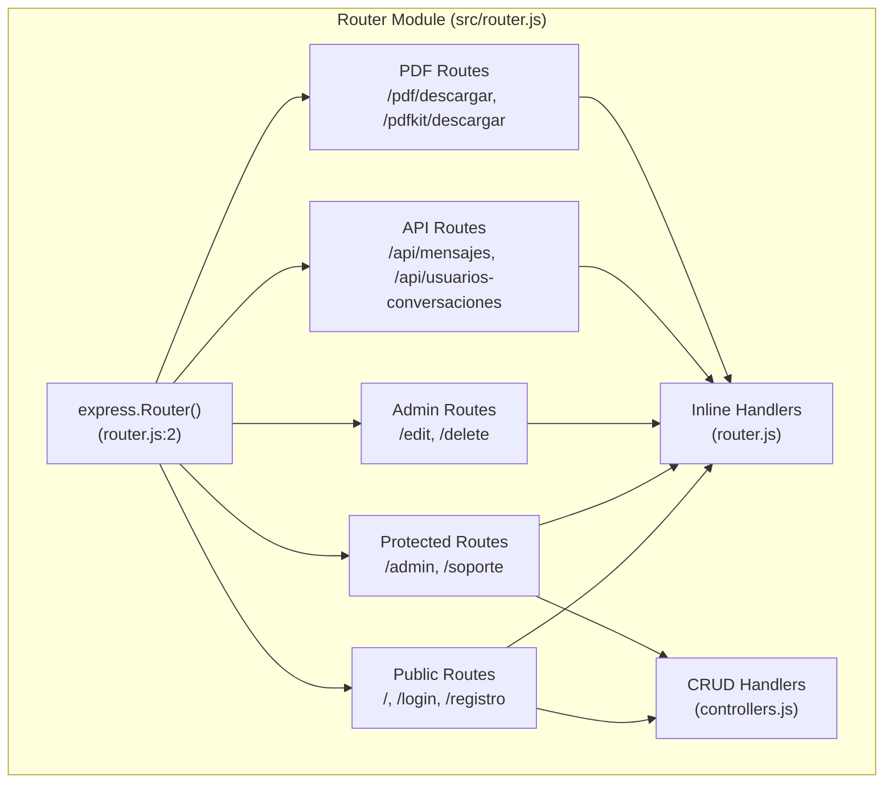
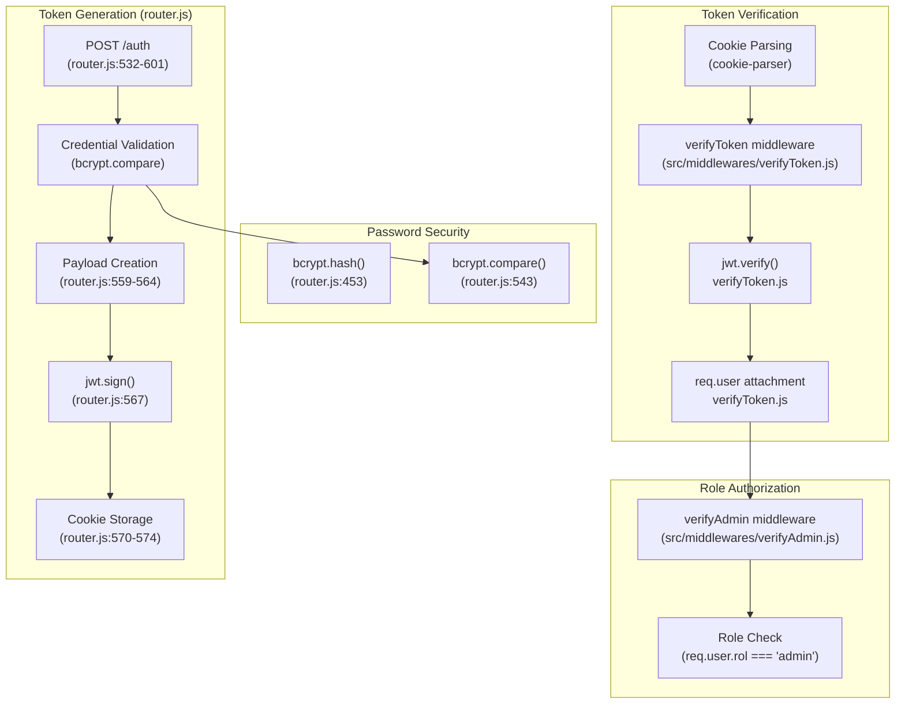
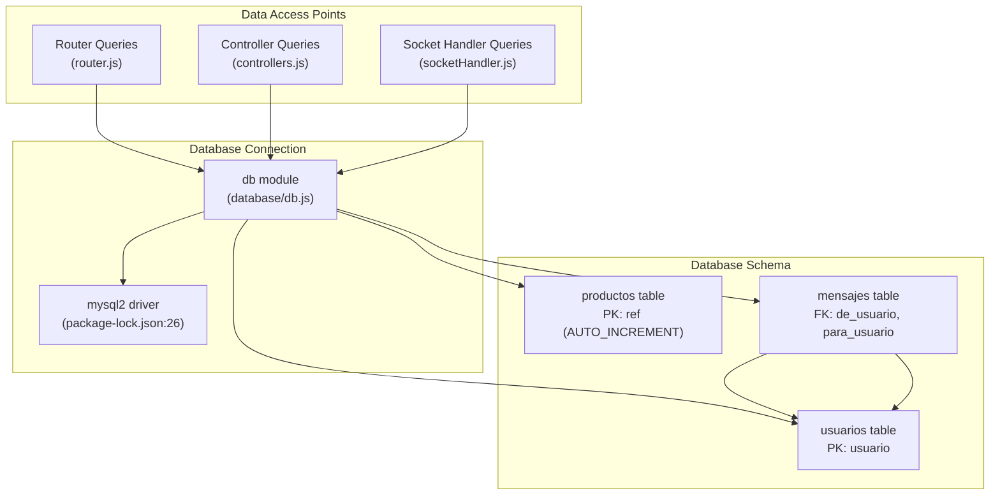
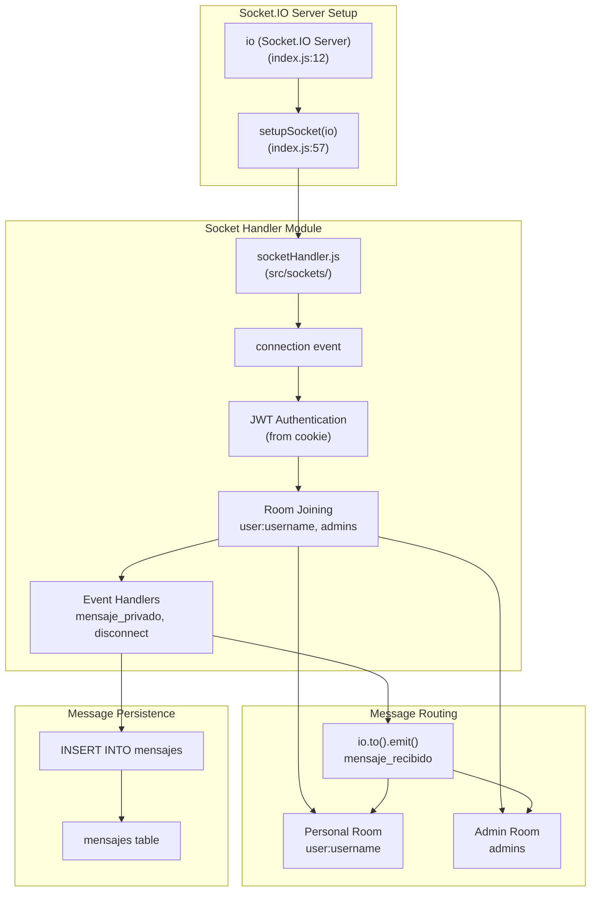
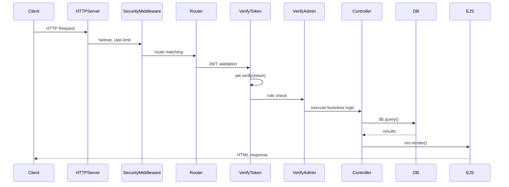
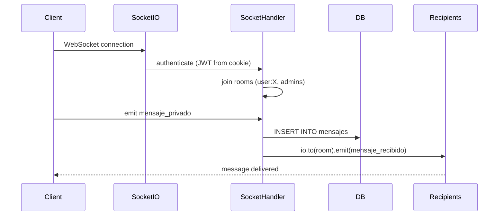

# System Components

> **Relevant source files**
> * [index.js](https://github.com/moichuelo/registro/blob/544abbcc/index.js)
> * [package-lock.json](https://github.com/moichuelo/registro/blob/544abbcc/package-lock.json)
> * [src/router.js](https://github.com/moichuelo/registro/blob/544abbcc/src/router.js)

This document details the major subsystems that compose the registro-sesiones application. It describes the core architectural components, their responsibilities, and how they interact to provide authentication, product management, and real-time communication functionality.

For information about how these components are initialized and configured at startup, see [Application Bootstrap](Application-Bootstrap.md). For details on the request processing flow through these components, see [Request Processing Pipeline](Request-Processing-Pipeline.md).

---

## Component Overview

The sistema consists of ten major subsystems organized into distinct functional layers. The following diagram maps these high-level components to their primary code artifacts:

```mermaid
flowchart TD

HTTPServer["HTTP Server<br>(index.js:10-12)"]
ExpressApp["Express Application<br>(index.js:2-3)"]
SocketIOServer["Socket.IO Server<br>(index.js:9-12)"]
Router["Router Module<br>(src/router.js)"]
Controllers["Controllers<br>(src/controllers.js)"]
JWTModule["JWT Module<br>(jsonwebtoken)"]
VerifyToken["verifyToken Middleware<br>(src/middlewares/verifyToken.js)"]
VerifyAdmin["verifyAdmin Middleware<br>(src/middlewares/verifyAdmin.js)"]
BCrypt["BCrypt Module<br>(bcryptjs)"]
SecurityMiddleware["Security Middleware<br>(src/middlewares/security.js)"]
AuthLimiter["Rate Limiter<br>(src/middlewares/authLimiter.js)"]
Validator["Express Validator<br>(express-validator)"]
DBConnection["Database Connection<br>(database/db.js)"]
UsuariosTable["usuarios table"]
ProductosTable["productos table"]
MensajesTable["mensajes table"]
SocketHandler["Socket Handler<br>(src/sockets/socketHandler.js)"]
SetupSocket["setupSocket function<br>(index.js:14, 57)"]
EJSEngine["EJS Engine<br>(index.js:52)"]
ViewTemplates["View Templates<br>(views/*.ejs)"]
I18nModule["i18n Module<br>(i18n)"]
LocaleFiles["Locale Files<br>(locales/en.json, locales/es.json)"]
Puppeteer["Puppeteer<br>(puppeteer)"]
PDFKit["PDFKit<br>(pdfkit)"]
Multer["Multer<br>(src/middlewares/multerConfig.js)"]
StaticServer["Static File Server<br>(index.js:43)"]

ExpressApp --> SecurityMiddleware
ExpressApp --> Router
Router --> VerifyToken
Router --> VerifyAdmin
Router --> EJSEngine
SocketIOServer --> SetupSocket
Controllers --> DBConnection
SocketHandler --> DBConnection
Router --> Puppeteer
Router --> PDFKit
Router --> Multer
ExpressApp --> I18nModule
Router --> Validator
Router --> BCrypt

subgraph subGraph9 ["File Handling"]
    Multer
    StaticServer
end

subgraph subGraph8 ["Document Generation"]
    Puppeteer
    PDFKit
end

subgraph Internationalization ["Internationalization"]
    I18nModule
    LocaleFiles
    I18nModule --> LocaleFiles
end

subgraph subGraph6 ["View Layer"]
    EJSEngine
    ViewTemplates
    EJSEngine --> ViewTemplates
end

subgraph subGraph5 ["Real-time Layer"]
    SocketHandler
    SetupSocket
    SetupSocket --> SocketHandler
end

subgraph subGraph4 ["Data Layer"]
    DBConnection
    UsuariosTable
    ProductosTable
    MensajesTable
    DBConnection --> UsuariosTable
    DBConnection --> ProductosTable
    DBConnection --> MensajesTable
end

subgraph subGraph3 ["Security Layer"]
    SecurityMiddleware
    AuthLimiter
    Validator
    SecurityMiddleware --> AuthLimiter
end

subgraph subGraph2 ["Authentication Layer"]
    JWTModule
    VerifyToken
    VerifyAdmin
    BCrypt
    VerifyToken --> JWTModule
    VerifyAdmin --> VerifyToken
end

subgraph subGraph1 ["Request Routing Layer"]
    Router
    Controllers
    Router --> Controllers
end

subgraph subGraph0 ["Application Server Layer"]
    HTTPServer
    ExpressApp
    SocketIOServer
    HTTPServer --> ExpressApp
    HTTPServer --> SocketIOServer
end
```



**Sources:** [index.js L1-L86](https://github.com/moichuelo/registro/blob/544abbcc/index.js#L1-L86)

 [src/router.js L1-L608](https://github.com/moichuelo/registro/blob/544abbcc/src/router.js#L1-L608)

 [package-lock.json L1-L50](https://github.com/moichuelo/registro/blob/544abbcc/package-lock.json#L1-L50)

---

## Application Server Layer

The application server layer consists of three primary components that handle all incoming network connections.

### HTTP Server

The HTTP server is created using Node.js's built-in `http` module and serves as the foundation for both traditional HTTP requests and WebSocket connections. It is instantiated in [index.js L8-L10](https://github.com/moichuelo/registro/blob/544abbcc/index.js#L8-L10)

:

```javascript
const http = require("http");
const server = http.createServer(app);
```

This server listens on port 3000 as defined in [index.js L62-L65](https://github.com/moichuelo/registro/blob/544abbcc/index.js#L62-L65)

### Express Application

The Express application (`app`) manages HTTP request/response cycles, middleware execution, and route handling. It is initialized in [index.js L2-L3](https://github.com/moichuelo/registro/blob/544abbcc/index.js#L2-L3)

:

```javascript
const express = require("express");
const app = express();
```

The Express application is configured with multiple middleware layers defined in [index.js L37-L48](https://github.com/moichuelo/registro/blob/544abbcc/index.js#L37-L48)

 including body parsers, static file serving, security headers, session management, and internationalization.

### Socket.IO Server

The Socket.IO server enables bidirectional real-time communication via WebSockets. It is attached to the HTTP server in [index.js L9-L12](https://github.com/moichuelo/registro/blob/544abbcc/index.js#L9-L12)

:

```javascript
const socketIO = require("socket.io");
const io = socketIO(server);
```

The Socket.IO server is configured with custom connection handling logic through the `setupSocket` function, invoked in [index.js L57](https://github.com/moichuelo/registro/blob/544abbcc/index.js#L57-L57)

**Sources:** [index.js L1-L65](https://github.com/moichuelo/registro/blob/544abbcc/index.js#L1-L65)

---

## Routing System

The routing system directs incoming HTTP requests to appropriate handlers and middleware chains.



The router module exports an Express Router instance that is mounted in the Express application at [index.js L48](https://github.com/moichuelo/registro/blob/544abbcc/index.js#L48-L48)

 It defines the following route categories:

| Route Category | Authentication Required | Examples | Lines |
| --- | --- | --- | --- |
| Public Routes | No | `/`, `/login`, `/registro`, `/set-lang/:lang` | [router.js L59-L80](https://github.com/moichuelo/registro/blob/544abbcc/router.js#L59-L80) <br>  [router.js L398-L407](https://github.com/moichuelo/registro/blob/544abbcc/router.js#L398-L407) |
| Protected User Routes | `verifyToken` | `/admin`, `/soporte`, `/pdfAdmin` | [router.js L119-L134](https://github.com/moichuelo/registro/blob/544abbcc/router.js#L119-L134) <br>  [router.js L220-L227](https://github.com/moichuelo/registro/blob/544abbcc/router.js#L220-L227) |
| Protected API Routes | `verifyToken` or `verifyAdmin` | `/api/mensajes`, `/api/mensajes/mios`, `/api/usuarios-conversaciones` | [router.js L229-L315](https://github.com/moichuelo/registro/blob/544abbcc/router.js#L229-L315) |
| CRUD Routes | Varies | `/create`, `/edit/:id`, `/delete/:id` | [router.js L153-L208](https://github.com/moichuelo/registro/blob/544abbcc/router.js#L153-L208) |
| PDF Generation Routes | `verifyToken` | `/pdf/descargar`, `/pdfkit/descargar` | [router.js L317-L396](https://github.com/moichuelo/registro/blob/544abbcc/router.js#L317-L396) |
| Authentication Routes | No (with rate limiting) | `/auth`, `/register` | [router.js L532-L601](https://github.com/moichuelo/registro/blob/544abbcc/router.js#L532-L601) <br>  [router.js L414-L484](https://github.com/moichuelo/registro/blob/544abbcc/router.js#L414-L484) |

**Sources:** [src/router.js L1-L608](https://github.com/moichuelo/registro/blob/544abbcc/src/router.js#L1-L608)

---

## Authentication Layer

The authentication layer provides user identity verification and role-based access control using JWT tokens.



### JWT Token Management

JSON Web Tokens are used for stateless authentication. The JWT secret is loaded from environment variables via [index.js L4](https://github.com/moichuelo/registro/blob/544abbcc/index.js#L4-L4)

 Tokens are:

* **Generated** during login at [router.js L567](https://github.com/moichuelo/registro/blob/544abbcc/router.js#L567-L567)  with a 1-hour expiration
* **Signed** with `HS256` algorithm using `process.env.JWT_SECRET`
* **Stored** in HTTP-only cookies named `token` at [router.js L570-L574](https://github.com/moichuelo/registro/blob/544abbcc/router.js#L570-L574)
* **Verified** by the `verifyToken` middleware imported at [router.js L16](https://github.com/moichuelo/registro/blob/544abbcc/router.js#L16-L16)

The token payload structure is defined at [router.js L559-L564](https://github.com/moichuelo/registro/blob/544abbcc/router.js#L559-L564)

 and includes:

* `user`: username
* `name`: display name
* `rol`: user role (admin/user)
* `imagen`: profile image filename

### Middleware Chain

Two middleware functions enforce authentication and authorization:

1. **`verifyToken`** ([router.js L16](https://github.com/moichuelo/registro/blob/544abbcc/router.js#L16-L16) ): Validates JWT from cookies and attaches decoded user data to `req.user`
2. **`verifyAdmin`** ([router.js L17](https://github.com/moichuelo/registro/blob/544abbcc/router.js#L17-L17) ): Extends `verifyToken` by additionally checking that `req.user.rol === 'admin'`

These are applied to routes requiring authentication. For example:

* `/admin` uses `verifyToken` at [router.js L119](https://github.com/moichuelo/registro/blob/544abbcc/router.js#L119-L119)
* `/api/mensajes` uses `verifyAdmin` at [router.js L229](https://github.com/moichuelo/registro/blob/544abbcc/router.js#L229-L229)

### Password Hashing

User passwords are hashed using bcrypt with a cost factor of 8:

* **Hashing** occurs during registration at [router.js L453](https://github.com/moichuelo/registro/blob/544abbcc/router.js#L453-L453)
* **Verification** occurs during login at [router.js L543](https://github.com/moichuelo/registro/blob/544abbcc/router.js#L543-L543)

**Sources:** [src/router.js L1-L608](https://github.com/moichuelo/registro/blob/544abbcc/src/router.js#L1-L608)

 [index.js L4-L7](https://github.com/moichuelo/registro/blob/544abbcc/index.js#L4-L7)

---

## Security Layer

The security layer implements multiple defense mechanisms against common web vulnerabilities.

### Security Middleware Module

A centralized security configuration is applied via [index.js L15](https://github.com/moichuelo/registro/blob/544abbcc/index.js#L15-L15)

 and [index.js L45](https://github.com/moichuelo/registro/blob/544abbcc/index.js#L45-L45)

:

```javascript
const securityMiddleware = require("./src/middlewares/security");
app.use(securityMiddleware);
```

This module (referenced from `package-lock.json` dependencies) configures:

* **Helmet** ([package-lock.json L1740-L1748](https://github.com/moichuelo/registro/blob/544abbcc/package-lock.json#L1740-L1748) ): Sets secure HTTP headers
* **Express Rate Limit** ([package-lock.json L1371-L1382](https://github.com/moichuelo/registro/blob/544abbcc/package-lock.json#L1371-L1382) ): Prevents brute-force attacks

### Rate Limiting

Authentication endpoints are protected by a rate limiter imported at [router.js L21](https://github.com/moichuelo/registro/blob/544abbcc/router.js#L21-L21)

:

```javascript
const limiter = require("./middlewares/authLimiter");
router.post("/auth", limiter, async (req, res) => { ... });
```

This is applied to the login route at [router.js L532](https://github.com/moichuelo/registro/blob/544abbcc/router.js#L532-L532)

### Input Validation

User input is validated using `express-validator` ([router.js L3](https://github.com/moichuelo/registro/blob/544abbcc/router.js#L3-L3)

). Validation rules are defined inline with route handlers. For example, the registration route at [router.js L415-L428](https://github.com/moichuelo/registro/blob/544abbcc/router.js#L415-L428)

 validates:

* `user`: minimum 4 characters
* `name`: minimum 4 characters
* `pass`: minimum 4 characters
* `email`: valid email format
* `edad`: numeric value

Validation errors are collected and rendered back to the user at [router.js L430-L441](https://github.com/moichuelo/registro/blob/544abbcc/router.js#L430-L441)

**Sources:** [src/router.js L1-L484](https://github.com/moichuelo/registro/blob/544abbcc/src/router.js#L1-L484)

 [index.js L15-L46](https://github.com/moichuelo/registro/blob/544abbcc/index.js#L15-L46)

 [package-lock.json L1371-L1748](https://github.com/moichuelo/registro/blob/544abbcc/package-lock.json#L1371-L1748)

---

## Data Layer

The data layer manages persistent storage using MySQL.



### Database Connection Module

The database connection is established through a module at `database/db.js` ([router.js L5](https://github.com/moichuelo/registro/blob/544abbcc/router.js#L5-L5)

 [index.js L13](https://github.com/moichuelo/registro/blob/544abbcc/index.js#L13-L13)

):

```javascript
const db = require("./database/db");
```

This module uses the `mysql2` package ([package-lock.json L26](https://github.com/moichuelo/registro/blob/544abbcc/package-lock.json#L26-L26)

) to create a connection pool.

### Data Schema

Three primary tables store application data:

| Table | Primary Key | Key Columns | Purpose |
| --- | --- | --- | --- |
| `usuarios` | `usuario` | `nombre`, `rol`, `pass`, `imagen` | User authentication and profiles |
| `productos` | `ref` (AUTO_INCREMENT) | `nombre`, `precio`, `stock` | Product inventory |
| `mensajes` | Composite | `de_usuario` (FK), `para_usuario` (FK), `mensaje`, `fecha` | Chat message history |

### Query Patterns

Database queries are executed throughout the application:

* **Router queries**: Direct queries in route handlers ([router.js L121](https://github.com/moichuelo/registro/blob/544abbcc/router.js#L121-L121)  [router.js L188](https://github.com/moichuelo/registro/blob/544abbcc/router.js#L188-L188)  [router.js L200](https://github.com/moichuelo/registro/blob/544abbcc/router.js#L200-L200)  [router.js L244](https://github.com/moichuelo/registro/blob/544abbcc/router.js#L244-L244)  [router.js L271](https://github.com/moichuelo/registro/blob/544abbcc/router.js#L271-L271)  [router.js L306](https://github.com/moichuelo/registro/blob/544abbcc/router.js#L306-L306)  [router.js L318](https://github.com/moichuelo/registro/blob/544abbcc/router.js#L318-L318)  [router.js L356](https://github.com/moichuelo/registro/blob/544abbcc/router.js#L356-L356)  [router.js L537](https://github.com/moichuelo/registro/blob/544abbcc/router.js#L537-L537) )
* **Controller queries**: Encapsulated in controller functions ([router.js L13](https://github.com/moichuelo/registro/blob/544abbcc/router.js#L13-L13)  [router.js L603-L604](https://github.com/moichuelo/registro/blob/544abbcc/router.js#L603-L604) )
* **Socket handler queries**: Real-time message persistence in socket event handlers

All queries use parameterized statements to prevent SQL injection, e.g., `db.query("SELECT * FROM productos WHERE ref = ?", [ref], ...)` at [router.js L188](https://github.com/moichuelo/registro/blob/544abbcc/router.js#L188-L188)

**Sources:** [src/router.js L5-L608](https://github.com/moichuelo/registro/blob/544abbcc/src/router.js#L5-L608)

 [index.js L13](https://github.com/moichuelo/registro/blob/544abbcc/index.js#L13-L13)

 [package-lock.json L26](https://github.com/moichuelo/registro/blob/544abbcc/package-lock.json#L26-L26)

---

## Real-time Communication System

The real-time communication system enables bidirectional messaging between clients and server using Socket.IO.



### Socket.IO Server Initialization

The Socket.IO server is created and attached to the HTTP server at [index.js L9-L12](https://github.com/moichuelo/registro/blob/544abbcc/index.js#L9-L12)

:

```javascript
const socketIO = require("socket.io");
const io = socketIO(server);
```

### Socket Handler Setup

The socket connection logic is configured through a setup function imported at [index.js L14](https://github.com/moichuelo/registro/blob/544abbcc/index.js#L14-L14)

:

```javascript
const setupSocket = require("./src/sockets/socketHandler");
```

This function is invoked at [index.js L57](https://github.com/moichuelo/registro/blob/544abbcc/index.js#L57-L57)

 and configures:

* Connection authentication using JWT from cookies
* Room-based routing (personal rooms and admin room)
* Event listeners for `mensaje_privado` and `disconnect` events

### Room Architecture

The system uses a room-based routing strategy:

* **Personal rooms**: Each user joins a room named `user:{username}` for direct messaging
* **Admin room**: All users with `rol === 'admin'` join a collective `admins` room
* **Routing logic**: Messages from non-admin users are delivered to both recipient's personal room and the admin room, enabling supervision

### Message Persistence

All messages are persisted to the `mensajes` table with columns:

* `de_usuario`: sender username (FK to usuarios)
* `para_usuario`: recipient username (FK to usuarios)
* `mensaje`: message content (TEXT)
* `fecha`: timestamp (DATETIME)

**Sources:** [index.js L9-L57](https://github.com/moichuelo/registro/blob/544abbcc/index.js#L9-L57)

 Diagram 3 from high-level architecture

---

## View Layer

The view layer renders HTML responses using the EJS templating engine.

### EJS Engine Configuration

The EJS view engine is configured at [index.js L52](https://github.com/moichuelo/registro/blob/544abbcc/index.js#L52-L52)

:

```
app.set("view engine", "ejs");
```

Views are stored in the `views/` directory by default.

### Template Structure

The view layer uses a master-detail pattern:

* **Layout template**: `views/layout.ejs` serves as the master template
* **Partials**: Reusable components in `views/partials/` (head, header, footer, popover)
* **Page templates**: Individual views like `index.ejs`, `login.ejs`, `register.ejs`, `admin.ejs`, `soporte.ejs`

### Rendering in Routes

Templates are rendered in route handlers using `res.render()`. For example:

* Homepage at [router.js L64](https://github.com/moichuelo/registro/blob/544abbcc/router.js#L64-L64) : `res.render("index", { user, login })`
* Admin page at [router.js L126](https://github.com/moichuelo/registro/blob/544abbcc/router.js#L126-L126) : `res.render("admin", { productos, user, login, rol })`
* Login page at [router.js L76](https://github.com/moichuelo/registro/blob/544abbcc/router.js#L76-L76) : `res.render("login")`
* Support chat at [router.js L221](https://github.com/moichuelo/registro/blob/544abbcc/router.js#L221-L221) : `res.render("soporte", { user })`

### PDF Template

A special template `pdfTabla.ejs` is used for PDF generation and is rendered server-side at [router.js L324](https://github.com/moichuelo/registro/blob/544abbcc/router.js#L324-L324)

 to HTML before conversion to PDF.

**Sources:** [index.js L52](https://github.com/moichuelo/registro/blob/544abbcc/index.js#L52-L52)

 [src/router.js L59-L227](https://github.com/moichuelo/registro/blob/544abbcc/src/router.js#L59-L227)

 Diagram 6 from high-level architecture

---

## Internationalization System

The i18n system provides multi-language support for English and Spanish.

### i18n Module Configuration

The `i18n` module is configured at [index.js L16-L31](https://github.com/moichuelo/registro/blob/544abbcc/index.js#L16-L31)

:

```javascript
const i18n = require('i18n');
i18n.configure({
    locales: ['en', 'es'],
    directory: path.join(__dirname, 'locales'),
    defaultLocale: 'es',
    cookie: 'lang',
    queryParameter: 'lang',
    autoReload: true,
    syncFiles: true
});
```

The middleware is applied at [index.js L46](https://github.com/moichuelo/registro/blob/544abbcc/index.js#L46-L46)

:

```
app.use(i18n.init);
```

### Language Switching

Users can change language via the `/set-lang/:lang` route defined at [router.js L398-L407](https://github.com/moichuelo/registro/blob/544abbcc/router.js#L398-L407)

:

```javascript
router.get('/set-lang/:lang', (req, res) => {
    const lang = req.params.lang;
    const returnTo = req.query.returnTo || '/';
    if (['es', 'en'].includes(lang)) {
        res.cookie('lang', lang, { maxAge: 900000, httpOnly: true });
    }
    res.redirect(returnTo);
});
```

The selected language is stored in a `lang` cookie and read by the i18n middleware on subsequent requests.

### Locale Files

Translation strings are stored in JSON files:

* `locales/en.json`: English translations
* `locales/es.json`: Spanish translations (default)

**Sources:** [index.js L16-L46](https://github.com/moichuelo/registro/blob/544abbcc/index.js#L16-L46)

 [src/router.js L398-L407](https://github.com/moichuelo/registro/blob/544abbcc/src/router.js#L398-L407)

---

## Document Generation System

The system supports PDF generation through two different approaches.

### Puppeteer-based PDF Generation

The Puppeteer approach renders an EJS template to HTML, then uses a headless Chrome browser to generate a PDF. This is implemented at [router.js L317-L353](https://github.com/moichuelo/registro/blob/544abbcc/router.js#L317-L353)

:

```javascript
router.get("/pdf/descargar", verifyToken, async (req, res) => {
    // 1. Query database for products
    // 2. Render EJS template to HTML (router.js:324-326)
    // 3. Launch headless browser (router.js:328-331)
    // 4. Load HTML into page (router.js:334)
    // 5. Generate PDF buffer (router.js:336-340)
    // 6. Send PDF to client (router.js:344-346)
});
```

The Puppeteer library is imported at [router.js L6](https://github.com/moichuelo/registro/blob/544abbcc/router.js#L6-L6)

### PDFKit-based PDF Generation

The PDFKit approach programmatically constructs a PDF document without HTML. This is implemented at [router.js L355-L396](https://github.com/moichuelo/registro/blob/544abbcc/router.js#L355-L396)

:

```javascript
router.get("/pdfkit/descargar", verifyToken, (req, res) => {
    // 1. Query database for products
    // 2. Create PDFDocument instance (router.js:361)
    // 3. Pipe to response stream (router.js:367)
    // 4. Add title and headers (router.js:370-379)
    // 5. Iterate and add product rows (router.js:386-392)
    // 6. Finalize document (router.js:394)
});
```

The PDFKit library is imported at [router.js L9](https://github.com/moichuelo/registro/blob/544abbcc/router.js#L9-L9)

Both routes require authentication via `verifyToken` middleware.

**Sources:** [src/router.js L6-L396](https://github.com/moichuelo/registro/blob/544abbcc/src/router.js#L6-L396)

---

## Static Asset Server

Static files are served from the `public/` directory by the Express application.

### Static Middleware Configuration

Static file serving is configured at [index.js L43](https://github.com/moichuelo/registro/blob/544abbcc/index.js#L43-L43)

:

```
app.use("/resources", express.static(__dirname + "/public"));
```

This mounts the `public/` directory at the `/resources` URL path, making files accessible at URLs like:

* `/resources/css/style.css`
* `/resources/img/logo.png`
* `/resources/uploads/profile-image.jpg`

### File Upload Handling

User-uploaded files (profile images) are handled by the Multer middleware configured in `src/middlewares/multerConfig.js`. It is imported at [router.js L19](https://github.com/moichuelo/registro/blob/544abbcc/router.js#L19-L19)

 and applied to the registration route at [router.js L414](https://github.com/moichuelo/registro/blob/544abbcc/router.js#L414-L414)

:

```javascript
const upload = require("./middlewares/multerConfig");
router.post("/register", upload.single("profileImage"), ...);
```

Uploaded files are stored in `public/uploads/` (or `public/resources/uploads/`) and their filenames are saved to the `usuarios.imagen` column at [router.js L450-L463](https://github.com/moichuelo/registro/blob/544abbcc/router.js#L450-L463)

**Sources:** [index.js L43](https://github.com/moichuelo/registro/blob/544abbcc/index.js#L43-L43)

 [src/router.js L19-L484](https://github.com/moichuelo/registro/blob/544abbcc/src/router.js#L19-L484)

---

## Middleware Stack

The complete middleware execution order is configured in [index.js L37-L48](https://github.com/moichuelo/registro/blob/544abbcc/index.js#L37-L48)

:

| Order | Middleware | Purpose | Line |
| --- | --- | --- | --- |
| 1 | `cookieParser` | Parse cookies from request headers | [index.js L37](https://github.com/moichuelo/registro/blob/544abbcc/index.js#L37-L37) |
| 2 | `express.urlencoded` | Parse URL-encoded form data | [index.js L41](https://github.com/moichuelo/registro/blob/544abbcc/index.js#L41-L41) |
| 3 | `express.json` | Parse JSON request bodies | [index.js L42](https://github.com/moichuelo/registro/blob/544abbcc/index.js#L42-L42) |
| 4 | Static file server | Serve files from `public/` | [index.js L43](https://github.com/moichuelo/registro/blob/544abbcc/index.js#L43-L43) |
| 5 | Swagger UI | API documentation interface | [index.js L44](https://github.com/moichuelo/registro/blob/544abbcc/index.js#L44-L44) |
| 6 | `securityMiddleware` | Helmet + rate limiting | [index.js L45](https://github.com/moichuelo/registro/blob/544abbcc/index.js#L45-L45) |
| 7 | `i18n.init` | Language detection and translation | [index.js L46](https://github.com/moichuelo/registro/blob/544abbcc/index.js#L46-L46) |
| 8 | `setGlobals` | Set global template variables | [index.js L47](https://github.com/moichuelo/registro/blob/544abbcc/index.js#L47-L47) |
| 9 | Router | Route request to handlers | [index.js L48](https://github.com/moichuelo/registro/blob/544abbcc/index.js#L48-L48) |

Within routes, additional middleware may be applied conditionally:

* `verifyToken`: Applied to protected routes
* `verifyAdmin`: Applied to admin-only routes
* `limiter`: Applied to authentication routes
* `upload`: Applied to file upload routes

**Sources:** [index.js L37-L48](https://github.com/moichuelo/registro/blob/544abbcc/index.js#L37-L48)

 [src/router.js L16-L21](https://github.com/moichuelo/registro/blob/544abbcc/src/router.js#L16-L21)

---

## Component Interaction Summary

The following diagram illustrates how a typical authenticated request flows through the major system components:



For real-time communication, a parallel flow exists:



**Sources:** All component sections above