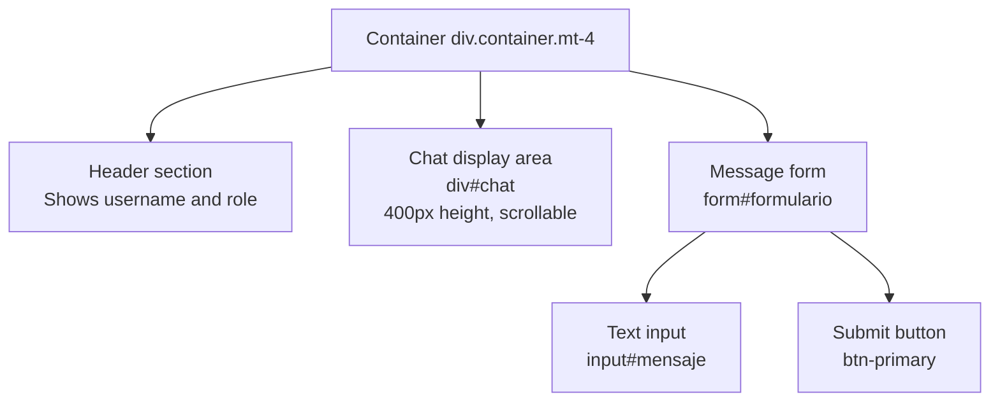
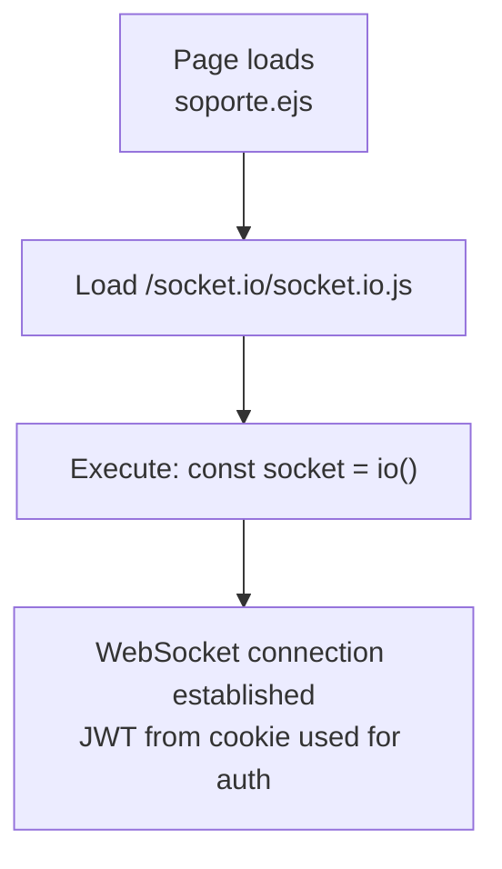
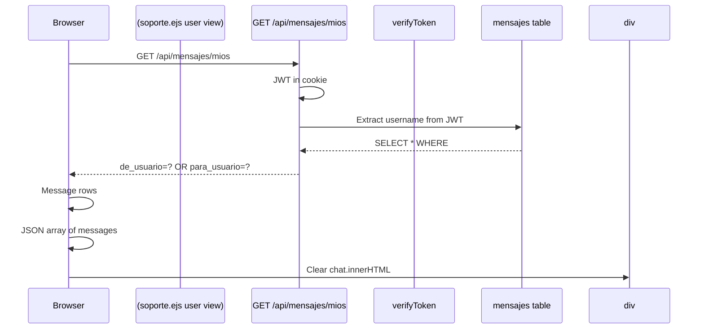
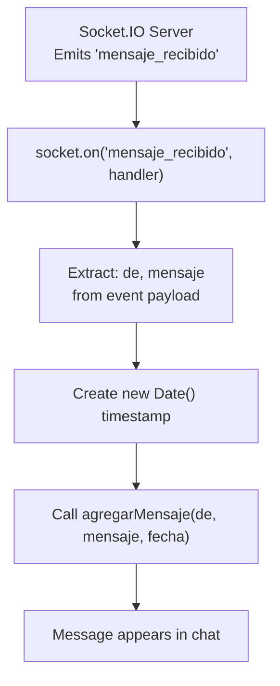
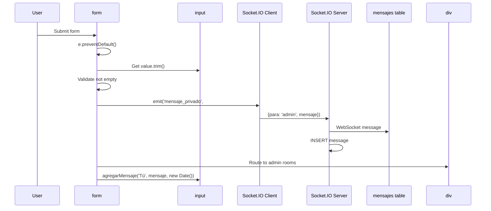
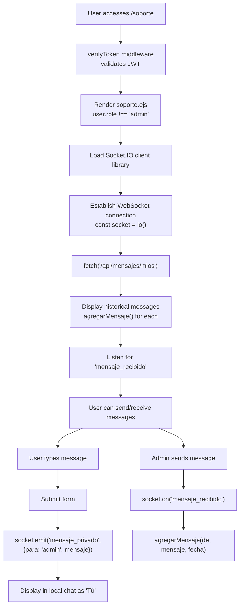

# User Chat Interface

> **Relevant source files**
> * [src/router.js](https://github.com/moichuelo/registro/blob/544abbcc/src/router.js)
> * [views/soporte.ejs](https://github.com/moichuelo/registro/blob/544abbcc/views/soporte.ejs)

## Purpose and Scope

This document describes the user-facing chat interface in the support chat system. This interface is displayed to users with the `user` role when they access the support page. It provides a simple, single-conversation chat experience where users communicate with administrators.

For information about the admin-facing multi-conversation interface, see [Admin Chat Interface](Admin-Chat-Interface.md). For the overall support chat system architecture including WebSocket handling, see [Support Chat System](Support-Chat-System.md).

**Sources:** [views/soporte.ejs L1-L191](https://github.com/moichuelo/registro/blob/544abbcc/views/soporte.ejs#L1-L191)

---

## Route and Access Control

The user chat interface is served by the `/soporte` route, which requires authentication via the `verifyToken` middleware. The route handler renders the `soporte.ejs` template with user information extracted from the JWT token.

| Aspect | Details |
| --- | --- |
| **Route Path** | `GET /soporte` |
| **Middleware** | `verifyToken` (authentication required) |
| **View Template** | `views/soporte.ejs` |
| **Data Passed** | User object with `username` and `role` properties |

The route implementation at [src/router.js L220-L227](https://github.com/moichuelo/registro/blob/544abbcc/src/router.js#L220-L227)

 extracts the username and role from the decoded JWT token (`req.user`) and passes them to the view for rendering.

**Sources:** [src/router.js L220-L227](https://github.com/moichuelo/registro/blob/544abbcc/src/router.js#L220-L227)

---

## HTML Structure

The user chat interface consists of two main elements rendered when `user.role !== 'admin'`:

### Chat Display Area

The chat area is a bordered, scrollable div that displays message history and incoming messages:

* **Element ID**: `chat`
* **Styling**: Border, rounded corners, padding, 400px fixed height with `overflow-y: auto`
* **Location**: [views/soporte.ejs L27](https://github.com/moichuelo/registro/blob/544abbcc/views/soporte.ejs#L27-L27)

### Message Input Form

The form allows users to compose and send messages:

* **Element ID**: `formulario`
* **Input Field ID**: `mensaje`
* **Layout**: Bootstrap grid (10 columns for input, 2 for button)
* **Location**: [views/soporte.ejs L28-L32](https://github.com/moichuelo/registro/blob/544abbcc/views/soporte.ejs#L28-L32)

**Sources:** [views/soporte.ejs L25-L33](https://github.com/moichuelo/registro/blob/544abbcc/views/soporte.ejs#L25-L33)

---

## Client-Side JavaScript Components

### Socket.IO Connection Initialization

The user interface establishes a WebSocket connection using Socket.IO immediately upon page load:

The Socket.IO client library is loaded from the server-provided endpoint at [views/soporte.ejs L37](https://github.com/moichuelo/registro/blob/544abbcc/views/soporte.ejs#L37-L37)

 and the connection is established at [views/soporte.ejs L39](https://github.com/moichuelo/registro/blob/544abbcc/views/soporte.ejs#L39-L39)

**Sources:** [views/soporte.ejs L37-L42](https://github.com/moichuelo/registro/blob/544abbcc/views/soporte.ejs#L37-L42)

---

### Message Display Function

The `agregarMensaje` function renders individual messages in the chat area:

**Function Signature**: `agregarMensaje(de, mensaje, fecha = null)`

| Parameter | Type | Description |
| --- | --- | --- |
| `de` | string | Username of message sender |
| `mensaje` | string | Message content |
| `fecha` | string/Date | Optional timestamp (ISO format) |

**Behavior**:

1. Creates a `
` element
2. Formats sender name in bold
3. Appends formatted timestamp if provided (via `formatearFecha`)
4. Appends message to `chat` div
5. Auto-scrolls chat to bottom

The timestamp formatting function `formatearFecha` converts ISO date strings to `DD/MM/YYYY HH:MM` format for readability.

**Sources:** [views/soporte.ejs L44-L60](https://github.com/moichuelo/registro/blob/544abbcc/views/soporte.ejs#L44-L60)

---

### Loading Message History

Upon page load, the user interface fetches historical messages from the `/api/mensajes/mios` endpoint:

**API Endpoint Details**:

* **Route**: `GET /api/mensajes/mios` [src/router.js L256-L280](https://github.com/moichuelo/registro/blob/544abbcc/src/router.js#L256-L280)
* **Authentication**: Requires `verifyToken` middleware
* **Response**: JSON array of message objects with `de_usuario`, `para_usuario`, `mensaje`, `fecha`
* **Query Logic**: Returns all messages where user is either sender or recipient, ordered by date ascending

**Client Implementation** at [views/soporte.ejs L166-L171](https://github.com/moichuelo/registro/blob/544abbcc/views/soporte.ejs#L166-L171)

:

1. Fetch from endpoint
2. Parse JSON response
3. Clear existing chat content
4. Iterate through messages and call `agregarMensaje` for each

**Sources:** [views/soporte.ejs L166-L171](https://github.com/moichuelo/registro/blob/544abbcc/views/soporte.ejs#L166-L171)

 [src/router.js L256-L280](https://github.com/moichuelo/registro/blob/544abbcc/src/router.js#L256-L280)

---

### Receiving Real-time Messages

The user interface listens for the `mensaje_recibido` WebSocket event to receive messages in real-time:

**Event Handler** at [views/soporte.ejs L174-L177](https://github.com/moichuelo/registro/blob/544abbcc/views/soporte.ejs#L174-L177)

:

* **Event Name**: `mensaje_recibido`
* **Payload Structure**: `{ de, mensaje }`
* **Action**: Calls `agregarMensaje` with sender username, message content, and current timestamp

**Sources:** [views/soporte.ejs L174-L177](https://github.com/moichuelo/registro/blob/544abbcc/views/soporte.ejs#L174-L177)

---

### Sending Messages

Users send messages by submitting the form, which emits a `mensaje_privado` event to the server:

**Form Submit Handler** at [views/soporte.ejs L180-L187](https://github.com/moichuelo/registro/blob/544abbcc/views/soporte.ejs#L180-L187)

:

| Step | Action | Code Location |
| --- | --- | --- |
| 1 | Prevent default form submission | `e.preventDefault()` |
| 2 | Extract and trim message | `inputMensaje.value.trim()` |
| 3 | Validate non-empty | Early return if empty |
| 4 | Emit Socket.IO event | `socket.emit("mensaje_privado", {para: "admin", mensaje})` |
| 5 | Display locally as "Tú" | `agregarMensaje("Tú", mensaje, new Date())` |
| 6 | Clear input field | `inputMensaje.value = ''` |

**Key Implementation Detail**: The recipient is hardcoded to `"admin"` at [views/soporte.ejs L184](https://github.com/moichuelo/registro/blob/544abbcc/views/soporte.ejs#L184-L184)

 This ensures all user messages are routed to the admin room, regardless of which specific admin responds. The server-side socket handler (documented in [Socket Handler](Message-Handling.md)) manages the actual message routing and persistence.

**Sources:** [views/soporte.ejs L180-L187](https://github.com/moichuelo/registro/blob/544abbcc/views/soporte.ejs#L180-L187)

---

## Complete User Interaction Flow

**Sources:** [views/soporte.ejs L164-L188](https://github.com/moichuelo/registro/blob/544abbcc/views/soporte.ejs#L164-L188)

 [src/router.js L220-L227](https://github.com/moichuelo/registro/blob/544abbcc/src/router.js#L220-L227)

 [src/router.js L256-L280](https://github.com/moichuelo/registro/blob/544abbcc/src/router.js#L256-L280)

---

## Code Entity Mapping

### Key Variables and Elements

| JavaScript Variable | HTML Element ID | Purpose |
| --- | --- | --- |
| `socket` | N/A | Socket.IO client instance |
| `chat` | `#chat` | Message display container |
| `inputMensaje` | `#mensaje` | Message text input field |
| `formulario` | `#formulario` | Message submission form |

**Sources:** [views/soporte.ejs L39-L42](https://github.com/moichuelo/registro/blob/544abbcc/views/soporte.ejs#L39-L42)

### Event Handlers

| Event Type | Element | Handler Function | Location |
| --- | --- | --- | --- |
| `submit` | `#formulario` | Anonymous function | [views/soporte.ejs L180-L187](https://github.com/moichuelo/registro/blob/544abbcc/views/soporte.ejs#L180-L187) |
| `mensaje_recibido` | `socket` (WebSocket) | Anonymous function | [views/soporte.ejs L174-L177](https://github.com/moichuelo/registro/blob/544abbcc/views/soporte.ejs#L174-L177) |

**Sources:** [views/soporte.ejs L174-L177](https://github.com/moichuelo/registro/blob/544abbcc/views/soporte.ejs#L174-L177)

 [views/soporte.ejs L180-L187](https://github.com/moichuelo/registro/blob/544abbcc/views/soporte.ejs#L180-L187)

### Helper Functions

| Function Name | Parameters | Return Type | Purpose |
| --- | --- | --- | --- |
| `formatearFecha` | `isoString` | `string` | Converts ISO timestamp to DD/MM/YYYY HH:MM |
| `agregarMensaje` | `de, mensaje, fecha=null` | `void` | Appends formatted message to chat |

**Sources:** [views/soporte.ejs L44-L60](https://github.com/moichuelo/registro/blob/544abbcc/views/soporte.ejs#L44-L60)

---

## Differences from Admin Interface

The user interface is significantly simpler than the admin interface:

| Feature | User Interface | Admin Interface |
| --- | --- | --- |
| **User List** | Not present | Shows all users with conversations |
| **Conversation Switching** | Not applicable (single conversation) | Can switch between user conversations |
| **Recipient Selection** | Hardcoded to "admin" | Selected from active conversation |
| **Notifications** | Not implemented | Visual indicators for new messages |
| **Message History Endpoint** | `/api/mensajes/mios` | `/api/mensajes?con=username` |
| **Conversation State** | Stateless | Maintains `conversaciones` object |

**Sources:** [views/soporte.ejs L25-L33](https://github.com/moichuelo/registro/blob/544abbcc/views/soporte.ejs#L25-L33)

 [views/soporte.ejs L8-L24](https://github.com/moichuelo/registro/blob/544abbcc/views/soporte.ejs#L8-L24)