# User Registration & Login

> **Relevant source files**
> * [package-lock.json](https://github.com/moichuelo/registro/blob/544abbcc/package-lock.json)
> * [public/css/style.css](https://github.com/moichuelo/registro/blob/544abbcc/public/css/style.css)
> * [src/router.js](https://github.com/moichuelo/registro/blob/544abbcc/src/router.js)
> * [views/admin.ejs](https://github.com/moichuelo/registro/blob/544abbcc/views/admin.ejs)
> * [views/index.ejs](https://github.com/moichuelo/registro/blob/544abbcc/views/index.ejs)
> * [views/register.ejs](https://github.com/moichuelo/registro/blob/544abbcc/views/register.ejs)

This page documents the user registration and login flows, including form validation, password hashing with bcrypt, profile image upload, JWT token generation, and session cookie management. These authentication mechanisms serve as the entry points to the system's protected resources.

For information about JWT token structure and management, see [JWT Token Management](JWT-Token-Management.md). For details on how authentication is enforced on protected routes, see [verifyToken Middleware](verifyToken-Middleware.md) and [verifyAdmin Middleware](verifyAdmin-Middleware.md). For broader security measures including rate limiting, see [Security Measures](Security-Measures.md).

---

## Overview

The system implements two primary authentication endpoints:

| Endpoint | Method | Purpose | Middleware |
| --- | --- | --- | --- |
| `/registro` | GET | Renders registration form | None |
| `/register` | POST | Processes registration | `upload.single("profileImage")`, validation middleware |
| `/login` | GET | Renders login form | None |
| `/auth` | POST | Processes login | `limiter` (rate limiting) |

Both flows interact with the `usuarios` table in MySQL and use bcryptjs for password security. Successful login generates a JWT token stored in an HTTP-only cookie.

**Sources:** [src/router.js L75-L80](https://github.com/moichuelo/registro/blob/544abbcc/src/router.js#L75-L80)

 [src/router.js L414-L484](https://github.com/moichuelo/registro/blob/544abbcc/src/router.js#L414-L484)

 [src/router.js L532-L601](https://github.com/moichuelo/registro/blob/544abbcc/src/router.js#L532-L601)

---

## Registration Flow

### Registration Form Structure

The registration form is rendered by the `views/register.ejs` template and accepts the following inputs:

| Field | Input Type | Validation | Required |
| --- | --- | --- | --- |
| `user` | text | min 4 characters | Yes |
| `name` | text | min 4 characters | Yes |
| `rol` | select | admin/user | Yes |
| `pass` | password | min 4 characters | Yes |
| `email` | text | valid email format | Yes |
| `edad` | text | numeric | Yes |
| `profileImage` | file | image format | No |

The form submits to `POST /register` with `enctype="multipart/form-data"` to support file uploads.

**Sources:** [views/register.ejs L7-L41](https://github.com/moichuelo/registro/blob/544abbcc/views/register.ejs#L7-L41)

### Registration Request Processing Diagram

```mermaid
sequenceDiagram
  participant Client Browser
  participant POST /register
  participant (src/router.js)
  participant upload.single()
  participant (multerConfig)
  participant express-validator
  participant body() chains
  participant bcrypt.hash()
  participant MySQL usuarios
  participant views/register.ejs

  Client Browser->>POST /register: "POST /register"
  POST /register->>upload.single(): "Process file upload"
  upload.single()->>upload.single(): "Save to public/uploads/"
  upload.single()-->>POST /register: "req.file populated"
  POST /register->>express-validator: "Validate fields"
  express-validator->>express-validator: "Check min lengths, email, numeric"
  loop ["Validation Errors"]
    express-validator-->>POST /register: "errors array"
    POST /register->>views/register.ejs: "Render with validaciones"
    views/register.ejs-->>Client Browser: "HTML with error alerts"
    express-validator-->>POST /register: "No errors"
    POST /register->>bcrypt.hash(): "hash(pass, 8)"
    bcrypt.hash()-->>POST /register: "passwordHash"
    POST /register->>MySQL usuarios: "INSERT INTO usuarios"
    MySQL usuarios-->>POST /register: "results"
    POST /register->>views/register.ejs: "Render with alert=true"
    views/register.ejs-->>Client Browser: "SweetAlert success + redirect"
  end
```

**Sources:** [src/router.js L414-L484](https://github.com/moichuelo/registro/blob/544abbcc/src/router.js#L414-L484)

### Input Validation Rules

The registration endpoint uses `express-validator` with the following validation chains defined at [src/router.js L415-L428](https://github.com/moichuelo/registro/blob/544abbcc/src/router.js#L415-L428)

:

```
body("user").exists().isLength({ min: 4 })
body("name").isLength({ min: 4 })
body("pass").isLength({ min: 4 })
body("email").isEmail()
body("edad").isNumeric()
```

When validation fails, the form is re-rendered with:

* `validaciones` array containing error messages
* `valores` object preserving user input
* Bootstrap alert components displaying errors

**Sources:** [src/router.js L415-L428](https://github.com/moichuelo/registro/blob/544abbcc/src/router.js#L415-L428)

 [src/router.js L430-L441](https://github.com/moichuelo/registro/blob/544abbcc/src/router.js#L430-L441)

 [views/register.ejs L44-L56](https://github.com/moichuelo/registro/blob/544abbcc/views/register.ejs#L44-L56)

### Password Hashing

Passwords are hashed using `bcryptjs` with a salt rounds value of 8:

```javascript
const passwordHash = await bcrypt.hash(pass, 8);
```

The hashed password is stored in the `usuarios.pass` column. Original plaintext passwords are never stored.

**Sources:** [src/router.js L453](https://github.com/moichuelo/registro/blob/544abbcc/src/router.js#L453-L453)

 [package-lock.json L523-L531](https://github.com/moichuelo/registro/blob/544abbcc/package-lock.json#L523-L531)

### Profile Image Upload

Profile images are handled by `multer` middleware configured in `src/middlewares/multerConfig.js`:

* Files are saved to `public/uploads/` directory
* Filename is available in `req.file.filename`
* If no file is uploaded, `profileImage` is set to `null`
* The filename (not the binary data) is stored in `usuarios.imagen` column

**Sources:** [src/router.js L19](https://github.com/moichuelo/registro/blob/544abbcc/src/router.js#L19-L19)

 [src/router.js L414](https://github.com/moichuelo/registro/blob/544abbcc/src/router.js#L414-L414)

 [src/router.js L450](https://github.com/moichuelo/registro/blob/544abbcc/src/router.js#L450-L450)

### Database Insertion

The registration data is inserted into the `usuarios` table:

```sql
db.query("INSERT INTO usuarios SET ?", {
    usuario: user,
    nombre: name,
    rol: rol,
    pass: passwordHash,
    imagen: profileImage
}, callback)
```

Upon successful insertion, a SweetAlert popup displays "El usuario se ha registrado correctamente" with a 2.5 second timer before redirecting to the homepage.

**Sources:** [src/router.js L456-L481](https://github.com/moichuelo/registro/blob/544abbcc/src/router.js#L456-L481)

---

## Login Flow

### Login Form Structure

The login form at `views/login.ejs` is minimal, requesting only:

| Field | Input Type | Required |
| --- | --- | --- |
| `user` | text | Yes |
| `pass` | password | Yes |

The form submits to `POST /auth`.

**Sources:** [src/router.js L75-L77](https://github.com/moichuelo/registro/blob/544abbcc/src/router.js#L75-L77)

### Login Authentication Sequence

```

```

**Sources:** [src/router.js L532-L601](https://github.com/moichuelo/registro/blob/544abbcc/src/router.js#L532-L601)

### Credential Verification Process

The authentication process at [src/router.js L532-L601](https://github.com/moichuelo/registro/blob/544abbcc/src/router.js#L532-L601)

 performs the following steps:

1. **Input validation**: Checks that both `user` and `pass` are provided
2. **Database query**: Retrieves user record by `usuario` field
3. **Existence check**: Verifies `results.length > 0`
4. **Password comparison**: Uses `bcrypt.compare()` to verify hashed password
5. **Token generation**: Creates JWT with user payload on success
6. **Cookie setting**: Stores token in HTTP-only cookie

**Sources:** [src/router.js L536-L556](https://github.com/moichuelo/registro/blob/544abbcc/src/router.js#L536-L556)

### JWT Payload Construction

Upon successful authentication, a JWT payload is constructed with the following user data:

```javascript
const payload = {
    user: results[0].usuario,
    name: results[0].nombre,
    rol: results[0].rol,
    imagen: results[0].imagen
};
```

This payload is signed using the `JWT_SECRET` environment variable and set to expire in 1 hour:

```javascript
const token = jwt.sign(payload, process.env.JWT_SECRET, { expiresIn: "1h" });
```

**Sources:** [src/router.js L559-L567](https://github.com/moichuelo/registro/blob/544abbcc/src/router.js#L559-L567)

### Session Cookie Configuration

The generated JWT is stored in a cookie named `token` with the following options:

| Option | Value | Purpose |
| --- | --- | --- |
| `httpOnly` | `true` | Prevents JavaScript access (XSS protection) |
| `secure` | `false` | Set to `true` in production with HTTPS |
| `maxAge` | `3600000` | 1 hour in milliseconds |

```yaml
res.cookie("token", token, {
    httpOnly: true,
    secure: false,
    maxAge: 3600000
});
```

The cookie is automatically sent with subsequent requests and validated by the `verifyToken` middleware.

**Sources:** [src/router.js L570-L574](https://github.com/moichuelo/registro/blob/544abbcc/src/router.js#L570-L574)

### Rate Limiting Protection

The `/auth` endpoint is protected by the `limiter` middleware (imported from `src/middlewares/authLimiter.js`) to prevent brute-force attacks. This middleware restricts the number of login attempts from a single IP address within a time window.

**Sources:** [src/router.js L21](https://github.com/moichuelo/registro/blob/544abbcc/src/router.js#L21-L21)

 [src/router.js L532](https://github.com/moichuelo/registro/blob/544abbcc/src/router.js#L532-L532)

---

## Database Schema Reference

### usuarios Table Structure

The registration and login flows interact with the `usuarios` table, which has the following relevant columns:

| Column | Type | Constraints | Purpose |
| --- | --- | --- | --- |
| `usuario` | varchar | PRIMARY KEY | Username for login |
| `nombre` | varchar | NOT NULL | Display name |
| `rol` | varchar | NOT NULL | "admin" or "user" |
| `pass` | varchar | NOT NULL | bcrypt hashed password |
| `imagen` | varchar | NULL | Profile image filename |

**Sources:** [src/router.js L456-L465](https://github.com/moichuelo/registro/blob/544abbcc/src/router.js#L456-L465)

 [src/router.js L537-L539](https://github.com/moichuelo/registro/blob/544abbcc/src/router.js#L537-L539)

---

## Error Handling and User Feedback

### Registration Error Display

Validation errors are displayed using Bootstrap alerts rendered by [views/register.ejs L44-L56](https://github.com/moichuelo/registro/blob/544abbcc/views/register.ejs#L44-L56)

 Each error from the `validaciones` array is shown as a dismissible danger alert with:

* SVG icon (`#exclamation-triangle-fill`)
* Strong-tagged error message
* Close button

Form field values are preserved through the `valores` object, preventing users from re-entering all data.

**Sources:** [views/register.ejs L44-L56](https://github.com/moichuelo/registro/blob/544abbcc/views/register.ejs#L44-L56)

 [src/router.js L436-L441](https://github.com/moichuelo/registro/blob/544abbcc/src/router.js#L436-L441)

### Login Error Display

Login errors use SweetAlert2 popups with the following characteristics:

| Scenario | alertTitle | alertMessage | alertIcon | Actions |
| --- | --- | --- | --- | --- |
| Missing credentials | "Error" | "Introduzca su usuario y contraseña" | error | showConfirmButton: true |
| Invalid credentials | "Error" | "El usuario o la contraseña son incorrectos" | error | showConfirmButton: true |
| Success | "Login" | "Has iniciado sesión correctamente" | success | Auto-redirect after 2.5s |

**Sources:** [src/router.js L545-L556](https://github.com/moichuelo/registro/blob/544abbcc/src/router.js#L545-L556)

 [src/router.js L577-L586](https://github.com/moichuelo/registro/blob/544abbcc/src/router.js#L577-L586)

 [src/router.js L590-L599](https://github.com/moichuelo/registro/blob/544abbcc/src/router.js#L590-L599)

### Success Flow

Both successful registration and login render the same template structure with conditional SweetAlert2 execution:

```javascript
if (typeof alert !== 'undefined') {
    Swal.fire({...}).then(() => {
        window.location = '/<%= ruta %>'
    })
}
```

* Registration redirects to `''` (homepage)
* Login redirects to `''` (homepage)

The authenticated user can then access protected routes via the JWT cookie.

**Sources:** [views/register.ejs L62-L74](https://github.com/moichuelo/registro/blob/544abbcc/views/register.ejs#L62-L74)

---

## Registration vs Login Flow Comparison

```mermaid
flowchart TD

LoginForm["Form Submission<br>{user, pass}"]
LoginLimiter["Rate Limiter<br>authLimiter"]
LoginQuery["SELECT * FROM usuarios<br>WHERE usuario = ?"]
LoginCheck["User exists<br>& password<br>matches?"]
LoginError["SweetAlert error<br>'Credenciales incorrectas'"]
LoginJWT["jwt.sign(payload,<br>JWT_SECRET, {expiresIn: '1h'})"]
LoginCookie["Set-Cookie: token=...<br>{httpOnly, maxAge: 3600000}"]
LoginSuccess["SweetAlert success<br>Redirect to /"]
RegForm["Form Submission<br>{user, name, rol, pass,<br>email, edad, profileImage}"]
RegMulter["Multer Middleware<br>upload.single('profileImage')"]
RegValidation["express-validator<br>body() chains"]
RegCheck["Validation<br>Errors?"]
RegRerender["Re-render form<br>with validaciones"]
RegBcrypt["bcrypt.hash(pass, 8)"]
RegInsert["INSERT INTO usuarios"]
RegSuccess["SweetAlert success<br>Redirect to /"]

subgraph Login ["Login Flow (POST /auth)"]
    LoginForm
    LoginLimiter
    LoginQuery
    LoginCheck
    LoginError
    LoginJWT
    LoginCookie
    LoginSuccess
    LoginForm --> LoginLimiter
    LoginLimiter --> LoginQuery
    LoginQuery --> LoginCheck
    LoginCheck --> LoginError
    LoginCheck --> LoginJWT
    LoginJWT --> LoginCookie
    LoginCookie --> LoginSuccess
end

subgraph Registration ["Registration Flow (POST /register)"]
    RegForm
    RegMulter
    RegValidation
    RegCheck
    RegRerender
    RegBcrypt
    RegInsert
    RegSuccess
    RegForm --> RegMulter
    RegMulter --> RegValidation
    RegValidation --> RegCheck
    RegCheck --> RegRerender
    RegCheck --> RegBcrypt
    RegBcrypt --> RegInsert
    RegInsert --> RegSuccess
end
```



**Sources:** [src/router.js L414-L484](https://github.com/moichuelo/registro/blob/544abbcc/src/router.js#L414-L484)

 [src/router.js L532-L601](https://github.com/moichuelo/registro/blob/544abbcc/src/router.js#L532-L601)

---

## Key Dependencies

The registration and login flows depend on the following npm packages:

| Package | Version | Purpose | Usage |
| --- | --- | --- | --- |
| `bcryptjs` | ^3.0.2 | Password hashing | `bcrypt.hash()`, `bcrypt.compare()` |
| `jsonwebtoken` | ^9.0.2 | JWT generation | `jwt.sign()` |
| `express-validator` | ^7.2.1 | Form validation | `body()`, `validationResult()` |
| `multer` | ^2.0.2 | File upload handling | `upload.single()` |
| `cookie-parser` | ^1.4.7 | Cookie parsing | Parses `req.cookies.token` |

**Sources:** [package-lock.json L12-L25](https://github.com/moichuelo/registro/blob/544abbcc/package-lock.json#L12-L25)

 [src/router.js L1-L19](https://github.com/moichuelo/registro/blob/544abbcc/src/router.js#L1-L19)

---

## Related Endpoints

After successful authentication, users access the system through these routes:

| Route | Auth Required | Description |
| --- | --- | --- |
| `/` | Optional | Homepage, displays user info if JWT present |
| `/admin` | verifyToken | Product management interface |
| `/soporte` | verifyToken | Support chat interface |
| `/logout` | None | Clears token cookie |

The `/` route demonstrates optional authentication by checking for `req.cookies.token` and decoding it to display user information.

**Sources:** [src/router.js L59-L74](https://github.com/moichuelo/registro/blob/544abbcc/src/router.js#L59-L74)

 [src/router.js L119-L134](https://github.com/moichuelo/registro/blob/544abbcc/src/router.js#L119-L134)

 [src/router.js L220-L227](https://github.com/moichuelo/registro/blob/544abbcc/src/router.js#L220-L227)

 [src/router.js L215-L218](https://github.com/moichuelo/registro/blob/544abbcc/src/router.js#L215-L218)