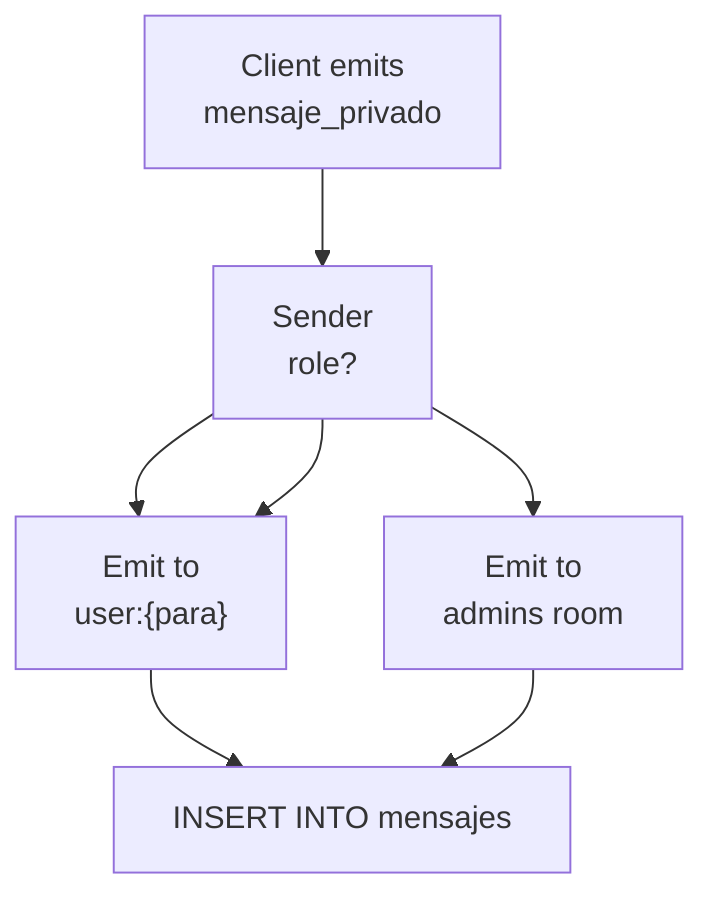
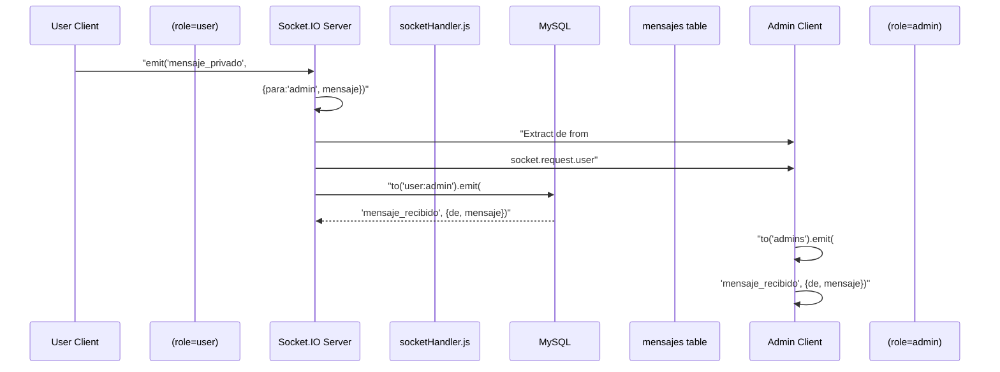

# WebSocket Events

> **Relevant source files**
> * [src/sockets/socketHandler.js](https://github.com/moichuelo/registro/blob/544abbcc/src/sockets/socketHandler.js)
> * [views/soporte.ejs](https://github.com/moichuelo/registro/blob/544abbcc/views/soporte.ejs)

## Purpose and Scope

This document provides a complete reference for all Socket.IO events used in the real-time communication system. It documents the event names, payload structures, expected behaviors, and the flow of messages between clients and the server.

For information about HTTP API endpoints used to retrieve message history, see [HTTP Endpoints](HTTP-Endpoints.md). For architectural details about the real-time communication system, including room management and authentication flow, see [Real-time Communication System](Real-time-Communication-System.md).

**Sources:** [src/sockets/socketHandler.js L1-L71](https://github.com/moichuelo/registro/blob/544abbcc/src/sockets/socketHandler.js#L1-L71)

---

## Authentication

All WebSocket connections must be authenticated before any events can be exchanged. Authentication occurs automatically when a client establishes a connection, using JWT tokens stored in HTTP-only cookies.

### Authentication Flow

```mermaid
sequenceDiagram
  participant Socket.IO Client
  participant io.use() Middleware
  participant jwt.verify()
  participant Connection Handler

  Socket.IO Client->>io.use() Middleware: "Connect with cookies"
  io.use() Middleware->>io.use() Middleware: "Extract token from cookie"
  loop [No cookies]
    io.use() Middleware-->>Socket.IO Client: "Error: No autenticado"
    io.use() Middleware-->>Socket.IO Client: "Error: Token no proporcionado"
    io.use() Middleware->>jwt.verify(): "verify(token, JWT_SECRET)"
    jwt.verify()-->>io.use() Middleware: "throw Error"
    io.use() Middleware-->>Socket.IO Client: "Error: Token inválido"
  end
  jwt.verify()-->>io.use() Middleware: "decoded user data"
  io.use() Middleware->>io.use() Middleware: "Attach user to socket.request.user"
  io.use() Middleware->>Connection Handler: "next()"
  Connection Handler->>Connection Handler: "socket.join() rooms"
  Connection Handler-->>Socket.IO Client: "Connection established"
```

The middleware extracts the JWT from the `token` cookie using a regex pattern: `/token=([^;]+)/`. The decoded token contains `user`, `name`, and `rol` fields, which are attached to `socket.request.user` for use in subsequent event handlers.

**Sources:** [src/sockets/socketHandler.js L6-L32](https://github.com/moichuelo/registro/blob/544abbcc/src/sockets/socketHandler.js#L6-L32)

---

## Connection Event

The `connection` event fires when a client successfully authenticates and establishes a WebSocket connection.

### Server-Side Handler

**Event Name:** `connection` (Socket.IO reserved event)

**Payload:** Socket object with authenticated user data in `socket.request.user`

**Behavior:**

1. Extracts user information from `socket.request.user`: `user` (username), `name`, `rol` (role)
2. Logs the connection with user and role information
3. Joins the socket to rooms based on user identity and role: * Personal room: `user:{username}` - Every user gets their own room * Admin room: `admins` - Only users with `rol === "admin"` join this room

**Room Assignment Logic:**

| User Role | Personal Room | Admin Room |
| --- | --- | --- |
| `user` | `user:{username}` | No |
| `admin` | `user:{username}` | `admins` |

**Code Reference:** [src/sockets/socketHandler.js L36-L43](https://github.com/moichuelo/registro/blob/544abbcc/src/sockets/socketHandler.js#L36-L43)

**Sources:** [src/sockets/socketHandler.js L36-L43](https://github.com/moichuelo/registro/blob/544abbcc/src/sockets/socketHandler.js#L36-L43)

---

## Client-to-Server Events

### mensaje_privado

The client emits this event to send a message to another user.

**Event Name:** `mensaje_privado`

**Direction:** Client → Server

**Payload Structure:**

```yaml
{
  para: string,    // Recipient username
  mensaje: string  // Message content
}
```

**Payload Fields:**

| Field | Type | Required | Description |
| --- | --- | --- | --- |
| `para` | string | Yes | Username of the intended recipient |
| `mensaje` | string | Yes | The message text to send |

**Server Behavior:**

1. Extracts sender username from authenticated user: `const de = user;`
2. Emits `mensaje_recibido` to recipient's personal room: `io.to('user:${para}').emit(...)`
3. If sender is NOT an admin (`rol !== "admin"`), also broadcasts to all admins: `io.to("admins").emit(...)`
4. Persists message to database using INSERT query to `mensajes` table with fields `(de_usuario, para_usuario, mensaje)`

**Message Routing Logic:**



**Client Implementation Examples:**

Admin sending a message:

```
// From views/soporte.ejs:156
socket.emit("mensaje_privado", { para, mensaje });
```

Regular user sending to admin:

```
// From views/soporte.ejs:184
socket.emit("mensaje_privado", { para: "admin", mensaje });
```

**Sources:** [src/sockets/socketHandler.js L45-L63](https://github.com/moichuelo/registro/blob/544abbcc/src/sockets/socketHandler.js#L45-L63)

 [views/soporte.ejs L150-L162](https://github.com/moichuelo/registro/blob/544abbcc/views/soporte.ejs#L150-L162)

 [views/soporte.ejs L180-L187](https://github.com/moichuelo/registro/blob/544abbcc/views/soporte.ejs#L180-L187)

---

## Server-to-Client Events

### mensaje_recibido

The server emits this event to deliver a message to connected clients.

**Event Name:** `mensaje_recibido`

**Direction:** Server → Client

**Payload Structure:**

```yaml
{
  de: string,      // Sender username
  mensaje: string  // Message content
}
```

**Payload Fields:**

| Field | Type | Description |
| --- | --- | --- |
| `de` | string | Username of the message sender |
| `mensaje` | string | The message text |

**Emitted To:**

This event is emitted to specific Socket.IO rooms depending on the sender's role:

1. **Always:** Recipient's personal room `user:{para}`
2. **Conditionally:** `admins` room (only if sender is not an admin)

**Client-Side Handlers:**

**Admin Client:**

```javascript
// From views/soporte.ejs:128-147
socket.on("mensaje_recibido", ({ de, mensaje }) => {
    const fecha = new Date();
    conversaciones[de] = conversaciones[de] || [];
    conversaciones[de].push({ de, mensaje, fecha });
    
    agregarUsuarioLista(de);
    
    // Visual notification if not active conversation
    if (usuarioActual.value !== de) {
        const li = document.getElementById("user-" + de);
        if (li && li.dataset.nuevo !== "true") {
            li.classList.remove("text-success");
            li.classList.add("fw-bold", "text-danger");
            li.dataset.nuevo = "true";
        }
    } else {
        renderConversacion(de); // Already viewing, mark as seen
    }
});
```

**Regular User Client:**

```javascript
// From views/soporte.ejs:174-177
socket.on("mensaje_recibido", ({ de, mensaje }) => {
    const fecha = new Date();
    agregarMensaje(de, mensaje, fecha);
});
```

**Behavior Differences by Role:**

| Client Role | Behavior |
| --- | --- |
| `admin` | Stores message in conversation map, adds sender to user list if needed, shows notification badge if not viewing that conversation |
| `user` | Appends message directly to chat display |

**Sources:** [src/sockets/socketHandler.js L48-L52](https://github.com/moichuelo/registro/blob/544abbcc/src/sockets/socketHandler.js#L48-L52)

 [views/soporte.ejs L128-L147](https://github.com/moichuelo/registro/blob/544abbcc/views/soporte.ejs#L128-L147)

 [views/soporte.ejs L174-L177](https://github.com/moichuelo/registro/blob/544abbcc/views/soporte.ejs#L174-L177)

---

## Disconnect Event

The `disconnect` event fires when a client's WebSocket connection is closed.

**Event Name:** `disconnect` (Socket.IO reserved event)

**Direction:** Client → Server (automatic)

**Payload:** None

**Server Behavior:**

Logs the disconnection with the username of the disconnected user. No additional cleanup is performed as Socket.IO automatically removes the socket from all rooms.

**Code Reference:** [src/sockets/socketHandler.js L65-L67](https://github.com/moichuelo/registro/blob/544abbcc/src/sockets/socketHandler.js#L65-L67)

**Sources:** [src/sockets/socketHandler.js L65-L67](https://github.com/moichuelo/registro/blob/544abbcc/src/sockets/socketHandler.js#L65-L67)

---

## Complete Event Flow

### User-to-Admin Message Flow



### Admin-to-User Message Flow

```mermaid
sequenceDiagram
  participant Admin Client
  participant (role=admin)
  participant Socket.IO Server
  participant socketHandler.js
  participant MySQL
  participant mensajes table
  participant User Client
  participant (role=user)

  Admin Client->>Socket.IO Server: "emit('mensaje_privado',
  Socket.IO Server->>Socket.IO Server: {para:username, mensaje})"
  Socket.IO Server->>User Client: "Extract de from
  note over Socket.IO Server,(role=user): "No broadcast to admins
  Socket.IO Server->>MySQL: socket.request.user"
  MySQL-->>Socket.IO Server: "to('user:username').emit(
  User Client->>User Client: 'mensaje_recibido', {de, mensaje})"
```

**Sources:** [src/sockets/socketHandler.js L45-L63](https://github.com/moichuelo/registro/blob/544abbcc/src/sockets/socketHandler.js#L45-L63)

 [views/soporte.ejs L1-L191](https://github.com/moichuelo/registro/blob/544abbcc/views/soporte.ejs#L1-L191)

---

## Event Summary Table

| Event Name | Direction | Emitter | Handler Location | Persisted to DB |
| --- | --- | --- | --- | --- |
| `connection` | Server | Socket.IO | [socketHandler.js L36](https://github.com/moichuelo/registro/blob/544abbcc/socketHandler.js#L36-L36) | No |
| `mensaje_privado` | Client→Server | Client code | [socketHandler.js L45](https://github.com/moichuelo/registro/blob/544abbcc/socketHandler.js#L45-L45) | Yes |
| `mensaje_recibido` | Server→Client | Server code | [soporte.ejs L128-L174](https://github.com/moichuelo/registro/blob/544abbcc/soporte.ejs#L128-L174) | No (payload only) |
| `disconnect` | Client→Server | Socket.IO | [socketHandler.js L65](https://github.com/moichuelo/registro/blob/544abbcc/socketHandler.js#L65-L65) | No |

**Sources:** [src/sockets/socketHandler.js L1-L71](https://github.com/moichuelo/registro/blob/544abbcc/src/sockets/socketHandler.js#L1-L71)

 [views/soporte.ejs L1-L191](https://github.com/moichuelo/registro/blob/544abbcc/views/soporte.ejs#L1-L191)

---

## Code Entity Reference

### Server-Side Entities

| Entity | Type | Location | Purpose |
| --- | --- | --- | --- |
| `setupSocket` | Function | [socketHandler.js L4](https://github.com/moichuelo/registro/blob/544abbcc/socketHandler.js#L4-L4) | Initializes Socket.IO server and event handlers |
| `io.use()` | Middleware | [socketHandler.js L6](https://github.com/moichuelo/registro/blob/544abbcc/socketHandler.js#L6-L6) | Authenticates WebSocket connections via JWT |
| `io.on("connection")` | Event Handler | [socketHandler.js L36](https://github.com/moichuelo/registro/blob/544abbcc/socketHandler.js#L36-L36) | Handles new client connections and room assignments |
| `socket.on("mensaje_privado")` | Event Handler | [socketHandler.js L45](https://github.com/moichuelo/registro/blob/544abbcc/socketHandler.js#L45-L45) | Processes incoming messages and routes to recipients |
| `socket.on("disconnect")` | Event Handler | [socketHandler.js L65](https://github.com/moichuelo/registro/blob/544abbcc/socketHandler.js#L65-L65) | Handles client disconnections |
| `socket.join()` | Method | [socketHandler.js L42-L43](https://github.com/moichuelo/registro/blob/544abbcc/socketHandler.js#L42-L43) | Adds socket to room(s) |
| `io.to()` | Method | [socketHandler.js L48-L51](https://github.com/moichuelo/registro/blob/544abbcc/socketHandler.js#L48-L51) | Targets message emission to specific room |

### Client-Side Entities

| Entity | Type | Location | Purpose |
| --- | --- | --- | --- |
| `io()` | Constructor | [soporte.ejs L39](https://github.com/moichuelo/registro/blob/544abbcc/soporte.ejs#L39-L39) | Creates Socket.IO client instance |
| `socket.emit()` | Method | [soporte.ejs L156-L184](https://github.com/moichuelo/registro/blob/544abbcc/soporte.ejs#L156-L184) | Sends events to server |
| `socket.on()` | Method | [soporte.ejs L128-L174](https://github.com/moichuelo/registro/blob/544abbcc/soporte.ejs#L128-L174) | Registers event listeners |
| `agregarMensaje()` | Function | [soporte.ejs L54](https://github.com/moichuelo/registro/blob/544abbcc/soporte.ejs#L54-L54) | Renders message in chat UI |
| `renderConversacion()` | Function | [soporte.ejs L69](https://github.com/moichuelo/registro/blob/544abbcc/soporte.ejs#L69-L69) | Displays full conversation for selected user (admin only) |
| `conversaciones` | Object | [soporte.ejs L65](https://github.com/moichuelo/registro/blob/544abbcc/soporte.ejs#L65-L65) | Stores message history by user (admin only) |

**Sources:** [src/sockets/socketHandler.js L1-L71](https://github.com/moichuelo/registro/blob/544abbcc/src/sockets/socketHandler.js#L1-L71)

 [views/soporte.ejs L1-L191](https://github.com/moichuelo/registro/blob/544abbcc/views/soporte.ejs#L1-L191)

---

## Database Persistence

Messages sent via `mensaje_privado` are persisted to the `mensajes` table using the following SQL query:

```sql
INSERT INTO mensajes (de_usuario, para_usuario, mensaje) VALUES (?, ?, ?)
```

**Parameters:**

1. `de_usuario` - Sender username (from `socket.request.user.user`)
2. `para_usuario` - Recipient username (from event payload `para` field)
3. `mensaje` - Message content (from event payload `mensaje` field)

The `fecha` column is automatically set to the current timestamp via database defaults. Error handling logs failures but does not notify the client.

For retrieving message history, clients use HTTP GET endpoints documented in [HTTP Endpoints](HTTP-Endpoints.md).

**Sources:** [src/sockets/socketHandler.js L55-L62](https://github.com/moichuelo/registro/blob/544abbcc/src/sockets/socketHandler.js#L55-L62)