# mensajes Table

> **Relevant source files**
> * [src/router.js](https://github.com/moichuelo/registro/blob/544abbcc/src/router.js)
> * [src/sockets/socketHandler.js](https://github.com/moichuelo/registro/blob/544abbcc/src/sockets/socketHandler.js)

## Purpose and Scope

The `mensajes` table stores all chat messages exchanged in the support chat system between users and administrators. This table serves as the persistence layer for the real-time messaging functionality, recording every message sent through Socket.IO WebSocket connections and providing historical message retrieval through HTTP API endpoints.

For information about the real-time WebSocket layer that writes to this table, see [Real-time Communication System](Real-time-Communication-System.md). For details about the HTTP endpoints that query this table, see [API Endpoints](API-Endpoints.md). For the related user authentication table, see [usuarios Table](usuarios-Table.md).

**Sources:** [src/router.js L229-L315](https://github.com/moichuelo/registro/blob/544abbcc/src/router.js#L229-L315)

 [src/sockets/socketHandler.js L55-L62](https://github.com/moichuelo/registro/blob/544abbcc/src/sockets/socketHandler.js#L55-L62)

---

## Table Schema

The `mensajes` table has the following structure:

| Column | Type | Constraints | Description |
| --- | --- | --- | --- |
| `de_usuario` | VARCHAR | NOT NULL, FK → `usuarios.usuario` | Username of the message sender |
| `para_usuario` | VARCHAR | NOT NULL, FK → `usuarios.usuario` | Username of the message recipient |
| `mensaje` | TEXT | NOT NULL | Message content |
| `fecha` | DATETIME | DEFAULT CURRENT_TIMESTAMP | Timestamp when message was created |

**Note:** The table does not have an explicit primary key defined in the queries, though it likely has an auto-increment ID column for internal indexing.

**Sources:** [src/router.js L237-L269](https://github.com/moichuelo/registro/blob/544abbcc/src/router.js#L237-L269)

 [src/sockets/socketHandler.js L55](https://github.com/moichuelo/registro/blob/544abbcc/src/sockets/socketHandler.js#L55-L55)

---

## Entity Relationship Diagram

```css
#mermaid-1rs7o028btr{font-family:ui-sans-serif,-apple-system,system-ui,Segoe UI,Helvetica;font-size:16px;fill:#333;}@keyframes edge-animation-frame{from{stroke-dashoffset:0;}}@keyframes dash{to{stroke-dashoffset:0;}}#mermaid-1rs7o028btr .edge-animation-slow{stroke-dasharray:9,5!important;stroke-dashoffset:900;animation:dash 50s linear infinite;stroke-linecap:round;}#mermaid-1rs7o028btr .edge-animation-fast{stroke-dasharray:9,5!important;stroke-dashoffset:900;animation:dash 20s linear infinite;stroke-linecap:round;}#mermaid-1rs7o028btr .error-icon{fill:#dddddd;}#mermaid-1rs7o028btr .error-text{fill:#222222;stroke:#222222;}#mermaid-1rs7o028btr .edge-thickness-normal{stroke-width:1px;}#mermaid-1rs7o028btr .edge-thickness-thick{stroke-width:3.5px;}#mermaid-1rs7o028btr .edge-pattern-solid{stroke-dasharray:0;}#mermaid-1rs7o028btr .edge-thickness-invisible{stroke-width:0;fill:none;}#mermaid-1rs7o028btr .edge-pattern-dashed{stroke-dasharray:3;}#mermaid-1rs7o028btr .edge-pattern-dotted{stroke-dasharray:2;}#mermaid-1rs7o028btr .marker{fill:#999;stroke:#999;}#mermaid-1rs7o028btr .marker.cross{stroke:#999;}#mermaid-1rs7o028btr svg{font-family:ui-sans-serif,-apple-system,system-ui,Segoe UI,Helvetica;font-size:16px;}#mermaid-1rs7o028btr p{margin:0;}#mermaid-1rs7o028btr .entityBox{fill:#ffffff;stroke:#dddddd;}#mermaid-1rs7o028btr .relationshipLabelBox{fill:#dddddd;opacity:0.7;background-color:#dddddd;}#mermaid-1rs7o028btr .relationshipLabelBox rect{opacity:0.5;}#mermaid-1rs7o028btr .labelBkg{background-color:rgba(221, 221, 221, 0.5);}#mermaid-1rs7o028btr .edgeLabel .label{fill:#dddddd;font-size:14px;}#mermaid-1rs7o028btr .label{font-family:ui-sans-serif,-apple-system,system-ui,Segoe UI,Helvetica;color:#333;}#mermaid-1rs7o028btr .edge-pattern-dashed{stroke-dasharray:8,8;}#mermaid-1rs7o028btr .node rect,#mermaid-1rs7o028btr .node circle,#mermaid-1rs7o028btr .node ellipse,#mermaid-1rs7o028btr .node polygon{fill:#ffffff;stroke:#dddddd;stroke-width:1px;}#mermaid-1rs7o028btr .relationshipLine{stroke:#999;stroke-width:1;fill:none;}#mermaid-1rs7o028btr .marker{fill:none!important;stroke:#999!important;stroke-width:1;}#mermaid-1rs7o028btr :root{--mermaid-font-family:"trebuchet ms",verdana,arial,sans-serif;}sends (de_usuario)receives (para_usuario)usuariosvarcharusuarioPKvarcharnombrevarcharrolvarcharpassvarcharimagenmensajesvarcharde_usuarioFKvarcharpara_usuarioFKtextmensajedatetimefecha
```

**Diagram:** Relationship between `usuarios` and `mensajes` tables. Each message has two foreign key relationships to the `usuarios` table: one for the sender (`de_usuario`) and one for the recipient (`para_usuario`).

**Sources:** [src/router.js L237-L242](https://github.com/moichuelo/registro/blob/544abbcc/src/router.js#L237-L242)

 [src/sockets/socketHandler.js L55](https://github.com/moichuelo/registro/blob/544abbcc/src/sockets/socketHandler.js#L55-L55)

---

## Column Descriptions

### de_usuario

The `de_usuario` column stores the username of the message sender. This is a foreign key reference to `usuarios.usuario`. The value is extracted from the authenticated JWT token in WebSocket connections.

**Populated by:** [src/sockets/socketHandler.js L46-L56](https://github.com/moichuelo/registro/blob/544abbcc/src/sockets/socketHandler.js#L46-L56)

### para_usuario

The `para_usuario` column stores the username of the message recipient. This is a foreign key reference to `usuarios.usuario`. In the WebSocket handler, this value comes from the `para` field of the `mensaje_privado` event payload.

**Populated by:** [src/sockets/socketHandler.js L45-L56](https://github.com/moichuelo/registro/blob/544abbcc/src/sockets/socketHandler.js#L45-L56)

### mensaje

The `mensaje` column stores the actual text content of the message as a TEXT field, allowing for messages of arbitrary length. This content is passed directly from the client through the WebSocket `mensaje_privado` event.

**Populated by:** [src/sockets/socketHandler.js L45-L56](https://github.com/moichuelo/registro/blob/544abbcc/src/sockets/socketHandler.js#L45-L56)

### fecha

The `fecha` column is a DATETIME field that records when the message was created. This column likely uses `DEFAULT CURRENT_TIMESTAMP` to automatically set the timestamp during insertion, though it is not explicitly set in the INSERT query.

**Implicitly set by:** [src/sockets/socketHandler.js L55-L56](https://github.com/moichuelo/registro/blob/544abbcc/src/sockets/socketHandler.js#L55-L56)

**Sources:** [src/sockets/socketHandler.js L45-L62](https://github.com/moichuelo/registro/blob/544abbcc/src/sockets/socketHandler.js#L45-L62)

---

## Data Operations

### Message Insertion (WebSocket)

Messages are inserted into the `mensajes` table when a user sends a message through the Socket.IO WebSocket connection. The insertion occurs in the `mensaje_privado` event handler.

```mermaid
sequenceDiagram
  participant Client
  participant Socket.IO Server
  participant socketHandler.js
  participant MySQL mensajes table

  Client->>Socket.IO Server: "emit mensaje_privado {para, mensaje}"
  Socket.IO Server->>socketHandler.js: "mensaje_privado event"
  note over socketHandler.js: "Extract 'de' from JWT
  socketHandler.js->>MySQL mensajes table: "INSERT INTO mensajes
  socketHandler.js->>Socket.IO Server: (de_usuario, para_usuario, mensaje)"
  socketHandler.js->>Socket.IO Server: "emit mensaje_recibido to recipient"
  MySQL mensajes table-->>socketHandler.js: "emit mensaje_recibido to admins (if sender not admin)"
  note over socketHandler.js: "Log: 💾 Mensaje guardado"
```



**Diagram:** Message insertion flow through WebSocket connection

The actual SQL insertion code:

```sql
INSERT INTO mensajes (de_usuario, para_usuario, mensaje) VALUES (?, ?, ?)
```

**Sources:** [src/sockets/socketHandler.js L45-L63](https://github.com/moichuelo/registro/blob/544abbcc/src/sockets/socketHandler.js#L45-L63)

### Message Retrieval (HTTP API)

Three HTTP API endpoints query the `mensajes` table to retrieve historical messages:

#### 1. GET /api/mensajes (Admin Only)

This endpoint retrieves all messages for a specific user conversation. It requires the `verifyAdmin` middleware and accepts a query parameter `?con=username`.

```sql
SELECT de_usuario, para_usuario, mensaje, fecha
FROM mensajes
WHERE 
  (de_usuario = ? OR para_usuario = ?)
ORDER BY fecha ASC
```

**Sources:** [src/router.js L229-L253](https://github.com/moichuelo/registro/blob/544abbcc/src/router.js#L229-L253)

#### 2. GET /api/mensajes/mios (Authenticated Users)

This endpoint retrieves all messages for the currently authenticated user. The username is extracted from the JWT token via the `verifyToken` middleware.

```sql
SELECT de_usuario, para_usuario, mensaje, fecha
FROM mensajes
WHERE 
  (de_usuario = ? OR para_usuario = ?)
ORDER BY fecha ASC
```

**Sources:** [src/router.js L256-L280](https://github.com/moichuelo/registro/blob/544abbcc/src/router.js#L256-L280)

#### 3. GET /api/usuarios-conversaciones (Admin Only)

This endpoint retrieves a list of all users who have had conversations with administrators. It uses a complex UNION query to find all non-admin users who have either sent messages to admins or received messages from admins.

```sql
SELECT DISTINCT usuario
FROM (
  SELECT de_usuario AS usuario FROM mensajes
  WHERE para_usuario IN (SELECT usuario FROM usuarios WHERE rol = 'admin')
  
  UNION
  
  SELECT para_usuario AS usuario FROM mensajes
  WHERE de_usuario IN (SELECT usuario FROM usuarios WHERE rol = 'admin')
) AS conversaciones
WHERE usuario NOT IN (SELECT usuario FROM usuarios WHERE rol = 'admin')
```

This query:

1. Finds all non-admin senders who sent to admins (`de_usuario`)
2. Finds all non-admin recipients who received from admins (`para_usuario`)
3. Combines results with UNION to eliminate duplicates
4. Filters out any admin users from the final list

**Sources:** [src/router.js L283-L315](https://github.com/moichuelo/registro/blob/544abbcc/src/router.js#L283-L315)

---

## Data Access Patterns


**Diagram:** Write and read access patterns for the `mensajes` table

**Sources:** [src/router.js L229-L315](https://github.com/moichuelo/registro/blob/544abbcc/src/router.js#L229-L315)

 [src/sockets/socketHandler.js L45-L63](https://github.com/moichuelo/registro/blob/544abbcc/src/sockets/socketHandler.js#L45-L63)

---

## Query Patterns and Performance Considerations

### Bidirectional Message Queries

Both `/api/mensajes` and `/api/mensajes/mios` endpoints use the same query pattern to retrieve bidirectional conversations:

```
WHERE (de_usuario = ? OR para_usuario = ?)
```

This pattern matches messages where the user is either the sender or recipient, enabling a complete conversation view. For optimal performance, the table should have composite indexes on:

* `(de_usuario, fecha)`
* `(para_usuario, fecha)`

This allows efficient retrieval of chronologically ordered messages for any user.

### Chronological Ordering

All message retrieval queries use `ORDER BY fecha ASC` to return messages in chronological order, which is essential for displaying conversation history correctly.

**Sources:** [src/router.js L241-L268](https://github.com/moichuelo/registro/blob/544abbcc/src/router.js#L241-L268)

### Admin Conversation Discovery

The `/api/usuarios-conversaciones` endpoint uses a complex subquery pattern to discover all users who have communicated with administrators. This query performs multiple table scans and subqueries, making it potentially expensive for large datasets. Consider caching this result or maintaining a denormalized table if performance becomes an issue.

**Sources:** [src/router.js L292-L304](https://github.com/moichuelo/registro/blob/544abbcc/src/router.js#L292-L304)

---

## Usage in Real-time Messaging Flow


**Diagram:** Complete message flow showing both historical retrieval (HTTP) and real-time messaging (WebSocket) interactions with the `mensajes` table

**Sources:** [src/router.js L256-L315](https://github.com/moichuelo/registro/blob/544abbcc/src/router.js#L256-L315)

 [src/sockets/socketHandler.js L45-L63](https://github.com/moichuelo/registro/blob/544abbcc/src/sockets/socketHandler.js#L45-L63)

---

## Error Handling

### Insertion Errors

When message insertion fails in the WebSocket handler, an error is logged to the console but the client is not explicitly notified. The message delivery to recipients proceeds regardless of database persistence success.

**Sources:** [src/sockets/socketHandler.js L57-L61](https://github.com/moichuelo/registro/blob/544abbcc/src/sockets/socketHandler.js#L57-L61)

### Query Errors

All HTTP API endpoints that query the `mensajes` table implement error handling:

* Return HTTP 500 status code with JSON error message
* Log errors to console with "❌" prefix
* Generic error messages to avoid leaking database information

**Sources:** [src/router.js L245-L310](https://github.com/moichuelo/registro/blob/544abbcc/src/router.js#L245-L310)

---

## Security Considerations

### Authorization Enforcement

Access to message data is protected by middleware:

* `/api/mensajes` requires `verifyAdmin` middleware - only administrators can query other users' messages
* `/api/mensajes/mios` requires `verifyToken` middleware - users can only access their own messages
* WebSocket insertions require JWT authentication via Socket.IO middleware

**Sources:** [src/router.js L229-L283](https://github.com/moichuelo/registro/blob/544abbcc/src/router.js#L229-L283)

 [src/sockets/socketHandler.js L6-L32](https://github.com/moichuelo/registro/blob/544abbcc/src/sockets/socketHandler.js#L6-L32)

### SQL Injection Prevention

All database queries use parameterized queries with `?` placeholders, preventing SQL injection attacks:

```javascript
db.query(sql, [usuario, usuario], (err, results) => { ... })
db.query(sql, [de, para, mensaje], (err) => { ... })
```

**Sources:** [src/router.js L244-L271](https://github.com/moichuelo/registro/blob/544abbcc/src/router.js#L244-L271)

 [src/sockets/socketHandler.js L56](https://github.com/moichuelo/registro/blob/544abbcc/src/sockets/socketHandler.js#L56-L56)

### Data Exposure

The queries select only necessary columns (`de_usuario`, `para_usuario`, `mensaje`, `fecha`) and do not expose internal IDs or other sensitive metadata.

**Sources:** [src/router.js L237-L264](https://github.com/moichuelo/registro/blob/544abbcc/src/router.js#L237-L264)