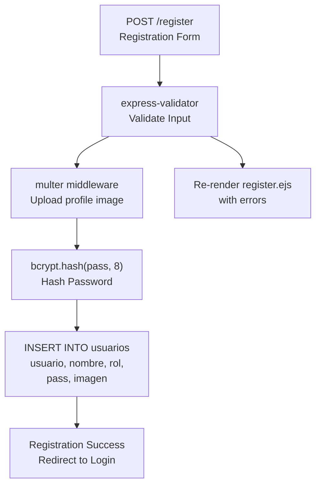
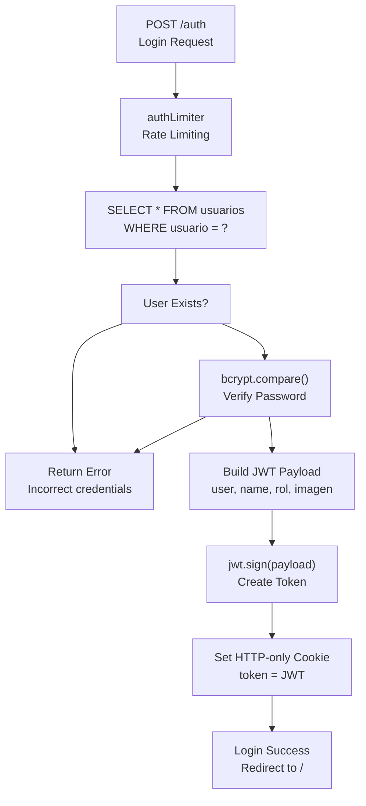
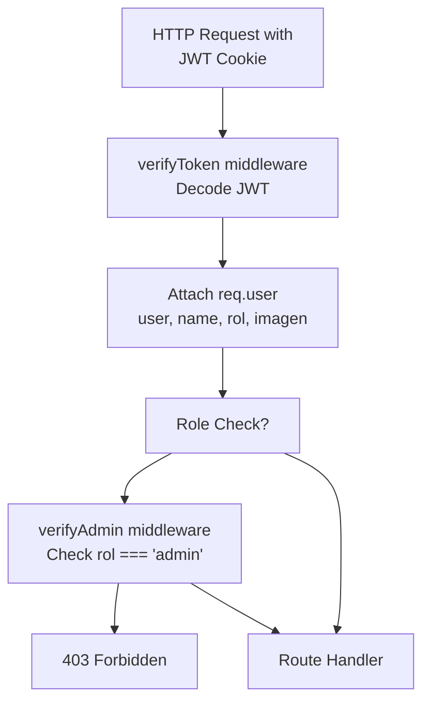

# usuarios Table

> **Relevant source files**
> * [proyecto.zip](https://github.com/moichuelo/registro/blob/544abbcc/proyecto.zip)
> * [src/router.js](https://github.com/moichuelo/registro/blob/544abbcc/src/router.js)

## Purpose and Scope

This document details the structure, purpose, and usage of the `usuarios` table in the MySQL database. The `usuarios` table is the authoritative source for user authentication credentials, role-based access control, and user profile information. It serves as the foundation for the authentication system and is referenced throughout the application for login, registration, authorization, and user identification.

For information about the complete database architecture, see [Database Schema](Database-Schema.md). For details on authentication flows that use this table, see [Authentication & Authorization](Authentication-&-Authorization.md).

---

## Table Overview

The `usuarios` table stores all registered user accounts in the system. Each record represents a unique user and contains their authentication credentials, role assignment, display name, and optional profile image reference. The table supports two user roles: `admin` and `user`, which determine access permissions throughout the application.

**Primary Functions:**

* Store user credentials for authentication
* Maintain role assignments for authorization
* Store user profile information (name, profile image)
* Serve as the primary key reference for the `mensajes` table

**Sources:**

* [src/router.js L456-L465](https://github.com/moichuelo/registro/blob/544abbcc/src/router.js#L456-L465)
* [src/router.js L537-L556](https://github.com/moichuelo/registro/blob/544abbcc/src/router.js#L537-L556)

---

## Schema Definition

The `usuarios` table contains the following columns:

| Column Name | Data Type | Constraints | Description |
| --- | --- | --- | --- |
| `usuario` | VARCHAR | PRIMARY KEY, NOT NULL | Unique username identifier. Used as the primary authentication identifier and as the key for JWT tokens. |
| `nombre` | VARCHAR | NOT NULL | User's display name. Stored during registration and included in JWT payload for display purposes. |
| `rol` | VARCHAR/ENUM | NOT NULL | User role, either `'admin'` or `'user'`. Determines access permissions throughout the application. |
| `pass` | VARCHAR | NOT NULL | bcrypt-hashed password. Stored with a salt factor of 8. Never returned in queries to clients. |
| `imagen` | VARCHAR | NULL | Filename of user's profile image stored in `public/resources/uploads/`. Optional field that may be NULL if no image uploaded. |

### Column Details

#### usuario (Primary Key)

* Acts as the unique identifier for users across the system
* Must be at least 4 characters during registration validation
* Used in JWT tokens as the `user` field
* Referenced by foreign keys in the `mensajes` table for `de_usuario` and `para_usuario` columns

#### nombre

* Display name shown in the UI
* Included in JWT payload as `name` field
* Must be at least 4 characters during registration validation
* Displayed in headers, chat interfaces, and admin panels

#### rol

* Determines authorization level via `verifyAdmin` middleware
* Two valid values: `'admin'` and `'user'`
* Admin users have access to product management, support chat monitoring, and administrative APIs
* Regular users have access to their own profile and support chat features

#### pass

* Stored as a bcrypt hash with salt factor of 8
* Never transmitted to client or included in JWT tokens
* Compared using `bcrypt.compare()` during authentication
* Hash generated during registration using `bcrypt.hash(pass, 8)`

#### imagen

* Stores only the filename, not the full path
* Full path is `public/resources/uploads/{imagen}`
* Uploaded via multer middleware during registration
* Included in JWT payload and displayed in UI headers

**Sources:**

* [src/router.js L414-L484](https://github.com/moichuelo/registro/blob/544abbcc/src/router.js#L414-L484)
* [src/router.js L532-L601](https://github.com/moichuelo/registro/blob/544abbcc/src/router.js#L532-L601)

---

## Entity-Relationship Diagram

```css
#mermaid-dsy4fbyhham{font-family:ui-sans-serif,-apple-system,system-ui,Segoe UI,Helvetica;font-size:16px;fill:#333;}@keyframes edge-animation-frame{from{stroke-dashoffset:0;}}@keyframes dash{to{stroke-dashoffset:0;}}#mermaid-dsy4fbyhham .edge-animation-slow{stroke-dasharray:9,5!important;stroke-dashoffset:900;animation:dash 50s linear infinite;stroke-linecap:round;}#mermaid-dsy4fbyhham .edge-animation-fast{stroke-dasharray:9,5!important;stroke-dashoffset:900;animation:dash 20s linear infinite;stroke-linecap:round;}#mermaid-dsy4fbyhham .error-icon{fill:#dddddd;}#mermaid-dsy4fbyhham .error-text{fill:#222222;stroke:#222222;}#mermaid-dsy4fbyhham .edge-thickness-normal{stroke-width:1px;}#mermaid-dsy4fbyhham .edge-thickness-thick{stroke-width:3.5px;}#mermaid-dsy4fbyhham .edge-pattern-solid{stroke-dasharray:0;}#mermaid-dsy4fbyhham .edge-thickness-invisible{stroke-width:0;fill:none;}#mermaid-dsy4fbyhham .edge-pattern-dashed{stroke-dasharray:3;}#mermaid-dsy4fbyhham .edge-pattern-dotted{stroke-dasharray:2;}#mermaid-dsy4fbyhham .marker{fill:#999;stroke:#999;}#mermaid-dsy4fbyhham .marker.cross{stroke:#999;}#mermaid-dsy4fbyhham svg{font-family:ui-sans-serif,-apple-system,system-ui,Segoe UI,Helvetica;font-size:16px;}#mermaid-dsy4fbyhham p{margin:0;}#mermaid-dsy4fbyhham .entityBox{fill:#ffffff;stroke:#dddddd;}#mermaid-dsy4fbyhham .relationshipLabelBox{fill:#dddddd;opacity:0.7;background-color:#dddddd;}#mermaid-dsy4fbyhham .relationshipLabelBox rect{opacity:0.5;}#mermaid-dsy4fbyhham .labelBkg{background-color:rgba(221, 221, 221, 0.5);}#mermaid-dsy4fbyhham .edgeLabel .label{fill:#dddddd;font-size:14px;}#mermaid-dsy4fbyhham .label{font-family:ui-sans-serif,-apple-system,system-ui,Segoe UI,Helvetica;color:#333;}#mermaid-dsy4fbyhham .edge-pattern-dashed{stroke-dasharray:8,8;}#mermaid-dsy4fbyhham .node rect,#mermaid-dsy4fbyhham .node circle,#mermaid-dsy4fbyhham .node ellipse,#mermaid-dsy4fbyhham .node polygon{fill:#ffffff;stroke:#dddddd;stroke-width:1px;}#mermaid-dsy4fbyhham .relationshipLine{stroke:#999;stroke-width:1;fill:none;}#mermaid-dsy4fbyhham .marker{fill:none!important;stroke:#999!important;stroke-width:1;}#mermaid-dsy4fbyhham :root{--mermaid-font-family:"trebuchet ms",verdana,arial,sans-serif;}de_usuario (sender)para_usuario (recipient)usuariosVARCHARusuarioPKUsername (Primary Key)VARCHARnombreDisplay nameVARCHARroladmin or userVARCHARpassbcrypt hashVARCHARimagenProfile image filenamemensajesVARCHARde_usuarioFKVARCHARpara_usuarioFKTEXTmensajeDATETIMEfecha
```

**Diagram: usuarios Table Relationships**

The `usuarios` table has a one-to-many relationship with the `mensajes` table through two foreign key columns:

* `mensajes.de_usuario` references `usuarios.usuario` (message sender)
* `mensajes.para_usuario` references `usuarios.usuario` (message recipient)

This design allows tracking of all messages sent and received by each user.

**Sources:**

* [src/router.js L236-L253](https://github.com/moichuelo/registro/blob/544abbcc/src/router.js#L236-L253)
* [src/router.js L263-L280](https://github.com/moichuelo/registro/blob/544abbcc/src/router.js#L263-L280)
* [src/router.js L292-L315](https://github.com/moichuelo/registro/blob/544abbcc/src/router.js#L292-L315)

---

## Data Operations

### Registration Flow



**Diagram: User Registration Data Flow**

During registration, the following INSERT statement is executed:

```sql
INSERT INTO usuarios SET ?
```

With values:

* `usuario`: req.body.user (validated, minimum 4 characters)
* `nombre`: req.body.name (validated, minimum 4 characters)
* `rol`: req.body.rol (from form selection)
* `pass`: bcrypt hash of req.body.pass
* `imagen`: req.file.filename (if uploaded) or NULL

**Sources:**

* [src/router.js L414-L484](https://github.com/moichuelo/registro/blob/544abbcc/src/router.js#L414-L484)
* [src/router.js L446-L453](https://github.com/moichuelo/registro/blob/544abbcc/src/router.js#L446-L453)
* [src/router.js L456-L481](https://github.com/moichuelo/registro/blob/544abbcc/src/router.js#L456-L481)

### Authentication Flow



**Diagram: Authentication Query Flow**

The authentication query retrieves the complete user record:

```sql
SELECT * FROM usuarios WHERE usuario = ?
```

The result is used to:

1. Verify password with `bcrypt.compare(pass, results[0].pass)`
2. Build JWT payload with `usuario`, `nombre`, `rol`, `imagen`
3. Generate signed token valid for 1 hour

**Sources:**

* [src/router.js L532-L601](https://github.com/moichuelo/registro/blob/544abbcc/src/router.js#L532-L601)
* [src/router.js L537-L556](https://github.com/moichuelo/registro/blob/544abbcc/src/router.js#L537-L556)
* [src/router.js L559-L574](https://github.com/moichuelo/registro/blob/544abbcc/src/router.js#L559-L574)

### Authorization Queries



**Diagram: Authorization Using usuarios Data**

Authorization does not query the database on each request. Instead, the `rol` field from the `usuarios` table is:

1. Encoded into the JWT during login
2. Decoded by `verifyToken` middleware
3. Checked by `verifyAdmin` middleware for admin-only routes

**Admin User Identification Query:**

Several queries identify admin users for features like the support chat system:

```sql
SELECT usuario FROM usuarios WHERE rol = 'admin'
```

This is used in the admin conversation list to exclude admin users from the user list:

```sql
WHERE usuario NOT IN (SELECT usuario FROM usuarios WHERE rol = 'admin')
```

**Sources:**

* [src/router.js L292-L315](https://github.com/moichuelo/registro/blob/544abbcc/src/router.js#L292-L315)
* [src/middlewares/verifyToken.js](https://github.com/moichuelo/registro/blob/544abbcc/src/middlewares/verifyToken.js)
* [src/middlewares/verifyAdmin.js](https://github.com/moichuelo/registro/blob/544abbcc/src/middlewares/verifyAdmin.js)

---

## Usage Patterns

### JWT Payload Structure

When a user successfully authenticates, data from the `usuarios` table populates the JWT payload:

```javascript
const payload = {
    user: results[0].usuario,      // from usuarios.usuario
    name: results[0].nombre,       // from usuarios.nombre
    rol: results[0].rol,           // from usuarios.rol
    imagen: results[0].imagen      // from usuarios.imagen
};
```

This payload is:

* Signed with `JWT_SECRET`
* Stored in an HTTP-only cookie named `token`
* Valid for 1 hour (`expiresIn: "1h"`)
* Decoded by `verifyToken` middleware on subsequent requests

**Sources:**

* [src/router.js L559-L567](https://github.com/moichuelo/registro/blob/544abbcc/src/router.js#L559-L567)
* [src/router.js L570-L574](https://github.com/moichuelo/registro/blob/544abbcc/src/router.js#L570-L574)

### Profile Image Storage

Profile images are stored using a two-part approach:

1. **File System:** Actual image file in `public/resources/uploads/`
2. **Database:** Filename only in `usuarios.imagen`

During registration with file upload:

* Multer saves file to `public/resources/uploads/` with generated filename
* Filename (not path) stored in `usuarios.imagen` column
* Retrieved filename used to construct image URL in views

**Sources:**

* [src/router.js L414](https://github.com/moichuelo/registro/blob/544abbcc/src/router.js#L414-L414)
* [src/router.js L450](https://github.com/moichuelo/registro/blob/544abbcc/src/router.js#L450-L450)
* [src/router.js L463](https://github.com/moichuelo/registro/blob/544abbcc/src/router.js#L463-L463)

### Role-Based Access Control

The `rol` column drives all authorization decisions:

**Admin-Only Routes:**

* `/admin` - Product management dashboard
* `/api/mensajes?con=usuario` - View any user's messages
* `/api/usuarios-conversaciones` - List all conversations

**User Routes:**

* `/soporte` - Support chat interface
* `/api/mensajes/mios` - View own messages only

**Verification Pattern:**

```
HTTP Request → verifyToken → (if admin required) → verifyAdmin → Route Handler
```

The middleware stack checks `req.user.rol === 'admin'` for admin routes.

**Sources:**

* [src/router.js L119-L134](https://github.com/moichuelo/registro/blob/544abbcc/src/router.js#L119-L134)
* [src/router.js L229-L253](https://github.com/moichuelo/registro/blob/544abbcc/src/router.js#L229-L253)
* [src/router.js L283-L315](https://github.com/moichuelo/registro/blob/544abbcc/src/router.js#L283-L315)

---

## Security Considerations

### Password Hashing

All passwords are hashed using bcrypt with a salt factor of 8 before storage:

```javascript
const passwordHash = await bcrypt.hash(pass, 8);
```

The hash:

* Is one-way (cannot be reversed to plaintext)
* Includes salt to prevent rainbow table attacks
* Is verified using `bcrypt.compare()` which handles salt extraction

The plaintext password is **never** stored or transmitted after hashing.

**Sources:**

* [src/router.js L453](https://github.com/moichuelo/registro/blob/544abbcc/src/router.js#L453-L453)
* [src/router.js L541-L543](https://github.com/moichuelo/registro/blob/544abbcc/src/router.js#L541-L543)

### SQL Injection Prevention

All queries use parameterized statements with placeholders (`?`):

```sql
SELECT * FROM usuarios WHERE usuario = ?
INSERT INTO usuarios SET ?
```

The database driver handles escaping, preventing SQL injection attacks.

**Sources:**

* [src/router.js L537-L556](https://github.com/moichuelo/registro/blob/544abbcc/src/router.js#L537-L556)
* [src/router.js L456-L481](https://github.com/moichuelo/registro/blob/544abbcc/src/router.js#L456-L481)

### Credential Validation

Registration enforces minimum security requirements via `express-validator`:

* Username: Minimum 4 characters
* Name: Minimum 4 characters
* Password: Minimum 4 characters
* Email: Valid email format validation

**Sources:**

* [src/router.js L416-L427](https://github.com/moichuelo/registro/blob/544abbcc/src/router.js#L416-L427)

### Rate Limiting

The `/auth` endpoint uses `authLimiter` middleware to prevent brute-force attacks. This limits authentication attempts per IP address.

**Sources:**

* [src/router.js L532](https://github.com/moichuelo/registro/blob/544abbcc/src/router.js#L532-L532)

---

## Related Tables

### mensajes Table

The `mensajes` table references `usuarios` through two foreign keys:

* `de_usuario` (sender): References `usuarios.usuario`
* `para_usuario` (recipient): References `usuarios.usuario`

For complete details on message storage and retrieval, see [mensajes Table](mensajes-Table.md).

### productos Table

The `productos` table is not directly related to `usuarios` but admin access is controlled by the `usuarios.rol` field. Only users with `rol = 'admin'` can create, update, or delete products.

For product management details, see [productos Table](productos-Table.md).

**Sources:**

* [src/router.js L236-L253](https://github.com/moichuelo/registro/blob/544abbcc/src/router.js#L236-L253)
* [src/router.js L292-L315](https://github.com/moichuelo/registro/blob/544abbcc/src/router.js#L292-L315)

---

## Database Connection

The `usuarios` table is accessed through the MySQL connection pool configured in `database/db.js`. All queries use this connection:

```javascript
const db = require("../database/db");
db.query("SELECT * FROM usuarios WHERE usuario = ?", [user], callback);
```

**Sources:**

* [src/router.js L5](https://github.com/moichuelo/registro/blob/544abbcc/src/router.js#L5-L5)
* [database/db.js](https://github.com/moichuelo/registro/blob/544abbcc/database/db.js)