# verifyToken Middleware

> **Relevant source files**
> * [src/middlewares/verifyToken.js](https://github.com/moichuelo/registro/blob/544abbcc/src/middlewares/verifyToken.js)
> * [src/router.js](https://github.com/moichuelo/registro/blob/544abbcc/src/router.js)

## Purpose and Scope

The `verifyToken` middleware is a critical authentication component that validates JSON Web Tokens (JWT) from HTTP cookies and attaches authenticated user information to incoming requests. This middleware serves as the primary gatekeeper for protected routes, ensuring that only authenticated users can access specific endpoints.

This page documents the middleware implementation, verification flow, integration with the routing system, and error handling. For information about JWT token generation and storage during login, see [JWT Token Management](JWT-Token-Management.md). For role-based authorization that builds on top of token verification, see [verifyAdmin Middleware](verifyAdmin-Middleware.md).

**Sources:** [src/middlewares/verifyToken.js L1-L17](https://github.com/moichuelo/registro/blob/544abbcc/src/middlewares/verifyToken.js#L1-L17)

---

## Middleware Implementation

The `verifyToken` middleware is implemented in a single, focused function that performs JWT validation. The complete implementation is located at [src/middlewares/verifyToken.js L1-L17](https://github.com/moichuelo/registro/blob/544abbcc/src/middlewares/verifyToken.js#L1-L17)

### Core Function Structure

```
verifyToken(req, res, next)
```

The middleware follows the standard Express middleware signature, accepting the request object, response object, and next function.

| Step | Action | Code Reference |
| --- | --- | --- |
| 1 | Extract token from cookies | [src/middlewares/verifyToken.js L4](https://github.com/moichuelo/registro/blob/544abbcc/src/middlewares/verifyToken.js#L4-L4) |
| 2 | Check token existence | [src/middlewares/verifyToken.js L6](https://github.com/moichuelo/registro/blob/544abbcc/src/middlewares/verifyToken.js#L6-L6) |
| 3 | Verify token with JWT secret | [src/middlewares/verifyToken.js L9](https://github.com/moichuelo/registro/blob/544abbcc/src/middlewares/verifyToken.js#L9-L9) |
| 4 | Attach payload to request | [src/middlewares/verifyToken.js L10](https://github.com/moichuelo/registro/blob/544abbcc/src/middlewares/verifyToken.js#L10-L10) |
| 5 | Pass control to next middleware | [src/middlewares/verifyToken.js L11](https://github.com/moichuelo/registro/blob/544abbcc/src/middlewares/verifyToken.js#L11-L11) |

### Token Extraction

The middleware extracts the JWT token from the `token` cookie using the `cookie-parser` middleware that runs earlier in the request pipeline:

```javascript
const token = req.cookies.token;
```

This assumes that `cookie-parser` has already processed the request and populated `req.cookies`. The token itself was set during the login process at [src/router.js L570-L574](https://github.com/moichuelo/registro/blob/544abbcc/src/router.js#L570-L574)

**Sources:** [src/middlewares/verifyToken.js L3-L6](https://github.com/moichuelo/registro/blob/544abbcc/src/middlewares/verifyToken.js#L3-L6)

---

## Token Verification Flow

The following diagram illustrates the complete verification flow when a request encounters the `verifyToken` middleware:

```mermaid
flowchart TD

Request["Incoming Request"]
ExtractToken["Extract token from req.cookies.token"]
CheckExists["Token exists?"]
VerifyToken["jwt.verify(token, JWT_SECRET)"]
VerifySuccess["Verification<br>successful?"]
AttachPayload["req.user = payload"]
CallNext["next()"]
Return401["return res.status(401)<br>.send('No autenticado')"]
Return403["return res.status(403)<br>.send('Token inválido')"]
RouteHandler["Route Handler Executes"]
End["Response Sent"]

Request --> ExtractToken
ExtractToken --> CheckExists
CheckExists --> Return401
CheckExists --> VerifyToken
VerifyToken --> VerifySuccess
VerifySuccess --> AttachPayload
VerifySuccess --> Return403
AttachPayload --> CallNext
CallNext --> RouteHandler
Return401 --> End
Return403 --> End
```



**Token Verification Process:**

### JWT Payload Structure

Upon successful verification, the middleware attaches the decoded JWT payload to `req.user`. The payload structure matches what was created during login at [src/router.js L559-L564](https://github.com/moichuelo/registro/blob/544abbcc/src/router.js#L559-L564)

:

| Field | Description | Example |
| --- | --- | --- |
| `user` | Username from `usuarios.usuario` | `"john_doe"` |
| `name` | Display name from `usuarios.nombre` | `"John Doe"` |
| `rol` | User role from `usuarios.rol` | `"admin"` or `"user"` |
| `imagen` | Profile image filename | `"profile_123.jpg"` or `null` |

**Sources:** [src/middlewares/verifyToken.js L8-L14](https://github.com/moichuelo/registro/blob/544abbcc/src/middlewares/verifyToken.js#L8-L14)

 [src/router.js L559-L564](https://github.com/moichuelo/registro/blob/544abbcc/src/router.js#L559-L564)

---

## Integration with Routes

The `verifyToken` middleware is imported into the router module and applied to protected routes requiring authentication. The following diagram shows the relationship between the middleware, routes, and route handlers:


### Protected Routes Summary

The following table lists all routes protected by `verifyToken`:

| Route | HTTP Method | Purpose | Line Reference |
| --- | --- | --- | --- |
| `/admin` | GET | Admin dashboard with product list | [src/router.js L119](https://github.com/moichuelo/registro/blob/544abbcc/src/router.js#L119-L119) |
| `/pdfAdmin` | GET | PDF preview of products | [src/router.js L136](https://github.com/moichuelo/registro/blob/544abbcc/src/router.js#L136-L136) |
| `/soporte` | GET | Support chat interface | [src/router.js L220](https://github.com/moichuelo/registro/blob/544abbcc/src/router.js#L220-L220) |
| `/api/mensajes/mios` | GET | Retrieve user's own messages | [src/router.js L256](https://github.com/moichuelo/registro/blob/544abbcc/src/router.js#L256-L256) |
| `/pdf/descargar` | GET | Generate and download PDF (Puppeteer) | [src/router.js L317](https://github.com/moichuelo/registro/blob/544abbcc/src/router.js#L317-L317) |
| `/pdfkit/descargar` | GET | Generate and download PDF (PDFKit) | [src/router.js L355](https://github.com/moichuelo/registro/blob/544abbcc/src/router.js#L355-L355) |

**Sources:** [src/router.js L16](https://github.com/moichuelo/registro/blob/544abbcc/src/router.js#L16-L16)

 [src/router.js L119](https://github.com/moichuelo/registro/blob/544abbcc/src/router.js#L119-L119)

 [src/router.js L136](https://github.com/moichuelo/registro/blob/544abbcc/src/router.js#L136-L136)

 [src/router.js L220](https://github.com/moichuelo/registro/blob/544abbcc/src/router.js#L220-L220)

 [src/router.js L256](https://github.com/moichuelo/registro/blob/544abbcc/src/router.js#L256-L256)

 [src/router.js L317](https://github.com/moichuelo/registro/blob/544abbcc/src/router.js#L317-L317)

 [src/router.js L355](https://github.com/moichuelo/registro/blob/544abbcc/src/router.js#L355-L355)

---

## Request Processing Pipeline

The following diagram illustrates how `verifyToken` fits into the complete request processing pipeline, showing the middleware stack and the order of execution:

```mermaid
sequenceDiagram
  participant Client
  participant Express
  participant cookie-parser
  participant verifyToken
  participant Route Handler
  participant MySQL DB

  Client->>Express: GET /admin with Cookie: token=xyz
  Express->>cookie-parser: Process request
  cookie-parser->>cookie-parser: Parse cookies into req.cookies
  cookie-parser->>verifyToken: next()
  verifyToken->>verifyToken: Extract req.cookies.token
  loop [Verification fails]
    verifyToken-->>Client: 401 No autenticado
    verifyToken->>verifyToken: jwt.verify(token, JWT_SECRET)
    verifyToken-->>Client: 403 Token inválido
    verifyToken->>verifyToken: req.user = payload
    verifyToken->>Route Handler: next()
    Route Handler->>MySQL DB: Query data
    MySQL DB-->>Route Handler: Results
    Route Handler-->>Client: 200 Response with data
  end
```



**Sources:** [src/middlewares/verifyToken.js L3-L14](https://github.com/moichuelo/registro/blob/544abbcc/src/middlewares/verifyToken.js#L3-L14)

 [src/router.js L119-L134](https://github.com/moichuelo/registro/blob/544abbcc/src/router.js#L119-L134)

---

## Error Handling

The `verifyToken` middleware implements two distinct error conditions with different HTTP status codes:

### 401 Unauthorized - Missing Token

Returned when the `token` cookie is not present in the request. This occurs when:

* User has not logged in
* Token cookie has expired
* Cookie was manually deleted
* Request is made without cookies

**Implementation:** [src/middlewares/verifyToken.js L6](https://github.com/moichuelo/registro/blob/544abbcc/src/middlewares/verifyToken.js#L6-L6)

```
if (!token) return res.status(401).send("No autenticado");
```

### 403 Forbidden - Invalid Token

Returned when JWT verification fails inside the try-catch block. This occurs when:

* Token has been tampered with
* Token signature is invalid
* Token has expired (JWT expiration is 1 hour from [src/router.js L567](https://github.com/moichuelo/registro/blob/544abbcc/src/router.js#L567-L567) )
* Token was signed with a different secret

**Implementation:** [src/middlewares/verifyToken.js L12-L13](https://github.com/moichuelo/registro/blob/544abbcc/src/middlewares/verifyToken.js#L12-L13)

```
catch (err) {
    return res.status(403).send("Token inválido");
}
```

### Error Response Flow


**Sources:** [src/middlewares/verifyToken.js L6-L14](https://github.com/moichuelo/registro/blob/544abbcc/src/middlewares/verifyToken.js#L6-L14)

---

## Security Considerations

The `verifyToken` middleware implements several security best practices:

### HTTP-Only Cookies

The JWT token is stored in an HTTP-only cookie (set at [src/router.js L570-L574](https://github.com/moichuelo/registro/blob/544abbcc/src/router.js#L570-L574)

), which prevents JavaScript access to the token, mitigating XSS attacks. The middleware reads from `req.cookies.token`, which is only accessible server-side.

### Secret Key Verification

The middleware uses `process.env.JWT_SECRET` to verify token signatures. This secret is:

* Stored in environment variables (not in code)
* Used for both signing (during login) and verification
* Required for the `jwt.verify()` call to succeed

### Token Expiration

While the middleware itself doesn't check expiration explicitly, the `jwt.verify()` function automatically validates the `exp` claim in the token. Tokens are created with a 1-hour expiration at [src/router.js L567](https://github.com/moichuelo/registro/blob/544abbcc/src/router.js#L567-L567)

### Synchronous Verification

The `jwt.verify()` call at [src/middlewares/verifyToken.js L9](https://github.com/moichuelo/registro/blob/544abbcc/src/middlewares/verifyToken.js#L9-L9)

 is synchronous, which is appropriate for the verification use case and prevents timing attacks that could occur with asynchronous operations.

**Sources:** [src/middlewares/verifyToken.js L9](https://github.com/moichuelo/registro/blob/544abbcc/src/middlewares/verifyToken.js#L9-L9)

 [src/router.js L567](https://github.com/moichuelo/registro/blob/544abbcc/src/router.js#L567-L567)

 [src/router.js L570-L574](https://github.com/moichuelo/registro/blob/544abbcc/src/router.js#L570-L574)

---

## Usage in Route Definitions

The middleware is applied to routes using Express's standard middleware pattern. Here are concrete examples from the codebase:

### Single Middleware Application

```javascript
router.get("/admin", verifyToken, (req, res) => {
    // req.user is now available
    db.query("SELECT * FROM productos", (error, results) => {
        res.render("admin", {
            productos: results,
            user: req.user,  // Access authenticated user
            login: true,
            rol: req.user.rol
        });
    });
});
```

**Location:** [src/router.js L119-L134](https://github.com/moichuelo/registro/blob/544abbcc/src/router.js#L119-L134)

### Chained Middleware Application

For admin-only routes, `verifyToken` is chained with `verifyAdmin`:

```javascript
router.get("/api/mensajes", verifyAdmin, (req, res) => {
    // verifyAdmin internally ensures verifyToken runs first
    // Both req.user and admin role are validated
});
```

**Location:** [src/router.js L229](https://github.com/moichuelo/registro/blob/544abbcc/src/router.js#L229-L229)

### Accessing User Information

After successful verification, route handlers access the authenticated user through `req.user`:

| Property | Access Pattern | Example |
| --- | --- | --- |
| Username | `req.user.user` | Used at [src/router.js L223](https://github.com/moichuelo/registro/blob/544abbcc/src/router.js#L223-L223) |
| Display Name | `req.user.name` | Used at [src/router.js L65](https://github.com/moichuelo/registro/blob/544abbcc/src/router.js#L65-L65) |
| Role | `req.user.rol` | Used at [src/router.js L130](https://github.com/moichuelo/registro/blob/544abbcc/src/router.js#L130-L130) |
| Profile Image | `req.user.imagen` | Included in payload |

**Sources:** [src/router.js L119-L134](https://github.com/moichuelo/registro/blob/544abbcc/src/router.js#L119-L134)

 [src/router.js L220-L227](https://github.com/moichuelo/registro/blob/544abbcc/src/router.js#L220-L227)

 [src/router.js L229](https://github.com/moichuelo/registro/blob/544abbcc/src/router.js#L229-L229)

 [src/router.js L256-L280](https://github.com/moichuelo/registro/blob/544abbcc/src/router.js#L256-L280)

---

## Relationship with Authentication Flow

The `verifyToken` middleware is the validation counterpart to the token generation that occurs during login:


**Sources:** [src/router.js L532-L601](https://github.com/moichuelo/registro/blob/544abbcc/src/router.js#L532-L601)

 [src/middlewares/verifyToken.js L1-L17](https://github.com/moichuelo/registro/blob/544abbcc/src/middlewares/verifyToken.js#L1-L17)